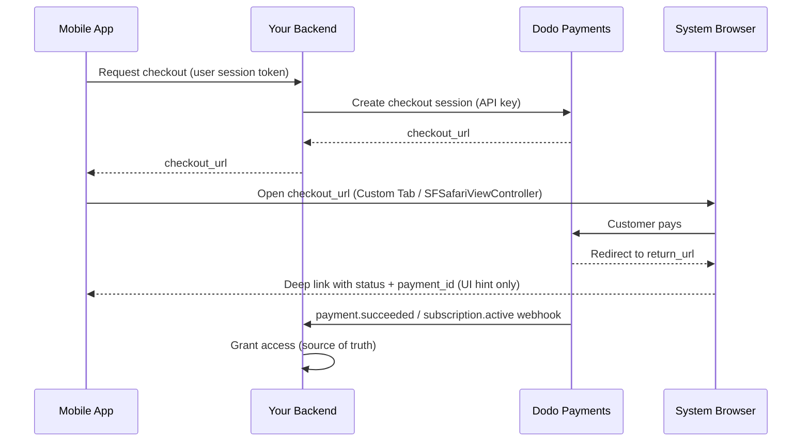

<CardGroup cols={4}>
<Card title="Quick Start" icon="rocket" href="#integration-workflow">
  Pon en marcha tu integración de pagos móviles en 4 sencillos pasos
</Card>

<Card title="Platform Examples" icon="code" href="#choose-your-sdk">
  Ejemplos de código completos para Android, iOS, React Native y Flutter
</Card>

<Card title="Checkout Customization" icon="sliders" href="#checkout-page-customization">
  Configura temas, prellenado y 14 parámetros específicos para móviles
</Card>

<Card title="Mobile Recipes" icon="flask" href="#mobile-optimized-recipes">
  Configuraciones de checkout listas para copiar y pegar para 5 escenarios móviles habituales
</Card>
</CardGroup>

<Info>
Dodo Payments ofrece un SDK oficial de checkout para **Android, iOS, React Native,
y Flutter**. Cada uno encapsula el patrón documentado a continuación (abrir la
URL del checkout, capturar el retorno y analizar el resultado) detrás de una única
llamada tipada `start(...)`, con recuperación de sesiones abandonadas integrada. Usa un
WebView manual únicamente si ninguno se adapta a tu stack.
</Info>

## Requisitos previos

Antes de integrar Dodo Payments en tu aplicación móvil, asegúrate de tener:

- **Cuenta de Dodo Payments**: Cuenta de comerciante activa con acceso a la API
- **Credenciales de API**: Clave de API y clave secreta de webhook desde tu dashboard
- **Proyecto de aplicación móvil**: Aplicación Android, iOS, React Native o Flutter
- **Servidor backend**: Para gestionar de forma segura la creación de sesiones de checkout

## Flujo de integración

La integración móvil sigue un proceso seguro de 4 pasos en el que tu backend gestiona las llamadas a la API y tu aplicación móvil administra la experiencia del usuario.



<Info>
El `status` del deep link es únicamente una **indicación de UI** sobre lo que debes mostrar al usuario. Concede siempre el acceso desde el **webhook** `payment.succeeded` / `subscription.active` en tu backend, nunca basándote solo en el resultado móvil.
</Info>

<Steps>
<Step title="Backend: Create Checkout Session">
<Card title="Checkout Session API Docs" icon="book" href="/developer-resources/checkout-session">
Aprende a crear una sesión de checkout en tu backend usando Node.js, Python y más. Consulta ejemplos completos y referencias de parámetros en la documentación específica de <strong>Checkout Sessions API</strong>.
</Card>
<Note>
**Seguridad**: Las sesiones de checkout deben crearse en tu servidor backend, nunca en la aplicación móvil. Esto protege tus claves de API y garantiza una validación adecuada.
</Note>

</Step>

<Step title="Mobile: Get Checkout URL">

Tu aplicación móvil llama a tu backend para obtener la URL del checkout. Autentica
esta solicitud con el token de sesión propio del usuario que ha iniciado sesión.

<Tabs>
<Tab title="iOS (Swift)">

```swift
func getCheckoutURL(productId: String, customerEmail: String, customerName: String) async throws -> String {
    let url = URL(string: "https://your-backend.com/api/create-checkout-session")!
    var request = URLRequest(url: url)
    request.httpMethod = "POST"
    request.setValue("application/json", forHTTPHeaderField: "Content-Type")
    request.setValue("Bearer \(userSessionToken)", forHTTPHeaderField: "Authorization")
    
    let requestData: [String: Any] = [
        "productId": productId,
        "customerEmail": customerEmail,
        "customerName": customerName
    ]
    request.httpBody = try JSONSerialization.data(withJSONObject: requestData)
    
    let (data, _) = try await URLSession.shared.data(for: request)
    let response = try JSONDecoder().decode(CheckoutResponse.self, from: data)
    return response.checkout_url
}
```

</Tab>
<Tab title="Android (Kotlin)">

```kotlin
suspend fun getCheckoutURL(productId: String, customerEmail: String, customerName: String): String {
    val client = OkHttpClient()
    val requestBody = JSONObject().apply {
        put("productId", productId)
        put("customerEmail", customerEmail)
        put("customerName", customerName)
    }.toString().toRequestBody("application/json".toMediaType())
    
    val request = Request.Builder()
        .url("https://your-backend.com/api/create-checkout-session")
        .header("Authorization", "Bearer $userSessionToken")
        .post(requestBody)
        .build()
    
    val response = client.newCall(request).execute()
    val responseBody = response.body?.string()
    val jsonResponse = JSONObject(responseBody ?: "")
    return jsonResponse.getString("checkout_url")
}
```

</Tab>
<Tab title="React Native (JavaScript)">

```javascript
const getCheckoutURL = async (productId, customerEmail, customerName) => {
  try {
    const response = await fetch('https://your-backend.com/api/create-checkout-session', {
      method: 'POST',
      headers: {
        'Content-Type': 'application/json',
        'Authorization': `Bearer ${userSessionToken}`,
      },
      body: JSON.stringify({
        productId,
        customerEmail,
        customerName
      })
    });
    
    const data = await response.json();
    return data.checkout_url;
  } catch (error) {
    console.error('Failed to get checkout URL:', error);
    throw error;
  }
};
```

</Tab>
<Tab title="Flutter (Dart)">

```dart
import 'dart:convert';
import 'package:http/http.dart' as http;

Future<String> getCheckoutUrl({
  required String productId,
  required String customerEmail,
  required String customerName,
}) async {
  final response = await http.post(
    Uri.parse('https://your-backend.com/api/create-checkout-session'),
    headers: {
      'Content-Type': 'application/json',
      'Authorization': 'Bearer $userSessionToken',
    },
    body: jsonEncode({
      'productId': productId,
      'customerEmail': customerEmail,
      'customerName': customerName,
    }),
  );

  if (response.statusCode != 200) {
    throw Exception('Failed to get checkout URL: ${response.statusCode}');
  }
  return jsonDecode(response.body)['checkout_url'] as String;
}
```

</Tab>
</Tabs>
<Note>
**Seguridad**: Las aplicaciones móviles solo se comunican con tu backend, nunca directamente con la API de Dodo Payments.
</Note>
</Step>

<Step title="Mobile: Open Checkout in Browser">
Abre la URL del checkout en un navegador seguro dentro de la aplicación para procesar el pago.
O evita por completo la configuración manual con el SDK oficial de checkout para tu
plataforma.

<Card title="Pick your mobile SDK" icon="box" href="#choose-your-sdk">
  Pasos de instalación e instrucciones de configuración para Android, iOS, React Native y Flutter.
</Card>

</Step>

<Step title="Backend: Handle Payment Completion">
Procesa la finalización del pago mediante webhooks y URLs de redirección para confirmar el estado del pago.
</Step>
</Steps>

## Elige tu SDK

Cada SDK móvil expone el mismo contrato: una llamada `start(...)` abre el checkout alojado de Dodo en la superficie de navegador nativa de la plataforma y devuelve un `CheckoutResult` tipado cuyo `status` es `succeeded`, `failed`, `cancelled`, `pending` o `expired`. Ninguno contiene una clave de API ni llama a la API de Dodo Payments, y los cuatro admiten la recuperación de sesiones abandonadas.

<CardGroup cols={2}>
<Card title="Android" icon="android" href="/developer-resources/sdks/android">
  `com.dodopayments.api:checkout-android` abre una pestaña personalizada de Chrome. Requiere `minSdk` 23.
</Card>
<Card title="iOS" icon="apple" href="/developer-resources/sdks/ios">
  `dodopayments-mobile-sdk-ios` abre `SFSafariViewController`. Requiere iOS 16 o posterior.
</Card>
<Card title="React Native" icon="react" href="/developer-resources/sdks/react-native">
  `@dodopayments/react-native-checkout`, un Turbo Module sobre ambos núcleos nativos. Requiere React Native 0.76 o posterior.
</Card>
<Card title="Flutter" icon="layer-group" href="/developer-resources/sdks/flutter">
  `dodopayments_checkout`, un canal Pigeon sobre ambos núcleos nativos. Requiere Flutter 3.44 o posterior.
</Card>
</CardGroup>

<Warning>
El `status` que recibes es una indicación de UI, no una prueba de pago. Confirma cada pago desde tu backend mediante el webhook `payment.succeeded` / `subscription.active`, o recuperando el pago con tu clave secreta.
</Warning>

### Registrar un esquema de URL de callback

Los cuatro SDK devuelven el control a tu aplicación mediante un esquema de URL personalizado que tú eliges, por ejemplo `myapp://checkout/return`. Regístralo una vez por plataforma:

<Tabs>
<Tab title="Android">

```kotlin android/app/build.gradle
android {
    defaultConfig {
        manifestPlaceholders["dodoCallbackScheme"] = "myapp"
    }
}
```

El manifest del propio SDK ya declara la actividad de redirección, por lo que no tienes que añadir XML al manifest.
</Tab>
<Tab title="iOS">

```xml Info.plist
<key>CFBundleURLTypes</key>
<array>
  <dict>
    <key>CFBundleURLName</key>
    <string>myapp</string>
    <key>CFBundleURLSchemes</key>
    <array>
      <string>myapp</string>
    </array>
  </dict>
</array>
```

En iOS también debes reenviar las URLs entrantes al SDK, porque
`SFSafariViewController` no puede capturar su propia URL de retorno. Consulta la página de
[iOS](/developer-resources/sdks/ios) o de
[React Native](/developer-resources/sdks/react-native) para consultar el
handler exacto.
</Tab>
<Tab title="Expo">
`@dodopayments/react-native-checkout` incluye un plugin de configuración que registra el esquema para ambas plataformas en `prebuild`. Pásale una opción `scheme`:

```json app.json
{
  "expo": {
    "scheme": "myapp",
    "plugins": [
      [
        "@dodopayments/react-native-checkout",
        { "scheme": "myappcheckout" }
      ]
    ]
  }
}
```

`scheme` debe coincidir con `returnUrl` y ser diferente de `expo.scheme`, que Expo ya registra en `MainActivity`. Consulta la página del [React Native SDK](/developer-resources/sdks/react-native) para obtener más información.

Si `android/app/build.gradle` se mantiene manualmente sin un bloque `defaultConfig { }` estándar, establece el placeholder manualmente en su lugar (consulta la pestaña de Android).

Solo funciona con builds de desarrollo, no con Expo Go. Ejecuta
`npx expo prebuild --clean` después de editar `app.json`.
</Tab>
</Tabs>

<Note>
¿Prefieres implementarlo por tu cuenta? Abre `checkout_url` en el navegador del sistema de la plataforma (Android Custom Tabs / iOS `SFSafariViewController`) e intercepta la navegación hacia tu `return_url`; después, lee los parámetros de consulta `status` y `payment_id`. Los SDK anteriores hacen exactamente esto por ti.
</Note>

<Warning>
**No abras el checkout dentro de un WebView integrado (`WKWebView` / Android `WebView`).** Este es el problema más habitual en las integraciones móviles: un WebView integrado **suprime Apple Pay y Google Pay** y también puede interrumpir los desafíos de 3-D Secure y el autocompletado de tarjetas guardadas, por lo que los clientes ven menos opciones de pago y más errores. Usa siempre el SDK o abre `checkout_url` en el navegador del sistema (Custom Tabs / `SFSafariViewController`). Precisamente por usar esa superficie de navegador nativa, Apple Pay y Google Pay siguen funcionando.
</Warning>

## Personalización de la apariencia

Cada SDK acepta un parámetro opcional `customization` en `start(...)` / `CheckoutParams` que controla la apariencia y el comportamiento de la superficie de navegador nativa: la barra de herramientas, los botones y la presentación. Esto es independiente del tema propio de la página de checkout, que configuras en el servidor mediante [`customization.theme_config`](/developer-resources/checkout-session) en la sesión de checkout.

Las opciones se agrupan por plataforma porque Android Custom Tab e iOS `SFSafariViewController` exponen controles nativos diferentes. Todos los campos son opcionales; omitir por completo `customization` utiliza la apariencia predeterminada de cada plataforma.

<AccordionGroup>
<Accordion title="Android - Custom Tab">

<ParamField body="toolbarColor" type="Color">
Color de fondo de la barra de herramientas.
</ParamField>

<ParamField body="navigationBarColor" type="Color">
Color de la barra de navegación.
</ParamField>

<ParamField body="navigationBarDividerColor" type="Color">
Color del separador situado sobre la barra de navegación.
</ParamField>

<ParamField body="closeButtonStyle" type="'default' | 'back'">
`default` muestra el icono de sistema «X»; `back` dibuja una flecha de retroceso en su lugar.
</ParamField>

<ParamField body="closeButtonPosition" type="'start' | 'end'">
Indica en qué lado de la barra de herramientas aparece el botón de cierre.
</ParamField>

<ParamField body="shareButtonEnabled" type="boolean">
Muestra el icono de compartir de la barra de herramientas.
</ParamField>

<ParamField body="showTitleEnabled" type="boolean">
Muestra el título de la página debajo de la URL en la barra de herramientas.
</ParamField>

<ParamField body="urlBarHidingEnabled" type="boolean">
Permite que la barra de herramientas se oculte automáticamente al desplazarse por la página.
</ParamField>

<ParamField body="bookmarksButtonEnabled" type="boolean">
Muestra «Añadir esta página a marcadores» en el menú de opciones.
</ParamField>

<ParamField body="downloadsButtonEnabled" type="boolean">
Muestra «Descargar página» en el menú de opciones.
</ParamField>

<ParamField body="colorScheme" type="'system' | 'light' | 'dark'">
Fuerza la apariencia clara u oscura independientemente de la configuración del sistema del dispositivo.
</ParamField>

</Accordion>

<Accordion title="iOS - SFSafariViewController">

<ParamField body="dismissButtonStyle" type="'done' | 'close' | 'cancel'">
Etiqueta o icono del botón de cierre.
</ParamField>

<ParamField body="presentationStyle" type="'pageSheet' | 'fullScreen'">
`pageSheet` se presenta como una tarjeta que se puede cerrar deslizando; `fullScreen` cubre toda la pantalla.
</ParamField>

<ParamField body="barCollapsingEnabled" type="boolean">
Permite que la barra de herramientas se contraiga al desplazarse. Solo es visible cuando `presentationStyle` es `fullScreen`; `pageSheet` mantiene las barras fijadas independientemente de esta configuración.
</ParamField>

<ParamField body="colorScheme" type="'system' | 'light' | 'dark'">
Fuerza la apariencia clara u oscura independientemente de la configuración del sistema del dispositivo.
</ParamField>

</Accordion>
</AccordionGroup>

<Tabs>
<Tab title="React Native">

```typescript
const result = await DodoCheckout.start({
  checkoutUrl,
  returnUrl: 'myapp://checkout/return',
  customization: {
    android: { toolbarColor: '#6366F1', closeButtonStyle: 'back' },
    ios: { presentationStyle: 'fullScreen', colorScheme: 'dark' },
  },
});
```

</Tab>
<Tab title="Flutter">

```dart
final result = await DodoCheckout.instance.start(
  CheckoutParams(
    checkoutUrl: Uri.parse(checkoutUrl),
    returnUrl: Uri.parse('myapp://checkout/return'),
    customization: BrowserCustomization(
      android: AndroidBrowserOptions(
        toolbarColor: Color(0xFF6366F1),
        closeButtonStyle: CloseButtonStyle.back,
      ),
      ios: IosBrowserOptions(
        presentationStyle: PresentationStyle.fullScreen,
        colorScheme: BrowserColorScheme.dark,
      ),
    ),
  ),
);
```

</Tab>
<Tab title="Android (Kotlin)">

```kotlin
val result = DodoCheckout.start(
    activity,
    CheckoutParams(
        checkoutUrl = checkoutUrl,
        returnUrl = "myapp://checkout/return",
        customization = BrowserCustomization(
            toolbarColor = Color.parseColor("#6366F1"),
            closeButtonStyle = BrowserCustomization.CloseButtonStyle.BACK,
        )
    )
) { event -> }
```

</Tab>
<Tab title="iOS (Swift)">

```swift
let result = try await DodoCheckout.start(
    checkoutUrl: checkoutUrl,
    returnUrl: URL(string: "myapp://checkout/return")!,
    customization: BrowserCustomization(
        presentationStyle: .fullScreen,
        colorScheme: .dark
    )
)
```

</Tab>
</Tabs>

## Personalización de la página de checkout

La sección [Personalización de la apariencia](#appearance-customization) anterior controla la superficie del navegador nativo: barra de herramientas, botones y combinación de colores. La *propia página* de checkout —los campos que aparecen, el tema y los métodos de pago visibles— se configura en el servidor al crear la sesión de checkout. Estos parámetros tienen el mayor impacto en la conversión móvil.

Los parámetros siguientes se encuentran en tres ubicaciones diferentes de la solicitud de la sesión de checkout; la columna **Dónde se incluye** indica a qué objeto pertenece cada uno. Equivocarse aquí es el error más habitual: un parámetro incluido en el objeto incorrecto se ignora silenciosamente.

| Parámetro | Dónde se incluye | Beneficio móvil | Predeterminado | Establecer cuando… |
|-----------|------------------|-----------------|----------------|-------------------|
| `show_order_details` | `customization` | Contrae el resumen del pedido para que los métodos de pago aparezcan en la parte superior de la pantalla | `true` | Establece siempre `false` en móviles: mover los métodos de pago above the fold reduce significativamente el abandono |
| `minimal_address` | nivel superior | Solo requiere un código postal; oculta los campos de calle, ciudad y estado | `false` | Casi siempre en móviles: cada campo adicional reduce las conversiones |
| `theme` | `customization` | Controla la apariencia clara u oscura de la página de checkout | Predeterminado del negocio | Usa `"system"` para coincidir con la preferencia del sistema operativo del dispositivo |
| `theme_config` | `customization` | Paleta de marca completa: colores, fuentes, radio de borde y etiqueta del botón de pago | Ninguno | Cuando el checkout debe sentirse integrado en tu aplicación |
| `force_language` | `customization` | Anula la detección de la configuración regional del navegador | Detección automática | Establécelo según la configuración regional de tu aplicación en lugar de depender del navegador |
| `show_on_demand_tag` | `customization` | Muestra u oculta la etiqueta «on-demand» en la página de checkout | `true` | Establece `false` cuando uses facturación on-demand únicamente como tokenización de tarjeta |
| `show_saved_payment_methods` | nivel superior | Muestra las tarjetas guardadas de un cliente recurrente para pagar con un toque | `false` | Actívalo para usuarios autenticados que ya hayan pagado anteriormente |
| `allow_discount_code` | `feature_flags` | Muestra el campo para introducir códigos promocionales | `true` | Establece `false` para acortar el formulario; los usuarios que abandonan la página para buscar un código rara vez regresan |
| `allow_currency_selection` | `feature_flags` | Permite al cliente cambiar la moneda de facturación | `true` | Establece `false` cuando fijes la moneda con `billing_currency` |
| `redirect_immediately` | `feature_flags` | Omite la página de éxito y salta directamente a `return_url` | `false` | Actívalo para una transferencia fluida de vuelta a tu aplicación |
| `confirm` | nivel superior | Finaliza el pago sin un paso de confirmación adicional | `false` | Úsalo con `payment_method_id` para un checkout con un clic |
| `short_link` | nivel superior | Devuelve una URL de checkout más corta | `false` | Útil cuando la URL debe caber en una notificación push o SMS |
| `payment_method_id` | nivel superior | Preselecciona un método de pago guardado | - | Pásalo junto con `confirm: true` para un checkout con un clic |
| `allowed_payment_method_types` | nivel superior | Incluye en una lista permitida los métodos de pago que aparecen | Todos los habilitados | Limítalo a los métodos que funcionen con tu tipo de producto |

<Warning>
**Pasa siempre `billing_currency` y `billing_address.country` juntos.** Si omites cualquiera de ellos, Adaptive Currency puede cambiar silenciosamente la moneda de facturación según la dirección IP del cliente. Un comerciante vio cómo una suscripción de EE. UU. cambiaba a EUR cuando su cliente viajó a Europa porque el país de facturación no se había establecido explícitamente.
</Warning>

<Tip>
**La mayor mejora individual de conversión en móviles:** establece `show_order_details: false` y `minimal_address: true`. Mover los métodos de pago above the fold y reducir los campos del formulario son los dos cambios de mayor impacto que puedes realizar.
</Tip>

<Frame caption="show_order_details: false moves the contact and payment fields above the fold, instead of behind the order summary.">
  
</Frame>

Establece `minimal_address: true` para recopilar solo un código postal en lugar de los campos completos de calle, ciudad y estado:

<Frame caption="minimal_address: true reduces the billing address to a single postcode field.">
  
</Frame>

Establece `theme: "system"` para que el checkout siga la preferencia de modo claro u oscuro del dispositivo:

<Frame caption="With theme: system, the checkout follows the device's light or dark appearance automatically.">
  
</Frame>

<Info>
**La disponibilidad de los métodos de pago varía según el tipo de producto.** Apple Pay y Cash App son compatibles con suscripciones recurrentes no gratuitas. Para pagos únicos, están disponibles todos los métodos habilitados.
</Info>

<Card title="Full checkout session parameter reference" icon="book" href="/developer-resources/checkout-session">
  Consulta todos los parámetros disponibles, sus tipos y valores predeterminados en la guía de Checkout Sessions.
</Card>

## Recetas optimizadas para móviles

Cada receta siguiente es el cuerpo completo de una solicitud de sesión de checkout. Copia la que coincida con tu escenario, sustituye el ID de tu producto y pásala al endpoint de creación de sesiones de tu backend.

<AccordionGroup>
<Accordion title="Minimal Mobile Checkout - fastest path to payment">

Úsala cuando quieras el formulario más corto posible: métodos de pago en la parte superior, solo se requiere un código postal para la dirección, sin campo de descuento y con un tema que coincide con el dispositivo.

<Tabs>
<Tab title="Node.js SDK">

```javascript expandable
import DodoPayments from 'dodopayments';

const client = new DodoPayments({
  bearerToken: process.env.DODO_PAYMENTS_API_KEY,
  environment: 'test_mode',
});

const session = await client.checkoutSessions.create({
  product_cart: [{ product_id: 'pdt_your_product_id', quantity: 1 }],
  customer: { email: 'user@example.com', name: 'Jane Smith' },
  billing_address: { country: 'US' },
  return_url: 'myapp://checkout/success',
  cancel_url: 'myapp://checkout/cancelled',
  billing_currency: 'USD',
  minimal_address: true,
  customization: {
    show_order_details: false,
    theme: 'system',
  },
  feature_flags: {
    allow_discount_code: false,
    allow_currency_selection: false,
  },
});

console.log(session.checkout_url);
```

</Tab>
<Tab title="Python SDK">

```python expandable
import os
import dodopayments

client = dodopayments.DodoPayments(
    bearer_token=os.environ.get("DODO_PAYMENTS_API_KEY"),
    environment="test_mode",
)

session = client.checkout_sessions.create(
    product_cart=[{"product_id": "pdt_your_product_id", "quantity": 1}],
    customer={"email": "user@example.com", "name": "Jane Smith"},
    billing_address={"country": "US"},
    return_url="myapp://checkout/success",
    cancel_url="myapp://checkout/cancelled",
    billing_currency="USD",
    minimal_address=True,
    customization={
        "show_order_details": False,
        "theme": "system",
    },
    feature_flags={
        "allow_discount_code": False,
        "allow_currency_selection": False,
    },
)

print(session.checkout_url)
```

</Tab>
</Tabs>

<Note>
Consulta [Checkout Sessions](/developer-resources/checkout-session) para ver todos los parámetros disponibles y sus valores predeterminados.
</Note>
</Accordion>

<Accordion title="Branded Mobile Checkout - custom colors, fonts, and button label">

Úsala cuando la página de checkout deba sentirse integrada en tu aplicación. Establece los colores de tu marca, una fuente personalizada y una etiqueta localizada para el botón de pago.

<Frame>
  
</Frame>

<Tabs>
<Tab title="Node.js SDK">

```javascript expandable
const session = await client.checkoutSessions.create({
  product_cart: [{ product_id: 'pdt_your_product_id', quantity: 1 }],
  customer: { email: 'user@example.com', name: 'Jane Smith' },
  billing_address: { country: 'US' },
  billing_currency: 'USD',
  return_url: 'myapp://checkout/success',
  minimal_address: true,
  customization: {
    show_order_details: false,
    theme: 'dark',
    theme_config: {
      dark: {
        button_primary: '#7C3AED',
        button_primary_hover: '#6D28D9',
        button_text_primary: '#FFFFFF',
        bg_primary: '#1A1A2E',
        bg_secondary: '#16213E',
        text_primary: '#E2E8F0',
      },
      pay_button_text: 'Complete Purchase',
      radius: '8px',
    },
  },
});
```

</Tab>
<Tab title="Python SDK">

```python expandable
session = client.checkout_sessions.create(
    product_cart=[{"product_id": "pdt_your_product_id", "quantity": 1}],
    customer={"email": "user@example.com", "name": "Jane Smith"},
    billing_address={"country": "US"},
    billing_currency="USD",
    return_url="myapp://checkout/success",
    minimal_address=True,
    customization={
        "show_order_details": False,
        "theme": "dark",
        "theme_config": {
            "dark": {
                "button_primary": "#7C3AED",
                "button_primary_hover": "#6D28D9",
                "button_text_primary": "#FFFFFF",
                "bg_primary": "#1A1A2E",
                "bg_secondary": "#16213E",
                "text_primary": "#E2E8F0",
            },
            "pay_button_text": "Complete Purchase",
            "radius": "8px",
        },
    },
)
```

</Tab>
</Tabs>

<Note>
`theme_config` acepta objetos separados `dark` y `light` para que la paleta se adapte a la apariencia actual del dispositivo. Consulta [Checkout Sessions](/developer-resources/checkout-session) para ver la referencia completa de las claves de color.
</Note>
</Accordion>

<Accordion title="One-Click Returning Customer - saved card, instant confirmation">

Úsala para usuarios autenticados que ya hayan pagado anteriormente. Combina un ID de cliente, su método de pago guardado e `confirm: true` para omitir por completo el formulario de checkout.

<Tabs>
<Tab title="Node.js SDK">

```javascript expandable
const session = await client.checkoutSessions.create({
  product_cart: [{ product_id: 'pdt_your_product_id', quantity: 1 }],
  customer: { customer_id: 'cus_returning_customer_id' },
  billing_address: { country: 'US' },
  billing_currency: 'USD',
  return_url: 'myapp://checkout/success',
  payment_method_id: 'pm_saved_payment_method_id',
  confirm: true,
  show_saved_payment_methods: true,           // top-level parameter
  feature_flags: { redirect_immediately: true },
});
```

</Tab>
<Tab title="Python SDK">

```python expandable
session = client.checkout_sessions.create(
    product_cart=[{"product_id": "pdt_your_product_id", "quantity": 1}],
    customer={"customer_id": "cus_returning_customer_id"},
    billing_address={"country": "US"},
    billing_currency="USD",
    return_url="myapp://checkout/success",
    payment_method_id="pm_saved_payment_method_id",
    confirm=True,
    show_saved_payment_methods=True,           # top-level parameter
    feature_flags={"redirect_immediately": True},
)
```

</Tab>
</Tabs>

<Note>
El `status` del retorno mediante deep link es únicamente una indicación de UI. Confirma el acceso escuchando el webhook `payment.succeeded` en tu backend.
</Note>
</Accordion>

<Accordion title="Subscription with Free Trial - trial before first charge">

Úsala para productos de suscripción que ofrecen un periodo de prueba gratuito antes del primer ciclo de facturación.

<Tabs>
<Tab title="Node.js SDK">

```javascript expandable
const session = await client.checkoutSessions.create({
  product_cart: [{ product_id: 'pdt_your_subscription_product_id', quantity: 1 }],
  customer: { email: 'user@example.com', name: 'Jane Smith' },
  billing_address: { country: 'US' },
  billing_currency: 'USD',
  return_url: 'myapp://subscription/activated',
  cancel_url: 'myapp://subscription/cancelled',
  minimal_address: true,
  customization: {
    show_order_details: false,
    theme: 'system',
  },
  subscription_data: { trial_period_days: 14 },
});
```

</Tab>
<Tab title="Python SDK">

```python expandable
session = client.checkout_sessions.create(
    product_cart=[{"product_id": "pdt_your_subscription_product_id", "quantity": 1}],
    customer={"email": "user@example.com", "name": "Jane Smith"},
    billing_address={"country": "US"},
    billing_currency="USD",
    return_url="myapp://subscription/activated",
    cancel_url="myapp://subscription/cancelled",
    minimal_address=True,
    customization={"show_order_details": False, "theme": "system"},
    subscription_data={"trial_period_days": 14},
)
```

</Tab>
</Tabs>

<Note>
Concede acceso a las funcionalidades cuando tu backend reciba el webhook `subscription.active`, no cuando el SDK móvil devuelva el resultado. Consulta la [Subscription Integration Guide](/developer-resources/subscription-integration-guide) para ver el flujo completo del webhook.
</Note>
</Accordion>

<Accordion title="On-Demand Mandate - save a card for future variable charges">

Úsala para tokenizar la tarjeta de un cliente para cargos posteriores (recargas de wallet, pago por uso, BNPL) sin mostrar la etiqueta «subscription». El cliente autoriza su método de pago una vez; después puedes realizar cargos variables on-demand.

<Info>
Este es el patrón utilizado por las aplicaciones que cobran según el uso, por ejemplo, una aplicación de astrología que cobra por sesión desde una tarjeta preautorizada, en lugar de hacerlo según un calendario fijo.
</Info>

<Tabs>
<Tab title="Node.js SDK">

```javascript expandable
// Step 1: Authorize the mandate (no charge yet)
const session = await client.checkoutSessions.create({
  product_cart: [{ product_id: 'pdt_your_subscription_product_id', quantity: 1 }],
  customer: { email: 'user@example.com', name: 'Jane Smith' },
  billing_address: { country: 'US' },
  billing_currency: 'USD',
  return_url: 'myapp://mandate/authorized',
  cancel_url: 'myapp://mandate/cancelled',
  minimal_address: true,
  customization: {
    show_order_details: false,
    show_on_demand_tag: false, // hides the "on-demand" / "subscription" label
    theme: 'system',
  },
  subscription_data: {
    on_demand: { mandate_only: true },
  },
});

// Step 2: Later, charge any amount using the subscription ID
// (received via the subscription.active webhook after mandate authorization)
// await client.subscriptions.charge(subscriptionId, {
//   product_price: 2000,         // $20.00 in cents
//   product_currency: 'USD',
//   product_description: 'Session credits',
// });
```

</Tab>
<Tab title="Python SDK">

```python expandable
# Step 1: Authorize the mandate (no charge yet)
session = client.checkout_sessions.create(
    product_cart=[{"product_id": "pdt_your_subscription_product_id", "quantity": 1}],
    customer={"email": "user@example.com", "name": "Jane Smith"},
    billing_address={"country": "US"},
    billing_currency="USD",
    return_url="myapp://mandate/authorized",
    cancel_url="myapp://mandate/cancelled",
    minimal_address=True,
    customization={
        "show_order_details": False,
        "show_on_demand_tag": False,  # hides the "on-demand" / "subscription" label
        "theme": "system",
    },
    subscription_data={"on_demand": {"mandate_only": True}},
)

# Step 2: Later, charge any amount using the subscription ID
# client.subscriptions.charge(subscription_id, {
#     "product_price": 2000,  # $20.00 in cents
#     "product_currency": "USD",
#     "product_description": "Session credits",
# })
```

</Tab>
</Tabs>

<Warning>
Los cargos on-demand requieren un mínimo de 1 USD (100 centavos). Los importes inferiores a 1 USD se rechazarán con `"value out of range"`. Para una autorización de importe cero, usa `mandate_only: true` como se muestra arriba y, después, cobra al menos 1 USD en las llamadas posteriores.
</Warning>

<Note>
Consulta [On-Demand Subscriptions](/developer-resources/ondemand-subscriptions) para ver el flujo completo de cargos, los eventos de webhook y las políticas de reintento.
</Note>
</Accordion>
</AccordionGroup>

## Flujos de suscripción desde dispositivos móviles

Las suscripciones se crean mediante el mismo flujo de sesión de checkout utilizado para los pagos únicos: el SDK móvil abre el checkout alojado, el cliente se suscribe y tu aplicación gestiona el retorno mediante deep link. Después, el ciclo de vida de la suscripción se administra íntegramente en el backend.

### Suscripciones recurrentes normales

Para facturación a intervalos fijos (mensual o anual), crea una sesión de checkout con un producto de suscripción y un deep link `return_url`. Tu backend recibe `subscription.active` cuando se confirma la suscripción.

<Info>
**Apple Pay** y **Cash App** son compatibles con suscripciones recurrentes no gratuitas.
</Info>

Para consultar el flujo completo del webhook del backend, visita la [Subscription Integration Guide](/developer-resources/subscription-integration-guide).

---

### Suscripciones on-demand

Las suscripciones on-demand permiten autorizar una vez el método de pago de un cliente y cobrar importes variables posteriormente; son ideales para recargas de wallet, pago por uso y cualquier escenario en el que el importe del cargo no se conozca de antemano. Consulta la receta **On-Demand Mandate** anterior para ver el cuerpo completo de la solicitud.

Consideraciones móviles importantes:

- Establece `show_on_demand_tag: false` para que la página de checkout no muestre lenguaje relacionado con «subscription» u «on-demand». En casos de tokenización de tarjetas, los clientes no esperan terminología de suscripción.
- Después de autorizar el mandato, tu backend recibe `subscription.active`. Guarda `subscription_id`; lo utilizarás para todos los cargos futuros.

<Warning>
El cargo mínimo es de 1 USD (100 centavos). Los cargos on-demand inferiores a 1 USD se rechazarán con `"value out of range"`. Cobra al menos 1 USD o usa `mandate_only: true` para autorizar sin realizar un cargo y cobrar el primer importe real más adelante.
</Warning>

<Warning>
**Evita los reintentos rápidos y consecutivos.** Si un cargo anterior todavía se está procesando, un nuevo cargo en la misma suscripción fallará con `"Cannot create new charge as previous payment is not successful yet"`. Esto es especialmente habitual con métodos de pago indios (UPI y tarjetas de débito/crédito indias), cuyos mandatos RBI pueden mantener una transacción en estado de procesamiento hasta 48 horas. Añade una comprobación de espera en la lógica de cargos antes de reintentar.
</Warning>

Consulta [On-Demand Subscriptions](/developer-resources/ondemand-subscriptions) para ver el endpoint de cargos completo, los eventos de webhook y las políticas de reintento.

---

### Suscripción con prueba gratuita

Pasa `subscription_data.trial_period_days` en la sesión de checkout para ofrecer una prueba antes del primer ciclo de facturación. El cliente autoriza su método de pago durante el registro de la prueba; el primer cargo se realiza automáticamente cuando termina la prueba. Consulta la receta **Subscription with Free Trial** anterior para ver el cuerpo completo de la solicitud.

---

### Mejoras y reducciones de plan

Los cambios de plan se realizan mediante la API en tu backend, no mediante una nueva sesión de checkout. Dodo Payments calcula automáticamente el prorrateo. Para ofrecer una opción de autoservicio a los clientes, inserta un enlace al [Customer Portal](/features/customer-portal) o intégralo.

<CardGroup cols={2}>
<Card title="Subscription Integration Guide" icon="repeat" href="/developer-resources/subscription-integration-guide">
  Configuración completa del backend: flujo de webhooks, provisión de acceso y cancelación
</Card>
<Card title="On-Demand Subscriptions" icon="bolt" href="/developer-resources/ondemand-subscriptions">
  Autorización de mandatos, cargos variables y políticas de reintento
</Card>
<Card title="Upgrade / Downgrade" icon="arrows-up-down" href="/developer-resources/subscription-upgrade-downgrade">
  Estrategias de prorrateo, cambios de plan y ajustes de plazas
</Card>
<Card title="Customer Portal" icon="user" href="/features/customer-portal">
  Gestión de suscripciones de autoservicio para tus clientes
</Card>
</CardGroup>

## Reducir el abandono del checkout

Los checkouts móviles presentan un abandono mayor que los web: las pantallas más pequeñas, las distracciones y los formularios más largos contribuyen a ello. Las mejoras más rápidas provienen de la propia configuración de la sesión de checkout.

### Optimizar el formulario

| Configuración | Valor recomendado | Efecto |
|---------|------------------|--------|
| `show_order_details` | `false` | Contrae el resumen del pedido; los métodos de pago aparecen en la parte superior |
| `minimal_address` | `true` | Solo se requiere un código postal; elimina la calle, la ciudad y el estado |
| `show_saved_payment_methods` | `true` | Pago con un toque para clientes recurrentes |
| `allow_discount_code` | `false` | Elimina el campo de código promocional |
| `theme` | `"system"` | Coincide con la preferencia clara u oscura del dispositivo |
| `force_language` | Configuración regional de tu aplicación | Evita que el checkout adopte el idioma del navegador |

### Prellenar los datos del cliente

Cada campo que el cliente no tiene que escribir es un motivo menos para abandonar:

- **Clientes nuevos**: establece `customer.email` e `customer.name` desde tu sesión de autenticación.
- **Clientes recurrentes**: establece `customer.customer_id` para prellenar automáticamente todos los datos guardados.
- **Moneda**: pasa siempre `billing_currency` y `billing_address.country` juntos.

### Herramientas de recuperación

<CardGroup cols={2}>
<Card title="Abandoned Cart Recovery" icon="cart-shopping" href="/features/recovery/abandoned-cart-recovery">
  Secuencias de correo automatizadas para checkouts incompletos
</Card>
<Card title="Payment Retries" icon="rotate" href="/features/recovery/payment-retries">
  Lógica de reintento inteligente para renovaciones de suscripción fallidas
</Card>
<Card title="Subscription Dunning" icon="envelope" href="/features/recovery/subscription-dunning">
  Correos de reactivación para suscripciones vencidas
</Card>
<Card title="Recovery Overview" icon="chart-line" href="/features/recovery/overview">
  Todas las herramientas de recuperación y su impacto combinado en los ingresos
</Card>
</CardGroup>

<Tip>
**Prueba los correos de abandono del carrito antes de activarlos.** Crea una sesión de checkout en modo live e introduce datos de tarjeta no válidos. El pago fallido activa el flujo de correo de recuperación y te permite previsualizar exactamente lo que recibirán tus clientes.
</Tip>

## Prácticas recomendadas

- **Seguridad**: Nunca incluyas una clave de API en tu aplicación. Crea sesiones de checkout en tu backend y pasa al cliente únicamente la `checkout_url` resultante.
- **Autoridad**: Trata `CheckoutResult.status` como una indicación de UI. Concede acceso solo después de que tu backend confirme el pago.
- **Experiencia de usuario**: Muestra un estado de carga mientras tu backend crea la sesión y gestiona `cancelled` como un resultado normal, no como un error.
- **Pruebas**: Usa el modo de prueba y tarjetas de prueba, y verifica el recorrido de ida y vuelta de la return-URL en un dispositivo real y en un simulador.
- **Conversión**: Establece `show_order_details: false` e `minimal_address: true` para obtener las mejores tasas de finalización del checkout móvil. Mover los métodos de pago above the fold y reducir los campos del formulario son los dos cambios de mayor impacto que puedes realizar.
- **Moneda**: Pasa siempre explícitamente `billing_currency` y `billing_address.country`; si falta cualquiera de ellos, Adaptive Currency puede cambiar la moneda de facturación según la dirección IP del cliente.
- **Facturación on-demand**: Establece `show_on_demand_tag: false` al utilizar suscripciones on-demand para tokenizar tarjetas. Los clientes que usan un flujo de recarga de wallet no esperan ver lenguaje relacionado con «subscription».
- **Recuperación**: Activa la recuperación de carritos abandonados en tu dashboard de Dodo Payments para volver a captar automáticamente a los clientes que no completan el checkout.

## Solución de problemas

### Problemas habituales

- **El callback nunca llega**: El esquema de `returnUrl` debe coincidir con el que registraste. En Android es el placeholder de manifest `dodoCallbackScheme`; en iOS y React Native es el tipo de URL `Info.plist`.
- **El checkout vuelve al navegador en lugar de a tu aplicación (iOS)**: No has reenviado la URL entrante. Llama a `DodoCheckout.handleOpenURL(url)` desde `.onOpenURL`, `scene(_:openURLContexts:)` o un listener `Linking` de React Native.
- **`PLATFORM_ERROR` en Android**: Normalmente se debe a una discrepancia en el esquema. También puede aparecer si `MainActivity` establece `android:taskAffinity=""` (el valor predeterminado estándar `flutter create`), lo que puede hacer que algunos builds de OEM pierdan el checkout en curso.
- **`ALREADY_IN_PROGRESS`**: Hay un checkout abierto. Espera a que finalice o descarta el anterior antes de iniciar otro.
- **El build falla por un placeholder no resuelto**: Añadiste el SDK de Android, pero nunca estableciste `manifestPlaceholders["dodoCallbackScheme"]`.
- **El pago se realizó correctamente, pero no se concedió acceso**: Es lo esperado si te basas en el resultado móvil. Concede el acceso desde el webhook `payment.succeeded` / `subscription.active`.
- **Apple Pay / Google Pay no aparecen en móviles**: El checkout se está cargando dentro de un WebView integrado (`WKWebView` / Android `WebView`), que suprime las wallets y puede interrumpir 3-D Secure. Ábrelo con el SDK o en el navegador del sistema (Custom Tabs / `SFSafariViewController`).

## Recursos adicionales
- [Guía de integración de pagos](/developer-resources/integration-guide)
- [Documentación de Webhooks](/developer-resources/webhooks/intents/webhook-events-guide)
- [Proceso de pruebas](/miscellaneous/testing-process)
- [Preguntas frecuentes técnicas](/miscellaneous/faq)
- [Personalización de la sesión de checkout](/developer-resources/checkout-session)
- [On-Demand Subscriptions](/developer-resources/ondemand-subscriptions)
- [Mejora/reducción de suscripción](/developer-resources/subscription-upgrade-downgrade)
- [Recuperación de carritos abandonados](/features/recovery/abandoned-cart-recovery)
- [Customer Portal](/features/customer-portal)

<Check>
Si tienes preguntas o necesitas asistencia, contacta con <a href="mailto:support@dodopayments.com">support@dodopayments.com</a>.
</Check>