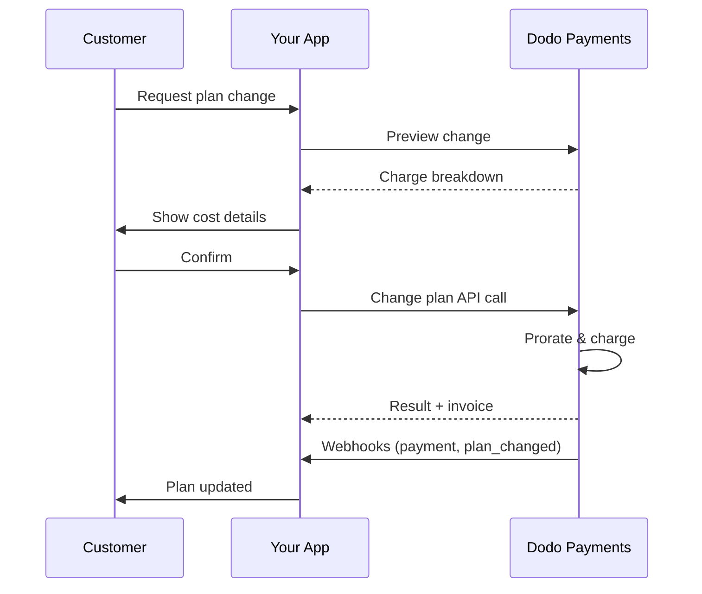

<CardGroup cols={3}>
<Card title="Change Plan API" icon="code" href="/api-reference/subscriptions/change-plan">
  Full API docs for updating subscriptions.
</Card>
<Card title="Plan Change Preview" icon="eye" href="/api-reference/subscriptions/preview-change-plan">
  See charge amounts before changing plans.
</Card>
<Card title="Integration Guide" icon="book" href="/developer-resources/subscription-integration-guide">
  Step-by-step subscription setup.
</Card>
</CardGroup>

## What is a subscription upgrade or downgrade?

Changing plans lets you move a customer between subscription tiers or quantities. Use it to:
- Align pricing with usage or features
- Move from monthly to annual (or vice versa)
- Adjust quantity for seat-based products

<Info>
Plan changes can trigger an immediate charge depending on the proration mode you choose.
</Info>

## When to use plan changes

- Upgrade when a customer needs more features, usage, or seats
- Downgrade when usage decreases
- Migrate users to a new product or price without cancelling their subscription

## Plan Change Flow



## Prerequisites

Before implementing subscription plan changes, ensure you have:

- A Dodo Payments merchant account with active subscription products
- API credentials (API key and webhook secret key) from the dashboard
- An existing active subscription to modify
- Webhook endpoint configured to handle subscription events

<Info>
For detailed setup instructions, see our [Integration Guide](/developer-resources/integration-guide#dashboard-setup).
</Info>

## Step-by-Step Implementation Guide

Follow this comprehensive guide to implement subscription plan changes in your application:

<Steps>
<Step title="Understand Plan Change Requirements">
Before implementing, determine:
- Which subscription products can be changed to which others
- What proration mode fits your business model
- How to handle failed plan changes gracefully
- Which webhook events to track for state management

<Tip>
Test plan changes thoroughly in test mode before implementing in production.
</Tip>
</Step>

<Step title="Choose Your Proration Strategy">
Select the billing approach that aligns with your business needs:

<Tabs>
<Tab title="prorated_immediately">
Best for: SaaS applications wanting to charge fairly for unused time
- Calculates exact prorated amount based on remaining cycle time
- Charges a prorated amount based on unused time remaining in the cycle
- Provides transparent billing to customers
</Tab>

<Tab title="difference_immediately">
Best for: Clear upgrade/downgrade scenarios
- Upgrade: Charge immediate difference (e.g., $30→$80 = charge $50)
- Downgrade: Credit remaining value for future renewals
- Simplifies billing logic and customer communication
</Tab>

<Tab title="full_immediately">
Best for: When you want to reset the billing cycle
- Charges full amount of new plan immediately
- Ignores remaining time from old plan
- Useful for annual to monthly transitions
</Tab>

<Tab title="do_not_bill">
Best for: Free migrations, courtesy switches, or absorbing cost differences
- No charges or credits calculated
- Customer moves to the new plan immediately without any billing adjustment
- Billing cycle remains unchanged
</Tab>
</Tabs>
</Step>

<Step title="Implement the Change Plan API">
Use the Change Plan API to modify subscription details:

<ParamField path="subscription_id" type="string" required>
The ID of the active subscription to modify.
</ParamField>

<ParamField path="product_id" type="string" required>
The new product ID to change the subscription to.
</ParamField>

<ParamField path="quantity" type="integer" default="1">
Number of units for the new plan (for seat-based products).
</ParamField>

<ParamField path="proration_billing_mode" type="string" required>
How to handle immediate billing: `prorated_immediately`, `full_immediately`, `difference_immediately`, or `do_not_bill`.
</ParamField>

<ParamField path="addons" type="array">
Optional addons for the new plan. Leaving this empty removes any existing addons.
</ParamField>

<ParamField path="on_payment_failure" type="string">
Controls behavior when the plan change payment fails:
- `prevent_change`: Keep subscription on current plan until payment succeeds
- `apply_change` (default): Apply plan change immediately regardless of payment outcome

If not specified, uses the business-level default setting.
</ParamField>

Optional discount code to apply to the new plan. If provided, validates and applies the discount to the plan change. If not provided and the subscription has an existing discount with `preserve_on_plan_change=true`, the existing discount will be preserved (if applicable to the new product).
</ParamField>

Cuándo aplicar el cambio de plan:
- `immediately` (por defecto): Aplicar el cambio de plan de inmediato
- `next_billing_date`: Programar el cambio para la siguiente fecha de facturación. El cliente conserva su plan actual hasta el final del período de facturación.

Usa `next_billing_date` para degradaciones para que los clientes conserven los beneficios de su plan actual hasta el final del período de facturación.
</ParamField>
</Step>

Configura el manejo de webhooks para rastrear los resultados de cambio de plan:

- `subscription.active`: Cambio de plan exitoso, suscripción actualizada
- `subscription.plan_changed`: Plan de suscripción cambiado (actualización/degradación/actualización de addon)
- `subscription.on_hold`: Falla en el cobro de cambio de plan, suscripción pausada
- `payment.succeeded`: Cobro inmediato por cambio de plan exitoso
- `payment.failed`: Cobro inmediato fallido

Siempre verifica las firmas de los webhooks e implementa el procesamiento idempotente de eventos.
</Warning>
</Step>

Basado en eventos de webhook, actualiza tu aplicación:
- Otorga/revoca funciones según el nuevo plan
- Actualiza el panel del cliente con los detalles del nuevo plan
- Envía correos electrónicos de confirmación sobre los cambios de plan
- Registra cambios de facturación para propósitos de auditoría
</Step>

Prueba exhaustivamente tu implementación:
- Prueba todos los modos de prorrateo con diferentes escenarios
- Verifica que el manejo de webhooks funcione correctamente
- Monitorea las tasas de éxito de los cambios de plan
- Configura alertas para los cambios de plan fallidos

Tu implementación de cambio de plan de suscripción ahora está lista para uso en producción.
</Check>
</Step>
</Steps>

## Previsualización de Cambios de Plan

Antes de comprometerse con un cambio de plan, usa el Preview API para mostrar a los clientes exactamente cuánto se les cobrará:

<Tabs>
<Tab title="Node.js SDK">

```javascript
const preview = await client.subscriptions.previewChangePlan('sub_123', {
  product_id: 'prod_pro',
  quantity: 1,
  proration_billing_mode: 'prorated_immediately'
});

// Show customer the charge before confirming
console.log('Immediate charge:', preview.immediate_charge.summary);
console.log('New plan details:', preview.new_plan);
```

</Tab>

<Tab title="Python SDK">

```python
preview = client.subscriptions.preview_change_plan(
    subscription_id="sub_123",
    product_id="prod_pro",
    quantity=1,
    proration_billing_mode="prorated_immediately"
)

# Show customer the charge before confirming
print("Immediate charge:", preview.immediate_charge.summary)
print("New plan details:", preview.new_plan)
```

Usa el preview API para construir cuadros de diálogo de confirmación que muestren a los clientes la cantidad exacta que se les cobrará antes de que confirmen un cambio de plan.
</Tip>

## API de Cambio de Plan

Usa la API de Cambio de Plan para modificar el producto, la cantidad y el comportamiento de prorrateo para una suscripción activa.

### Ejemplos de inicio rápido

    ```javascript
    import DodoPayments from 'dodopayments';

    const client = new DodoPayments({
      bearerToken: process.env.DODO_PAYMENTS_API_KEY,
      environment: 'test_mode', // defaults to 'live_mode'
    });

    async function changePlan() {
      const result = await client.subscriptions.changePlan('sub_123', {
        product_id: 'prod_new',
        quantity: 3,
        proration_billing_mode: 'prorated_immediately',
        on_payment_failure: 'prevent_change', // Optional: control behavior on payment failure
      });
      console.log(result.status, result.invoice_id, result.payment_id);
    }

    changePlan();
    ```

    ```python
    import os
    from dodopayments import DodoPayments

    client = DodoPayments(
        bearer_token=os.environ.get("DODO_PAYMENTS_API_KEY"),
        environment="test_mode",  # defaults to "live_mode"
    )

    result = client.subscriptions.change_plan(
        subscription_id="sub_123",
        product_id="prod_new",
        quantity=3,
        proration_billing_mode="prorated_immediately",
        on_payment_failure="prevent_change",  # Optional: control behavior on payment failure
    )
    print(result.status, result.get("invoice_id"), result.get("payment_id"))
    ```

    ```go
    package main

    import (
      "context"
      "fmt"
      "github.com/dodopayments/dodopayments-go"
      "github.com/dodopayments/dodopayments-go/option"
    )

    func main() {
      client := dodopayments.NewClient(option.WithBearerToken("YOUR_TOKEN"))
      res, err := client.Subscriptions.ChangePlan(context.TODO(), dodopayments.SubscriptionChangePlanParams{
        SubscriptionID: dodopayments.F("sub_123"),
        ProductID:             dodopayments.F("prod_new"),
        Quantity:              dodopayments.F(int64(3)),
        ProrationBillingMode:  dodopayments.F(dodopayments.SubscriptionChangePlanParamsProrationBillingModeProratedImmediately),
        OnPaymentFailure:      dodopayments.F(dodopayments.OnPaymentFailurePreventChange), // Optional
      })
      if err != nil { panic(err) }
      fmt.Println(res.Status, res.InvoiceID, res.PaymentID)
    }
    ```

    ```bash
    curl -X POST "$DODO_API_BASE/subscriptions/sub_123/change-plan" \
      -H "Authorization: Bearer $DODO_PAYMENTS_API_KEY" \
      -H "Content-Type: application/json" \
      -d '{
        "product_id": "prod_new",
        "quantity": 3,
        "proration_billing_mode": "prorated_immediately",
        "on_payment_failure": "prevent_change"
      }'
    ```

```json Success
{
  "status": "processing",
  "subscription_id": "sub_123",
  "invoice_id": "inv_789",
  "payment_id": "pay_456",
  "proration_billing_mode": "prorated_immediately"
}
```

Campos como <code>invoice_id</code> y <code>payment_id</code> se devuelven solo cuando se crea un cargo inmediato y/o una factura durante el cambio de plan. Siempre confía en eventos de webhook (e.g., <code>payment.succeeded</code>, <code>subscription.plan_changed</code>) para confirmar resultados.
</Note>

Si el cargo inmediato falla, la suscripción puede pasar a `subscription.on_hold` hasta que el pago tenga éxito.
</Warning>

## Gestión de Addons

Al cambiar planes de suscripción, también puedes modificar addons:

Código_PLACEHOLDER_731bffa3eb789d67_END

Los addons se incluyen en el cálculo de prorrateo y se cobrarán según el modo de prorrateo seleccionado.
</Info>

## Aplicación de Códigos de Descuento

Puedes aplicar un código de descuento al cambiar planes de suscripción. Esto es útil para ofrecer precios promocionales en actualizaciones o migraciones.

Comportamiento del descuento en cambio de plan

| Escenario | Comportamiento |
|----------|----------|
| `discount_code` proporcionado | Valida y aplica el descuento al nuevo plan. |
| No se proporciona código, descuento existente con `preserve_on_plan_change=true` | El descuento existente se conserva automáticamente si es aplicable al nuevo producto. |
| No se proporciona código, no hay descuento conservable | No se aplica descuento al nuevo plan. |

Usa el [Preview Plan Change API](/api-reference/subscriptions/preview-change-plan) con un `discount_code` para mostrar a los clientes exactamente cuánto ahorrarán antes de confirmar el cambio de plan.
</Tip>

## Modos de prorrateo

Elige cómo facturar al cliente al cambiar planes:

#### `prorated_immediately`
- Cargos por la diferencia parcial en el ciclo actual
- Si está en prueba, cobra de inmediato y cambia al nuevo plan ahora
- Degradación: puede generar un crédito prorrateado aplicado a futuras renovaciones

#### `full_immediately`
- Cobra el monto total del nuevo plan de inmediato
- Ignora el tiempo restante del plan anterior

Los créditos creados por degradaciones usando <code>difference_immediately</code> están limitados a la suscripción y son distintos de los derechos de <a href="/features/credit-based-billing">Facturación Basada en Créditos</a>. Se aplican automáticamente a renovaciones futuras de la misma suscripción y no son transferibles entre suscripciones.
</Info>

#### `difference_immediately`
- Actualización: cobra inmediatamente la diferencia de precio entre planes antiguos y nuevos
- Degradación: agrega el valor restante como crédito interno a la suscripción y se aplica automáticamente en renovaciones

#### `do_not_bill`
- No se calculan cargos ni créditos
- El cliente cambia al nuevo plan inmediatamente sin ningún ajuste de facturación
- El ciclo de facturación permanece sin cambios
- Mejor para migraciones de cortesía, cambios de plan gratuitos o absorción de diferencias de costo

| Característica | `prorated_immediately` | `difference_immediately` | `full_immediately` | `do_not_bill` |
|---------|----------------------|------------------------|-------------------|--------------|
| **Costo de actualización** | Diferencia prorrateada para días restantes | Diferencia de precio total entre planes | Precio total del nuevo plan | Sin cobro |
| **Crédito por degradación** | Crédito prorrateado para días restantes | Diferencia de precio total como crédito | Sin crédito | Sin crédito |
| **Ciclo de facturación** | Sin cambios | Sin cambios | Se reinicia a hoy | Sin cambios |
| **Comportamiento de prueba** | Termina la prueba, cobra inmediatamente | Termina la prueba, cobra inmediatamente | Termina la prueba, cobra el monto total | Termina la prueba, sin cobro |
| **Mejor para** | Facturación justa basada en tiempo | Matemáticas simples de actualización/degradación | Reiniciar ciclos de facturación | Migraciones gratuitas o cambios de cortesía |
| **Complejidad** | Media (cálculo diario) | Baja (resta simple) | Baja (cobro total) | Ninguna |

### Escenarios de ejemplo

Usa estos números canónicos de manera consistente:
- Plan actual: **Básico** a **$30/mes**
- Objetivo de actualización: **Pro** a **$80/mes**
- Objetivo de degradación (de Pro): **Starter** a **$20/mes**
- Ciclo de facturación: **30 días**, comenzando el **1 de enero**
- Cambio de plan ocurre el **16 de enero** (15 días restantes, 15 días usados)

Cómo cada modo procesa la facturación

Elige `prorated_immediately` para contabilidad de tiempo justo; elige `full_immediately` para reiniciar la facturación; usa `difference_immediately` para actualizaciones simples y crédito automático en degradaciones; o usa `do_not_bill` para cambiar planes sin ningún ajuste de facturación.
</Tip>

## Manejo de Fallas en el Pago

Controla lo que sucede cuando falla el pago de un cambio de plan usando el parámetro `on_payment_failure`.

### Modos de Falla de Pago

**Comportamiento**: Mantener la suscripción en su plan actual hasta que el pago tenga éxito.

- El cambio de plan se marca como "pendiente"
- El cliente retiene el acceso a su plan actual
- La suscripción pasa al estado `active` solo después de un pago exitoso
- Útil cuando deseas asegurar el pago antes de otorgar funciones mejoradas

```javascript
await client.subscriptions.changePlan('sub_123', {
  product_id: 'prod_pro',
  quantity: 1,
  proration_billing_mode: 'prorated_immediately',
  on_payment_failure: 'prevent_change'
});
```

**Comportamiento**: Aplicar el cambio de plan de inmediato, independientemente del resultado del pago.

- El cambio de plan se aplica incluso si el pago falla
- El cliente obtiene acceso inmediato al nuevo plan
- La suscripción puede pasar al estado `on_hold` si el pago falla
- Bueno para actualizaciones no críticas o cuando confías en el cliente

Si no se especifica, el parámetro `on_payment_failure` utiliza la configuración predeterminada a nivel empresarial configurada en el tablero.
</Info>

### Cuándo Usar Cada Modo

| Escenario | Modo Recomendado | Razón |
|----------|------------------|--------|
| Actualización a características premium | `prevent_change` | Asegurar el pago antes de otorgar acceso |
| Aumento de cantidad (más asientos) | `prevent_change` | Prevenir el uso sin pago |
| Degradación de planes | `apply_change` | El cliente está reduciendo gasto |
| Clientes empresariales de confianza | `apply_change` | Menor riesgo de no pago |
| Conversión de prueba a pago | `prevent_change` | Momento crítico de pago |

## Manejo de webhooks

Rastrea el estado de la suscripción a través de webhooks para confirmar cambios de plan y pagos.

### Tipos de eventos a manejar
- `subscription.active`: suscripción activada
- `subscription.plan_changed`: plan de suscripción cambiado (actualización/degradación/cambios de addon)
- `subscription.on_hold`: cargo fallido, suscripción pausada
- `subscription.renewed`: renovación exitosa
- `payment.succeeded`: pago por cambio de plan o renovación exitoso
- `payment.failed`: pago fallido

Recomendamos dirigir la lógica empresarial desde eventos de suscripción y usar eventos de pago para confirmación y conciliación.
</Info>

### Verifica firmas y maneja intenciones

Para esquemas de payload detallados, consulta los <a href="/developer-resources/webhooks/intents/subscription">Payloads de Webhook de Suscripción</a> y <a href="/developer-resources/webhooks/intents/payment">Payloads de Webhook de Pago</a>.
</Note>

## Mejores Prácticas

Sigue estas recomendaciones para cambios de plan de suscripción confiables:

### Estrategia de Cambio de Plan
- **Prueba a fondo**: Siempre prueba cambios de plan en modo de prueba antes de producción
- **Elige prorrateo cuidadosamente**: Selecciona el modo de prorrateo que se alinea con tu modelo de negocio
- **Maneja fallos con gracia**: Implementa un manejo adecuado de errores y lógica de reintentos
- **Monitorea tasas de éxito**: Rastrear tasas de éxito/fallo de cambios de plan e investigar problemas

### Implementación de Webhook
- **Verifica firmas**: Siempre valida firmas de webhook para asegurar autenticidad
- **Implementa idempotencia**: Maneja eventos de webhook duplicados con gracia
- **Procesa asincrónicamente**: No bloquees respuestas de webhook con operaciones pesadas
- **Registra todo**: Mantén registros detallados para depuración y propósitos de auditoría

### Experiencia del Usuario
- **Comunica claramente**: Informa a los clientes sobre cambios de facturación y tiempos
- **Proporciona confirmaciones**: Envía correos electrónicos de confirmación para cambios de plan exitosos
- **Maneja casos límite**: Considera períodos de prueba, prorrateos y pagos fallidos
- **Actualiza la IU inmediatamente**: Refleja cambios de plan en la interfaz de tu aplicación

## Problemas Comunes y Soluciones

Resuelve problemas típicos encontrados durante cambios de plan de suscripción:

**Síntomas**: La llamada API tiene éxito pero la suscripción permanece en el plan anterior

**Causas comunes**:
- Procesamiento de webhook fallido o retrasado
- Estado de la aplicación no actualizado después de recibir webhooks
- Problemas de transacción de base de datos durante la actualización de estado

**Soluciones**:
- Implementa un manejo robusto de webhooks con lógica de reintentos
- Usa operaciones idempotentes para actualizaciones de estado
- Añade monitoreo para detectar y alertar sobre eventos de webhook perdidos
- Verifica que el endpoint de webhook sea accesible y responda correctamente

**Síntomas**: El cliente realiza una degradación pero no ve el saldo de crédito

**Causas comunes**:
- Expectativas de modo de prorrateo: las degradaciones acreditan la diferencia de precio total del plan con `difference_immediately`, mientras que `prorated_immediately` crea un crédito prorrateado basado en el tiempo restante del ciclo
- Los créditos son específicos de la suscripción y no se transfieren entre suscripciones
- Saldo de crédito no visible en el panel del cliente

**Soluciones**:
- Usa `difference_immediately` para degradaciones cuando desees créditos automáticos
- Explica a los clientes que los créditos se aplican a renovaciones futuras de la misma suscripción
- Implementa un portal del cliente para mostrar saldos de crédito
- Verifica la previsualización de la siguiente factura para ver los créditos aplicados

**Síntomas**: Eventos de webhook rechazados debido a firma inválida

**Causas comunes**:
- Clave secreta de webhook incorrecta
- Cuerpo de solicitud en bruto modificado antes de la verificación de la firma
- Algoritmo de verificación de firma incorrecto

**Soluciones**:
- Verifica que estás usando el `DODO_WEBHOOK_SECRET` correcto del tablero
- Lee el cuerpo de la solicitud en bruto antes de cualquier middleware de parsing JSON
- Usa la biblioteca estándar de verificación de webhooks para tu plataforma
- Prueba la verificación de firma de webhook en un entorno de desarrollo

**Síntomas**: La API devuelve un error 422 Unprocessable Entity

**Causas comunes**:
- ID de suscripción o ID de producto no válidos
- Suscripción no en estado activo
- Falta de parámetros requeridos
- Producto no disponible para cambios de plan

**Soluciones**:
- Verifica que la suscripción exista y esté activa
- Verifica que el ID del producto sea válido y esté disponible
- Asegúrate de que todos los parámetros requeridos estén proporcionados
- Revisa la documentación de la API para los requisitos de los parámetros

**Síntomas**: Iniciado el cambio de plan pero el cargo inmediato falla

**Causas comunes**:
- Fondos insuficientes en el método de pago del cliente
- Método de pago expirado o inválido
- El banco rechazó la transacción
- Detección de fraude bloqueó el cargo

**Soluciones**:
- Maneja apropiadamente eventos de webhook `payment.failed`
- Notifica al cliente para actualizar el método de pago
- Implementa lógica de reintento para fallos temporales
- Considera permitir cambios de plan con cargos inmediatos fallidos

**Síntomas**: Falla el cargo de cambio de plan y la suscripción pasa al estado `on_hold`

**Qué sucede**:
Cuando falla el cargo de cambio de plan, la suscripción se coloca automáticamente en el estado `on_hold`. La suscripción no se renovará automáticamente hasta que se actualice el método de pago.

**Solución**: Actualiza el método de pago para reactivar la suscripción

Para reactivar una suscripción desde el estado `on_hold` después de un cambio de plan fallido:

1. **Actualiza el método de pago** usando la API de Actualización de Método de Pago
2. **Creación de cargo automática**: La API crea automáticamente un cargo por pagos pendientes
3. **Generación de factura**: Se genera una factura para el cargo
4. **Procesamiento de pago**: El pago se procesa usando el nuevo método de pago
5. **Reactivación**: Tras el pago exitoso, la suscripción se reactiva al estado `active`

**Eventos de webhook para monitorear**:
- `subscription.on_hold`: Suscripción puesta en espera (recibido cuando falla el cargo de cambio de plan)
- `payment.succeeded`: Pago por pagos pendientes exitoso (después de actualizar el método de pago)
- `subscription.active`: Suscripción reactivada tras un pago exitoso

## Prueba de Tu Implementación

Sigue estos pasos para probar a fondo tu implementación de cambio de plan de suscripción:

- Usa claves de API de prueba y productos de prueba
- Crea suscripciones de prueba con diferentes tipos de plan
- Configura el endpoint de webhook de prueba
- Configura monitoreo y registro

- Prueba `prorated_immediately` con varias posiciones de ciclo de facturación
- Prueba `difference_immediately` para actualizaciones y degradaciones
- Prueba `full_immediately` para reiniciar ciclos de facturación
- Prueba `do_not_bill` para cambios de plan sin cobro/sin crédito
- Verifica que los cálculos de crédito sean correctos

- Verifica que todos los eventos de webhook relevantes se reciban
- Prueba la verificación de firma de webhook
- Maneja eventos de webhook duplicados con gracia
- Prueba escenarios de errores en el procesamiento de webhooks

- Prueba con IDs de suscripción inválidos
- Prueba con métodos de pago expirados
- Prueba fallos de red y tiempos de espera
- Prueba con fondos insuficientes

- Configura alertas para cambios de plan fallidos
- Monitorea los tiempos de procesamiento de webhooks
- Rastrea las tasas de éxito de cambio de plan
- Revisa tickets de soporte al cliente por problemas de cambio de plan

## Manejo de Errores

Maneja errores comunes de la API con gracia en tu implementación:

### Códigos de Estado HTTP

Solicitud de cambio de plan procesada con éxito. La suscripción se está actualizando y el procesamiento de pagos ha comenzado.

Parámetros de solicitud inválidos. Verifica que todos los campos requeridos estén proporcionados y debidamente formateados.

Clave de API inválida o ausente. Verifica que tu `DODO_PAYMENTS_API_KEY` sea correcta y tenga los permisos adecuados.

ID de suscripción no encontrada o no pertenece a tu cuenta.

La suscripción no puede ser cambiada (por ejemplo, ya cancelada, producto no disponible, etc.).

Ocurrió un error en el servidor. Reintenta la solicitud después de un breve retraso.

### Formato de Respuesta de Error

## Próximos pasos

- Revisa el <a href="/api-reference/subscriptions/change-plan">Cambio de Plan API</a>
- Explora <a href="/features/credit-based-billing">Facturación Basada en Créditos</a>
- Implementa alertas para `subscription.on_hold`
- Consulta nuestra <a href="/developer-resources/webhooks">Guía de Integración de Webhooks</a>

### Plan Change Strategy
- **Test thoroughly**: Always test plan changes in test mode before production
- **Choose proration carefully**: Select the proration mode that aligns with your business model
- **Handle failures gracefully**: Implement proper error handling and retry logic
- **Monitor success rates**: Track plan change success/failure rates and investigate issues

### Webhook Implementation
- **Verify signatures**: Always validate webhook signatures to ensure authenticity
- **Implement idempotency**: Handle duplicate webhook events gracefully
- **Process asynchronously**: Don't block webhook responses with heavy operations
- **Log everything**: Maintain detailed logs for debugging and audit purposes

### User Experience
- **Communicate clearly**: Inform customers about billing changes and timing
- **Provide confirmations**: Send email confirmations for successful plan changes
- **Handle edge cases**: Consider trial periods, prorations, and failed payments
- **Update UI immediately**: Reflect plan changes in your application interface

## Common Issues and Solutions

Resolve typical problems encountered during subscription plan changes:

<AccordionGroup>
<Accordion title="Charge created but subscription not updated">
**Symptoms**: API call succeeds but subscription remains on old plan

**Common causes**:
- Webhook processing failed or was delayed
- Application state not updated after receiving webhooks
- Database transaction issues during state update

**Solutions**:
- Implement robust webhook handling with retry logic
- Use idempotent operations for state updates
- Add monitoring to detect and alert on missed webhook events
- Verify webhook endpoint is accessible and responding correctly
</Accordion>

<Accordion title="Credits not applied after downgrade">
**Symptoms**: Customer downgrades but doesn't see credit balance

**Common causes**:
- Proration mode expectations: downgrades credit the full plan price difference with `difference_immediately`, while `prorated_immediately` creates a prorated credit based on remaining time in the cycle
- Credits are subscription-specific and don't transfer between subscriptions
- Credit balance not visible in customer dashboard

**Solutions**:
- Use `difference_immediately` for downgrades when you want automatic credits
- Explain to customers that credits apply to future renewals of the same subscription
- Implement customer portal to show credit balances
- Check next invoice preview to see applied credits
</Accordion>

<Accordion title="Webhook signature verification fails">
**Symptoms**: Webhook events rejected due to invalid signature

**Common causes**:
- Incorrect webhook secret key
- Raw request body modified before signature verification
- Wrong signature verification algorithm

**Solutions**:
- Verify you're using the correct `DODO_WEBHOOK_SECRET` from dashboard
- Read raw request body before any JSON parsing middleware
- Use the standard webhook verification library for your platform
- Test webhook signature verification in development environment
</Accordion>

<Accordion title="Plan change fails with 422 error">
**Symptoms**: API returns 422 Unprocessable Entity error

**Common causes**:
- Invalid subscription ID or product ID
- Subscription not in active state
- Missing required parameters
- Product not available for plan changes

**Solutions**:
- Verify subscription exists and is active
- Check product ID is valid and available
- Ensure all required parameters are provided
- Review API documentation for parameter requirements
</Accordion>

<Accordion title="Immediate charge fails during plan change">
**Symptoms**: Plan change initiated but immediate charge fails

**Common causes**:
- Insufficient funds on customer's payment method
- Payment method expired or invalid
- Bank declined the transaction
- Fraud detection blocked the charge

**Solutions**:
- Handle `payment.failed` webhook events appropriately
- Notify customer to update payment method
- Implement retry logic for temporary failures
- Consider allowing plan changes with failed immediate charges
</Accordion>

<Accordion title="Subscription on hold after plan change">
**Symptoms**: Plan change charge fails and subscription moves to `on_hold` state

**What happens**:
When a plan change charge fails, the subscription is automatically placed in `on_hold` state. The subscription will not renew automatically until the payment method is updated.

**Solution**: Update the payment method to reactivate the subscription

To reactivate a subscription from `on_hold` state after a failed plan change:

1. **Update the payment method** using the Update Payment Method API
2. **Automatic charge creation**: The API automatically creates a charge for remaining dues
3. **Invoice generation**: An invoice is generated for the charge
4. **Payment processing**: The payment is processed using the new payment method
5. **Reactivation**: Upon successful payment, the subscription is reactivated to `active` state

<CodeGroup>

```javascript Node.js
// Reactivate subscription from on_hold after failed plan change
async function reactivateAfterFailedPlanChange(subscriptionId) {
  // Update payment method - automatically creates charge for remaining dues
  const response = await client.subscriptions.updatePaymentMethod(subscriptionId, {
    type: 'new',
    return_url: 'https://example.com/return'
  });
  
  if (response.payment_id) {
    console.log('Charge created for remaining dues:', response.payment_id);
    console.log('Payment link:', response.payment_link);
    
    // Redirect customer to payment_link to complete payment
    // Monitor webhooks for:
    // 1. payment.succeeded - charge succeeded
    // 2. subscription.active - subscription reactivated
  }
  
  return response;
}

// Or use existing payment method if available
async function reactivateWithExistingPaymentMethod(subscriptionId, paymentMethodId) {
  const response = await client.subscriptions.updatePaymentMethod(subscriptionId, {
    type: 'existing',
    payment_method_id: paymentMethodId
  });
  
  // Monitor webhooks for payment.succeeded and subscription.active
  return response;
}
```

```python Python
# Reactivate subscription from on_hold after failed plan change
def reactivate_after_failed_plan_change(subscription_id):
    # Update payment method - automatically creates charge for remaining dues
    response = client.subscriptions.update_payment_method(
        subscription_id=subscription_id,
        type="new",
        return_url="https://example.com/return"
    )
    
    if response.payment_id:
        print("Charge created for remaining dues:", response.payment_id)
        print("Payment link:", response.payment_link)
        
        # Redirect customer to payment_link to complete payment
        # Monitor webhooks for:
        # 1. payment.succeeded - charge succeeded
        # 2. subscription.active - subscription reactivated
    
    return response

# Or use existing payment method if available
def reactivate_with_existing_payment_method(subscription_id, payment_method_id):
    response = client.subscriptions.update_payment_method(
        subscription_id=subscription_id,
        type="existing",
        payment_method_id=payment_method_id
    )
    
    # Monitor webhooks for payment.succeeded and subscription.active
    return response
```

</CodeGroup>

**Webhook events to monitor**:
- `subscription.on_hold`: Subscription placed on hold (received when plan change charge fails)
- `payment.succeeded`: Payment for remaining dues succeeded (after updating payment method)
- `subscription.active`: Subscription reactivated after successful payment

**Best practices**:
- Notify customers immediately when a plan change charge fails
- Provide clear instructions on how to update their payment method
- Monitor webhook events to track reactivation status
- Consider implementing automatic retry logic for temporary payment failures

<Card title="Update Payment Method API Reference" icon="code" href="/api-reference/subscriptions/update-payment-method">
View the complete API documentation for updating payment methods and reactivating subscriptions.
</Card>
</Accordion>
</AccordionGroup>

## Testing Your Implementation

Follow these steps to thoroughly test your subscription plan change implementation:

<Steps>
<Step title="Set up test environment">
- Use test API keys and test products
- Create test subscriptions with different plan types
- Configure test webhook endpoint
- Set up monitoring and logging
</Step>

<Step title="Test different proration modes">
- Test `prorated_immediately` with various billing cycle positions
- Test `difference_immediately` for upgrades and downgrades
- Test `full_immediately` to reset billing cycles
- Test `do_not_bill` for no-charge/no-credit plan switches
- Verify credit calculations are correct
</Step>

<Step title="Test webhook handling">
- Verify all relevant webhook events are received
- Test webhook signature verification
- Handle duplicate webhook events gracefully
- Test webhook processing failure scenarios
</Step>

<Step title="Test error scenarios">
- Test with invalid subscription IDs
- Test with expired payment methods
- Test network failures and timeouts
- Test with insufficient funds
</Step>

<Step title="Monitor in production">
- Set up alerts for failed plan changes
- Monitor webhook processing times
- Track plan change success rates
- Review customer support tickets for plan change issues
</Step>
</Steps>

## Error Handling

Handle common API errors gracefully in your implementation:

### HTTP Status Codes

<AccordionGroup>
<Accordion title="200 OK">
Plan change request processed successfully. The subscription is being updated and payment processing has begun.
</Accordion>

<Accordion title="400 Bad Request">
Invalid request parameters. Check that all required fields are provided and properly formatted.
</Accordion>

<Accordion title="401 Unauthorized">
Invalid or missing API key. Verify your `DODO_PAYMENTS_API_KEY` is correct and has proper permissions.
</Accordion>

<Accordion title="404 Not Found">
Subscription ID not found or doesn't belong to your account.
</Accordion>

<Accordion title="422 Unprocessable Entity">
The subscription cannot be changed (e.g., already cancelled, product not available, etc.).
</Accordion>

<Accordion title="500 Internal Server Error">
Server error occurred. Retry the request after a brief delay.
</Accordion>
</AccordionGroup>

### Error Response Format

```json
{
  "error": {
    "code": "subscription_not_found",
    "message": "The subscription with ID 'sub_123' was not found",
    "details": {
      "subscription_id": "sub_123"
    }
  }
}
```

## Next steps

- Review the <a href="/api-reference/subscriptions/change-plan">Change Plan API</a>
- Explore <a href="/features/credit-based-billing">Credit-Based Billing</a>
- Implement alerts for `subscription.on_hold`
- Check out our <a href="/developer-resources/webhooks">Webhook Integration Guide</a>

## Next steps

- Review the <a href="/api-reference/subscriptions/change-plan">Change Plan API</a>
- Explore <a href="/features/credit-based-billing">Credit-Based Billing</a>
- Implement alerts for `subscription.on_hold`
- Check out our <a href="/developer-resources/webhooks">Webhook Integration Guide</a>
