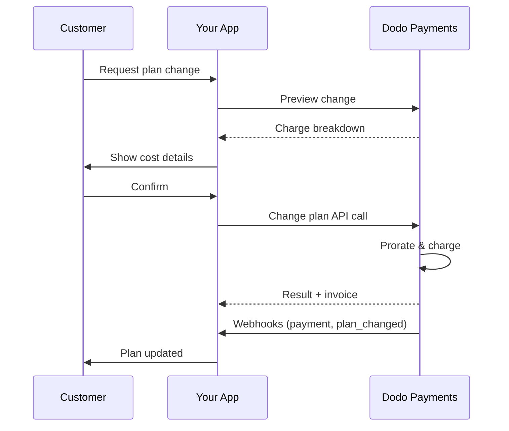
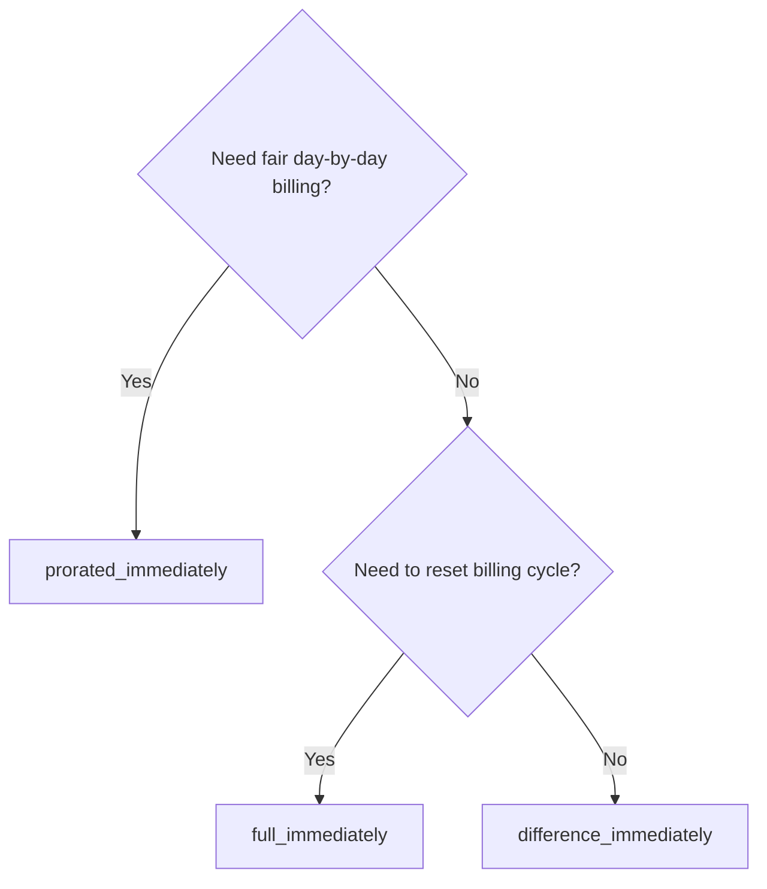
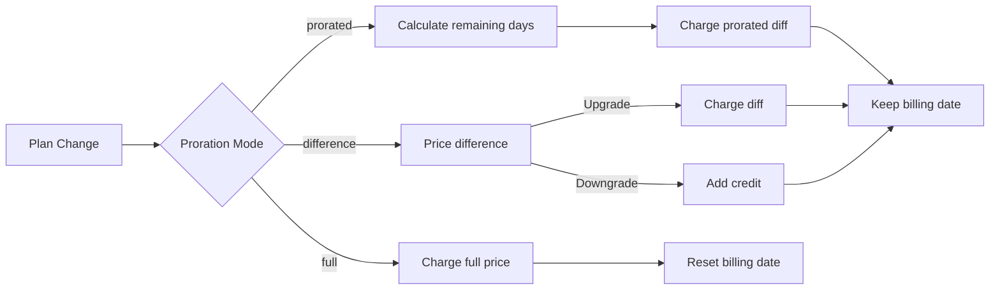

<CardGroup cols={3}>
<Card title="Change Plan API" icon="code" href="/api-reference/subscriptions/change-plan">
  Full API docs for updating subscriptions.
</Card>
<Card title="Plan Change Preview" icon="eye" href="/api-reference/subscriptions/preview-change-plan">
  See charge amounts before changing plans.
</Card>
<Card title="Integration Guide" icon="book" href="/developer-resources/subscription-integration-guide">
  Step-by-step subscription setup.
</Card>
</CardGroup>

## What is a subscription upgrade or downgrade?

Changing plans lets you move a customer between subscription tiers or quantities. Use it to:
- Align pricing with usage or features
- Move from monthly to annual (or vice versa)
- Adjust quantity for seat-based products

<Info>
Plan changes can trigger an immediate charge depending on the proration mode you choose.
</Info>

## When to use plan changes

- Upgrade when a customer needs more features, usage, or seats
- Downgrade when usage decreases
- Migrate users to a new product or price without cancelling their subscription

## Plan Change Flow



## Prerequisites

Before implementing subscription plan changes, ensure you have:

- A Dodo Payments merchant account with active subscription products
- API credentials (API key and webhook secret key) from the dashboard
- An existing active subscription to modify
- Webhook endpoint configured to handle subscription events

<Info>
For detailed setup instructions, see our [Integration Guide](/developer-resources/integration-guide#dashboard-setup).
</Info>

## Step-by-Step Implementation Guide

Follow this comprehensive guide to implement subscription plan changes in your application:

<Steps>
<Step title="Understand Plan Change Requirements">
Before implementing, determine:
- Which subscription products can be changed to which others
- What proration mode fits your business model
- How to handle failed plan changes gracefully
- Which webhook events to track for state management

<Tip>
Test plan changes thoroughly in test mode before implementing in production.
</Tip>
</Step>

<Step title="Choose Your Proration Strategy">
Select the billing approach that aligns with your business needs:

<Tabs>
<Tab title="prorated_immediately">
Best for: SaaS applications wanting to charge fairly for unused time
- Calculates exact prorated amount based on remaining cycle time
- Charges a prorated amount based on unused time remaining in the cycle
- Provides transparent billing to customers
</Tab>

<Tab title="difference_immediately">
Best for: Clear upgrade/downgrade scenarios
- Upgrade: Charge immediate difference (e.g., $30→$80 = charge $50)
- Downgrade: Credit remaining value for future renewals
- Simplifies billing logic and customer communication
</Tab>

<Tab title="full_immediately">
Best for: When you want to reset the billing cycle
- Charges full amount of new plan immediately
- Ignores remaining time from old plan
- Useful for annual to monthly transitions
</Tab>
</Tabs>
</Step>

<Step title="Implement the Change Plan API">
Use the Change Plan API to modify subscription details:

<ParamField path="subscription_id" type="string" required>
The ID of the active subscription to modify.
</ParamField>

<ParamField path="product_id" type="string" required>
The new product ID to change the subscription to.
</ParamField>

<ParamField path="quantity" type="integer" default="1">
Number of units for the new plan (for seat-based products).
</ParamField>

<ParamField path="proration_billing_mode" type="string" required>
How to handle immediate billing: `prorated_immediately`, `full_immediately`, or `difference_immediately`.
</ParamField>

<ParamField path="addons" type="array">
Optional addons for the new plan. Leaving this empty removes any existing addons.
</ParamField>

<ParamField path="on_payment_failure" type="string">
Controls behavior when the plan change payment fails:
- `prevent_change`: Keep subscription on current plan until payment succeeds
- `apply_change` (default): Apply plan change immediately regardless of payment outcome

Si no se especifica, utiliza la configuración predeterminada a nivel empresarial.
</ParamField>

<ParamField path="discount_code" type="string">
Código de descuento opcional para aplicar al nuevo plan. Si se proporciona, valida y aplica el descuento al cambio de plan. Si no se proporciona y la suscripción tiene un descuento existente con `preserve_on_plan_change=true`, el descuento existente se conservará (si es aplicable al nuevo producto).
</ParamField>
</Step>

<Step title="Handle Webhook Events">
Configura el manejo de webhooks para rastrear los resultados del cambio de plan:

- `subscription.active`: Cambio de plan exitoso, suscripción actualizada
- `subscription.plan_changed`: Plan de suscripción cambiado (actualización/downgrade/actualización de addon)
- `subscription.on_hold`: Fallo de cobro del cambio de plan, suscripción pausada
- `payment.succeeded`: Cobro inmediato por cambio de plan exitoso
- `payment.failed`: Cobro inmediato fallido

<Warning>
Siempre verifica las firmas de los webhooks y implementa el procesamiento idempotente de eventos.
</Warning>
</Step>

<Step title="Update Your Application State">
Basado en eventos de webhooks, actualiza tu aplicación:
- Otorga/revoca funciones basadas en el nuevo plan
- Actualiza el panel del cliente con los detalles del nuevo plan
- Envía correos electrónicos de confirmación sobre cambios de plan
- Registra cambios de facturación para fines de auditoría
</Step>

<Step title="Test and Monitor">
Prueba tu implementación a fondo:
- Prueba todos los modos de prorrateo con diferentes escenarios
- Verifica que el manejo de webhooks funcione correctamente
- Monitorea las tasas de éxito de los cambios de plan
- Configura alertas para cambios de plan fallidos

<Check>
Tu implementación de cambios de plan de suscripción está lista para su uso en producción.
</Check>
</Step>
</Steps>

## Vista previa de cambios de plan

Antes de comprometerte a un cambio de plan, usa la API de vista previa para mostrar a los clientes exactamente lo que se les cobrará:

<Tabs>
<Tab title="Node.js SDK">

```javascript
const preview = await client.subscriptions.previewChangePlan('sub_123', {
  product_id: 'prod_pro',
  quantity: 1,
  proration_billing_mode: 'prorated_immediately'
});

// Show customer the charge before confirming
console.log('Immediate charge:', preview.immediate_charge.summary);
console.log('New plan details:', preview.new_plan);
```

</Tab>

<Tab title="Python SDK">

```python
preview = client.subscriptions.preview_change_plan(
    subscription_id="sub_123",
    product_id="prod_pro",
    quantity=1,
    proration_billing_mode="prorated_immediately"
)

# Show customer the charge before confirming
print("Immediate charge:", preview.immediate_charge.summary)
print("New plan details:", preview.new_plan)
```

</Tab>
</Tabs>

<Tip>
Usa la API de vista previa para construir cuadros de diálogo de confirmación que muestren a los clientes el monto exacto que se les cobrará antes de confirmar un cambio de plan.
</Tip>

## API de cambio de plan

Usa la API de cambio de plan para modificar el producto, la cantidad y el comportamiento de prorrateo para una suscripción activa.

### Ejemplos de inicio rápido

<Tabs>
  <Tab title="Node.js SDK">

    ```javascript
    import DodoPayments from 'dodopayments';

    const client = new DodoPayments({
      bearerToken: process.env.DODO_PAYMENTS_API_KEY,
      environment: 'test_mode', // defaults to 'live_mode'
    });

    async function changePlan() {
      const result = await client.subscriptions.changePlan('sub_123', {
        product_id: 'prod_new',
        quantity: 3,
        proration_billing_mode: 'prorated_immediately',
        on_payment_failure: 'prevent_change', // Optional: control behavior on payment failure
      });
      console.log(result.status, result.invoice_id, result.payment_id);
    }

    changePlan();
    ```

  </Tab>
  <Tab title="Python SDK">

    ```python
    import os
    from dodopayments import DodoPayments

    client = DodoPayments(
        bearer_token=os.environ.get("DODO_PAYMENTS_API_KEY"),
        environment="test_mode",  # defaults to "live_mode"
    )

    result = client.subscriptions.change_plan(
        subscription_id="sub_123",
        product_id="prod_new",
        quantity=3,
        proration_billing_mode="prorated_immediately",
        on_payment_failure="prevent_change",  # Optional: control behavior on payment failure
    )
    print(result.status, result.get("invoice_id"), result.get("payment_id"))
    ```

  </Tab>
  <Tab title="Go SDK">

    ```go
    package main

    import (
      "context"
      "fmt"
      "github.com/dodopayments/dodopayments-go"
      "github.com/dodopayments/dodopayments-go/option"
    )

    func main() {
      client := dodopayments.NewClient(option.WithBearerToken("YOUR_TOKEN"))
      res, err := client.Subscriptions.ChangePlan(context.TODO(), dodopayments.SubscriptionChangePlanParams{
        SubscriptionID: dodopayments.F("sub_123"),
        ProductID:             dodopayments.F("prod_new"),
        Quantity:              dodopayments.F(int64(3)),
        ProrationBillingMode:  dodopayments.F(dodopayments.SubscriptionChangePlanParamsProrationBillingModeProratedImmediately),
        OnPaymentFailure:      dodopayments.F(dodopayments.OnPaymentFailurePreventChange), // Optional
      })
      if err != nil { panic(err) }
      fmt.Println(res.Status, res.InvoiceID, res.PaymentID)
    }
    ```

  </Tab>
  <Tab title="HTTP">

    ```bash
    curl -X POST "$DODO_API_BASE/subscriptions/sub_123/change-plan" \
      -H "Authorization: Bearer $DODO_PAYMENTS_API_KEY" \
      -H "Content-Type: application/json" \
      -d '{
        "product_id": "prod_new",
        "quantity": 3,
        "proration_billing_mode": "prorated_immediately",
        "on_payment_failure": "prevent_change"
      }'
    ```

  </Tab>
</Tabs>

```json Success
{
  "status": "processing",
  "subscription_id": "sub_123",
  "invoice_id": "inv_789",
  "payment_id": "pay_456",
  "proration_billing_mode": "prorated_immediately"
}
```

<Note>
Los campos como <code>invoice_id</code> y <code>payment_id</code> se devuelven solo cuando se crea un cobro y/o factura inmediato durante el cambio de plan. Siempre confía en los eventos de webhook (p.ej., <code>payment.succeeded</code>, <code>subscription.plan_changed</code>) para confirmar resultados.
</Note>

<Warning>
Si el cargo inmediato falla, la suscripción puede moverse a `subscription.on_hold` hasta que el pago sea exitoso.
</Warning>

## Gestión de Addons

Al cambiar planes de suscripción, también puedes modificar los addons:

```javascript
// Add addons to the new plan
await client.subscriptions.changePlan('sub_123', {
  product_id: 'prod_new',
  quantity: 1,
  proration_billing_mode: 'difference_immediately',
  addons: [
    { addon_id: 'addon_123', quantity: 2 }
  ]
});

// Remove all existing addons
await client.subscriptions.changePlan('sub_123', {
  product_id: 'prod_new',
  quantity: 1,
  proration_billing_mode: 'difference_immediately',
  addons: [] // Empty array removes all existing addons
});
```

<Info>
Los addons están incluidos en el cálculo de prorrateo y se cobrarán según el modo de prorrateo seleccionado.
</Info>

## Aplicación de códigos de descuento

Puedes aplicar un código de descuento al cambiar planes de suscripción. Esto es útil para ofrecer precios promocionales en actualizaciones o migraciones.

<Tabs>
<Tab title="Node.js SDK">

```javascript
// Apply a discount code during plan change
await client.subscriptions.changePlan('sub_123', {
  product_id: 'prod_pro',
  quantity: 1,
  proration_billing_mode: 'prorated_immediately',
  discount_code: 'UPGRADE20'
});
```

</Tab>
<Tab title="Python SDK">

```python
# Apply a discount code during plan change
client.subscriptions.change_plan(
    subscription_id="sub_123",
    product_id="prod_pro",
    quantity=1,
    proration_billing_mode="prorated_immediately",
    discount_code="UPGRADE20"
)
```

</Tab>
<Tab title="HTTP">

```bash
curl -X POST "$DODO_API_BASE/subscriptions/sub_123/change-plan" \
  -H "Authorization: Bearer $DODO_PAYMENTS_API_KEY" \
  -H "Content-Type: application/json" \
  -d '{
    "product_id": "prod_pro",
    "quantity": 1,
    "proration_billing_mode": "prorated_immediately",
    "discount_code": "UPGRADE20"
  }'
```

</Tab>
</Tabs>

### Comportamiento del descuento al cambiar de plan

| Escenario | Comportamiento |
|----------|----------|
| `discount_code` proporcionado | Valida y aplica el descuento al nuevo plan. |
| No se proporciona código, descuento existente con `preserve_on_plan_change=true` | El descuento existente se conserva automáticamente si es aplicable al nuevo producto. |
| No se proporciona código, sin descuento conservable | No se aplica descuento al nuevo plan. |

<Tip>
Usa la [API de vista previa de cambio de plan](/api-reference/subscriptions/preview-change-plan) con un `discount_code` para mostrar a los clientes exactamente cuánto ahorrarán antes de confirmar el cambio de plan.
</Tip>

## Modos de prorrateo

Elige cómo facturar al cliente al cambiar de planes:

#### `prorated_immediately`
- Cobra por la diferencia parcial en el ciclo actual
- Si está en prueba, cobra inmediatamente y cambia al nuevo plan ahora
- Downgrade: puede generar un crédito prorrateado aplicado a futuras renovaciones

#### `full_immediately`
- Cobra el monto total del nuevo plan inmediatamente
- Ignora el tiempo restante del antiguo plan

<Info>
Los créditos creados por downgrades usando <code>difference_immediately</code> están sujetos a la suscripción y son distintos de las asignaciones de <a href="/features/credit-based-billing">Facturación basada en créditos</a>. Se aplican automáticamente a futuras renovaciones de la misma suscripción y no son transferibles entre suscripciones.
</Info>

#### `difference_immediately`
- Actualización: cobra inmediatamente la diferencia de precio entre los antiguos y nuevos planes
- Downgrade: añade el valor restante como crédito interno a la suscripción y se aplica automáticamente en renovaciones

| Característica | `prorated_immediately` | `difference_immediately` | `full_immediately` |
|---------|----------------------|------------------------|-------------------|
| **Cobro de actualización** | Diferencia prorrateada por días restantes | Diferencia total de precio entre planes | Precio completo del nuevo plan |
| **Crédito de downgrade** | Crédito prorrateado por días restantes | Diferencia total de precio como crédito | Sin crédito |
| **Ciclo de facturación** | Sin cambios | Sin cambios | Se reinicia hoy |
| **Comportamiento de prueba** | Termina la prueba, cobra inmediatamente | Termina la prueba, cobra inmediatamente | Termina la prueba, cobra el monto completo |
| **Mejor para** | Facturación justa basada en tiempo | Matemáticas simples de actualización/downgrade | Reiniciar ciclos de facturación |
| **Complejidad** | Media (cálculo de días) | Baja (resta sencilla) | Baja (cobro completo) |



### Escenarios de ejemplo

Usa estos números canónicos de forma consistente:
- Plan actual: **Básico** a **$30/mes**
- Objetivo de actualización: **Pro** a **$80/mes**
- Objetivo de downgrade (desde Pro): **Starter** a **$20/mes**
- Ciclo de facturación: **30 días**, iniciado el **1 de enero**
- Cambio de plan ocurre el **16 de enero** (15 días restantes, 15 días usados)

<AccordionGroup>
  <Accordion title="Upgrade: Basic ($30) → Pro ($80) with prorated_immediately">

    ```
    Step 1: Calculate unused credit from current plan
      Unused days = 15 out of 30 days
      Credit = $30 × (15/30) = $15.00

    Step 2: Calculate prorated cost of new plan
      Remaining days = 15 out of 30 days
      New plan cost = $80 × (15/30) = $40.00

    Step 3: Calculate immediate charge
      Charge = New plan cost − Credit
      Charge = $40.00 − $15.00 = $25.00

    → Customer pays $25.00 now
    → Next renewal (Feb 1): $80.00/month
    ```

    ```javascript
    await client.subscriptions.changePlan('sub_123', {
      product_id: 'prod_pro',
      quantity: 1,
      proration_billing_mode: 'prorated_immediately'
    })
    ```

  </Accordion>

  <Accordion title="Downgrade: Pro ($80) → Starter ($20) with prorated_immediately">

    ```
    Step 1: Calculate unused credit from current plan
      Unused days = 15 out of 30 days
      Credit = $80 × (15/30) = $40.00

    Step 2: Calculate prorated cost of new plan
      Remaining days = 15 out of 30 days
      New plan cost = $20 × (15/30) = $10.00

    Step 3: Calculate credit balance
      Credit = $40.00 − $10.00 = $30.00

    → No charge — $30.00 credit added to subscription
    → Credit auto-applies to future renewals
    → Next renewal (Feb 1): $20.00 − $30.00 credit = $0.00
    → Following renewal (Mar 1): $20.00 − $10.00 remaining credit = $10.00
    ```

    ```javascript
    await client.subscriptions.changePlan('sub_123', {
      product_id: 'prod_starter',
      quantity: 1,
      proration_billing_mode: 'prorated_immediately'
    })
    ```

  </Accordion>

  <Accordion title="Upgrade: Basic ($30) → Pro ($80) with difference_immediately">

    ```
    Immediate charge = New plan price − Old plan price
                     = $80 − $30
                     = $50.00

    → Customer pays $50.00 now (regardless of cycle position)
    → Next renewal (Feb 1): $80.00/month
    ```

    ```javascript
    await client.subscriptions.changePlan('sub_123', {
      product_id: 'prod_pro',
      quantity: 1,
      proration_billing_mode: 'difference_immediately'
    })
    ```

  </Accordion>

  <Accordion title="Downgrade: Pro ($80) → Starter ($20) with difference_immediately">

    ```
    Credit = Old plan price − New plan price
           = $80 − $20
           = $60.00

    → No charge — $60.00 credit added to subscription
    → Credit auto-applies to future renewals
    → Next renewal: $20.00 − $20.00 (from credit) = $0.00
    → Following renewal: $20.00 − $20.00 (from credit) = $0.00
    → Third renewal: $20.00 − $20.00 (from remaining credit) = $0.00
    ```

    ```javascript
    await client.subscriptions.changePlan('sub_123', {
      product_id: 'prod_starter',
      quantity: 1,
      proration_billing_mode: 'difference_immediately'
    })
    ```

  </Accordion>

  <Accordion title="Upgrade: Basic ($30) → Pro ($80) with full_immediately">

    ```
    Immediate charge = Full new plan price = $80.00

    → Customer pays $80.00 now
    → No credit for unused time on old plan
    → Billing cycle resets to today (January 16)
    → Next renewal: February 16 at $80.00/month
    ```

    ```javascript
    await client.subscriptions.changePlan('sub_123', {
      product_id: 'prod_pro',
      quantity: 1,
      proration_billing_mode: 'full_immediately'
    })
    ```

</Accordion>
</AccordionGroup>
### Cómo cada modo procesa la facturación



<Tip>
Elige `prorated_immediately` para contabilidad justa por tiempo; elige `full_immediately` para reiniciar la facturación; usa `difference_immediately` para actualizaciones simples y crédito automático en downgrades.
</Tip>

## Gestión de fallos de pago

Controla lo que sucede cuando un pago de cambio de plan falla usando el parámetro `on_payment_failure`.

### Modos de fallo de pago

<Tabs>
<Tab title="prevent_change (Recommended for critical upgrades)">
**Comportamiento**: Mantener la suscripción en su plan actual hasta que el pago sea exitoso.

- El cambio de plan se marca como "pendiente"
- El cliente retiene acceso a su plan actual
- La suscripción se mueve al estado `active` solo después del pago exitoso
- Útil cuando deseas asegurar el pago antes de otorgar características mejoradas

```javascript
await client.subscriptions.changePlan('sub_123', {
  product_id: 'prod_pro',
  quantity: 1,
  proration_billing_mode: 'prorated_immediately',
  on_payment_failure: 'prevent_change'
});
```

</Tab>

<Tab title="apply_change (Default)">
**Comportamiento**: Aplicar el cambio de plan inmediatamente, independientemente del resultado del pago.

- El cambio de plan se aplica incluso si el pago falla
- El cliente obtiene acceso inmediato al nuevo plan
- La suscripción puede moverse al estado `on_hold` si el pago falla
- Bueno para actualizaciones no críticas o cuando confías en el cliente

```javascript
await client.subscriptions.changePlan('sub_123', {
  product_id: 'prod_pro',
  quantity: 1,
  proration_billing_mode: 'prorated_immediately',
  on_payment_failure: 'apply_change' // This is the default
});
```

</Tab>
</Tabs>

<Info>
Si no se especifica, el parámetro `on_payment_failure` utiliza la configuración predeterminada a nivel empresarial configurada en el panel de control.
</Info>

### Cuándo usar cada modo

| Escenario | Modo recomendado | Razón |
|----------|------------------|--------|
| Actualización a características premium | `prevent_change` | Asegurar el pago antes de otorgar el acceso |
| Aumento de cantidad (más asientos) | `prevent_change` | Evitar uso sin pago |
| Reducción de planes | `apply_change` | El cliente está reduciendo gastos |
| Clientes empresariales de confianza | `apply_change` | Menor riesgo de impago |
| Conversión de prueba a pago | `prevent_change` | Momento crítico de pago |

## Gestión de webhooks

Rastrea el estado de la suscripción a través de webhooks para confirmar cambios de plan y pagos.

### Tipos de eventos a gestionar
- `subscription.active`: suscripción activada
- `subscription.plan_changed`: plan de suscripción cambiado (actualización/downgrade/cambios de addon)
- `subscription.on_hold`: cobro fallido, suscripción pausada
- `subscription.renewed`: renovación exitosa
- `payment.succeeded`: pago por cambio de plan o renovación exitoso
- `payment.failed`: pago fallido

<Info>
Recomendamos impulsar la lógica de negocio a partir de eventos de suscripción y usar eventos de pago para confirmación y conciliación.
</Info>

### Verificar firmas y gestionar intenciones

<Tabs>
  <Tab title="Next.js Route Handler">

    ```javascript
    import { NextRequest, NextResponse } from 'next/server';
    
    export async function POST(req) {
      const webhookId = req.headers.get('webhook-id');
      const webhookSignature = req.headers.get('webhook-signature');
      const webhookTimestamp = req.headers.get('webhook-timestamp');
      const secret = process.env.DODO_WEBHOOK_SECRET;
    
      const payload = await req.text();
      // verifySignature is a placeholder – in production, use a Standard Webhooks library
      const { valid, event } = await verifySignature(
        payload,
        { id: webhookId, signature: webhookSignature, timestamp: webhookTimestamp },
        secret
      );
      if (!valid) return NextResponse.json({ error: 'Invalid signature' }, { status: 400 });
    
      switch (event.type) {
        case 'subscription.active':
          // mark subscription active in your DB
          break;
        case 'subscription.plan_changed':
          // refresh entitlements and reflect the new plan in your UI
          break;
        case 'subscription.on_hold':
          // notify user to update payment method
          break;
        case 'subscription.renewed':
          // extend access window
          break;
        case 'payment.succeeded':
          // reconcile payment for plan change
          break;
        case 'payment.failed':
          // log and alert
          break;
        default:
          // ignore unknown events
          break;
      }
    
      return NextResponse.json({ received: true });
    }
    ```

  </Tab>
  <Tab title="Express.js">

    ```javascript
    import express from 'express';
    
    const app = express();
    app.post('/webhooks/dodo', express.raw({ type: 'application/json' }), async (req, res) => {
      const webhookId = req.header('webhook-id');
      const webhookSignature = req.header('webhook-signature');
      const webhookTimestamp = req.header('webhook-timestamp');
      const secret = process.env.DODO_WEBHOOK_SECRET;
      const payload = req.body.toString('utf8');
    
      const { valid, event } = await verifySignature(
        payload,
        { id: webhookId, signature: webhookSignature, timestamp: webhookTimestamp },
        secret
      );
      if (!valid) return res.status(400).send('Invalid signature');
    
      // handle events like above
      res.json({ received: true });
    });
    
    app.listen(3000);
    ```

  </Tab>
</Tabs>

<Note>
Para esquemas detallados de payloads, ve a <a href="/developer-resources/webhooks/intents/subscription">Payloads de webhooks de suscripción</a> y <a href="/developer-resources/webhooks/intents/payment">Payloads de webhooks de pago</a>.
</Note>

## Mejores prácticas

Sigue estas recomendaciones para cambios de plan de suscripción confiables:

### Estrategia de cambio de plan
- **Prueba a fondo**: Siempre prueba los cambios de plan en modo de prueba antes de producción
- **Elige el prorrateo con cuidado**: Selecciona el modo de prorrateo que se alinee con tu modelo de negocio
- **Maneja fallos con gracia**: Implementa un manejo adecuado de errores y lógica de reintentos
- **Monitorea tasas de éxito**: Rastrea tasas de éxito/fallo de cambios de plan y examina problemas

### Implementación de Webhooks
- **Verifica firmas**: Siempre valida las firmas de los webhooks para garantizar autenticidad
- **Implementa idempotencia**: Maneja eventos de webhook duplicados con gracia
- **Procesa asincrónicamente**: No bloquees respuestas de webhook con operaciones pesadas
- **Registra todo**: Mantén registros detallados para depuración y auditoría

### Experiencia del usuario
- **Comunica claramente**: Informa a los clientes sobre cambios y tiempos de facturación
- **Proporciona confirmaciones**: Envía confirmaciones por correo electrónico para cambios de plan exitosos
- **Maneja casos límite**: Considera períodos de prueba, prorrateos y pagos fallidos
- **Actualiza la interfaz inmediatamente**: Refleja cambios de plan en la interfaz de tu aplicación

## Problemas comunes y soluciones

Resuelve problemas típicos encontrados durante cambios de plan de suscripción:

<AccordionGroup>
<Accordion title="Charge created but subscription not updated">
**Síntomas**: La llamada a la API tiene éxito pero la suscripción permanece en el antiguo plan

**Causas comunes**:
- El procesamiento del webhook falló o se retrasó
- El estado de la aplicación no se actualizó después de recibir webhooks
- Problemas de transacción en la base de datos durante la actualización del estado

**Soluciones**:
- Implementa un manejo robusto de webhooks con lógica de reintentos
- Usa operaciones idempotentes para actualizaciones de estado
- Añade monitoreo para detectar y alertar sobre eventos de webhook omitidos
- Verifica que el endpoint del webhook sea accesible y responda correctamente
</Accordion>

<Accordion title="Credits not applied after downgrade">
**Síntomas**: El cliente baja de categoría pero no ve el saldo de crédito

**Causas comunes**:
- Expectativas del modo de prorrateo: los downgrades acreditan la diferencia total de precio del plan con `difference_immediately`, mientras que `prorated_immediately` crea un crédito prorrateado basado en el tiempo restante en el ciclo
- Los créditos son específicos de la suscripción y no se transfieren entre suscripciones
- El saldo de crédito no es visible en el panel de control del cliente

**Soluciones**:
- Usa `difference_immediately` para downgrades cuando deseas créditos automáticos
- Explica a los clientes que los créditos se aplican a futuras renovaciones de la misma suscripción
- Implementa un portal para mostrar saldos de crédito
- Verifica la vista previa de la próxima factura para ver los créditos aplicados
</Accordion>

<Accordion title="Webhook signature verification fails">
**Síntomas**: Eventos de webhook rechazados debido a firma inválida

**Causas comunes**:
- Clave secreta de webhook incorrecta
- Cuerpo de solicitud sin procesar modificado antes de la verificación de la firma
- Algoritmo de verificación de firmas incorrecto

**Soluciones**:
- Verifica que estés usando el `DODO_WEBHOOK_SECRET` correcto del panel de control
- Lee el cuerpo de la solicitud sin procesar antes de cualquier middleware de análisis JSON
- Usa la biblioteca estándar de verificación de webhooks para tu plataforma
- Prueba la verificación de firmas de webhooks en el entorno de desarrollo
</Accordion>

<Accordion title="Plan change fails with 422 error">
**Síntomas**: La API devuelve el error 422 Unprocessable Entity

**Causas comunes**:
- ID de suscripción o ID de producto inválido
- Suscripción no en estado activo
- Faltan parámetros requeridos
- Producto no disponible para cambios de plan

**Soluciones**:
- Verifica que la suscripción exista y esté activa
- Verifica que el ID del producto sea válido y esté disponible
- Asegúrate de que todos los parámetros requeridos estén proporcionados
- Revisa la documentación de la API para los requisitos de parámetros
</Accordion>

<Accordion title="Immediate charge fails during plan change">
**Síntomas**: Se inicia un cambio de plan pero falla el cobro inmediato

**Causas comunes**:
- Fondos insuficientes en el método de pago del cliente
- Método de pago expirado o inválido
- El banco rechazó la transacción
- La detección de fraude bloqueó el cobro

**Soluciones**:
- Maneja los eventos de webhook `payment.failed` de manera adecuada
- Notifica al cliente para que actualice su método de pago
- Implementa lógica de reintentos para fallos temporales
- Considera permitir cambios de plan con cobros inmediatos fallidos
</Accordion>

<Accordion title="Subscription on hold after plan change">
**Síntomas**: El cobro del cambio de plan falla y la suscripción se mueve al estado `on_hold`

**Qué sucede**:
Cuando un cobro de cambio de plan falla, la suscripción se coloca automáticamente en estado `on_hold`. La suscripción no se renovará automáticamente hasta que se actualice el método de pago.

**Solución**: Actualiza el método de pago para reactivar la suscripción

Para reactivar una suscripción desde el estado `on_hold` después de un cambio de plan fallido:

1. **Actualiza el método de pago** usando la API de actualización de método de pago
2. **Creación automática de cargo**: La API crea automáticamente un cobro por las deudas restantes
3. **Generación de factura**: Se genera una factura para el cobro
4. **Procesamiento de pago**: El pago se procesa usando el nuevo método de pago
5. **Reactivación**: Tras el pago exitoso, la suscripción se reactiva al estado `active`

<CodeGroup>

```javascript Node.js
// Reactivate subscription from on_hold after failed plan change
async function reactivateAfterFailedPlanChange(subscriptionId) {
  // Update payment method - automatically creates charge for remaining dues
  const response = await client.subscriptions.updatePaymentMethod(subscriptionId, {
    type: 'new',
    return_url: 'https://example.com/return'
  });
  
  if (response.payment_id) {
    console.log('Charge created for remaining dues:', response.payment_id);
    console.log('Payment link:', response.payment_link);
    
    // Redirect customer to payment_link to complete payment
    // Monitor webhooks for:
    // 1. payment.succeeded - charge succeeded
    // 2. subscription.active - subscription reactivated
  }
  
  return response;
}

// Or use existing payment method if available
async function reactivateWithExistingPaymentMethod(subscriptionId, paymentMethodId) {
  const response = await client.subscriptions.updatePaymentMethod(subscriptionId, {
    type: 'existing',
    payment_method_id: paymentMethodId
  });
  
  // Monitor webhooks for payment.succeeded and subscription.active
  return response;
}
```

```python Python
# Reactivate subscription from on_hold after failed plan change
def reactivate_after_failed_plan_change(subscription_id):
    # Update payment method - automatically creates charge for remaining dues
    response = client.subscriptions.update_payment_method(
        subscription_id=subscription_id,
        type="new",
        return_url="https://example.com/return"
    )
    
    if response.payment_id:
        print("Charge created for remaining dues:", response.payment_id)
        print("Payment link:", response.payment_link)
        
        # Redirect customer to payment_link to complete payment
        # Monitor webhooks for:
        # 1. payment.succeeded - charge succeeded
        # 2. subscription.active - subscription reactivated
    
    return response

# Or use existing payment method if available
def reactivate_with_existing_payment_method(subscription_id, payment_method_id):
    response = client.subscriptions.update_payment_method(
        subscription_id=subscription_id,
        type="existing",
        payment_method_id=payment_method_id
    )
    
    # Monitor webhooks for payment.succeeded and subscription.active
    return response
```

</CodeGroup>

**Eventos de webhook para monitorear**:
- `subscription.on_hold`: Suscripción puesta en espera (recibido cuando el cobro de cambio de plan falla)
- `payment.succeeded`: Pago de deudas restantes exitoso (después de actualizar el método de pago)
- `subscription.active`: Suscripción reactivada tras pago exitoso

**Mejores prácticas**:
- Notifica a los clientes inmediatamente cuando un cobro de cambio de plan falla
- Proporciona instrucciones claras sobre cómo actualizar su método de pago
- Monitorea eventos de webhook para rastrear el estado de reactivación
- Considera implementar lógica de reintentos automática para fallos de pago temporales

<Card title="Update Payment Method API Reference" icon="code" href="/api-reference/subscriptions/update-payment-method">
Ve la documentación completa de la API para actualizar métodos de pago y reactivar suscripciones.
</Card>
</Accordion>
</AccordionGroup>

## Probando tu implementación

Sigue estos pasos para probar a fondo tu implementación de cambios de plan de suscripción:

<Steps>
<Step title="Set up test environment">
- Usa claves de API de prueba y productos de prueba
- Crea suscripciones de prueba con diferentes tipos de plan
- Configura un endpoint de webhook de prueba
- Configura monitoreo y registro
</Step>

<Step title="Test different proration modes">
- Prueba `prorated_immediately` con varias posiciones de ciclo de facturación
- Prueba `difference_immediately` para actualizaciones y downgrades
- Prueba `full_immediately` para reiniciar ciclos de facturación
- Verifica que los cálculos de crédito sean correctos
</Step>

<Step title="Test webhook handling">
- Verifica que se reciban todos los eventos de webhook relevantes
- Prueba la verificación de firmas de webhooks
- Maneja eventos de webhook duplicados con gracia
- Prueba escenarios de fallo de procesamiento de webhooks
</Step>

<Step title="Test error scenarios">
- Prueba con IDs de suscripción inválidos
- Prueba con métodos de pago expirados
- Prueba fallos de red y tiempos de espera
- Prueba con fondos insuficientes
</Step>

<Step title="Monitor in production">
- Configura alertas para cambios de plan fallidos
- Monitorea los tiempos de procesamiento de webhooks
- Rastrea las tasas de éxito de cambios de plan
- Revisa tickets de soporte al cliente por problemas de cambios de plan
</Step>
</Steps>

## Manejo de errores

Maneja con gracia los errores comunes de API en tu implementación:

### Códigos de estado HTTP

<AccordionGroup>
<Accordion title="200 OK">
Solicitud de cambio de plan procesada con éxito. La suscripción se está actualizando y el procesamiento de pagos ha comenzado.
</Accordion>

<Accordion title="400 Bad Request">
Parámetros de solicitud inválidos. Verifica que todos los campos requeridos estén proporcionados y correctamente formateados.
</Accordion>

<Accordion title="401 Unauthorized">
Clave de API inválida o faltante. Verifica que tu `DODO_PAYMENTS_API_KEY` sea correcto y tenga permisos adecuados.
</Accordion>

<Accordion title="404 Not Found">
ID de suscripción no encontrado o no pertenece a tu cuenta.
</Accordion>

<Accordion title="422 Unprocessable Entity">
La suscripción no puede cambiarse (por ejemplo, ya cancelada, producto no disponible, etc.).
</Accordion>

<Accordion title="500 Internal Server Error">
Ocurrió un error del servidor. Vuelve a intentar la solicitud después de un breve retraso.
</Accordion>
</AccordionGroup>

### Formato de respuesta de error

```json
{
  "error": {
    "code": "subscription_not_found",
    "message": "The subscription with ID 'sub_123' was not found",
    "details": {
      "subscription_id": "sub_123"
    }
  }
}
```

## Próximos pasos

- Revisa la <a href="/api-reference/subscriptions/change-plan">API de cambio de plan</a>
- Explora <a href="/features/credit-based-billing">Facturación basada en créditos</a>
- Implementa alertas para `subscription.on_hold`
- Consulta nuestra <a href="/developer-resources/webhooks">Guía de integración de webhooks</a>
