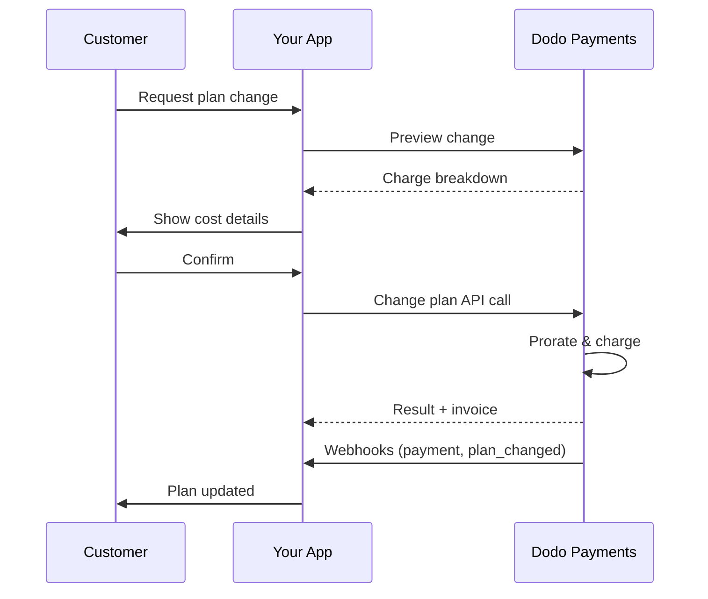
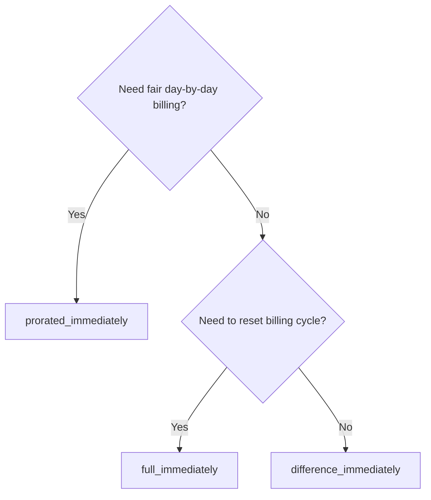
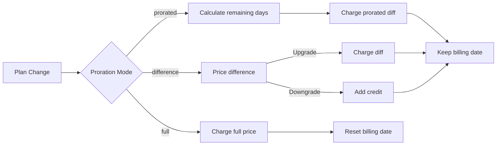

<CardGroup cols={3}>
<Card title="API de Cambio de Plan" icon="code" href="/api-reference/subscriptions/change-plan">
  Documentación completa de la API para actualizar suscripciones.
</Card>
<Card title="Vista Previa de Cambio de Plan" icon="eye" href="/api-reference/subscriptions/preview-change-plan">
  Ver cantidades de cargos antes de cambiar de plan.
</Card>
<Card title="Guía de Integración" icon="book" href="/developer-resources/subscription-integration-guide">
  Configuración de suscripción paso a paso.
</Card>
</CardGroup>

## ¿Qué es una actualización o degradación de suscripción?

Cambiar de plan permite mover a un cliente entre niveles de suscripción o cantidades. Úsalo para:
- Alinear precios con uso o características
- Pasar de mensual a anual (o viceversa)
- Ajustar cantidad para productos basados en asientos

<Info>
Los cambios de plan pueden desencadenar un cargo inmediato dependiendo del modo de prorrateo que elijas.
</Info>

## Cuándo usar cambios de plan

- Actualizar cuando un cliente necesita más funciones, uso o asientos
- Degradar cuando el uso disminuye
- Migrar usuarios a un nuevo producto o precio sin cancelar su suscripción

## Flujo de Cambio de Plan



## Requisitos previos

Antes de implementar cambios en el plan de suscripción, asegúrate de tener:

- Una cuenta de comerciante de Dodo Payments con productos de suscripción activos
- Credenciales de API (clave de API y clave secreta de webhook) desde el panel de control
- Una suscripción activa existente para modificar
- Un endpoint de webhook configurado para manejar eventos de suscripción

<Info>
Para instrucciones de configuración detalladas, consulta nuestra [Guía de Integración](/developer-resources/integration-guide#dashboard-setup).
</Info>

## Guía de Implementación Paso a Paso

Sigue esta guía completa para implementar cambios en el plan de suscripción en tu aplicación:

<Steps>
<Step title="Entender los Requisitos de Cambio de Plan">
Antes de implementar, determina:
- Qué productos de suscripción se pueden cambiar a cuáles otros
- Qué modo de prorrata se ajusta a tu modelo de negocio
- Cómo manejar los cambios de plan fallidos de manera elegante
- Qué eventos de webhook rastrear para la gestión de estado

<Tip>
Prueba los cambios de plan a fondo en modo de prueba antes de implementarlos en producción.
</Tip>
</Step>

<Step title="Elige tu Estrategia de Prorrata">
Selecciona el enfoque de facturación que se alinee con las necesidades de tu negocio:

<Tabs>
<Tab title="prorated_immediately">
Mejor para: aplicaciones SaaS que desean cobrar de manera justa por el tiempo no utilizado
- Calcula el monto prorrateado exacto basado en el tiempo restante del ciclo
- Cobra un monto prorrateado basado en el tiempo no utilizado restante en el ciclo
- Proporciona facturación transparente a los clientes
</Tab>

<Tab title="difference_immediately">
Mejor para: escenarios claros de actualización/downgrade
- Actualización: cobra la diferencia inmediata (por ejemplo, $30→$80 = cobra $50)
- Downgrade: acredita el valor restante para futuras renovaciones
- Simplifica la lógica de facturación y la comunicación con el cliente
</Tab>

<Tab title="full_immediately">
Mejor para: cuando deseas reiniciar el ciclo de facturación
- Cobra el monto total del nuevo plan de inmediato
- Ignora el tiempo restante del antiguo plan
- Útil para transiciones de anual a mensual
</Tab>
</Tabs>
</Step>

<Step title="Implementar la API de Cambio de Plan">
Usa la API de Cambio de Plan para modificar los detalles de la suscripción:

<ParamField path="subscription_id" type="string" required>
El ID de la suscripción activa a modificar.
</ParamField>

<ParamField path="product_id" type="string" required>
El nuevo ID de producto al que cambiar la suscripción.
</ParamField>

<ParamField path="quantity" type="integer" default="1">
Número de unidades para el nuevo plan (para productos basados en asientos).
</ParamField>

<ParamField path="proration_billing_mode" type="string" required>
Cómo manejar la facturación inmediata: `prorated_immediately`, `full_immediately`, o `difference_immediately`.
</ParamField>

<ParamField path="addons" type="array">
Complementos opcionales para el nuevo plan. Dejar esto vacío elimina cualquier complemento existente.
</ParamField>

<ParamField path="on_payment_failure" type="string">
Controla el comportamiento cuando falla el pago del cambio de plan:
- `prevent_change`: Mantener la suscripción en el plan actual hasta que el pago tenga éxito
- `apply_change` (por defecto): Aplicar el cambio de plan inmediatamente independientemente del resultado del pago

Si no se especifica, utiliza la configuración predeterminada a nivel de negocio.
</ParamField>
</Step>

<Step title="Manejar Eventos de Webhook">
Configura el manejo de webhook para rastrear los resultados de los cambios de plan:

- `subscription.active`: Cambio de plan exitoso, suscripción actualizada
- `subscription.plan_changed`: Plan de suscripción cambiado (actualización de mejora/degradación)
- `subscription.on_hold`: El cargo del cambio de plan falló, suscripción pausada
- `payment.succeeded`: Cargo inmediato para cambio de plan exitoso
- `payment.failed`: El cargo inmediato falló

<Warning>
Siempre verifica las firmas de los webhooks e implementa un procesamiento de eventos idempotente.
</Warning>
</Step>

<Step title="Actualiza el Estado de tu Aplicación">
Basado en eventos de webhook, actualiza tu aplicación:
- Otorgar/revocar funciones según el nuevo plan
- Actualizar el panel de control del cliente con los nuevos detalles del plan
- Enviar correos electrónicos de confirmación sobre los cambios de plan
- Registrar cambios de facturación para fines de auditoría
</Step>

<Step title="Prueba y Monitorea">
Prueba a fondo tu implementación:
- Prueba todos los modos de prorrateo con diferentes escenarios
- Verifica que el manejo de webhooks funcione correctamente
- Monitorea las tasas de éxito de los cambios de plan
- Configura alertas para cambios de plan fallidos

<Check>
Tu implementación del cambio de plan de suscripción ahora está lista para el uso en producción.
</Check>
</Step>
</Steps>

## Vista Previa de Cambios de Plan

Antes de comprometerte a un cambio de plan, usa la API de Vista Previa para mostrar a los clientes exactamente lo que se les cobrará:

<Tabs>
<Tab title="Node.js SDK">

```javascript
const preview = await client.subscriptions.previewChangePlan('sub_123', {
  product_id: 'prod_pro',
  quantity: 1,
  proration_billing_mode: 'prorated_immediately'
});

// Show customer the charge before confirming
console.log('Immediate charge:', preview.immediate_charge.summary);
console.log('New plan details:', preview.new_plan);
```

</Tab>

<Tab title="Python SDK">

```python
preview = client.subscriptions.preview_change_plan(
    subscription_id="sub_123",
    product_id="prod_pro",
    quantity=1,
    proration_billing_mode="prorated_immediately"
)

# Show customer the charge before confirming
print("Immediate charge:", preview.immediate_charge.summary)
print("New plan details:", preview.new_plan)
```

</Tab>
</Tabs>

<Tip>
Usa la API de vista previa para construir diálogos de confirmación que muestren a los clientes el monto exacto que se les cobrará antes de confirmar un cambio de plan.
</Tip>

## API de Cambio de Plan

Usa la API de Cambio de Plan para modificar el producto, cantidad, y comportamiento de prorrateo de una suscripción activa.

### Ejemplos de inicio rápido

<Tabs>
  <Tab title="Node.js SDK">

    ```javascript
    import DodoPayments from 'dodopayments';

    const client = new DodoPayments({
      bearerToken: process.env.DODO_PAYMENTS_API_KEY,
      environment: 'test_mode', // defaults to 'live_mode'
    });

    async function changePlan() {
      const result = await client.subscriptions.changePlan('sub_123', {
        product_id: 'prod_new',
        quantity: 3,
        proration_billing_mode: 'prorated_immediately',
        on_payment_failure: 'prevent_change', // Optional: control behavior on payment failure
      });
      console.log(result.status, result.invoice_id, result.payment_id);
    }

    changePlan();
    ```

  </Tab>
  <Tab title="Python SDK">

    ```python
    import os
    from dodopayments import DodoPayments

    client = DodoPayments(
        bearer_token=os.environ.get("DODO_PAYMENTS_API_KEY"),
        environment="test_mode",  # defaults to "live_mode"
    )

    result = client.subscriptions.change_plan(
        subscription_id="sub_123",
        product_id="prod_new",
        quantity=3,
        proration_billing_mode="prorated_immediately",
        on_payment_failure="prevent_change",  # Optional: control behavior on payment failure
    )
    print(result.status, result.get("invoice_id"), result.get("payment_id"))
    ```

  </Tab>
  <Tab title="Go SDK">

    ```go
    package main

    import (
      "context"
      "fmt"
      "github.com/dodopayments/dodopayments-go"
      "github.com/dodopayments/dodopayments-go/option"
    )

    func main() {
      client := dodopayments.NewClient(option.WithBearerToken("YOUR_TOKEN"))
      res, err := client.Subscriptions.ChangePlan(context.TODO(), dodopayments.SubscriptionChangePlanParams{
        SubscriptionID: dodopayments.F("sub_123"),
        ProductID:             dodopayments.F("prod_new"),
        Quantity:              dodopayments.F(int64(3)),
        ProrationBillingMode:  dodopayments.F(dodopayments.SubscriptionChangePlanParamsProrationBillingModeProratedImmediately),
        OnPaymentFailure:      dodopayments.F(dodopayments.OnPaymentFailurePreventChange), // Optional
      })
      if err != nil { panic(err) }
      fmt.Println(res.Status, res.InvoiceID, res.PaymentID)
    }
    ```

  </Tab>
  <Tab title="HTTP">

    ```bash
    curl -X POST "$DODO_API_BASE/subscriptions/sub_123/change-plan" \
      -H "Authorization: Bearer $DODO_PAYMENTS_API_KEY" \
      -H "Content-Type: application/json" \
      -d '{
        "product_id": "prod_new",
        "quantity": 3,
        "proration_billing_mode": "prorated_immediately",
        "on_payment_failure": "prevent_change"
      }'
    ```

  </Tab>
</Tabs>

```json Success
{
  "status": "processing",
  "subscription_id": "sub_123",
  "invoice_id": "inv_789",
  "payment_id": "pay_456",
  "proration_billing_mode": "prorated_immediately"
}
```

<Note>
Campos como <code>invoice_id</code> y <code>payment_id</code> se devuelven solo cuando se crea un cargo y/o factura inmediata durante el cambio de plan. Siempre confía en eventos de webhook (por ejemplo, <code>payment.succeeded</code>, <code>subscription.plan_changed</code>) para confirmar resultados.
</Note>

<Warning>
Si el cargo inmediato falla, la suscripción puede moverse a `subscription.on_hold` hasta que el pago tenga éxito.
</Warning>

## Gestionando Complementos

Al cambiar de planes de suscripción, también puedes modificar complementos:

```javascript
// Add addons to the new plan
await client.subscriptions.changePlan('sub_123', {
  product_id: 'prod_new',
  quantity: 1,
  proration_billing_mode: 'difference_immediately',
  addons: [
    { addon_id: 'addon_123', quantity: 2 }
  ]
});

// Remove all existing addons
await client.subscriptions.changePlan('sub_123', {
  product_id: 'prod_new',
  quantity: 1,
  proration_billing_mode: 'difference_immediately',
  addons: [] // Empty array removes all existing addons
});
```

<Info>
Los complementos están incluidos en el cálculo de prorrateo y se cobrarán de acuerdo con el modo de prorrateo seleccionado.
</Info>

## Modos de prorrateo

Elige cómo facturar al cliente al cambiar de planes:

#### `prorated_immediately`
- Cobra la diferencia parcial en el ciclo actual
- Si está en prueba, cobra inmediatamente y cambia al nuevo plan ahora
- Degradar: puede generar un crédito prorrateado aplicado a renovaciones futuras

#### `full_immediately`
- Cobra el monto total del nuevo plan de inmediato
- Ignora el tiempo restante del antiguo plan

<Info>
Los créditos creados por degradaciones usando <code>difference_immediately</code> son específicos de la suscripción y distintos de <a href="/features/customer-credit">Créditos del Cliente</a>. Se aplican automáticamente a futuras renovaciones de la misma suscripción y no son transferibles entre suscripciones.
</Info>

#### `difference_immediately`
- Mejora: cobrar de inmediato la diferencia de precio entre los antiguos y nuevos planes
- Degradar: agregar el valor restante como crédito interno a la suscripción y aplicarlo automáticamente en las renovaciones

| Función | `prorated_immediately` | `difference_immediately` | `full_immediately` |
|---------|----------------------|------------------------|-------------------|
| **Cargo de mejora** | Diferencia prorrateada por días restantes | Diferencia total de precios entre planes | Precio total del nuevo plan |
| **Crédito de degradación** | Crédito prorrateado por días restantes | Diferencia total de precio como crédito | Sin crédito |
| **Ciclo de facturación** | Sin cambios | Sin cambios | Se restablece a hoy |
| **Comportamiento de prueba** | Termina la prueba, cobra inmediatamente | Termina la prueba, cobra inmediatamente | Termina la prueba, cobra el monto total |
| **Mejor para** | Facturación justa basada en tiempo | Matemáticas simples de mejora/degradación | Restablecimiento de ciclos de facturación |
| **Complejidad** | Media (cálculo de días) | Baja (sustracción simple) | Baja (cobro total) |



### Escenarios de ejemplo

Usa estos números canónicos de manera consistente:
- Plan actual: **Básico** a **$30/mes**
- Objetivo de mejora: **Pro** a **$80/mes**
- Objetivo de degradación (desde Pro): **Starter** a **$20/mes**
- Ciclo de facturación: **30 días**, iniciado el **1 de enero**
- El cambio de plan ocurre el **16 de enero** (15 días restantes, 15 días utilizados)

<AccordionGroup>
  <Accordion title="Actualización: Básico ($30) → Pro ($80) con prorrateo_inmediato">

    ```
    Step 1: Calculate unused credit from current plan
      Unused days = 15 out of 30 days
      Credit = $30 × (15/30) = $15.00

    Step 2: Calculate prorated cost of new plan
      Remaining days = 15 out of 30 days
      New plan cost = $80 × (15/30) = $40.00

    Step 3: Calculate immediate charge
      Charge = New plan cost − Credit
      Charge = $40.00 − $15.00 = $25.00

    → Customer pays $25.00 now
    → Next renewal (Feb 1): $80.00/month
    ```

    ```javascript
    await client.subscriptions.changePlan('sub_123', {
      product_id: 'prod_pro',
      quantity: 1,
      proration_billing_mode: 'prorated_immediately'
    })
    ```

  </Accordion>

  <Accordion title="Degradación: Pro ($80) → Starter ($20) con prorrateo_inmediato">

    ```
    Step 1: Calculate unused credit from current plan
      Unused days = 15 out of 30 days
      Credit = $80 × (15/30) = $40.00

    Step 2: Calculate prorated cost of new plan
      Remaining days = 15 out of 30 days
      New plan cost = $20 × (15/30) = $10.00

    Step 3: Calculate credit balance
      Credit = $40.00 − $10.00 = $30.00

    → No charge — $30.00 credit added to subscription
    → Credit auto-applies to future renewals
    → Next renewal (Feb 1): $20.00 − $30.00 credit = $0.00
    → Following renewal (Mar 1): $20.00 − $10.00 remaining credit = $10.00
    ```

    ```javascript
    await client.subscriptions.changePlan('sub_123', {
      product_id: 'prod_starter',
      quantity: 1,
      proration_billing_mode: 'prorated_immediately'
    })
    ```

  </Accordion>

  <Accordion title="Actualización: Básico ($30) → Pro ($80) con diferencia_inmediata">

    ```
    Immediate charge = New plan price − Old plan price
                     = $80 − $30
                     = $50.00

    → Customer pays $50.00 now (regardless of cycle position)
    → Next renewal (Feb 1): $80.00/month
    ```

    ```javascript
    await client.subscriptions.changePlan('sub_123', {
      product_id: 'prod_pro',
      quantity: 1,
      proration_billing_mode: 'difference_immediately'
    })
    ```

  </Accordion>

  <Accordion title="Degradación: Pro ($80) → Starter ($20) con diferencia_inmediata">

    ```
    Credit = Old plan price − New plan price
           = $80 − $20
           = $60.00

    → No charge — $60.00 credit added to subscription
    → Credit auto-applies to future renewals
    → Next renewal: $20.00 − $20.00 (from credit) = $0.00
    → Following renewal: $20.00 − $20.00 (from credit) = $0.00
    → Third renewal: $20.00 − $20.00 (from remaining credit) = $0.00
    ```

    ```javascript
    await client.subscriptions.changePlan('sub_123', {
      product_id: 'prod_starter',
      quantity: 1,
      proration_billing_mode: 'difference_immediately'
    })
    ```

  </Accordion>

  <Accordion title="Actualización: Básico ($30) → Pro ($80) con total_inmediato">

    ```
    Immediate charge = Full new plan price = $80.00

    → Customer pays $80.00 now
    → No credit for unused time on old plan
    → Billing cycle resets to today (January 16)
    → Next renewal: February 16 at $80.00/month
    ```

    ```javascript
    await client.subscriptions.changePlan('sub_123', {
      product_id: 'prod_pro',
      quantity: 1,
      proration_billing_mode: 'full_immediately'
    })
    ```

  </Accordion>

  <Accordion title="Actualización a mitad de ciclo con complementos usando prorrateo_inmediato">

    ```
    Current: Basic plan ($30/month), no add-ons
    New: Pro plan ($80/month) + Extra Seats add-on ($10/seat × 3 seats = $30/month)
    Change on day 16 of 30 (15 days remaining)

    Step 1: Credit from current plan
      Credit = $30 × (15/30) = $15.00

    Step 2: Prorated cost of new plan + add-ons
      New plan = $80 × (15/30) = $40.00
      Add-ons = $30 × (15/30) = $15.00
      Total new = $55.00

    Step 3: Immediate charge
      Charge = $55.00 − $15.00 = $40.00

    → Customer pays $40.00 now
    → Next renewal: $80.00 + $30.00 = $110.00/month
    ```

    ```javascript
    await client.subscriptions.changePlan('sub_123', {
      product_id: 'prod_pro',
      quantity: 1,
      proration_billing_mode: 'prorated_immediately',
      addons: [
        { addon_id: 'addon_seats', quantity: 3 }
      ]
    })
    ```

  </Accordion>
</AccordionGroup>

### Cómo cada modo procesa la facturación



<Tip>
Elige `prorated_immediately` para una contabilidad justa basada en tiempo; elige `full_immediately` para reiniciar la facturación; usa `difference_immediately` para mejoras simples y crédito automático en degradaciones.
</Tip>

## Manejo de Fallas de Pago

Controla lo que sucede cuando falla un pago por cambio de plan usando el parámetro `on_payment_failure`.

### Modos de Falla de Pago

<Tabs>
<Tab title="prevent_change (Recomendado para mejoras críticas)">
**Comportamiento**: Mantiene la suscripción en su plan actual hasta que el pago tenga éxito.

- El cambio de plan se marca como "pendiente"
- El cliente mantiene acceso a su plan actual
- La suscripción se mueve al estado `active` solo después del pago exitoso
- Útil cuando deseas asegurar el pago antes de otorgar características mejoradas

```javascript
await client.subscriptions.changePlan('sub_123', {
  product_id: 'prod_pro',
  quantity: 1,
  proration_billing_mode: 'prorated_immediately',
  on_payment_failure: 'prevent_change'
});
```

</Tab>

<Tab title="apply_change (Por defecto)">
**Comportamiento**: Aplica el cambio de plan inmediatamente independientemente del resultado del pago.

- El cambio de plan se aplica incluso si el pago falla
- El cliente obtiene acceso inmediato al nuevo plan
- La suscripción puede moverse a `on_hold` si falla el pago
- Bueno para mejoras no críticas o cuando confías en el cliente

```javascript
await client.subscriptions.changePlan('sub_123', {
  product_id: 'prod_pro',
  quantity: 1,
  proration_billing_mode: 'prorated_immediately',
  on_payment_failure: 'apply_change' // This is the default
});
```

</Tab>
</Tabs>

<Info>
Si no se especifica, el parámetro `on_payment_failure` utiliza tu configuración predeterminada a nivel de negocio configurada en el panel de control.
</Info>

### Cuándo Utilizar Cada Modo

| Escenario | Modo Recomendado | Razón |
|----------|------------------|--------|
| Mejorando a funciones premium | `prevent_change` | Asegurar el pago antes de otorgar acceso |
| Aumento de cantidad (más asientos) | `prevent_change` | Prevenir uso sin pago |
| Degradando planes | `apply_change` | El cliente está reduciendo gastos |
| Clientes empresariales de confianza | `apply_change` | Menor riesgo de impago |
| Conversión de prueba a pagada | `prevent_change` | Momento crítico de pago |

## Manejo de webhooks

Rastrea el estado de la suscripción a través de webhooks para confirmar cambios de plan y pagos.

### Tipos de eventos a manejar
- `subscription.active`: suscripción activada
- `subscription.plan_changed`: plan de suscripción cambiado (mejora/degradación/cambios de complemento)
- `subscription.on_hold`: cargo fallido, suscripción pausada
- `subscription.renewed`: renovación exitosa
- `payment.succeeded`: pago por cambio de plan o renovación exitosa
- `payment.failed`: pago fallido

<Info>
Recomendamos compartir la lógica empresarial a partir de eventos de suscripción y usar eventos de pago para confirmación y reconciliación.
</Info>

### Verificar firmas y manejar intenciones

<Tabs>
  <Tab title="Manejador de Rutas de Next.js">

    ```javascript
    import { NextRequest, NextResponse } from 'next/server';
    
    export async function POST(req) {
      const webhookId = req.headers.get('webhook-id');
      const webhookSignature = req.headers.get('webhook-signature');
      const webhookTimestamp = req.headers.get('webhook-timestamp');
      const secret = process.env.DODO_WEBHOOK_SECRET;
    
      const payload = await req.text();
      // verifySignature is a placeholder – in production, use a Standard Webhooks library
      const { valid, event } = await verifySignature(
        payload,
        { id: webhookId, signature: webhookSignature, timestamp: webhookTimestamp },
        secret
      );
      if (!valid) return NextResponse.json({ error: 'Invalid signature' }, { status: 400 });
    
      switch (event.type) {
        case 'subscription.active':
          // mark subscription active in your DB
          break;
        case 'subscription.plan_changed':
          // refresh entitlements and reflect the new plan in your UI
          break;
        case 'subscription.on_hold':
          // notify user to update payment method
          break;
        case 'subscription.renewed':
          // extend access window
          break;
        case 'payment.succeeded':
          // reconcile payment for plan change
          break;
        case 'payment.failed':
          // log and alert
          break;
        default:
          // ignore unknown events
          break;
      }
    
      return NextResponse.json({ received: true });
    }
    ```

  </Tab>
  <Tab title="Express.js">

    ```javascript
    import express from 'express';
    
    const app = express();
    app.post('/webhooks/dodo', express.raw({ type: 'application/json' }), async (req, res) => {
      const webhookId = req.header('webhook-id');
      const webhookSignature = req.header('webhook-signature');
      const webhookTimestamp = req.header('webhook-timestamp');
      const secret = process.env.DODO_WEBHOOK_SECRET;
      const payload = req.body.toString('utf8');
    
      const { valid, event } = await verifySignature(
        payload,
        { id: webhookId, signature: webhookSignature, timestamp: webhookTimestamp },
        secret
      );
      if (!valid) return res.status(400).send('Invalid signature');
    
      // handle events like above
      res.json({ received: true });
    });
    
    app.listen(3000);
    ```

  </Tab>
</Tabs>

<Note>
Para esquemas de carga útiles detallados, consulta las <a href="/developer-resources/webhooks/intents/subscription">cargas útiles de webhook de suscripción</a> y las <a href="/developer-resources/webhooks/intents/payment">cargas útiles de webhook de pago</a>.
</Note>

## Mejores Prácticas

Sigue estas recomendaciones para cambios de plan de suscripción confiables:

### Estrategia de Cambio de Plan
- **Prueba a fondo**: Siempre prueba los cambios de plan en modo de prueba antes de producción
- **Elige prorrateo cuidadosamente**: Selecciona el modo de prorrateo que se alinee con tu modelo de negocio
- **Maneja fallas con gracia**: Implementa un manejo adecuado de errores y lógica de reintento
- **Monitorea tasas de éxito**: Rastrea tasas de éxito/fallo de cambio de plan e investiga problemas

### Implementación de Webhook
- **Verifica firmas**: Siempre valida las firmas de los webhooks para garantizar autenticidad
- **Implementa idempotencia**: Maneja eventos de webhook duplicados con gracia
- **Procesa asíncronamente**: No bloquees las respuestas de webhook con operaciones pesadas
- **Registra todo**: Mantén registros detallados para depuración y propósitos de auditoría

### Experiencia del Usuario
- **Comunica claramente**: Informa a los clientes sobre cambios de facturación y tiempos
- **Proporciona confirmaciones**: Envía correos electrónicos de confirmación para cambios de plan exitosos
- **Maneja casos límites**: Considera períodos de prueba, prorrateos y pagos fallidos
- **Actualiza la UI inmediatamente**: Refleja los cambios de plan en tu interfaz de aplicación

## Problemas Comunes y Soluciones

Resuelve problemas típicos encontrados durante cambios de plan de suscripción:

<AccordionGroup>
<Accordion title="Cargo creado pero suscripción no actualizada">
**Síntomas**: Llamada a la API tiene éxito pero la suscripción permanece en el viejo plan

**Causas comunes**:
- Procesamiento de webhook fallido o retrasado
- Estado de la aplicación no actualizado después de recibir webhooks
- Problemas de transacción en la base de datos durante la actualización del estado

**Soluciones**:
- Implementa un manejo robusto de webhooks con lógica de reintento
- Usa operaciones idempotentes para actualizaciones de estado
- Añade monitoreo para detectar y alertar sobre eventos de webhook perdidos
- Verifica que el endpoint de webhook sea accesible y responda correctamente
</Accordion>

<Accordion title="Créditos no aplicados después de degradación">
**Síntomas**: El cliente degrada pero no ve saldo de crédito

**Causas comunes**:
- Expectativas del modo de prorrateo: los créditos de degradación aplican la diferencia total del precio del plan con `difference_immediately`, mientras que `prorated_immediately` crea un crédito prorrateado basado en el tiempo restante en el ciclo
- Los créditos son específicos de la suscripción y no se transfieren entre suscripciones
- Saldo de crédito no visible en el panel del cliente

**Soluciones**:
- Usa `difference_immediately` para degradaciones cuando deseas créditos automáticos
- Explica a los clientes que los créditos se aplican a futuras renovaciones de la misma suscripción
- Implementa un portal para clientes que muestre saldos de crédito
- Verifica la vista previa de la próxima factura para ver créditos aplicados
</Accordion>

<Accordion title="Falla de verificación de firma de webhook">
**Síntomas**: Eventos de webhook rechazados debido a firma inválida

**Causas comunes**:
- Clave secreta incorrecta del webhook
- Cuerpo de solicitud en bruto modificado antes de la verificación de la firma
- Algoritmo de verificación de firma incorrecto

**Soluciones**:
- Verifica que estás usando el `DODO_WEBHOOK_SECRET` correcto desde el dashboard
- Lee el cuerpo de la solicitud en bruto antes de cualquier middleware de análisis de JSON
- Usa la biblioteca estándar de verificación de webhook para tu plataforma
- Prueba la verificación de la firma del webhook en el entorno de desarrollo
</Accordion>

<Accordion title="El cambio de plan falla con error 422">
**Síntomas**: La API devuelve el error 422 Entidad No Procesable

**Causas comunes**:
- ID de suscripción o ID de producto inválidos
- Suscripción no en estado activo
- Falta de parámetros requeridos
- Producto no disponible para cambios de plan

**Soluciones**:
- Verifica que la suscripción exista y esté activa
- Verifica que el ID de producto sea válido y esté disponible
- Asegúrate de que se proporcionen todos los parámetros requeridos
- Revisa la documentación de la API para los requisitos de parámetros
</Accordion>

<Accordion title="El cargo inmediato falla durante el cambio de plan">
**Síntomas**: Cambio de plan iniciado pero el cargo inmediato falla

**Causas comunes**:
- Fondos insuficientes en el método de pago del cliente
- El método de pago ha caducado o es inválido
- El banco rechazó la transacción
- La detección de fraude bloqueó el cargo

**Soluciones**:
- Maneja los eventos de webhook `payment.failed` adecuadamente
- Notifica al cliente que actualice el método de pago
- Implementa lógica de reintento para fallas temporales
- Considera permitir cambios de plan con cargos inmediatos fallidos
</Accordion>

<Accordion title="Suscripción en espera después del cambio de plan">
**Síntomas**: El cargo por cambio de plan falla y la suscripción se mueve al estado `on_hold`

**Qué sucede**:
Cuando falla un cargo por cambio de plan, la suscripción se coloca automáticamente en el estado `on_hold`. La suscripción no se renovará automáticamente hasta que se actualice el método de pago.

**Solución**: Actualiza el método de pago para reactivar la suscripción

Para reactivar una suscripción desde el estado `on_hold` después de un cambio de plan fallido:

1. **Actualiza el método de pago** usando la API de Actualización de Método de Pago
2. **Creación automática de cargos**: La API crea automáticamente un cargo para los montos restantes
3. **Generación de factura**: Se genera una factura para el cargo
4. **Procesamiento de pago**: El pago se procesa utilizando el nuevo método de pago
5. **Reactivación**: Tras un pago exitoso, la suscripción se reactiva al estado `active`

<CodeGroup>

```javascript Node.js
// Reactivate subscription from on_hold after failed plan change
async function reactivateAfterFailedPlanChange(subscriptionId) {
  // Update payment method - automatically creates charge for remaining dues
  const response = await client.subscriptions.updatePaymentMethod(subscriptionId, {
    type: 'new',
    return_url: 'https://example.com/return'
  });
  
  if (response.payment_id) {
    console.log('Charge created for remaining dues:', response.payment_id);
    console.log('Payment link:', response.payment_link);
    
    // Redirect customer to payment_link to complete payment
    // Monitor webhooks for:
    // 1. payment.succeeded - charge succeeded
    // 2. subscription.active - subscription reactivated
  }
  
  return response;
}

// Or use existing payment method if available
async function reactivateWithExistingPaymentMethod(subscriptionId, paymentMethodId) {
  const response = await client.subscriptions.updatePaymentMethod(subscriptionId, {
    type: 'existing',
    payment_method_id: paymentMethodId
  });
  
  // Monitor webhooks for payment.succeeded and subscription.active
  return response;
}
```

```python Python
# Reactivate subscription from on_hold after failed plan change
def reactivate_after_failed_plan_change(subscription_id):
    # Update payment method - automatically creates charge for remaining dues
    response = client.subscriptions.update_payment_method(
        subscription_id=subscription_id,
        type="new",
        return_url="https://example.com/return"
    )
    
    if response.payment_id:
        print("Charge created for remaining dues:", response.payment_id)
        print("Payment link:", response.payment_link)
        
        # Redirect customer to payment_link to complete payment
        # Monitor webhooks for:
        # 1. payment.succeeded - charge succeeded
        # 2. subscription.active - subscription reactivated
    
    return response

# Or use existing payment method if available
def reactivate_with_existing_payment_method(subscription_id, payment_method_id):
    response = client.subscriptions.update_payment_method(
        subscription_id=subscription_id,
        type="existing",
        payment_method_id=payment_method_id
    )
    
    # Monitor webhooks for payment.succeeded and subscription.active
    return response
```

</CodeGroup>

**Eventos de webhook a monitorear**:
- `subscription.on_hold`: Suscripción colocada en espera (recibido cuando falla el cargo por cambio de plan)
- `payment.succeeded`: Pago por cantidades restantes exitoso (después de actualizar el método de pago)
- `subscription.active`: Suscripción reactivada después del pago exitoso

**Mejores prácticas**:
- Notifica a los clientes inmediatamente cuando falle un cargo por cambio de plan
- Proporciona instrucciones claras sobre cómo actualizar su método de pago
- Monitorea eventos de webhook para rastrear el estado de reactivación
- Considera implementar lógica de reintento automática para fallas de pago temporales

<Card title="Referencia de API de Actualización de Método de Pago" icon="code" href="/api-reference/subscriptions/update-payment-method">
Consulta la documentación completa de la API para actualizar métodos de pago y reactivar suscripciones.
</Card>
</Accordion>
</AccordionGroup>

## Pruebas de tu Implementación

Sigue estos pasos para probar a fondo tu implementación de cambio de plan de suscripción:

<Steps>
<Step title="Configurar entorno de prueba">
- Utiliza claves de API de prueba y productos de prueba
- Crea suscripciones de prueba con diferentes tipos de plan
- Configura el endpoint de webhook de prueba
- Instala monitoreo y registro
</Step>

<Step title="Probar diferentes modos de prorrateo">
- Prueba `prorated_immediately` con varias posiciones del ciclo de facturación
- Prueba `difference_immediately` para mejoras y degradaciones
- Prueba `full_immediately` para restablecer ciclos de facturación
- Verifica que los cálculos de crédito sean correctos
</Step>

<Step title="Probar manejo de webhooks">
- Verifica que todos los eventos de webhook relevantes sean recibidos
- Prueba la verificación de firma de webhooks
- Maneja eventos de webhook duplicados con gracia
- Prueba escenarios de falla de procesamiento de webhooks
</Step>

<Step title="Probar escenarios de error">
- Prueba con IDs de suscripción inválidos
- Prueba con métodos de pago caducados
- Prueba fallas de red y tiempos de espera
- Prueba con fondos insuficientes
</Step>

<Step title="Monitorear en producción">
- Configura alertas para cambios de plan fallidos
- Monitorea tiempos de procesamiento de webhooks
- Rastrea tasas de éxito de cambios de plan
- Revisa tickets de soporte al cliente para problemas de cambio de plan
</Step>
</Steps>

## Manejo de Errores

Maneja errores comunes de la API de manera adecuada en tu implementación:

### Códigos de Estado HTTP

<AccordionGroup>
<Accordion title="200 OK">
Solicitud de cambio de plan procesada con éxito. La suscripción se está actualizando y el procesamiento de pago ha comenzado.
</Accordion>

<Accordion title="400 Bad Request">
Parámetros de solicitud inválidos. Verifica que todos los campos requeridos estén presentes y correctamente formateados.
</Accordion>

<Accordion title="401 Unauthorized">
Clave de API inválida o faltante. Verifica que tu `DODO_PAYMENTS_API_KEY` sea correcto y tenga los permisos adecuados.
</Accordion>

<Accordion title="404 Not Found">
ID de suscripción no encontrado o no pertenece a tu cuenta.
</Accordion>

<Accordion title="422 Unprocessable Entity">
La suscripción no puede ser cambiada (por ejemplo, ya cancelada, producto no disponible, etc.).
</Accordion>

<Accordion title="500 Internal Server Error">
Se produjo un error en el servidor. Reintenta la solicitud después de un breve retraso.
</Accordion>
</AccordionGroup>

### Formato de Respuesta de Error

```json
{
  "error": {
    "code": "subscription_not_found",
    "message": "The subscription with ID 'sub_123' was not found",
    "details": {
      "subscription_id": "sub_123"
    }
  }
}
```

## Próximos pasos

- Revisa la <a href="/api-reference/subscriptions/change-plan">API de Cambio de Plan</a>
- Explora <a href="/features/customer-credit">Créditos del Cliente</a>
- Implementa alertas para `subscription.on_hold`
- Consulta nuestra <a href="/developer-resources/webhooks">Guía de Integración de Webhook</a>
