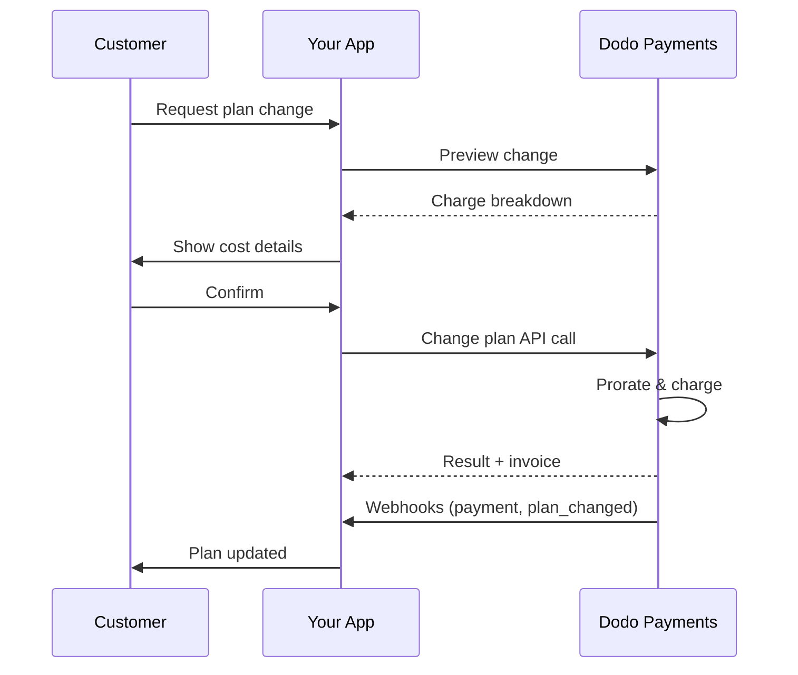
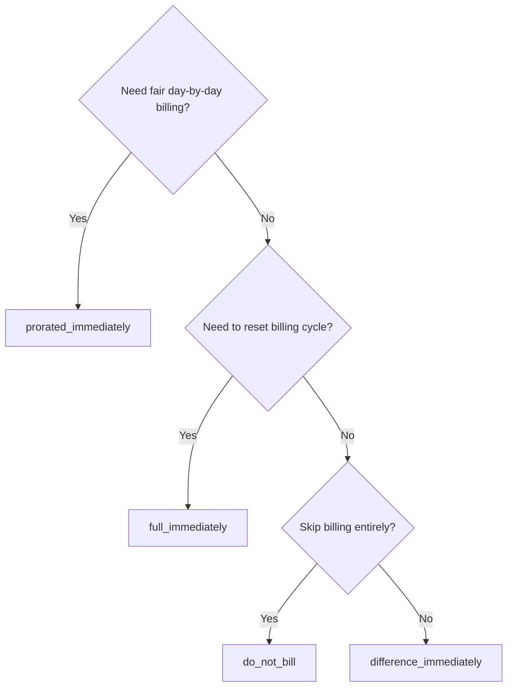
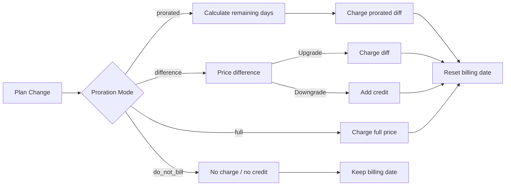

<CardGroup cols={3}>
<Card title="Change Plan API" icon="code" href="/api-reference/subscriptions/change-plan">
  Full API docs for updating subscriptions.
</Card>
<Card title="Plan Change Preview" icon="eye" href="/api-reference/subscriptions/preview-change-plan">
  See charge amounts before changing plans.
</Card>
<Card title="Integration Guide" icon="book" href="/developer-resources/subscription-integration-guide">
  Step-by-step subscription setup.
</Card>
</CardGroup>

## What is a subscription upgrade or downgrade?

Changing plans lets you move a customer between subscription tiers or quantities. Use it to:
- Align pricing with usage or features
- Move from monthly to annual (or vice versa)
- Adjust quantity for seat-based products

<Info>
Plan changes can trigger an immediate charge depending on the proration mode you choose.
</Info>

## When to use plan changes

- Upgrade when a customer needs more features, usage, or seats
- Downgrade when usage decreases
- Migrate users to a new product or price without cancelling their subscription

## Plan Change Flow



## Prerequisites

Before implementing subscription plan changes, ensure you have:

- A Dodo Payments merchant account with active subscription products
- API credentials (API key and webhook secret key) from the dashboard
- An existing active subscription to modify
- Webhook endpoint configured to handle subscription events

<Info>
For detailed setup instructions, see our [Integration Guide](/developer-resources/integration-guide#dashboard-setup).
</Info>

## Step-by-Step Implementation Guide

Follow this comprehensive guide to implement subscription plan changes in your application:

<Steps>
<Step title="Understand Plan Change Requirements">
Before implementing, determine:
- Which subscription products can be changed to which others
- What proration mode fits your business model
- How to handle failed plan changes gracefully
- Which webhook events to track for state management

<Tip>
Test plan changes thoroughly in test mode before implementing in production.
</Tip>
</Step>

<Step title="Choose Your Proration Strategy">
Select the billing approach that aligns with your business needs:

<Tabs>
<Tab title="prorated_immediately">
Best for: SaaS applications wanting to charge fairly for unused time
- Calculates exact prorated amount based on remaining cycle time
- Charges a prorated amount based on unused time remaining in the cycle
- Provides transparent billing to customers
</Tab>

<Tab title="difference_immediately">
Best for: Clear upgrade/downgrade scenarios
- Upgrade: Charge immediate difference (e.g., $30→$80 = charge $50)
- Downgrade: Credit remaining value for future renewals
- Simplifies billing logic and customer communication
</Tab>

<Tab title="full_immediately">
Best for: When you want to reset the billing cycle
- Charges full amount of new plan immediately
- Ignores remaining time from old plan
- Useful for annual to monthly transitions
</Tab>

<Tab title="do_not_bill">
Best for: Free migrations, courtesy switches, or absorbing cost differences
- No charges or credits calculated
- Customer moves to the new plan immediately without any billing adjustment
- Billing cycle remains unchanged
</Tab>
</Tabs>
</Step>

<Step title="Implement the Change Plan API">
Use the Change Plan API to modify subscription details:

<ParamField path="subscription_id" type="string" required>
The ID of the active subscription to modify.
</ParamField>

<ParamField path="product_id" type="string" required>
The new product ID to change the subscription to.
</ParamField>

<ParamField path="quantity" type="integer" required>
Number of units for the new plan (for seat-based products).
</ParamField>

<ParamField path="proration_billing_mode" type="string" required>
How to handle immediate billing: `prorated_immediately`, `full_immediately`, `difference_immediately`, or `do_not_bill`.
</ParamField>

<ParamField path="addons" type="array">
Optional addons for the new plan. Leaving this empty removes any existing addons.
</ParamField>

<ParamField path="on_payment_failure" type="string">
Controls behavior when the plan change payment fails:
- `prevent_change`: Keep subscription on current plan until payment succeeds
- `apply_change` (default): Apply plan change immediately regardless of payment outcome

If not specified, uses the business-level default setting.
</ParamField>

<ParamField path="collect_via_payment_link" type="boolean">
Recopila el importe del cambio de plan mediante un enlace de pago en lugar de cargar el método de pago guardado de la suscripción. El cliente paga en una página de checkout alojada.

Requiere que la empresa tenga habilitada la capacidad `allow_plan_change_via_payment_link` (**Settings → Subscriptions → Collect Plan Change Payments by Payment Link**), `effective_at: immediately` y `on_payment_failure: prevent_change`. Consulta [Recopilar pagos mediante un enlace de checkout](#collecting-payment-via-a-checkout-link).

La ruta de vista previa lo ignora.
</ParamField>

<ParamField path="discount_codes" type="array">
Códigos de descuento **apilados** opcionales que se aplicarán al nuevo plan (máximo 20, aplicados en el orden de la matriz). El comportamiento depende de lo que envíes:

- **No proporcionado / `null`**: los descuentos existentes con `preserve_on_plan_change=true` se conservan si son aplicables al nuevo producto.
- **`[]` (matriz vacía)**: elimina todos los descuentos existentes de la suscripción.
- **`["CODE_A", "CODE_B", ...]`**: reemplaza cualquier descuento existente por este conjunto apilado.
</ParamField>

<ParamField path="discount_code" type="string" deprecated>
**Obsoleto**: para nuevas integraciones, prefiere `discount_codes`. Este campo sigue funcionando por compatibilidad con versiones anteriores, pero no se puede combinar con `discount_codes` en la misma solicitud.
</ParamField>

<ParamField path="effective_at" type="string" default="immediately">
Cuándo aplicar el cambio de plan:
- `immediately` (predeterminado): aplica el cambio de plan de inmediato
- `next_billing_date`: programa el cambio para la próxima fecha de facturación. El cliente conserva su plan actual hasta que finaliza el periodo de facturación.

Usa `next_billing_date` para las reducciones de plan, de modo que los clientes conserven los beneficios de su plan actual hasta el final del periodo de facturación.
</ParamField>
</Step>

<Step title="Handle Webhook Events">
Configura el manejo de webhooks para realizar un seguimiento de los resultados de los cambios de plan:

- `subscription.active`: cambio de plan exitoso, suscripción actualizada
- `subscription.plan_changed`: plan de suscripción cambiado (actualización/reducción del plan o actualización del addon)
- `subscription.on_hold`: el cargo del cambio de plan falló, renovaciones detenidas
- `payment.succeeded`: el cargo inmediato del cambio de plan se realizó correctamente
- `payment.failed`: el cargo inmediato falló

<Warning>
Verifica siempre las firmas de los webhooks e implementa un procesamiento de eventos idempotente.
</Warning>
</Step>

<Step title="Update Your Application State">
Según los eventos de webhook, actualiza tu aplicación:
- Concede o revoca funciones según el nuevo plan
- Actualiza el panel del cliente con los detalles del nuevo plan
- Envía correos de confirmación sobre los cambios de plan
- Registra los cambios de facturación para fines de auditoría
</Step>

<Step title="Test and Monitor">
Prueba exhaustivamente tu implementación:
- Prueba todos los modos de prorrateo con distintos escenarios
- Verifica que el manejo de webhooks funcione correctamente
- Supervisa las tasas de éxito de los cambios de plan
- Configura alertas para los cambios de plan fallidos

<Check>
Tu implementación de cambios de plan de suscripción ya está lista para usarse en producción.
</Check>
</Step>
</Steps>

## Vista previa de los cambios de plan

Antes de confirmar un cambio de plan, usa la Preview API para mostrar a los clientes exactamente cuánto se les cobrará:

<Tabs>
<Tab title="Node.js SDK">

```javascript
const preview = await client.subscriptions.previewChangePlan('sub_123', {
  product_id: 'pdt_pro',
  quantity: 1,
  proration_billing_mode: 'prorated_immediately'
});

// Show customer the charge before confirming
console.log('Immediate charge:', preview.immediate_charge.summary);
console.log('New plan details:', preview.new_plan);
```

</Tab>

<Tab title="Python SDK">

```python
preview = client.subscriptions.preview_change_plan(
    subscription_id="sub_123",
    product_id="pdt_pro",
    quantity=1,
    proration_billing_mode="prorated_immediately"
)

# Show customer the charge before confirming
print("Immediate charge:", preview.immediate_charge.summary)
print("New plan details:", preview.new_plan)
```

</Tab>
</Tabs>

<Tip>
Usa la Preview API para crear diálogos de confirmación que muestren a los clientes el importe exacto que se les cobrará antes de confirmar un cambio de plan.
</Tip>

## Change Plan API

Usa la Change Plan API para modificar el producto, la cantidad y el comportamiento del prorrateo de una suscripción activa.

### Ejemplos de inicio rápido

<Tabs>
  <Tab title="Node.js SDK">

    ```javascript
    import DodoPayments from 'dodopayments';

    const client = new DodoPayments({
      bearerToken: process.env.DODO_PAYMENTS_API_KEY,
      environment: 'test_mode', // defaults to 'live_mode'
    });

    async function changePlan() {
      // change-plan returns 200 with an empty body.
      await client.subscriptions.changePlan('sub_123', {
        product_id: 'pdt_new',
        quantity: 3,
        proration_billing_mode: 'prorated_immediately',
        on_payment_failure: 'prevent_change', // Optional: control behavior on payment failure
      });
      console.log('Plan change accepted; awaiting webhooks');
    }

    changePlan();
    ```

  </Tab>
  <Tab title="Python SDK">

    ```python
    import os
    from dodopayments import DodoPayments

    client = DodoPayments(
        bearer_token=os.environ.get("DODO_PAYMENTS_API_KEY"),
        environment="test_mode",  # defaults to "live_mode"
    )

    # change_plan returns 200 with an empty body.
    client.subscriptions.change_plan(
        subscription_id="sub_123",
        product_id="pdt_new",
        quantity=3,
        proration_billing_mode="prorated_immediately",
        on_payment_failure="prevent_change",  # Optional: control behavior on payment failure
    )
    print("Plan change accepted; awaiting webhooks")
    ```

  </Tab>
  <Tab title="Go SDK">

    ```go
    package main

    import (
      "context"
      "fmt"
      "github.com/dodopayments/dodopayments-go"
      "github.com/dodopayments/dodopayments-go/option"
    )

    func main() {
      client := dodopayments.NewClient(option.WithBearerToken("YOUR_TOKEN"))
      // ChangePlan returns no response body; a nil error means the change succeeded.
      err := client.Subscriptions.ChangePlan(context.TODO(), "sub_123", dodopayments.SubscriptionChangePlanParams{
        UpdateSubscriptionPlanReq: dodopayments.UpdateSubscriptionPlanReqParam{
          ProductID:            dodopayments.F("pdt_new"),
          Quantity:             dodopayments.F(int64(3)),
          ProrationBillingMode: dodopayments.F(dodopayments.UpdateSubscriptionPlanReqProrationBillingModeProratedImmediately),
          OnPaymentFailure:     dodopayments.F(dodopayments.UpdateSubscriptionPlanReqOnPaymentFailurePreventChange), // Optional
        },
      })
      if err != nil { panic(err) }
      fmt.Println("Plan change applied")
    }
    ```

  </Tab>
  <Tab title="HTTP">

    ```bash
    curl -X POST "$DODO_API_BASE/subscriptions/sub_123/change-plan" \
      -H "Authorization: Bearer $DODO_PAYMENTS_API_KEY" \
      -H "Content-Type: application/json" \
      -d '{
        "product_id": "pdt_new",
        "quantity": 3,
        "proration_billing_mode": "prorated_immediately",
        "on_payment_failure": "prevent_change"
      }'
    ```

  </Tab>
</Tabs>

Un cambio de plan exitoso devuelve `200 OK` de inmediato, antes de que se liquide cualquier cargo. Lo que contiene el cuerpo (`ChangePlanResponse`) depende de cómo se haya cobrado el cambio:

| Caso | `payment_id` / `payment_link` / `client_secret` / `expires_on` |
|------|------------------------------------------------------------|
| Cambio programado (`effective_at: next_billing_date`) | Todo `null`; todavía no se cobra nada |
| `proration_billing_mode: do_not_bill` | Todo `null`; no hay nada que cobrar |
| Cargo inmediato ordinario (método de pago guardado) | Todo `null` |
| `collect_via_payment_link: true` (enlace emitido) | Todo **completado**; identificadores de checkout para el cliente |

<Note>
En todos los casos, esta respuesta no es un resultado de pago; solo indica que la solicitud fue aceptada. No dice nada sobre si un cargo inmediato se realizó correctamente.

En el caso de un **cargo inmediato ordinario**, el resultado se resuelve fuera de sesión justo después de la llamada.

En el caso de una **solicitud `collect_via_payment_link`**, se resuelve más tarde y de forma asíncrona: la respuesta solo te entrega un enlace de checkout, la suscripción permanece en su plan actual y no se conoce el resultado hasta que el cliente completa el pago mediante ese enlace.

En cualquier caso, no deduzcas el resultado a partir de esta respuesta. Confírmalo mediante un webhook (<code>payment.succeeded</code>, <code>payment.failed</code>, <code>subscription.plan_changed</code>) o volviendo a leer la suscripción con <code>GET /subscriptions/&#123;subscription_id&#125;</code>. Consulta [Qué sucede mientras el enlace no está pagado](#what-happens-while-the-link-is-unpaid) específicamente para el caso del enlace de pago.
</Note>

<Warning>
Si el cargo inmediato falla, la suscripción puede pasar al estado `subscription.on_hold` hasta que el pago se realice correctamente.
</Warning>

## Recopilar pagos mediante un enlace de checkout

De forma predeterminada, un cambio de plan inmediato carga directamente el método de pago guardado de la suscripción. Establece `collect_via_payment_link: true` para enviar al cliente a una página de checkout alojada. Esto resulta útil cuando no existe un método de pago guardado que puedas cargar fuera de sesión o cuando quieres que el cliente confirme activamente el nuevo precio.

<Info>
Esto también es lo que activa el selector **Collect Plan Change Payments by Payment Link** en **Settings → Subscriptions**, que dirige el flujo de cambio de plan del [Customer Portal](/features/customer-portal#collecting-plan-change-payments-by-payment-link) integrado mediante checkout en lugar de usar la tarjeta guardada.
</Info>

### Requisitos

`collect_via_payment_link: true` solo funciona correctamente cuando se cumplen **todas** las condiciones siguientes; de lo contrario, la solicitud falla con `422`:

- La empresa tiene habilitada la capacidad `allow_plan_change_via_payment_link` (**Settings → Subscriptions → Collect Plan Change Payments by Payment Link**).
- `effective_at` es `immediately` (el valor predeterminado). Un cambio programado (`next_billing_date`) nunca necesita una página de checkout, ya que no se cobra nada hasta que se aplica.
- El `on_payment_failure` **efectivo** se resuelve como `prevent_change`. No tienes que enviarlo explícitamente: si el valor predeterminado a nivel de empresa (consulta **Business & Collection Defaults** más abajo) ya es `prevent_change`, omitir el campo también cumple este requisito. Un `apply_change` explícito o un valor predeterminado resuelto como `apply_change` falla con `422`.

<Info>
`collect_via_payment_link` no se limita a las actualizaciones: se aplica a cualquier cambio inmediato que genere un cargo, incluidas las reducciones, siempre que se cumplan los requisitos anteriores.
</Info>

Si el cambio resulta en **cero o en un crédito** (`proration_billing_mode: do_not_bill` u otro modo cuyo resultado neto sea cero en este ciclo), no hay nada que colocar en una página de checkout. No se emite ningún enlace de pago, `payment_link` y otros campos similares devuelven `null`, y el cambio se aplica de inmediato, igual que sin `collect_via_payment_link`. Esto no es un `422`; el indicador solo tiene efecto cuando existe un importe positivo que cobrar. Si estableces `collect_via_payment_link` para cambios de plan de forma general, en lugar de hacerlo únicamente para actualizaciones claras, llama primero a [Preview Plan Change](/api-reference/subscriptions/preview-change-plan) y solicita un enlace solo cuando el importe de la vista previa merezca la pena cobrarlo.

<Tabs>
<Tab title="Node.js SDK">

```javascript
const response = await client.subscriptions.changePlan('sub_123', {
  product_id: 'pdt_pro',
  quantity: 1,
  proration_billing_mode: 'prorated_immediately',
  effective_at: 'immediately',
  on_payment_failure: 'prevent_change',
  collect_via_payment_link: true,
});

// Hand response.payment_link to your frontend and send the customer there
console.log(response.payment_link);
```

</Tab>
<Tab title="Python SDK">

```python
response = client.subscriptions.change_plan(
    subscription_id="sub_123",
    product_id="pdt_pro",
    quantity=1,
    proration_billing_mode="prorated_immediately",
    effective_at="immediately",
    on_payment_failure="prevent_change",
    collect_via_payment_link=True,
)

# Hand response.payment_link to your frontend and send the customer there
print(response.payment_link)
```

</Tab>
<Tab title="HTTP">

```bash
curl -X POST "$DODO_API_BASE/subscriptions/sub_123/change-plan" \
  -H "Authorization: Bearer $DODO_PAYMENTS_API_KEY" \
  -H "Content-Type: application/json" \
  -d '{
    "product_id": "pdt_pro",
    "quantity": 1,
    "proration_billing_mode": "prorated_immediately",
    "effective_at": "immediately",
    "on_payment_failure": "prevent_change",
    "collect_via_payment_link": true
  }'
```

</Tab>
</Tabs>

Una solicitud exitosa devuelve los identificadores de checkout:

```json
{
  "payment_id": "<payment_id>",
  "payment_link": "https://checkout.dodopayments.com/...",
  "client_secret": "<client_secret>",
  "expires_on": "<expires_on>"
}
```

### Qué sucede mientras el enlace no está pagado

- La suscripción permanece en su plan **actual**; `product_id`, `recurring_pre_tax_amount` e `next_billing_date` no cambian hasta que se pague el enlace.
- Una nueva solicitud `change-plan` para la misma suscripción se rechaza con `409 PendingPlanChangeExists` mientras el enlace está pendiente. Si es necesario, cancela un cambio *programado* con `DELETE /subscriptions/{subscription_id}/change-plan/scheduled`, pero ese endpoint no cancela un cambio de enlace de pago pendiente; solo lo hacen un pago exitoso o la caducidad.
- El cliente puede volver a intentar pagar con tarjeta en la **misma** sesión de checkout después de un rechazo; una nueva llamada a `change-plan` no es el mecanismo para reintentar.
- Si el enlace nunca se paga, deja de funcionar después de `expires_on`; la suscripción queda automáticamente disponible para aceptar una nueva solicitud de cambio de plan poco después.
- Si ya existía un cambio *programado* (`next_billing_date`) y lo reemplazas por `cancel_scheduled_change_plan: true`, la programación original se mantiene mientras el enlace no esté pagado y solo se cancela cuando se paga el enlace, en la misma transacción que aplica el nuevo plan.

<Warning>
Una vez emitido un cambio inmediato mediante enlace de pago, cualquier solicitud posterior de cambio de plan para esa suscripción, incluida la vista previa sin efectos secundarios, queda bloqueada hasta que el enlace se resuelva. No emitas un enlace si no pretendes que el cliente lo pague de inmediato.
</Warning>

## Gestionar addons

Al cambiar los planes de suscripción, también puedes modificar los addons:

```javascript
// Add addons to the new plan
await client.subscriptions.changePlan('sub_123', {
  product_id: 'pdt_new',
  quantity: 1,
  proration_billing_mode: 'difference_immediately',
  addons: [
    { addon_id: 'addon_123', quantity: 2 }
  ]
});

// Remove all existing addons
await client.subscriptions.changePlan('sub_123', {
  product_id: 'pdt_new',
  quantity: 1,
  proration_billing_mode: 'difference_immediately',
  addons: [] // Empty array removes all existing addons
});
```

<Info>
Los addons se incluyen en el cálculo del prorrateo y se cobran según el modo de prorrateo seleccionado.
</Info>

## Aplicar códigos de descuento

Puedes aplicar uno o más **códigos de descuento apilados** al cambiar los planes de suscripción (máximo 20, aplicados en el orden de la matriz). Esto resulta útil para ofrecer precios promocionales en actualizaciones o migraciones.

<Tabs>
<Tab title="Node.js SDK">

```javascript
// Apply stacked discount codes during plan change
await client.subscriptions.changePlan('sub_123', {
  product_id: 'pdt_pro',
  quantity: 1,
  proration_billing_mode: 'prorated_immediately',
  discount_codes: ['UPGRADE20']
});
```

</Tab>
<Tab title="Python SDK">

```python
# Apply stacked discount codes during plan change
client.subscriptions.change_plan(
    subscription_id="sub_123",
    product_id="pdt_pro",
    quantity=1,
    proration_billing_mode="prorated_immediately",
    discount_codes=["UPGRADE20"]
)
```

</Tab>
<Tab title="HTTP">

```bash
curl -X POST "$DODO_API_BASE/subscriptions/sub_123/change-plan" \
  -H "Authorization: Bearer $DODO_PAYMENTS_API_KEY" \
  -H "Content-Type: application/json" \
  -d '{
    "product_id": "pdt_pro",
    "quantity": 1,
    "proration_billing_mode": "prorated_immediately",
    "discount_codes": ["UPGRADE20"]
  }'
```

</Tab>
</Tabs>

### Comportamiento de los descuentos al cambiar de plan

| Valor de `discount_codes` | Comportamiento |
|------------------------|----------|
| No proporcionado / `null` | Los descuentos existentes con `preserve_on_plan_change=true` se conservan automáticamente si son aplicables al nuevo producto. |
| `[]` (matriz vacía) | Se eliminan **todos** los descuentos existentes de la suscripción. |
| `["CODE_A", "CODE_B", ...]` | Reemplaza cualquier descuento existente por este conjunto apilado, validado y aplicado en el orden de la matriz. |

<Info>
El campo singular `discount_code` de este endpoint está **obsoleto**, pero sigue funcionando por compatibilidad con versiones anteriores; las integraciones existentes no necesitan cambiar de inmediato. No se puede combinar con `discount_codes` en la misma solicitud. Migra al formato de matriz cuando te resulte conveniente.
</Info>

<Tip>
Usa la [Preview Plan Change API](/api-reference/subscriptions/preview-change-plan) con `discount_codes` para mostrar a los clientes exactamente cuánto ahorrarán antes de confirmar el cambio de plan.
</Tip>

## Modos de prorrateo

Elige cómo facturar al cliente al cambiar de plan:

#### `prorated_immediately`
- Cobra la diferencia parcial del ciclo actual
- Si está en periodo de prueba, cobra de inmediato y cambia ahora al nuevo plan
- Reducción: puede generar un crédito prorrateado que se aplicará a futuras renovaciones

#### `full_immediately`
- Cobra inmediatamente el importe completo del nuevo plan
- Ignora el tiempo restante del plan anterior

<Info>
Los créditos creados por reducciones mediante <code>difference_immediately</code> están asociados al ámbito de la suscripción y son distintos de las asignaciones de <a href="/features/credit-based-billing">Credit-Based Billing</a>. Se aplican automáticamente a futuras renovaciones de la misma suscripción y no se pueden transferir entre suscripciones.
</Info>

#### `difference_immediately`
- Actualización: cobra inmediatamente la diferencia de precio entre los planes anterior y nuevo
- Reducción: añade el valor restante como crédito interno a la suscripción y lo aplica automáticamente en las renovaciones

#### `do_not_bill`
- No se calculan cargos ni créditos
- El cliente cambia inmediatamente al nuevo plan sin ningún ajuste de facturación
- El ciclo de facturación no cambia
- Ideal para migraciones de cortesía, cambios a planes gratuitos o para absorber diferencias de costes

| Función | `prorated_immediately` | `difference_immediately` | `full_immediately` | `do_not_bill` |
|---------|----------------------|------------------------|-------------------|--------------|
| **Cargo por actualización** | Diferencia prorrateada por los días restantes | Diferencia de precio completa entre planes | Precio completo del nuevo plan | Sin cargo |
| **Crédito por reducción** | Crédito prorrateado por los días restantes | Diferencia de precio completa como crédito | Sin crédito | Sin crédito |
| **Ciclo de facturación** | Se restablece a hoy | Se restablece a hoy | Se restablece a hoy | Sin cambios |
| **Comportamiento durante la prueba** | Finaliza la prueba y cobra de inmediato | Finaliza la prueba y cobra de inmediato | Finaliza la prueba y cobra el importe completo | Finaliza la prueba sin cobro |
| **Ideal para** | Facturación justa basada en el tiempo | Cálculos simples de actualización/reducción | Restablecer ciclos de facturación | Migraciones gratuitas o cambios de cortesía |
| **Complejidad** | Media (cálculo por día) | Baja (resta simple) | Baja (cargo completo) | Ninguna |



### Escenarios de ejemplo

Usa estos valores canónicos de forma coherente:
- Plan actual: **Basic** a **$30/mes**
- Objetivo de actualización: **Pro** a **$80/mes**
- Objetivo de reducción (desde Pro): **Starter** a **$20/mes**
- Ciclo de facturación: **30 días**, iniciado el **1 de enero**
- El cambio de plan ocurre el **16 de enero** (quedan 15 días y se han utilizado 15 días)

<AccordionGroup>
  <Accordion title="Upgrade: Basic ($30) → Pro ($80) with prorated_immediately">

    ```
    Step 1: Calculate unused credit from current plan
      Unused days = 15 out of 30 days
      Credit = $30 × (15/30) = $15.00

    Step 2: Calculate prorated cost of new plan
      Remaining days = 15 out of 30 days
      New plan cost = $80 × (15/30) = $40.00

    Step 3: Calculate immediate charge
      Charge = New plan cost − Credit
      Charge = $40.00 − $15.00 = $25.00

    → Customer pays $25.00 now
    → Billing cycle resets to today (January 16)
    → Next renewal (Feb 15): $80.00/month
    ```

    ```javascript
    await client.subscriptions.changePlan('sub_123', {
      product_id: 'pdt_pro',
      quantity: 1,
      proration_billing_mode: 'prorated_immediately'
    })
    ```

  </Accordion>

  <Accordion title="Downgrade: Pro ($80) → Starter ($20) with prorated_immediately">

    ```
    Step 1: Calculate unused credit from current plan
      Unused days = 15 out of 30 days
      Credit = $80 × (15/30) = $40.00

    Step 2: Calculate prorated cost of new plan
      Remaining days = 15 out of 30 days
      New plan cost = $20 × (15/30) = $10.00

    Step 3: Calculate credit balance
      Credit = $40.00 − $10.00 = $30.00

    → No charge — $30.00 credit added to subscription
    → Billing cycle resets to today (January 16)
    → Credit auto-applies to future renewals
    → Next renewal (Feb 15): $20.00 − $20.00 (from credit) = $0.00 ($10.00 credit remaining)
    → Following renewal (Mar 15): $20.00 − $10.00 remaining credit = $10.00
    ```

    ```javascript
    await client.subscriptions.changePlan('sub_123', {
      product_id: 'pdt_starter',
      quantity: 1,
      proration_billing_mode: 'prorated_immediately'
    })
    ```

  </Accordion>

  <Accordion title="Upgrade: Basic ($30) → Pro ($80) with difference_immediately">

    ```
    Immediate charge = New plan price − Old plan price
                     = $80 − $30
                     = $50.00

    → Customer pays $50.00 now (regardless of cycle position)
    → Billing cycle resets to today (January 16)
    → Next renewal (Feb 15): $80.00/month
    ```

    ```javascript
    await client.subscriptions.changePlan('sub_123', {
      product_id: 'pdt_pro',
      quantity: 1,
      proration_billing_mode: 'difference_immediately'
    })
    ```

  </Accordion>

  <Accordion title="Downgrade: Pro ($80) → Starter ($20) with difference_immediately">

    ```
    Credit = Old plan price − New plan price
           = $80 − $20
           = $60.00

    → No charge — $60.00 credit added to subscription
    → Credit auto-applies to future renewals
    → Next renewal: $20.00 − $20.00 (from credit) = $0.00
    → Following renewal: $20.00 − $20.00 (from credit) = $0.00
    → Third renewal: $20.00 − $20.00 (from remaining credit) = $0.00
    ```

    ```javascript
    await client.subscriptions.changePlan('sub_123', {
      product_id: 'pdt_starter',
      quantity: 1,
      proration_billing_mode: 'difference_immediately'
    })
    ```

  </Accordion>

  <Accordion title="Upgrade: Basic ($30) → Pro ($80) with full_immediately">

    ```
    Immediate charge = Full new plan price = $80.00

    → Customer pays $80.00 now
    → No credit for unused time on old plan
    → Billing cycle resets to today (January 16)
    → Next renewal: February 16 at $80.00/month
    ```

    ```javascript
    await client.subscriptions.changePlan('sub_123', {
      product_id: 'pdt_pro',
      quantity: 1,
      proration_billing_mode: 'full_immediately'
    })
    ```

  </Accordion>

  <Accordion title="Mid-cycle upgrade with add-ons using prorated_immediately">

    ```
    Current: Basic plan ($30/month), no add-ons
    New: Pro plan ($80/month) + Extra Seats add-on ($10/seat × 3 seats = $30/month)
    Change on day 16 of 30 (15 days remaining)

    Step 1: Credit from current plan
      Credit = $30 × (15/30) = $15.00

    Step 2: Prorated cost of new plan + add-ons
      New plan = $80 × (15/30) = $40.00
      Add-ons = $30 × (15/30) = $15.00
      Total new = $55.00

    Step 3: Immediate charge
      Charge = $55.00 − $15.00 = $40.00

    → Customer pays $40.00 now
    → Next renewal: $80.00 + $30.00 = $110.00/month
    ```

    ```javascript
    await client.subscriptions.changePlan('sub_123', {
      product_id: 'pdt_pro',
      quantity: 1,
      proration_billing_mode: 'prorated_immediately',
      addons: [
        { addon_id: 'addon_seats', quantity: 3 }
      ]
    })
    ```

  </Accordion>
</AccordionGroup>

### Cómo procesa la facturación cada modo



<Tip>
Elige `prorated_immediately` para una contabilidad justa basada en el tiempo; elige `full_immediately` para reiniciar la facturación; usa `difference_immediately` para actualizaciones simples y créditos automáticos en reducciones; o usa `do_not_bill` para cambiar de plan sin ningún ajuste de facturación.
</Tip>

## Gestionar fallos de pago

Controla lo que sucede cuando falla el pago de un cambio de plan mediante el parámetro `on_payment_failure`.

### Modos de fallo de pago

<Tabs>
<Tab title="prevent_change (Recommended for critical upgrades)">
**Comportamiento**: mantiene la suscripción en su plan actual hasta que el pago se realice correctamente.

- El cambio de plan se marca como "pending"
- El cliente conserva el acceso a su plan actual
- La suscripción pasa al estado `active` solo después de un pago exitoso
- Es útil cuando quieres asegurarte de recibir el pago antes de conceder funciones mejoradas

```javascript
await client.subscriptions.changePlan('sub_123', {
  product_id: 'pdt_pro',
  quantity: 1,
  proration_billing_mode: 'prorated_immediately',
  on_payment_failure: 'prevent_change'
});
```

</Tab>

<Tab title="apply_change (Default)">
**Comportamiento**: aplica el cambio de plan inmediatamente, independientemente del resultado del pago.

- El cambio de plan se aplica aunque el pago falle
- El cliente obtiene acceso inmediato al nuevo plan
- La suscripción puede pasar al estado `on_hold` si el pago falla
- Es adecuado para actualizaciones no críticas o cuando confías en el cliente

```javascript
await client.subscriptions.changePlan('sub_123', {
  product_id: 'pdt_pro',
  quantity: 1,
  proration_billing_mode: 'prorated_immediately',
  on_payment_failure: 'apply_change' // This is the default
});
```

</Tab>
</Tabs>

<Info>
Si no se especifica, el parámetro `on_payment_failure` usa el valor predeterminado a nivel de empresa configurado en el dashboard.
</Info>

### Cuándo usar cada modo

| Escenario | Modo recomendado | Motivo |
|----------|------------------|--------|
| Actualización a funciones premium | `prevent_change` | Asegurar el pago antes de conceder acceso |
| Aumento de cantidad (más plazas) | `prevent_change` | Evitar el uso sin pago |
| Reducción de planes | `apply_change` | El cliente está reduciendo su gasto |
| Clientes empresariales de confianza | `apply_change` | Menor riesgo de impago |
| Conversión de prueba a pago | `prevent_change` | Momento de pago crítico |

## Valores predeterminados de empresa y recopilación

En lugar de enviar parámetros de prorrateo en cada cambio de plan, puedes establecer una vez el **comportamiento predeterminado de actualización y reducción** a nivel de empresa. Estos valores predeterminados se aplican a todos los cambios de plan del portal del cliente y se pueden **anular por colección de productos**.

Existen valores predeterminados independientes para actualizaciones y reducciones:

| Configuración | Campo (actualización / reducción) | Valor predeterminado (actualización) | Valor predeterminado (reducción) |
|---------|-----------------------------|-------------------|---------------------|
| Cuándo comienza el nuevo plan | `effective_at_on_upgrade` / `effective_at_on_downgrade` | `immediately` | `next_billing_date` |
| Cómo se cobra al cliente | `proration_billing_mode_on_upgrade` / `proration_billing_mode_on_downgrade` | `difference_immediately` | `difference_immediately` |
| Si falla el pago del cliente | `on_payment_failure` | `apply_change` | `apply_change` |

Configura los valores predeterminados de la empresa en **Settings → Subscriptions** y las anulaciones de la colección en cada colección de productos. Cada campo de colección es independiente: déjalo sin establecer para **heredarlo del valor predeterminado de la empresa** o establece un valor para anularlo únicamente en esa colección.

### Orden de resolución

Para cualquier cambio de plan, cada configuración se resuelve en este orden:

```
per-request value (Change Plan API) → collection field (if set) → business field → system default
```

<Info>
Un valor enviado explícitamente a la [Change Plan API](/api-reference/subscriptions/change-plan) siempre tiene prioridad. Los valores predeterminados de empresa y colección solo se aplican cuando no se proporciona ningún valor explícito, que es el caso de todos los cambios de plan iniciados desde el portal del cliente.
</Info>

<Tip>
Una configuración habitual es mantener las actualizaciones en `immediately` + `difference_immediately` para que los clientes paguen la diferencia y obtengan acceso de inmediato, y mantener las reducciones en `next_billing_date` para que conserven su plan actual hasta que termine el ciclo.
</Tip>

## Gestionar webhooks

Realiza un seguimiento del estado de la suscripción mediante webhooks para confirmar los cambios de plan y los pagos.

### Tipos de eventos que se deben gestionar
- `subscription.active`: suscripción activada
- `subscription.plan_changed`: plan de suscripción cambiado (actualización/reducción del plan o cambios en addons)
- `subscription.on_hold`: cargo fallido, renovaciones detenidas
- `subscription.renewed`: renovación exitosa
- `payment.succeeded`: pago del cambio de plan o renovación exitoso
- `payment.failed`: pago fallido

<Info>
Recomendamos basar la lógica empresarial en los eventos de suscripción y usar los eventos de pago para la confirmación y la conciliación.
</Info>

### Verificar firmas y gestionar intents

<Tabs>
  <Tab title="Next.js Route Handler">

    ```javascript
    import { NextRequest, NextResponse } from 'next/server';
    
    export async function POST(req) {
      const webhookId = req.headers.get('webhook-id');
      const webhookSignature = req.headers.get('webhook-signature');
      const webhookTimestamp = req.headers.get('webhook-timestamp');
      const secret = process.env.DODO_WEBHOOK_SECRET;
    
      const payload = await req.text();
      // verifySignature is a placeholder – in production, use a Standard Webhooks library
      const { valid, event } = await verifySignature(
        payload,
        { id: webhookId, signature: webhookSignature, timestamp: webhookTimestamp },
        secret
      );
      if (!valid) return NextResponse.json({ error: 'Invalid signature' }, { status: 400 });
    
      switch (event.type) {
        case 'subscription.active':
          // mark subscription active in your DB
          break;
        case 'subscription.plan_changed':
          // refresh entitlements and reflect the new plan in your UI
          break;
        case 'subscription.on_hold':
          // notify user to update payment method
          break;
        case 'subscription.renewed':
          // extend access window
          break;
        case 'payment.succeeded':
          // reconcile payment for plan change
          break;
        case 'payment.failed':
          // log and alert
          break;
        default:
          // ignore unknown events
          break;
      }
    
      return NextResponse.json({ received: true });
    }
    ```

  </Tab>
  <Tab title="Express.js">

    ```javascript
    import express from 'express';
    
    const app = express();
    app.post('/webhooks/dodo', express.raw({ type: 'application/json' }), async (req, res) => {
      const webhookId = req.header('webhook-id');
      const webhookSignature = req.header('webhook-signature');
      const webhookTimestamp = req.header('webhook-timestamp');
      const secret = process.env.DODO_WEBHOOK_SECRET;
      const payload = req.body.toString('utf8');
    
      const { valid, event } = await verifySignature(
        payload,
        { id: webhookId, signature: webhookSignature, timestamp: webhookTimestamp },
        secret
      );
      if (!valid) return res.status(400).send('Invalid signature');
    
      // handle events like above
      res.json({ received: true });
    });
    
    app.listen(3000);
    ```

  </Tab>
</Tabs>

<Note>
Para consultar los esquemas detallados de las cargas útiles, revisa las <a href="/developer-resources/webhooks/intents/subscription">cargas útiles de webhook de suscripción</a> y las <a href="/developer-resources/webhooks/intents/payment">cargas útiles de webhook de pago</a>.
</Note>

## Prácticas recomendadas

Sigue estas recomendaciones para realizar cambios de plan de suscripción fiables:

### Estrategia de cambio de plan
- **Prueba exhaustivamente**: prueba siempre los cambios de plan en modo de prueba antes de pasarlos a producción
- **Elige el prorrateo cuidadosamente**: selecciona el modo de prorrateo que se ajuste a tu modelo de negocio
- **Gestiona los fallos correctamente**: implementa un manejo de errores y una lógica de reintentos adecuados
- **Supervisa las tasas de éxito**: realiza un seguimiento de las tasas de éxito y fallo de los cambios de plan e investiga los problemas

### Implementación de webhooks
- **Verifica las firmas**: valida siempre las firmas de los webhooks para garantizar su autenticidad
- **Implementa la idempotencia**: gestiona correctamente los eventos de webhook duplicados
- **Procesa de forma asíncrona**: no bloquees las respuestas de los webhooks con operaciones pesadas
- **Regístralo todo**: mantén registros detallados para la depuración y la auditoría

### Experiencia de usuario
- **Comunica claramente**: informa a los clientes sobre los cambios de facturación y sus plazos
- **Proporciona confirmaciones**: envía correos de confirmación para los cambios de plan exitosos
- **Gestiona los casos límite**: considera los periodos de prueba, los prorrateos y los pagos fallidos
- **Actualiza la interfaz de usuario de inmediato**: refleja los cambios de plan en la interfaz de tu aplicación

## Problemas habituales y soluciones

Resuelve los problemas habituales que pueden surgir durante los cambios de plan de suscripción:

<AccordionGroup>
<Accordion title="Charge created but subscription not updated">
**Síntomas**: la llamada a la API se realiza correctamente, pero la suscripción permanece en el plan anterior

**Causas habituales**:
- El procesamiento del webhook falló o se retrasó
- El estado de la aplicación no se actualizó después de recibir los webhooks
- Problemas con la transacción de la base de datos durante la actualización del estado

**Soluciones**:
- Implementa un manejo sólido de webhooks con lógica de reintentos
- Usa operaciones idempotentes para las actualizaciones de estado
- Añade supervisión para detectar y alertar sobre eventos de webhook no recibidos
- Verifica que el endpoint del webhook sea accesible y responda correctamente
</Accordion>

<Accordion title="Credits not applied after downgrade">
**Síntomas**: el cliente reduce su plan, pero no ve el saldo de crédito

**Causas habituales**:
- Expectativas sobre el modo de prorrateo: las reducciones acreditan la diferencia de precio total del plan con `difference_immediately`, mientras que `prorated_immediately` crea un crédito prorrateado según el tiempo restante del ciclo
- Los créditos son específicos de la suscripción y no se transfieren entre suscripciones
- El saldo de crédito no es visible en el panel del cliente

**Soluciones**:
- Usa `difference_immediately` para las reducciones cuando quieras créditos automáticos
- Explica a los clientes que los créditos se aplican a futuras renovaciones de la misma suscripción
- Implementa el portal del cliente para mostrar los saldos de crédito
- Consulta la vista previa de la próxima factura para ver los créditos aplicados
</Accordion>

<Accordion title="Webhook signature verification fails">
**Síntomas**: los eventos de webhook se rechazan debido a una firma no válida

**Causas habituales**:
- Clave secreta del webhook incorrecta
- El cuerpo sin procesar de la solicitud se modificó antes de verificar la firma
- Algoritmo de verificación de firma incorrecto

**Soluciones**:
- Verifica que estás usando el `DODO_WEBHOOK_SECRET` correcto del dashboard
- Lee el cuerpo sin procesar de la solicitud antes de cualquier middleware de análisis JSON
- Usa la biblioteca estándar de verificación de webhooks para tu plataforma
- Prueba la verificación de firmas de webhooks en el entorno de desarrollo
</Accordion>

<Accordion title="Plan change fails with 422 error">
**Síntomas**: la API devuelve un error 422 Unprocessable Entity

**Causas habituales**:
- ID de suscripción o ID de producto no válido
- La suscripción no está en estado activo
- Faltan parámetros obligatorios
- El producto no está disponible para cambios de plan

**Soluciones**:
- Verifica que la suscripción exista y esté activa
- Comprueba que el ID del producto sea válido y esté disponible
- Asegúrate de proporcionar todos los parámetros obligatorios
- Consulta la documentación de la API para conocer los requisitos de los parámetros
</Accordion>

<Accordion title="Immediate charge fails during plan change">
**Síntomas**: se inició el cambio de plan, pero el cargo inmediato falla

**Causas habituales**:
- Fondos insuficientes en el método de pago del cliente
- Método de pago caducado o no válido
- El banco rechazó la transacción
- La detección de fraude bloqueó el cargo

**Soluciones**:
- Gestiona adecuadamente los eventos de webhook `payment.failed`
- Notifica al cliente que debe actualizar su método de pago
- Implementa una lógica de reintentos para fallos temporales
- Considera permitir cambios de plan con cargos inmediatos fallidos
</Accordion>

<Accordion title="Subscription on hold after plan change">
**Síntomas**: el cargo del cambio de plan falla y la suscripción pasa al estado `on_hold`

**Qué sucede**:
Cuando falla el cargo de un cambio de plan, la suscripción pasa automáticamente al estado `on_hold`. La suscripción no se renovará automáticamente hasta que se actualice el método de pago.

**Solución**: actualiza el método de pago para reactivar la suscripción

Para reactivar una suscripción en estado `on_hold` después de un cambio de plan fallido:

1. **Actualiza el método de pago** mediante la Update Payment Method API
2. **Creación automática del cargo**: la API crea automáticamente un cargo por las cantidades pendientes
3. **Generación de la factura**: se genera una factura para el cargo
4. **Procesamiento del pago**: el pago se procesa mediante el nuevo método de pago
5. **Reactivación**: tras un pago exitoso, la suscripción se reactiva al estado `active`

<CodeGroup>

```javascript Node.js
// Reactivate subscription from on_hold after failed plan change
async function reactivateAfterFailedPlanChange(subscriptionId) {
  // Update payment method - automatically creates charge for remaining dues
  const response = await client.subscriptions.updatePaymentMethod(subscriptionId, {
    payment_method: { type: 'new', return_url: 'https://example.com/return' }
  });
  
  if (response.payment_id) {
    console.log('Charge created for remaining dues:', response.payment_id);
    console.log('Payment link:', response.payment_link);
    
    // Redirect customer to payment_link to complete payment
    // Monitor webhooks for:
    // 1. payment.succeeded - charge succeeded
    // 2. subscription.active - subscription reactivated
  }
  
  return response;
}

// Or use existing payment method if available
async function reactivateWithExistingPaymentMethod(subscriptionId, paymentMethodId) {
  const response = await client.subscriptions.updatePaymentMethod(subscriptionId, {
    payment_method: { type: 'existing', payment_method_id: paymentMethodId }
  });
  
  // Monitor webhooks for payment.succeeded and subscription.active
  return response;
}
```

```python Python
# Reactivate subscription from on_hold after failed plan change
def reactivate_after_failed_plan_change(subscription_id):
    # Update payment method - automatically creates charge for remaining dues
    response = client.subscriptions.update_payment_method(
        subscription_id=subscription_id,
        payment_method={"type": "new", "return_url": "https://example.com/return"},
    )
    
    if response.payment_id:
        print("Charge created for remaining dues:", response.payment_id)
        print("Payment link:", response.payment_link)
        
        # Redirect customer to payment_link to complete payment
        # Monitor webhooks for:
        # 1. payment.succeeded - charge succeeded
        # 2. subscription.active - subscription reactivated
    
    return response

# Or use existing payment method if available
def reactivate_with_existing_payment_method(subscription_id, payment_method_id):
    response = client.subscriptions.update_payment_method(
        subscription_id=subscription_id,
        payment_method={"type": "existing", "payment_method_id": payment_method_id},
    )
    
    # Monitor webhooks for payment.succeeded and subscription.active
    return response
```

</CodeGroup>

**Eventos de webhook que se deben supervisar**:
- `subscription.on_hold`: suscripción puesta en espera (se recibe cuando falla el cargo del cambio de plan)
- `payment.succeeded`: pago de las cantidades pendientes exitoso (después de actualizar el método de pago)
- `subscription.active`: suscripción reactivada tras un pago exitoso

**Prácticas recomendadas**:
- Notifica inmediatamente a los clientes cuando falle el cargo de un cambio de plan
- Proporciona instrucciones claras sobre cómo actualizar su método de pago
- Supervisa los eventos de webhook para realizar un seguimiento del estado de reactivación
- Considera implementar una lógica de reintentos automáticos para fallos de pago temporales

<Card title="Update Payment Method API Reference" icon="code" href="/api-reference/subscriptions/update-payment-method">
Consulta la documentación completa de la API para actualizar métodos de pago y reactivar suscripciones.
</Card>
</Accordion>
</AccordionGroup>

## Probar tu implementación

Sigue estos pasos para probar exhaustivamente tu implementación de cambios de plan de suscripción:

<Steps>
<Step title="Set up test environment">
- Usa API keys de prueba y productos de prueba
- Crea suscripciones de prueba con distintos tipos de plan
- Configura el endpoint de webhook de prueba
- Configura la supervisión y el registro
</Step>

<Step title="Test different proration modes">
- Prueba `prorated_immediately` con distintas posiciones del ciclo de facturación
- Prueba `difference_immediately` para actualizaciones y reducciones
- Prueba `full_immediately` para restablecer los ciclos de facturación
- Prueba `do_not_bill` para cambios de plan sin cargo ni crédito
- Verifica que los cálculos de crédito sean correctos
</Step>

<Step title="Test webhook handling">
- Verifica que se reciban todos los eventos de webhook relevantes
- Prueba la verificación de firmas de webhook
- Gestiona correctamente los eventos de webhook duplicados
- Prueba escenarios de fallo en el procesamiento de webhooks
</Step>

<Step title="Test error scenarios">
- Prueba con IDs de suscripción no válidos
- Prueba con métodos de pago caducados
- Prueba fallos de red y tiempos de espera agotados
- Prueba con fondos insuficientes
</Step>

<Step title="Monitor in production">
- Configura alertas para cambios de plan fallidos
- Supervisa los tiempos de procesamiento de webhooks
- Realiza un seguimiento de las tasas de éxito de los cambios de plan
- Revisa los tickets de soporte al cliente relacionados con problemas de cambios de plan
</Step>
</Steps>

## Gestión de errores

Gestiona correctamente los errores habituales de la API en tu implementación:

### Códigos de estado HTTP

<AccordionGroup>
<Accordion title="200 OK">
La solicitud de cambio de plan se procesó correctamente. El cuerpo de la respuesta está vacío, excepto en una solicitud `collect_via_payment_link` exitosa, que devuelve identificadores de checkout; consulta [Recopilar pagos mediante un enlace de checkout](#collecting-payment-via-a-checkout-link). Si `on_payment_failure=prevent_change`, el cambio de plan permanece pendiente hasta que el pago se realice correctamente.
</Accordion>

<Accordion title="400 Bad Request">
Parámetros de solicitud no válidos. Comprueba que todos los campos obligatorios se hayan proporcionado y tengan el formato correcto.
</Accordion>

<Accordion title="401 Unauthorized">
API key no válida o ausente. Verifica que tu `DODO_PAYMENTS_API_KEY` sea correcta y tenga los permisos adecuados.
</Accordion>

<Accordion title="404 Not Found">
No se encontró el ID de suscripción o no pertenece a tu cuenta.
</Accordion>

<Accordion title="409 Conflict">
Ya existe un cambio de plan pendiente para esta suscripción (`PendingPlanChangeExists`). Si se trata de un cambio *programado*, cancélalo con `DELETE /subscriptions/{subscription_id}/change-plan/scheduled` antes de enviar uno nuevo. Si se trata de un cambio *mediante enlace de pago* pendiente, no existe un endpoint de cancelación; la suscripción acepta una nueva solicitud de cambio de plan cuando el cliente paga o el enlace caduca.
</Accordion>

<Accordion title="422 Unprocessable Entity">
La suscripción está inactiva o es bajo demanda, o la solicitud no cumple los requisitos para `collect_via_payment_link`: la empresa no tiene habilitada la capacidad, `effective_at` no es `immediately` o `on_payment_failure` no es `prevent_change`. Consulta [Requisitos](#requirements).
</Accordion>

<Accordion title="500 Internal Server Error">
Se produjo un error del servidor. Vuelve a intentar la solicitud después de una breve espera.
</Accordion>
</AccordionGroup>

### Formato de respuesta de error

```json
{
  "error": {
    "code": "subscription_not_found",
    "message": "The subscription with ID 'sub_123' was not found",
    "details": {
      "subscription_id": "sub_123"
    }
  }
}
```

## Próximos pasos

- Revisa la <a href="/api-reference/subscriptions/change-plan">Change Plan API</a>
- Explora <a href="/features/credit-based-billing">Credit-Based Billing</a>
- Implementa alertas para `subscription.on_hold`
- Consulta nuestra <a href="/developer-resources/webhooks">Guía de integración de Webhooks</a>
