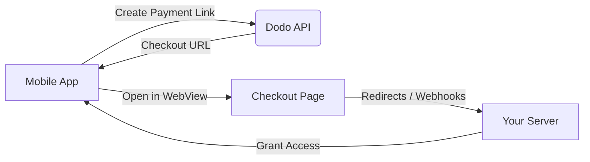

## Introducción

Dodo Payments permite a los desarrolladores vender productos y servicios digitales en aplicaciones de iOS, gestionando aspectos complejos como el cumplimiento fiscal, la conversión de divisas y los pagos. Esta guía completa detalla cómo integrar Dodo Payments en tu aplicación de iOS, específicamente para herramientas SaaS, suscripciones de contenido y utilidades digitales.

## Descripción general

Dodo Payments funciona como tu **Merchant of Record (MoR)**, gestionando aspectos esenciales de tu negocio digital:

<Tabs>
<Tab title="What We Handle">
- Cobro y liquidación de impuestos (IVA, GST y otros impuestos regionales)
- Pagos globales conforme a las políticas y los métodos de pago locales
- Conversión de divisas y cambio de moneda
- Contracargos y prevención del fraude
- Facturación y recibos para el cliente final
- Cumplimiento de las normativas regionales
</Tab>

<Tab title="What You Get">
- Una API unificada para plataformas web y móviles
- Compatibilidad con checkouts dentro de la aplicación (UPI, tarjetas, wallets y BNPL)
- Compatibilidad con pagos globales (Payoneer, Wise y transferencias bancarias locales)
- Panel de análisis e informes
- Procesamiento seguro de pagos
</Tab>
</Tabs>

## Casos de uso

<CardGroup cols={2}>
<Card title="Subscriptions" icon="repeat">
- Acceso a contenido o funcionalidades premium
- Facturación recurrente con opciones flexibles, pruebas gratuitas, prorrateo o mejoras y reducciones de plan
</Card>

<Card title="Courses and Learning" icon="graduation-cap">
- Acceso mediante pago por curso
- Paquetes de contenido agrupado
- Licencias de por vida o renovables
- Integración del seguimiento del progreso
</Card>

<Card title="Digital Downloads" icon="download">
- Compras únicas (PDF, música y herramientas)
- Entrega de activos digitales
- Gestión de claves de licencia
</Card>

<Card title="SaaS Tools" icon="screwdriver-wrench">
- Suscripciones de software como servicio
- Facturación basada en el uso
- Planes para equipos y empresas
</Card>
</CardGroup>

## Flujo de integración

Puedes integrar Dodo Payments en tu aplicación mediante nuestro checkout alojado o nuestra solución de navegador integrado en la aplicación.

### Pasos de integración

<Steps>
<Step title="Mobile App to Dodo API">
El proceso comienza cuando la aplicación móvil crea un enlace de pago mediante una interacción con la API de Dodo.
</Step>

<Step title="Dodo API to Mobile App">
La API de Dodo responde proporcionando una URL de checkout a la aplicación móvil.
</Step>

<Step title="Mobile App to Checkout Page">
A continuación, la aplicación móvil abre esta URL de checkout dentro de un WebView, lo que dirige al usuario a la página de checkout.
</Step>

<Step title="Checkout Page to Your Server">
Una vez finalizado el proceso de checkout, la página de checkout se comunica con tu servidor mediante redirecciones o webhooks.
</Step>

<Step title="Your Server to Mobile App">
Por último, tu servidor concede acceso al contenido o servicio adquirido, completando el ciclo de la transacción en la aplicación móvil.
</Step>
</Steps>

<Card title="Mobile Integration Guide" icon="mobile" href="/developer-resources/mobile-integration">
Para consultar un recorrido completo para desarrolladores, explora nuestra Guía de integración móvil.
</Card>

## Disponibilidad regional

Dodo Payments permite flujos alternativos de compra dentro de la aplicación únicamente en las regiones de la App Store donde Apple permite explícitamente los pagos externos o donde un regulador o una orden judicial los exige.

### Regiones compatibles

<AccordionGroup>
<Accordion title="United States">
Compatible en la medida permitida por las órdenes judiciales actuales y las directrices actualizadas de Apple.

- Disponible conforme a disposiciones específicas impuestas por los tribunales
- Sujeto al cumplimiento de los requisitos legales por parte de Apple
- Debe seguir las directrices de implementación de Apple
</Accordion>

<Accordion title="European Union (EU) App Store">
Compatible mediante los Términos alternativos de la UE de Apple y la autorización de compra externa.

- Habilitado mediante los Términos alternativos de la UE de Apple
- Requiere la aprobación de la autorización de compra externa
- Debe cumplir los requisitos de la Ley de Mercados Digitales de la UE
</Accordion>

<Accordion title="South Korea">
Compatible mediante la autorización de compra externa de StoreKit para binarios exclusivos de Corea.

- Disponible mediante la autorización de compra externa de StoreKit
- Requiere un binario de aplicación específico para Corea
- Debe cumplir la legislación coreana sobre telecomunicaciones
</Accordion>
</AccordionGroup>

<Warning>
Revisa y cumple siempre las autorizaciones específicas de cada región de Apple y los requisitos de App Store Connect antes de habilitar Dodo Payments en cualquier escaparate. El uso de flujos de pago alternativos en regiones no compatibles puede provocar el rechazo o la eliminación de la aplicación.
</Warning>

<Note>
Para algunos modelos de negocio —como los servicios o ciertas categorías de contenido— Apple puede no exigir el uso de compras dentro de la aplicación (IAP). Dodo Payments también es compatible con estos modelos. Verifica siempre la clasificación de tu aplicación y las directrices más recientes de Apple para determinar si IAP es obligatorio en tu caso de uso.
</Note>

### Más información

Para consultar un desglose detallado de las políticas globales, los precedentes legales y los enfoques estratégicos para evitar las comisiones de la App Store, consulta nuestra guía completa:

<Card title="Bypassing App Store & Play Store Fees: A Strategic and Legal Playbook" icon="shield-check" href="/features/bypassing-app-store-fees">
Descubre dónde y cómo puedes implementar legalmente flujos de pago alternativos, con orientación regional actualizada y consejos sobre cumplimiento.
</Card>