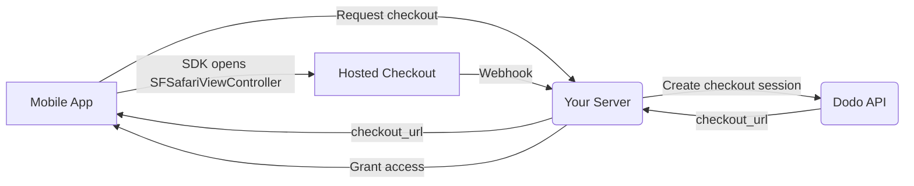

## Introducción

Dodo Payments permite a los desarrolladores vender productos y servicios digitales en aplicaciones de iOS, gestionando aspectos complejos como el cumplimiento fiscal, la conversión de divisas y los pagos. Esta guía completa detalla cómo integrar Dodo Payments en tu aplicación de iOS, específicamente para herramientas SaaS, suscripciones de contenido y utilidades digitales.

## Descripción general

Dodo Payments funciona como tu **Merchant of Record (MoR)**, gestionando aspectos esenciales de tu negocio digital:

<Tabs>
<Tab title="What We Handle">
- Cobro y liquidación de impuestos (IVA, GST y otros impuestos regionales)
- Pagos globales conforme a las políticas y los métodos de pago locales
- Conversión de divisas y cambio de moneda
- Contracargos y prevención del fraude
- Facturación y recibos para el cliente final
- Cumplimiento de las normativas regionales
</Tab>

<Tab title="What You Get">
- Una API unificada para plataformas web y móviles
- Compatibilidad con checkouts dentro de la aplicación (UPI, tarjetas, wallets y BNPL)
- Compatibilidad con pagos globales (Payoneer, Wise y transferencias bancarias locales)
- Panel de análisis e informes
- Procesamiento seguro de pagos
</Tab>
</Tabs>

## Casos de uso

<CardGroup cols={2}>
<Card title="Subscriptions" icon="repeat">
- Acceso a contenido o funcionalidades premium
- Facturación recurrente con opciones flexibles, pruebas gratuitas, prorrateo o mejoras y reducciones de plan
</Card>

<Card title="Courses and Learning" icon="graduation-cap">
- Acceso mediante pago por curso
- Paquetes de contenido agrupado
- Licencias de por vida o renovables
- Integración del seguimiento del progreso
</Card>

<Card title="Digital Downloads" icon="download">
- Compras únicas (PDF, música y herramientas)
- Entrega de activos digitales
- Gestión de claves de licencia
</Card>

<Card title="SaaS Tools" icon="screwdriver-wrench">
- Suscripciones de software como servicio
- Facturación basada en el uso
- Planes para equipos y empresas
</Card>
</CardGroup>

## Flujo de integración

Tu app abre el checkout alojado de Dodo mediante el
[iOS checkout SDK](/developer-resources/sdks/ios), que lo presenta en
`SFSafariViewController` y devuelve un resultado tipado.

<Warning>
Usa el SDK en lugar de insertar el checkout en un `WebView`. Apple Pay solo está
disponible en una superficie de navegador real, por lo que un `WebView` reduce silenciosamente tus
conversiones de wallet, y los flujos de pago dentro de un `WebView` son una causa común de
rechazos durante la revisión de la App Store.
</Warning>

### Pasos de integración

<Steps>
<Step title="Mobile App to Your Server">
Tu app solicita a tu propio backend una URL de checkout, autenticada con el
token de sesión del usuario que ha iniciado sesión.
</Step>

<Step title="Your Server to Dodo API">
Tu backend crea una [checkout session](/developer-resources/checkout-session)
con tu API key y devuelve el `checkout_url` a la app.

<Warning>
Crea checkout sessions en tu servidor, nunca en la app. Una API key incluida
dentro del binario de una app puede extraerse del bundle.
</Warning>
</Step>

<Step title="Mobile App Opens Checkout">
Pasa el `checkout_url` a `DodoCheckout.start(...)`. El SDK lo presenta en
`SFSafariViewController` y devuelve un resultado tipado cuando el cliente
completa o descarta el checkout.
</Step>

<Step title="Dodo Payments to Your Server">
Dodo Payments llama a tu endpoint de webhook cuando el pago se completa correctamente o la
suscripción se activa.
</Step>

<Step title="Your Server Grants Access">
Desbloquea el contenido adquirido desde ese webhook, no desde el resultado que recibió la app.
El resultado del SDK es una indicación de la UI, no una prueba del pago.
</Step>
</Steps>

<CardGroup cols={2}>
<Card title="iOS Checkout SDK" icon="apple" href="/developer-resources/sdks/ios">
  Pasos de instalación y el contrato completo de `start(...)` para Swift.
</Card>
<Card title="Mobile Integration Guide" icon="mobile" href="/developer-resources/mobile-integration">
  El flujo de extremo a extremo, además del mismo contrato para Android, React Native y Flutter.
</Card>
</CardGroup>

## Disponibilidad regional

Dodo Payments habilita flujos de compra alternativos dentro de la app únicamente en las regiones de la App Store donde Apple permite explícitamente los pagos externos, o donde un organismo regulador o una orden judicial lo exige.

### Regiones compatibles

<AccordionGroup>
<Accordion title="United States">
Compatible en la medida permitida por las órdenes judiciales vigentes y las directrices actualizadas de Apple.

- Disponible conforme a disposiciones específicas establecidas por orden judicial
- Sujeto al cumplimiento de los requisitos legales por parte de Apple
- Debe seguir las directrices de implementación de Apple
</Accordion>

<Accordion title="European Union (EU) App Store">
Compatible mediante los EU Alternative Terms y el External Purchase Entitlement de Apple.

- Habilitado mediante los EU Alternative Terms de Apple
- Requiere la aprobación del External Purchase Entitlement
- Debe cumplir los requisitos de la Digital Markets Act de la UE
</Accordion>

<Accordion title="South Korea">
Compatible mediante el StoreKit External Purchase Entitlement para binarios exclusivos de Corea.

- Disponible mediante el StoreKit External Purchase Entitlement
- Requiere un binario de app específico para Corea
- Debe cumplir la legislación coreana sobre telecomunicaciones
</Accordion>
</AccordionGroup>

<Warning>
Revisa y cumple siempre los entitlements específicos de cada región de Apple y los requisitos de App Store Connect antes de habilitar Dodo Payments para cualquier storefront. El uso de flujos de pago alternativos en regiones no compatibles puede provocar el rechazo o la eliminación de la app.
</Warning>

<Note>
Para algunos modelos de negocio —como los servicios o ciertas categorías de contenido— Apple puede no exigir el uso de in-app purchase (IAP). Dodo Payments también admite estos modelos. Verifica siempre la clasificación de tu app y las directrices más recientes de Apple para determinar si IAP es obligatorio para tu caso de uso.
</Note>

### Más información

Para obtener un análisis detallado de las políticas globales, los precedentes legales y los enfoques estratégicos para evitar las comisiones de la App Store, consulta nuestra guía completa:

<Card title="Bypassing App Store & Play Store Fees: A Strategic and Legal Playbook" icon="shield-check" href="/features/bypassing-app-store-fees">
Descubre dónde y cómo puedes implementar legalmente flujos de pago alternativos, con orientación regional actualizada y consejos de cumplimiento.
</Card>