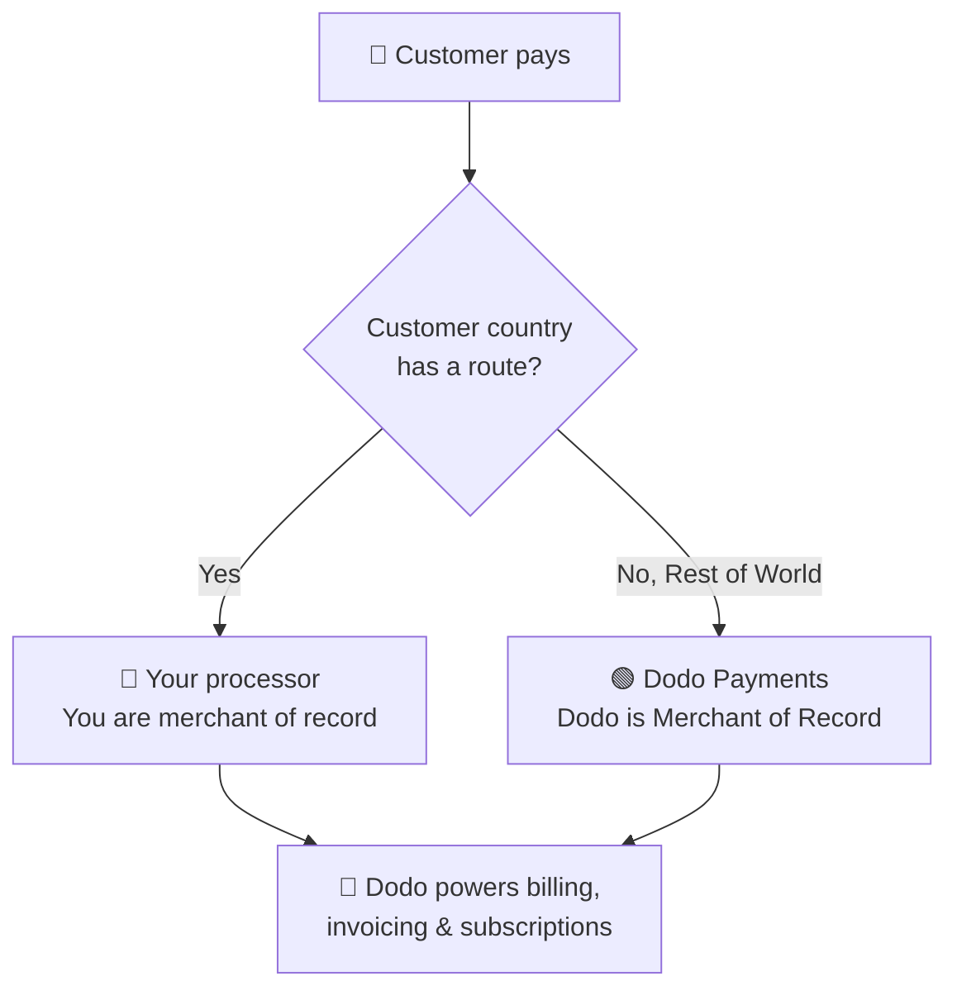

**Trae Tu Propio Procesador (BYOP)** te permite conectar tu propio procesador de pagos — actualmente **Stripe** o **Adyen**, con soporte para más procesadores próximamente — y seguir usando Dodo Payments para todo lo que se encuentra encima de la transacción: productos, suscripciones, claves de licencia y el motor de derechos, facturación, el portal del cliente y análisis.

Tú decides, por país del cliente, si un pago es procesado por **tu procesador** (permaneces como el comerciante registrado para esa ruta) o por **Dodo Payments** como tu Comerciante de Registro de servicio completo. Los países que no routers explícitamente se redirigen a Dodo automáticamente.

<CardGroup cols={2}>
<Card title="Route by geography" icon="globe">
Envía pagos desde países específicos a tu propio procesador, y el resto a Dodo.
</Card>

<Card title="Keep your processor accounts" icon="plug">
Continúa usando tus cuentas y relaciones existentes de Stripe o Adyen.
</Card>

<Card title="Stay the merchant of record" icon="building">
En tus propias rutas, sigues siendo el vendedor legal y controlas impuestos, disputas y pagos.
</Card>

<Card title="One billing layer" icon="layer-group">
Dodo gestiona productos, suscripciones, facturas y análisis en ambas rutas.
</Card>
</CardGroup>

## BYOP vs. Dodo como Comerciante de Registro

Cuando activas BYOP, eliges cómo se maneja cada pago. Los dos modelos pueden funcionar en paralelo, enrutados por país del cliente.

| Característica | Dodo como Comerciante de Registro | Trae Tu Propio Procesador |
|---------|----------------------------|--------------------------|
| Vendedor legal registrado | Dodo Payments | Tu empresa |
| Impuestos (IVA, GST y ventas) | Calculado, recaudado y remitido por ti | Tú registras, recaudas y presentas |
| Contracargos y fraude | Responsabilidad y protección manejada por Dodo | Tú gestionas con las herramientas de tu procesador |
| Cumplimiento PCI | Manejado por Dodo | Tú gestionas |
| Métodos de pago | 30+ globales y locales, multicurrency | Solo tarjetas (crédito/débito) |
| Pagos | Pagos globales agregados | Directo desde tu procesador |
| Configuración | Simple, entra en vivo en minutos | Moderado, agrega claves y enrutamiento |
| Lo mejor para | Vender globalmente, cumplimiento sin esfuerzo | Procesador existente y control regional |

<Tip>
Una configuración común es **híbrida**: envía a un país donde ya tienes una entidad registrada y procesador (por ejemplo, tu mercado local) a tu propio procesador, y deja que Dodo maneje el resto del mundo como Comerciante de Registro.
</Tip>

## Procesadores soportados

Hoy puedes conectar **Stripe** o **Adyen**. El soporte para más procesadores está en camino.

<CardGroup cols={2}>
<Card title="Stripe" icon="stripe" />
<Card title="Adyen" icon="/images/logos/adyen.svg" />
</CardGroup>

<Note>
Los pagos enviados a través de tu propio procesador actualmente solo admiten **tarjetas de crédito y débito**. Pronto añadiremos más métodos de pago.
</Note>

<Warning>
Tanto **Stripe** como **Adyen** requieren **acceso API de tarjeta en bruto** habilitado en tu cuenta para que Dodo pueda gestionar la facturación sobre tu procesador. Cada procesador lo concede a petición: gestionas esto contactando al soporte del procesador antes de conectarlo. Consulta las guías de [Stripe](/features/byop/stripe) y [Adyen](/features/byop/adyen) para más detalles.
</Warning>

<Info>
Las conexiones se configuran **por entorno**. El procesador que conectas en **modo de prueba** (Sandbox) es independiente del de **modo en vivo** (Producción); configura ambos si deseas probar antes de entrar en vivo. El asistente de configuración sigue el interruptor global de prueba/vivo de tu panel de control.
</Info>

## Configurar BYOP

Abre **Configuración → BYOP** en el panel de control y selecciona **Configurar** en la tarjeta *Trae Tu Propio Procesador* para iniciar el asistente de configuración.

<Frame>

</Frame>

<Steps>
<Step title="Choose a payment processor">
Selecciona el procesador que deseas conectar, **Stripe** o **Adyen**, y continúa.

<Frame>

</Frame>
</Step>

<Step title="Connect your account">
Dale un **Nombre de Proveedor** a la conexión (útil cuando tienes múltiples cuentas del mismo procesador, por ejemplo, *Stripe US* y *Stripe UK*), luego introduce la **Clave Secreta** de tu procesador (para Stripe, tu `sk_...` key).

Para **Adyen**, también ingresa tu identificador de **Cuenta de Comerciante**.

<Frame>

</Frame>

Guardar crea la conexión y genera un **Endpoint de Webhook** único para ella. Agrega esa URL como destino de webhook en el panel de tu procesador, luego pega el **Secreto de Firma del Webhook** de nuevo en Dodo para terminar:

- **Stripe**: pega el secreto de firma del endpoint de webhook que añadiste.
- **Adyen**: pega la **clave HMAC** desde *Área de Cliente → Webhooks*.

<Note>
Tu clave secreta se guarda de manera segura y no puede ser vista o cambiada después de guardar. Solo configuras la URL de webhook generada por Dodo en tu procesador; nunca interactúas directamente con la infraestructura subyacente.
</Note>

<Tip>
Usa **Verificar conexión** después de guardar para ejecutar una llamada de prueba contra tu procesador y confirmar que las claves y el secreto de webhook son válidos antes de ponerlo en vivo.
</Tip>
</Step>

<Step title="Configure payment routing">
Agrega **reglas de enrutamiento** que asignen países de clientes a un procesador. Cada país puede ser enrutado a exactamente un procesador.

- **Tu procesador** maneja pagos de los países que le asignas.
- **Dodo Payments** maneja **Resto del Mundo** (cada país que no rutas explícitamente) como Comerciante de Registro.

<Frame>

</Frame>

Usa **Agregar Ruta** para asignar uno o más países a un procesador.

<Frame>

</Frame>

<Info>
**Guías de enrutamiento**
- "Resto del Mundo" cubre todos los países no listados anteriormente.
- Las rutas de MoR de Dodo Payments gestionan cumplimiento e impuestos automáticamente.
- Las rutas de tu propio procesador requieren configuración de impuestos por separado si es necesario.
</Info>
</Step>

<Step title="Configure invoice information">
Para pagos enviados a través de tu propio procesador, **tú** eres el vendedor en la factura. Introduce los detalles comerciales que deben aparecer en esas facturas:

- **Nombre Registrado de la Empresa** (requerido)
- **ID de Impuesto** (EIN, SSN, etc.; opcional, con validación de formato disponible para EIN de EE. UU.)
- **Descriptor del Estado de Cuenta** (requerido): lo que los clientes ven en su estado de cuenta bancario (de 5 a 22 caracteres)
- **Dirección Registrada de la Empresa** (requerida): comienza a escribir para buscar y autocompletar tu dirección
- Enlaces a **Política de Privacidad** y **Términos de Servicio** (requeridos)

Un **Previsualización del Encabezado de Factura en Vivo** muestra cómo aparecerán los detalles. Estos detalles se aplican **solo** a las facturas para rutas que manejas a través de tu propio procesador; los pagos enrutados a través de Dodo continúan utilizando los detalles de Comerciante de Registro de Dodo.

<Frame>

</Frame>
</Step>

<Step title="Review and finish">
Revisa tu conexión de procesador, reglas de enrutamiento y detalles de facturación. Confirma que los detalles de enrutamiento y facturación son correctos, luego selecciona **Terminar configuración**.

<Frame>

</Frame>
</Step>
</Steps>

Una vez configurado, la tarjeta BYOP muestra **Editar configuración**, y puedes volver a solo MoR en cualquier momento con **Editar reglas de enrutamiento**.

<Frame>

</Frame>

## Cómo funciona el enrutamiento

El enrutamiento se determina por el **país del cliente** al momento del pago. La misma lógica se aplica a pagos únicos, sesiones de pago y suscripciones. Las renovaciones reutilizan el procesador en el que se creó la suscripción (ver [Suscripciones](#subscriptions)).

En una ruta manejada por **tu procesador**:

- El pago se procesa en la cuenta de **tu** procesador en la moneda de facturación.
- **No se calcula ni recauda impuestos** por Dodo; sigues siendo responsable de los impuestos en esa ruta.
- Las facturas utilizan los **detalles comerciales y el descriptor del estado de cuenta** que configuraste, sin referencias a Comerciantes de Registro.
- Los pagos se liquidan **directamente a ti** desde tu procesador; nada fluye a través de la billetera de Dodo.

En una ruta manejada por **Dodo** (Resto del Mundo), Dodo actúa exactamente como tu Comerciante de Registro de servicio completo, gestionando impuestos, cumplimiento, disputas, fraude y pagos agregados.

## Suscripciones

Las suscripciones permanecen en el procesador en el que fueron creadas. En la renovación, Dodo carga el mismo procesador de pago que se utilizó para comprar la suscripción, reutilizando el mandato de pago almacenado contra él. Las reglas de enrutamiento no se vuelven a evaluar en cada renovación.

## Ver qué procesador manejó un pago

Una vez configurado BYOP, las tablas de **Pagos** y **Disputas** muestran un icono de procesador (Stripe, Adyen o Dodo) junto a cada fila, y las páginas de detalle de pago y disputa incluyen un campo de **Procesador de Pago**, por lo que siempre podrás saber qué ruta manejó una transacción determinada.

## Reembolsos, disputas y pagos

<Tabs>
<Tab title="Refunds">
Inicias reembolsos desde el panel de Dodo como de costumbre. Para pagos enrutados a través de tu propio procesador, el reembolso se ejecuta en ese procesador; para pagos enrutados a través de Dodo, Dodo procesa el reembolso.
</Tab>

<Tab title="Disputes">
El panel de Dodo muestra disputas solo para pagos procesados por **Dodo**.

> Solo las disputas procesadas por Dodo se muestran aquí. Las disputas en tu propio procesador (por ejemplo, Stripe) se gestionan en el panel de ese procesador.

Las acciones de carga de evidencia, aceptación y desafío están disponibles solo para disputas procesadas por Dodo. Las disputas en tu procesador se manejan con las herramientas propias de tu procesador.
</Tab>

<Tab title="Payouts">
Para rutas en tu propio procesador, tu procesador te paga **directamente**; esos pagos no aparecen en Dodo.

> Solo los pagos de Dodo son visibles aquí. Los pagos en tu propio procesador ocurren en ese procesador.

Los pagos de Dodo (para volumen de MoR Resto del Mundo) siguen la standard [estructura de pagos](/features/payouts/payout-structure).
</Tab>
</Tabs>

## Análisis

Los análisis de ingresos, impuestos y suscripciones incluyen **ambas** rutas para que veas la imagen completa de tu facturación. Los widgets de disputas y pagos muestran solo la actividad **procesada por Dodo**, con un banner que indica que la actividad en tu propio procesador se encuentra en el panel de ese procesador.

## Tarifa de facturación

Dodo aplica una pequeña **tarifa de facturación BYOP** en los pagos enrutados a través de tu propio procesador, ya que Dodo sigue gestionando tus productos, suscripciones, facturación y análisis en esas transacciones. Aparece como una línea de `byop_fee` en tu libro mayor de balance. La tasa por defecto es **0.5%**; la tasa exacta se confirma como parte de la activación de BYOP para tu cuenta. [Contáctanos](mailto:founders@dodopayments.com) para más detalles.

## Preguntas frecuentes

<AccordionGroup>
<Accordion title="Which processors can I connect?">
Stripe y Adyen están soportados hoy, con soporte para más procesadores próximamente. Ambos requieren **acceso API de tarjeta en bruto** habilitado en tu cuenta, lo cual gestionas contactando al soporte del procesador. Consulta las guías de [Stripe](/features/byop/stripe) y [Adyen](/features/byop/adyen) para más detalles.
</Accordion>

<Accordion title="Can I route only some countries to my processor?">
Sí. Asigna países específicos a tu procesador y deja el resto como **Resto del Mundo**, que Dodo maneja como Comerciante de Registro. Cada país se enruta a exactamente un procesador.
</Accordion>

<Accordion title="Who is the merchant of record on BYOP routes?">
Tú lo eres. En las rutas manejadas por tu propio procesador, sigues siendo el vendedor legal y eres responsable de impuestos, contracargos, cumplimiento PCI y pagos en esas transacciones.
</Accordion>

<Accordion title="Does Dodo calculate tax on my processor's routes?">
No. No se calculan ni recaudan impuestos en las rutas manejadas a través de tu propio procesador; gestionas impuestos para esas transacciones. Dodo sigue manejando impuestos en pagos enrutados a través de Dodo (MoR).
</Accordion>

<Accordion title="What happens to active subscriptions if I disable a processor?">
Las renovaciones en ese procesador fallarán y aparecerán como pagos fallidos en el panel de control. Vuelve a habilitar el procesador para restaurar las renovaciones.
</Accordion>
</AccordionGroup>

## Comienza

<Card title="What is Merchant of Record?" icon="building-columns" href="/features/mor-introduction">
Comprende cómo funciona el modelo de MoR de servicio completo de Dodo.
</Card>
