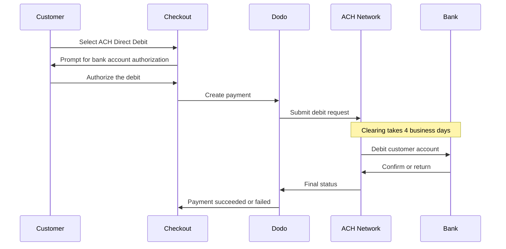

ACH Direct Debit permite a los clientes de Estados Unidos pagar directamente desde su cuenta bancaria en lugar de usar una tarjeta. Funciona en la red Automated Clearing House y se ofrece en checkouts en USD para pagos únicos.

## ¿Por qué ofrecer ACH Direct Debit?

<CardGroup cols={3}>
<Card title="Lower Processing Cost" icon="piggy-bank">
Los débitos bancarios suelen costar menos que los pagos con tarjeta, especialmente en pedidos de alto valor.
</Card>

<Card title="No Card Required" icon="building-columns">
Llega a clientes de Estados Unidos que prefieren pagar desde una cuenta bancaria o que no quieren usar una tarjeta para compras grandes.
</Card>

<Card title="Higher Value Orders" icon="chart-line">
La ventaja de costo frente a las tarjetas aumenta con el valor del pedido, por lo que ACH es ideal para compras únicas de gran importe.
</Card>
</CardGroup>

## Descripción general

| Detalle | Valor |
| :----- | :---- |
| **Moneda de facturación** | USD |
| **Países compatibles** | Estados Unidos |
| **Suscripciones** | No |
| **Importe mínimo** | $0.50 |
| **Liquidación** | 4 días laborables |

<Warning>
ACH Direct Debit no es instantáneo. Un pago tarda **4 días laborables** en confirmarse, así que no trates la autorización como una liquidación; completa el pedido solo cuando el pago alcance el estado succeeded.
</Warning>

## Cómo funciona



## Experiencia del cliente

1. El cliente selecciona ACH Direct Debit en el checkout
2. El cliente autoriza el débito contra su cuenta bancaria de Estados Unidos
3. El pago se envía a la red ACH y entra en estado de procesamiento
4. La compensación se completa durante los siguientes días laborables
5. El pago pasa al estado succeeded o falla si el banco lo devuelve

<Info>
Dado que la compensación es asíncrona, utiliza [webhooks](/developer-resources/webhooks) para conocer el resultado final en lugar de la redirección del checkout. Una redirección correcta solo significa que el cliente autorizó el débito.

El pago emite `payment.processing` una vez enviado el débito y, cuando finaliza la compensación, emite `payment.succeeded` o `payment.failed`. Solo `payment.succeeded` permite completar el pedido de forma segura.
</Info>

## Disponibilidad

ACH Direct Debit aparece en el checkout cuando se cumplen todas las condiciones siguientes:

- La **moneda de facturación** es `USD`
- El **país de facturación** es `US`
- La transacción es un **pago único**

<Note>
ACH Direct Debit no está disponible para suscripciones. Su plazo de compensación de varios días no es adecuado para ciclos de facturación recurrentes. Para pagos recurrentes, usa tarjetas u otro método compatible con suscripciones; consulta la [descripción general de métodos de pago](/features/payment-methods).
</Note>

## Configuración

```javascript
const session = await client.checkoutSessions.create({
  product_cart: [{ product_id: 'pdt_123', quantity: 1 }],
  allowed_payment_method_types: ['ach', 'credit', 'debit'],
  billing_currency: 'USD',
  billing_address: {
    country: 'US',
    zipcode: '94102'
  },
  return_url: 'https://example.com/success'
});
```

<Note>
ACH Direct Debit requiere USD como moneda de facturación y una dirección de facturación de Estados Unidos. Si indicas tus precios en otra moneda, activa [Adaptive Currency](/features/adaptive-currency) para facturar a los clientes de Estados Unidos en USD y habilitar ACH.
</Note>

## Tipo de método de API

| Tipo | Método | País |
| :--- | :----- | :------ |
| `ach` | ACH Direct Debit | Estados Unidos |

## Reembolsos y disputas

Los reembolsos y las disputas de los pagos ACH utilizan las mismas APIs y los mismos flujos del dashboard que cualquier otro método de pago; no es necesario implementar un manejo específico para ACH.

<Warning>
Dado que el banco del cliente puede devolver los pagos ACH después de que parezcan haberse procesado, evita emitir reembolsos hasta que el pago original haya alcanzado el estado succeeded.
</Warning>

## Pruebas

<Steps>
<Step title="Enable test mode">
Usa tus claves de API de prueba de Dodo Payments.
</Step>

<Step title="Set currency and billing address">
Establece la moneda de facturación en `USD` y el país de la dirección de facturación en `US`.
</Step>

<Step title="Include `ach` in allowed methods">
Pasa `ach` en `allowed_payment_method_types`, u omite el campo por completo para mostrar todos los métodos elegibles.
</Step>

<Step title="Enter the test bank details">
Introduce uno de los pares de números de ruta y de cuenta de prueba que aparecen a continuación y, después, confirma que tu controlador de webhook recibe el estado final del pago.
</Step>
</Steps>

### Cuentas bancarias de prueba

Los clientes introducen directamente su número de cuenta y de ruta en el checkout. En el modo de prueba, usa el número de ruta `110000000` con cualquiera de los números de cuenta que aparecen a continuación para forzar un resultado específico.

| Número de cuenta | Número de ruta | Comportamiento |
| :------------- | :------------- | :------- |
| `000123456789` | `110000000` | El pago se realiza correctamente. |
| `000222222227` | `110000000` | El pago falla por fondos insuficientes. |
| `000111111113` | `110000000` | El pago falla porque la cuenta está cerrada. |
| `000111111116` | `110000000` | El pago falla porque no se encuentra ninguna cuenta. |
| `000333333335` | `110000000` | El pago falla porque los débitos no están autorizados en la cuenta. |
| `000444444440` | `110000000` | El pago falla debido a una moneda no válida. |
| `000555555559` | `110000000` | El pago se realiza correctamente y después genera una disputa. |
| `000000000009` | `110000000` | El pago permanece en procesamiento indefinidamente, lo que resulta útil para probar una interfaz de usuario de estado pendiente. |

<Note>
La mayoría de los pagos de prueba alcanzan un estado final mucho más rápido que durante la compensación real, por lo que no es necesario esperar días para verificar tu integración. La excepción es `000000000009`, diseñado para permanecer en procesamiento.
</Note>

## Prácticas recomendadas

<AccordionGroup>
<Accordion title="Don't fulfill on authorization">
La autorización de ACH no es un pago. Espera a que el pago alcance el estado succeeded antes de conceder acceso o enviar el pedido; el banco del cliente aún puede devolver el débito.
</Accordion>

<Accordion title="Set customer expectations at checkout">
Informa a los clientes de que los pagos bancarios no se compensan al instante. Esto reduce las consultas al soporte sobre por qué un pedido sigue pendiente.
</Accordion>

<Accordion title="Provide card fallbacks">
Incluye siempre `credit` y `debit` junto con `ach` para que los clientes que necesiten acceso instantáneo a tu producto puedan elegir un método más rápido.
</Accordion>

<Accordion title="Use ACH for high-value one-time purchases">
La ventaja de costo de ACH aumenta con el valor del pedido, por lo que resulta más útil para compras únicas grandes que para compras pequeñas.
</Accordion>
</AccordionGroup>

## Solución de problemas

<AccordionGroup>
<Accordion title="ACH not appearing at checkout">
**Comprobación:**
1. ¿La moneda de facturación está establecida en `USD`?
2. ¿El país de facturación del cliente es `US`?
3. ¿`ach` está incluido en `allowed_payment_method_types`?
4. ¿Es un pago único? ACH no se ofrece para suscripciones.

**Solución:** Elimina temporalmente `allowed_payment_method_types` para ver todos los métodos elegibles y, después, verifica la moneda de facturación y el país de la dirección en tu solicitud de API.
</Accordion>

<Accordion title="ACH not appearing on a subscription checkout">
**Causa:** ACH Direct Debit solo se ofrece para pagos únicos.

**Solución:** Usa tarjetas u otro método compatible con suscripciones para la facturación recurrente.
</Accordion>

<Accordion title="Payment stuck in processing">
**Causa:** Esto es lo esperado. Los pagos ACH permanecen en estado de procesamiento durante todo el plazo de compensación, mucho más tiempo que los pagos con tarjeta.

**Solución:** Espera al webhook final. No vuelvas a intentar el pago; hacerlo podría generar dos débitos al cliente.
</Accordion>

<Accordion title="Payment failed after initially succeeding at checkout">
**Causa:** El banco del cliente devolvió el débito, normalmente por fondos insuficientes o porque la cuenta está cerrada.

**Solución:** Trata el pago como fallido y pide al cliente que vuelva a intentarlo con otro método de pago. Para evitarlo, condiciona siempre la entrega al estado succeeded.
</Accordion>
</AccordionGroup>

## Páginas relacionadas

<CardGroup cols={2}>
<Card title="Payment Methods Overview" icon="credit-card" href="/features/payment-methods">
Consulta todos los métodos de pago compatibles.
</Card>

<Card title="Adaptive Currency" icon="globe" href="/features/adaptive-currency">
Compatibilidad con monedas y conversión automática.
</Card>

<Card title="Checkout Guide" icon="book" href="/developer-resources/checkout-session">
Guía completa de implementación del checkout.
</Card>

<Card title="Webhooks" icon="webhook" href="/developer-resources/webhooks">
Gestiona las confirmaciones de pago demoradas de forma asíncrona.
</Card>
</CardGroup>
