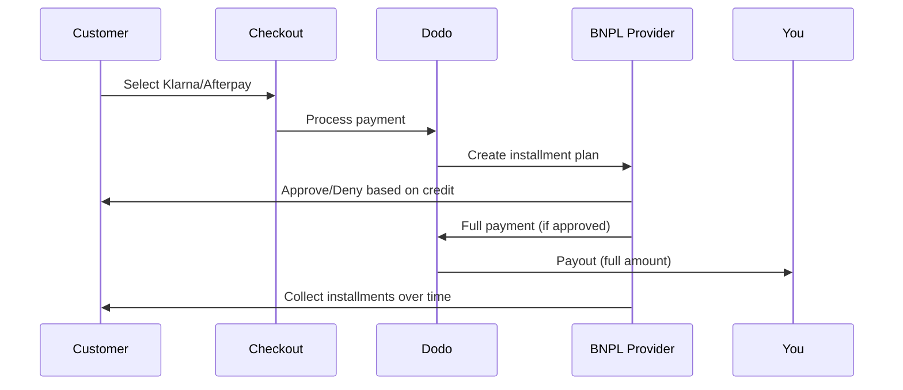

Buy Now Pay Later (BNPL) lets customers split purchases into interest-free installments, increasing average order value by 20-50% and conversion rates by 10-30% for eligible transactions.

## Why Offer BNPL?

<CardGroup cols={3}>
<Card title="Higher AOV" icon="chart-line">
Customers spend more when they can spread payments over time. Average order value increases 20-50%.
</Card>

<Card title="Better Conversion" icon="percent">
Removing payment friction at checkout. Conversion rates improve 10-30% for high-ticket items.
</Card>

<Card title="Zero Risk" icon="shield-check">
BNPL providers handle credit risk and collections. You receive full payment upfront.
</Card>
</CardGroup>

## Supported Providers

### Klarna

| Feature | Details |
| :------ | :------ |
| **Availability** | US + 19 European countries |
| **Currencies** | USD, EUR, GBP, DKK, NOK, SEK, CZK, RON, PLN, CHF |
| **Minimum** | $50.01 (or equivalent) |
| **Subscriptions** | No |

**Supported Countries:** Austria, Belgium, Czech Republic, Denmark, Finland, France, Germany, Greece, Ireland, Italy, Netherlands, Norway, Poland, Portugal, Romania, Spain, Sweden, Switzerland, United Kingdom, United States

**Payment Options:**
- **Pay in 4** — Split into 4 interest-free payments
- **Pay in 30 days** — Full payment due in 30 days
- **Financing** — Longer-term installment plans

### Afterpay (Clearpay)

| Feature | Details |
| :------ | :------ |
| **Availability** | US, UK |
| **Currencies** | USD, GBP |
| **Minimum** | $50.01 (or equivalent) |
| **Subscriptions** | No |

**Payment Options:**
- **Pay in 4** — 4 interest-free payments every 2 weeks

<Note>
In the UK, Afterpay operates as "Clearpay" but uses the same API type (`afterpay_clearpay`).
</Note>

### Billie

| Feature | Details |
| :------ | :------ |
| **Availability** | Global |
| **Currencies** | GBP |
| **Minimum** | None |
| **Subscriptions** | No |

**About Billie:**
Billie is a B2B Buy Now Pay Later solution that enables businesses to offer flexible payment terms to their customers. It's designed for business-to-business transactions where buyers need invoice-based payment options.

**Payment Options:**
- **Invoice Payment** — Pay within agreed payment terms
- **Flexible Terms** — Business-friendly payment schedules

### Sunbit

| Característica | Detalles |
| :------------ | :------- |
| **Disponibilidad** | EE.UU. |
| **Monedas** | USD |
| **Mínimo** | $60.00 |
| **Máximo** | $19,999.00 |
| **Suscripciones** | No |

**Opciones de Pago:**
- **Financiamiento en Cuotas** — Divide las compras en pagos mensuales manejables

## Configuración

### Tipos de Métodos de API

| Tipo | Proveedor |
| :--- | :-------- |
| `klarna` | Klarna |
| `afterpay_clearpay` | Afterpay / Clearpay |
| `billie` | Billie (B2B) |
| `sunbit` | Sunbit |

### Ejemplo

```javascript
const session = await client.checkoutSessions.create({
  product_cart: [{ product_id: 'prod_123', quantity: 1 }],
  allowed_payment_method_types: [
    'klarna',
    'afterpay_clearpay',
    'credit',
    'debit'
  ],
  customer: {
    email: 'customer@example.com',
    name: 'Jane Smith'
  },
  billing_address: {
    country: 'US',
    zipcode: '10001'
  },
  return_url: 'https://example.com/success'
});
```

<Warning>
Incluye siempre `credit` e `debit` como alternativas. No todos los clientes son elegibles para BNPL, y las transacciones por debajo del mínimo del proveedor no calificarán.
</Warning>

## Límites del Monto de Transacción

Cada proveedor BNPL tiene su propio monto mínimo (y a veces máximo) de transacción:

| Proveedor | Mínimo | Máximo |
| :-------- | :----- | :----- |
| Klarna | $50.01 | — |
| Afterpay | $50.01 | — |
| Sunbit | $60.00 | $19,999.00 |

Transacciones fuera de estos umbrales:
- Las opciones BNPL no aparecerán en el pago
- No se lanzará un error; simplemente no se mostrarán las opciones
- Los pagos con tarjeta permanecen disponibles

Este es un comportamiento esperado. No incluyas un método BNPL en `allowed_payment_method_types` si es poco probable que el precio de tu producto caiga dentro del rango admitido por ese proveedor.

## Cómo Funcionan las Cuotas



**Puntos clave:**
- Recibes el **pago completo por adelantado** del proveedor BNPL
- El proveedor BNPL maneja el **riesgo de crédito y las cobranzas**
- El cliente paga al proveedor directamente en **4 cuotas** (típicamente)
- **Sin devoluciones** por fallos en las cuotas: ese es el riesgo del proveedor

## Pruebas

### Datos de Prueba Klarna

Usa estos detalles en modo de prueba:

| Campo | Aprobado | Denegado |
| :---- | :------- | :------ |
| **Fecha de Nacimiento** | 07-10-1970 | 07-10-1970 |
| **Nombre** | Test | Test |
| **Apellido** | Person-us | Person-us |
| **Correo Electrónico** | customer@email.us | customer+denied@email.us |
| **Calle** | Amsterdam Ave | Amsterdam Ave |
| **Número de Casa** | 509 | 509 |
| **Ciudad** | New York | New York |
| **Estado** | New York | New York |
| **Código Postal** | 10024-3941 | 10024-3941 |
| **Teléfono** | +13106683312 | +13106354386 |

<Note>
La transacción debe ser de al menos $50 para que Klarna aparezca como una opción.
</Note>

### Pruebas de Afterpay

<Steps>
<Step title="Select Afterpay">
Elige Afterpay en el pago y haz clic en Pagar.
</Step>

<Step title="Successful payment">
Usa cualquier correo electrónico válido y dirección de envío.
</Step>

<Step title="Failed authentication">
Para probar un fallo: cierra el modal de Afterpay en la página de redireccionamiento. El estado del pago cambia a `requires_payment_method`.
</Step>
</Steps>

### Pruebas de Sunbit

<Steps>
<Step title="Set billing country and currency">
Asegúrate de que la sesión de pago tenga `billing_address.country` configurado en `US` e `billing_currency` configurado en `USD`.
</Step>

<Step title="Use a qualifying amount">
Configura el monto de la transacción entre **$60.00 y $19,999.00**. Sunbit no aparecerá fuera de este rango.
</Step>

<Step title="Select Sunbit">
Elige Sunbit en el pago y completa el flujo de aplicación de financiamiento en el modal de Sunbit.
</Step>

<Step title="Test failure">
Para simular una aplicación rechazada, cierra el modal de Sunbit antes de completar el flujo. El pago cambia a `requires_payment_method`.
</Step>
</Steps>

<Note>
Sunbit solo está disponible para clientes de EE.UU. que pagan en USD con un monto de transacción entre $60.00 y $19,999.00.
</Note>

## Mejores Prácticas

<AccordionGroup>
<Accordion title="Target high-ticket items">
BNPL funciona mejor para productos de $100-$1000. La propuesta de valor de "pagar a lo largo del tiempo" es más atractiva en este rango.
</Accordion>

<Accordion title="Show installment amounts">
"4 pagos de $25" es más atractivo que "$100 con Klarna". Muestra el monto por pago cuando sea posible.
</Accordion>

<Accordion title="Don't force BNPL for low-value products">
Por debajo de $50, BNPL no aparecerá de todas formas. Por debajo de $100, la mayoría de los clientes prefieren las tarjetas. Enfoca la promoción de BNPL en productos de mayor valor.
</Accordion>

<Accordion title="Collect billing address">
Los proveedores BNPL requieren información de facturación para verificación de crédito. Asegúrate de que tu proceso de pago recoja todos los detalles de la dirección.
</Accordion>

<Accordion title="Set clear expectations">
Los clientes deben entender que están entrando en un acuerdo de crédito con Klarna/Afterpay, no contigo.
</Accordion>
</AccordionGroup>

## Limitaciones

### Sin Suscripciones
Los métodos de pago BNPL **no soportan pagos recurrentes**. Para productos de suscripción, utiliza tarjetas u otros métodos compatibles con pagos recurrentes.

### Aprobación Basada en Crédito
Los proveedores de BNPL realizan verificaciones de crédito instantáneas. No todos los clientes serán aprobados. Las tasas de aprobación varían según:
- Historial de crédito del cliente con el proveedor
- Monto de la transacción
- Ubicación del cliente

### Asignación de Moneda y País

Cada moneda está restringida a su región correspondiente:

| Moneda | Países Soportados |
| :----- | :---------------- |
| **USD** | Solo Estados Unidos |
| **EUR** | Todos los países europeos soportados (Austria, Bélgica, República Checa, Dinamarca, Finlandia, Francia, Alemania, Grecia, Irlanda, Italia, Países Bajos, Noruega, Polonia, Portugal, Rumanía, España, Suecia, Suiza) |
| **GBP** | Reino Unido y todos los países europeos soportados |

Otras monedas soportadas por Klarna (DKK, NOK, SEK, CZK, RON, PLN, CHF) funcionan en sus respectivos países.

<Info>
Por ejemplo, una transacción en USD solo mostrará opciones BNPL a clientes en EE.UU. Una transacción en EUR mostrará opciones BNPL en todos los países europeos soportados. Una transacción en GBP mostrará opciones BNPL a clientes en el Reino Unido y todos los países europeos soportados.
</Info>

| Proveedor | Monedas Soportadas |
| :-------- | :----------------- |
| Klarna | USD, EUR, GBP, DKK, NOK, SEK, CZK, RON, PLN, CHF |
| Afterpay | USD (EE.UU.), GBP (Reino Unido) |
| Sunbit | USD (EE.UU.) |

## Solución de Problemas

<AccordionGroup>
<Accordion title="BNPL not appearing at checkout">
**Verifica:**
1. ¿El monto de la transacción está dentro del rango soportado por el proveedor? (Klarna/Afterpay: mín. $50.01; Sunbit: $60.00–$19,999.00)
2. ¿La ubicación del cliente está en un país soportado?
3. ¿Moneda soportada por el proveedor BNPL?
4. ¿Método BNPL incluido en `allowed_payment_method_types`?

**Solución:** Generalmente, la transacción está por debajo del mínimo o encima del máximo. Verifica que el monto esté dentro del rango soportado por el proveedor.
</Accordion>

<Accordion title="Customer denied by BNPL provider">
**Causas:**
- Historial de crédito insuficiente con el proveedor
- Demasiados planes de cuotas activos
- Verificación de identidad fallida

**Solución:** Esto es esperado para algunos clientes. Asegúrate de que haya alternativas con tarjeta disponibles. No expongas razones específicas de denegación.
</Accordion>

<Accordion title="Payment stuck in pending">
**Causa:** El cliente no completó el flujo de autenticación con el proveedor BNPL.

**Solución:** El pago se agotará y fallará. El cliente puede intentarlo de nuevo o usar otro método.
</Accordion>
</AccordionGroup>

## Páginas Relacionadas

<CardGroup cols={2}>
<Card title="Payment Methods Overview" icon="credit-card" href="/features/payment-methods">
Consulta todos los métodos de pago soportados.
</Card>

<Card title="Checkout Guide" icon="book" href="/developer-resources/checkout-session">
Guía completa de implementación del proceso de pago.
</Card>

<Card title="Testing Process" icon="flask" href="/miscellaneous/testing-process">
Todos los datos de prueba para métodos de pago.
</Card>

<Card title="Adaptive Currency" icon="globe" href="/features/adaptive-currency">
Soporte y conversión de moneda.
</Card>
</CardGroup>