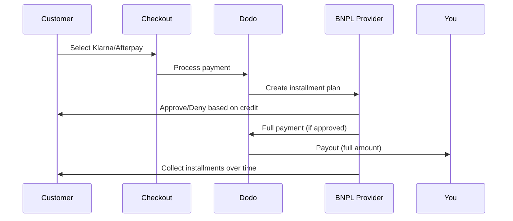

Buy Now Pay Later (BNPL) lets customers split purchases into interest-free installments, increasing average order value by 20-50% and conversion rates by 10-30% for eligible transactions.

## Why Offer BNPL?

<CardGroup cols={3}>
<Card title="Higher AOV" icon="chart-line">
Customers spend more when they can spread payments over time. Average order value increases 20-50%.
</Card>

<Card title="Better Conversion" icon="percent">
Removing payment friction at checkout. Conversion rates improve 10-30% for high-ticket items.
</Card>

<Card title="Zero Risk" icon="shield-check">
BNPL providers handle credit risk and collections. You receive full payment upfront.
</Card>
</CardGroup>

## Supported Providers

### Klarna

| Característica | Detalles |
| :------ | :------ |
| **Disponibilidad** | EE.UU. + 19 países europeos |
| **Monedas** | USD, EUR, GBP, DKK, NOK, SEK, CZK, RON, PLN, CHF |
| **Mínimo** | $50.01 (o equivalente) |
| **Suscripciones** | Sí |

**Supported Countries:** Austria, Belgium, Czech Republic, Denmark, Finland, France, Germany, Greece, Ireland, Italy, Netherlands, Norway, Poland, Portugal, Romania, Spain, Sweden, Switzerland, United Kingdom, United States

**Payment Options:**
- **Pay in 4** — Split into 4 interest-free payments
- **Pay in 30 days** — Full payment due in 30 days
- **Financing** — Longer-term installment plans

### Afterpay (Clearpay)

| Feature | Details |
| :------ | :------ |
| **Availability** | US, UK |
| **Currencies** | USD, GBP |
| **Minimum** | $50.01 (or equivalent) |
| **Subscriptions** | No |

**Payment Options:**
- **Pay in 4** — 4 interest-free payments every 2 weeks

<Note>
In the UK, Afterpay operates as "Clearpay" but uses the same API type (`afterpay_clearpay`).
</Note>

### Billie

| Feature | Details |
| :------ | :------ |
| **Availability** | Global |
| **Currencies** | GBP |
| **Minimum** | None |
| **Subscriptions** | No |

**About Billie:**
Billie is a B2B Buy Now Pay Later solution that enables businesses to offer flexible payment terms to their customers. It's designed for business-to-business transactions where buyers need invoice-based payment options.

**Payment Options:**
- **Invoice Payment** — Pay within agreed payment terms
- **Flexible Terms** — Business-friendly payment schedules

## Configuración

### Tipos de método de API

| Tipo | Proveedor |
| :--- | :------- |
| `klarna` | Klarna |
| `afterpay_clearpay` | Afterpay / Clearpay |
| `billie` | Billie (B2B) |

### Ejemplo

```javascript
const session = await client.checkoutSessions.create({
  product_cart: [{ product_id: 'pdt_123', quantity: 1 }],
  allowed_payment_method_types: [
    'klarna',
    'afterpay_clearpay',
    'credit',
    'debit'
  ],
  customer: {
    email: 'customer@example.com',
    name: 'Jane Smith'
  },
  billing_address: {
    country: 'US',
    zipcode: '10001'
  },
  return_url: 'https://example.com/success'
});
```

<Warning>
Incluye siempre `credit` y `debit` como alternativas. No todos los clientes cumplen los requisitos para BNPL, y las transacciones inferiores al mínimo del proveedor no serán elegibles.
</Warning>

## Límites del importe de las transacciones

Cada proveedor de BNPL tiene su propio importe mínimo (y, en ocasiones, máximo) para las transacciones:

| Proveedor | Mínimo | Máximo |
| :------- | :------ | :------ |
| Klarna | $50.01 | — |
| Afterpay | $50.01 | — |

Las transacciones fuera de estos límites:
- Las opciones de BNPL no aparecerán en el checkout
- No se genera ningún error; las opciones simplemente no se muestran
- Los pagos con tarjeta siguen estando disponibles

Este comportamiento es esperado. No incluyas un método de BNPL en `allowed_payment_method_types` si es poco probable que el precio de tu producto se encuentre dentro del intervalo compatible con ese proveedor.

## Cómo funcionan los pagos a plazos



**Puntos clave:**
- Recibes el **pago completo por adelantado** del proveedor de BNPL
- El proveedor de BNPL gestiona el **riesgo de crédito y los cobros**
- El cliente paga directamente al proveedor en **4 cuotas** (normalmente)
- **No hay contracargos** por fallos en las cuotas; ese riesgo lo asume el proveedor

## Pruebas

### Datos de prueba de Klarna

Usa estos datos en el modo de prueba:

| Campo | Aprobado | Rechazado |
| :---- | :------- | :----- |
| **Fecha de nacimiento** | 07-10-1970 | 07-10-1970 |
| **Nombre** | Test | Test |
| **Apellidos** | Person-us | Person-us |
| **Correo electrónico** | customer@email.us | customer+denied@email.us |
| **Calle** | Amsterdam Ave | Amsterdam Ave |
| **Número** | 509 | 509 |
| **Ciudad** | New York | New York |
| **Estado** | New York | New York |
| **Código postal** | 10024-3941 | 10024-3941 |
| **Teléfono** | +13106683312 | +13106354386 |

<Note>
La transacción debe ser de al menos $50 para que Klarna aparezca como opción.
</Note>

### Pruebas de Afterpay

<Steps>
<Step title="Select Afterpay">
Selecciona Afterpay en el checkout y haz clic en Pagar.
</Step>

<Step title="Successful payment">
Usa cualquier correo electrónico y dirección de envío válidos.
</Step>

<Step title="Failed authentication">
Para probar un fallo: cierra el modal de Afterpay en la página de redirección. El estado del pago cambia a `requires_payment_method`.
</Step>
</Steps>

## Prácticas recomendadas

<AccordionGroup>
<Accordion title="Target high-ticket items">
BNPL funciona mejor para productos de $100 a $1000. La propuesta de valor de "pagar a plazos" resulta más atractiva en este intervalo.
</Accordion>

<Accordion title="Show installment amounts">
"4 pagos de $25" resulta más atractivo que "$100 con Klarna". Muestra el importe de cada pago siempre que sea posible.
</Accordion>

<Accordion title="Don't force BNPL for low-value products">
Por debajo de $50, BNPL no aparecerá de todos modos. Por debajo de $100, la mayoría de los clientes prefiere pagar con tarjeta. Centra la promoción de BNPL en los artículos de mayor precio.
</Accordion>

<Accordion title="Collect billing address">
Los proveedores de BNPL requieren información de facturación para realizar comprobaciones de crédito. Asegúrate de que tu checkout recopile los datos completos de la dirección.
</Accordion>

<Accordion title="Set clear expectations">
Los clientes deben entender que están suscribiendo un acuerdo de crédito con Klarna/Afterpay, no contigo.
</Accordion>
</AccordionGroup>

## Limitaciones

### Sin suscripciones
Los métodos de pago BNPL **no admiten pagos recurrentes**. Para productos de suscripción, usa tarjetas u otros métodos compatibles con pagos recurrentes.

### Aprobación basada en el crédito
Los proveedores de BNPL realizan comprobaciones de crédito instantáneas. No todos los clientes serán aprobados. Las tasas de aprobación varían según:
- El historial crediticio del cliente con el proveedor
- El importe de la transacción
- La ubicación del cliente

### Correspondencia entre moneda y país

Cada moneda está restringida a su región correspondiente:

| Moneda | Países compatibles |
| :------- | :------------------ |
| **USD** | Solo Estados Unidos |
| **EUR** | Todos los países europeos compatibles (Austria, Bélgica, República Checa, Dinamarca, Finlandia, Francia, Alemania, Grecia, Irlanda, Italia, Países Bajos, Noruega, Polonia, Portugal, Rumanía, España, Suecia, Suiza) |
| **GBP** | Reino Unido y todos los países europeos compatibles |

Otras monedas compatibles con Klarna (DKK, NOK, SEK, CZK, RON, PLN, CHF) funcionan en sus respectivos países.

<Info>
Por ejemplo, una transacción en USD solo mostrará opciones de BNPL a los clientes que se encuentren en EE. UU. Una transacción en EUR mostrará opciones de BNPL en todos los países europeos compatibles. Una transacción en GBP mostrará opciones de BNPL a los clientes del Reino Unido y de todos los países europeos compatibles.
</Info>

| Proveedor | Monedas compatibles |
| :------- | :------------------- |
| Klarna | USD, EUR, GBP, DKK, NOK, SEK, CZK, RON, PLN, CHF |
| Afterpay | USD (US), GBP (UK) |

## Solución de problemas

<AccordionGroup>
<Accordion title="BNPL not appearing at checkout">
**Comprobar:**
1. ¿El importe de la transacción se encuentra dentro del intervalo compatible con el proveedor? (Klarna/Afterpay: mín. $50.01)
2. ¿La ubicación del cliente se encuentra en un país compatible?
3. ¿La moneda es compatible con el proveedor de BNPL?
4. ¿El método de BNPL está incluido en `allowed_payment_method_types`?

**Solución:** Lo más habitual es que la transacción esté por debajo del mínimo o por encima del máximo. Verifica que el importe se encuentre dentro del intervalo compatible con el proveedor.
</Accordion>

<Accordion title="Customer denied by BNPL provider">
**Causas:**
- Historial crediticio insuficiente con el proveedor
- Demasiados planes de pago a plazos activos
- Fallo en la verificación de identidad

**Solución:** Esto es normal para algunos clientes. Asegúrate de que haya alternativas de pago con tarjeta disponibles. No muestres motivos específicos del rechazo.
</Accordion>

<Accordion title="Payment stuck in pending">
**Causa:** El cliente no completó el flujo de autenticación con el proveedor de BNPL.

**Solución:** El pago agotará el tiempo de espera y fallará. El cliente puede volver a intentarlo o usar otro método.
</Accordion>
</AccordionGroup>

## Páginas relacionadas

<CardGroup cols={2}>
<Card title="Payment Methods Overview" icon="credit-card" href="/features/payment-methods">
Consulta todos los métodos de pago compatibles.
</Card>

<Card title="Checkout Guide" icon="book" href="/developer-resources/checkout-session">
Guía completa de implementación del checkout.
</Card>

<Card title="Testing Process" icon="flask" href="/miscellaneous/testing-process">
Todos los datos de prueba para los métodos de pago.
</Card>

<Card title="Adaptive Currency" icon="globe" href="/features/adaptive-currency">
Compatibilidad y conversión de monedas.
</Card>
</CardGroup>