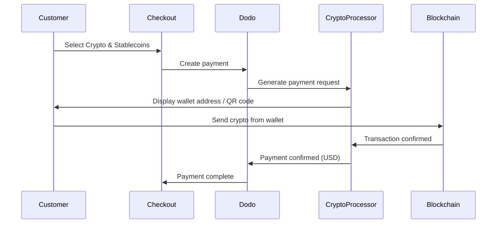

Los pagos con Cripto y Stablecoins permiten a los clientes pagar utilizando criptomonedas y stablecoins desde cualquier lugar del mundo (excepto India). Las transacciones se facturan en USD, por lo que recibes moneda fiduciaria mientras los clientes pagan con su billetera cripto preferida.

## ¿Por qué Ofrecer Cripto y Stablecoins?

<CardGroup cols={3}>
<Card title="Global Reach" icon="globe">
Acepta pagos de cualquier país — no se requiere infraestructura bancaria del lado del cliente.
</Card>

<Card title="No Chargebacks" icon="shield-check">
Las transacciones en cripto son irreversibles, eliminando completamente el fraude por contracargos.
</Card>

<Card title="USD Settlement" icon="dollar-sign">
Recibes USD — no es necesario gestionar la volatilidad del cripto o las billeteras.
</Card>
</CardGroup>

## Descripción General

| Detalle | Valor |
| :----- | :---- |
| **Moneda de Facturación** | USD |
| **Países Soportados** | Global (Excl. IN) |
| **Suscripciones** | No |
| **Cantidad Mínima** | $0.50 |
| **Liquidación** | USD |

## Cómo Funciona



## Experiencia del Cliente

1. El cliente selecciona Cripto y Stablecoins en el proceso de pago
2. Se muestra una dirección de billetera y un código QR con el monto en cripto
3. El cliente envía la cantidad exacta desde su billetera cripto
4. La transacción se confirma en la blockchain
5. El cliente es redirigido a la página de éxito

<Info>
Los pagos en cripto se facturan en USD. La cantidad de cripto que se muestra al pagar refleja el tipo de cambio en tiempo real en el momento del pago.
</Info>

## Monedas y Redes Soportadas

| Moneda | Redes |
| :------- | :------- |
| **USDC** | Ethereum, Solana, Polygon, Base |
| **USDP** | Ethereum, Solana |
| **USDG** | Ethereum |

## Configuración

```javascript
const session = await client.checkoutSessions.create({
  product_cart: [{ product_id: 'prod_123', quantity: 1 }],
  allowed_payment_method_types: ['crypto', 'credit', 'debit'],
  return_url: 'https://example.com/success'
});
```

## Tipo de Método API

| Tipo | Método | País |
| :--- | :----- | :------ |
| `crypto` | Cripto y Stablecoins | Global (Excl. IN) |

## Pruebas

<Steps>
<Step title="Enable test mode">
Utiliza tus claves de API de prueba de Dodo Payments.
</Step>

<Step title="Create a test checkout">
Crea una sesión de pago con `crypto` en los métodos de pago permitidos.
</Step>

<Step title="Complete the test flow">
Sigue el flujo de pago simulado en cripto en el entorno de prueba.
</Step>
</Steps>

## Mejores Prácticas

<AccordionGroup>
<Accordion title="Always include card fallbacks">
No todos los clientes tienen billeteras cripto. Siempre incluye `credit` e `debit` como métodos de pago de respaldo.
</Accordion>

<Accordion title="Set clear expectations on confirmation time">
Las confirmaciones en blockchain pueden tardar minutos según la red. Asegúrate de que tu checkout comunique esto a los clientes.
</Accordion>

<Accordion title="Handle underpayments and overpayments">
Los pagos en cripto pueden diferir ocasionalmente de la cantidad exacta debido a las tarifas de la red. Monitorea los webhooks para actualizaciones del estado de pago.
</Accordion>
</AccordionGroup>

## Solución de Problemas

<AccordionGroup>
<Accordion title="Crypto not appearing at checkout">
**Verificar:**
1. ¿`crypto` incluido en `allowed_payment_method_types`?
2. ¿El monto de la transacción cumple con el mínimo ($0.50)?

**Solución:** Verifica que el tipo de método de pago se pase correctamente en tu solicitud de API.
</Accordion>

<Accordion title="Payment not confirming">
**Causa:** Los tiempos de confirmación de blockchain varían. Algunas redes tardan más que otras.

**Solución:** Espera la confirmación del webhook. No trates el pago como fallido hasta que haya pasado la ventana de confirmación.
</Accordion>

<Accordion title="Amount mismatch">
**Causa:** Los tipos de cambio de cripto fluctúan entre el momento en que se inicia y se envía el pago.

**Solución:** Monitorea los webhooks para la cantidad final confirmada. Las pequeñas discrepancias se manejan automáticamente.
</Accordion>
</AccordionGroup>

## Páginas Relacionadas

<CardGroup cols={2}>
<Card title="Payment Methods Overview" icon="credit-card" href="/features/payment-methods">
Ver todos los métodos de pago compatibles.
</Card>

<Card title="Checkout Guide" icon="book" href="/developer-resources/checkout-session">
Guía completa de implementación de checkout.
</Card>

<Card title="Webhooks" icon="webhook" href="/developer-resources/webhooks">
Manejo asincrónico de confirmaciones de pago.
</Card>

<Card title="Testing Process" icon="flask" href="/miscellaneous/testing-process">
Guía completa de pruebas para todos los métodos de pago.
</Card>
</CardGroup>
