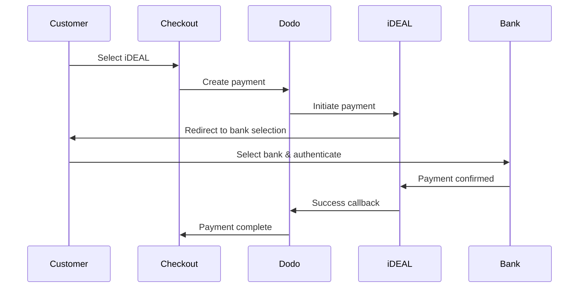
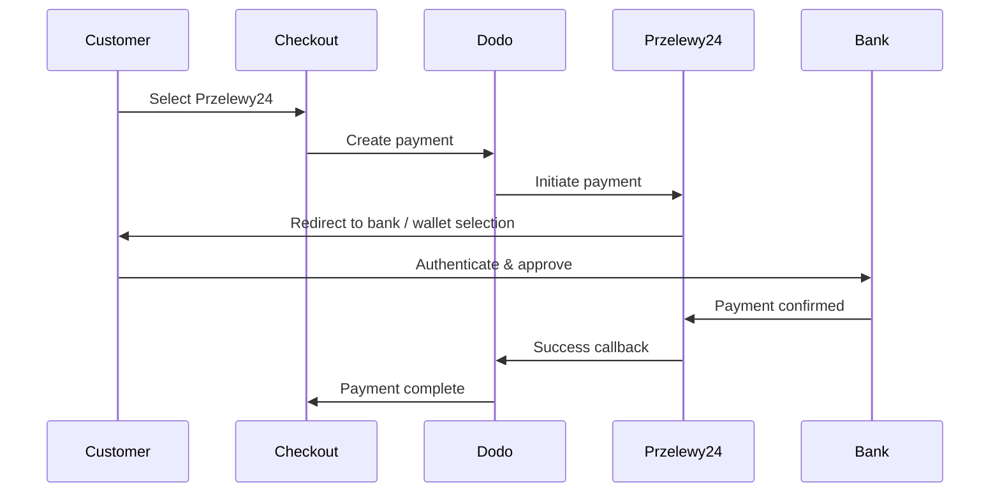
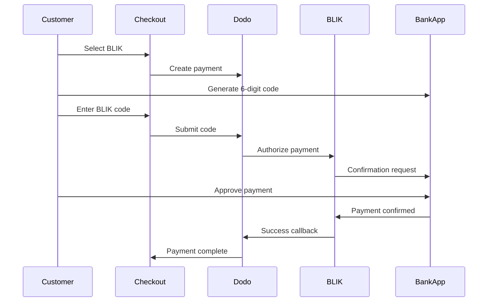

Los clientes europeos prefieren en gran medida los métodos de pago locales que se integran con sus sistemas bancarios. Ofrecer estos métodos puede aumentar las tasas de conversión entre un 20 y un 40 % en los mercados objetivo.

## ¿Por qué Métodos de Pago Europeos Locales?

<CardGroup cols={3}>
<Card title="Higher Conversion" icon="chart-line">
iDEAL captura ~60 % de los pagos online en los Países Bajos. No ofrecerlo implica perder clientes.
</Card>

<Card title="Lower Fraud" icon="shield-check">
Los pagos autenticados por el banco tienen tasas de fraude casi nulas y no generan contracargos.
</Card>

<Card title="Real-Time Settlement" icon="bolt">
La mayoría de los métodos europeos proporcionan confirmación de pago instantánea.
</Card>
</CardGroup>

## Métodos Soportados

| Método | País | Cuota de mercado | Moneda | Suscripciones |
| :----- | :------ | :----------- | :------- | :-----------: |
| **iDEAL** | Países Bajos | ~60 % | EUR | No |
| **Bancontact** | Bélgica | ~50 % | EUR | No |
| **EPS** | Austria | ~30 % | EUR | No |
| **Multibanco** | Portugal | ~40 % | EUR | No |
| **Przelewy24 (P24)** | Polonia | ~30 % | PLN | No |
| **BLIK** | Polonia | ~60 % | PLN | No |
| **SEPA Direct Debit** | Zona euro | Ampliamente utilizado | EUR | No |
| **Satispay** | Europa (Italia) | En crecimiento | EUR | Sí |

## iDEAL (Países Bajos)

iDEAL es el método de pago en línea dominante en los Países Bajos, conectándose directamente a todos los principales bancos neerlandeses.

### Cómo Funciona



### Bancos Soportados

Todos los principales bancos neerlandeses son compatibles:
- ABN AMRO
- ASN Bank
- Bunq
- ING
- Knab
- Rabobank
- RegioBank
- Revolut
- SNS
- Triodos Bank
- Van Lanschot

### Configuración

```javascript
const session = await client.checkoutSessions.create({
  product_cart: [{ product_id: 'prod_123', quantity: 1 }],
  allowed_payment_method_types: ['ideal', 'credit', 'debit'],
  billing_currency: 'EUR',
  billing_address: {
    country: 'NL',
    zipcode: '1012JS'
  },
  return_url: 'https://example.com/success'
});
```

## Bancontact (Bélgica)

Bancontact es el esquema de pago nacional de Bélgica, utilizado por prácticamente todos los bancos belgas para pagos en línea.

### Características
- Funciona con las tarjetas de débito belgas existentes
- Soporte de aplicación móvil (Payconiq de Bancontact)
- Confirmación instantánea del pago
- No se necesita registro adicional para los clientes

### Configuración

```javascript
const session = await client.checkoutSessions.create({
  product_cart: [{ product_id: 'prod_123', quantity: 1 }],
  allowed_payment_method_types: ['bancontact_card', 'credit', 'debit'],
  billing_currency: 'EUR',
  billing_address: {
    country: 'BE',
    zipcode: '1000'
  },
  return_url: 'https://example.com/success'
});
```

## EPS (Austria)

EPS (Estándar de Pago Electrónico) permite transferencias bancarias en línea directas para clientes austriacos.

### Características
- Integración directa con bancos austriacos
- Confirmación de pago en tiempo real
- Alta confianza entre los consumidores austriacos
- Sin contracargos

### Bancos Soportados

Bancos austriacos importantes, incluyendo:
- Erste Bank
- Bank Austria
- Raiffeisen
- BAWAG
- Volksbank

### Configuración

```javascript
const session = await client.checkoutSessions.create({
  product_cart: [{ product_id: 'prod_123', quantity: 1 }],
  allowed_payment_method_types: ['eps', 'credit', 'debit'],
  billing_currency: 'EUR',
  billing_address: {
    country: 'AT',
    zipcode: '1010'
  },
  return_url: 'https://example.com/success'
});
```

## Multibanco (Portugal)

Multibanco es la red interbancaria de Portugal, que ofrece tanto pagos en línea como pagos basados en cajeros automáticos.

### Opciones de Pago

1. **Banca en Línea** — Transferencia bancaria directa a través de la banca por internet
2. **Pago en Cajero Automático** — El cliente recibe una referencia para pagar en cualquier cajero automático Multibanco
3. **Banca Móvil** — Pago a través de aplicaciones móviles de bancos

### Cómo Funciona el Pago en Cajero Automático

Para los pagos en cajero automático, los clientes reciben una referencia de pago:

```
Entity: 12345
Reference: 123 456 789
Amount: €50.00
Expiry: 24 hours
```

El cliente puede pagar en cualquier cajero automático portugués o a través de la banca en línea utilizando esta referencia.

### Configuración

```javascript
const session = await client.checkoutSessions.create({
  product_cart: [{ product_id: 'prod_123', quantity: 1 }],
  allowed_payment_method_types: ['multibanco', 'credit', 'debit'],
  billing_currency: 'EUR',
  billing_address: {
    country: 'PT',
    zipcode: '1000-001'
  },
  return_url: 'https://example.com/success'
});
```

<Note>
Los pagos con Multibanco desde cajeros pueden tener un retraso entre el pago en el carrito y el pago real. Supervisa los webhooks para confirmar el pago.
</Note>

## Przelewy24 (Polonia)

Przelewy24 (P24) es el principal método de pago en línea de Polonia, agregando transferencias bancarias y billeteras locales de los principales bancos polacos. A diferencia de otros métodos europeos, Przelewy24 liquida en **PLN** (Złoty polaco), no en EUR.

### Cómo Funciona



### Disponibilidad

- **Moneda de facturación:** Solo PLN
- **Tipo de transacción:** Solo pagos únicos (no disponible para suscripciones)
- **Cobertura:** Todos los principales bancos polacos más billeteras locales populares

### Configuración

```javascript
const session = await client.checkoutSessions.create({
  product_cart: [{ product_id: 'prod_123', quantity: 1 }],
  allowed_payment_method_types: ['przelewy24', 'credit', 'debit'],
  billing_currency: 'PLN',
  billing_address: {
    country: 'PL',
    zipcode: '00-001'
  },
  return_url: 'https://example.com/success'
});
```

<Note>
Przelewy24 requiere una moneda de facturación **PLN**. Si cotiza sus precios en EUR, habilite [Moneda Adaptativa](/features/adaptive-currency) para que los clientes polacos sean facturados en PLN y Przelewy24 esté disponible.
</Note>

## BLIK (Polonia)

BLIK es el método de pago móvil más popular en Polonia, que permite a los clientes pagar usando un código único de 6 dígitos generado en su aplicación bancaria. Al igual que Przelewy24, BLIK se liquida en **PLN** (Złoty polaco), no en EUR.

### Cómo Funciona



### Disponibilidad

- **Moneda de facturación:** Solo PLN
- **Tipo de transacción:** Solo pagos únicos (no disponible para suscripciones)
- **Cobertura:** Todos los principales bancos polacos que apoyan BLIK

### Configuración

```javascript
const session = await client.checkoutSessions.create({
  product_cart: [{ product_id: 'prod_123', quantity: 1 }],
  allowed_payment_method_types: ['blik', 'credit', 'debit'],
  billing_currency: 'PLN',
  billing_address: {
    country: 'PL',
    zipcode: '00-001'
  },
  return_url: 'https://example.com/success'
});
```

<Note>
BLIK requiere una moneda de facturación en **PLN**. Si cotizas tus precios en EUR, habilita [Moneda Adaptativa](/features/adaptive-currency) para que los clientes polacos sean facturados en PLN y BLIK esté disponible.
</Note>

## SEPA Direct Debit (zona euro)

SEPA Direct Debit permite a los clientes de toda la zona euro pagar directamente desde su cuenta bancaria en lugar de utilizar una tarjeta. Se ofrece en checkouts en EUR para pagos únicos.

### Cómo funciona

El cliente autoriza el débito durante el checkout y el pago se cobra de su cuenta bancaria. A diferencia de la mayoría de los métodos europeos de esta página, la confirmación no es inmediata.

<Warning>
SEPA Direct Debit no es instantáneo. Un pago tarda **6 días laborables** en confirmarse, por lo que no debes tratar la autorización como liquidación; completa el fulfillment únicamente cuando el pago alcance un estado succeeded.
</Warning>

### Disponibilidad

- **Moneda de facturación:** EUR
- **Tipo de transacción:** Solo pagos únicos (no disponible para suscripciones)

### Configuración

```javascript
const session = await client.checkoutSessions.create({
  product_cart: [{ product_id: 'prod_123', quantity: 1 }],
  allowed_payment_method_types: ['sepa', 'credit', 'debit'],
  billing_currency: 'EUR',
  billing_address: {
    country: 'DE',
    zipcode: '10115'
  },
  return_url: 'https://example.com/success'
});
```

## Satispay (Europa)

Satispay es una popular red europea de pagos móviles, especialmente en Italia, que permite a los clientes pagar directamente desde su aplicación de Satispay sin compartir los datos de su tarjeta o cuenta bancaria. Satispay liquida en **EUR**.

### Funciones

- Pagos basados en una aplicación, independientes de las redes de tarjetas
- Gran adopción en Italia y crecimiento en otros mercados europeos
- Admite pagos únicos y suscripciones

### Disponibilidad

- **Moneda de facturación:** EUR
- **Tipo de transacción:** Pagos únicos y suscripciones

### Configuración

```javascript
const session = await client.checkoutSessions.create({
  product_cart: [{ product_id: 'prod_123', quantity: 1 }],
  allowed_payment_method_types: ['satispay', 'credit', 'debit'],
  billing_currency: 'EUR',
  billing_address: {
    country: 'IT',
    zipcode: '00100'
  },
  return_url: 'https://example.com/success'
});
```

## Tipos de métodos de API

| Tipo | Método | País |
| :--- | :----- | :------ |
| `ideal` | iDEAL | Países Bajos |
| `bancontact_card` | Bancontact | Bélgica |
| `eps` | EPS | Austria |
| `multibanco` | Multibanco | Portugal |
| `przelewy24` | Przelewy24 (P24) | Polonia |
| `blik` | BLIK | Polonia |
| `sepa` | SEPA Direct Debit | Zona euro |
| `satispay` | Satispay | Europa (Italia) |

## Checkout europeo multidivisa

Para las empresas que prestan servicio en varios países europeos, incluye todos los métodos regionales:

```javascript
const session = await client.checkoutSessions.create({
  product_cart: [{ product_id: 'prod_123', quantity: 1 }],
  allowed_payment_method_types: [
    'ideal',           // Netherlands
    'bancontact_card', // Belgium
    'eps',             // Austria
    'multibanco',      // Portugal
    'przelewy24',      // Poland (requires PLN billing currency)
    'blik',            // Poland (requires PLN billing currency)
    'sepa',            // Eurozone (one-time payments only)
    'satispay',        // Europe / Italy
    'credit',          // Fallback
    'debit'            // Fallback
  ],
  billing_currency: 'EUR',
  return_url: 'https://example.com/success'
});
```

Dodo muestra automáticamente solo los métodos relevantes según la ubicación del cliente. Un cliente neerlandés verá iDEAL; un cliente belga verá Bancontact.

## Pruebas

Los métodos de pago europeos pueden probarse en modo sandbox. El flujo de prueba simula el proceso de autenticación bancaria.

<Steps>
<Step title="Enable test mode">
Utiliza tus claves de API de prueba de Dodo Payments.
</Step>

<Step title="Set appropriate billing address">
Establece el país de la dirección de facturación para que coincida con el método de pago:
- `NL` para iDEAL
- `BE` para Bancontact
- `AT` para EPS
- `PT` para Multibanco
- `PL` para Przelewy24 y BLIK (con moneda de facturación PLN)
- `IT` para Satispay
</Step>

<Step title="Complete the test flow">
Sigue el flujo simulado de autenticación bancaria en el entorno de prueba.
</Step>
</Steps>

## Prácticas recomendadas

<AccordionGroup>
<Accordion title="Always include regional methods for target markets">
Si vendes a clientes neerlandeses, incluye iDEAL. No hacerlo es como no aceptar Visa en EE. UU.: perderás una cantidad significativa de ventas.
</Accordion>

<Accordion title="Match currency to region">
La mayoría de los métodos de pago europeos requieren EUR; asegúrate de que tus precios admitan transacciones en euros. La única excepción es Przelewy24, que se ofrece únicamente en **PLN** (zloty polaco) para la facturación.
</Accordion>

<Accordion title="Handle redirects gracefully">
Todos los métodos europeos implican redirecciones a sitios web bancarios. Asegúrate de que la gestión de tu URL de retorno sea sólida y contemple a los usuarios que abandonan el flujo a mitad del proceso.
</Accordion>

<Accordion title="Provide card fallbacks">
No todos los clientes europeos tienen acceso a estos métodos regionales (turistas, expatriados, etc.). Incluye siempre `credit` y `debit` como alternativas.
</Accordion>

<Accordion title="Consider Multibanco timing">
Los pagos en cajeros automáticos de Multibanco pueden tardar horas en completarse. No bloquees el fulfillment a la espera de un pago inmediato; utiliza webhooks para la confirmación asíncrona.
</Accordion>
</AccordionGroup>

## Solución de problemas

<AccordionGroup>
<Accordion title="European method not appearing">
**Comprobar:**
1. ¿El país de facturación del cliente coincide con el país del método?
2. ¿La moneda está establecida en EUR?
3. ¿El método está incluido en `allowed_payment_method_types`?

**Solución:** Los métodos europeos son estrictamente regionales. Un cliente cuyo país de facturación sea `DE` (Alemania) no verá iDEAL, que solo está disponible en los Países Bajos.
</Accordion>

<Accordion title="Bank authentication failed">
**Causas:**
- El cliente canceló durante la autenticación bancaria
- El sistema de autenticación del banco no está disponible temporalmente
- El cliente introdujo credenciales incorrectas

**Solución:** El cliente debe volver a intentarlo. Si el problema persiste, sugiérele probar con otro método de pago.
</Accordion>

<Accordion title="Redirect not completing">
**Causas:**
- El cliente cerró el navegador durante la redirección bancaria
- Se produjeron problemas de red durante la autenticación
- La URL de retorno está mal configurada

**Solución:** Verifica que la URL de retorno sea correcta y accesible. Asegúrate de que gestione tanto los estados de éxito como los de error.
</Accordion>

<Accordion title="Multibanco payment pending">
**Causa:** El cliente recibió una referencia de pago, pero todavía no ha pagado.

**Solución:** Esto es lo esperado en los pagos basados en cajeros automáticos. Espera la confirmación del webhook. La referencia suele caducar en 24-72 horas.
</Accordion>
</AccordionGroup>

## Cumplimiento de PSD2

Todos los métodos de pago europeos cumplen las normativas PSD2 (Payment Services Directive 2):

- **Strong Customer Authentication (SCA)** — Integrada en el flujo de autenticación bancaria
- **Comunicación segura** — Todos los datos se transmiten mediante canales seguros
- **Protección del consumidor** — Cumplimiento total de los derechos de los consumidores de la UE

## Páginas relacionadas

<CardGroup cols={2}>
<Card title="Payment Methods Overview" icon="credit-card" href="/features/payment-methods">
Consulta todos los métodos de pago compatibles.
</Card>

<Card title="Adaptive Currency" icon="globe" href="/features/adaptive-currency">
Compatibilidad con monedas y conversión automática.
</Card>

<Card title="Checkout Guide" icon="book" href="/developer-resources/checkout-session">
Guía completa de implementación del checkout.
</Card>

<Card title="Webhooks" icon="webhook" href="/developer-resources/webhooks">
Gestiona las confirmaciones de pago de forma asíncrona.
</Card>
</CardGroup>