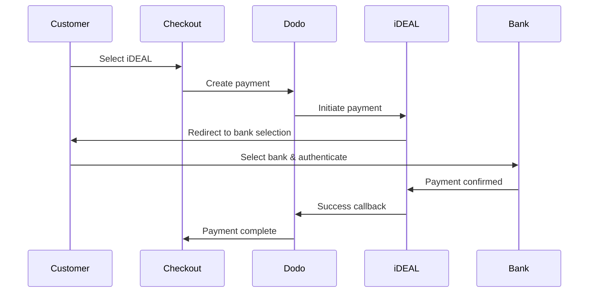
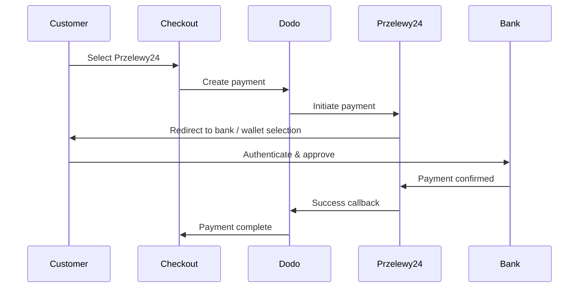

Los clientes europeos prefieren en gran medida los métodos de pago locales que se integran con sus sistemas bancarios. Ofrecer estos métodos puede aumentar las tasas de conversión entre un 20 y un 40 % en los mercados objetivo.

## ¿Por qué Métodos de Pago Europeos Locales?

<CardGroup cols={3}>
<Card title="Higher Conversion" icon="chart-line">
iDEAL captura ~60 % de los pagos online en los Países Bajos. No ofrecerlo implica perder clientes.
</Card>

<Card title="Lower Fraud" icon="shield-check">
Los pagos autenticados por el banco tienen tasas de fraude casi nulas y no generan contracargos.
</Card>

<Card title="Real-Time Settlement" icon="bolt">
La mayoría de los métodos europeos proporcionan confirmación de pago instantánea.
</Card>
</CardGroup>

## Métodos Soportados

| Método | País | Cuota de Mercado | Moneda | Suscripciones |
| :----- | :------ | :----------- | :------- | :-----------: |
| **iDEAL** | Países Bajos | ~60% | EUR | No |
| **Bancontact** | Bélgica | ~50% | EUR | No |
| **EPS** | Austria | ~30% | EUR | No |
| **Multibanco** | Portugal | ~40% | EUR | No |
| **Przelewy24 (P24)** | Polonia | ~30% | PLN | No |

## iDEAL (Países Bajos)

iDEAL es el método de pago en línea dominante en los Países Bajos, conectándose directamente a todos los principales bancos neerlandeses.

### Cómo Funciona



### Bancos Soportados

Todos los principales bancos neerlandeses son compatibles:
- ABN AMRO
- ASN Bank
- Bunq
- ING
- Knab
- Rabobank
- RegioBank
- Revolut
- SNS
- Triodos Bank
- Van Lanschot

### Configuración

```javascript
const session = await client.checkoutSessions.create({
  product_cart: [{ product_id: 'prod_123', quantity: 1 }],
  allowed_payment_method_types: ['ideal', 'credit', 'debit'],
  billing_currency: 'EUR',
  billing_address: {
    country: 'NL',
    zipcode: '1012JS'
  },
  return_url: 'https://example.com/success'
});
```

## Bancontact (Bélgica)

Bancontact es el esquema de pago nacional de Bélgica, utilizado por prácticamente todos los bancos belgas para pagos en línea.

### Características
- Funciona con las tarjetas de débito belgas existentes
- Soporte de aplicación móvil (Payconiq de Bancontact)
- Confirmación instantánea del pago
- No se necesita registro adicional para los clientes

### Configuración

```javascript
const session = await client.checkoutSessions.create({
  product_cart: [{ product_id: 'prod_123', quantity: 1 }],
  allowed_payment_method_types: ['bancontact_card', 'credit', 'debit'],
  billing_currency: 'EUR',
  billing_address: {
    country: 'BE',
    zipcode: '1000'
  },
  return_url: 'https://example.com/success'
});
```

## EPS (Austria)

EPS (Estándar de Pago Electrónico) permite transferencias bancarias en línea directas para clientes austriacos.

### Características
- Integración directa con bancos austriacos
- Confirmación de pago en tiempo real
- Alta confianza entre los consumidores austriacos
- Sin contracargos

### Bancos Soportados

Bancos austriacos importantes, incluyendo:
- Erste Bank
- Bank Austria
- Raiffeisen
- BAWAG
- Volksbank

### Configuración

```javascript
const session = await client.checkoutSessions.create({
  product_cart: [{ product_id: 'prod_123', quantity: 1 }],
  allowed_payment_method_types: ['eps', 'credit', 'debit'],
  billing_currency: 'EUR',
  billing_address: {
    country: 'AT',
    zipcode: '1010'
  },
  return_url: 'https://example.com/success'
});
```

## Multibanco (Portugal)

Multibanco es la red interbancaria de Portugal, que ofrece tanto pagos en línea como pagos basados en cajeros automáticos.

### Opciones de Pago

1. **Banca en Línea** — Transferencia bancaria directa a través de la banca por internet
2. **Pago en Cajero Automático** — El cliente recibe una referencia para pagar en cualquier cajero automático Multibanco
3. **Banca Móvil** — Pago a través de aplicaciones móviles de bancos

### Cómo Funciona el Pago en Cajero Automático

Para los pagos en cajero automático, los clientes reciben una referencia de pago:

```
Entity: 12345
Reference: 123 456 789
Amount: €50.00
Expiry: 24 hours
```

El cliente puede pagar en cualquier cajero automático portugués o a través de la banca en línea utilizando esta referencia.

### Configuración

```javascript
const session = await client.checkoutSessions.create({
  product_cart: [{ product_id: 'prod_123', quantity: 1 }],
  allowed_payment_method_types: ['multibanco', 'credit', 'debit'],
  billing_currency: 'EUR',
  billing_address: {
    country: 'PT',
    zipcode: '1000-001'
  },
  return_url: 'https://example.com/success'
});
```

<Note>
Los pagos con Multibanco desde cajeros pueden tener un retraso entre el pago en el carrito y el pago real. Supervisa los webhooks para confirmar el pago.
</Note>

## Przelewy24 (Polonia)

Przelewy24 (P24) es el principal método de pago en línea de Polonia, agregando transferencias bancarias y billeteras locales de los principales bancos polacos. A diferencia de otros métodos europeos, Przelewy24 liquida en **PLN** (Złoty polaco), no en EUR.

### Cómo Funciona



### Disponibilidad

- **Moneda de facturación:** Solo PLN
- **Tipo de transacción:** Solo pagos únicos (no disponible para suscripciones)
- **Cobertura:** Todos los principales bancos polacos más billeteras locales populares

### Configuración

```javascript
const session = await client.checkoutSessions.create({
  product_cart: [{ product_id: 'prod_123', quantity: 1 }],
  allowed_payment_method_types: ['przelewy24', 'credit', 'debit'],
  billing_currency: 'PLN',
  billing_address: {
    country: 'PL',
    zipcode: '00-001'
  },
  return_url: 'https://example.com/success'
});
```

<Note>
Przelewy24 requiere una moneda de facturación **PLN**. Si cotiza sus precios en EUR, habilite [Moneda Adaptativa](/features/adaptive-currency) para que los clientes polacos sean facturados en PLN y Przelewy24 esté disponible.
</Note>

## Tipos de Métodos de API

| Tipo | Método | País |
| :--- | :----- | :------ |
| `ideal` | iDEAL | Países Bajos |
| `bancontact_card` | Bancontact | Bélgica |
| `eps` | EPS | Austria |
| `multibanco` | Multibanco | Portugal |
| `przelewy24` | Przelewy24 (P24) | Polonia |

## Checkout Europeo Multi-País

Para empresas que atienden a múltiples países europeos, incluya todos los métodos regionales:

```javascript
const session = await client.checkoutSessions.create({
  product_cart: [{ product_id: 'prod_123', quantity: 1 }],
  allowed_payment_method_types: [
    'ideal',           // Netherlands
    'bancontact_card', // Belgium
    'eps',             // Austria
    'multibanco',      // Portugal
    'przelewy24',      // Poland (requires PLN billing currency)
    'credit',          // Fallback
    'debit'            // Fallback
  ],
  billing_currency: 'EUR',
  return_url: 'https://example.com/success'
});
```

Dodo muestra automáticamente solo los métodos relevantes según la ubicación del cliente. Un cliente holandés verá iDEAL; un cliente belga verá Bancontact.

## Pruebas

Los métodos de pago europeos se pueden probar en modo sandbox. El flujo de prueba simula el proceso de autenticación bancaria.

<Steps>
<Step title="Enable test mode">
Use sus claves de API de prueba de Dodo Payments.
</Step>

<Step title="Set appropriate billing address">
Establezca el país de la dirección de facturación para que coincida con el método de pago:
- `NL` para iDEAL
- `BE` para Bancontact
- `AT` para EPS
- `PT` para Multibanco
- `PL` para Przelewy24 (con moneda de facturación PLN)
</Step>

<Step title="Complete the test flow">
Siga el flujo de autenticación bancaria simulado en el entorno de prueba.
</Step>
</Steps>

## Mejores Prácticas

<AccordionGroup>
<Accordion title="Always include regional methods for target markets">
Si vende a clientes holandeses, incluya iDEAL. No hacerlo es como no aceptar Visa en EE. UU. — perderá ventas significativas.
</Accordion>

<Accordion title="Match currency to region">
La mayoría de los métodos de pago europeos requieren EUR — asegúrese de que sus precios admitan transacciones en euros. La única excepción es Przelewy24, que solo se ofrece con facturación en **PLN** (Złoty polaco).
</Accordion>

<Accordion title="Handle redirects gracefully">
Todos los métodos europeos implican redirecciones a los sitios de los bancos. Asegúrese de que su manejo de URL de retorno sea robusto y tenga en cuenta a los usuarios que abandonan a mitad de flujo.
</Accordion>

<Accordion title="Provide card fallbacks">
No todos los clientes europeos tienen acceso a estos métodos regionales (turistas, expatriados, etc.). Siempre incluya `credit` y `debit` como alternativas.
</Accordion>

<Accordion title="Consider Multibanco timing">
Los pagos en cajeros automáticos de Multibanco pueden tardar horas en completarse. No bloquee el cumplimiento en el pago inmediato — use webhooks para confirmación asincrónica.
</Accordion>
</AccordionGroup>

## Solución de Problemas

<AccordionGroup>
<Accordion title="European method not appearing">
**Verifique:**
1. ¿El país de facturación del cliente coincide con el país del método?
2. ¿La moneda está configurada en EUR?
3. ¿Método incluido en `allowed_payment_method_types`?

**Solución:** Los métodos europeos son estrictamente regionales. Un cliente con país de facturación `DE` (Alemania) no verá iDEAL, que es solo para los Países Bajos.
</Accordion>

<Accordion title="Bank authentication failed">
**Causas:**
- El cliente canceló durante la autenticación bancaria
- El sistema de autenticación del banco no está disponible temporalmente
- El cliente ingresó credenciales incorrectas

**Solución:** El cliente debe intentarlo de nuevo. Si persiste, sugiera probar un método de pago diferente.
</Accordion>

<Accordion title="Redirect not completing">
**Causas:**
- El cliente cerró el navegador durante la redirección bancaria
- Problemas de red durante la autenticación
- URL de retorno configurada incorrectamente

**Solución:** Verifique que la URL de retorno sea correcta y accesible. Asegúrese de que maneje tanto los estados de éxito como de fallo.
</Accordion>

<Accordion title="Multibanco payment pending">
**Causa:** El cliente recibió referencia de pago pero aún no ha pagado.

**Solución:** Esto es esperado para pagos basados en cajeros automáticos. Espere la confirmación del webhook. La referencia típicamente expira en 24-72 horas.
</Accordion>
</AccordionGroup>

## Cumplimiento PSD2

Todos los métodos de pago europeos cumplen con las regulaciones de PSD2 (Directiva de Servicios de Pago 2):

- **Autenticación Reforzada del Cliente (SCA)** — Integrada en el flujo de autenticación bancaria
- **Comunicación Segura** — Todos los datos transmitidos por canales seguros
- **Protección al Consumidor** — Cumplimiento total con los derechos del consumidor de la UE

## Páginas Relacionadas

<CardGroup cols={2}>
<Card title="Payment Methods Overview" icon="credit-card" href="/features/payment-methods">
Ver todos los métodos de pago compatibles.
</Card>

<Card title="Adaptive Currency" icon="globe" href="/features/adaptive-currency">
Soporte de moneda y conversión automática.
</Card>

<Card title="Checkout Guide" icon="book" href="/developer-resources/checkout-session">
Guía completa de implementación de checkout.
</Card>

<Card title="Webhooks" icon="webhook" href="/developer-resources/webhooks">
Maneje las confirmaciones de pago de manera asincrónica.
</Card>
</CardGroup>