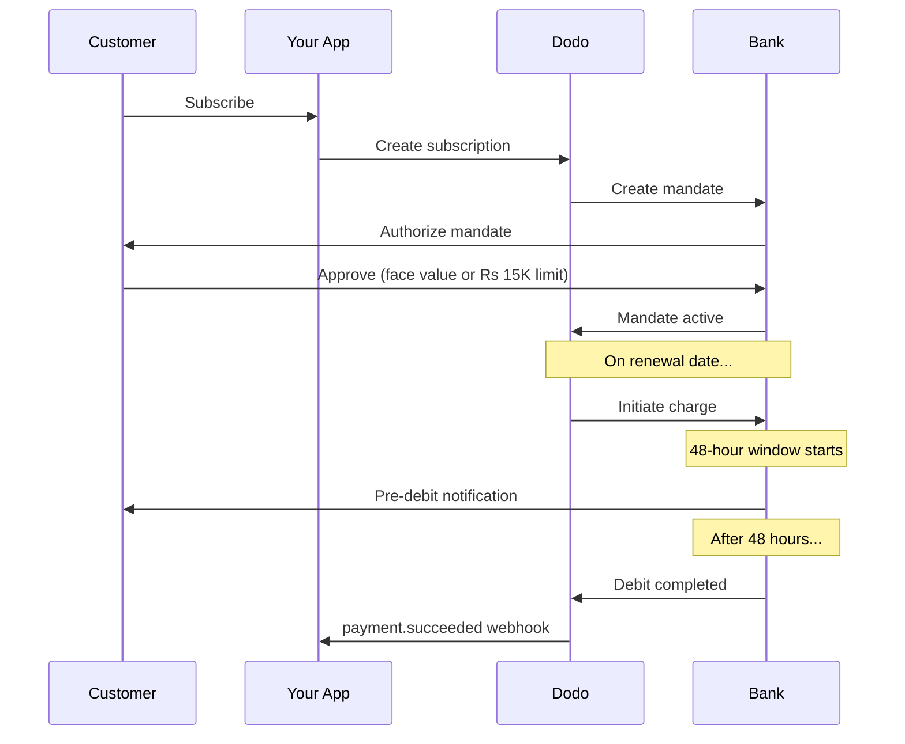

India tiene una infraestructura de pago única dominada por UPI (más del 60% de las transacciones digitales) y tarjetas emitidas en India (Visa, Mastercard, Rupay, etc.). Dodo Payments admite todos estos métodos con total cumplimiento del RBI para mandatos de suscripción.

## Por qué importan los métodos de pago en India

<CardGroup cols={3}>
<Card title="UPI Dominance" icon="mobile">
UPI procesa 10B+ transacciones/mes. Muchos clientes indios no tienen tarjetas internacionales.
</Card>

<Card title="Low Transaction Costs" icon="indian-rupee-sign">
UPI tiene tarifas de transacción prácticamente nulas. Excelente para transacciones de alto volumen y bajo valor.
</Card>

<Card title="Subscription Support" icon="repeat">
A diferencia de la mayoría de los métodos de pago alternativos, UPI y todas las tarjetas emitidas en India (Visa, Mastercard, Rupay, etc.) admiten pagos recurrentes a través de mandatos del RBI.
</Card>
</CardGroup>

## Métodos Soportados

| Método | Tipo | Suscripciones | Monto Mínimo |
| :----- | :--- | :-----------: | :--------- |
| **UPI Collect** | Código QR / VPA | Sí* | ₹1 |
| **Rupay Credit** | Tarjeta | Sí* | ₹1 |
| **Rupay Debit** | Tarjeta | Sí* | ₹1 |

*Las suscripciones requieren mandatos compatibles con el RBI con reglas de procesamiento especiales. El retraso de procesamiento de 48 horas se aplica a todas las tarjetas emitidas en India y UPI.

## Configuración

### Tipos de Métodos API

| Tipo | Descripción |
| :--- | :---------- |
| `upi_collect` | UPI mediante código QR o entrada de VPA |
| `credit` | Tarjetas de crédito, incluidas Rupay |
| `debit` | Tarjetas de débito, incluidas Rupay |

### Ejemplo: Pago Enfocado en India

```javascript
const session = await client.checkoutSessions.create({
  product_cart: [{ product_id: 'pdt_123', quantity: 1 }],
  allowed_payment_method_types: [
    'upi_collect',
    'credit',
    'debit'
  ],
  billing_currency: 'INR',
  customer: {
    email: 'customer@example.in',
    name: 'Priya Sharma',
    phone_number: '+919876543210'
  },
  billing_address: {
    country: 'IN',
    zipcode: '560001'
  },
  return_url: 'https://example.com/success'
});
```

### Requisitos para UPI

Para que UPI aparezca en el checkout:
1. **El país de facturación** debe ser India (`IN`)
2. **La moneda** debe ser INR
3. Para comerciantes no indios: **Adaptive Currency** debe estar habilitado

<Warning>
Si eres un comerciante no indio y Adaptive Currency no está habilitada, UPI no estará disponible para tus clientes.
</Warning>

## Suscripciones con Mandatos de RBI

Las suscripciones de métodos de pago indios operan bajo las regulaciones del RBI (Banco de Reserva de India) con requisitos únicos.

### Cómo Funcionan los Mandatos de RBI



### Tipos de Mandatos

| Monto de Suscripción | Tipo de Mandato | Límite |
| :------------------- | :-------------- | :----- |
| **Por debajo del piso del mandato** | Mandato a demanda | Piso del mandato (₹15,000 por defecto) |
| **En o por encima del piso del mandato** | Mandato de monto fijo | Monto exacto de suscripción |

La cantidad registrada con el banco del cliente es `max(mandate_floor, billing_amount)`. Así que el piso es efectivamente el **techo de autorización** para el cliente siempre que la facturación sea menor que el piso.

**Importante para cambios de plan:** Si una actualización resulta en un cargo que excede el límite del mandato existente, el cargo fallará y el cliente debe reautorizar.

### Piso de Mandato Configurable

El piso de mandato para e-mandatos en INR es configurable a través del campo `mandate_min_amount_inr_paise` (en **INR paise** — 1 INR = 100 paise). Puedes sobreescribir el valor por defecto del sistema de ₹15,000 en tres niveles:

| Nivel | Dónde establecerlo | Alcance |
|-------|---------------------|---------|
| **Por solicitud** | `mandate_min_amount_inr_paise` en una sesión de checkout o suscripción | Una transacción |
| **Merchant** | Configuración del negocio | Todas tus suscripciones en INR |
| **Sistema** | — | ₹15,000 predeterminado |

Prioridad de resolución: sobreescritura por solicitud → configuración del comerciante → valor por defecto del sistema.

```typescript
// Per-checkout override
const session = await client.checkoutSessions.create({
  product_cart: [{ product_id: 'pdt_inr_monthly', quantity: 1 }],
  mandate_min_amount_inr_paise: 2_000_000, // ₹20,000 ceiling
  return_url: 'https://yoursite.com/return'
});

// Per-subscription override
const subscription = await client.subscriptions.create({
  product_id: 'pdt_inr_monthly',
  quantity: 1,
  customer: { email: 'customer@example.in' },
  billing: { country: 'IN', /* ... */ },
  mandate_min_amount_inr_paise: 2_000_000
});
```

| Campo | Tipo | Validación | Se aplica a |
|-------|------|-----------|------------|
| `mandate_min_amount_inr_paise` | `integer` (INR paise) | `>= 1` | Suscripciones de tarjetas indias en INR en conectores no-Airwallex |

<Info>
Establecer un piso más alto te permite admitir cargos únicos más grandes más adelante (por ejemplo, actualizaciones de plan o excesos basados en el uso) sin obligar a los clientes a reautorizar. Establecer un piso más bajo acerca la autorización del cliente al monto real de facturación, pero limita el margen para futuros cargos variables.
</Info>

<Warning>
Esta configuración solo afecta a los e-mandatos registrados para tarjetas emitidas en India (Visa, Mastercard, RuPay) en suscripciones en INR. Las suscripciones UPI siguen su propio flujo AutoPay y no se ven afectadas.
</Warning>

### El Retardo de Procesamiento de 48 Horas

Esta es la diferencia más importante respecto a los pagos con tarjetas internacionales:

<Steps>
<Step title="Charge Initiated (Day 0)">
En la fecha de renovación programada, Dodo inicia el cargo con el banco.
</Step>

<Step title="Pre-Debit Notification">
El cliente recibe notificación de su banco sobre el próximo débito.
</Step>

<Step title="48-Hour Window">
El cliente puede cancelar el mandato durante este período vía su aplicación bancaria.
</Step>

<Step title="Debit Completed (~48-51 hours)">
Después de 48 horas (más hasta 3 horas adicionales por procesamiento bancario), los fondos son debitados.
</Step>

<Step title="Webhook Sent">
`payment.succeeded` webhook se envía después del débito real, no en la iniciación.
</Step>
</Steps>

<Warning>
**No otorgues beneficios en la iniciación del cargo.** Espera al webhook `payment.succeeded`, que llega aproximadamente de 48 a 51 horas después de la fecha de cargo programada.
</Warning>

### Manejo de la Ventana de 48 Horas

```javascript
// DON'T do this:
async function handleSubscriptionRenewal(subscription) {
  // ❌ Bad: Granting access immediately when charge is initiated
  grantPremiumAccess(subscription.customer_id);
}

// DO this:
async function handlePaymentWebhook(event) {
  if (event.type === 'payment.succeeded') {
    // ✅ Good: Only grant access after payment is confirmed
    grantPremiumAccess(event.data.customer_id);
  }
  
  if (event.type === 'payment.failed') {
    // Handle failed payment (mandate cancelled, insufficient funds)
    revokePremiumAccess(event.data.customer_id);
  }
}
```

### Eventos Webhook para Suscripciones en India

| Evento | Cuándo | Acción |
| :----- | :----- | :----- |
| `subscription.active` | Mandato autorizado | Registrar inicio de suscripción |
| `payment.succeeded` | ~48h después de la fecha de cargo | Otorgar/continuar acceso |
| `payment.failed` | Débito fallido | Notificar al cliente, pausar acceso |
| `subscription.on_hold` | Pago fallido | Soliciar actualización del método de pago |
| `subscription.active` | Reactivado después de pago | Restaurar acceso |

## Pruebas

### IDs de Prueba de UPI

| Estado | ID de UPI |
| :----- | :-------- |
| Éxito | `success@upi` |
| Fallo | `failure@upi` |

### Números de Prueba de Tarjetas Indias

| Marca | Escenario | Número de Tarjeta | Expiración | CVV |
| :---- | :-------- | :--------------- | :---------- | :--- |
| Visa | Éxito | `4576238912771450` | 06/32 | 123 |
| Visa | Rechazada | `4706131211212123` | 06/32 | 123 |
| Mastercard | Éxito | `5409162669381034` | 06/32 | 123 |
| Mastercard | Rechazada | `5105105105105100` | 06/32 | 123 |

## Mejores Prácticas

<AccordionGroup>
<Accordion title="Plan for the 48-hour delay">
Construye tu aplicación para manejar la brecha entre la iniciación del cargo y el pago real. Considera:
- Períodos de gracia para el acceso a suscripciones
- Comunicación clara a los clientes sobre el tiempo de procesamiento
- Cumplimiento basado en webhooks, no en fechas
</Accordion>

<Accordion title="Handle mandate cancellations">
Los clientes pueden cancelar mandatos a través de sus aplicaciones bancarias en cualquier momento. Monitorea los webhooks `subscription.on_hold` y pide a los clientes que se resuscriban o actualicen los métodos de pago.
</Accordion>

<Accordion title="Set appropriate mandate amounts">
Para tarifas variables (por ejemplo, basadas en uso), considera si un mandato a demanda de Rs 15,000 es suficiente. Si los cargos pueden exceder esto, los clientes necesitarán reautorizar.
</Accordion>

<Accordion title="Offer UPI prominently">
Para clientes indios, UPI debería ser la opción de pago principal. Muchos usuarios lo prefieren sobre las tarjetas debido a su familiaridad y menor fricción.
</Accordion>
</AccordionGroup>

## Solución de Problemas

<AccordionGroup>
<Accordion title="UPI not appearing at checkout">
**Verifica:**
1. ¿País de facturación configurado en `IN`?
2. ¿Moneda configurada en `INR`?
3. Si no es comerciante indio: ¿Moneda Adaptativa habilitada?
4. ¿`upi_collect` incluido en `allowed_payment_method_types`?

**Solución:** Verifica que la dirección de facturación tenga `country: "IN"` e `billing_currency: "INR"`.
</Accordion>

<Accordion title="Subscription charge failed after upgrade">
**Causa:** El nuevo monto del cargo excede el límite del mandato existente (umbral de Rs 15,000).

**Solución:** El cliente debe actualizar el método de pago para establecer un nuevo mandato con el límite correcto.
</Accordion>

<Accordion title="Subscription on hold but customer claims they didn't cancel">
**Causa:** El cliente pudo haber cancelado el mandato durante el período de 48 horas, o su banco rechazó el débito.

**Solución:** El cliente necesita reautorizar el mandato o actualizar su método de pago.
</Accordion>

<Accordion title="Payment deduction delayed beyond 48 hours">
**Causa:** Los retrasos en la API del banco pueden extender el procesamiento en 2-3 horas adicionales.

**Solución:** Esto es esperado. Construye tu sistema para manejar retrasos variables de hasta ~51 horas en total.
</Accordion>

<Accordion title="Mandate cancelled but subscription still active">
**Causa:** Caso límite en las regulaciones del RBI — la cancelación del mandato durante la ventana de procesamiento no cancela inmediatamente la suscripción.

**Solución:** El próximo cargo fallará y la suscripción pasará a `on_hold`. Monitorea los webhooks para `payment.failed`.
</Accordion>
</AccordionGroup>

## Páginas Relacionadas

<CardGroup cols={2}>
<Card title="Payment Methods Overview" icon="credit-card" href="/features/payment-methods">
Ver todos los métodos de pago soportados.
</Card>

<Card title="Subscriptions" icon="repeat" href="/features/subscription">
Documentación completa de suscripción incluyendo mandatos del RBI.
</Card>

<Card title="Webhooks" icon="webhook" href="/developer-resources/webhooks">
Manejo de webhooks para eventos de pago.
</Card>

<Card title="Testing Process" icon="flask" href="/miscellaneous/testing-process">
Todos los datos de prueba, incluyendo IDs de UPI y tarjetas indias.
</Card>
</CardGroup>