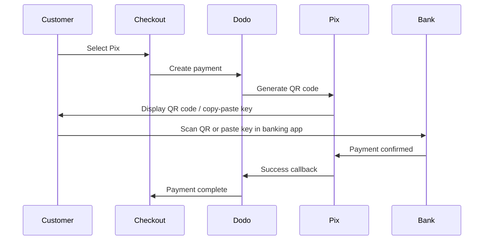

Pix es el sistema de pagos instantáneos de Brasil creado por el Banco Central de Brasil (Banco Central do Brasil). Permite transferencias en tiempo real 24/7, incluidos fines de semana y feriados, y se ha convertido en el método de pago más popular en Brasil.

## ¿Por Qué Ofrecer Pix?

<CardGroup cols={3}>
<Card title="Dominant in Brazil" icon="chart-line">
Pix es el método de pago más usado en Brasil, superando a las tarjetas de crédito y al boleto.
</Card>

<Card title="Instant Settlement" icon="bolt">
Los pagos se confirman en segundos, 24/7/365, sin esperar ventanas de procesamiento bancario.
</Card>

<Card title="Low Friction" icon="mobile">
Los clientes pagan mediante código QR o clave de copiar y pegar, no se necesitan números de tarjeta ni datos bancarios.
</Card>
</CardGroup>

## Resumen

| Detalle | Valor |
| :----- | :---- |
| **Moneda de Cobro** | BRL |
| **Países Soportados** | Brasil |
| **Suscripciones** | No |
| **Cantidad Mínima** | $0.50 |
| **Liquidación** | Instantánea |

## Cómo Funciona



## Experiencia del Cliente

1. El cliente selecciona Pix en el proceso de pago
2. Se muestra un código QR y una clave para copiar y pegar
3. El cliente abre su aplicación bancaria y escanea el código QR o pega la clave
4. El pago se confirma al instante
5. El cliente es redirigido a la página de éxito

<Info>
Los códigos QR de Pix típicamente expiran después de un período determinado. Si el cliente no completa el pago a tiempo, deberá reiniciar el proceso de pago.
</Info>

## Configuración

```javascript
const session = await client.checkoutSessions.create({
  product_cart: [{ product_id: 'pdt_123', quantity: 1 }],
  allowed_payment_method_types: ['pix', 'credit', 'debit'],
  billing_currency: 'BRL',
  return_url: 'https://example.com/success'
});
```

## Tipo de Método de API

| Tipo | Método | País |
| :--- | :----- | :------ |
| `pix` | Pix | Brasil |

## Pruebas

<Steps>
<Step title="Enable test mode">
Usa tus claves API de prueba de Dodo Payments.
</Step>

<Step title="Set billing currency to BRL">
Asegúrate de que la moneda de cobro esté configurada en `BRL` en tu solicitud de pago.
</Step>

<Step title="Enter test CPF and scan the QR code">
Cuando se te solicite un CPF de Pix, introduce `1234567890`. Se generará un código QR de prueba; escanéalo con la cámara habitual de tu teléfono (no necesitas una aplicación de Pix). Se te redirigirá a una página de prueba donde podrás simular la transacción como exitosa o fallida.
</Step>
</Steps>

## Mejores Prácticas

<AccordionGroup>
<Accordion title="Set billing currency to BRL">
Pix solo funciona con BRL. Asegúrate de que tus precios sean compatibles con transacciones en Real Brasileño para el mercado brasileño.
</Accordion>

<Accordion title="Provide card fallbacks">
No todos los clientes brasileños pueden preferir Pix. Siempre incluye `credit` e `debit` como opciones alternativas.
</Accordion>

<Accordion title="Handle QR code expiration">
Los códigos QR de Pix expiran después de un período establecido. Asegúrate de que tu proceso de pago maneje la expiración adecuadamente y permita a los clientes regenerar el código.
</Accordion>
</AccordionGroup>

## Solución de Problemas

<AccordionGroup>
<Accordion title="Pix not appearing at checkout">
**Verificación:**
1. ¿Moneda de cobro configurada en `BRL`?
2. ¿`pix` incluida en `allowed_payment_method_types`?
3. ¿País de facturación del cliente es Brasil?

**Solución:** Pix solo está disponible para transacciones en BRL. Verifica la moneda y la dirección de facturación en tu solicitud API.
</Accordion>

<Accordion title="QR code expired">
**Causa:** El cliente no completó el pago dentro del período de expiración.

**Solución:** El cliente necesita reiniciar el proceso de pago para generar un nuevo código QR.
</Accordion>

<Accordion title="Payment pending">
**Causa:** Los pagos de Pix se confirman al instante en la mayoría de los casos, pero pueden ocurrir retrasos ocasionales del lado del banco.

**Solución:** Monitorea los webhooks para la confirmación del pago. Si el pago no se confirma en unos minutos, trátalo como fallido.
</Accordion>
</AccordionGroup>

## Páginas Relacionadas

<CardGroup cols={2}>
<Card title="Payment Methods Overview" icon="credit-card" href="/features/payment-methods">
Consulta todos los métodos de pago soportados.
</Card>

<Card title="Adaptive Currency" icon="globe" href="/features/adaptive-currency">
Soporte de moneda y conversión automática.
</Card>

<Card title="Checkout Guide" icon="book" href="/developer-resources/checkout-session">
Guía completa de implementación de procesos de pago.
</Card>

<Card title="Webhooks" icon="webhook" href="/developer-resources/webhooks">
Maneja las confirmaciones de pago de manera asincrónica.
</Card>
</CardGroup>
