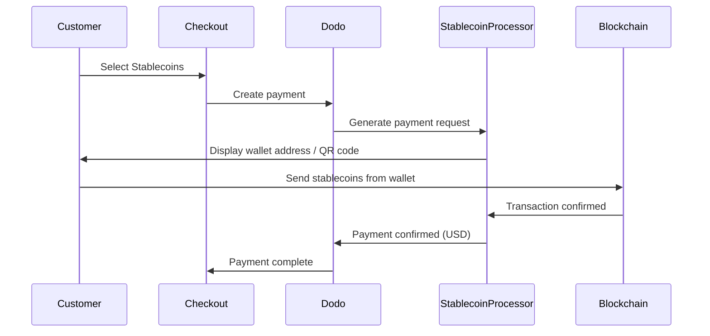

Los pagos con stablecoins permiten a los clientes pagar utilizando stablecoins desde cualquier parte del mundo (excepto India). Las transacciones se facturan en USD, por lo que recibes moneda fiduciaria mientras los clientes pagan con su cartera de stablecoins preferida.

## ¿Por qué ofrecer Stablecoins?

Acepta pagos de cualquier país: no se requiere infraestructura bancaria por parte del cliente.

Las transacciones con stablecoins son irreversibles, eliminando por completo el fraude por contracargos.

Recibes USD: no necesitas gestionar la volatilidad o las carteras.

## Descripción general

| Detalle | Valor |
| :----- | :---- |
| **Moneda de facturación** | USD |
| **Países soportados** | Global (Excl. IN) |
| **Suscripciones** | No |
| **Cantidad mínima** | $0.50 |
| **Liquidación** | USD |

## ¿Cómo funciona?



## Experiencia del cliente

1. El cliente selecciona Stablecoins en el pago
2. Se muestra una dirección de cartera y un código QR con el monto en stablecoins
3. El cliente envía la cantidad exacta desde su cartera de stablecoins
4. La transacción se confirma en la blockchain
5. El cliente es redirigido a la página de éxito

Los pagos con stablecoins se facturan en USD. La cantidad de stablecoin mostrada en la caja refleja el tipo de cambio en tiempo real al momento del pago.

## Monedas y Redes Compatibles

| Moneda | Redes |
| :------- | :------- |
| **USDC** | Ethereum, Solana, Polygon, Base |
| **USDP** | Ethereum, Solana |
| **USDG** | Ethereum |

## Configuración

```javascript
const session = await client.checkoutSessions.create({
  product_cart: [{ product_id: 'prod_123', quantity: 1 }],
  allowed_payment_method_types: ['crypto', 'credit', 'debit'],
  return_url: 'https://example.com/success'
});
```

## Tipo de Método API

| Tipo | Método | País |
| :--- | :----- | :------ |
| `crypto` | Stablecoins | Global (Excl. IN) |

## Pruebas

Usa tus claves API de prueba de Dodo Payments.

Crea una sesión de pago con `crypto` en los métodos de pago permitidos.

Sigue el flujo de pago simulado de stablecoin en el entorno de prueba.

## Mejores Prácticas

No todos los clientes tienen carteras de stablecoins. Siempre incluye `credit` e `debit` como métodos de pago alternativos.

Las confirmaciones en la blockchain pueden tardar minutos dependiendo de la red. Asegúrate de que tu caja comunique esto a los clientes.

Los pagos con stablecoins pueden diferir ligeramente de la cantidad exacta debido a las tarifas de la red. Monitorea los webhooks para actualizaciones del estado de pago.

## Solución de Problemas

**Verifica:**
1. ¿INCLUDE_PLACEHOLDER_27aabb8d918dc982_END se incluye en `allowed_payment_method_types`?
2. ¿La cantidad de la transacción cumple con el mínimo ($0.50)?

Solución: Verifica que el tipo de método de pago se pase correctamente en tu solicitud API.

**Causa:** Los tiempos de confirmación de la blockchain varían. Algunas redes tardan más que otras.

Solución: Espera la confirmación del webhook. No trates el pago como fallido hasta que pase la ventana de confirmación.

**Causa:** Las tarifas de la red pueden hacer que la cantidad recibida difiera ligeramente de la solicitada.

Solución: Monitorea los webhooks para la cantidad final confirmada. Las pequeñas discrepancias se manejan automáticamente.

## Páginas Relacionadas

Ver todos los métodos de pago compatibles.

Guía completa de implementación de pago.

Maneja las confirmaciones de pago de manera asincrónica.

Guía completa de pruebas para todos los métodos de pago.
