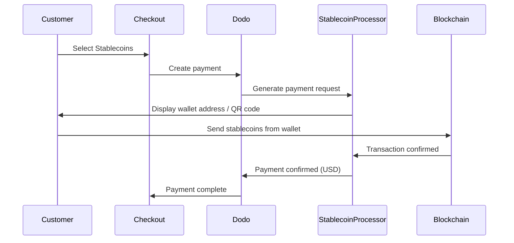

Stablecoin payments allow customers to pay using stablecoins from anywhere in the world (excluding India). Transactions are billed in USD, so you receive fiat currency while customers pay with their preferred stablecoin wallet.

## Why Offer Stablecoins?

<CardGroup cols={3}>
<Card title="Global Reach" icon="globe">
Accept payments from any country — no banking infrastructure required on the customer's side.
</Card>

<Card title="No Chargebacks" icon="shield-check">
Stablecoin transactions are irreversible, eliminating chargeback fraud entirely.
</Card>

<Card title="USD Settlement" icon="dollar-sign">
You receive USD — no need to manage volatility or wallets.
</Card>
</CardGroup>

## Overview

| Detail | Value |
| :----- | :---- |
| **Billing Currency** | USD |
| **Supported Countries** | Global (Excl. IN) |
| **Subscriptions** | No |
| **Min Amount** | $0.50 |
| **Settlement** | USD |

## How It Works



## Customer Experience

1. Customer selects Stablecoins at checkout
2. A wallet address and QR code are displayed with the amount in stablecoins
3. Customer sends the exact amount from their stablecoin wallet
4. Transaction is confirmed on the blockchain
5. Customer is redirected to the success page

<Info>
Stablecoin payments are billed in USD. The stablecoin amount displayed at checkout reflects the real-time exchange rate at the time of payment.
</Info>

## Supported Currencies & Networks

| Currency | Networks |
| :------- | :------- |
| **USDC** | Ethereum, Solana, Polygon, Base |
| **USDP** | Ethereum, Solana |
| **USDG** | Ethereum |

## Configuration

```javascript
const session = await client.checkoutSessions.create({
  product_cart: [{ product_id: 'prod_123', quantity: 1 }],
  allowed_payment_method_types: ['crypto_currency', 'credit', 'debit'],
  return_url: 'https://example.com/success'
});
```

## API Method Type

| Type | Method | Country |
| :--- | :----- | :------ |
| `crypto_currency` | Stablecoins | Global (Excl. IN) |

## Testing

<Steps>
<Step title="Enable test mode">
Use your Dodo Payments test API keys.
</Step>

<Step title="Create a test checkout">
Create a checkout session with `crypto_currency` in the allowed payment methods.
</Step>

<Step title="Complete the test flow">
Follow the simulated stablecoin payment flow in the test environment.
</Step>
</Steps>

## Best Practices

<AccordionGroup>
<Accordion title="Always include card fallbacks">
Not all customers have stablecoin wallets. Always include `credit` and `debit` as fallback payment methods.
</Accordion>

<Accordion title="Set clear expectations on confirmation time">
Blockchain confirmations can take minutes depending on the network. Ensure your checkout communicates this to customers.
</Accordion>

<Accordion title="Handle underpayments and overpayments">
Stablecoin payments may occasionally differ slightly from the exact amount due to network fees. Monitor webhooks for payment status updates.
</Accordion>
</AccordionGroup>

## Troubleshooting

<AccordionGroup>
<Accordion title="Stablecoins not appearing at checkout">
**Check:**
1. `crypto_currency` included in `allowed_payment_method_types`?
2. Transaction amount meets minimum ($0.50)?

**Solution:** Verify the payment method type is correctly passed in your API request.
</Accordion>

<Accordion title="Payment not confirming">
**Cause:** Blockchain confirmation times vary. Some networks take longer than others.

**Solution:** Wait for webhook confirmation. Do not treat the payment as failed until the confirmation window has passed.
</Accordion>

<Accordion title="Amount mismatch">
**Cause:** Network fees can cause the received amount to differ slightly from the requested amount.

**Solution:** Monitor webhooks for the final confirmed amount. Small discrepancies are handled automatically.
</Accordion>
</AccordionGroup>

## Related Pages

<CardGroup cols={2}>
<Card title="Payment Methods Overview" icon="credit-card" href="/features/payment-methods">
See all supported payment methods.
</Card>

<Card title="Checkout Guide" icon="book" href="/developer-resources/checkout-session">
Complete checkout implementation guide.
</Card>

<Card title="Webhooks" icon="webhook" href="/developer-resources/webhooks">
Handle payment confirmations asynchronously.
</Card>

<Card title="Testing Process" icon="flask" href="/miscellaneous/testing-process">
Complete testing guide for all payment methods.
</Card>
</CardGroup>
