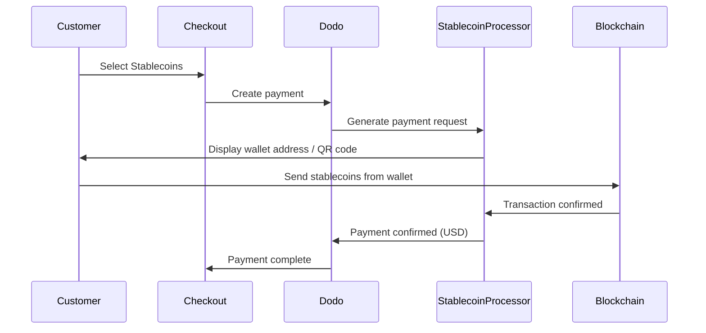

Los pagos con stablecoins permiten a los clientes pagar usando stablecoins desde cualquier parte del mundo (excepto India). Las transacciones se facturan en USD, por lo que recibes moneda fiat mientras los clientes pagan con su wallet de stablecoins preferida.

## ¿Por qué ofrecer stablecoins?

<CardGroup cols={3}>
<Card title="Global Reach" icon="globe">
Acepta pagos desde cualquier país, sin necesidad de infraestructura bancaria por parte del cliente.
</Card>

<Card title="No Chargebacks" icon="shield-check">
Las transacciones con stablecoins son irreversibles, lo que elimina por completo el fraude por contracargos.
</Card>

<Card title="USD Settlement" icon="dollar-sign">
Recibes USD, sin necesidad de gestionar la volatilidad ni las wallets.
</Card>
</CardGroup>

## Descripción general

| Detalle | Valor |
| :----- | :---- |
| **Moneda de facturación** | USD |
| **Países compatibles** | Global (excepto IN) |
| **Suscripciones** | No |
| **Importe mínimo** | $0.50 |
| **Liquidación** | USD |

## Cómo funciona



## Experiencia del cliente

1. El cliente selecciona Stablecoins en el checkout
2. Se muestran una dirección de wallet y un código QR con el importe en stablecoins
3. El cliente envía el importe exacto desde su wallet de stablecoins
4. La transacción se confirma en la blockchain
5. El cliente es redirigido a la página de éxito

<Info>
Los pagos con stablecoins se facturan en USD. El importe en stablecoins que se muestra en el checkout refleja el tipo de cambio en tiempo real en el momento del pago.
</Info>

## Monedas y redes compatibles

| Moneda | Redes |
| :------- | :------- |
| **USDC** | Ethereum, Solana, Polygon, Base |
| **USDP** | Ethereum, Solana |
| **USDG** | Ethereum |

## Configuración

```javascript
const session = await client.checkoutSessions.create({
  product_cart: [{ product_id: 'prod_123', quantity: 1 }],
  allowed_payment_method_types: ['crypto_currency', 'credit', 'debit'],
  return_url: 'https://example.com/success'
});
```

## Tipo de método de API

| Tipo | Método | País |
| :--- | :----- | :------ |
| `crypto_currency` | Stablecoins | Global (excepto IN) |

## Pruebas

<Steps>
<Step title="Enable test mode">
Usa tus claves de API de prueba de Dodo Payments.
</Step>

<Step title="Create a test checkout">
Crea una sesión de checkout con `crypto_currency` en los métodos de pago permitidos.
</Step>

<Step title="Complete the test flow">
Sigue el flujo de pago simulado con stablecoins en el entorno de prueba.
</Step>
</Steps>

## Mejores prácticas

<AccordionGroup>
<Accordion title="Always include card fallbacks">
No todos los clientes tienen wallets de stablecoins. Incluye siempre `credit` y `debit` como métodos de pago alternativos.
</Accordion>

<Accordion title="Set clear expectations on confirmation time">
Las confirmaciones de la blockchain pueden tardar varios minutos, según la red. Asegúrate de que tu checkout comunique esto a los clientes.
</Accordion>

<Accordion title="Handle underpayments and overpayments">
En ocasiones, los pagos con stablecoins pueden diferir ligeramente del importe exacto debido a las comisiones de red. Supervisa los webhooks para consultar las actualizaciones del estado del pago.
</Accordion>
</AccordionGroup>

## Solución de problemas

<AccordionGroup>
<Accordion title="Stablecoins not appearing at checkout">
**Comprobar:**
1. ¿Se incluyó `crypto_currency` en `allowed_payment_method_types`?
2. ¿El importe de la transacción cumple el mínimo ($0.50)?

**Solución:** Verifica que el tipo de método de pago se envíe correctamente en tu solicitud de API.
</Accordion>

<Accordion title="Payment not confirming">
**Causa:** Los tiempos de confirmación de la blockchain varían. Algunas redes tardan más que otras.

**Solución:** Espera la confirmación del webhook. No marques el pago como fallido hasta que haya transcurrido el periodo de confirmación.
</Accordion>

<Accordion title="Amount mismatch">
**Causa:** Las comisiones de red pueden hacer que el importe recibido difiera ligeramente del importe solicitado.

**Solución:** Supervisa los webhooks para consultar el importe final confirmado. Las pequeñas discrepancias se gestionan automáticamente.
</Accordion>
</AccordionGroup>

## Páginas relacionadas

<CardGroup cols={2}>
<Card title="Payment Methods Overview" icon="credit-card" href="/features/payment-methods">
Consulta todos los métodos de pago compatibles.
</Card>

<Card title="Checkout Guide" icon="book" href="/developer-resources/checkout-session">
Guía completa de implementación del checkout.
</Card>

<Card title="Webhooks" icon="webhook" href="/developer-resources/webhooks">
Gestiona las confirmaciones de pago de forma asíncrona.
</Card>

<Card title="Testing Process" icon="flask" href="/miscellaneous/testing-process">
Guía completa de pruebas para todos los métodos de pago.
</Card>
</CardGroup>
