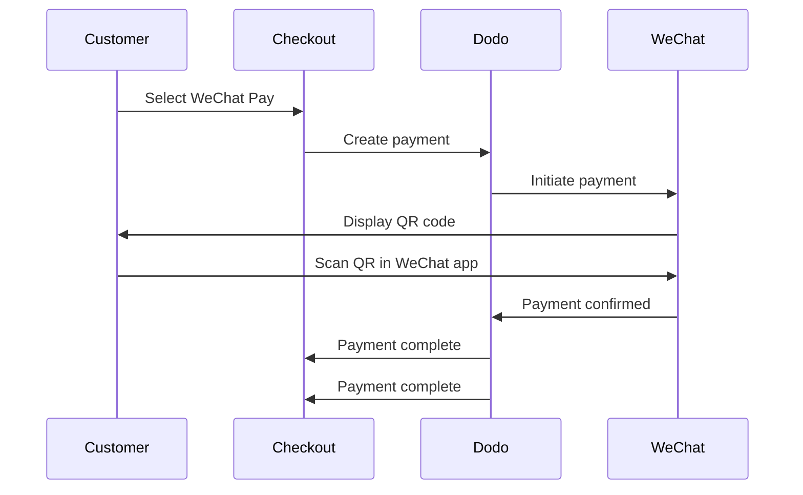

WeChat Pay es una de las dos plataformas de pago móvil dominantes en China, utilizada por más de mil millones de personas. Permite pagos mediante códigos QR dentro de la app de WeChat, haciéndolo esencial para negocios que se dirigen a consumidores chinos.

## ¿Por qué Ofrecer WeChat Pay?

<CardGroup cols={3}>
<Card title="1B+ Users" icon="users">
WeChat Pay es utilizado por más de mil millones de personas, convirtiéndolo en una de las plataformas de pago más grandes del mundo.
</Card>

<Card title="Mobile-First" icon="mobile">
Los pagos se completan completamente dentro de la app de WeChat — rápido, familiar y sin fricciones para los clientes chinos.
</Card>

<Card title="Dual Currency" icon="money-bill-transfer">
Acepta pagos tanto en USD como en CNY, brindando flexibilidad para transacciones transfronterizas y domésticas.
</Card>
</CardGroup>

## Resumen

| Detalle | Valor |
| :----- | :---- |
| **Moneda de Facturación** | USD, CNY |
| **Suscripciones** | No |
| **Monto Mínimo** | $0.50 / ¥1.00 |
| **Liquidación** | USD |

## ¿Cómo Funciona?



## Experiencia del Cliente

1. El cliente selecciona WeChat Pay al realizar el pago
2. Se muestra un código QR en la página de pago
3. El cliente abre WeChat en su teléfono y escanea el código QR
4. El cliente confirma el pago en la app de WeChat
5. El pago se confirma instantáneamente y el cliente es redirigido a la página de éxito

<Info>
Los clientes pagan en USD o CNY, y recibes la liquidación en USD.
</Info>

## Configuración

```javascript
const session = await client.checkoutSessions.create({
  product_cart: [{ product_id: 'prod_123', quantity: 1 }],
  allowed_payment_method_types: ['wechat_pay', 'credit', 'debit'],
  return_url: 'https://example.com/success'
});
```

## Tipo de Método API

| Tipo | Método | Monedas |
| :--- | :----- | :--------- |
| `wechat_pay` | WeChat Pay | USD, CNY |

## Pruebas

<Steps>
<Step title="Enable test mode">
Usa tus claves de prueba de la API de Dodo Payments.
</Step>

<Step title="Create a test checkout">
Crea una sesión de pago con `wechat_pay` en los métodos de pago permitidos.
</Step>

<Step title="Scan the QR code">
Se generará un código QR de prueba — escanéalo con la cámara normal de tu teléfono (no se necesita la app de WeChat). Serás redirigido a una página de prueba donde puedes simular la transacción como éxito o fracaso.
</Step>
</Steps>

## Mejores Prácticas

<AccordionGroup>
<Accordion title="Target Chinese customers">
WeChat Pay es utilizado principalmente por consumidores chinos. Inclúyelo cuando tu base de clientes incluya compradores chinos o estés dirigido al mercado chino.
</Accordion>

<Accordion title="Always include card fallbacks">
No todos los clientes tienen WeChat. Siempre incluye `credit` e `debit` como métodos de pago alternativos.
</Accordion>

<Accordion title="Optimize for mobile">
Muchos usuarios de WeChat Pay navegan en móviles. Asegúrate de que tu página de pago sea responsiva — el escaneo de código QR funciona mejor cuando el pago se muestra en un ordenador de escritorio o tableta mientras el cliente escanea con su teléfono.
</Accordion>

<Accordion title="Consider both currencies">
WeChat Pay soporta tanto USD como CNY. Elige la moneda de facturación que mejor se adapte a tu mercado objetivo — USD para transacciones transfronterizas, CNY para transacciones domésticas en China.
</Accordion>
</AccordionGroup>

## Resolución de Problemas

<AccordionGroup>
<Accordion title="WeChat Pay not appearing at checkout">
**Verifica:**
1. ¿`wechat_pay` incluido en `allowed_payment_method_types`?
2. ¿Moneda de facturación configurada en USD o CNY?
3. ¿Monto de la transacción cumple con el mínimo?

**Solución:** Verifica que el tipo de método de pago y la moneda se pasen correctamente en tu solicitud API.
</Accordion>

<Accordion title="QR code not scanning">
**Causa:** El código QR puede haber expirado o la versión de WeChat del cliente está desactualizada.

**Solución:** Actualiza la página de pago para generar un nuevo código QR. Asegúrate de que el cliente esté usando una versión actual de WeChat.
</Accordion>

<Accordion title="Payment not confirming">
**Causa:** WeChat Pay normalmente confirma al instante, pero pueden ocurrir retrasos en la red.

**Solución:** Monitorea los webhooks para la confirmación del pago. Si el pago no se confirma dentro de unos minutos, el cliente puede necesitar intentar de nuevo.
</Accordion>
</AccordionGroup>

## Páginas Relacionadas

<CardGroup cols={2}>
<Card title="Payment Methods Overview" icon="credit-card" href="/features/payment-methods">
Ver todos los métodos de pago soportados.
</Card>

<Card title="Checkout Guide" icon="book" href="/developer-resources/checkout-session">
Guía completa de implementación del pago.
</Card>

<Card title="Webhooks" icon="webhook" href="/developer-resources/webhooks">
Maneja las confirmaciones de pago de forma asincrónica.
</Card>

<Card title="Testing Process" icon="flask" href="/miscellaneous/testing-process">
Guía completa de pruebas para todos los métodos de pago.
</Card>
</CardGroup>
