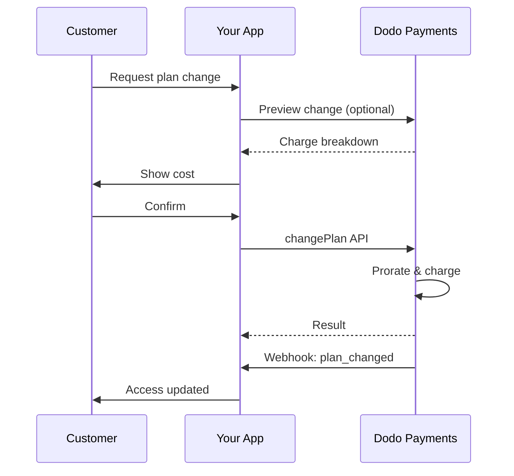
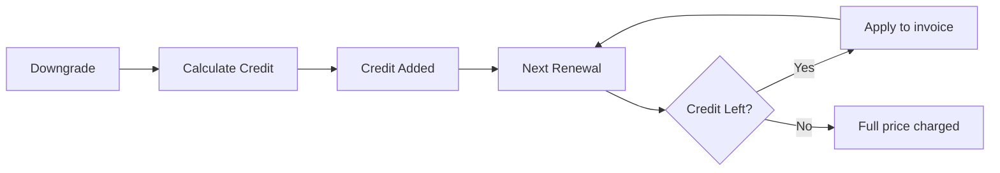
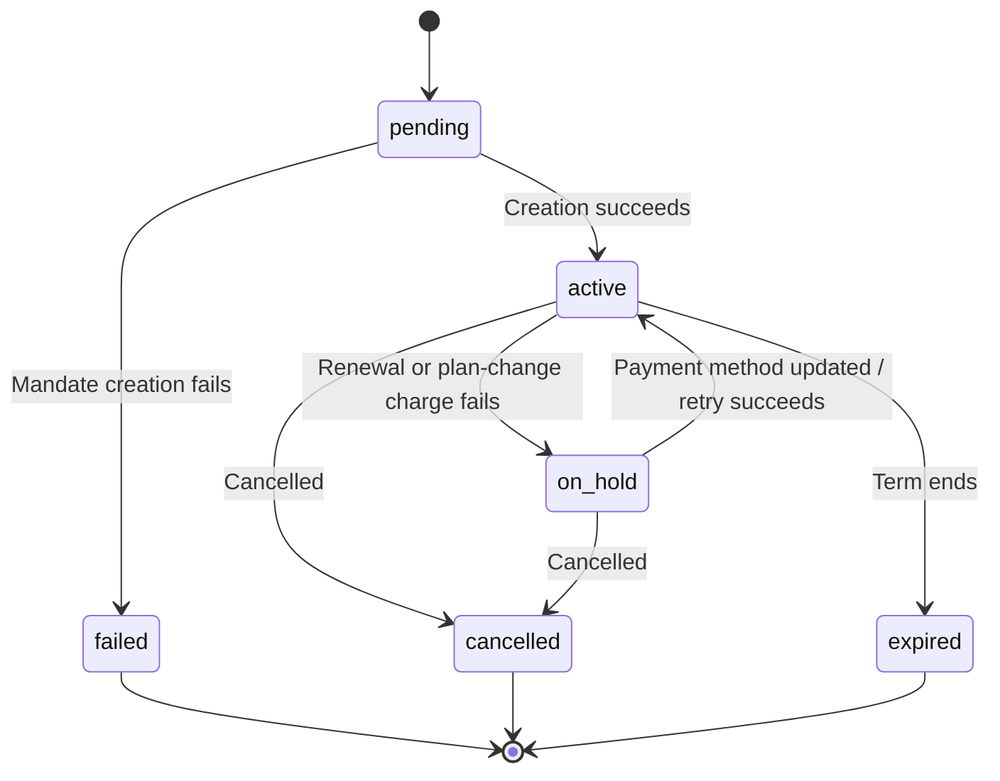

<Info>
Subscriptions let you sell ongoing access with automated renewals. Use flexible billing cycles, free trials, plan changes, and add‑ons to tailor pricing for each customer.
</Info>

<CardGroup cols={2}>
<Card title="Upgrade & Downgrade" icon="repeat" href="/developer-resources/subscription-upgrade-downgrade">
Control plan changes with proration and quantity updates.
</Card>

<Card title="On‑Demand Subscriptions" icon="bolt" href="/developer-resources/ondemand-subscriptions">
Authorize a mandate now and charge later with custom amounts.
</Card>

<Card title="Customer Portal" icon="id-card" href="/features/customer-portal">
Let customers manage plans, billing, and cancellations.
</Card>

<Card title="Subscription Webhooks" icon="code" href="/developer-resources/webhooks/intents/subscription">
React to lifecycle events like created, renewed, and canceled.
</Card>
</CardGroup>

## What Are Subscriptions?

Subscriptions are recurring products customers purchase on a schedule. They’re ideal for:

- **SaaS licenses**: Apps, APIs, or platform access
- **Memberships**: Communities, programs, or clubs
- **Digital content**: Courses, media, or premium content
- **Support plans**: SLAs, success packages, or maintenance

## Key Benefits

- **Predictable revenue**: Recurring billing with automated renewals
- **Flexible cycles**: Monthly, annual, custom intervals, and trials
- **Plan agility**: Proration for upgrades and downgrades
- **Add‑ons and seats**: Attach optional, quantifiable upgrades
- **Seamless checkout**: Hosted checkout and customer portal
- **Developer-first**: Clear APIs for creation, changes, and usage tracking

## Creating Subscriptions

Create subscription products in your Dodo Payments dashboard, then sell them through checkout or your API. Separating products from active subscriptions lets you version pricing, attach add‑ons, and track performance independently.

### Subscription product creation

Configure the fields in the dashboard to define how your subscription sells, renews, and bills. The sections below map directly to what you see in the creation form.

#### Product details

- **Product Name** (required): The display name shown in checkout, customer portal, and invoices.
- **Product Description** (required): A clear value statement that appears in checkout and invoices.
- **Product Image** (required): PNG/JPG/WebP up to 3 MB. Used on checkout and invoices.
- **Brand**: Associate the product with a specific brand for theming and emails.
- **Tax Category** (required): Choose the category (for example, SaaS) to determine tax rules.

<Tip>
Pick the most accurate tax category to ensure correct tax collection per region.
</Tip>

#### Pricing

- **Tipo de precio**: Elige <b>Subscription</b> (esta guía). Las alternativas son Single Payment y Usage Based Billing.
- **Precio** (obligatorio): Precio recurrente base con moneda. El precio debe ser de al menos **$1** (o el equivalente en la moneda elegida). No se admiten importes inferiores a este mínimo y la suscripción no funcionará.
- **Descuento aplicable (%)**: Descuento porcentual opcional aplicado al precio base; se refleja en el checkout y las facturas.
- **Repetir pago cada** (obligatorio): Intervalo de las renovaciones, por ejemplo, cada 1 Month. Selecciona la frecuencia (meses o años) y la cantidad.
- **Periodo de suscripción** (obligatorio): Plazo total durante el que la suscripción permanece activa (por ejemplo, 10 Years). Una vez finalizado este periodo, las renovaciones se detienen salvo que se amplíe.
- **Días del periodo de prueba** (obligatorio): Define la duración de la prueba en días. Usa 0 para desactivar las pruebas. El primer cobro se realiza automáticamente cuando termina la prueba.
- **Importe de prueba**: Cargo inicial opcional para una prueba de pago. Déjalo sin establecer para una prueba gratuita. Consulta [Pruebas de pago](#paid-trials).
- **Seleccionar complemento**: Añade hasta 10 complementos que los clientes pueden comprar junto con el plan base.

<Warning>
Changing pricing on an active product affects new purchases. Existing subscriptions follow your plan‑change and proration settings.
</Warning>

<Info>
Add‑ons are ideal for quantifiable extras such as seats or storage. You can control allowed quantities and proration behavior when customers change them.
</Info>

#### Advanced settings

- **Tax Inclusive Pricing**: Display prices inclusive of applicable taxes. Final tax calculation still varies by customer location.
- **Generate license keys**: Issue a unique key to each customer after purchase. See the <a href="/features/license-keys">License Keys</a> guide.
- **Digital Product Delivery**: Deliver files or content automatically after purchase. Learn more in <a href="/features/digital-product-delivery">Digital Product Delivery</a>.
- **Metadata**: Attach custom key–value pairs for internal tagging or client integrations. See <a href="/api-reference/metadata">Metadata</a>.

<Tip>
Use metadata to store identifiers from your system (e.g., accountId) so you can reconcile events and invoices later.
</Tip>

## Subscription Trials

Las pruebas permiten a los clientes evaluar una suscripción antes de pagar el precio recurrente completo. Una prueba puede ser **gratuita**, sin ningún cargo hasta que finalice, o **de pago**, con un importe reducido cobrado por adelantado. En ambos casos, el precio completo comienza en la primera renovación después de que termina la prueba.

### Configuring Trials

Set **Trial Period Days** in the product pricing section (use `0` to disable). You can override this when creating subscriptions:

```typescript
// Via subscription creation
const subscription = await client.subscriptions.create({
  customer: { customer_id: 'cus_123' },
  billing: { country: 'US' },
  product_id: 'pdt_monthly',
  quantity: 1,
  trial_period_days: 14  // Overrides product's trial period
});

// Via checkout session
const session = await client.checkoutSessions.create({
  product_cart: [{ product_id: 'pdt_monthly', quantity: 1 }],
  subscription_data: { trial_period_days: 14 }
});
```

<Warning>
The `trial_period_days` value must be between 0 and 10,000 days.
</Warning>

### Pruebas de pago

Las pruebas no tienen que ser gratuitas. Define un **Importe de prueba** en el precio recurrente de un producto de suscripción para cobrar una tarifa inicial reducida durante el periodo de prueba. El precio recurrente completo se aplica en la primera renovación.

<Frame>

</Frame>

Las pruebas de pago se configuran en el precio del producto, no por suscripción ni por sesión de checkout:

| Campo | Tipo | Descripción |
|-------|------|-------------|
| `trial_amount` | entero | Importe cobrado hoy por la prueba, en las unidades menores de la moneda del precio (por ejemplo, `500` para $5.00). Requiere `trial_period_days > 0`. Omítelo o establécelo en `null` para una prueba gratuita. |
| `trial_apply_discounts` | booleano | Indica si los códigos de descuento del checkout reducen el cargo de la prueba. El valor predeterminado es `false`, por lo que el importe de prueba se cobra íntegramente incluso cuando se aplica un descuento al precio recurrente. |

```typescript
const product = await client.products.create({
  name: 'Pro Plan',
  tax_category: 'saas',
  price: {
    type: 'recurring_price',
    price: 2900,                      // $29.00 per month after the trial
    currency: 'USD',
    discount: 0,
    purchasing_power_parity: false,
    payment_frequency_count: 1,
    payment_frequency_interval: 'Month',
    subscription_period_count: 1,
    subscription_period_interval: 'Year',
    trial_period_days: 14,            // A paid trial requires a positive trial period
    trial_amount: 500,                // $5.00 charged today
    trial_apply_discounts: false      // Discounts apply to the recurring price only
  }
});
```

Las pruebas de pago también pasan por el checkout. El importe de prueba está sujeto a impuestos, aparece en los cálculos de la sesión de checkout y en los precios de los payment links, y se aplica el recargo de Adaptive Currency por moneda. El [endpoint de vista previa](/developer-resources/checkout-session) devuelve `trial_amount` y `trial_period_days` para que puedas mostrar el importe adeudado hoy antes de crear la suscripción.

<Info>
Las pruebas gratuitas no cambian. Dejar **Importe de prueba** sin establecer mantiene el comportamiento existente: el primer cargo es `0` y el precio completo se cobra cuando termina la prueba.
</Info>

### Prevención del uso indebido de pruebas

**Prevenir el uso indebido de pruebas** impide que los clientes reclamen pruebas repetidamente para el mismo negocio. Cuando está activado, un cliente que ya haya canjeado una prueba pasa automáticamente a una **compra de pago sin prueba**, en lugar de recibir una prueba nueva.

<Frame>

</Frame>

Actívalo desde la pestaña **Subscriptions** en **Settings**. Una vez activado:

- Los clientes se comparan mediante un **correo electrónico normalizado**, eliminando los alias con signo más, por lo que `user+trial@example.com` y `user@example.com` se consideran la misma persona.
- Los canjes se registran en la **activación de la prueba**, por lo que un cliente que cancele el mismo día igualmente habrá consumido su prueba.
- Los clientes existentes se incorporan usando sus pruebas históricas por correo electrónico, de modo que los usuarios de pruebas anteriores se reconocen inmediatamente.

<Info>
La configuración está **desactivada de forma predeterminada**. Consulta [Configuración de suscripciones](/features/product-collections#subscription-settings) para ver la lista completa de controles de suscripciones a nivel empresarial.
</Info>

### Detección del estado de una prueba

<Warning>
Actualmente no existe ningún campo directo para detectar el estado de una prueba. La siguiente es una solución alternativa que requiere consultar los pagos, lo cual resulta ineficiente. Estamos trabajando en una solución más eficiente.
</Warning>

Para determinar si una suscripción de **prueba gratuita** está en periodo de prueba, recupera la lista de pagos de la suscripción. Si existe exactamente un pago con importe 0, la suscripción está en periodo de prueba:

```typescript
const subscription = await client.subscriptions.retrieve('sub_123');
const payments = await client.payments.list({
  subscription_id: subscription.subscription_id
});

// Check if subscription is in trial
const isInTrial = payments.items.length === 1 && 
                  payments.items[0].total_amount === 0;
```

<Warning>
Esta comprobación de importe cero solo funciona para pruebas gratuitas. En una [prueba de pago](#paid-trials), el primer pago equivale al importe de prueba, no a `0`. Compara el primer pago con `trial_amount` de la suscripción o comprueba si `next_billing_date` sigue dentro del periodo de prueba.
</Warning>

### Actualización del periodo de prueba

Amplía la prueba actualizando `next_billing_date`:

```typescript
await client.subscriptions.update('sub_123', {
  next_billing_date: '2025-02-15T00:00:00Z'  // New trial end date
});
```

<Warning>
No puedes establecer `next_billing_date` en un momento pasado. La fecha debe estar en el futuro.
</Warning>

## Cambios del plan de suscripción

Los cambios de plan permiten mejorar o reducir suscripciones, ajustar cantidades o migrar a productos diferentes. Según el modo de prorrateo que selecciones, un cambio puede activar un cargo inmediato, crear un crédito o no aplicar ningún ajuste de facturación.

<Tip>
Puedes cambiar los planes de suscripción y actualizar directamente la próxima fecha de facturación desde el dashboard de Dodo Payments. Esto ofrece una forma rápida de ajustar las suscripciones para solicitudes de soporte, mejoras promocionales o migraciones de plan sin realizar llamadas a la API.
</Tip>

<Tip>
**Activar cambios de plan de autoservicio:** ¿Quieres que los clientes mejoren o reduzcan sus propias suscripciones mediante el Customer Portal? Añade tus productos de suscripción a una colección de productos y activa "Allow Subscription Updates" en la configuración de suscripciones.
</Tip>



<Card title="Product Collections" icon="layer-group" href="/features/product-collections">
  Agrupa productos relacionados en colecciones para habilitar rutas fluidas de mejora y reducción en el Customer Portal.
</Card>

### Modos de prorrateo

Elige cómo se factura a los clientes cuando cambian de plan:

<Info>
**Comparación rápida de los cuatro modos de prorrateo:**

| | `prorated_immediately` | `difference_immediately` | `full_immediately` | `do_not_bill` |
|---|---|---|---|---|
| **Mejora** | Cargo prorrateado por los días restantes | Se cobra la diferencia total de precio | Se cobra el precio completo del nuevo plan | Sin cargo: cambio inmediato |
| **Reducción** | Crédito prorrateado por los días restantes | Diferencia total de precio como crédito | Sin crédito, cargo completo | Sin crédito: cambio inmediato |
| **Ciclo de facturación** | Se reinicia hoy | Se reinicia hoy | Se reinicia hoy | Se mantiene igual |
| **Ideal para** | Facturación justa basada en el tiempo | Cambios de nivel sencillos | Reinicios del ciclo de facturación | Migraciones gratuitas o cambios de cortesía |
</Info>

#### `prorated_immediately`
Cobra un importe prorrateado según el tiempo restante del ciclo de facturación actual. Ideal para una facturación justa que tenga en cuenta el tiempo no utilizado.

```typescript
await client.subscriptions.changePlan('sub_123', {
  product_id: 'pdt_pro',
  quantity: 1,
  proration_billing_mode: 'prorated_immediately'
});
```

#### `difference_immediately`
Cobra inmediatamente la diferencia de precio (mejora) o añade crédito para futuras renovaciones (reducción). Ideal para situaciones sencillas de mejora o reducción.

```typescript
// Upgrade: charges $50 (difference between $30 and $80)
// Downgrade: credits remaining value, auto-applied to renewals
await client.subscriptions.changePlan('sub_123', {
  product_id: 'pdt_pro',
  quantity: 1,
  proration_billing_mode: 'difference_immediately'
});
```

<Info>
Los créditos de las reducciones que usan `difference_immediately` están vinculados al ámbito de la suscripción y se aplican automáticamente a futuras renovaciones. Son distintos de las ventajas de <a href="/features/credit-based-billing">Credit-Based Billing</a>.
</Info>

Cuando un cliente reduce su plan con `difference_immediately`, el valor no utilizado se convierte en un crédito vinculado a la suscripción que compensa automáticamente futuras renovaciones:



#### `full_immediately`
Cobra inmediatamente el importe completo del nuevo plan, ignorando el tiempo restante. Ideal para reiniciar los ciclos de facturación.

```typescript
await client.subscriptions.changePlan('sub_123', {
  product_id: 'pdt_monthly',
  quantity: 1,
  proration_billing_mode: 'full_immediately'
});
```

#### `do_not_bill`
Cambia al nuevo plan sin ningún ajuste de facturación. No hay cargos de prorrateo ni créditos: el cliente simplemente pasa al nuevo plan. Ideal para migraciones de cortesía, cambios a planes gratuitos o situaciones en las que quieras asumir la diferencia de coste.

```typescript
await client.subscriptions.changePlan('sub_123', {
  product_id: 'pdt_new_plan',
  quantity: 1,
  proration_billing_mode: 'do_not_bill'
});
```

<AccordionGroup>
<Accordion title="Example: Prorated upgrade calculation">

**Escenario**: Un cliente del plan Basic ($30/mes) mejora a Pro ($80/mes) el día 16 de un ciclo de 30 días usando `prorated_immediately`.

```
Unused credit from Basic = $30 × (15 remaining / 30 total) = $15.00
Prorated cost of Pro     = $80 × (15 remaining / 30 total) = $40.00
────────────────────────────────────────────────────────────────────
Immediate charge         = $40.00 − $15.00 = $25.00
```

Próxima renovación el **15 de febrero** (16 de enero + 30 días): **$80.00/mes**.

<Tip>
Para ver ejemplos de cálculo más detallados y casos límite, consulta nuestra [guía completa de mejoras y reducciones](/developer-resources/subscription-upgrade-downgrade).
</Tip>

</Accordion>
<Accordion title="Example: Downgrade credit calculation">

**Escenario**: Un cliente del plan Pro ($80/mes) reduce a Starter ($20/mes) usando `difference_immediately`.

```
Credit = Old plan − New plan = $80 − $20 = $60.00
```

El crédito de $60 se aplica automáticamente a futuras renovaciones:
- Renovación 1: $20 − $20 (crédito) = **$0.00** (quedan $40 de crédito)
- Renovación 2: $20 − $20 (crédito) = **$0.00** (quedan $20 de crédito)  
- Renovación 3: $20 − $20 (crédito) = **$0.00** (crédito agotado)
- Renovación 4: **$20.00** (precio completo)

<Info>
Obtén más información sobre la gestión de créditos en la [guía de mejoras y reducciones](/developer-resources/subscription-upgrade-downgrade).
</Info>

</Accordion>
</AccordionGroup>

### Cambiar de plan con complementos

Modifica los complementos al cambiar de plan. Los complementos se incluyen en los cálculos de prorrateo:

```typescript
await client.subscriptions.changePlan('sub_123', {
  product_id: 'pdt_pro',
  quantity: 1,
  proration_billing_mode: 'difference_immediately',
  addons: [{ addon_id: 'addon_extra_seats', quantity: 2 }]  // Add add-ons
  // addons: []  // Empty array removes all existing add-ons
});
```

<Info>
De forma predeterminada (`effective_at: 'immediately'`), los cambios de plan generan cargos inmediatos. Pasa `effective_at: 'next_billing_date'` para programar el cambio para la próxima fecha de facturación; el cambio pendiente se devuelve en la suscripción como `scheduled_change`, y puedes cancelarlo con [Cancelar cambio de plan programado](/api-reference/subscriptions/cancel-change-plan). Los cargos fallidos pueden cambiar la suscripción al estado `on_hold`, a menos que pases `on_payment_failure: 'prevent_change'`, lo que mantiene la suscripción en su plan actual hasta que el pago se complete correctamente. Realiza un seguimiento de los cambios mediante eventos de webhook `subscription.plan_changed`.
</Info>

### Vista previa de los cambios de plan

Antes de confirmar un cambio de plan, previsualiza el cargo exacto y la suscripción resultante:

```typescript
const preview = await client.subscriptions.previewChangePlan('sub_123', {
  product_id: 'pdt_pro',
  quantity: 1,
  proration_billing_mode: 'prorated_immediately'
});

// Show customer the charge before confirming
console.log('You will be charged:', preview.immediate_charge.summary);
```

<Card title="Preview Change Plan API" icon="eye" href="/api-reference/subscriptions/preview-change-plan">
  Previsualiza los cambios de plan antes de confirmarlos.
</Card>

## Estados de la suscripción

Una suscripción pasa por un conjunto definido de estados durante su vida útil. Esta tabla sirve de referencia para cada estado, qué lo provoca y cómo (o si) puedes recuperarlo.

| Estado | Significado | ¿Se puede recuperar? | Ruta de recuperación / siguiente paso |
|--------|---------------|--------------|---------------------------|
| `pending` | La suscripción se está creando o procesando | — | Espera a `subscription.active` (o `subscription.failed`) |
| `active` | La suscripción está activa y se renovará automáticamente | — | No se requiere ninguna acción |
| `on_hold` | Un pago de renovación (o un cargo por cambio de plan) falló; la suscripción está pausada | **Sí** | Actualiza el método de pago para reactivarla, automáticamente mediante [Reintentos de pago](/features/recovery/payment-retries) y [Gestión de impagos](/features/recovery/subscription-dunning), o manualmente mediante la [API de actualización del método de pago](/api-reference/subscriptions/update-payment-method) |
| `cancelled` | La suscripción se canceló y no se renovará | Solo se puede volver a comprar | El cliente debe iniciar una suscripción nueva; [Dunning](/features/recovery/subscription-dunning) puede solicitar una nueva compra |
| `failed` | La **creación** de la suscripción falló (el mandato o pago inicial no se realizó correctamente) | **No: terminal** | El cliente debe crear una suscripción nueva con un método de pago válido |
| `expired` | La suscripción llegó al final de su plazo | — | El cliente debe iniciar una suscripción nueva si lo desea |

<Warning>
`on_hold` y `failed` suelen confundirse. `on_hold` es un estado **recuperable** para una suscripción ya activa cuya renovación falló. `failed` es un estado **terminal** que solo ocurre cuando falla la **creación inicial** de la suscripción; no se puede reactivar.
</Warning>

### Máquina de estados



### Estado en espera

Una suscripción entra en el estado `on_hold` cuando:

- Falla un pago de renovación (fondos insuficientes, tarjeta caducada, etc.)
- Falla un cargo por cambio de plan
- Falla la autorización del método de pago

<Warning>
Cuando una suscripción está en el estado `on_hold`, no se renovará automáticamente. Debes actualizar el método de pago para reactivarla.
</Warning>

### Reactivación desde el estado en espera

Para reactivar una suscripción desde el estado `on_hold`, actualiza el método de pago. Esto automáticamente:

1. Crea un cargo por las cantidades pendientes
2. Genera una factura
3. Procesa el pago usando el nuevo método de pago
4. Reactiva la suscripción al estado `active` cuando el pago se realiza correctamente

```typescript
// Reactivate subscription from on_hold
const response = await client.subscriptions.updatePaymentMethod('sub_123', {
  payment_method: {
    type: 'new',
    return_url: 'https://example.com/return'
  }
});

// For on_hold subscriptions, a charge is automatically created
if (response.payment_id) {
  console.log('Charge created:', response.payment_id);
  // Redirect customer to response.payment_link to complete payment
  // Monitor webhooks for payment.succeeded and subscription.active
}
```

<Info>
Después de actualizar correctamente el método de pago de una suscripción `on_hold`, recibirás eventos de webhook `payment.succeeded` seguidos de `subscription.active`.
</Info>

### Eventos de webhook por transición

Cada transición emite un webhook para que puedas gestionar la lógica de las ventajas sin realizar consultas periódicas:

| Transición | Evento |
|------------|-------|
| Suscripción activada | `subscription.active` |
| Renovación exitosa | `subscription.renewed` |
| Renovación fallida → pausada | `subscription.on_hold` |
| Suscripción pausada | `subscription.paused` |
| Suscripción pausada reanudada | `subscription.unpaused` |
| Creación fallida | `subscription.failed` |
| Plan actualizado/rebajado | `subscription.plan_changed` |
| Cancelada | `subscription.cancelled` |
| Periodo finalizado | `subscription.expired` |
| Cualquier cambio en los campos | `subscription.updated` |

<Card title="Subscription Webhook Payloads" icon="webhook" href="/developer-resources/webhooks/intents/subscription">
Consulta el esquema completo de carga útil para los eventos del ciclo de vida de las suscripciones.
</Card>

## Gestión de API

<AccordionGroup>
<Accordion title="Create subscriptions">
Usa `POST /subscriptions` para crear suscripciones mediante programación a partir de productos, con pruebas y complementos opcionales.

<Card title="API Reference" icon="code" href="/api-reference/subscriptions/post-subscriptions">
Consulta la API de creación de suscripciones.
</Card>
</Accordion>

<Accordion title="Update subscriptions">
Usa `PATCH /subscriptions/{subscription_id}` para cancelar en la próxima fecha de facturación, ampliar el periodo de la suscripción, actualizar los datos de facturación o modificar los metadatos. Para cambiar la cantidad, usa [Change Plan API](/api-reference/subscriptions/change-plan); `PATCH` no acepta `quantity`.

<Card title="API Reference" icon="code" href="/api-reference/subscriptions/patch-subscriptions">
Descubre cómo actualizar los detalles de una suscripción.
</Card>
</Accordion>

<Accordion title="Change plans (proration)">
Cambia el producto activo y las cantidades con controles de prorrateo.

<Card title="API Reference" icon="code" href="/api-reference/subscriptions/change-plan">
Revisa las opciones de cambio de plan.
</Card>
</Accordion>

<Accordion title="On‑demand charges">
Para suscripciones bajo demanda, cobra importes específicos cuando sea necesario.

<Card title="API Reference" icon="code" href="/api-reference/subscriptions/create-charge">
Cobra una suscripción bajo demanda.
</Card>
</Accordion>

<Accordion title="List and retrieve">
Usa `GET /subscriptions` para listar todas las suscripciones y `GET /subscriptions/{id}` para recuperar una.

<Card title="API Reference" icon="code" href="/api-reference/subscriptions/get-subscriptions">
Consulta las API de listado y recuperación.
</Card>
</Accordion>

<Accordion title="Usage history">
Obtén el uso registrado para modelos de precios medidos o híbridos.

<Card title="API Reference" icon="code" href="/api-reference/subscriptions/get-usage-history">
Consulta la API del historial de uso.
</Card>
</Accordion>

<Accordion title="Update payment method">
Actualiza el método de pago de una suscripción. En las suscripciones activas, esto actualiza el método de pago para futuras renovaciones. En las suscripciones en estado `on_hold`, reactiva la suscripción creando un cargo por las cantidades pendientes.

Al generar un nuevo enlace de método de pago (el tipo de solicitud `New`), puedes pasar `allowed_payment_method_types` para restringir los métodos de pago que el cliente ve en esa página. Los clientes nunca verán un método que no esté en la lista, aunque incluir un método no garantiza que aparezca (la disponibilidad también depende de factores como la ubicación del cliente y la configuración de tu negocio).

<Card title="API Reference" icon="code" href="/api-reference/subscriptions/update-payment-method">
Descubre cómo actualizar métodos de pago y reactivar suscripciones.
</Card>
</Accordion>
</AccordionGroup>

## Casos de uso comunes

- **SaaS y API**: Acceso por niveles con complementos para puestos o uso
- **Contenido y medios**: Acceso mensual con pruebas introductorias
- **Planes de soporte B2B**: Contratos anuales con complementos de soporte premium
- **Herramientas y plugins**: Claves de licencia y versiones publicadas

## Ejemplos de integración

### Sesiones de checkout (suscripciones)
Al crear sesiones de checkout, incluye tu producto de suscripción y los complementos opcionales:

```typescript
const session = await client.checkoutSessions.create({
  product_cart: [
    {
      product_id: 'pdt_subscription',
      quantity: 1
    }
  ]
});
```

### Cambios de plan con prorrateo
Mejora o reduce una suscripción y controla el comportamiento del prorrateo:

```typescript
await client.subscriptions.changePlan('sub_123', {
  product_id: 'pdt_new',
  quantity: 1,
  proration_billing_mode: 'difference_immediately'
});
```

### Cancelar en la próxima fecha de facturación
Programa una cancelación que entre en vigor al final del periodo de facturación actual:

```typescript
await client.subscriptions.update('sub_123', {
  cancel_at_next_billing_date: true
});
```

### Amplía el periodo de la suscripción
Amplía la duración de una suscripción pasando un nuevo `subscription_period_count` y `subscription_period_interval` a `PATCH /subscriptions/{subscription_id}`. La fecha de vencimiento de la suscripción se vuelve a calcular a partir del nuevo recuento y intervalo; por ejemplo, para concederle a un cliente tiempo adicional en su plan actual:

```typescript
await client.subscriptions.update('sub_123', {
  subscription_period_count: 5,
  subscription_period_interval: 'Month'
});
```

<Note>
El periodo de una suscripción solo se puede **aumentar**, nunca acortar.
</Note>

### Suscripciones bajo demanda
Crea una suscripción bajo demanda y cobra más adelante según sea necesario:

```typescript
const onDemand = await client.subscriptions.create({
  customer: { customer_id: 'cus_123' },
  billing: { country: 'US' },
  product_id: 'pdt_on_demand',
  quantity: 1,
  on_demand: { mandate_only: true }
});

await client.subscriptions.charge(onDemand.subscription_id, {
  product_price: 4900,
  product_currency: 'USD',
  product_description: 'Extra usage for September'
});
```

### Actualizar el método de pago de una suscripción activa
Actualiza el método de pago de una suscripción activa:

```typescript
// Update with new payment method
const response = await client.subscriptions.updatePaymentMethod('sub_123', {
  payment_method: {
    type: 'new',
    return_url: 'https://example.com/return'
  }
});

// Or use existing payment method
await client.subscriptions.updatePaymentMethod('sub_123', {
  payment_method: {
    type: 'existing',
    payment_method_id: 'pm_abc123'
  }
});
```

### Reactivar una suscripción desde on_hold
Reactiva una suscripción que quedó en espera debido a un pago fallido:

```typescript
// Update payment method - automatically creates charge for remaining dues
const response = await client.subscriptions.updatePaymentMethod('sub_123', {
  payment_method: {
    type: 'new',
    return_url: 'https://example.com/return'
  }
});

if (response.payment_id) {
  // Charge created for remaining dues
  // Redirect customer to response.payment_link
  // Monitor webhooks: payment.succeeded → subscription.active
}
```

## Suscripciones con mandatos conformes con RBI

  Las suscripciones de UPI y tarjetas de India operan conforme a las normativas de RBI (Reserve Bank of India), con requisitos específicos para los mandatos:

  ### Límites de los mandatos

  El tipo y el importe del mandato dependen del cargo recurrente de tu suscripción:

  - **Cargos inferiores al umbral del mandato (₹15,000 de forma predeterminada):** Creamos un mandato bajo demanda por el importe del umbral. El importe de la suscripción se cobra periódicamente según la frecuencia de la suscripción, hasta el límite del mandato.
  - **Cargos iguales o superiores al umbral del mandato:** Creamos un mandato de suscripción (o un mandato bajo demanda) por el importe exacto de la suscripción.

  El umbral del mandato se puede configurar por merchant o por solicitud mediante `mandate_min_amount_inr_paise` (paise de INR). El importe registrado en el banco es `max(mandate_floor, billing_amount)`; por tanto, el umbral se convierte efectivamente en el límite de autorización que ve el cliente cuando la facturación es inferior.

Para obtener información detallada sobre los mandatos conformes con RBI y el umbral configurable de los mandatos para métodos de pago de India, consulta la página <a href="/features/payment-methods/india#configurable-mandate-floor">Métodos de pago de India</a>.

  ### Consideraciones sobre mejoras y reducciones

  **Importante:** Al mejorar o reducir suscripciones, considera detenidamente los límites de los mandatos:

  - Si una mejora o reducción da como resultado un importe de cargo superior a Rs 15,000 y supera el límite de pago bajo demanda existente, el cargo de la transacción puede fallar.
  - En esos casos, el cliente puede tener que actualizar su método de pago o volver a cambiar la suscripción para establecer un mandato nuevo con el límite correcto.

  ### Autorización para cargos de importe elevado

  Para cargos de suscripción de Rs 15,000 o más:

  - El banco solicitará al cliente que autorice la transacción.
  - Si el cliente no autoriza la transacción, esta fallará y la suscripción se pondrá **en espera**.

  ### Retraso de procesamiento de 48 horas

  **Cronología del procesamiento:** Los cargos recurrentes de las tarjetas de India y las suscripciones de UPI siguen un patrón de procesamiento específico:

  - Los cargos se **inician** en la fecha programada según la frecuencia de la suscripción.
  - La **deducción** real de la cuenta del cliente solo se produce después de **48 horas** desde el inicio del pago.
  - Esta ventana de 48 horas puede ampliarse hasta **2-3 horas adicionales** según las respuestas de la API del banco.

  ### Ventana de cancelación del mandato

  Durante la ventana de procesamiento de 48 horas:

  - Los clientes pueden cancelar el mandato mediante sus aplicaciones bancarias.
  - Si un cliente cancela el mandato durante este periodo, la suscripción permanecerá **activa** (es un caso límite específico de las suscripciones de tarjetas de India y UPI AutoPay).
  - Sin embargo, la deducción real puede fallar y, en ese caso, pondremos la suscripción **en espera**.

  **Gestión de casos límite:** Si proporcionas ventajas, créditos o uso de la suscripción a los clientes inmediatamente después de iniciar el cargo, debes gestionar correctamente esta ventana de 48 horas en tu aplicación. Considera lo siguiente:

  - Retrasar la activación de ventajas hasta la confirmación del pago
  - Implementar periodos de gracia o acceso temporal
  - Supervisar el estado de la suscripción para detectar cancelaciones de mandatos
  - Gestionar los estados de suscripción en espera en la lógica de tu aplicación

  <Tip>
  Supervisa los webhooks de suscripción para realizar un seguimiento de los cambios en el estado del pago y gestionar casos límite en los que los mandatos se cancelen durante la ventana de 48 horas.
  </Tip>

## Prácticas recomendadas

- **Comienza con niveles claros**: 2–3 planes con diferencias evidentes
- **Comunica los precios**: Muestra los totales, el prorrateo y la próxima renovación
- **Usa las pruebas con criterio**: Convierte clientes mediante la incorporación, no solo mediante el tiempo
- **Aprovecha los complementos**: Mantén sencillos los planes base y ofrece extras
- **Prueba los cambios**: Valida los cambios de plan y el prorrateo en modo de prueba

<Info>
Las suscripciones son una base flexible para los ingresos recurrentes. Empieza de forma sencilla, prueba exhaustivamente y realiza iteraciones según las métricas de adopción, abandono y expansión.
</Info>