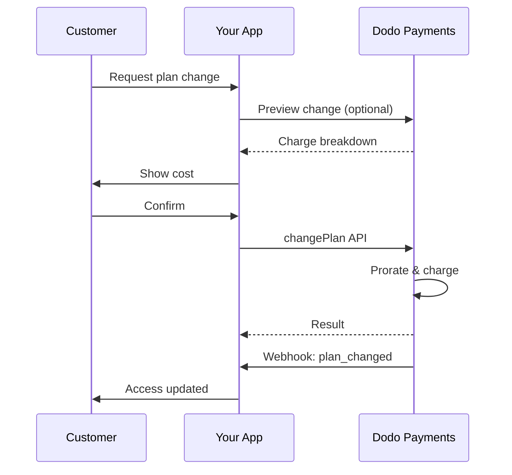
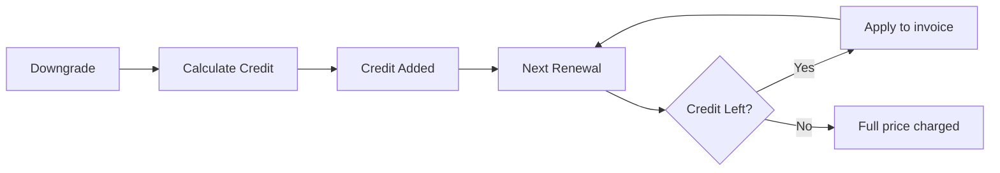
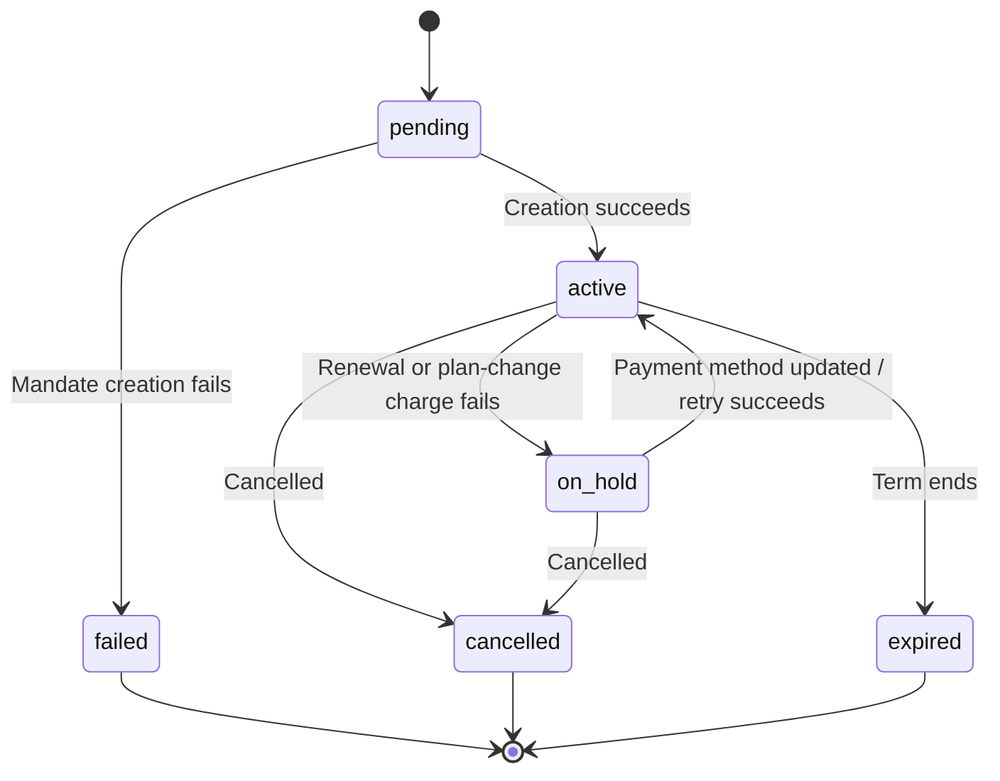

<Info>
Subscriptions let you sell ongoing access with automated renewals. Use flexible billing cycles, free trials, plan changes, and add‑ons to tailor pricing for each customer.
</Info>

<CardGroup cols={2}>
<Card title="Upgrade & Downgrade" icon="repeat" href="/developer-resources/subscription-upgrade-downgrade">
Control plan changes with proration and quantity updates.
</Card>

<Card title="On‑Demand Subscriptions" icon="bolt" href="/developer-resources/ondemand-subscriptions">
Authorize a mandate now and charge later with custom amounts.
</Card>

<Card title="Customer Portal" icon="id-card" href="/features/customer-portal">
Let customers manage plans, billing, and cancellations.
</Card>

<Card title="Subscription Webhooks" icon="code" href="/developer-resources/webhooks/intents/subscription">
React to lifecycle events like created, renewed, and canceled.
</Card>
</CardGroup>

## What Are Subscriptions?

Subscriptions are recurring products customers purchase on a schedule. They’re ideal for:

- **SaaS licenses**: Apps, APIs, or platform access
- **Memberships**: Communities, programs, or clubs
- **Digital content**: Courses, media, or premium content
- **Support plans**: SLAs, success packages, or maintenance

## Key Benefits

- **Predictable revenue**: Recurring billing with automated renewals
- **Flexible cycles**: Monthly, annual, custom intervals, and trials
- **Plan agility**: Proration for upgrades and downgrades
- **Add‑ons and seats**: Attach optional, quantifiable upgrades
- **Seamless checkout**: Hosted checkout and customer portal
- **Developer-first**: Clear APIs for creation, changes, and usage tracking

## Creating Subscriptions

Create subscription products in your Dodo Payments dashboard, then sell them through checkout or your API. Separating products from active subscriptions lets you version pricing, attach add‑ons, and track performance independently.

### Subscription product creation

Configure the fields in the dashboard to define how your subscription sells, renews, and bills. The sections below map directly to what you see in the creation form.

#### Product details

- **Product Name** (required): The display name shown in checkout, customer portal, and invoices.
- **Product Description** (required): A clear value statement that appears in checkout and invoices.
- **Product Image** (required): PNG/JPG/WebP up to 3 MB. Used on checkout and invoices.
- **Brand**: Associate the product with a specific brand for theming and emails.
- **Tax Category** (required): Choose the category (for example, SaaS) to determine tax rules.

<Tip>
Pick the most accurate tax category to ensure correct tax collection per region.
</Tip>

#### Pricing

- **Tipo de Precio**: Elija <b>Suscripción</b> (esta guía). Las alternativas son Pago Único y Facturación Basada en Uso.
- **Precio** (requerido): Precio base recurrente con moneda. El precio debe ser al menos **$1** (o el equivalente en la moneda elegida). Los importes por debajo de este mínimo no son compatibles y la suscripción no funcionará.
- **Descuento Aplicable (%)**: Descuento porcentual opcional aplicado al precio base; reflejado en el pago y las facturas.
- **Repetir pago cada** (requerido): Intervalo para renovaciones, por ejemplo, cada 1 Mes. Seleccione la cadencia (meses o años) y la cantidad.
- **Período de Suscripción** (requerido): Plazo total durante el cual la suscripción permanece activa (por ejemplo, 10 Años). Después de que este período finaliza, las renovaciones se detienen a menos que se extienda.
- **Días de Período de Prueba** (requerido): Establezca la duración de la prueba en días. Use 0 para deshabilitar las pruebas. El primer cargo ocurre automáticamente cuando finaliza la prueba.
- **Seleccionar complemento**: Adjunte hasta 10 complementos que los clientes puedan comprar junto con el plan base.

<Warning>
Changing pricing on an active product affects new purchases. Existing subscriptions follow your plan‑change and proration settings.
</Warning>

<Info>
Add‑ons are ideal for quantifiable extras such as seats or storage. You can control allowed quantities and proration behavior when customers change them.
</Info>

#### Advanced settings

- **Tax Inclusive Pricing**: Display prices inclusive of applicable taxes. Final tax calculation still varies by customer location.
- **Generate license keys**: Issue a unique key to each customer after purchase. See the <a href="/features/license-keys">License Keys</a> guide.
- **Digital Product Delivery**: Deliver files or content automatically after purchase. Learn more in <a href="/features/digital-product-delivery">Digital Product Delivery</a>.
- **Metadata**: Attach custom key–value pairs for internal tagging or client integrations. See <a href="/api-reference/metadata">Metadata</a>.

<Tip>
Use metadata to store identifiers from your system (e.g., accountId) so you can reconcile events and invoices later.
</Tip>

## Subscription Trials

Trials let customers access subscriptions without immediate payment. The first charge occurs automatically when the trial ends.

### Configuring Trials

Set **Trial Period Days** in the product pricing section (use `0` to disable). You can override this when creating subscriptions:

```typescript
// Via subscription creation
const subscription = await client.subscriptions.create({
  customer_id: 'cus_123',
  product_id: 'prod_monthly',
  trial_period_days: 14  // Overrides product's trial period
});

// Via checkout session
const session = await client.checkoutSessions.create({
  product_cart: [{ product_id: 'prod_monthly', quantity: 1 }],
  subscription_data: { trial_period_days: 14 }
});
```

<Warning>
The `trial_period_days` value must be between 0 and 10,000 days.
</Warning>

### Detecting Trial Status

<Warning>
Currently, there is no direct field to detect trial status. The following is a workaround that requires querying payments, which is inefficient. We are working on a more efficient solution.
</Warning>

To determine if a subscription is in trial, retrieve the list of payments for the subscription. If there is exactly one payment with amount 0, the subscription is in trial period:

```typescript
const subscription = await client.subscriptions.retrieve('sub_123');
const payments = await client.payments.list({
  subscription_id: subscription.subscription_id
});

// Check if subscription is in trial
const isInTrial = payments.items.length === 1 && 
                  payments.items[0].total_amount === 0;
```

### Updating Trial Period

Extend the trial by updating `next_billing_date`:

```typescript
await client.subscriptions.update('sub_123', {
  next_billing_date: '2025-02-15T00:00:00Z'  // New trial end date
});
```

<Warning>
You cannot set `next_billing_date` to a past time. The date must be in the future.
</Warning>

## Subscription Plan Changes

Plan changes let you upgrade or downgrade subscriptions, adjust quantities, or migrate to different products. Depending on the proration mode you select, a change may trigger an immediate charge, create credit, or apply no billing adjustment.

<Tip>
You can change subscription plans and update the next billing date directly from the Dodo Payments dashboard. This provides a quick way to adjust subscriptions for customer support requests, promotional upgrades, or plan migrations without making API calls.
</Tip>

<Tip>
**Enable self-service plan changes:** Want customers to upgrade or downgrade their own subscriptions via the Customer Portal? Add your subscription products to a Product Collection and enable "Allow Subscription Updates" in your Subscription Settings.
</Tip>



<Card title="Product Collections" icon="layer-group" href="/features/product-collections">
  Group related products into collections to enable seamless upgrade/downgrade paths in the Customer Portal.
</Card>

### Proration Modes

Choose how customers are billed when changing plans:

<Info>
**Quick comparison of the four proration modes:**

| | `prorated_immediately` | `difference_immediately` | `full_immediately` | `do_not_bill` |
|---|---|---|---|---|
| **Actualización** | Cargo prorrateado por los días restantes | Diferencia de precio completa cobrada | Precio completo del nuevo plan cobrado | Sin cargo — cambio inmediato |
| **Degradación** | Crédito prorrateado por los días restantes | Diferencia de precio completa como crédito | Sin crédito, cargo completo | Sin crédito — cambio inmediato |
| **Ciclo de facturación** | Se reinicia hoy | Se reinicia hoy | Se reinicia hoy | Permanece igual |
| **Mejor para** | Facturación justa basada en el tiempo | Cambios simples de nivel | Reinicios de ciclo de facturación | Migraciones gratuitas o cambios de cortesía |
</Info>

#### `prorated_immediately`
Charges prorated amount based on remaining time in the current billing cycle. Best for fair billing that accounts for unused time.

```typescript
await client.subscriptions.changePlan('sub_123', {
  product_id: 'prod_pro',
  quantity: 1,
  proration_billing_mode: 'prorated_immediately'
});
```

#### `difference_immediately`
Charges the price difference immediately (upgrade) or adds credit for future renewals (downgrade). Best for simple upgrade/downgrade scenarios.

```typescript
// Upgrade: charges $50 (difference between $30 and $80)
// Downgrade: credits remaining value, auto-applied to renewals
await client.subscriptions.changePlan('sub_123', {
  product_id: 'prod_pro',
  quantity: 1,
  proration_billing_mode: 'difference_immediately'
});
```

<Info>
Credits from downgrades using `difference_immediately` are subscription-scoped and auto-applied to future renewals. They're distinct from <a href="/features/credit-based-billing">Credit-Based Billing</a> entitlements.
</Info>

When a customer downgrades with `difference_immediately`, the unused value becomes a subscription-scoped credit that automatically offsets future renewals:



#### `full_immediately`
Charges full new plan amount immediately, ignoring remaining time. Best for resetting billing cycles.

```typescript
await client.subscriptions.changePlan('sub_123', {
  product_id: 'prod_monthly',
  quantity: 1,
  proration_billing_mode: 'full_immediately'
});
```

#### `do_not_bill`
Switches to the new plan without any billing adjustment. No proration charges, no credits — the customer simply moves to the new plan. Best for courtesy migrations, free plan switches, or scenarios where you want to absorb the cost difference.

```typescript
await client.subscriptions.changePlan('sub_123', {
  product_id: 'prod_new_plan',
  quantity: 1,
  proration_billing_mode: 'do_not_bill'
});
```

<AccordionGroup>
<Accordion title="Example: Prorated upgrade calculation">

**Scenario**: Customer on Basic ($30/month) upgrades to Pro ($80/month) on day 16 of a 30-day cycle using `prorated_immediately`.

```
Unused credit from Basic = $30 × (15 remaining / 30 total) = $15.00
Prorated cost of Pro     = $80 × (15 remaining / 30 total) = $40.00
────────────────────────────────────────────────────────────────────
Immediate charge         = $40.00 − $15.00 = $25.00
```

Próxima renovación el **15 de febrero** (16 de enero + 30 días): **$80.00/mes**.

<Tip>
For more detailed calculation examples and edge cases, see our full [Upgrade & Downgrade Guide](/developer-resources/subscription-upgrade-downgrade).
</Tip>

</Accordion>
<Accordion title="Example: Downgrade credit calculation">

**Scenario**: Customer on Pro ($80/month) downgrades to Starter ($20/month) using `difference_immediately`.

```
Credit = Old plan − New plan = $80 − $20 = $60.00
```

The $60 credit auto-applies to future renewals:
- Renewal 1: $20 − $20 (credit) = **$0.00** ($40 credit remaining)
- Renewal 2: $20 − $20 (credit) = **$0.00** ($20 credit remaining)  
- Renewal 3: $20 − $20 (credit) = **$0.00** (credit exhausted)
- Renewal 4: **$20.00** (full price)

<Info>
Learn more about how credits are managed in the [Upgrade & Downgrade Guide](/developer-resources/subscription-upgrade-downgrade).
</Info>

</Accordion>
</AccordionGroup>

### Changing Plans with Add-ons

Modify add-ons when changing plans. Add-ons are included in proration calculations:

```typescript
await client.subscriptions.changePlan('sub_123', {
  product_id: 'prod_pro',
  quantity: 1,
  proration_billing_mode: 'difference_immediately',
  addons: [{ addon_id: 'addon_extra_seats', quantity: 2 }]  // Add add-ons
  // addons: []  // Empty array removes all existing add-ons
});
```

<Info>
Plan changes trigger immediate charges. Failed charges may move the subscription to `on_hold` status. Track changes via `subscription.plan_changed` webhook events.
</Info>

### Previewing Plan Changes

Before committing to a plan change, preview the exact charge and resulting subscription:

```typescript
const preview = await client.subscriptions.previewChangePlan('sub_123', {
  product_id: 'prod_pro',
  quantity: 1,
  proration_billing_mode: 'prorated_immediately'
});

// Show customer the charge before confirming
console.log('You will be charged:', preview.immediate_charge.summary);
```

<Card title="Preview Change Plan API" icon="eye" href="/api-reference/subscriptions/preview-change-plan">
  Preview plan changes before committing to them.
</Card>

## Subscription States

Una suscripción pasa por un conjunto definido de estados a lo largo de su vida útil. Esta tabla es la referencia para cada estado, lo que lo causa, y cómo (o si) puede recuperarse.

| Estado | Significado | ¿Recuperable? | Ruta de recuperación / próximo paso |
|--------|---------------|--------------|---------------------------|
| `pending` | La suscripción está siendo creada o procesada | — | Espere a `subscription.active` (o `subscription.failed`) |
| `active` | La suscripción está activa y se renovará automáticamente | — | No se necesita acción |
| `on_hold` | Un pago de renovación (o cargo por cambio de plan) falló; la suscripción está pausada | **Sí** | Actualice el método de pago para reactivar — automáticamente vía [Reintentos de Pago](/features/recovery/payment-retries) y [Dunning](/features/recovery/subscription-dunning), o manualmente vía la [API de Actualización de Método de Pago](/api-reference/subscriptions/update-payment-method) |
| `cancelled` | La suscripción fue cancelada y no se renovará | Solo re-compra | El cliente debe iniciar una nueva suscripción; [Dunning](/features/recovery/subscription-dunning) puede incitar una re-compra |
| `failed` | La **creación** de la suscripción falló (el mandato inicial o el pago no tuvieron éxito) | **No — terminal** | El cliente debe crear una nueva suscripción con un método de pago válido |
| `expired` | La suscripción llegó al final de su plazo | — | El cliente debe iniciar una nueva suscripción si lo desea |

<Warning>
`on_hold` e `failed` a menudo se confunden. `on_hold` es un estado **recuperable** para una suscripción ya activa cuya renovación falló. `failed` es un estado **terminal** que solo ocurre cuando la creación **inicial** de la suscripción falla — no puede ser reactivado.
</Warning>

### Máquina de Estados



### Estado de Retención

Una suscripción entra en estado `on_hold` cuando:

- Falla un pago de renovación (fondos insuficientes, tarjeta expirada, etc.)
- Falla un cargo por cambio de plan
- Falla la autorización del método de pago

<Warning>
Cuando una suscripción está en estado `on_hold`, no se renovará automáticamente. Debe actualizarse el método de pago para reactivar la suscripción.
</Warning>

### Reactivando desde la Retención

Para reactivar una suscripción desde el estado `on_hold`, actualice el método de pago. Esto automáticamente:

1. Crea un cargo por deudas pendientes
2. Genera una factura
3. Procesa el pago usando el nuevo método de pago
4. Reactiva la suscripción al estado `active` tras el pago exitoso

```typescript
// Reactivate subscription from on_hold
const response = await client.subscriptions.updatePaymentMethod('sub_123', {
  type: 'new',
  return_url: 'https://example.com/return'
});

// For on_hold subscriptions, a charge is automatically created
if (response.payment_id) {
  console.log('Charge created:', response.payment_id);
  // Redirect customer to response.payment_link to complete payment
  // Monitor webhooks for payment.succeeded and subscription.active
}
```

<Info>
Después de actualizar correctamente el método de pago para una suscripción `on_hold`, recibirás eventos webhook `payment.succeeded` seguido de `subscription.active`.
</Info>

### Eventos Webhook por Transición

Cada transición emite un webhook para que puedas ejecutar la lógica de derechos sin necesidad de sondeo:

| Transición | Evento |
|------------|-------|
| Suscripción activada | `subscription.active` |
| Renovación exitosa | `subscription.renewed` |
| Renovación fallida → pausado | `subscription.on_hold` |
| Creación fallida | `subscription.failed` |
| Plan actualizado/degradado | `subscription.plan_changed` |
| Cancelado | `subscription.cancelled` |
| Fin del plazo | `subscription.expired` |
| Cambios en cualquier campo | `subscription.updated` |

<Card title="Subscription Webhook Payloads" icon="webhook" href="/developer-resources/webhooks/intents/subscription">
Ve el esquema completo de carga útil para eventos del ciclo de vida de suscripción.
</Card>

## Gestión de API

<AccordionGroup>
<Accordion title="Create subscriptions">
Usa `POST /subscriptions` para crear suscripciones programáticamente a partir de productos, con pruebas opcionales y add‑ons.

<Card title="API Reference" icon="code" href="/api-reference/subscriptions/post-subscriptions">
Ver la API de creación de suscripción.
</Card>
</Accordion>

<Accordion title="Update subscriptions">
Usa `PATCH /subscriptions/{id}` para actualizar cantidades, cancelar en la próxima fecha de facturación o modificar metadatos.

<Card title="API Reference" icon="code" href="/api-reference/subscriptions/patch-subscriptions">
Aprende cómo actualizar los detalles de suscripción.
</Card>
</Accordion>

<Accordion title="Change plans (proration)">
Cambia el producto activo y las cantidades con controles de prorrateo.

<Card title="API Reference" icon="code" href="/api-reference/subscriptions/change-plan">
Revisa las opciones de cambio de plan.
</Card>
</Accordion>

<Accordion title="On‑demand charges">
Para suscripciones bajo demanda, cobra cantidades específicas cuando sea necesario.

<Card title="API Reference" icon="code" href="/api-reference/subscriptions/create-charge">
Carga una suscripción bajo demanda.
</Card>
</Accordion>

<Accordion title="List and retrieve">
Usa `GET /subscriptions` para listar todas las suscripciones e `GET /subscriptions/{id}` para recuperar una.

<Card title="API Reference" icon="code" href="/api-reference/subscriptions/get-subscriptions">
Explora las APIs de listado y recuperación.
</Card>
</Accordion>

<Accordion title="Usage history">
Obtén el uso registrado para modelos de precios medidos o híbridos.

<Card title="API Reference" icon="code" href="/api-reference/subscriptions/get-usage-history">
Consulta la API de historial de uso.
</Card>
</Accordion>

<Accordion title="Update payment method">
Actualiza el método de pago para una suscripción. Para suscripciones activas, esto actualiza el método de pago para futuras renovaciones. Para suscripciones en estado `on_hold`, esto reactiva la suscripción creando un cargo por deudas pendientes.

Al generar un nuevo enlace de método de pago (el tipo de solicitud `New`), puedes pasar `allowed_payment_method_types` para restringir qué métodos de pago ve el cliente en esa página. Los clientes nunca verán un método que no esté en la lista, aunque incluir un método no garantiza que aparezca (la disponibilidad aún depende de factores como la ubicación del cliente y la configuración de tu negocio).

<Card title="API Reference" icon="code" href="/api-reference/subscriptions/update-payment-method">
Aprende cómo actualizar métodos de pago y reactivar suscripciones.
</Card>
</Accordion>
</AccordionGroup>

## Casos de Uso Comunes

- **SaaS y APIs**: Acceso escalonado con complementos para asientos o uso
- **Contenido y medios**: Acceso mensual con pruebas introductorias
- **Planes de soporte B2B**: Contratos anuales con complementos de soporte premium
- **Herramientas y complementos**: Claves de licencia y lanzamientos versionados

## Ejemplos de Integración

### Sesiones de Checkout (suscripciones)
Al crear sesiones de pago, incluye tu producto de suscripción y complementos opcionales:

```typescript
const session = await client.checkoutSessions.create({
  product_cart: [
    {
      product_id: 'prod_subscription',
      quantity: 1
    }
  ]
});
```

### Cambios de plan con prorrateo
Actualiza o degrada una suscripción y controla el comportamiento de prorrateo:

```typescript
await client.subscriptions.changePlan('sub_123', {
  product_id: 'prod_new',
  quantity: 1,
  proration_billing_mode: 'difference_immediately'
});
```

### Cancelar en la próxima fecha de facturación
Programa una cancelación que tenga efecto al final del período de facturación actual:

```typescript
await client.subscriptions.update('sub_123', {
  cancel_at_next_billing_date: true
});
```

### Suscripciones bajo demanda
Crea una suscripción bajo demanda y cobra después según sea necesario:

```typescript
const onDemand = await client.subscriptions.create({
  customer_id: 'cus_123',
  product_id: 'prod_on_demand',
  on_demand: true
});

await client.subscriptions.charge(onDemand.id, {
  amount: 4900,
  currency: 'USD',
  description: 'Extra usage for September'
});
```

### Actualizar método de pago para suscripción activa
Actualiza el método de pago para una suscripción activa:

```typescript
// Update with new payment method
const response = await client.subscriptions.updatePaymentMethod('sub_123', {
  type: 'new',
  return_url: 'https://example.com/return'
});

// Or use existing payment method
await client.subscriptions.updatePaymentMethod('sub_123', {
  type: 'existing',
  payment_method_id: 'pm_abc123'
});
```

### Reactivar suscripción desde on_hold
Reactiva una suscripción que se detuvo debido a un pago fallido:

```typescript
// Update payment method - automatically creates charge for remaining dues
const response = await client.subscriptions.updatePaymentMethod('sub_123', {
  type: 'new',
  return_url: 'https://example.com/return'
});

if (response.payment_id) {
  // Charge created for remaining dues
  // Redirect customer to response.payment_link
  // Monitor webhooks: payment.succeeded → subscription.active
}
```

## Suscripciones con Mandatos Cumplidos con RBI

  Las suscripciones de tarjetas UPI e indias operan bajo regulaciones del RBI (Banco de Reserva de la India) con requisitos de mandato específicos:

  ### Límites de Mandato

  El tipo y monto del mandato dependen del cargo recurrente de tu suscripción:

  - **Cargos por debajo del piso del mandato (por defecto ₹15,000):** Creamos un mandato bajo demanda por el monto del piso. El monto de la suscripción se cobra periódicamente según la frecuencia de tu suscripción, hasta el límite del mandato.
  - **Cargos al mismo nivel o por encima del piso del mandato:** Creamos un mandato de suscripción (o mandato bajo demanda) por el monto exacto de la suscripción.

  El piso del mandato se puede configurar por comerciante o por solicitud vía `mandate_min_amount_inr_paise` (INR paise). La cantidad registrada con el banco es `max(mandate_floor, billing_amount)` — por lo que el piso efectivamente se convierte en el techo de autorización visible para el cliente siempre que la facturación sea menor.

Para información detallada sobre mandatos cumplidos con RBI y el piso del mandato configurable para métodos de pago indios, consulta la página de <a href="/features/payment-methods/india#configurable-mandate-floor">Métodos de Pago en India</a>.

  ### Consideraciones de Actualización y Degradación

  **Importante:** Al actualizar o degradar suscripciones, considera cuidadosamente los límites del mandato:

  - Si una actualización/degradación resulta en un monto de cargo que excede Rs 15,000 y supera el límite de pago bajo demanda existente, el cargo de la transacción puede fallar.
  - En tales casos, el cliente puede necesitar actualizar su método de pago o cambiar la suscripción nuevamente para establecer un nuevo mandato con el límite correcto.

  ### Autorización para Cargos de Alto Valor

  Para cargos de suscripción de Rs 15,000 o más:

  - El banco solicitará al cliente que autorice la transacción.
  - Si el cliente no autoriza la transacción, esta fallará y la suscripción se pondrá en espera.

  ### Retraso de Procesamiento de 48 Horas

  **Cronograma de Procesamiento:** Los cargos recurrentes en tarjetas indias y suscripciones UPI siguen un patrón de procesamiento único:

  - Los cargos se **inician** en la fecha programada según la frecuencia de tu suscripción.
  - La **deducción** real de la cuenta del cliente ocurre solo después de **48 horas** a partir de la iniciación del pago.
  - Esta ventana de 48 horas puede extenderse hasta **2-3 horas adicionales** dependiendo de las respuestas API del banco.

  ### Ventana de Cancelación de Mandato

  Durante la ventana de procesamiento de 48 horas:

  - Los clientes pueden cancelar el mandato a través de sus aplicaciones bancarias.
  - Si un cliente cancela el mandato durante este período, la suscripción permanecerá **activa** (este es un caso particular específico de las suscripciones con tarjeta india y UPI AutoPay).
  - Sin embargo, la deducción real puede fallar, y en tal caso, pondremos la suscripción **en espera**.

  **Manejo de Casos Particulares:** Si proporcionas beneficios, créditos o uso de suscripción a los clientes inmediatamente al inicio del cargo, necesitas manejar esta ventana de 48 horas apropiadamente en tu aplicación. Considera:

  - Retrasar la activación de beneficios hasta la confirmación del pago
  - Implementar períodos de gracia o acceso temporal
  - Monitorear el estado de suscripción para cancelaciones de mandato
  - Manejar estados de retención de suscripción en la lógica de tu aplicación

  <Tip>
  Monitorea los webhooks de suscripción para rastrear cambios en el estado de pago y manejar casos particulares donde los mandatos se cancelan durante la ventana de 48 horas.
  </Tip>

## Mejores Prácticas

- **Comienza con niveles claros**: 2–3 planes con diferencias obvias
- **Comunica precios**: Muestra totales, prorrateos y próxima renovación
- **Usa pruebas cuidadosamente**: Convierte con incorporación, no solo tiempo
- **Aprovecha los complementos**: Mantén los planes base simples y vende extras al alza
- **Prueba cambios**: Valida cambios de plan y prorrateos en modo de prueba

<Info>
Las suscripciones son una base flexible para ingresos recurrentes. Comienza simple, prueba a fondo e itera basándote en métricas de adopción, deserción y expansión.
</Info>