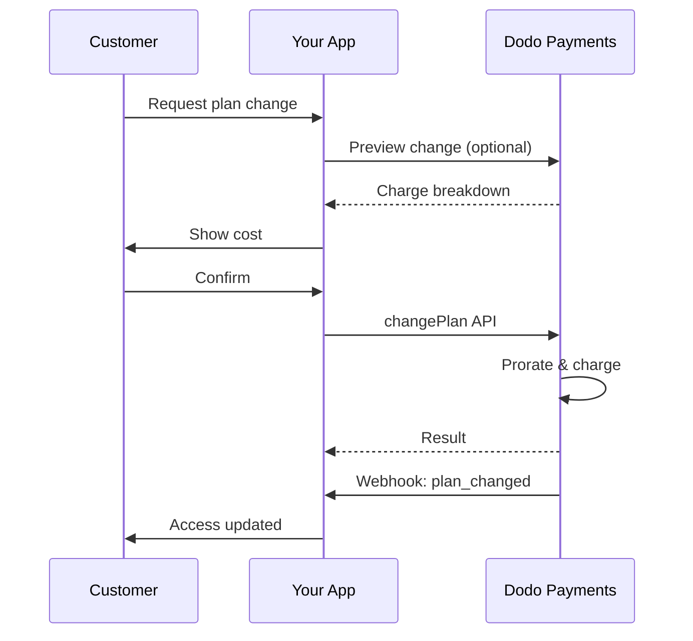
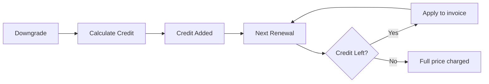

<Info>
Las suscripciones te permiten vender acceso continuo con renovaciones automáticas. Utiliza ciclos de facturación flexibles, pruebas gratuitas, cambios de plan y complementos para personalizar los precios para cada cliente.
</Info>

<CardGroup cols={2}>
<Card title="Actualizar y Degradar" icon="repeat" href="/developer-resources/subscription-upgrade-downgrade">
Controla los cambios de plan con prorrateo y actualizaciones de cantidad.
</Card>

<Card title="Suscripciones Bajo Demanda" icon="bolt" href="/developer-resources/ondemand-subscriptions">
Autoriza un mandato ahora y cobra más tarde con montos personalizados.
</Card>

<Card title="Portal del Cliente" icon="id-card" href="/features/customer-portal">
Permite a los clientes gestionar planes, facturación y cancelaciones.
</Card>

<Card title="Webhooks de Suscripción" icon="code" href="/developer-resources/webhooks/intents/subscription">
Reacciona a eventos del ciclo de vida como creado, renovado y cancelado.
</Card>
</CardGroup>

## ¿Qué Son las Suscripciones?

Las suscripciones son productos recurrentes que los clientes compran en un horario. Son ideales para:

- **Licencias de SaaS**: Aplicaciones, APIs o acceso a plataformas
- **Membresías**: Comunidades, programas o clubes
- **Contenido digital**: Cursos, medios o contenido premium
- **Planes de soporte**: SLA, paquetes de éxito o mantenimiento

## Beneficios Clave

- **Ingresos predecibles**: Facturación recurrente con renovaciones automáticas
- **Ciclos flexibles**: Mensuales, anuales, intervalos personalizados y pruebas
- **Agilidad del plan**: Prorrateo para actualizaciones y degradaciones
- **Complementos y asientos**: Adjunta mejoras opcionales y cuantificables
- **Checkout sin problemas**: Checkout alojado y portal del cliente
- **Desarrollador primero**: APIs claras para creación, cambios y seguimiento de uso

## Creando Suscripciones

Crea productos de suscripción en tu panel de Dodo Payments, luego véndelos a través de checkout o tu API. Separar productos de suscripciones activas te permite versionar precios, adjuntar complementos y rastrear el rendimiento de manera independiente.

### Creación de productos de suscripción

Configura los campos en el panel para definir cómo se vende, renueva y factura tu suscripción. Las secciones a continuación se corresponden directamente con lo que ves en el formulario de creación.

#### Detalles del producto

- **Nombre del Producto** (requerido): El nombre que se muestra en el checkout, portal del cliente y facturas.
- **Descripción del Producto** (requerido): Una declaración de valor clara que aparece en el checkout y las facturas.
- **Imagen del Producto** (requerido): PNG/JPG/WebP de hasta 3 MB. Usada en el checkout y las facturas.
- **Marca**: Asocia el producto con una marca específica para temas y correos electrónicos.
- **Categoría Fiscal** (requerido): Elige la categoría (por ejemplo, SaaS) para determinar las reglas fiscales.

<Tip>
Elige la categoría fiscal más precisa para asegurar la correcta recaudación de impuestos por región.
</Tip>

#### Precios

- **Tipo de Precio**: Elija <b>Suscripción</b> (esta guía). Las alternativas son Pago Único y Facturación Basada en Uso.
- **Precio** (requerido): Precio base recurrente con moneda.
- **Descuento Aplicable (%)**: Porcentaje de descuento opcional aplicado al precio base; reflejado en el pago y en las facturas.
- **Repetir pago cada** (requerido): Intervalo para renovaciones, por ejemplo, cada 1 Mes. Seleccione la cadencia (meses o años) y la cantidad.
- **Período de Suscripción** (requerido): Término total durante el cual la suscripción permanece activa (por ejemplo, 10 Años). Después de que finalice este período, las renovaciones se detienen a menos que se extiendan.
- **Días del Período de Prueba** (requerido): Establezca la duración de la prueba en días. Use 0 para deshabilitar pruebas. El primer cargo ocurre automáticamente cuando finaliza la prueba.
- **Seleccionar complemento**: Adjunte hasta 10 complementos que los clientes pueden comprar junto con el plan base.

<Warning>
Cambiar el precio de un producto activo afecta las nuevas compras. Las suscripciones existentes siguen tus configuraciones de cambio de plan y prorrateo.
</Warning>

<Info>
Los complementos son ideales para extras cuantificables como asientos o almacenamiento. Puedes controlar las cantidades permitidas y el comportamiento de prorrateo cuando los clientes los cambian.
</Info>

#### Configuraciones avanzadas

- **Precios Incluidos Impuestos**: Muestra precios incluidos impuestos aplicables. El cálculo final de impuestos aún varía según la ubicación del cliente.
- **Generar claves de licencia**: Emite una clave única a cada cliente después de la compra. Consulta la guía de <a href="/features/license-keys">Claves de Licencia</a>.
- **Entrega de Producto Digital**: Entrega archivos o contenido automáticamente después de la compra. Aprende más en <a href="/features/digital-product-delivery">Entrega de Producto Digital</a>.
- **Metadatos**: Adjunta pares clave-valor personalizados para etiquetado interno o integraciones de clientes. Consulta <a href="/api-reference/metadata">Metadatos</a>.

<Tip>
Usa metadatos para almacenar identificadores de tu sistema (por ejemplo, accountId) para que puedas reconciliar eventos y facturas más tarde.
</Tip>

## Pruebas de Suscripción

Las pruebas permiten a los clientes acceder a suscripciones sin pago inmediato. El primer cargo ocurre automáticamente cuando termina la prueba.

### Configurando Pruebas

Establece los **Días de Período de Prueba** en la sección de precios del producto (utiliza `0` para desactivar). Puedes anular esto al crear suscripciones:

```typescript
// Via subscription creation
const subscription = await client.subscriptions.create({
  customer_id: 'cus_123',
  product_id: 'prod_monthly',
  trial_period_days: 14  // Overrides product's trial period
});

// Via checkout session
const session = await client.checkoutSessions.create({
  product_cart: [{ product_id: 'prod_monthly', quantity: 1 }],
  subscription_data: { trial_period_days: 14 }
});
```

<Warning>
El valor de `trial_period_days` debe estar entre 0 y 10,000 días.
</Warning>

### Detectando el Estado de Prueba

<Warning>
Actualmente, no hay un campo directo para detectar el estado de prueba. Lo siguiente es una solución alternativa que requiere consultar pagos, lo cual es ineficiente. Estamos trabajando en una solución más eficiente.
</Warning>

Para determinar si una suscripción está en prueba, recupera la lista de pagos para la suscripción. Si hay exactamente un pago con monto 0, la suscripción está en período de prueba:

```typescript
const subscription = await client.subscriptions.retrieve('sub_123');
const payments = await client.payments.list({
  subscription_id: subscription.subscription_id
});

// Check if subscription is in trial
const isInTrial = payments.items.length === 1 && 
                  payments.items[0].total_amount === 0;
```

### Actualizando el Período de Prueba

Extiende el período de prueba actualizando `next_billing_date`:

```typescript
await client.subscriptions.update('sub_123', {
  next_billing_date: '2025-02-15T00:00:00Z'  // New trial end date
});
```

<Warning>
No puedes establecer `next_billing_date` a un tiempo pasado. La fecha debe estar en el futuro.
</Warning>

## Cambios en el Plan de Suscripción

Los cambios de plan te permiten actualizar o degradar suscripciones, ajustar cantidades o migrar a diferentes productos. Cada cambio desencadena un cargo inmediato basado en el modo de prorrateo que selecciones.

<Tip>
Puedes cambiar los planes de suscripción y actualizar la próxima fecha de facturación directamente desde el panel de Dodo Payments. Esto proporciona una forma rápida de ajustar las suscripciones para solicitudes de soporte al cliente, mejoras promocionales o migraciones de planes sin realizar llamadas a la API.
</Tip>

<Tip>
**Habilitar cambios de plan de autoservicio:** ¿Quieres que los clientes actualicen o reduzcan sus propias suscripciones a través del Portal del Cliente? Agrega tus productos de suscripción a una Colección de Productos y habilita "Permitir Actualizaciones de Suscripción" en la Configuración de Suscripción.
</Tip>



<Card title="Colecciones de Productos" icon="layer-group" href="/features/product-collections">
  Agrupa productos relacionados en colecciones para habilitar rutas de actualización/reducción sin problemas en el Portal del Cliente.
</Card>

### Modos de Prorrateo

Elige cómo se facturan los clientes cuando cambian de plan:

<Info>
**Comparación rápida de los tres modos de prorrateo:**

| | `prorated_immediately` | `difference_immediately` | `full_immediately` |
|---|---|---|---|
| **Mejorar** | Cargo prorrateado por los días restantes | Diferencia de precio total cargada | Precio total del nuevo plan cargado |
| **Reducir** | Crédito prorrateado por los días restantes | Diferencia de precio total como crédito | Sin crédito, cargo total |
| **Ciclo de facturación** | Se mantiene igual | Se mantiene igual | Se reinicia a hoy |
| **Mejor para** | Facturación justa basada en el tiempo | Cambios de niveles simples | Reinicio de ciclos de facturación |
</Info>

#### `prorated_immediately`
Cobra una cantidad prorrateada basada en el tiempo restante en el ciclo de facturación actual. Mejor para una facturación justa que tenga en cuenta el tiempo no utilizado.

```typescript
await client.subscriptions.changePlan('sub_123', {
  product_id: 'prod_pro',
  quantity: 1,
  proration_billing_mode: 'prorated_immediately'
});
```

#### `difference_immediately`
Cobra la diferencia de precio de inmediato (mejora) o agrega crédito para renovaciones futuras (reducción). Mejor para escenarios de mejoras/reducciones simples.

```typescript
// Upgrade: charges $50 (difference between $30 and $80)
// Downgrade: credits remaining value, auto-applied to renewals
await client.subscriptions.changePlan('sub_123', {
  product_id: 'prod_pro',
  quantity: 1,
  proration_billing_mode: 'difference_immediately'
});
```

<Info>
Los créditos de las reducciones usando `difference_immediately` son de ámbito de suscripción y se aplican automáticamente a las renovaciones futuras. Se diferencian de los <a href="/features/customer-credit">Créditos de Clientes</a>.
</Info>

Cuando un cliente reduce con `difference_immediately`, el valor no utilizado se convierte en un crédito de ámbito de suscripción que automáticamente compensa las renovaciones futuras:



#### `full_immediately`
Cobra el monto total del nuevo plan de inmediato, ignorando el tiempo restante. Mejor para restablecer ciclos de facturación.

```typescript
await client.subscriptions.changePlan('sub_123', {
  product_id: 'prod_monthly',
  quantity: 1,
  proration_billing_mode: 'full_immediately'
});
```

<AccordionGroup>
<Accordion title="Ejemplo: Cálculo de mejora prorrateada">

**Escenario**: Cliente en Básico ($30/mes) mejora a Pro ($80/mes) el día 16 de un ciclo de 30 días usando `prorated_immediately`.

```
Unused credit from Basic = $30 × (15 remaining / 30 total) = $15.00
Prorated cost of Pro     = $80 × (15 remaining / 30 total) = $40.00
────────────────────────────────────────────────────────────────────
Immediate charge         = $40.00 − $15.00 = $25.00
```

Próxima renovación en la fecha de facturación original: **$80.00/mes**.

<Tip>
Para ejemplos de cálculos más detallados y casos extremos, consulta nuestra [Guía de Mejora y Reducción](/developer-resources/subscription-upgrade-downgrade).
</Tip>

</Accordion>
<Accordion title="Ejemplo: Cálculo de crédito por reducción">

**Escenario**: Cliente en Pro ($80/mes) reduce a Inicial ($20/mes) usando `difference_immediately`.

```
Credit = Old plan − New plan = $80 − $20 = $60.00
```

El crédito de $60 se aplica automáticamente a las renovaciones futuras:
- Renovación 1: $20 − $20 (crédito) = **$0.00** ($40 crédito restante)
- Renovación 2: $20 − $20 (crédito) = **$0.00** ($20 crédito restante)
- Renovación 3: $20 − $20 (crédito) = **$0.00** (crédito agotado)
- Renovación 4: **$20.00** (precio total)

<Info>
Obtén más información sobre cómo se gestionan los créditos en la [Guía de Mejora y Reducción](/developer-resources/subscription-upgrade-downgrade).
</Info>

</Accordion>
</AccordionGroup>

### Cambiando Planes con Adiciones

Modifica las adiciones al cambiar de planes. Las adiciones se incluyen en los cálculos de prorrateo:

```typescript
await client.subscriptions.changePlan('sub_123', {
  product_id: 'prod_pro',
  quantity: 1,
  proration_billing_mode: 'difference_immediately',
  addons: [{ addon_id: 'addon_extra_seats', quantity: 2 }]  // Add add-ons
  // addons: []  // Empty array removes all existing add-ons
});
```

<Info>
Los cambios de plan activan cargos inmediatos. Los cargos fallidos pueden mover la suscripción al estado `on_hold`. Realiza un seguimiento de los cambios a través de eventos webhook `subscription.plan_changed`.
</Info>

### Vista Previa de Cambios de Plan

Antes de comprometerte a un cambio de plan, vista previa del cargo exacto y la suscripción resultante:

```typescript
const preview = await client.subscriptions.previewChangePlan('sub_123', {
  product_id: 'prod_pro',
  quantity: 1,
  proration_billing_mode: 'prorated_immediately'
});

// Show customer the charge before confirming
console.log('You will be charged:', preview.immediate_charge.summary);
```

<Card title="API de Vista Previa de Cambio de Plan" icon="eye" href="/api-reference/subscriptions/preview-change-plan">
  Previsualiza los cambios de plan antes de comprometerte a ellos.
</Card>

## Estados de Suscripción

Las suscripciones pueden estar en diferentes estados a lo largo de su ciclo de vida:

- **`active`**: La suscripción está activa y se renovará automáticamente
- **`on_hold`**: La suscripción está en pausa debido a un pago fallido. Se requiere actualización del método de pago para reactivar
- **`cancelled`**: La suscripción está cancelada y no se renovará
- **`expired`**: La suscripción ha alcanzado su fecha de finalización
- **`pending`**: La suscripción se está creando o procesando

### Estado en Espera

Una suscripción entra en estado `on_hold` cuando:

- Un pago de renovación falla (fondos insuficientes, tarjeta expirada, etc.)
- Un cargo por cambio de plan falla
- La autorización del método de pago falla

<Warning>
Cuando una suscripción está en estado `on_hold`, no se renovará automáticamente. Debes actualizar el método de pago para reactivar la suscripción.
</Warning>

### Reactivación desde Estado en Espera

Para reactivar una suscripción desde el estado `on_hold`, actualiza el método de pago. Esto automáticamente:

1. Crea un cargo por importes pendientes
2. Genera una factura
3. Procesa el pago utilizando el nuevo método de pago
4. Reactiva la suscripción al estado `active` tras un pago exitoso

```typescript
// Reactivate subscription from on_hold
const response = await client.subscriptions.updatePaymentMethod('sub_123', {
  type: 'new',
  return_url: 'https://example.com/return'
});

// For on_hold subscriptions, a charge is automatically created
if (response.payment_id) {
  console.log('Charge created:', response.payment_id);
  // Redirect customer to response.payment_link to complete payment
  // Monitor webhooks for payment.succeeded and subscription.active
}
```

<Info>
Después de actualizar correctamente el método de pago para una suscripción `on_hold`, recibirás eventos webhook `payment.succeeded` seguido de `subscription.active`.
</Info>

## Gestión de API

<AccordionGroup>
<Accordion title="Crear suscripciones">
Utiliza `POST /subscriptions` para crear suscripciones programáticamente a partir de productos, con pruebas opcionales y adiciones.


<Card title="Referencia API" icon="code" href="/api-reference/subscriptions/post-subscriptions">
Consulta la API de creación de suscripciones.
</Card>
</Accordion>

<Accordion title="Actualizar suscripciones">
Utiliza `PATCH /subscriptions/{id}` para actualizar cantidades, cancelar en la próxima fecha de facturación o modificar metadatos.

<Card title="Referencia API" icon="code" href="/api-reference/subscriptions/patch-subscriptions">
Aprende cómo actualizar los detalles de la suscripción.
</Card>
</Accordion>

<Accordion title="Cambiar planes (prorrateo)">
Cambia el producto activo y las cantidades con controles de prorrateo.

<Card title="Referencia API" icon="code" href="/api-reference/subscriptions/change-plan">
Revisa las opciones de cambio de plan.
</Card>
</Accordion>

<Accordion title="Cargos a demanda">
Para suscripciones a demanda, cobra importes específicos según se requiera.

<Card title="Referencia API" icon="code" href="/api-reference/subscriptions/create-charge">
Cobra una suscripción a demanda.
</Card>
</Accordion>

<Accordion title="Listar y recuperar">
Utiliza `GET /subscriptions` para listar todas las suscripciones y `GET /subscriptions/{id}` para recuperar una.

<Card title="Referencia API" icon="code" href="/api-reference/subscriptions/get-subscriptions">
Navega por las APIs de listado y recuperación.
</Card>
</Accordion>

<Accordion title="Historial de uso">
Obtén el uso registrado para modelos de precios medidos o híbridos.

<Card title="Referencia API" icon="code" href="/api-reference/subscriptions/get-usage-history">
Consulta la API del historial de uso.
</Card>
</Accordion>

<Accordion title="Actualizar método de pago">
Actualiza el método de pago para una suscripción. Para suscripciones activas, esto actualiza el método de pago para futuras renovaciones. Para suscripciones en estado `on_hold`, esto reactiva la suscripción al crear un cargo por importes pendientes.

<Card title="Referencia API" icon="code" href="/api-reference/subscriptions/update-payment-method">
Aprende cómo actualizar métodos de pago y reactivar suscripciones.
</Card>
</Accordion>
</AccordionGroup>

## Casos de Uso Comunes

- **SaaS y APIs**: Acceso por niveles con adiciones para asientos o uso
- **Contenido y medios**: Acceso mensual con pruebas introductorias
- **Planes de soporte B2B**: Contratos anuales con adiciones de soporte premium
- **Herramientas y complementos**: Claves de licencia y versiones liberadas

## Ejemplos de Integración

### Sesiones de Checkout (suscripciones)
Al crear sesiones de checkout, incluye tu producto de suscripción y adiciones opcionales:

```typescript
const session = await client.checkoutSessions.create({
  product_cart: [
    {
      product_id: 'prod_subscription',
      quantity: 1
    }
  ]
});
```

### Cambios de plan con prorrateo
Aumenta o reduce una suscripción y controla el comportamiento de prorrateo:

```typescript
await client.subscriptions.changePlan('sub_123', {
  product_id: 'prod_new',
  quantity: 1,
  proration_billing_mode: 'difference_immediately'
});
```

### Cancelar en la próxima fecha de facturación
Programa una cancelación que tenga efecto al final del período de facturación actual:

```typescript
await client.subscriptions.update('sub_123', {
  cancel_at_next_billing_date: true
});
```

### Suscripciones a demanda
Crea una suscripción a demanda y cobra más tarde según sea necesario:

```typescript
const onDemand = await client.subscriptions.create({
  customer_id: 'cus_123',
  product_id: 'prod_on_demand',
  on_demand: true
});

await client.subscriptions.createCharge(onDemand.id, {
  amount: 4900,
  currency: 'USD',
  description: 'Extra usage for September'
});
```

### Actualizar método de pago para suscripción activa
Actualiza el método de pago para una suscripción activa:

```typescript
// Update with new payment method
const response = await client.subscriptions.updatePaymentMethod('sub_123', {
  type: 'new',
  return_url: 'https://example.com/return'
});

// Or use existing payment method
await client.subscriptions.updatePaymentMethod('sub_123', {
  type: 'existing',
  payment_method_id: 'pm_abc123'
});
```

### Reactivar suscripción desde en espera
Reactiva una suscripción que se puso en espera debido a un pago fallido:

```typescript
// Update payment method - automatically creates charge for remaining dues
const response = await client.subscriptions.updatePaymentMethod('sub_123', {
  type: 'new',
  return_url: 'https://example.com/return'
});

if (response.payment_id) {
  // Charge created for remaining dues
  // Redirect customer to response.payment_link
  // Monitor webhooks: payment.succeeded → subscription.active
}
```

## Suscripciones con Mandatos Compatibles con RBI

  Las suscripciones de UPI y tarjetas indias funcionan bajo regulaciones del RBI (Reserva Bank de India) con requisitos de mandato específicos:

  ### Límites de Mandato

  El tipo y la cantidad del mandato dependen del cargo recurrente de tu suscripción:

  - **Cargos de menos de Rs 15,000:** Creamos un mandato a demanda por Rs 15,000 INR. El monto de la suscripción se carga periódicamente según la frecuencia de la suscripción, hasta el límite del mandato.
  - **Cargos de Rs 15,000 o más:** Creamos un mandato de suscripción (o mandato a demanda) por el monto exacto de la suscripción.

Para obtener información detallada sobre los mandatos compatibles con RBI para métodos de pago indios, consulta la página de <a href="/features/payment-methods/india">Métodos de Pago en India</a>.

  ### Consideraciones de Mejora y Reducción

  **Importante:** Al mejorar o reducir suscripciones, considera cuidadosamente los límites del mandato:

  - Si una mejora/reducción resulta en un monto de cargo que excede Rs 15,000 y va más allá del límite de pago a demanda existente, el cargo de la transacción puede fallar.
  - En tales casos, el cliente puede necesitar actualizar su método de pago o cambiar nuevamente la suscripción para establecer un nuevo mandato con el límite correcto.

  ### Autorización para Cargos de Alto Valor

  Para cargos de suscripción de Rs 15,000 o más:

  - Se solicitará al cliente por su banco autorizar la transacción.
  - Si el cliente no autoriza la transacción, la transacción fallará y la suscripción se pondrá en espera.

  ### Retraso de Procesamiento de 48 Horas

  **Cronograma de Procesamiento:** Los cargos recurrentes en tarjetas y suscripciones de UPI indias siguen un patrón de procesamiento único:

  - Los cargos se **inician** en la fecha programada de acuerdo con la frecuencia de la suscripción.
  - La **deducción** real de la cuenta del cliente ocurre solo después de **48 horas** desde la iniciación del pago.
  - Este ventana de 48 horas puede extenderse hasta **2-3 horas adicionales** dependiendo de las respuestas del API del banco.

  ### Ventana de Cancelación de Mandato

  Durante la ventana de procesamiento de 48 horas:

  - Los clientes pueden cancelar el mandato a través de sus aplicaciones bancarias.
  - Si un cliente cancela el mandato durante este período, la suscripción permanecerá **activa** (este es un caso extremo específico para las suscripciones por auto pago de tarjeta indias y UPI).
  - Sin embargo, la deducción real puede fallar, y en ese caso, pondremos la suscripción **en espera**.

  **Manejo de Casos Extremos:** Si proporcionas beneficios, créditos o uso de suscripciones a los clientes inmediatamente tras la iniciación del cargo, debes manejar esta ventana de 48 horas de manera adecuada en tu aplicación. Considera:

  - Retrasar la activación de beneficios hasta la confirmación del pago
  - Implementar períodos de gracia o acceso temporal
  - Monitorear el estado de la suscripción para cancelaciones de mandato
  - Manejar estados de espera de suscripciones en la lógica de tu aplicación

  <Tip>
  Monitorea los webhooks de suscripción para rastrear cambios en el estado del pago y manejar casos extremos donde los mandatos sean cancelados durante la ventana de 48 horas.
  </Tip>

## Mejores Prácticas

- **Comienza con niveles claros**: 2-3 planes con diferencias obvias
- **Comunica precios**: Muestra totales, prorrateo y próxima renovación
- **Usa pruebas con sabiduría**: Convierte con incorporación, no solo con tiempo
- **Aprovecha las adiciones**: Mantén los planes base simples y vende extras
- **Prueba cambios**: Valida cambios de plan y prorrateo en modo de prueba

<Info>
Las suscripciones son una base flexible para ingresos recurrentes. Comienza simple, prueba a fondo e itera según métricas de adopción, churn y expansión.
</Info>