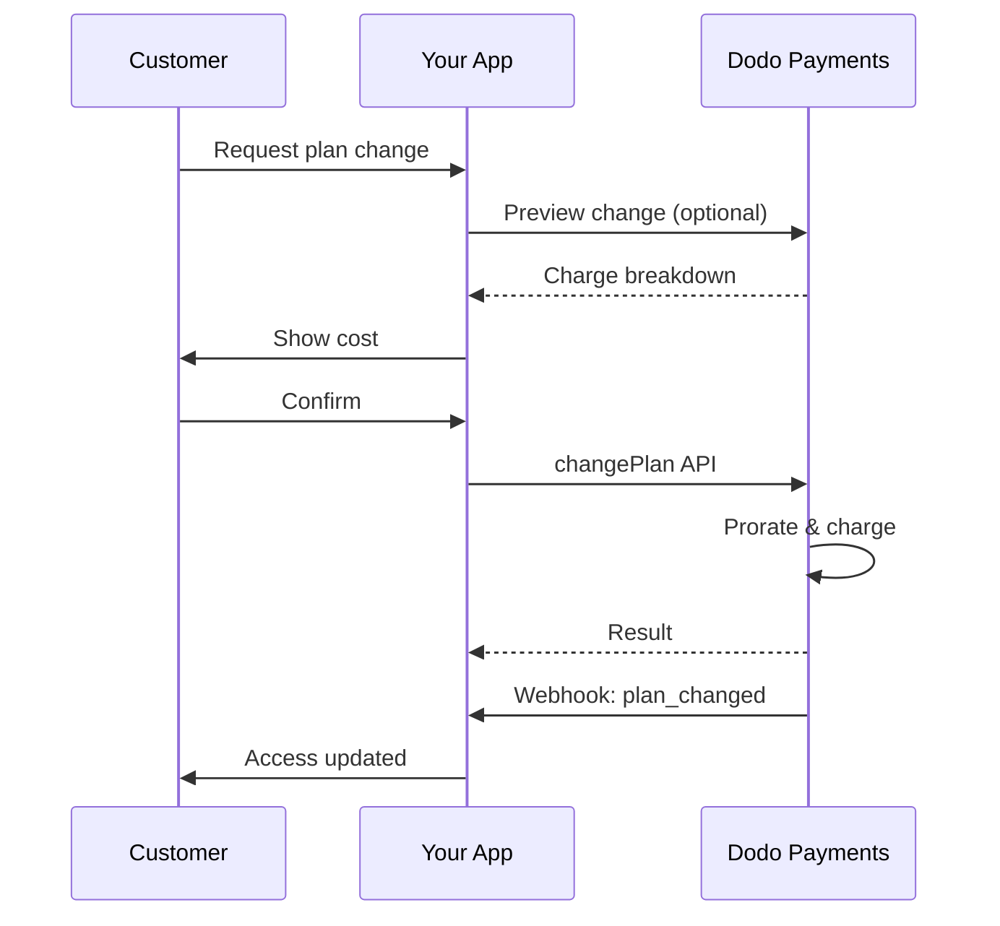
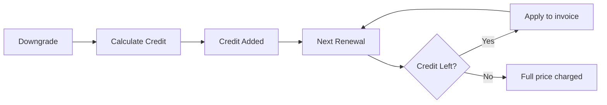

<Info>
Las suscripciones te permiten vender acceso continuo con renovaciones automáticas. Usa ciclos de facturación flexibles, pruebas gratuitas, cambios de plan y complementos para adaptar los precios a cada cliente.
</Info>

<CardGroup cols={2}>
<Card title="Upgrade & Downgrade" icon="repeat" href="/developer-resources/subscription-upgrade-downgrade">
Controla los cambios de plan con prorrateo y actualizaciones de cantidad.
</Card>

<Card title="On‑Demand Subscriptions" icon="bolt" href="/developer-resources/ondemand-subscriptions">
Autoriza un mandato ahora y cobra después con importes personalizados.
</Card>

<Card title="Customer Portal" icon="id-card" href="/features/customer-portal">
Permite que los clientes administren planes, facturación y cancelaciones.
</Card>

<Card title="Subscription Webhooks" icon="code" href="/developer-resources/webhooks/intents/subscription">
Reacciona a eventos del ciclo de vida como creado, renovado y cancelado.
</Card>
</CardGroup>

## ¿Qué Son las Suscripciones?

Las suscripciones son productos recurrentes que los clientes compran en un horario. Son ideales para:

- **Licencias de SaaS**: Aplicaciones, APIs o acceso a plataformas
- **Membresías**: Comunidades, programas o clubes
- **Contenido digital**: Cursos, medios o contenido premium
- **Planes de soporte**: SLA, paquetes de éxito o mantenimiento

## Beneficios Clave

- **Ingresos predecibles**: Facturación recurrente con renovaciones automáticas
- **Ciclos flexibles**: Mensuales, anuales, intervalos personalizados y pruebas
- **Agilidad del plan**: Prorrateo para actualizaciones y degradaciones
- **Complementos y asientos**: Adjunta mejoras opcionales y cuantificables
- **Checkout sin problemas**: Checkout alojado y portal del cliente
- **Desarrollador primero**: APIs claras para creación, cambios y seguimiento de uso

## Creando Suscripciones

Crea productos de suscripción en tu panel de Dodo Payments, luego véndelos a través de checkout o tu API. Separar productos de suscripciones activas te permite versionar precios, adjuntar complementos y rastrear el rendimiento de manera independiente.

### Creación de productos de suscripción

Configura los campos en el panel para definir cómo se vende, renueva y factura tu suscripción. Las secciones a continuación se corresponden directamente con lo que ves en el formulario de creación.

#### Detalles del producto

- **Nombre del Producto** (requerido): El nombre que se muestra en el checkout, portal del cliente y facturas.
- **Descripción del Producto** (requerido): Una declaración de valor clara que aparece en el checkout y las facturas.
- **Imagen del Producto** (requerido): PNG/JPG/WebP de hasta 3 MB. Usada en el checkout y las facturas.
- **Marca**: Asocia el producto con una marca específica para temas y correos electrónicos.
- **Categoría Fiscal** (requerido): Elige la categoría (por ejemplo, SaaS) para determinar las reglas fiscales.

<Tip>
Elige la categoría fiscal más precisa para garantizar la recaudación correcta de impuestos por región.
</Tip>

#### Precios

- **Tipo de Precio**: Elija <b>Suscripción</b> (esta guía). Las alternativas son Pago Único y Facturación Basada en Uso.
- **Precio** (requerido): Precio base recurrente con moneda.
- **Descuento Aplicable (%)**: Porcentaje de descuento opcional aplicado al precio base; reflejado en el pago y en las facturas.
- **Repetir pago cada** (requerido): Intervalo para renovaciones, por ejemplo, cada 1 Mes. Seleccione la cadencia (meses o años) y la cantidad.
- **Período de Suscripción** (requerido): Término total durante el cual la suscripción permanece activa (por ejemplo, 10 Años). Después de que finalice este período, las renovaciones se detienen a menos que se extiendan.
- **Días del Período de Prueba** (requerido): Establezca la duración de la prueba en días. Use 0 para deshabilitar pruebas. El primer cargo ocurre automáticamente cuando finaliza la prueba.
- **Seleccionar complemento**: Adjunte hasta 10 complementos que los clientes pueden comprar junto con el plan base.

<Warning>
Cambiar los precios de un producto activo afecta las compras nuevas. Las suscripciones existentes siguen tus ajustes de cambio de plan y prorrateo.
</Warning>

<Info>
Los complementos son ideales para extras cuantificables como puestos o almacenamiento. Puedes controlar las cantidades permitidas y el comportamiento de prorrateo cuando los clientes los modifican.
</Info>

#### Configuraciones avanzadas

- **Precios Incluidos Impuestos**: Muestra precios incluidos impuestos aplicables. El cálculo final de impuestos aún varía según la ubicación del cliente.
- **Generar claves de licencia**: Emite una clave única a cada cliente después de la compra. Consulta la guía de <a href="/features/license-keys">Claves de Licencia</a>.
- **Entrega de Producto Digital**: Entrega archivos o contenido automáticamente después de la compra. Aprende más en <a href="/features/digital-product-delivery">Entrega de Producto Digital</a>.
- **Metadatos**: Adjunta pares clave-valor personalizados para etiquetado interno o integraciones de clientes. Consulta <a href="/api-reference/metadata">Metadatos</a>.

<Tip>
Usa metadatos para guardar identificadores de tu sistema (por ejemplo, accountId) y poder conciliar eventos e facturas después.
</Tip>

## Pruebas de Suscripción

Las pruebas permiten a los clientes acceder a suscripciones sin pago inmediato. El primer cargo ocurre automáticamente cuando termina la prueba.

### Configurando Pruebas

Configura **Días del período de prueba** en la sección de precios del producto (usa `0` para deshabilitar). Puedes sobrescribir esto al crear suscripciones:

```typescript
// Via subscription creation
const subscription = await client.subscriptions.create({
  customer_id: 'cus_123',
  product_id: 'prod_monthly',
  trial_period_days: 14  // Overrides product's trial period
});

// Via checkout session
const session = await client.checkoutSessions.create({
  product_cart: [{ product_id: 'prod_monthly', quantity: 1 }],
  subscription_data: { trial_period_days: 14 }
});
```

<Warning>
El valor `trial_period_days` debe estar entre 0 y 10 000 días.
</Warning>

### Detectando el Estado de Prueba

<Warning>
Actualmente, no hay un campo directo para detectar el estado de prueba. La siguiente es una solución provisional que requiere consultar pagos, lo cual es ineficiente. Estamos trabajando en una solución más eficiente.
</Warning>

Para determinar si una suscripción está en prueba, recupera la lista de pagos para la suscripción. Si hay exactamente un pago con monto 0, la suscripción está en período de prueba:

```typescript
const subscription = await client.subscriptions.retrieve('sub_123');
const payments = await client.payments.list({
  subscription_id: subscription.subscription_id
});

// Check if subscription is in trial
const isInTrial = payments.items.length === 1 && 
                  payments.items[0].total_amount === 0;
```

### Actualizando el Período de Prueba

Extiende la prueba actualizando `next_billing_date`:

```typescript
await client.subscriptions.update('sub_123', {
  next_billing_date: '2025-02-15T00:00:00Z'  // New trial end date
});
```

<Warning>
No puedes establecer `next_billing_date` en una fecha pasada. La fecha debe estar en el futuro.
</Warning>

## Cambios en el Plan de Suscripción

Los cambios de plan te permiten actualizar o degradar suscripciones, ajustar cantidades o migrar a diferentes productos. Dependiendo del modo de prorrateo que selecciones, un cambio puede desencadenar un cargo inmediato, crear crédito o no aplicar ningún ajuste de facturación.

<Tip>
Puedes cambiar planes de suscripción y actualizar la próxima fecha de facturación directamente desde el panel de Dodo Payments. Esto ofrece una forma rápida de ajustar suscripciones para solicitudes de soporte al cliente, mejoras promocionales o migraciones de plan sin realizar llamadas a la API.
</Tip>

<Tip>
**Habilita cambios de plan de autoservicio:** ¿Quieres que los clientes mejoren o degraden sus propias suscripciones mediante el Portal del Cliente? Agrega tus productos de suscripción a una Colección de Productos y activa "Permitir actualizaciones de suscripción" en tus Ajustes de Suscripciones.
</Tip>



<Card title="Product Collections" icon="layer-group" href="/features/product-collections">
  Agrupa productos relacionados en colecciones para habilitar rutas de mejora/degradación fluidas en el Portal del Cliente.
</Card>

### Modos de prorrateo

Elige cómo se factura a los clientes al cambiar de plan:

<Info>
**Comparación rápida de los cuatro modos de prorrateo:**

| | `prorated_immediately` | `difference_immediately` | `full_immediately` | `do_not_bill` |
|---|---|---|---|---|
| **Actualizar** | Cargo prorrateado por días restantes | Diferencia de precio total cobrada | Precio total del nuevo plan cobrado | Sin cargo — cambio inmediato |
| **Degradar** | Crédito prorrateado por días restantes | Diferencia de precio total como crédito | Sin crédito, cargo completo | Sin crédito — cambio inmediato |
| **Ciclo de facturación** | Permanece igual | Permanece igual | Se restablece a hoy | Permanece igual |
| **Mejor para** | Facturación justa basada en tiempo | Cambios de nivel simples | Reinicios del ciclo de facturación | Migraciones gratuitas o cambios de cortesía |
</Info>

#### `prorated_immediately`
Cobra el monto prorrateado según el tiempo restante en el ciclo de facturación actual. Ideal para una facturación justa que considera el tiempo no utilizado.

```typescript
await client.subscriptions.changePlan('sub_123', {
  product_id: 'prod_pro',
  quantity: 1,
  proration_billing_mode: 'prorated_immediately'
});
```

#### `difference_immediately`
Cobra la diferencia de precio inmediatamente (mejora) o agrega crédito para renovaciones futuras (degradación). Ideal para escenarios simples de mejora/degradación.

```typescript
// Upgrade: charges $50 (difference between $30 and $80)
// Downgrade: credits remaining value, auto-applied to renewals
await client.subscriptions.changePlan('sub_123', {
  product_id: 'prod_pro',
  quantity: 1,
  proration_billing_mode: 'difference_immediately'
});
```

<Info>
Los créditos de las degradaciones que usan `difference_immediately` están vinculados a la suscripción y se aplican automáticamente a futuras renovaciones. Son distintos de los derechos de <a href="/features/credit-based-billing">Credit-Based Billing</a>.
</Info>

Cuando un cliente realiza una degradación con `difference_immediately`, el valor no utilizado se convierte en un crédito específico de la suscripción que compensa automáticamente las renovaciones futuras:



#### `full_immediately`
Cobra el importe total del nuevo plan de inmediato, sin considerar el tiempo restante. Ideal para reiniciar los ciclos de facturación.

```typescript
await client.subscriptions.changePlan('sub_123', {
  product_id: 'prod_monthly',
  quantity: 1,
  proration_billing_mode: 'full_immediately'
});
```

#### `do_not_bill`
Cambia al nuevo plan sin ningún ajuste de facturación. No hay cargos por prorrateo, ni créditos: el cliente simplemente se mueve al nuevo plan. Ideal para migraciones de cortesía, cambios de plan gratuitos o escenarios donde deseas absorber la diferencia de costos.

```typescript
await client.subscriptions.changePlan('sub_123', {
  product_id: 'prod_new_plan',
  quantity: 1,
  proration_billing_mode: 'do_not_bill'
});
```

<AccordionGroup>
<Accordion title="Example: Prorated upgrade calculation">

**Escenario**: Cliente en Básico ($30/mes) actualiza a Pro ($80/mes) en el día 16 de un ciclo de 30 días usando `prorated_immediately`.

```
Unused credit from Basic = $30 × (15 remaining / 30 total) = $15.00
Prorated cost of Pro     = $80 × (15 remaining / 30 total) = $40.00
────────────────────────────────────────────────────────────────────
Immediate charge         = $40.00 − $15.00 = $25.00
```

Próxima renovación en la fecha de facturación original: **$80.00/mes**.

<Tip>
Para ejemplos de cálculo más detallados y casos extremos, consulta nuestra [Guía de Actualización y Degradación](/developer-resources/subscription-upgrade-downgrade).
</Tip>

</Accordion>
<Accordion title="Example: Downgrade credit calculation">

**Escenario**: Cliente en Pro ($80/mes) degrada a Inicial ($20/mes) usando `difference_immediately`.

```
Credit = Old plan − New plan = $80 − $20 = $60.00
```

El crédito de $60 se aplica automáticamente a renovaciones futuras:
- Renovación 1: $20 − $20 (crédito) = **$0.00** ($40 de crédito restante)
- Renovación 2: $20 − $20 (crédito) = **$0.00** ($20 de crédito restante)  
- Renovación 3: $20 − $20 (crédito) = **$0.00** (crédito agotado)
- Renovación 4: **$20.00** (precio completo)

<Info>
Aprende más sobre cómo se gestionan los créditos en la [Guía de Actualización y Degradación](/developer-resources/subscription-upgrade-downgrade).
</Info>

</Accordion>
</AccordionGroup>

### Cambio de Planes con Complementos

Modifica los complementos al cambiar de plan. Los complementos están incluidos en los cálculos de prorrateo:

```typescript
await client.subscriptions.changePlan('sub_123', {
  product_id: 'prod_pro',
  quantity: 1,
  proration_billing_mode: 'difference_immediately',
  addons: [{ addon_id: 'addon_extra_seats', quantity: 2 }]  // Add add-ons
  // addons: []  // Empty array removes all existing add-ons
});
```

<Info>
Los cambios de plan generan cargos inmediatos. Los fallos en los cargos pueden mover la suscripción al estado `on_hold`. Rastrea los cambios a través de eventos de webhook `subscription.plan_changed`.
</Info>

### Previsualizar Cambios de Planes

Antes de comprometerte a un cambio de plan, previsualiza el cargo exacto y la suscripción resultante:

```typescript
const preview = await client.subscriptions.previewChangePlan('sub_123', {
  product_id: 'prod_pro',
  quantity: 1,
  proration_billing_mode: 'prorated_immediately'
});

// Show customer the charge before confirming
console.log('You will be charged:', preview.immediate_charge.summary);
```

<Card title="Preview Change Plan API" icon="eye" href="/api-reference/subscriptions/preview-change-plan">
  Previsualiza cambios de planes antes de comprometerte a ellos.
</Card>

## Estados de Suscripción

Las suscripciones pueden estar en diferentes estados a lo largo de su ciclo de vida:

- **`active`**: La suscripción está activa y se renovará automáticamente
- **`on_hold`**: La suscripción está en pausa debido a un pago fallido. Se requiere actualizar el método de pago para reactivar
- **`cancelled`**: La suscripción está cancelada y no se renovará
- **`expired`**: La suscripción ha alcanzado su fecha de finalización
- **`pending`**: La suscripción se está creando o procesando

### Estado En Espera

Una suscripción entra en estado `on_hold` cuando:

- Un pago de renovación falla (fondos insuficientes, tarjeta expirada, etc.)
- Un cargo por cambio de plan falla
- La autorización del método de pago falla

<Warning>
Cuando una suscripción está en estado `on_hold`, no se renovará automáticamente. Debes actualizar el método de pago para reactivar la suscripción.
</Warning>

### Reactivar desde En Espera

Para reactivar una suscripción desde el estado `on_hold`, actualiza el método de pago. Esto automáticamente:

1. Crea un cargo por deudas pendientes
2. Genera una factura
3. Procesa el pago usando el nuevo método de pago
4. Reactiva la suscripción al estado `active` tras el pago exitoso

```typescript
// Reactivate subscription from on_hold
const response = await client.subscriptions.updatePaymentMethod('sub_123', {
  type: 'new',
  return_url: 'https://example.com/return'
});

// For on_hold subscriptions, a charge is automatically created
if (response.payment_id) {
  console.log('Charge created:', response.payment_id);
  // Redirect customer to response.payment_link to complete payment
  // Monitor webhooks for payment.succeeded and subscription.active
}
```

<Info>
Después de actualizar con éxito el método de pago para una suscripción `on_hold`, recibirás eventos de webhook `payment.succeeded` seguido de `subscription.active`.
{/* LOCKED_PATTERN_07427f62e4e59df6149a8a60508baae30ae */}

## Gestión de API

<AccordionGroup>
<Accordion title="Create subscriptions">
Usa `POST /subscriptions` para crear suscripciones de manera programática desde productos, con pruebas y complementos opcionales.

<Card title="API Reference" icon="code" href="/api-reference/subscriptions/post-subscriptions">
Consulta la API para crear suscripciones.
</Card>
</Accordion>

<Accordion title="Update subscriptions">
Usa `PATCH /subscriptions/{id}` para actualizar cantidades, cancelar en la próxima fecha de facturación o modificar metadatos.

<Card title="API Reference" icon="code" href="/api-reference/subscriptions/patch-subscriptions">
Aprende a actualizar los detalles de la suscripción.
</Card>
</Accordion>

<Accordion title="Change plans (proration)">
Cambia el producto activo y las cantidades con controles de prorrateo.

<Card title="API Reference" icon="code" href="/api-reference/subscriptions/change-plan">
Revisa las opciones de cambio de plan.
</Card>
</Accordion>

<Accordion title="On‑demand charges">
Para suscripciones bajo demanda, cobra cantidades específicas cuando sea necesario.

<Card title="API Reference" icon="code" href="/api-reference/subscriptions/create-charge">
Cobra una suscripción bajo demanda.
</Card>
</Accordion>

<Accordion title="List and retrieve">
Usa `GET /subscriptions` para listar todas las suscripciones e `GET /subscriptions/{id}` para recuperar una.

<Card title="API Reference" icon="code" href="/api-reference/subscriptions/get-subscriptions">
Navega por las APIs de listado y recuperación.
</Card>
</Accordion>

<Accordion title="Usage history">
Obtén el uso registrado para modelos de precios medidos o híbridos.

<Card title="API Reference" icon="code" href="/api-reference/subscriptions/get-usage-history">
Consulta la API de historial de uso.
</Card>
</Accordion>

<Accordion title="Update payment method">
Actualiza el método de pago de una suscripción. Para suscripciones activas, esto actualiza el método de pago para futuras renovaciones. Para suscripciones en estado `on_hold`, esto reactiva la suscripción creando un cargo por deudas pendientes.

<Card title="API Reference" icon="code" href="/api-reference/subscriptions/update-payment-method">
Aprende a actualizar métodos de pago y reactivar suscripciones.
</Card>
</Accordion>
</AccordionGroup>

## Casos de Uso Comunes

- **SaaS y APIs**: Acceso por niveles con complementos para asientos o uso
- **Contenido y medios**: Acceso mensual con pruebas introductorias
- **Planes de soporte B2B**: Contratos anuales con complementos de soporte premium
- **Herramientas y complementos**: Claves de licencia y versiones lanzadas

## Ejemplos de Integración

### Sesiones de Pago (suscripciones)
Al crear sesiones de pago, incluye tu producto de suscripción y complementos opcionales:

```typescript
const session = await client.checkoutSessions.create({
  product_cart: [
    {
      product_id: 'prod_subscription',
      quantity: 1
    }
  ]
});
```

### Cambios de plan con prorrateo
Actualiza o degrada una suscripción y controla el comportamiento de prorrateo:

```typescript
await client.subscriptions.changePlan('sub_123', {
  product_id: 'prod_new',
  quantity: 1,
  proration_billing_mode: 'difference_immediately'
});
```

### Cancelar en la próxima fecha de facturación
Programa una cancelación que entra en vigor al final del período de facturación actual:

```typescript
await client.subscriptions.update('sub_123', {
  cancel_at_next_billing_date: true
});
```

### Suscripciones bajo demanda
Crea una suscripción bajo demanda y cobra posteriormente según sea necesario:

```typescript
const onDemand = await client.subscriptions.create({
  customer_id: 'cus_123',
  product_id: 'prod_on_demand',
  on_demand: true
});

await client.subscriptions.createCharge(onDemand.id, {
  amount: 4900,
  currency: 'USD',
  description: 'Extra usage for September'
});
```

### Actualizar método de pago para suscripción activa
Actualiza el método de pago para una suscripción activa:

```typescript
// Update with new payment method
const response = await client.subscriptions.updatePaymentMethod('sub_123', {
  type: 'new',
  return_url: 'https://example.com/return'
});

// Or use existing payment method
await client.subscriptions.updatePaymentMethod('sub_123', {
  type: 'existing',
  payment_method_id: 'pm_abc123'
});
```

### Reactivar suscripción desde estado en espera
Reactiva una suscripción que quedó en espera debido a un pago fallido:

```typescript
// Update payment method - automatically creates charge for remaining dues
const response = await client.subscriptions.updatePaymentMethod('sub_123', {
  type: 'new',
  return_url: 'https://example.com/return'
});

if (response.payment_id) {
  // Charge created for remaining dues
  // Redirect customer to response.payment_link
  // Monitor webhooks: payment.succeeded → subscription.active
}
```

## Suscripciones con Mandatos Cumplidores con RBI

  Las suscripciones UPI y de tarjetas indias operan bajo las regulaciones de RBI (Banco de la Reserva de India) con requisitos específicos de mandato:

  ### Límites de Mandato

  El tipo y monto del mandato dependen del cargo recurrente de tu suscripción:

  - **Cargos por debajo de Rs 15,000:** Creamos un mandato bajo demanda por Rs 15,000 INR. La cantidad de la suscripción se cobra periódicamente según la frecuencia de tu suscripción, hasta el límite del mandato.
  - **Cargos de Rs 15,000 o más:** Creamos un mandato de suscripción (o mandato bajo demanda) por la cantidad exacta de la suscripción.

Para información detallada sobre mandatos cumplidores con RBI para métodos de pago indios, consulta la página de <a href="/features/payment-methods/india">Métodos de Pago de India</a>.

  ### Consideraciones de Actualización y Degradación

  **Importante:** Al actualizar o degradar suscripciones, considera cuidadosamente los límites del mandato:

  - Si una actualización/degradación resulta en un monto de cargo que excede Rs 15,000 y supera el límite de pago existente bajo demanda, el cargo de la transacción puede fallar.
  - En tales casos, el cliente puede necesitar actualizar su método de pago o cambiar la suscripción nuevamente para establecer un nuevo mandato con el límite correcto.

  ### Autorización para Cargos de Alto Valor

  Para cargos de suscripción de Rs 15,000 o más:

  - El banco del cliente le pedirá que autorice la transacción.
  - Si el cliente no autoriza la transacción, la transacción fallará y la suscripción se pondrá en espera.

  ### Demora de Procesamiento de 48 Horas

  **Cronograma de Procesamiento:** Los cargos recurrentes en tarjetas indias y suscripciones UPI siguen un patrón de procesamiento único:

  - Los cargos se **inician** en la fecha programada según la frecuencia de tu suscripción.
  - La **deducción** real de la cuenta del cliente ocurre solo después de **48 horas** desde el inicio del pago.
  - Esta ventana de 48 horas puede extenderse hasta **2-3 horas adicionales** según las respuestas de la API bancaria.

  ### Ventana de Cancelación de Mandato

  Durante la ventana de procesamiento de 48 horas:

  - Los clientes pueden cancelar el mandato a través de sus aplicaciones bancarias.
  - Si un cliente cancela el mandato durante este período, la suscripción permanecerá **activa** (es un caso límite específico de tarjetas indias y suscripciones UPI AutoPay).
  - Sin embargo, la deducción real puede fallar, y en ese caso, pondremos la suscripción **en espera**.

  **Manejo de Casos Límite:** Si proporcionas beneficios, créditos o uso de suscripción a los clientes inmediatamente al iniciar el cobro, necesitas manejar adecuadamente esta ventana de 48 horas en tu aplicación. Considera:

  - Retrasar la activación de beneficios hasta la confirmación del pago
  - Implementar períodos de gracia o accesos temporales
  - Monitorear el estado de suscripción para cancelaciones de mandato
  - Manejar estados de espera de suscripción en tu lógica de aplicación

  <Tip>
  Monitorea los webhooks de suscripción para rastrear cambios de estado de pago y manejar casos límite donde los mandatos se cancelan durante la ventana de 48 horas.
  </Tip>

## Mejores Prácticas

- **Comienza con niveles claros**: 2–3 planes con diferencias obvias
- **Comunica precios**: Muestra totales, prorrateo y próxima renovación
- **Usa pruebas con sensatez**: Convierte con onboarding, no solo tiempo
- **Aprovecha los complementos**: Mantén los planes base simples y vende extras
- **Prueba cambios**: Valida cambios de planes y prorrateo en modo de prueba

<Info>
Las suscripciones son una base flexible para los ingresos recurrentes. Comienza simple, prueba a fondo e itera basada en métricas de adopción, churn y expansión.
</Info>