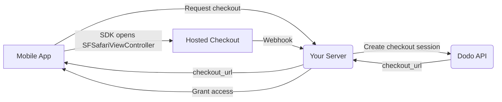

## Introduction

Dodo Payments empowers developers to sell digital goods and services in iOS apps, handling complex aspects like tax compliance, currency conversion, and payouts. This comprehensive guide details how to integrate Dodo Payments into your iOS app, specifically for SaaS tools, content subscriptions, and digital utilities.

## Overview

Dodo Payments serves as your **Merchant of Record (MoR)**, managing critical aspects of your digital business:

<Tabs>
<Tab title="What We Handle">
- Tax collection and remittance (VAT, GST, and other regional taxes)
- Global payments as per policies and local payment methods
- Currency conversion and foreign exchange
- Chargebacks and fraud prevention
- End-customer invoicing and receipts
- Compliance with regional regulations
</Tab>

<Tab title="What You Get">
- A unified API for web and mobile platforms
- Support for in-app checkouts (UPI, cards, wallets, BNPL)
- Global payout support (Payoneer, Wise, local bank transfers)
- Analytics and reporting dashboard
- Secure payment processing
</Tab>
</Tabs>

## Use Cases

<CardGroup cols={2}>
<Card title="Subscriptions" icon="repeat">
- Premium content or feature access
- Recurring billing with flexible options, Free trials, Proration, or Upgrades and downgrades
</Card>

<Card title="Courses and Learning" icon="graduation-cap">
- Pay-per-course access
- Bundled content packages
- Lifetime or renewable licenses
- Progress tracking integration
</Card>

<Card title="Digital Downloads" icon="download">
- One-time purchases (PDFs, music, tools)
- Digital asset delivery
- License key management
</Card>

<Card title="SaaS Tools" icon="screwdriver-wrench">
- Software-as-a-Service subscriptions
- Usage-based billing
- Team and enterprise plans
</Card>
</CardGroup>

## Integration Flow

Your app opens Dodo's hosted checkout with the
[iOS checkout SDK](/developer-resources/sdks/ios), which presents it in
`SFSafariViewController` and hands back a typed result.

<Warning>
Use the SDK rather than embedding checkout in a `WebView`. Apple Pay is only
available in a real browser surface, so a `WebView` silently costs you wallet
conversions — and payment flows inside a `WebView` are a common cause of App
Store review rejections.
</Warning>

### Integration Steps

<Steps>
<Step title="Mobile App to Your Server">
Your app asks your own backend for a checkout URL, authenticated with the
signed-in user's session token.
</Step>

<Step title="Your Server to Dodo API">
Your backend creates a [checkout session](/developer-resources/checkout-session)
with your API key and returns the `checkout_url` to the app.

<Warning>
Create checkout sessions on your server, never in the app. An API key shipped
inside an app binary can be extracted from the bundle.
</Warning>
</Step>

<Step title="Mobile App Opens Checkout">
Pass the `checkout_url` to `DodoCheckout.start(...)`. The SDK presents it in
`SFSafariViewController` and resolves with a typed result when the customer
completes or dismisses checkout.
</Step>

<Step title="Dodo Payments to Your Server">
Dodo Payments calls your webhook endpoint when the payment succeeds or the
subscription activates.
</Step>

<Step title="Your Server Grants Access">
Unlock the purchased content from that webhook, not from the result the app
received. The SDK result is a UI hint, not proof of payment.
</Step>
</Steps>

<CardGroup cols={2}>
<Card title="iOS Checkout SDK" icon="apple" href="/developer-resources/sdks/ios">
  Install steps and the full `start(...)` contract for Swift.
</Card>
<Card title="Mobile Integration Guide" icon="mobile" href="/developer-resources/mobile-integration">
  The end-to-end flow, plus the same contract for Android, React Native, and Flutter.
</Card>
</CardGroup>

## Regional Availability

Dodo Payments enables alternative in-app purchase flows only in App Store regions where Apple explicitly allows external payments, or where a regulator or court order mandates it.

### Supported Regions

<AccordionGroup>
<Accordion title="United States">
Supported to the extent permitted by current court orders and Apple's updated guidelines.

- Available under specific court-mandated provisions
- Subject to Apple's compliance with legal requirements
- Must follow Apple's implementation guidelines
</Accordion>

<Accordion title="European Union (EU) App Store">
Supported via Apple's EU Alternative Terms and External Purchase Entitlement.

- Enabled through Apple's EU Alternative Terms
- Requires External Purchase Entitlement approval
- Must comply with EU Digital Markets Act requirements
</Accordion>

<Accordion title="South Korea">
Supported through the StoreKit External Purchase Entitlement for Korea-only binaries.

- Available via StoreKit External Purchase Entitlement
- Requires Korea-specific app binary
- Must comply with Korean telecommunications law
</Accordion>
</AccordionGroup>

<Warning>
Always review and comply with Apple's region-specific entitlements and App Store Connect requirements before enabling Dodo Payments for any storefront. Using alternative payment flows in unsupported regions may result in app rejection or removal.
</Warning>

<Note>
For some business models - such as services or certain categories of content - Apple may not require the use of in-app purchase (IAP) at all. Dodo Payments supports these models as well. Always verify your app's classification and Apple's latest guidelines to determine if IAP is mandatory for your use case.
</Note>

### Learn More

For a detailed breakdown of global policies, legal precedents, and strategic approaches to bypassing App Store fees, see our comprehensive guide:

<Card title="Bypassing App Store & Play Store Fees: A Strategic and Legal Playbook" icon="shield-check" href="/features/bypassing-app-store-fees">
Learn where and how you can legally implement alternative payment flows, with up-to-date regional guidance and compliance tips.
</Card>