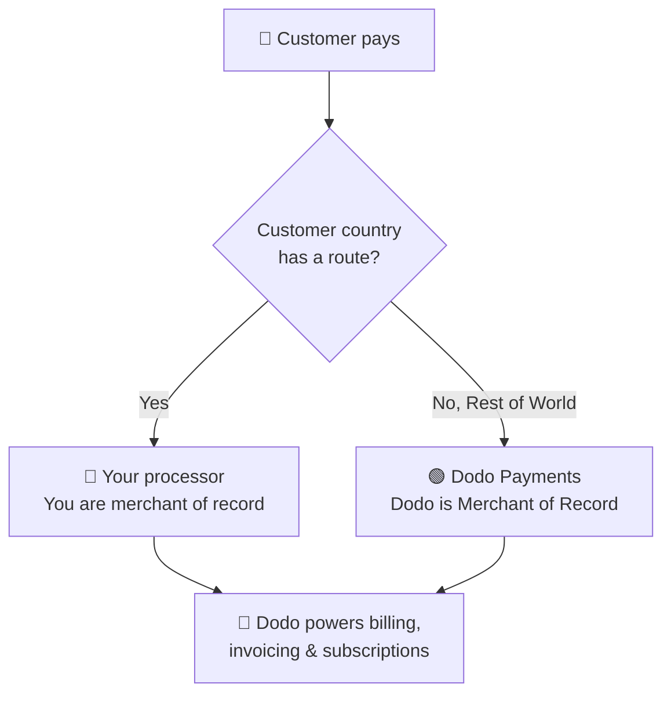

<Note>
Bring Your Own Processor (BYOP) is in **Beta**. Features and behaviour may change. [Talk to us](mailto:founders@dodopayments.com) to enable it for your account.
</Note>

**Bring Your Own Processor (BYOP)** lets you connect your own payment processor, such as Stripe or Adyen, and keep using Dodo Payments for everything that sits on top of the transaction: products, subscriptions, invoicing, the customer portal, and analytics.

You decide, per customer country, whether a payment is processed by **your processor** (you remain the merchant of record for that route) or by **Dodo Payments** as your full-service Merchant of Record. Countries you don't explicitly route fall back to Dodo automatically.

<CardGroup cols={2}>
<Card title="Route by geography" icon="globe">
Send payments from specific countries to your own processor, and everything else to Dodo.
</Card>

<Card title="Keep your processor accounts" icon="plug">
Continue using your existing Stripe or Adyen accounts and relationships.
</Card>

<Card title="Stay the merchant of record" icon="building">
On your own routes, you remain the legal seller and control tax, disputes, and payouts.
</Card>

<Card title="One billing layer" icon="layer-group">
Dodo powers products, subscriptions, invoices, and analytics across both routes.
</Card>
</CardGroup>

## BYOP vs. Dodo as Merchant of Record

When you enable BYOP you choose how each payment is handled. The two models can run side by side, routed by customer country.

| Feature | Dodo as Merchant of Record | Bring Your Own Processor |
|---------|----------------------------|--------------------------|
| Legal seller of record | Dodo Payments | Your company |
| Tax (VAT, GST & sales tax) | Calculated, collected & remitted for you | You register, collect & file |
| Chargebacks & fraud | Liability & protection handled by Dodo | You manage with your processor's own tools |
| PCI compliance | Handled by Dodo | You manage |
| Payment methods | 30+ global & local, multi-currency | Depends on your processor |
| Payouts | Aggregated global payouts | Direct from your processor |
| Setup | Simple, go live in minutes | Moderate, add keys & routing |
| Best for | Selling globally, hands-off compliance | Existing processor & regional control |

<Tip>
A common setup is **hybrid**: route a country where you already have a registered entity and processor (for example, your home market) to your own processor, and let Dodo handle the rest of the world as Merchant of Record.
</Tip>

## Supported processors

<CardGroup cols={2}>
<Card title="Stripe" icon="stripe" />
<Card title="Adyen" icon="credit-card" />
</CardGroup>

<Note>
Stripe connections require **raw card API access** on your Stripe account so that Dodo can power billing on top of your processor. Stripe grants this on request; the in-app setup links to instructions for requesting it.
</Note>

<Info>
Connections are configured **per environment**. The processor you connect in **test mode** (Sandbox) is separate from the one in **live mode** (Production); set up both if you want to test before going live. The setup wizard follows your dashboard's global test/live toggle.
</Info>

## Set up BYOP

Open **Settings → BYOP** in the dashboard and select **Configure** on the *Bring Your Own Processor* card to launch the setup wizard.

<Frame>

</Frame>

<Steps>
<Step title="Choose a payment processor">
Select the processor you want to connect, **Stripe** or **Adyen**, and continue.

<Frame>

</Frame>
</Step>

<Step title="Connect your account">
Give the connection a **Provider Name** (useful when you have multiple accounts from the same processor, e.g. *Stripe US* and *Stripe UK*), then enter your processor's **Secret Key** (for Stripe, your `sk_...` key).

For **Adyen**, also enter your **Merchant Account** identifier.

<Frame>

</Frame>

Saving creates the connection and generates a **Webhook Endpoint** unique to it. Add that URL as a webhook destination in your processor's dashboard, then paste the **Webhook Signing Secret** back into Dodo to finish:

- **Stripe**: paste the signing secret from the webhook endpoint you added.
- **Adyen**: paste the **HMAC key** from *Customer Area → Webhooks*.

<Note>
Your secret key is stored securely and can't be viewed or changed after saving. You only ever configure the Dodo-generated webhook URL in your processor; you never interact with the underlying infrastructure directly.
</Note>

<Tip>
Use **Verify connection** after saving to run a test call against your processor and confirm the keys and webhook secret are valid before you go live.
</Tip>
</Step>

<Step title="Configure payment routing">
Add **routing rules** that map customer countries to a processor. Each country can be routed to exactly one processor.

- **Your processor** handles payments from the countries you assign to it.
- **Dodo Payments** handles **Rest of the World** (every country you don't explicitly route) as Merchant of Record.

<Frame>

</Frame>

Use **Add Route** to assign one or more countries to a processor.

<Frame>

</Frame>

<Info>
**Routing guidelines**
- "Rest of World" covers all countries not listed above.
- Dodo Payments MoR routes handle compliance and tax automatically.
- Your own processor routes require separate tax configuration if needed.
</Info>
</Step>

<Step title="Configure invoice information">
For payments routed through your own processor, **you** are the seller on the invoice. Enter the business details that should appear on those invoices:

- **Registered Business Name** (required)
- **Tax ID** (EIN, SSN, etc.; optional, with format validation available for US EINs)
- **Statement Descriptor** (required): what customers see on their bank statement (5 to 22 characters)
- **Registered Business Address** (required): start typing to search and autofill your address
- **Privacy Policy** and **Terms of Service** links (required)

A live **Invoice Header Preview** shows how the details will appear. These details apply **only** to invoices for routes you handle through your own processor; Dodo-routed payments continue to use Dodo's Merchant of Record details.

<Frame>

</Frame>
</Step>

<Step title="Review and finish">
Review your processor connection, routing rules, and invoice details. Confirm that the routing and billing details are correct, then select **Finish setup**.

<Frame>

</Frame>
</Step>
</Steps>

Once configured, the BYOP card shows **Edit Configuration**, and you can return to MoR-only at any time with **Edit routing rules**.

<Frame>

</Frame>

## How routing works

Routing is determined by the **customer's country** at payment time. The same logic applies across one-time payments, checkout sessions, subscription sign-ups and renewals, and updates to payment methods.

On a route handled by **your processor**:

- The payment is processed on **your** processor account in the billing currency.
- **No tax is calculated or collected** by Dodo; you remain responsible for tax on that route.
- Invoices use the **business details and statement descriptor** you configured, with no Merchant of Record references.
- Payouts settle **directly to you** from your processor; nothing flows through Dodo's wallet.

On a route handled by **Dodo** (Rest of World), Dodo behaves exactly as your full-service Merchant of Record, handling tax, compliance, disputes, fraud, and aggregated payouts.

## Subscriptions

Subscriptions stay on the processor they were created on. At renewal, the same country-based routing picks the same processor used at sign-up, and the payment mandate stored against that processor is reused.

<Warning>
If you disable a connected processor that has active subscriptions routed to it, in-flight renewal charges on that processor will fail. These surface as failed payments in the dashboard, and your existing [dunning](/features/recovery/subscription-dunning) and recovery flows apply.
</Warning>

## Seeing which processor handled a payment

Once BYOP is configured, the **Payments** and **Disputes** tables show a processor icon (Stripe, Adyen, or Dodo) next to each row, and the payment and dispute detail pages include a **Payment Provider** field, so you can always tell which route handled a given transaction.

## Refunds, disputes & payouts

<Tabs>
<Tab title="Refunds">
You initiate refunds from the Dodo dashboard as usual. For payments routed through your own processor, the refund is executed on that processor; for Dodo-routed payments, Dodo processes the refund.
</Tab>

<Tab title="Disputes">
The Dodo dashboard shows disputes for **Dodo-processed** payments only.

> Only Dodo-processed disputes are shown here. Disputes on your own processor (e.g. Stripe) are managed in that processor's dashboard.

Evidence upload, accept, and challenge actions are available only for Dodo-processed disputes. Disputes on your processor are handled with your processor's own tools.
</Tab>

<Tab title="Payouts">
For routes on your own processor, your processor pays you **directly**; those payouts don't appear in Dodo.

> Only Dodo payouts are visible here. Payouts on your own processor occur in that processor.

Dodo payouts (for Rest-of-World MoR volume) follow the standard [payout structure](/features/payouts/payout-structure).
</Tab>
</Tabs>

## Analytics

Revenue, tax, and subscription analytics include **both** routes so you see the full picture of your billing. Disputes and payouts widgets show **Dodo-processed** activity only, with a banner indicating that activity on your own processor lives in that processor's dashboard.

## Billing fee

Dodo applies a small **BYOP billing fee** on payments routed through your own processor, since Dodo still powers your products, subscriptions, invoicing, and analytics on those transactions. It appears as a `byop_fee` line in your balance ledger. The default rate is **0.5%**; the exact rate is confirmed as part of enabling BYOP for your account. [Reach out](mailto:founders@dodopayments.com) for details.

## Frequently asked questions

<AccordionGroup>
<Accordion title="Which processors can I connect?">
Stripe and Adyen are supported today. Stripe connections require raw card API access on your Stripe account.
</Accordion>

<Accordion title="Can I route only some countries to my processor?">
Yes. Assign specific countries to your processor and leave the rest as **Rest of the World**, which Dodo handles as Merchant of Record. Each country routes to exactly one processor.
</Accordion>

<Accordion title="Who is the merchant of record on BYOP routes?">
You are. On routes handled by your own processor, you remain the legal seller and are responsible for tax, chargebacks, PCI compliance, and payouts on those transactions.
</Accordion>

<Accordion title="Does Dodo calculate tax on my processor's routes?">
No. Tax is not calculated or collected on routes handled through your own processor; you manage tax for those transactions. Dodo continues to handle tax on Dodo-routed (MoR) payments.
</Accordion>

<Accordion title="How do customers see my webhook setup?">
You only configure the Dodo-generated webhook URL in your processor's dashboard. You never interact with the underlying payment infrastructure directly.
</Accordion>

<Accordion title="What happens to active subscriptions if I disable a processor?">
Renewals routed to that processor will fail and surface as failed payments, triggering your existing dunning and recovery emails. Re-enable the processor or migrate the subscription to restore renewals.
</Accordion>
</AccordionGroup>

## Get started

<CardGroup cols={2}>
<Card title="Talk to us about BYOP" icon="envelope" href="mailto:founders@dodopayments.com">
BYOP is in beta. Contact us to enable it for your account.
</Card>

<Card title="What is Merchant of Record?" icon="building-columns" href="/features/mor-introduction">
Understand how Dodo's full-service MoR model works.
</Card>
</CardGroup>
