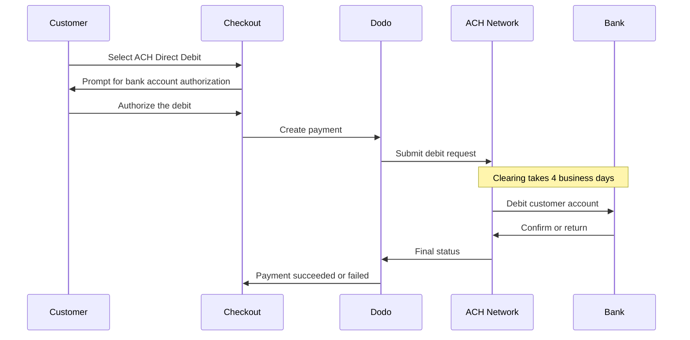

ACH Direct Debit lets customers in the United States pay directly from their bank account instead of using a card. It runs on the Automated Clearing House network and is offered on USD checkouts for one-time payments.

## Why Offer ACH Direct Debit?

<CardGroup cols={3}>
<Card title="Lower Processing Cost" icon="piggy-bank">
Bank debits typically cost less to process than card payments, especially on high-value orders.
</Card>

<Card title="No Card Required" icon="building-columns">
Reach US customers who prefer paying from a bank account or who don't want to use a card for large purchases.
</Card>

<Card title="Higher Value Orders" icon="chart-line">
ACH has no upper amount ceiling, making it well suited to large one-time purchases.
</Card>
</CardGroup>

## Overview

| Detail | Value |
| :----- | :---- |
| **Billing Currency** | USD |
| **Supported Countries** | United States |
| **Subscriptions** | No |
| **Min Amount** | $0.50 |
| **Settlement** | 4 business days |

<Warning>
ACH Direct Debit is not instant. A payment takes **4 business days** to confirm, so do not treat authorization as settlement — fulfill only once the payment reaches a succeeded state.
</Warning>

## How It Works



## Customer Experience

1. Customer selects ACH Direct Debit at checkout
2. Customer authorizes the debit against their US bank account
3. The payment is submitted to the ACH network and enters a processing state
4. Clearing completes over the following business days
5. The payment moves to a succeeded state, or fails if the bank returns it

<Info>
Because clearing is asynchronous, rely on [webhooks](/developer-resources/webhooks) to learn the final outcome rather than the checkout redirect. A successful redirect only means the customer authorized the debit.
</Info>

## Availability

ACH Direct Debit appears at checkout when all of the following are true:

- **Billing currency** is `USD`
- **Billing country** is `US`
- The transaction is a **one-time payment**

<Note>
ACH Direct Debit is not available for subscriptions. Its multi-day clearing window makes it unsuitable for recurring billing cycles. For recurring payments, use cards or another method that supports subscriptions — see the [Payment Methods overview](/features/payment-methods).
</Note>

## Configuration

```javascript
const session = await client.checkoutSessions.create({
  product_cart: [{ product_id: 'pdt_123', quantity: 1 }],
  allowed_payment_method_types: ['ach', 'credit', 'debit'],
  billing_currency: 'USD',
  billing_address: {
    country: 'US',
    zipcode: '94102'
  },
  return_url: 'https://example.com/success'
});
```

<Note>
ACH Direct Debit requires a **USD** billing currency and a **US** billing address. If you quote your prices in another currency, enable [Adaptive Currency](/features/adaptive-currency) so US customers are billed in USD and ACH becomes available.
</Note>

## API Method Type

| Type | Method | Country |
| :--- | :----- | :------ |
| `ach` | ACH Direct Debit | United States |

## Refunds and Disputes

Refunds and disputes for ACH payments use the same APIs and dashboard flows as every other payment method — there is no ACH-specific handling to implement.

<Warning>
Because ACH payments can be returned by the customer's bank after they appear to have gone through, avoid issuing refunds until the original payment has reached a succeeded state.
</Warning>

## Testing

<Steps>
<Step title="Enable test mode">
Use your Dodo Payments test API keys.
</Step>

<Step title="Set currency and billing address">
Set the billing currency to `USD` and the billing address country to `US`.
</Step>

<Step title="Include `ach` in allowed methods">
Pass `ach` in `allowed_payment_method_types`, or omit the field entirely to show every eligible method.
</Step>

<Step title="Complete the simulated bank flow">
Follow the simulated bank authorization flow in the test environment, then confirm your webhook handler receives the final payment status.
</Step>
</Steps>

### Test Bank Accounts

When entering bank details manually in test mode, use the routing number `110000000` with any of the account numbers below to force a specific outcome.

| Account Number | Routing Number | Behavior |
| :------------- | :------------- | :------- |
| `000123456789` | `110000000` | The payment succeeds. |
| `000222222227` | `110000000` | The payment fails due to insufficient funds. |
| `000111111113` | `110000000` | The payment fails because the account is closed. |
| `000111111116` | `110000000` | The payment fails because no account is found. |
| `000333333335` | `110000000` | The payment fails because debits aren't authorized on the account. |
| `000444444440` | `110000000` | The payment fails due to an invalid currency. |
| `000555555559` | `110000000` | The payment succeeds, then triggers a dispute. |
| `000666666661` | `110000000` | Micro-deposits fail to send. |
| `000777777771` | `110000000` | The payment fails because it exceeds the account's weekly volume limit. |
| `000000004954` | `110000000` | The payment is blocked by fraud screening as high risk. |
| `000000000009` | `110000000` | The payment stays in processing indefinitely — useful for testing cancellation. |

<Info>
Test accounts that automatically succeed or fail must be verified before the payment completes. Use the micro-deposit values below to verify them.
</Info>

### Test Micro-Deposit Verification

If the customer verifies with micro-deposits rather than instant bank verification, use either the deposit amounts or the descriptor code below to simulate each outcome.

| Micro-Deposit Amounts | Descriptor Code | Scenario |
| :-------------------- | :-------------- | :------- |
| `32` and `45` | `SM11AA` | The account verifies successfully. |
| `10` and `11` | `SM33CC` | The allowed number of verification attempts is exceeded. |
| `40` and `41` | `SM44DD` | Verification times out. |

<Note>
Test payments settle immediately rather than waiting the full clearing window, so you don't need to wait 4 business days to see a final status in test mode. Live payments still take the full time to clear.
</Note>

## Best Practices

<AccordionGroup>
<Accordion title="Don't fulfill on authorization">
ACH authorization is not payment. Wait for the payment to reach a succeeded state before granting access or shipping — a debit can still be returned by the customer's bank.
</Accordion>

<Accordion title="Set customer expectations at checkout">
Tell customers that bank payments take 4 business days to clear. This reduces support tickets asking why an order is still pending.
</Accordion>

<Accordion title="Provide card fallbacks">
Always include `credit` and `debit` alongside `ach` so customers who need instant access to your product can choose a faster method.
</Accordion>

<Accordion title="Use ACH for high-value one-time purchases">
The cost advantage of ACH grows with order value, and it has no upper amount limit. It is most useful on large one-time purchases rather than small ones.
</Accordion>
</AccordionGroup>

## Troubleshooting

<AccordionGroup>
<Accordion title="ACH not appearing at checkout">
**Check:**
1. Billing currency set to `USD`?
2. Customer billing country is `US`?
3. `ach` included in `allowed_payment_method_types`?
4. Is this a one-time payment? ACH is not offered on subscriptions.

**Solution:** Remove `allowed_payment_method_types` temporarily to see all eligible methods, then verify the billing currency and address country in your API request.
</Accordion>

<Accordion title="ACH not appearing on a subscription checkout">
**Cause:** ACH Direct Debit is only offered for one-time payments.

**Solution:** Use cards or another subscription-capable method for recurring billing.
</Accordion>

<Accordion title="Payment stuck in processing">
**Cause:** This is expected. ACH clearing takes 4 business days, so payments remain in a processing state far longer than card payments.

**Solution:** Wait for the final webhook. Do not retry the payment — retrying can debit the customer twice.
</Accordion>

<Accordion title="Payment failed after initially succeeding at checkout">
**Cause:** The customer's bank returned the debit — most commonly for insufficient funds or a closed account.

**Solution:** Treat the payment as failed and ask the customer to retry with another payment method. Always gate fulfillment on the succeeded state to avoid this.
</Accordion>
</AccordionGroup>

## Related Pages

<CardGroup cols={2}>
<Card title="Payment Methods Overview" icon="credit-card" href="/features/payment-methods">
See all supported payment methods.
</Card>

<Card title="Adaptive Currency" icon="globe" href="/features/adaptive-currency">
Currency support and automatic conversion.
</Card>

<Card title="Checkout Guide" icon="book" href="/developer-resources/checkout-session">
Complete checkout implementation guide.
</Card>

<Card title="Webhooks" icon="webhook" href="/developer-resources/webhooks">
Handle delayed payment confirmations asynchronously.
</Card>
</CardGroup>
