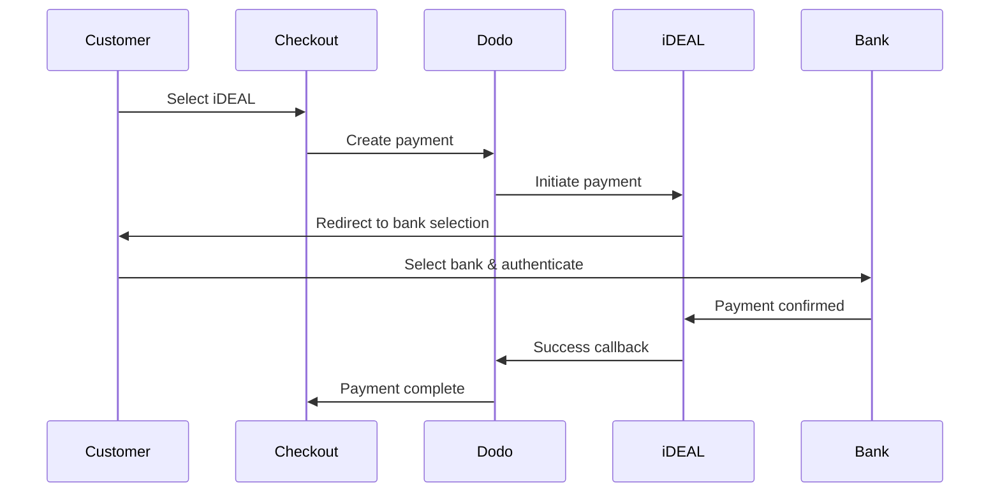
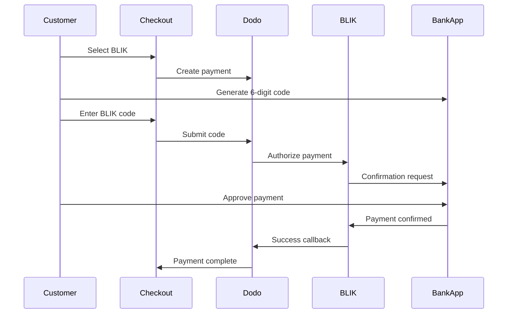
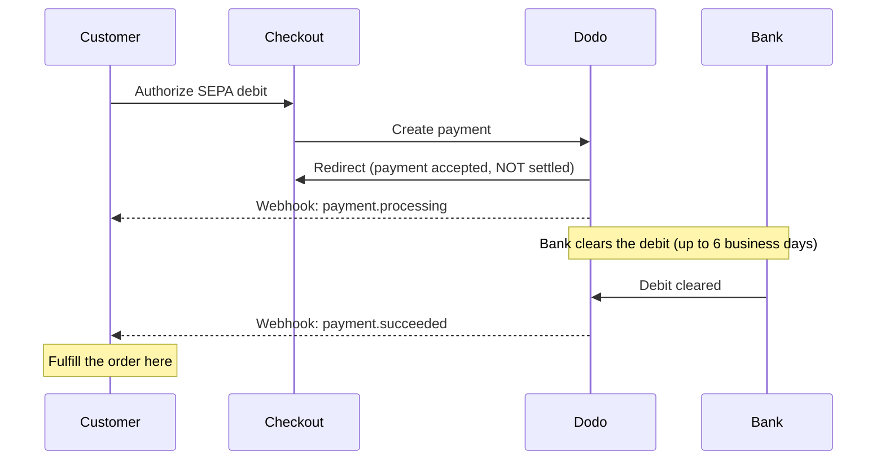

European customers strongly prefer local payment methods that integrate with their banking systems. Offering these methods can increase conversion rates by 20-40% in target markets.

## Why Local European Payment Methods?

<CardGroup cols={3}>
<Card title="Higher Conversion" icon="chart-line">
iDEAL captures ~60% of Dutch online payments. Not offering it means losing customers.
</Card>

<Card title="Lower Fraud" icon="shield-check">
Bank-authenticated payments have near-zero fraud rates and no chargebacks.
</Card>

<Card title="Real-Time Settlement" icon="bolt">
Most European methods provide instant payment confirmation.
</Card>
</CardGroup>

## Supported Methods

| Method | Country | Market Share | Currency | Subscriptions |
| :----- | :------ | :----------- | :------- | :-----------: |
| **iDEAL** | Netherlands | ~60% | EUR | No |
| **Bancontact** | Belgium | ~50% | EUR | No |
| **EPS** | Austria | ~30% | EUR | No |
| **Multibanco** | Portugal | ~40% | EUR | No |
| **BLIK** | Poland | ~60% | PLN | No |
| **SEPA Direct Debit** | Eurozone | Widely used | EUR | No |
| **Satispay** | Europe (Italy) | Growing | EUR | Yes |

## iDEAL (Netherlands)

iDEAL is the dominant online payment method in the Netherlands, connecting directly to all major Dutch banks.

### How It Works



### Supported Banks

All major Dutch banks are supported:
- ABN AMRO
- ASN Bank
- Bunq
- ING
- Knab
- Rabobank
- RegioBank
- Revolut
- SNS
- Triodos Bank
- Van Lanschot

### Configuration

```javascript
const session = await client.checkoutSessions.create({
  product_cart: [{ product_id: 'pdt_123', quantity: 1 }],
  allowed_payment_method_types: ['ideal', 'credit', 'debit'],
  billing_currency: 'EUR',
  billing_address: {
    country: 'NL',
    zipcode: '1012JS'
  },
  return_url: 'https://example.com/success'
});
```

## Bancontact (Belgium)

Bancontact is Belgium's national payment scheme, used by virtually all Belgian banks for online payments.

### Features
- Works with existing Belgian debit cards
- Mobile app support (Payconiq by Bancontact)
- Instant payment confirmation
- No additional registration needed for customers

### Configuration

```javascript
const session = await client.checkoutSessions.create({
  product_cart: [{ product_id: 'pdt_123', quantity: 1 }],
  allowed_payment_method_types: ['bancontact_card', 'credit', 'debit'],
  billing_currency: 'EUR',
  billing_address: {
    country: 'BE',
    zipcode: '1000'
  },
  return_url: 'https://example.com/success'
});
```

## EPS (Austria)

EPS (Electronic Payment Standard) enables direct online bank transfers for Austrian customers.

### Features
- Direct integration with Austrian banks
- Real-time payment confirmation
- High trust among Austrian consumers
- No chargebacks

### Supported Banks

Major Austrian banks including:
- Erste Bank
- Bank Austria
- Raiffeisen
- BAWAG
- Volksbank

### Configuration

```javascript
const session = await client.checkoutSessions.create({
  product_cart: [{ product_id: 'pdt_123', quantity: 1 }],
  allowed_payment_method_types: ['eps', 'credit', 'debit'],
  billing_currency: 'EUR',
  billing_address: {
    country: 'AT',
    zipcode: '1010'
  },
  return_url: 'https://example.com/success'
});
```

## Multibanco (Portugal)

Multibanco is Portugal's interbank network, offering both online payments and ATM-based payments.

### Payment Options

1. **Online Banking** — Direct bank transfer via internet banking
2. **ATM Payment** — Customer receives a reference to pay at any Multibanco ATM
3. **Mobile Banking** — Payment via bank mobile apps

### How ATM Payment Works

For ATM payments, customers receive a payment reference:

```
Entity: 12345
Reference: 123 456 789
Amount: €50.00
Expiry: 24 hours
```

Customer can pay at any Portuguese ATM or via online banking using this reference.

### Configuration

```javascript
const session = await client.checkoutSessions.create({
  product_cart: [{ product_id: 'pdt_123', quantity: 1 }],
  allowed_payment_method_types: ['multibanco', 'credit', 'debit'],
  billing_currency: 'EUR',
  billing_address: {
    country: 'PT',
    zipcode: '1000-001'
  },
  return_url: 'https://example.com/success'
});
```

<Note>
Multibanco ATM payments may have a delay between checkout and actual payment. Monitor webhooks for payment confirmation.
</Note>

## BLIK (Poland)

BLIK is Poland's most popular mobile payment method, allowing customers to pay using a one-time 6-digit code generated in their banking app. BLIK settles in **PLN** (Polish Złoty), not EUR.

### How It Works



### Availability

- **Billing currency:** PLN only
- **Transaction type:** One-time payments only (not available for subscriptions)
- **Coverage:** All major Polish banks supporting BLIK

### Configuration

```javascript
const session = await client.checkoutSessions.create({
  product_cart: [{ product_id: 'pdt_123', quantity: 1 }],
  allowed_payment_method_types: ['blik', 'credit', 'debit'],
  billing_currency: 'PLN',
  billing_address: {
    country: 'PL',
    zipcode: '00-001'
  },
  return_url: 'https://example.com/success'
});
```

<Note>
BLIK requires a **PLN** billing currency. If you quote your prices in EUR, enable [Adaptive Currency](/features/adaptive-currency) so Polish customers are billed in PLN and BLIK becomes available.
</Note>

## SEPA Direct Debit (Eurozone)

SEPA Direct Debit lets customers across the Eurozone pay directly from their bank account instead of using a card. It is offered on EUR checkouts for one-time payments.

<Warning>
**SEPA Direct Debit is not instant — a payment takes up to 6 business days to confirm.** Unlike every other method on this page, the customer authorizing the debit at checkout does **not** mean the money has cleared. Never fulfill the order on the checkout redirect or on `payment.processing`; wait for the `payment.succeeded` webhook.
</Warning>

### How It Works

The customer authorizes the debit during checkout, and Dodo Payments then collects the funds from their bank account. Because the bank clears the debit asynchronously, the payment moves through a `processing` state before it reaches a terminal outcome:



### Payment Timeline

| Stage | When | Payment status | What it means |
| :---- | :--- | :------------- | :------------ |
| **Authorization** | At checkout | `processing` | The customer approved the debit and was redirected back. The money has **not** moved yet — do not fulfill. |
| **Confirmation** | Up to **6 business days** later | `succeeded` | The bank cleared the debit. Fulfill the order now. |
| **Failure** | Up to **6 business days** later | `failed` | The debit could not be collected (e.g. insufficient funds). Do not fulfill; notify the customer. |

Because confirmation arrives days after the customer leaves your site, your webhook handler — not the checkout redirect — must be what grants access. See [Handling the Confirmation Delay](#handling-the-confirmation-delay) below.

### Availability

- **Billing currency:** EUR
- **Transaction type:** One-time payments only (not available for subscriptions)

### Configuration

```javascript
const session = await client.checkoutSessions.create({
  product_cart: [{ product_id: 'pdt_123', quantity: 1 }],
  allowed_payment_method_types: ['sepa', 'credit', 'debit'],
  billing_currency: 'EUR',
  billing_address: {
    country: 'DE',
    zipcode: '10115'
  },
  return_url: 'https://example.com/success'
});
```

### SEPA Test IBANs

In test mode, enter one of the IBANs below at checkout to force a specific outcome.

| Test IBAN | Behavior |
| :-------- | :------- |
| `DE89370400440532013000` | The payment succeeds. |
| `DE08370400440532013003` | The payment succeeds after a delay of at least three minutes. |
| `DE62370400440532013001` | The payment fails. |
| `DE78370400440532013004` | The payment fails after a delay of at least three minutes. |
| `DE35370400440532013002` | The payment succeeds, then is immediately disputed. |
| `DE65370400440002222227` | The payment fails due to insufficient funds. |
| `DE18370400440000066666` | The bank account is unusable, so the payment method can't be created. |

To test country-specific behavior, use the equivalent success IBAN for another Eurozone country:

| Country | Success IBAN |
| :------ | :----------- |
| Austria | `AT611904300234573201` |
| Belgium | `BE62510007547061` |
| Estonia | `EE382200221020145685` |
| Finland | `FI2112345600000785` |
| France | `FR1420041010050500013M02606` |
| Ireland | `IE29AIBK93115212345678` |
| Luxembourg | `LU280019400644750000` |

<Note>
The delayed test IBANs are useful for confirming that your webhook handler — rather than the checkout redirect — is what grants access, since SEPA payments confirm long after the customer leaves the checkout.
</Note>

### Handling the Confirmation Delay

Because SEPA settles up to 6 business days after checkout, you cannot rely on the browser redirect to know whether a payment cleared. Instead, drive fulfillment from webhook events. Switch on `payload.type` and handle each stage:

| Event Type | When it fires | What to do |
| :--------- | :------------ | :--------- |
| `payment.processing` | The customer authorized the debit at checkout and was redirected back. | **Do not fulfill.** Mark the order pending and, optionally, tell the customer their payment is being processed. |
| `payment.succeeded` | The bank cleared the debit (up to 6 business days later). | Fulfill the order — grant access, provision the product, send the receipt. |
| `payment.failed` | The debit could not be collected. | Notify the customer and prompt a retry; do not fulfill. |

```javascript Handling SEPA payment events expandable
app.post('/webhooks/dodo', async (req, res) => {
  const event = req.body;

  switch (event.type) {
    case 'payment.processing': {
      // SEPA debit authorized but NOT settled — this can last up to 6 business days.
      // Record the order as pending; do not grant access yet.
      await markOrderPending(event.data.payment_id);
      break;
    }
    case 'payment.succeeded': {
      // The debit cleared — safe to fulfill now.
      await fulfillOrder(event.data.payment_id);
      break;
    }
    case 'payment.failed': {
      // The debit could not be collected (e.g. insufficient funds).
      await markOrderFailed(event.data.payment_id);
      // Notify the customer and prompt a retry.
      break;
    }
  }

  res.json({ received: true });
});
```

<Tip>
Always **fulfill on `payment.succeeded` from the webhook**, never on the checkout redirect or on `payment.processing`. The redirect fires the moment the customer authorizes the debit — days before the money actually clears. Verify the webhook signature before processing; see the [Webhooks guide](/developer-resources/webhooks) for setup, and the [Webhook Event Guide](/developer-resources/webhooks/intents/webhook-events-guide) for the full event list.
</Tip>

<Warning>
Set customer expectations at checkout. Because access is only granted after the debit clears, tell SEPA customers their order is being processed and that they'll be notified once the payment confirms — otherwise they may expect instant access like a card payment.
</Warning>

## Satispay (Europe)

Satispay is a popular European mobile payment network, especially in Italy, that lets customers pay directly from their Satispay app without sharing card or bank details. Satispay settles in **EUR**.

### Features

- App-based payments independent of card networks
- Strong adoption across Italy and growing in other European markets
- Supports both one-time payments and subscriptions

### Availability

- **Billing currency:** EUR
- **Transaction type:** One-time payments and subscriptions

### Configuration

```javascript
const session = await client.checkoutSessions.create({
  product_cart: [{ product_id: 'pdt_123', quantity: 1 }],
  allowed_payment_method_types: ['satispay', 'credit', 'debit'],
  billing_currency: 'EUR',
  billing_address: {
    country: 'IT',
    zipcode: '00100'
  },
  return_url: 'https://example.com/success'
});
```

## API Method Types

| Type | Method | Country |
| :--- | :----- | :------ |
| `ideal` | iDEAL | Netherlands |
| `bancontact_card` | Bancontact | Belgium |
| `eps` | EPS | Austria |
| `multibanco` | Multibanco | Portugal |
| `blik` | BLIK | Poland |
| `sepa` | SEPA Direct Debit | Eurozone |
| `satispay` | Satispay | Europe (Italy) |

## Multi-Country European Checkout

For businesses serving multiple European countries, include all regional methods:

```javascript
const session = await client.checkoutSessions.create({
  product_cart: [{ product_id: 'pdt_123', quantity: 1 }],
  allowed_payment_method_types: [
    'ideal',           // Netherlands
    'bancontact_card', // Belgium
    'eps',             // Austria
    'multibanco',      // Portugal
    'blik',            // Poland (requires PLN billing currency)
    'sepa',            // Eurozone (one-time payments only)
    'satispay',        // Europe / Italy
    'credit',          // Fallback
    'debit'            // Fallback
  ],
  billing_currency: 'EUR',
  return_url: 'https://example.com/success'
});
```

Dodo automatically shows only the relevant methods based on customer location. A Dutch customer will see iDEAL; a Belgian customer will see Bancontact.

## Testing

European payment methods can be tested in Test Mode. The test flow simulates the bank authentication process.

<Note>
SEPA Direct Debit is tested differently — instead of a simulated bank flow, you enter a test IBAN directly. See [SEPA Test IBANs](#sepa-test-ibans).
</Note>

<Steps>
<Step title="Enable test mode">
Use your Dodo Payments test API keys.
</Step>

<Step title="Set appropriate billing address">
Set the billing address country to match the payment method:
- `NL` for iDEAL
- `BE` for Bancontact
- `AT` for EPS
- `PT` for Multibanco
- `PL` for BLIK (with PLN billing currency)
- `IT` for Satispay
</Step>

<Step title="Complete the test flow">
Follow the simulated bank authentication flow in the test environment.
</Step>
</Steps>

## Best Practices

<AccordionGroup>
<Accordion title="Always include regional methods for target markets">
If you sell to Dutch customers, include iDEAL. Not doing so is like not accepting Visa in the US — you'll lose significant sales.
</Accordion>

<Accordion title="Match currency to region">
Most European payment methods require EUR — ensure your pricing supports Euro transactions. The one exception is BLIK, which is offered only on **PLN** (Polish Złoty) billing.
</Accordion>

<Accordion title="Handle redirects gracefully">
All European methods involve redirects to bank sites. Ensure your return URL handling is robust and accounts for users who abandon mid-flow.
</Accordion>

<Accordion title="Provide card fallbacks">
Not all European customers have access to these regional methods (tourists, expats, etc.). Always include `credit` and `debit` as fallbacks.
</Accordion>

<Accordion title="Consider Multibanco timing">
Multibanco ATM payments may take hours to complete. Don't block fulfillment on immediate payment — use webhooks for async confirmation.
</Accordion>

<Accordion title="Account for the SEPA 6-day delay">
SEPA Direct Debit takes up to **6 business days** to confirm. Never fulfill on the checkout redirect or on `payment.processing` — grant access only from the `payment.succeeded` webhook, and set expectations at checkout so customers know their order is pending. See [Handling the Confirmation Delay](#handling-the-confirmation-delay).
</Accordion>
</AccordionGroup>

## Troubleshooting

<AccordionGroup>
<Accordion title="European method not appearing">
**Check:**
1. Customer billing country matches method's country?
2. Currency set to EUR?
3. Method included in `allowed_payment_method_types`?

**Solution:** European methods are strictly regional. A customer with billing country `DE` (Germany) won't see iDEAL, which is Netherlands-only.
</Accordion>

<Accordion title="Bank authentication failed">
**Causes:**
- Customer cancelled during bank authentication
- Bank's authentication system temporarily unavailable
- Customer entered incorrect credentials

**Solution:** Customer should retry. If persistent, suggest trying a different payment method.
</Accordion>

<Accordion title="Redirect not completing">
**Causes:**
- Customer closed browser during bank redirect
- Network issues during authentication
- Return URL misconfigured

**Solution:** Verify return URL is correct and accessible. Ensure it handles both success and failure states.
</Accordion>

<Accordion title="Multibanco payment pending">
**Cause:** Customer received payment reference but hasn't paid yet.

**Solution:** This is expected for ATM-based payments. Wait for webhook confirmation. Reference typically expires in 24-72 hours.
</Accordion>

<Accordion title="SEPA payment stuck in processing">
**Cause:** SEPA Direct Debit clears asynchronously through the customer's bank.

**Solution:** This is expected. A `payment.processing` state can last up to **6 business days** before the debit clears. Wait for the terminal `payment.succeeded` (fulfill) or `payment.failed` (do not fulfill) webhook — do not treat the checkout redirect as confirmation. See [Handling the Confirmation Delay](#handling-the-confirmation-delay).
</Accordion>
</AccordionGroup>

## PSD2 Compliance

All European payment methods comply with PSD2 (Payment Services Directive 2) regulations:

- **Strong Customer Authentication (SCA)** — Built into the bank authentication flow
- **Secure Communication** — All data transmitted via secure channels
- **Consumer Protection** — Full compliance with EU consumer rights

## Related Pages

<CardGroup cols={2}>
<Card title="Payment Methods Overview" icon="credit-card" href="/features/payment-methods">
See all supported payment methods.
</Card>

<Card title="Adaptive Currency" icon="globe" href="/features/adaptive-currency">
Currency support and automatic conversion.
</Card>

<Card title="Checkout Guide" icon="book" href="/developer-resources/checkout-session">
Complete checkout implementation guide.
</Card>

<Card title="Webhooks" icon="webhook" href="/developer-resources/webhooks">
Handle payment confirmations asynchronously.
</Card>
</CardGroup>