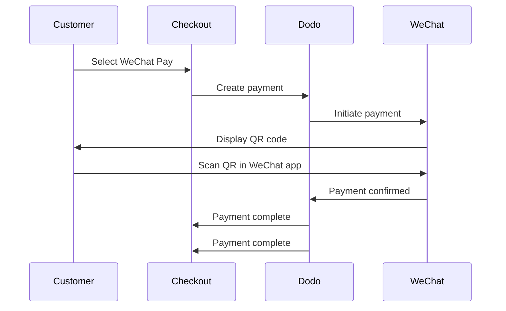

WeChat Pay is one of China's two dominant mobile payment platforms, used by over a billion people. It enables payments via QR codes within the WeChat app, making it essential for businesses targeting Chinese consumers.

## Why Offer WeChat Pay?

<CardGroup cols={3}>
<Card title="1B+ Users" icon="users">
WeChat Pay is used by over a billion people, making it one of the world's largest payment platforms.
</Card>

<Card title="Mobile-First" icon="mobile">
Payments are completed entirely within the WeChat app — fast, familiar, and frictionless for Chinese customers.
</Card>

<Card title="Dual Currency" icon="money-bill-transfer">
Accept payments in both USD and CNY, giving flexibility for cross-border and domestic transactions.
</Card>
</CardGroup>

## Overview

| Detail | Value |
| :----- | :---- |
| **Billing Currency** | USD, CNY |
| **Subscriptions** | No |
| **Min Amount** | $0.50 / ¥1.00 |
| **Settlement** | USD |

## How It Works



## Customer Experience

1. Customer selects WeChat Pay at checkout
2. A QR code is displayed on the checkout page
3. Customer opens WeChat on their phone and scans the QR code
4. Customer confirms payment in the WeChat app
5. Payment confirms instantly and customer is redirected to the success page

<Info>
Customers pay in USD or CNY, and you receive settlement in USD.
</Info>

## Configuration

```javascript
const session = await client.checkoutSessions.create({
  product_cart: [{ product_id: 'prod_123', quantity: 1 }],
  allowed_payment_method_types: ['wechat_pay', 'credit', 'debit'],
  return_url: 'https://example.com/success'
});
```

## API Method Type

| Type | Method | Currencies |
| :--- | :----- | :--------- |
| `wechat_pay` | WeChat Pay | USD, CNY |

## Testing

<Steps>
<Step title="Enable test mode">
Use your Dodo Payments test API keys.
</Step>

<Step title="Create a test checkout">
Create a checkout session with `wechat_pay` in the allowed payment methods.
</Step>

<Step title="Scan the QR code">
A test QR code will be generated — scan it with your normal phone camera (no WeChat app needed). You'll be redirected to a test page where you can simulate the transaction as a success or failure.
</Step>
</Steps>

## Best Practices

<AccordionGroup>
<Accordion title="Target Chinese customers">
WeChat Pay is primarily used by Chinese consumers. Include it when your customer base includes Chinese buyers or you're targeting the Chinese market.
</Accordion>

<Accordion title="Always include card fallbacks">
Not all customers have WeChat. Always include `credit` and `debit` as fallback payment methods.
</Accordion>

<Accordion title="Optimize for mobile">
Many WeChat Pay users browse on mobile. Ensure your checkout page is responsive — QR code scanning works best when the checkout is displayed on a desktop or tablet while the customer scans with their phone.
</Accordion>

<Accordion title="Consider both currencies">
WeChat Pay supports both USD and CNY. Choose the billing currency that best suits your target market — USD for cross-border, CNY for domestic Chinese transactions.
</Accordion>
</AccordionGroup>

## Troubleshooting

<AccordionGroup>
<Accordion title="WeChat Pay not appearing at checkout">
**Check:**
1. `wechat_pay` included in `allowed_payment_method_types`?
2. Billing currency set to USD or CNY?
3. Transaction amount meets minimum?

**Solution:** Verify the payment method type and currency are correctly passed in your API request.
</Accordion>

<Accordion title="QR code not scanning">
**Cause:** QR code may have expired, or the customer's WeChat version is outdated.

**Solution:** Refresh the checkout page to generate a new QR code. Ensure customer is using a current version of WeChat.
</Accordion>

<Accordion title="Payment not confirming">
**Cause:** WeChat Pay typically confirms instantly, but network delays can occur.

**Solution:** Monitor webhooks for payment confirmation. If payment doesn't confirm within a few minutes, the customer may need to retry.
</Accordion>
</AccordionGroup>

## Related Pages

<CardGroup cols={2}>
<Card title="Payment Methods Overview" icon="credit-card" href="/features/payment-methods">
See all supported payment methods.
</Card>

<Card title="Checkout Guide" icon="book" href="/developer-resources/checkout-session">
Complete checkout implementation guide.
</Card>

<Card title="Webhooks" icon="webhook" href="/developer-resources/webhooks">
Handle payment confirmations asynchronously.
</Card>

<Card title="Testing Process" icon="flask" href="/miscellaneous/testing-process">
Complete testing guide for all payment methods.
</Card>
</CardGroup>
