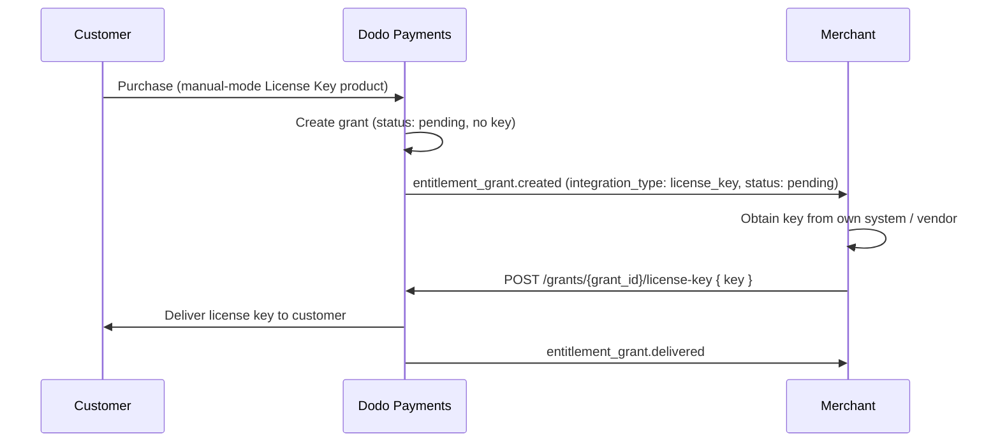

<Info>
By default, Dodo Payments generates and emails a license key the moment a customer pays. **Self-served license keys** flip that around: the purchase creates a `pending` grant with no key, notifies you, and waits for you to supply the key value yourself. Use it when keys come from your own system, a third-party vendor, or a finite pool of pre-printed codes.
</Info>

## When to Use Self-Served Keys

Auto fulfillment is the right default for most software licensing. Choose self-served (manual) fulfillment when Dodo Payments cannot mint the key itself:

- **Bring-your-own-keys**: The key is generated by your application, a desktop product, or your own license server.
- **Third-party vendors**: You resell keys issued by an upstream provider (a game key, an API credential, a partner platform).
- **Finite inventory**: You hand out codes from a pre-allocated pool and want to assign them one at a time.
- **Human review**: You want to vet a purchase before releasing access.

<Tip>
If Dodo Payments can generate the key for you, stay on auto fulfillment. Manual mode adds a step you are responsible for completing, otherwise the customer never receives a key.
</Tip>

## How It Works

Manual fulfillment changes only the issuance step of the standard [license key lifecycle](/features/license-keys#how-keys-are-issued). Activation, validation, deactivation, expiry, and revocation behave identically once the key is delivered.

<Steps>
<Step title="Customer pays">
A customer purchases a product carrying a License Key entitlement set to `manual` fulfillment.
</Step>

<Step title="A pending grant is created">
Dodo Payments creates the grant in `pending` status with **no license key attached**. The customer is not yet sent a key. A single [`entitlement_grant.created`](/developer-resources/webhooks/intents/entitlement-grant) webhook fires with `integration_type: "license_key"` and `status: "pending"`, telling you a key is awaiting fulfillment.
</Step>

<Step title="You supply the key">
Get the key value from your own system, then submit it by calling [`POST /grants/{grant_id}/license-key`](/api-reference/entitlements/fulfill-license-key) (or from the dashboard). The grant moves to `delivered`.
</Step>

<Step title="The customer receives the key">
The customer is sent the license key automatically, exactly as they would be under auto fulfillment, and `entitlement_grant.delivered` fires. From here the key behaves like any auto-generated key.
</Step>
</Steps>



## Enable Manual Fulfillment

Set `fulfillment_mode` on the License Key entitlement's integration config. It accepts two values:

| Value | Behavior |
|---|---|
| `auto` | Keys are generated and delivered automatically on payment or subscription. **This is the default** when `fulfillment_mode` is omitted. |
| `manual` | Each purchase creates a `pending` grant with no key. You supply the key via the fulfillment endpoint. |

<CodeGroup>
```typescript Node.js theme={null}
import DodoPayments from 'dodopayments';

const client = new DodoPayments({ bearerToken: process.env.DODO_PAYMENTS_API_KEY });

const entitlement = await client.entitlements.create({
  name: 'Pro License (Manual)',
  integration_type: 'license_key',
  integration_config: {
    fulfillment_mode: 'manual',
    activations_limit: 5,
    duration_count: 1,
    duration_interval: 'Year',
  },
});
```

```python Python theme={null}
client.entitlements.create(
    name="Pro License (Manual)",
    integration_type="license_key",
    integration_config={
        "fulfillment_mode": "manual",
        "activations_limit": 5,
        "duration_count": 1,
        "duration_interval": "Year",
    },
)
```

```bash cURL theme={null}
curl -X POST https://test.dodopayments.com/entitlements \
  -H "Authorization: Bearer $DODO_PAYMENTS_API_KEY" \
  -H "Content-Type: application/json" \
  -d '{
    "name": "Pro License (Manual)",
    "integration_type": "license_key",
    "integration_config": {
      "fulfillment_mode": "manual",
      "activations_limit": 5,
      "duration_count": 1,
      "duration_interval": "Year"
    }
  }'
```
</CodeGroup>

<Note>
`fulfillment_mode` is backward compatible. Existing License Key entitlements created before this feature have no `fulfillment_mode` set and continue to behave as `auto`. Switching an entitlement to `manual` only affects grants created **after** the change; keys already delivered are untouched.
</Note>

## Find Grants Awaiting Fulfillment

You have two ways to discover the grants you need to fulfill.

### Option A — React to the webhook

Subscribe to `entitlement_grant.created` and act when the payload is a pending license-key grant:

```typescript theme={null}
// Inside your webhook handler, after verifying the signature
if (
  event.type === 'entitlement_grant.created' &&
  event.data.integration_type === 'license_key' &&
  event.data.status === 'pending'
) {
  // A customer is waiting for a key. Queue it for fulfillment.
  await enqueueLicenseKeyFulfillment(event.data.id, event.data.customer_id);
}
```

The grant payload carries `integration_type: "license_key"` so you can recognize a license-key grant without an extra lookup. See the [Entitlement Grant webhook reference](/developer-resources/webhooks/intents/entitlement-grant) for the full payload.

### Option B — Poll the List Grants API

If you prefer not to rely on webhooks, list grants for the entitlement and filter by `integration_type` and `status`:

```typescript theme={null}
const pending = await client.entitlements.grants.list('ent_license_key_id', {
  integration_type: 'license_key',
  status: 'pending',
});

for (const grant of pending.items) {
  console.log(`Grant ${grant.id} for customer ${grant.customer_id} needs a key`);
}
```

Both `integration_type` and `status` are independent filters on the [List Grants](/api-reference/entitlements/list-grants) endpoint.

## Fulfill a Grant

Deliver the key with [`POST /grants/{grant_id}/license-key`](/api-reference/entitlements/fulfill-license-key). This endpoint requires a secret API key (Editor permission); it is **not** one of the public license endpoints.

```bash cURL theme={null}
curl -X POST https://test.dodopayments.com/grants/grant_8VbC6JDZ/license-key \
  -H "Authorization: Bearer $DODO_PAYMENTS_API_KEY" \
  -H "Content-Type: application/json" \
  -d '{
    "key": "PRO-AAAA-BBBB-CCCC-DDDD",
    "activations_limit": 5,
    "expires_at": "2027-05-01T00:00:00Z"
  }'
```

### Request fields

<ParamField body="key" type="string" required>
The license key string to deliver to the customer. Whitespace is trimmed; an empty or whitespace-only value is rejected.
</ParamField>

<ParamField body="activations_limit" type="integer">
Per-key activation limit for this key. Falls back to the entitlement config's `activations_limit` when omitted.
</ParamField>

<ParamField body="expires_at" type="string">
Per-key expiry timestamp (ISO 8601). Falls back to the entitlement config's duration when omitted. For subscription-issued grants, validity remains tied to the subscription regardless.
</ParamField>

### What happens on success

A successful call:

1. Records the key against the grant and moves the grant status to `delivered`. The key inherits the product, payment, and expiry from the grant; `activations_limit` and `expires_at` fall back to the entitlement config when you omit them.
2. Delivers the key to the customer automatically — the same email they would receive under auto fulfillment, subject to the customer's communication preference. You do not pass a flag or send the email yourself.
3. Fires `entitlement_grant.delivered`.

The response is the updated grant (`EntitlementGrantResponse`) with the populated `license_key` object.

<Check>
You do not need to email the key yourself — delivery happens automatically when the grant is fulfilled. This differs from [importing keys](/features/license-keys#import-existing-license-keys-via-api) via `POST /license_keys`, which intentionally does **not** notify the customer.
</Check>

## Error Handling and Retries

The endpoint validates the grant before delivering anything. Handle these responses:

| Status | Meaning | What to do |
|---|---|---|
| `200` | Key delivered, grant is now `delivered`. | Done. |
| `400` | The grant is not a license-key grant, or the key is empty/whitespace. | Fix the request; do not retry as-is. |
| `404` | No grant with that ID for your business. | Verify the `grant_id`. |
| `409` | The grant is not awaiting fulfillment (already delivered, not `pending`, or already has a key), **or** the key value already exists. | If already delivered, treat as success. If a duplicate key, supply a different key. |
| `422` | Request body failed validation (e.g. `activations_limit < 1`). | Correct the field and retry. |

<Warning>
Fulfillment is safe to retry on transient errors (timeouts, `5xx`). Each grant can be fulfilled only once, so a retry after a successful-but-unacknowledged call returns `409` ("Grant is not awaiting fulfillment") rather than issuing a second key or sending a duplicate email. Use the grant `id` as your idempotency key.
</Warning>

## Auto vs. Manual at a Glance

| | Auto fulfillment | Manual fulfillment |
|---|---|---|
| `fulfillment_mode` | `auto` (or omitted) | `manual` |
| Grant on purchase | `delivered`, key attached | `pending`, no key |
| `entitlement_grant.created` | `status: delivered` | `status: pending` |
| Key generation | Dodo Payments | You supply it |
| `source` on the key | `auto` | `manual` |
| Customer email | On purchase | When you call the fulfill endpoint |
| Your action required | None | Call `POST /grants/{grant_id}/license-key` |

## Related

<CardGroup cols={2}>
<Card title="License Keys" icon="key" href="/features/license-keys">
The full license key lifecycle: issuance, activation, validation, and revocation.
</Card>
<Card title="Fulfill License Key Grant" icon="code" href="/api-reference/entitlements/fulfill-license-key">
API reference for the manual fulfillment endpoint.
</Card>
<Card title="List Grants" icon="users" href="/api-reference/entitlements/list-grants">
Filter grants by `integration_type` and `status` to find pending work.
</Card>
<Card title="Entitlement Grant Webhooks" icon="webhook" href="/developer-resources/webhooks/intents/entitlement-grant">
The `entitlement_grant.*` events that signal pending and delivered grants.
</Card>
</CardGroup>
