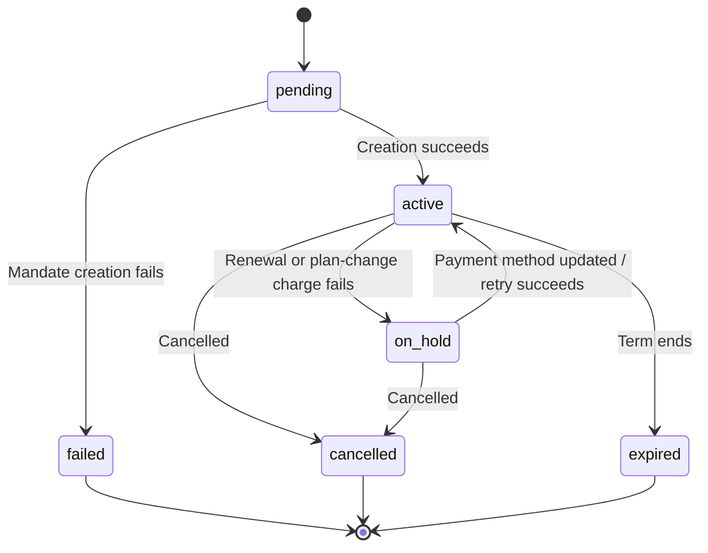

<Info>
A subscription moves through a defined set of statuses over its lifetime. This page is the reference for every status, what causes it, and how (or whether) you can recover it.
</Info>

## Status Reference

| Status | What it means | Recoverable? | Recovery path / next step |
|--------|---------------|--------------|---------------------------|
| `pending` | The subscription is being created or processed | — | Wait for `subscription.active` (or `subscription.failed`) |
| `active` | The subscription is active and will renew automatically | — | No action needed |
| `on_hold` | A renewal payment (or plan-change charge) failed; the subscription is paused | **Yes** | Update the payment method to reactivate — automatically via [Payment Retries](/features/recovery/payment-retries) and [Dunning](/features/recovery/subscription-dunning), or manually via the [Update Payment Method API](/api-reference/subscriptions/update-payment-method) |
| `cancelled` | The subscription was cancelled and will not renew | Re-purchase only | Customer must start a new subscription; [Dunning](/features/recovery/subscription-dunning) can prompt a re-purchase |
| `failed` | Subscription **creation** failed (the initial mandate or payment did not succeed) | **No — terminal** | Customer must create a new subscription with a working payment method |
| `expired` | The subscription reached the end of its term | — | Customer must start a new subscription if desired |

<Warning>
`on_hold` and `failed` are often confused. `on_hold` is a **recoverable** state for an already-active subscription whose renewal failed. `failed` is a **terminal** state that only occurs when the **initial** subscription creation fails — it cannot be reactivated.
</Warning>

## State Machine

## Webhook Events by Transition

Each transition emits a webhook so you can drive entitlement logic without polling:

| Transition | Event |
|------------|-------|
| Subscription activated | `subscription.active` |
| Renewal succeeds | `subscription.renewed` |
| Renewal fails → paused | `subscription.on_hold` |
| Creation fails | `subscription.failed` |
| Plan upgraded/downgraded | `subscription.plan_changed` |
| Cancelled | `subscription.cancelled` |
| Term ended | `subscription.expired` |
| Any field changes | `subscription.updated` |

<Card title="Subscription Webhook Payloads" icon="webhook" href="/developer-resources/webhooks/intents/subscription">
View the full payload schema for subscription lifecycle events.
</Card>

## Related

<CardGroup cols={2}>
<Card title="Subscriptions" icon="repeat" href="/features/subscription">
The full subscription product guide.
</Card>

<Card title="Revenue Recovery" icon="rotate" href="/features/recovery/overview">
Recover `on_hold` subscriptions automatically.
</Card>

<Card title="Handle Payment Failures" icon="screwdriver-wrench" href="/developer-resources/handle-payment-failures">
Read failure codes and decide when to retry.
</Card>

<Card title="Subscription Integration Guide" icon="credit-card" href="/developer-resources/subscription-integration-guide">
End-to-end integration including the on-hold → reactivate flow.
</Card>
</CardGroup>
