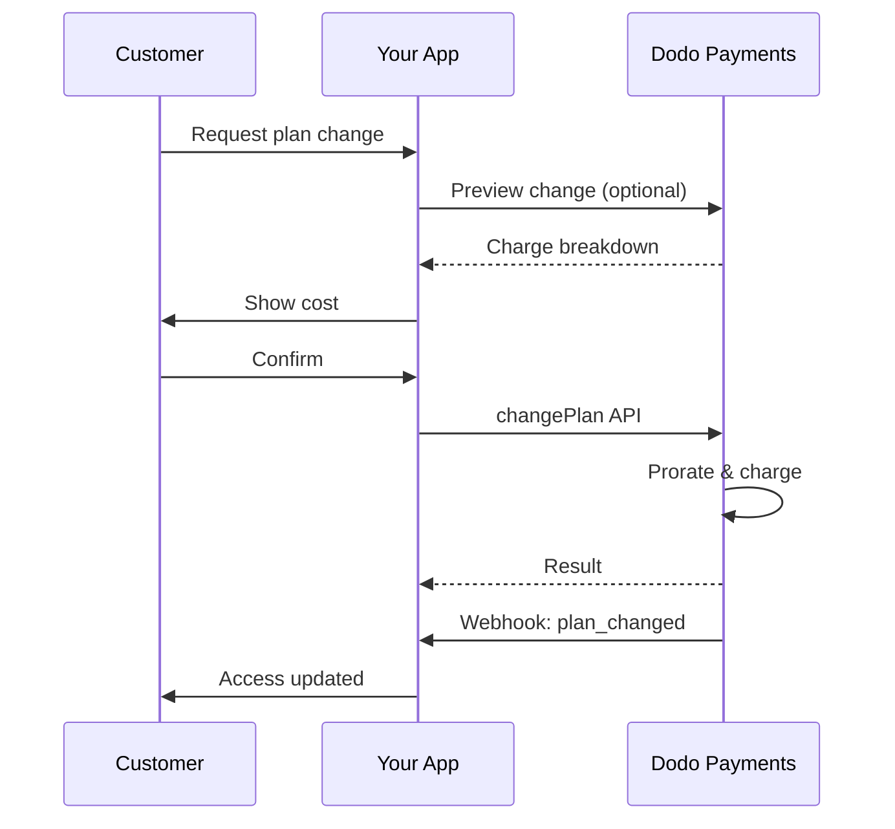
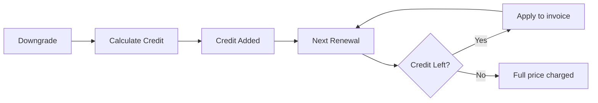
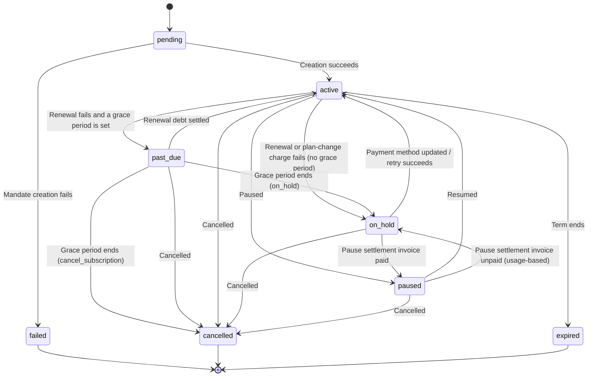

<Info>
Subscriptions let you sell ongoing access with automated renewals. Use flexible billing cycles, free trials, plan changes, and add‑ons to tailor pricing for each customer.
</Info>

<CardGroup cols={2}>
<Card title="Upgrade & Downgrade" icon="repeat" href="/developer-resources/subscription-upgrade-downgrade">
Control plan changes with proration and quantity updates.
</Card>

<Card title="On‑Demand Subscriptions" icon="bolt" href="/developer-resources/ondemand-subscriptions">
Authorize a mandate now and charge later with custom amounts.
</Card>

<Card title="Customer Portal" icon="id-card" href="/features/customer-portal">
Let customers manage plans, billing, and cancellations.
</Card>

<Card title="Subscription Webhooks" icon="code" href="/developer-resources/webhooks/intents/subscription">
React to lifecycle events like created, renewed, and canceled.
</Card>
</CardGroup>

## What Are Subscriptions?

Subscriptions are recurring products customers purchase on a schedule. They’re ideal for:

- **SaaS licenses**: Apps, APIs, or platform access
- **Memberships**: Communities, programs, or clubs
- **Digital content**: Courses, media, or premium content
- **Support plans**: SLAs, success packages, or maintenance


## Key Benefits

- **Predictable revenue**: Recurring billing with automated renewals
- **Flexible cycles**: Monthly, annual, custom intervals, and trials
- **Plan agility**: Proration for upgrades and downgrades
- **Add‑ons and seats**: Attach optional, quantifiable upgrades
- **Seamless checkout**: Hosted checkout and customer portal
- **Developer-first**: Clear APIs for creation, changes, and usage tracking

## Creating Subscriptions

Create subscription products in your Dodo Payments dashboard, then sell them through checkout or your API. Separating products from active subscriptions lets you version pricing, attach add‑ons, and track performance independently.

### Subscription product creation

Configure the fields in the dashboard to define how your subscription sells, renews, and bills. The sections below map directly to what you see in the creation form.

#### Product details

- **Product Name** (required): The display name shown in checkout, customer portal, and invoices.
- **Product Description** (required): A clear value statement that appears in checkout and invoices.
- **Product Image** (required): PNG/JPG/WebP up to 3 MB. Used on checkout and invoices.
- **Brand**: Associate the product with a specific brand for theming and emails.
- **Tax Category** (required): Choose the category (for example, SaaS) to determine tax rules.

<Tip>
Pick the most accurate tax category to ensure correct tax collection per region.
</Tip>

#### Pricing

- **Pricing Type**: Choose <b>Subscription</b> (this guide). Alternatives are Single Payment and Usage Based Billing.
- **Price** (required): Base recurring price with currency. The price must be at least **$1** (or the equivalent in your chosen currency). Amounts below this minimum are not supported and the subscription will not work.
- **Discount Applicable (%)**: Optional percentage discount applied to the base price; reflected in checkout and invoices.
- **Repeat payment every** (required): Interval for renewals, e.g., every 1 Month. Select the cadence (months or years) and quantity.
- **Subscription Period** (required): Total term for which the subscription remains active (e.g., 10 Years). After this period ends, renewals stop unless extended.
- **Trial Period Days** (required): Set trial length in days. Use 0 to disable trials. The first charge occurs automatically when the trial ends.
- **Trial Amount**: Optional upfront charge for a paid trial. Leave it unset for a free trial. See [Paid Trials](#paid-trials).
- **Select add‑on**: Attach up to 10 add‑ons that customers can purchase alongside the base plan.

<Warning>
Changing pricing on an active product affects new purchases. Existing subscriptions follow your plan‑change and proration settings.
</Warning>

<Info>
Add‑ons are ideal for quantifiable extras such as seats or storage. You can control allowed quantities and proration behavior when customers change them.
</Info>

#### Advanced settings

- **Tax Inclusive Pricing**: Display prices inclusive of applicable taxes. Final tax calculation still varies by customer location.
- **Generate license keys**: Issue a unique key to each customer after purchase. See the <a href="/features/license-keys">License Keys</a> guide.
- **Digital Product Delivery**: Deliver files or content automatically after purchase. Learn more in <a href="/features/digital-product-delivery">Digital Product Delivery</a>.
- **Metadata**: Attach custom key–value pairs for internal tagging or client integrations. See <a href="/api-reference/metadata">Metadata</a>.

<Tip>
Use metadata to store identifiers from your system (e.g., accountId) so you can reconcile events and invoices later.
</Tip>

## Subscription Trials

Trials let customers evaluate a subscription before paying the full recurring price. A trial can be **free**, where nothing is charged until the trial ends, or **paid**, where a reduced amount is charged upfront. In both cases the full price begins at the first renewal after the trial ends.

### Configuring Trials

Set **Trial Period Days** in the product pricing section (use `0` to disable). You can override this when creating subscriptions:

```typescript
// Via subscription creation
const subscription = await client.subscriptions.create({
  customer: { customer_id: 'cus_123' },
  billing: { country: 'US' },
  product_id: 'pdt_monthly',
  quantity: 1,
  trial_period_days: 14  // Overrides product's trial period
});

// Via checkout session
const session = await client.checkoutSessions.create({
  product_cart: [{ product_id: 'pdt_monthly', quantity: 1 }],
  subscription_data: { trial_period_days: 14 }
});
```

<Warning>
The `trial_period_days` value must be between 0 and 10,000 days.
</Warning>

### Paid Trials

Trials do not have to be free. Set a **Trial Amount** on a subscription product's recurring price to charge a reduced upfront fee for the trial window. The full recurring price then takes over at the first renewal.

<Frame>

</Frame>

Paid trials are configured on the product's price, not per subscription or per checkout session:

| Field | Type | Description |
|-------|------|-------------|
| `trial_amount` | integer | Amount charged today for the trial, in the price currency's minor units (for example, `500` for $5.00). Requires `trial_period_days > 0`. Omit or set to `null` for a free trial. |
| `trial_apply_discounts` | boolean | Whether checkout discount codes reduce the trial charge. Defaults to `false`, so the trial amount is charged in full even when a discount applies to the recurring price. |

```typescript
const product = await client.products.create({
  name: 'Pro Plan',
  tax_category: 'saas',
  price: {
    type: 'recurring_price',
    price: 2900,                      // $29.00 per month after the trial
    currency: 'USD',
    discount: 0,
    purchasing_power_parity: false,
    payment_frequency_count: 1,
    payment_frequency_interval: 'Month',
    subscription_period_count: 1,
    subscription_period_interval: 'Year',
    trial_period_days: 14,            // A paid trial requires a positive trial period
    trial_amount: 500,                // $5.00 charged today
    trial_apply_discounts: false      // Discounts apply to the recurring price only
  }
});
```

Paid trials flow through checkout as well. The trial amount is taxed, surfaced in checkout session calculations and payment link pricing, and Adaptive Currency markup is applied per currency. The [preview endpoint](/developer-resources/checkout-session) returns `trial_amount` and `trial_period_days` so you can show the amount due today before the subscription is created.

<Info>
Free trials are unchanged. Leaving **Trial Amount** unset keeps the existing behavior, where the first charge is `0` and the full price is charged when the trial ends.
</Info>

### Preventing Trial Misuse

**Prevent Trial Misuse** stops customers from repeatedly claiming trials for the same business. When enabled, a customer who has already redeemed a trial is automatically degraded to a **paid, no-trial purchase** instead of receiving a fresh trial.

<Frame>

</Frame>

Enable it from the **Subscriptions** tab in **Settings**. Once enabled:

- Customers are matched by **normalized email**, with plus-aliases stripped, so `user+trial@example.com` and `user@example.com` count as the same person.
- Redemptions are recorded at **trial activation**, so a customer who cancels the same day has still consumed their trial.
- Existing customers are backfilled from their historical trials by email, so past trial users are recognized immediately.

<Info>
The setting is **off by default**. See [Subscription Settings](/features/product-collections#subscription-settings) for the full list of business-level subscription controls.
</Info>

### Detecting Trial Status

<Warning>
Currently, there is no direct field to detect trial status. The following is a workaround that requires querying payments, which is inefficient. We are working on a more efficient solution.
</Warning>

To determine if a **free trial** subscription is in trial, retrieve the list of payments for the subscription. If there is exactly one payment with amount 0, the subscription is in trial period:

```typescript
const subscription = await client.subscriptions.retrieve('sub_123');
const payments = await client.payments.list({
  subscription_id: subscription.subscription_id
});

// Check if subscription is in trial
const isInTrial = payments.items.length === 1 && 
                  payments.items[0].total_amount === 0;
```

<Warning>
This zero-amount check only works for free trials. For a [paid trial](#paid-trials) the first payment equals the trial amount, not `0`. Compare the first payment against the subscription's `trial_amount` instead, or check whether `next_billing_date` is still within the trial window.
</Warning>

### Updating Trial Period

Extend the trial by updating `next_billing_date`:

```typescript
await client.subscriptions.update('sub_123', {
  next_billing_date: '2025-02-15T00:00:00Z'  // New trial end date
});
```

<Warning>
You cannot set `next_billing_date` to a past time. The date must be in the future.
</Warning>

## Subscription Plan Changes

Plan changes let you upgrade or downgrade subscriptions, adjust quantities, or migrate to different products. Depending on the proration mode you select, a change may trigger an immediate charge, create credit, or apply no billing adjustment.

<Tip>
You can change subscription plans and update the next billing date directly from the Dodo Payments dashboard. This provides a quick way to adjust subscriptions for customer support requests, promotional upgrades, or plan migrations without making API calls.
</Tip>

<Tip>
**Enable self-service plan changes:** Want customers to upgrade or downgrade their own subscriptions via the Customer Portal? Add your subscription products to a Product Collection and enable "Allow Subscription Updates" in your Subscription Settings.
</Tip>




<Card title="Product Collections" icon="layer-group" href="/features/product-collections">
  Group related products into collections to enable seamless upgrade/downgrade paths in the Customer Portal.
</Card>

### Proration Modes

Choose how customers are billed when changing plans:

<Info>
**Quick comparison of the four proration modes:**

| | `prorated_immediately` | `difference_immediately` | `full_immediately` | `do_not_bill` |
|---|---|---|---|---|
| **Upgrade** | Prorated charge for remaining days | Full price difference charged | Full new plan price charged | No charge — switch immediately |
| **Downgrade** | Prorated credit for remaining days | Full price difference as credit | No credit, full charge | No credit — switch immediately |
| **Billing cycle** | Resets to today | Resets to today | Resets to today | Stays the same |
| **Best for** | Fair time-based billing | Simple tier changes | Billing cycle resets | Free migrations or courtesy switches |
</Info>


#### `prorated_immediately`
Charges prorated amount based on remaining time in the current billing cycle. Best for fair billing that accounts for unused time.

```typescript
await client.subscriptions.changePlan('sub_123', {
  product_id: 'pdt_pro',
  quantity: 1,
  proration_billing_mode: 'prorated_immediately'
});
```

#### `difference_immediately`
Charges the price difference immediately (upgrade) or adds credit for future renewals (downgrade). Best for simple upgrade/downgrade scenarios.

```typescript
// Upgrade: charges $50 (difference between $30 and $80)
// Downgrade: credits remaining value, auto-applied to renewals
await client.subscriptions.changePlan('sub_123', {
  product_id: 'pdt_pro',
  quantity: 1,
  proration_billing_mode: 'difference_immediately'
});
```

<Info>
Credits from downgrades using `difference_immediately` are subscription-scoped and auto-applied to future renewals. They're distinct from <a href="/features/credit-based-billing">Credit-Based Billing</a> entitlements.
</Info>

When a customer downgrades with `difference_immediately`, the unused value becomes a subscription-scoped credit that automatically offsets future renewals:




#### `full_immediately`
Charges full new plan amount immediately, ignoring remaining time. Best for resetting billing cycles.

```typescript
await client.subscriptions.changePlan('sub_123', {
  product_id: 'pdt_monthly',
  quantity: 1,
  proration_billing_mode: 'full_immediately'
});
```

#### `do_not_bill`
Switches to the new plan without any billing adjustment. No proration charges, no credits — the customer simply moves to the new plan. Best for courtesy migrations, free plan switches, or scenarios where you want to absorb the cost difference.

```typescript
await client.subscriptions.changePlan('sub_123', {
  product_id: 'pdt_new_plan',
  quantity: 1,
  proration_billing_mode: 'do_not_bill'
});
```

<AccordionGroup>
<Accordion title="Example: Prorated upgrade calculation">

**Scenario**: Customer on Basic ($30/month) upgrades to Pro ($80/month) on day 16 of a 30-day cycle using `prorated_immediately`.

```
Unused credit from Basic = $30 × (15 remaining / 30 total) = $15.00
Prorated cost of Pro     = $80 × (15 remaining / 30 total) = $40.00
────────────────────────────────────────────────────────────────────
Immediate charge         = $40.00 − $15.00 = $25.00
```

Next renewal on **February 15** (January 16 + 30 days): **$80.00/month**.

<Tip>
For more detailed calculation examples and edge cases, see our full [Upgrade & Downgrade Guide](/developer-resources/subscription-upgrade-downgrade).
</Tip>

</Accordion>
<Accordion title="Example: Downgrade credit calculation">

**Scenario**: Customer on Pro ($80/month) downgrades to Starter ($20/month) using `difference_immediately`.

```
Credit = Old plan − New plan = $80 − $20 = $60.00
```

The $60 credit auto-applies to future renewals:
- Renewal 1: $20 − $20 (credit) = **$0.00** ($40 credit remaining)
- Renewal 2: $20 − $20 (credit) = **$0.00** ($20 credit remaining)  
- Renewal 3: $20 − $20 (credit) = **$0.00** (credit exhausted)
- Renewal 4: **$20.00** (full price)

<Info>
Learn more about how credits are managed in the [Upgrade & Downgrade Guide](/developer-resources/subscription-upgrade-downgrade).
</Info>

</Accordion>
</AccordionGroup>


### Changing Plans with Add-ons

Modify add-ons when changing plans. Add-ons are included in proration calculations:

```typescript
await client.subscriptions.changePlan('sub_123', {
  product_id: 'pdt_pro',
  quantity: 1,
  proration_billing_mode: 'difference_immediately',
  addons: [{ addon_id: 'addon_extra_seats', quantity: 2 }]  // Add add-ons
  // addons: []  // Empty array removes all existing add-ons
});
```

<Info>
By default (`effective_at: 'immediately'`) plan changes trigger immediate charges. Pass `effective_at: 'next_billing_date'` to schedule the change for the next billing date instead — the pending change is returned on the subscription as `scheduled_change`, and you can cancel it with [Cancel Scheduled Plan Change](/api-reference/subscriptions/cancel-change-plan). Failed charges may move the subscription to `on_hold` status, unless you pass `on_payment_failure: 'prevent_change'`, which keeps the subscription on its current plan until payment succeeds. Track changes via `subscription.plan_changed` webhook events. Plan changes are rejected while a subscription is `past_due` — see [Grace Period](#grace-period).
</Info>

### Previewing Plan Changes

Before committing to a plan change, preview the exact charge and resulting subscription:

```typescript
const preview = await client.subscriptions.previewChangePlan('sub_123', {
  product_id: 'pdt_pro',
  quantity: 1,
  proration_billing_mode: 'prorated_immediately'
});

// Show customer the charge before confirming
console.log('You will be charged:', preview.immediate_charge.summary);
```

<Card title="Preview Change Plan API" icon="eye" href="/api-reference/subscriptions/preview-change-plan">
  Preview plan changes before committing to them.
</Card>

## Pausing and Resuming Subscriptions

Pausing freezes a subscription instead of ending it. Billing stops, access is revoked, and the subscription keeps its plan and history so the customer can pick up exactly where they left off. Use it as a retention alternative to cancellation.

Open any active subscription under **Sales → Subscriptions** and click **Pause subscription**. The status changes to `paused` and renewals stop until the subscription is resumed.

<Frame>
    
</Frame>

### What Happens When You Pause

- **Renewals stop.** No invoice is generated and no renewal charge is attempted while the subscription is paused.
- **Access is revoked immediately.** Pausing revokes every delivered and pending [entitlement grant](/features/entitlements/introduction) on the subscription, which disables its [license keys](/features/license-keys) and stops new [digital product](/features/digital-product-delivery) download URLs from being issued. Resuming re-grants them, the same way recovering from `on_hold` does.
- **The billing clock freezes.** `next_billing_date` and `expires_at` both move forward by the exact length of the pause, so the customer keeps the time they already paid for.
- **There is no pause duration limit.** A paused subscription stays paused until someone resumes it. You do not set a pause length upfront.

<Warning>
Pausing revokes access straight away, not at the end of the billing period. If a subscription gates your product, make that clear to the customer before they confirm.
</Warning>

Resuming returns the subscription to `active` and restores its entitlements. Because the clock was frozen, the next renewal lands the paused duration later than originally scheduled — a subscription paused for 12 days renews 12 days late.

### Pausing Usage-Based Subscriptions

A [usage-based](/features/usage-based-billing/introduction) subscription can have usage that is recorded but not yet billed at the moment it is paused. **Bill Usage at Pause** under **Settings → Subscriptions** decides what happens to it:

| Setting | Behavior |
|---------|----------|
| **On** (default) | Dodo Payments raises an invoice for the usage accrued since the last billing date and collects it right away. |
| **Off** | The owed usage is carried forward and billed on the subscription's next regular invoice. |

Only metered usage is settled this way — the recurring base fee is never charged at pause time. Standard and on-demand subscriptions have nothing to settle, so this setting does not affect them.

<Info>
**Bill Usage at Pause** is recorded per billing cycle. Changing it mid-cycle does not change how the cycle already in progress settles; the new value applies from the next cycle onward.
</Info>

<Warning>
The settlement invoice is collected like any other invoice, so it can fail. If it goes unpaid past the [dunning](/features/recovery/subscription-dunning) grace period, the subscription moves to `on_hold` while remaining flagged as paused.
</Warning>

A subscription in that state has two ways out, and they differ in who absorbs the owed usage:

| Exit | Result |
|------|--------|
| The settlement invoice is paid | The subscription returns to `paused`, not `active`. Resume it explicitly when the customer is ready. |
| You resume it directly | The subscription goes straight to `active` and the unpaid settlement invoice is **voided**, along with its pending retries. The owed usage is written off. |

<Info>
Resuming is a valid exit from this hold — you do not have to collect the settlement invoice first. Just be aware that resuming forgives the outstanding usage rather than deferring it.
</Info>

### Letting Customers Pause Their Own Subscriptions

**Allow Subscription Pause** under **Settings → Subscriptions** controls whether customers can pause and resume from the Customer Portal. It is **off by default**, so self-service pause is opt-in.

<Frame>
    
</Frame>

This setting only governs the Customer Portal. You can always pause and resume from the dashboard or the API, whichever way the toggle is set.

Turning it off stops new customer pauses, but it does not trap a customer who is already paused — they can still resume a pause they started themselves. Pauses you started stay under your control.

<Card title="Pausing from the Customer Portal" icon="id-card" href="/features/customer-portal#pausing-a-subscription">
See what the customer sees, including the confirmation dialog.
</Card>

### Pausing via API

Pause and resume run through the `status` field on the update subscription endpoint. There is no separate pause endpoint.

```typescript
// Pause
await client.subscriptions.update('sub_123', { status: 'paused' });

// Resume
await client.subscriptions.update('sub_123', { status: 'active' });
```

<Warning>
Send `paused` or `active` on its own — combining either with any other field is rejected with `422`. The older boolean `pause` field has been removed and now always fails with `422`, so a caller still on it gets a loud error instead of a silent no-op.
</Warning>

Pausing emits `subscription.paused` and resuming emits `subscription.unpaused`. Both carry the full subscription object, with `paused_at` set while paused and `null` once resumed.

### Pause and Other Subscription Actions

- **Cancellation still works.** You can cancel a paused subscription exactly as you would an active one. Any open settlement invoice from the pause is voided when you do.
- **Scheduled plan changes are delayed, not dropped.** A [plan change](#subscription-plan-changes) scheduled for the next billing date sits untouched while the subscription is paused, then applies at the shifted billing date once it resumes. Its `scheduled_change.effective_at` is a snapshot from when it was scheduled and is not adjusted for the pause, so it can show a date in the past — read it as "was scheduled for", not as a guaranteed date. To drop the change instead of letting it ride, use [Cancel Scheduled Plan Change](/api-reference/subscriptions/cancel-change-plan).

## Subscription States

A subscription moves through a defined set of statuses over its lifetime. This table is the reference for every status, what causes it, and how (or whether) you can recover it.

| Status | What it means | Recoverable? | Recovery path / next step |
|--------|---------------|--------------|---------------------------|
| `pending` | The subscription is being created or processed | — | Wait for `subscription.active` (or `subscription.failed`) |
| `active` | The subscription is active and will renew automatically | — | No action needed |
| `past_due` | A renewal payment failed and the [grace period](#grace-period) is open; the customer keeps full access and renewals have stopped | **Yes** | Settle the renewal debt before the deadline — see [Grace Period](#grace-period) |
| `on_hold` | A renewal payment (or plan-change charge) failed; renewals have stopped, and access is revoked | **Yes** | Update the payment method to reactivate — automatically via [Payment Retries](/features/recovery/payment-retries) and [Dunning](/features/recovery/subscription-dunning), or manually via the [Update Payment Method API](/api-reference/subscriptions/update-payment-method) |
| `paused` | The subscription was deliberately paused by you or the customer; billing is frozen and access is revoked | **Yes** | Resume it with `status: active`, or from the Customer Portal when self-service pause is enabled — see [Pausing and Resuming Subscriptions](#pausing-and-resuming-subscriptions) |
| `cancelled` | The subscription was cancelled and will not renew | Re-purchase only | Customer must start a new subscription; [Dunning](/features/recovery/subscription-dunning) can prompt a re-purchase |
| `failed` | Subscription **creation** failed (the initial mandate or payment did not succeed) | **No — terminal** | Customer must create a new subscription with a working payment method |
| `expired` | The subscription reached the end of its term | — | Customer must start a new subscription if desired |

<Warning>
`on_hold` and `failed` are often confused. `on_hold` is a **recoverable** state for an already-active subscription whose renewal failed. `failed` is a **terminal** state that only occurs when the **initial** subscription creation fails — it cannot be reactivated.
</Warning>

<Info>
`past_due` and `on_hold` are both involuntary, and they differ in one place: `past_due` keeps the customer's access, `on_hold` removes it. A subscription reaches `past_due` only when you enable a [grace period](#grace-period). Without one, a failed renewal goes straight to `on_hold`.
</Info>

<Info>
`on_hold` and `paused` are also distinct. `on_hold` is involuntary — a payment failed. `paused` is deliberate — you or the customer chose to freeze the subscription, and no renewal is attempted while it stays paused. A usage-based subscription can still owe a one-off settlement invoice at the moment it is paused; see [Pausing Usage-Based Subscriptions](#pausing-usage-based-subscriptions).
</Info>

### State Machine



### On Hold State

A subscription enters `on_hold` state when:

- A renewal payment fails (insufficient funds, expired card, etc.)
- A plan change charge fails
- Payment method authorization fails
- A [pause settlement invoice](#pausing-usage-based-subscriptions) for a usage-based subscription goes unpaid
- A [grace period](#grace-period) ends with the renewal debt unpaid, and the expiry action is `on_hold`

<Info>
If you set a grace period, a failed renewal moves the subscription to `past_due` first. It reaches `on_hold` only when the window ends.
</Info>

<Warning>
When a subscription is in `on_hold` state, it will not renew automatically. You must update the payment method to reactivate the subscription.
</Warning>

### Reactivating from On Hold

To reactivate a subscription from `on_hold` state, update the payment method. This automatically:

1. Creates a charge for remaining dues
2. Generates an invoice
3. Processes the payment using the new payment method
4. Reactivates the subscription to `active` state upon successful payment

<Note>
The one exception is a hold caused by an unpaid pause settlement invoice. Clearing that invoice returns the subscription to `paused`, not `active`, because pause is where it was before the payment failed. Resume it explicitly once the invoice is settled.
</Note>

```typescript
// Reactivate subscription from on_hold
const response = await client.subscriptions.updatePaymentMethod('sub_123', {
  payment_method: {
    type: 'new',
    return_url: 'https://example.com/return'
  }
});

// For on_hold subscriptions, a charge is automatically created
if (response.payment_id) {
  console.log('Charge created:', response.payment_id);
  // Redirect customer to response.payment_link to complete payment
  // Monitor webhooks for payment.succeeded and subscription.active
}
```

<Info>
After successfully updating the payment method for an `on_hold` subscription, you'll receive `payment.succeeded` followed by `subscription.active` webhook events.
</Info>

### Grace Period

A grace period is a window between a failed renewal and the loss of access. The subscription moves to `past_due` instead of `on_hold`, and the customer keeps everything they bought until the window ends. This gives the customer time to fix a card without losing your product.

Grace periods are **off by default**. Enable one from **Settings → Subscription → Subscription Grace Period** in your dashboard.

#### Settings

| Setting | Values | Description |
|---------|--------|-------------|
| Enabled | on / off | Turns the grace period on for the business. Off by default. |
| Length | 1 to 30 days | How long the window stays open. The default is 3 days. |
| On expiry | `on_hold` or `cancel_subscription` | What happens to the subscription when the window ends unpaid. |

#### What happens during the window

While a subscription is `past_due`:

- The customer keeps access. Entitlement grants, license keys and digital product downloads all stay live.
- Usage-based billing keeps recording usage.
- The subscription does **not** renew.
- The subscription cannot be paused.
- [Dunning](/features/recovery/subscription-dunning) email goes out, and [payment retries](/features/recovery/payment-retries) continue.
- `subscription.past_due` is emitted at entry.

The `subscription.past_due` webhook carries the deadline as `past_due_ends_at`. Store it when the event arrives — the subscription API does not return this field.

<Info>
The window is fixed when the subscription enters it. If you change the length or the expiry action later, a window that is already open keeps the values it was given. The new values apply to the next subscription that enters a window.
</Info>

#### Recovery

The window closes when the renewal debt is settled — through a successful retry, or when the customer updates the payment method. The subscription returns to `active`, and a `subscription.active` webhook is sent.

Only the failed renewal opens a window. An unrelated merchant charge that goes unpaid does not move a subscription to `past_due`.

#### When the window ends

If the renewal debt is still unpaid at the deadline, the subscription moves to `on_hold` or to `cancelled`, as you configured. At the same time:

- A scheduled plan change on the subscription is cancelled.
- A pending plan change whose invoice is still unpaid is cancelled.

If the expiry action is `cancel_subscription`, the open invoices are also voided, and their payment retries stop.

<Note>
A pending plan change whose invoice was **paid** is applied while the window is still open, not at the deadline. A paid invoice settles the change whatever the subscription status.
</Note>

<Warning>
Plan changes are rejected while a subscription is `past_due`. Settle the renewal debt first.
</Warning>

### Webhook Events by Transition

Each transition emits a webhook so you can drive entitlement logic without polling:

| Transition | Event |
|------------|-------|
| Subscription activated | `subscription.active` |
| Renewal succeeds | `subscription.renewed` |
| Renewal fails, grace period opens | `subscription.past_due` |
| Renewal fails → on hold | `subscription.on_hold` |
| Subscription paused | `subscription.paused` |
| Paused subscription resumed | `subscription.unpaused` |
| Creation fails | `subscription.failed` |
| Plan upgraded/downgraded | `subscription.plan_changed` |
| Cancelled | `subscription.cancelled` |
| Term ended | `subscription.expired` |
| Any field changes | `subscription.updated` |

<Card title="Subscription Webhook Payloads" icon="webhook" href="/developer-resources/webhooks/intents/subscription">
View the full payload schema for subscription lifecycle events.
</Card>

## API Management

<AccordionGroup>
<Accordion title="Create subscriptions">
Use `POST /checkouts` to create subscriptions programmatically from products, with optional trials (`subscription_data.trial_period_days`) and add‑ons (`product_cart[].addons`).

<Warning>
`POST /subscriptions` is deprecated. Existing integrations keep working, but new integrations should use [Checkout Sessions](/api-reference/checkout-sessions/create).
</Warning>

<Card title="API Reference" icon="code" href="/api-reference/checkout-sessions/create">
View the create checkout session API.
</Card>
</Accordion>

<Accordion title="Update subscriptions">
Use `PATCH /subscriptions/{subscription_id}` to cancel at the next billing date, extend the subscription period, update billing details, or modify metadata. To change the quantity, use the [Change Plan API](/api-reference/subscriptions/change-plan) instead — `PATCH` does not accept `quantity`.

<Card title="API Reference" icon="code" href="/api-reference/subscriptions/patch-subscriptions">
Learn how to update subscription details.
</Card>
</Accordion>

<Accordion title="Pause and resume subscriptions">
Pause and resume run through the same `PATCH /subscriptions/{subscription_id}` endpoint using the `status` field: `status: paused` pauses an active subscription and `status: active` resumes it. Neither value can be combined with any other field in the same request. For the full behavior, billing effects, and related business settings, see [Pausing and Resuming Subscriptions](#pausing-and-resuming-subscriptions).

<Card title="API Reference" icon="code" href="/api-reference/subscriptions/patch-subscriptions">
View the update subscription API, including the `status` field.
</Card>
</Accordion>

<Accordion title="Change plans (proration)">
Change the active product and quantities with proration controls.

<Card title="API Reference" icon="code" href="/api-reference/subscriptions/change-plan">
Review plan change options.
</Card>
</Accordion>

<Accordion title="On‑demand charges">
For on‑demand subscriptions, charge specific amounts on demand.

<Card title="API Reference" icon="code" href="/api-reference/subscriptions/create-charge">
Charge an on‑demand subscription.
</Card>
</Accordion>

<Accordion title="List and retrieve">
Use `GET /subscriptions` to list all subscriptions and `GET /subscriptions/{id}` to retrieve one.

<Card title="API Reference" icon="code" href="/api-reference/subscriptions/get-subscriptions">
Browse listing and retrieval APIs.
</Card>
</Accordion>

<Accordion title="Usage history">
Fetch recorded usage for metered or hybrid pricing models.

<Card title="API Reference" icon="code" href="/api-reference/subscriptions/get-usage-history">
See usage history API.
</Card>
</Accordion>

<Accordion title="Update payment method">
Update the payment method for a subscription. For active subscriptions, this updates the payment method for future renewals. For subscriptions in `on_hold` state, this reactivates the subscription by creating a charge for remaining dues.

When generating a new payment-method link (the `New` request type), you can pass `allowed_payment_method_types` to restrict which payment methods the customer sees on that page. Customers will never see a method that isn't in the list, though including a method does not guarantee it appears (availability still depends on factors like customer location and your business settings).

<Card title="API Reference" icon="code" href="/api-reference/subscriptions/update-payment-method">
Learn how to update payment methods and reactivate subscriptions.
</Card>
</Accordion>
</AccordionGroup>

## Common Use Cases

- **SaaS and APIs**: Tiered access with add‑ons for seats or usage
- **Content and media**: Monthly access with introductory trials
- **B2B support plans**: Annual contracts with premium support add‑ons
- **Tools and plugins**: License keys and versioned releases

## Integration Examples

### Checkout Sessions (subscriptions)
When creating checkout sessions, include your subscription product and optional add‑ons:

```typescript
const session = await client.checkoutSessions.create({
  product_cart: [
    {
      product_id: 'pdt_subscription',
      quantity: 1
    }
  ]
});
```


### Plan changes with proration
Upgrade or downgrade a subscription and control proration behavior:

```typescript
await client.subscriptions.changePlan('sub_123', {
  product_id: 'pdt_new',
  quantity: 1,
  proration_billing_mode: 'difference_immediately'
});
```

### Cancel at next billing date
Schedule a cancellation that takes effect at the end of the current billing period:

```typescript
await client.subscriptions.update('sub_123', {
  cancel_at_next_billing_date: true
});
```

### Extend the subscription period
Extend how long a subscription runs by passing a new `subscription_period_count` and `subscription_period_interval` to `PATCH /subscriptions/{subscription_id}`. The subscription's expiry is recomputed from the new count and interval — for example, to grant a customer extra time on their current plan:

```typescript
await client.subscriptions.update('sub_123', {
  subscription_period_count: 5,
  subscription_period_interval: 'Month'
});
```

<Note>
A subscription's period can only be **increased**, never shortened.
</Note>

### On‑demand subscriptions
Create an on‑demand subscription and charge later as needed:

```typescript
const onDemand = await client.subscriptions.create({
  customer: { customer_id: 'cus_123' },
  billing: { country: 'US' },
  product_id: 'pdt_on_demand',
  quantity: 1,
  on_demand: { mandate_only: true }
});

await client.subscriptions.charge(onDemand.subscription_id, {
  product_price: 4900,
  product_currency: 'USD',
  product_description: 'Extra usage for September'
});
```

### Update payment method for active subscription
Update the payment method for an active subscription:

```typescript
// Update with new payment method
const response = await client.subscriptions.updatePaymentMethod('sub_123', {
  payment_method: {
    type: 'new',
    return_url: 'https://example.com/return'
  }
});

// Or use existing payment method
await client.subscriptions.updatePaymentMethod('sub_123', {
  payment_method: {
    type: 'existing',
    payment_method_id: 'pm_abc123'
  }
});
```

### Reactivate subscription from on_hold
Reactivate a subscription that went on hold due to failed payment:

```typescript
// Update payment method - automatically creates charge for remaining dues
const response = await client.subscriptions.updatePaymentMethod('sub_123', {
  payment_method: {
    type: 'new',
    return_url: 'https://example.com/return'
  }
});

if (response.payment_id) {
  // Charge created for remaining dues
  // Redirect customer to response.payment_link
  // Monitor webhooks: payment.succeeded → subscription.active
}
```

## Subscriptions with RBI-Compliant Mandates

  UPI and Indian card subscriptions operate under RBI (Reserve Bank of India) regulations with specific mandate requirements:

  ### Mandate Limits

  The mandate type and amount depend on your subscription's recurring charge:

  - **Charges below the mandate floor (default ₹15,000):** We create an on-demand mandate for the floor amount. The subscription amount is charged periodically according to your subscription frequency, up to the mandate limit.
  - **Charges at or above the mandate floor:** We create a subscription mandate (or on-demand mandate) for the exact subscription amount.

  The mandate floor is configurable per merchant or per request via `mandate_min_amount_inr_paise` (INR paise). The amount registered with the bank is `max(mandate_floor, billing_amount)` — so the floor effectively becomes the customer-facing authorization ceiling whenever billing is lower.

For detailed information about RBI-compliant mandates and the configurable mandate floor for Indian payment methods, see the <a href="/features/payment-methods/india#configurable-mandate-floor">India Payment Methods</a> page.

  ### Upgrade and Downgrade Considerations

  **Important:** When upgrading or downgrading subscriptions, carefully consider the mandate limits:

  - If an upgrade/downgrade results in a charge amount that exceeds Rs 15,000 and goes beyond the existing on-demand payment limit, the transaction charge may fail.
  - In such cases, the customer may need to update their payment method or change the subscription again to establish a new mandate with the correct limit.


  ### Authorization for High-Value Charges

  For subscription charges of Rs 15,000 or more:

  - The customer will be prompted by their bank to authorize the transaction.
  - If the customer fails to authorize the transaction, the transaction will fail and the subscription will be put on hold.

  ### 48-Hour Processing Delay

  **Processing Timeline:** Recurring charges on Indian cards and UPI subscriptions follow a unique processing pattern:

  - Charges are **initiated** on the scheduled date according to your subscription frequency.
  - The actual **deduction** from the customer's account occurs only after **48 hours** from payment initiation.
  - This 48-hour window may extend up to **2-3 additional hours** depending on bank API responses.

  ### Mandate Cancellation Window

  During the 48-hour processing window:

  - Customers can cancel the mandate via their banking apps.
  - If a customer cancels the mandate during this period, the subscription will remain **active** (this is an edge case specific to Indian card and UPI AutoPay subscriptions).
  - However, the actual deduction may fail, and in that case, we will put the subscription **on hold**.

  **Edge Case Handling:** If you provide benefits, credits, or subscription usage to customers immediately upon charge initiation, you need to handle this 48-hour window appropriately in your application. Consider:

  - Delaying benefit activation until payment confirmation
  - Implementing grace periods or temporary access
  - Monitoring subscription status for mandate cancellations
  - Handling subscription hold states in your application logic

  <Tip>
  Monitor subscription webhooks to track payment status changes and handle edge cases where mandates are cancelled during the 48-hour window.
  </Tip>

## Best Practices

- **Start with clear tiers**: 2–3 plans with obvious differences
- **Communicate pricing**: Show totals, proration, and next renewal
- **Use trials thoughtfully**: Convert with onboarding, not just time
- **Leverage add‑ons**: Keep base plans simple and upsell extras
- **Test changes**: Validate plan changes and proration in test mode


<Info>
Subscriptions are a flexible foundation for recurring revenue. Start simple, test thoroughly, and iterate based on adoption, churn, and expansion metrics.
</Info>