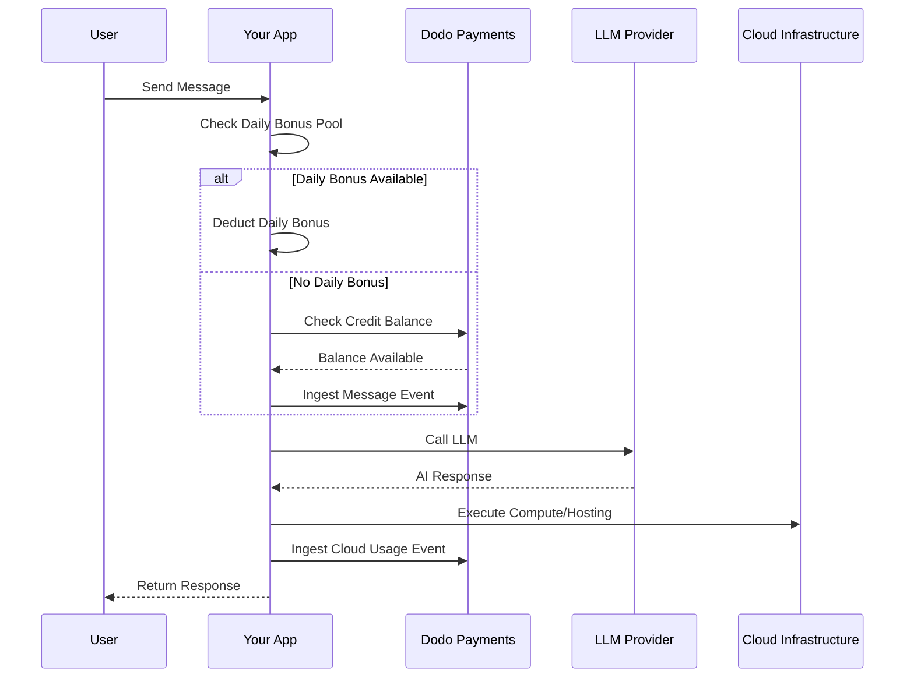

Lovable (lovable.dev) est un créateur d'applications web AI qui utilise un modèle d'abonnement basé sur des crédits. Contrairement aux systèmes basés sur des jetons, Lovable simplifie l'expérience utilisateur en facturant un crédit par message. Ce modèle combine un pool de crédits mensuel avec un bonus quotidien pour encourager un engagement constant tout en permettant une utilisation intense.

## Modèle de Facturation Lovable

La tarification de Lovable est basée sur des crédits de message et sur une facturation séparée pour l'infrastructure cloud mesurée.

| Plan | Prix | Crédits Mensuels | Bonus Quotidien | Caractéristiques Clés |
| :--- | :--- | :--- | :--- | :--- |
| Gratuit | 0$/mois | 0 | 5/jour (jusqu'à 30/mois) | Projets publics seulement |
| Pro | 25$/mois | 100 | 5/jour (jusqu'à 150/mois au total) | Recharges à la demande, Cloud + AI basé sur l'utilisation, domaines personnalisés |
| Business | 50$/mois | 100 | 5/jour | SSO, espace de travail d'équipe, modèles de conception, centre de sécurité |
| Enterprise | Personnalisé | Personnalisé | Personnalisé | SCIM, support dédié, journaux d'audit |

- **Abonnement basé sur des crédits** : 1 crédit = 1 message/question à l'AI.
- **Crédits partagés entre utilisateurs illimités** : Pool à l'échelle de l'équipe, pas par siège.
- **Les crédits se réinitialisent chaque cycle de facturation** : Les crédits mensuels se renouvellent à chaque renouvellement.
- **Recharges de crédits à la demande** : Les utilisateurs peuvent acheter plus de crédits s'ils manquent.
- **Facturation séparée Cloud + AI basée sur l'utilisation** : Facturation mesurée pour l'hébergement et le calcul.
- **Crédits bonus quotidiens se réinitialisent chaque jour** : Un bonus quotidien de 5 crédits à utiliser ou perdre.

## Ce qui le Rend Unique

- **Simplicité basée sur le message** : 1 crédit = 1 message peu importe la complexité. Pas de comptage de jetons ou de pondération des modèles.
- **Hybridation du bonus quotidien + pool mensuel** : Les 5 crédits bonus quotidiens créent un incitatif d'engagement quotidien, tandis que les 100 crédits mensuels permettent une utilisation intense.
- **Pool partagé à l'échelle de l'équipe** : Crédits partagés entre utilisateurs illimités pour un prix d'équipe fixe, pas par siège.
- **Facturation à deux niveaux** : Crédits pour les interactions AI + facturation mesurée séparée pour l'infrastructure cloud.

## Construisez Cela avec Dodo Payments

Vous pouvez reproduire le modèle hybride de Lovable en utilisant les droits de crédit et les compteurs basés sur l'utilisation de Dodo Payments.

<Steps>
  <Step title="Create a Custom Unit Credit Entitlement">
    Définissez le système de crédits de message dans votre tableau de bord Dodo Payments. Ce droit gère le pool de crédits mensuel.

    - **Type de Crédit** : Unité Personnalisée
    - **Nom de l'Unité** : "Messages"
    - **Précision** : 0
    - **Expiration du Crédit** : 30 jours
    - **Dépassement** : Désactivé (limite stricte quand les crédits atteignent 0)
  </Step>

  <Step title="Create Subscription Products">
    Créez vos plans et attachez le droit de crédit. Pour le plan Gratuit, vous gérez le bonus quotidien via la logique d'application.

    - **Gratuit** : 0$/mois, 0 crédits (bonus quotidien géré par la logique de l'application)
    - **Pro** : 25$/mois, 100 crédits/cycle, attachez le droit de crédit
    - **Business** : 50$/mois, 100 crédits/cycle, attachez le droit de crédit

    ```typescript
    import DodoPayments from 'dodopayments';

    const client = new DodoPayments({
      bearerToken: process.env.DODO_PAYMENTS_API_KEY,
    });

    const session = await client.checkoutSessions.create({
      product_cart: [
        { product_id: 'pdt_lovable_pro', quantity: 1 }
      ],
      customer: { email: 'user@example.com' },
      return_url: 'https://lovable.dev/dashboard'
    });
    ```

  </Step>

  <Step title="Create a Usage Meter for Cloud + AI">
    Lovable facture séparément pour l'infrastructure cloud. Créez un compteur pour suivre ces coûts.

    - **Nom du Compteur** : `cloud.compute_seconds`
    - **Agrégation**: Somme sur propriété `compute_seconds`

    Attachez ce compteur à vos produits d'abonnement avec tarification par unité. Lorsque vous ingérez l'utilisation, Dodo calcule le coût en fonction de vos tarifs.

    ```typescript
    await client.usageEvents.ingest({
      events: [{
        event_id: `compute_${Date.now()}`,
        customer_id: 'cust_123',
        event_name: 'cloud.compute_seconds',
        timestamp: new Date().toISOString(),
        metadata: {
          compute_seconds: 3600,
          project_id: 'proj_abc'
        }
      }]
    });
    ```

  </Step>

  <Step title="Implement Daily Bonus Credits (Application Logic)">
    Le bonus quotidien est géré au niveau de l'application. Vous pouvez utiliser un cron job pour attribuer ces crédits ou les suivre séparément dans votre base de données.

    Pour suivre l'utilisation de ces crédits bonus dans Dodo sans épuiser immédiatement le solde principal, vous pouvez utiliser un nom d'événement distinct ou gérer la logique dans votre application pour vérifier d'abord le pool de bonus.

    ```typescript
    // Example cron job logic (pseudo-code)
    // Every day at midnight UTC:
    // 1. Reset 'daily_bonus_used' to 0 for all users in your DB
    
    // When a user sends a message:
    async function handleMessage(userId: string) {
      const user = await db.users.findUnique({ where: { id: userId } });
      
      if (user.daily_bonus_used < 5) {
        // Use daily bonus
        await db.users.update({
          where: { id: userId },
          data: { daily_bonus_used: { increment: 1 } }
        });
        // Track for analytics but don't deduct from Dodo credits yet
        await client.usageEvents.ingest({
          events: [{
            event_id: `msg_bonus_${Date.now()}`,
            customer_id: userId,
            event_name: 'ai.message.bonus',
            timestamp: new Date().toISOString(),
            metadata: { type: 'daily_bonus' }
          }]
        });
      } else {
        // Deduct from Dodo credit entitlement
        await client.usageEvents.ingest({
          events: [{
            event_id: `msg_${Date.now()}`,
            customer_id: userId,
            event_name: 'ai.message',
            timestamp: new Date().toISOString(),
            metadata: { type: 'subscription_credit' }
          }]
        });
      }
    }
    ```

  </Step>

  <Step title="Send Usage Events for Messages">
    Suivez chaque message AI en tant qu'événement d'utilisation. Reliez l'événement `ai.message` à votre droit de crédit "Messages" dans le tableau de bord Dodo.

    ```typescript
    await client.usageEvents.ingest({
      events: [{
        event_id: `msg_${Date.now()}`,
        customer_id: 'cust_123',
        event_name: 'ai.message',
        timestamp: new Date().toISOString(),
        metadata: {
          content_length: 450,
          project_id: 'proj_abc',
          feature_type: 'editor'
        }
      }]
    });
    ```

  </Step>

  <Step title="Handle Webhooks for Low Balance">
    Informez les utilisateurs lorsqu'ils manquent de crédits afin qu'ils puissent recharger ou mettre à jour.

    ```typescript
    import DodoPayments from 'dodopayments';
    import express from 'express';

    const app = express();
    app.use(express.raw({ type: 'application/json' }));

    const client = new DodoPayments({
      bearerToken: process.env.DODO_PAYMENTS_API_KEY,
      webhookKey: process.env.DODO_PAYMENTS_WEBHOOK_KEY,
    });

    app.post('/webhooks/dodo', async (req, res) => {
      try {
        const event = client.webhooks.unwrap(req.body.toString(), {
          headers: {
            'webhook-id': req.headers['webhook-id'] as string,
            'webhook-signature': req.headers['webhook-signature'] as string,
            'webhook-timestamp': req.headers['webhook-timestamp'] as string,
          },
        });

        if (event.type === 'credit.balance_low') {
          const { customer_id, available_balance } = event.data;
          await notifyUser(customer_id, `Your balance is low: ${available_balance} messages left.`);
        }

        res.json({ received: true });
      } catch (error) {
        res.status(401).json({ error: 'Invalid signature' });
      }
    });
    ```

  </Step>
</Steps>

## Accélérez avec le Plan d'Ingestion LLM

Le [Plan d'Ingestion LLM](/developer-resources/ingestion-blueprints/llm) simplifie le suivi en enveloppant votre client AI.

```typescript
import { createLLMTracker } from '@dodopayments/ingestion-blueprints';
import OpenAI from 'openai';

const tracker = createLLMTracker({
  apiKey: process.env.DODO_PAYMENTS_API_KEY,
  environment: 'live_mode',
  eventName: 'ai.message',
});

const trackedClient = tracker.wrap({
  client: new OpenAI(),
  customerId: 'cust_123',
});

// Automatically tracks the message and deducts 1 credit (if configured)
await trackedClient.chat.completions.create({
  model: 'gpt-4o',
  messages: [{ role: 'user', content: 'Build a landing page' }],
});
```

<Tip>
  Consultez la [documentation complète du plan](/developer-resources/ingestion-blueprints/llm) pour plus de détails sur le suivi automatique.
</Tip>

## Vue d'Ensemble de l'Architecture



## Fonctionnalités Clés de Dodo Utilisées

Explorez les fonctionnalités qui rendent cette implémentation possible.

<CardGroup cols={2}>
  <Card title="Credit-Based Billing" icon="coins" href="/features/credit-based-billing">
    Gérez les crédits de message et les pools partagés d'équipe.
  </Card>
  <Card title="Subscriptions" icon="calendar" href="/features/subscription">
    Configurez des plans récurrents pour les niveaux Pro et Business.
  </Card>
  <Card title="Usage-Based Billing" icon="chart-line" href="/features/usage-based-billing/introduction">
    Mesurez l'utilisation de l'infrastructure cloud séparément des crédits AI.
  </Card>
  <Card title="Event Ingestion" icon="bolt" href="/features/usage-based-billing/event-ingestion">
    Envoyez des événements de message et de calcul à haut volume à Dodo.
  </Card>
  <Card title="Webhooks" icon="webhook" href="/developer-resources/webhooks/intents/credit">
    Automatisez les notifications pour les soldes de crédit bas.
  </Card>
  <Card title="LLM Ingestion Blueprint" icon="brain-circuit" href="/developer-resources/ingestion-blueprints/llm">
    Simplifiez le suivi de l'utilisation AI avec des intégrations préconstruites.
  </Card>
</CardGroup>
