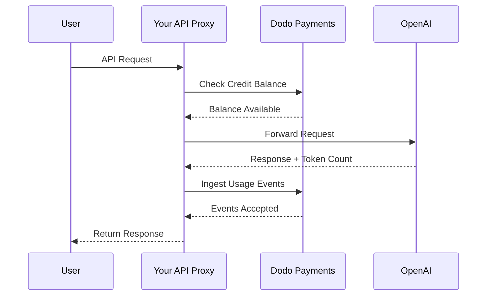
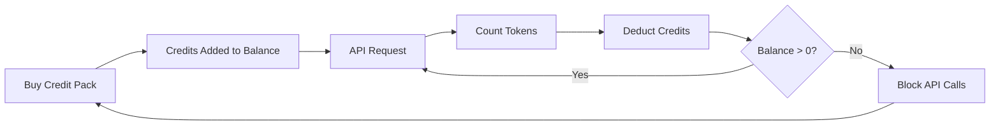

Le modèle de facturation d'OpenAI est la référence absolue pour les entreprises d'IA. Il combine des crédits prépayés en monnaie fiduciaire pour l'utilisation de l'API avec des abonnements à tarif fixe pour les produits grand public. Cette approche hybride garantit des revenus prévisibles tout en permettant aux développeurs d'augmenter leur utilisation sans friction.

## Pourquoi le modèle d'OpenAI est la référence

Le secteur de l'IA fait face à des défis spécifiques que la facturation SaaS traditionnelle ne prend pas toujours en compte. Le modèle d'OpenAI résout plusieurs de ces problèmes simultanément.

1. **Revenus prévisibles et faible risque** : en exigeant des crédits prépayés pour l'utilisation de l'API, OpenAI élimine le risque que les utilisateurs accumulent d'importantes factures qu'ils ne peuvent pas payer. Vous recevez l'argent à l'avance et l'utilisateur bénéficie du service au fur et à mesure de son utilisation.
2. **Évolutivité pour les développeurs** : un rechargement de 5 $ constitue une faible barrière à l'entrée. À mesure que leur application se développe, les développeurs peuvent automatiser les rechargements ou acheter des packs plus importants. La friction au démarrage est presque nulle, tandis que le potentiel de croissance est illimité.
3. **Psychologie des utilisateurs** : libeller les crédits en monnaie fiduciaire (USD), plutôt qu'en « tokens » ou « points » abstraits, rend leur valeur claire. Cela ressemble à un compte bancaire pour les services d'IA, ce qui renforce la confiance et facilite la budgétisation des entreprises.

## Comment OpenAI facture

OpenAI utilise deux modèles de facturation distincts qui répondent à des besoins utilisateurs différents.

1. **API (paiement à l'utilisation)** : l'API utilise des crédits prépayés libellés en monnaie fiduciaire. Les utilisateurs rechargent leur compte de 5 $, 10 $, 50 $ ou davantage. Ces crédits affichent une valeur en dollars, mais n'ont aucune valeur monétaire en dehors d'OpenAI. OpenAI facture par token, avec des tarifs différents pour les tokens d'entrée et de sortie. Les crédits n'expirent jamais et lorsque le solde d'un utilisateur atteint 0 $, ses appels d'API échouent immédiatement.
2. **ChatGPT Plus, Team et Enterprise** : il s'agit d'abonnements à tarif fixe. ChatGPT Plus coûte 20 $ par mois, tandis que le forfait Team coûte 25 $ par utilisateur et par mois. Ces forfaits disposent de plafonds d'utilisation souples : les utilisateurs passent à un modèle plus petit au lieu d'être bloqués.
3. **Niveaux tarifaires fondés sur les dépenses** : à mesure que vous dépensez davantage au fil du temps, vous débloquez des limites de débit d'API plus élevées. Il s'agit d'un système d'augmentation de l'accès fondé sur la confiance et directement lié à votre historique de facturation.

| Modèle | Tarification | Tokens d'entrée | Tokens de sortie |
| :--- | :--- | :--- | :--- |
| GPT-4o | Basée sur l'utilisation | 2,50 $ / 1M | 10,00 $ / 1M |
| GPT-4o-mini | Basée sur l'utilisation | 0,15 $ / 1M | 0,60 $ / 1M |
| o1 | Basée sur l'utilisation | 15,00 $ / 1M | 60,00 $ / 1M |

| Forfait | Prix | Type |
| :--- | :--- | :--- |
| Free | 0 $ | Accès limité |
| Plus | 20 $ / mois | Abonnement avec plafonds souples |
| Team | 25 $ / utilisateur / mois | Abonnement par siège |
| Enterprise | Personnalisé | Facturation sur facture |
## Ce qui le rend unique

La stratégie de facturation d'OpenAI présente plusieurs caractéristiques essentielles qui la rendent efficace pour les services d'IA.

- **Crédits libellés en monnaie fiduciaire** : les crédits ressemblent à de l'argent, car ils sont libellés en USD. La tarification est ainsi transparente et facile à comprendre pour les développeurs.
- **Aucune expiration** : les soldes qui n'expirent jamais réduisent la pression de « l'utiliser ou le perdre ». Les utilisateurs peuvent recharger des montants plus importants en toute confiance, sachant que leur valeur ne disparaîtra pas.
- **Mesure multidimensionnelle** : les tokens d'entrée et de sortie sont suivis séparément, mais déduits du même solde de crédits. OpenAI peut ainsi facturer différemment les tokens de sortie, plus coûteux, et les tokens d'entrée, moins chers.
- **Niveaux de confiance** : lier les limites de débit aux dépenses totales encourage les utilisateurs à rester sur la plateforme et récompense les clients de longue date par de meilleures performances.
## Avantages stratégiques

Ce modèle crée un puissant cercle vertueux. Les faibles coûts d'entrée attirent les développeurs. Les crédits prépayés fournissent une trésorerie immédiate. La mise à l'échelle basée sur l'utilisation garantit que lorsque les développeurs réussissent, OpenAI réussit également. Le volet abonnement fournit une base de revenus stable et prévisible provenant des utilisateurs qui ne sont pas développeurs.

## Construire ceci avec Dodo Payments

Vous pouvez reproduire le modèle de facturation d'OpenAI avec Dodo Payments. Nous utiliserons la facturation basée sur les crédits pour l'API et des abonnements standard pour la partie ChatGPT Plus.

<Steps>
  <Step title="Create a Fiat Credit Entitlement">
    Commencez par créer un droit aux crédits dans votre tableau de bord Dodo Payments. Il servira de solde central pour vos utilisateurs.

    * **Type de crédits :** crédits fiduciaires (USD)
    * **Expiration des crédits :** jamais
    * **Report :** inutile (puisqu'ils n'expirent jamais)
    * **Dépassement :** désactivé

    La désactivation du dépassement garantit que les appels d'API échouent lorsque le solde atteint 0 $, exactement comme avec OpenAI.
  </Step>

  <Step title="Create Top-Up Products">
    Créez des produits de paiement ponctuel pour différents packs de crédits. Vous pouvez proposer des options de 5 $, 10 $, 50 $ et 100 $. Associez votre droit aux crédits fiduciaires à chaque produit.

    Définissez les crédits émis par produit en centimes. Pour un pack de 50 $, vous émettrez 5000 crédits.

    ```typescript
    import DodoPayments from 'dodopayments';

    const client = new DodoPayments({
      bearerToken: process.env.DODO_PAYMENTS_API_KEY,
    });

    const session = await client.checkoutSessions.create({
      product_cart: [
        { product_id: 'pdt_credit_pack_50', quantity: 1 }
      ],
      customer: { email: 'developer@example.com' },
      return_url: 'https://yourapp.com/dashboard'
    });
    ```

  </Step>

  <Step title="Create Usage Meters">
    Créez deux compteurs distincts pour suivre l'utilisation des tokens.

    * `llm.input_tokens` : agrégation par somme sur la propriété `tokens`.
    * `llm.output_tokens` : agrégation par somme sur la propriété `tokens`.

    Associez les deux compteurs à votre droit aux crédits fiduciaires. Vous devrez configurer les « unités du compteur par crédit » pour chacun.

    ### Calculer les unités du compteur par crédit

    Pour reproduire la tarification GPT-4o d'OpenAI (2,50 $ par million de tokens d'entrée), vous devez calculer combien de tokens équivalent à 1 $ (100 centimes).

    * **Tokens d'entrée :** 1 000 000 tokens / 2,50 $ = 400 000 tokens par 1 $.
    * **Tokens de sortie :** 1 000 000 tokens / 10,00 $ = 100 000 tokens par 1 $.

    Dans le tableau de bord Dodo, vous définiriez « Meter units per credit » sur 4 000 pour l’entrée et 1 000 pour la sortie. Les crédits sont libellés en centimes ; un crédit permet donc d’acheter 1/100e des montants par dollar indiqués ci-dessus.
  </Step>

  <Step title="Send Usage Events">
    Après chaque requête LLM, envoyez les données d'utilisation à Dodo Payments. Vous pouvez envoyer les événements d'entrée et de sortie dans une seule requête.

    ```typescript
    await client.usageEvents.ingest({
      events: [{
        event_id: `req_${requestId}`,
        customer_id: customerId,
        event_name: 'llm.input_tokens',
        timestamp: new Date().toISOString(),
        metadata: {
          model: 'gpt-4o',
          tokens: 1500
        }
      }, {
        event_id: `req_${requestId}_out`,
        customer_id: customerId,
        event_name: 'llm.output_tokens',
        timestamp: new Date().toISOString(),
        metadata: {
          model: 'gpt-4o',
          tokens: 800
        }
      }]
    });
    ```

  </Step>

  <Step title="Handle Balance Depletion">
    Vous devez vérifier le solde de l'utilisateur avant de traiter une requête d'API. Si le solde est nul ou négatif, renvoyez une erreur 402.

    ```typescript
    async function checkCreditsBeforeRequest(customerId: string) {
      const balance = await client.creditEntitlements.balances.retrieve(customerId, {
        credit_entitlement_id: 'credit_entitlement_id',
      });

      if (Number(balance.balance) <= 0) {
        throw new Error('Insufficient credits. Please top up your account.');
      }
    }
    ```

    ### Gérer les webhooks de solde faible

    N'attendez pas que l'utilisateur atteigne 0 $ pour le prévenir. Utilisez des webhooks afin de déclencher un e-mail ou une notification dans l'application lorsque son solde passe sous un certain seuil.

    ```typescript
    import DodoPayments from 'dodopayments';
    import express from 'express';

    const app = express();
    app.use(express.raw({ type: 'application/json' }));

    const client = new DodoPayments({
      bearerToken: process.env.DODO_PAYMENTS_API_KEY,
      webhookKey: process.env.DODO_PAYMENTS_WEBHOOK_KEY,
    });

    app.post('/webhooks/dodo', async (req, res) => {
      try {
        const event = client.webhooks.unwrap(req.body.toString(), {
          headers: {
            'webhook-id': req.headers['webhook-id'] as string,
            'webhook-signature': req.headers['webhook-signature'] as string,
            'webhook-timestamp': req.headers['webhook-timestamp'] as string,
          },
        });

        if (event.type === 'credit.balance_low') {
          const { customer_id, available_balance } = event.data;
          await sendLowBalanceEmail(customer_id, available_balance);
        }

        res.json({ received: true });
      } catch (error) {
        res.status(401).json({ error: 'Invalid signature' });
      }
    });
    ```

    <Tip>
      OpenAI envoie ces e-mails lorsque le solde d'un utilisateur est presque épuisé, ce qui lui laisse le temps de recharger son compte sans interruption de service.
    </Tip>
  </Step>

  <Step title="Build the ChatGPT Subscription Side (Optional)">
    Si vous souhaitez proposer un forfait d'abonnement comme ChatGPT Plus, créez un produit d'abonnement distinct dans Dodo Payments. Ces produits n'ont pas besoin de droits aux crédits.

    Pour un forfait Team, utilisez une facturation basée sur les sièges en ajoutant des modules complémentaires pour chaque utilisateur supplémentaire.

    ```typescript
    const session = await client.checkoutSessions.create({
      product_cart: [
        { product_id: 'pdt_plus_subscription', quantity: 1 }
      ],
      customer: { email: 'user@example.com' },
      return_url: 'https://yourapp.com/billing'
    });
    ```

    ### Implémenter des plafonds souples

    Pour reproduire les plafonds souples d'OpenAI, vous pouvez suivre l'utilisation de vos abonnés avec les mêmes compteurs, sans les associer à un droit aux crédits. Dans la logique de votre application, vérifiez l'utilisation pour la période de facturation en cours.

    ```typescript
    async function checkSubscriptionUsage(customerId: string) {
      const usage = await getUsageForCurrentPeriod(customerId);
      
      if (usage > SOFT_CAP_THRESHOLD) {
        // Route to a smaller model instead of blocking
        return 'gpt-4o-mini';
      }
      
      return 'gpt-4o';
    }
    ```

  </Step>
</Steps>

## Accélérer avec le blueprint d'ingestion LLM

Les étapes ci-dessus montrent comment construire et envoyer manuellement des événements d'utilisation. Pour les déploiements en production, le [LLM Ingestion Blueprint](/developer-resources/ingestion-blueprints/llm) fournit un suivi automatique des tokens qui enveloppe directement votre client OpenAI.

```bash
npm install @dodopayments/ingestion-blueprints
```

```typescript
import { createLLMTracker } from '@dodopayments/ingestion-blueprints';
import OpenAI from 'openai';

const openai = new OpenAI({ apiKey: process.env.OPENAI_API_KEY });

const tracker = createLLMTracker({
  apiKey: process.env.DODO_PAYMENTS_API_KEY,
  environment: 'live_mode',
  eventName: 'llm.chat_completion',
});

const trackedClient = tracker.wrap({
  client: openai,
  customerId: customerId,
});

// Every API call now automatically tracks token usage
const response = await trackedClient.chat.completions.create({
  model: 'gpt-4o',
  messages: [{ role: 'user', content: prompt }],
});

// inputTokens, outputTokens, and totalTokens are sent automatically
console.log('Tokens used:', response.usage);
```

Le blueprint capture `inputTokens`, `outputTokens` et `totalTokens` de chaque réponse d'API et les envoie comme métadonnées d'événement. Configurez votre compteur pour effectuer l'agrégation sur la propriété de token appropriée.

<Tip>
Le LLM Blueprint prend en charge OpenAI, Anthropic, Groq, Google Gemini, OpenRouter et le Vercel AI SDK. Consultez la [documentation complète du blueprint](/developer-resources/ingestion-blueprints/llm) pour obtenir des exemples propres à chaque fournisseur et une configuration avancée.
</Tip>

## Implémenter des niveaux tarifaires fondés sur les dépenses

Les niveaux de débit d'OpenAI constituent un moyen puissant de gérer la capacité. Vous pouvez les implémenter en suivant les dépenses totales cumulées d'un client.

1. **Suivre les dépenses cumulées :** écoutez les webhooks `payment.succeeded` et mettez à jour un champ `total_spend` dans votre base de données pour ce client.
2. **Définir les niveaux :** créez une correspondance entre les montants dépensés et les limites de débit.
   * Niveau 1 : dépenses de 0 $ à 50 $ -> 3 RPM
   * Niveau 2 : dépenses de 50 $ à 250 $ -> 10 RPM
   * Niveau 3 : dépenses supérieures à 250 $ -> 50 RPM
3. **Appliquer les limites :** dans votre middleware d'API, vérifiez le niveau du client et appliquez la limite de débit correspondante.

```typescript
async function getRateLimitForCustomer(customerId: string) {
  const customer = await db.customers.findUnique({ where: { id: customerId } });
  const totalSpend = customer.total_spend;

  if (totalSpend >= 25000) return TIER_3_LIMITS; // $250.00
  if (totalSpend >= 5000) return TIER_2_LIMITS;  // $50.00
  return TIER_1_LIMITS;
}
```

## Exemple d'implémentation complet : le proxy d'API

Dans un scénario réel, vous aurez probablement un proxy d'API placé entre vos utilisateurs et le fournisseur LLM. Ce proxy gère l'authentification, les vérifications de crédits et le signalement de l'utilisation.



```typescript
import DodoPayments from 'dodopayments';
import OpenAI from 'openai';

const client = new DodoPayments({
  bearerToken: process.env.DODO_PAYMENTS_API_KEY,
});
const openai = new OpenAI({ apiKey: process.env.OPENAI_API_KEY });

export async function handleApiRequest(req, res) {
  const { customerId, prompt, model } = req.body;

  try {
    // 1. Check credit balance
    const balance = await client.creditEntitlements.balances.retrieve(customerId, {
      credit_entitlement_id: 'credit_entitlement_id',
    });

    if (Number(balance.balance) <= 0) {
      return res.status(402).json({ error: 'Insufficient credits. Please top up.' });
    }

    // 2. Call OpenAI
    const completion = await openai.chat.completions.create({
      model: model,
      messages: [{ role: 'user', content: prompt }],
    });

    const { prompt_tokens, completion_tokens } = completion.usage;

    // 3. Ingest usage events to Dodo
    await client.usageEvents.ingest({
      events: [
        {
          event_id: `req_${completion.id}_in`,
          customer_id: customerId,
          event_name: 'llm.input_tokens',
          timestamp: new Date().toISOString(),
          metadata: { model, tokens: prompt_tokens }
        },
        {
          event_id: `req_${completion.id}_out`,
          customer_id: customerId,
          event_name: 'llm.output_tokens',
          timestamp: new Date().toISOString(),
          metadata: { model, tokens: completion_tokens }
        }
      ]
    });

    // 4. Return response to user
    res.json(completion);

  } catch (error) {
    console.error('API Error:', error);
    res.status(500).json({ error: 'Internal server error' });
  }
}
```

## Gérer les cas particuliers

Lors de la création d'un système de facturation aussi complexe que celui d'OpenAI, vous rencontrerez plusieurs cas particuliers qui nécessitent une gestion attentive.

### Conditions de concurrence

Si un utilisateur dispose d'un solde très faible et envoie plusieurs requêtes simultanément, il peut dépasser sa limite de crédits avant le traitement du premier événement. Pour éviter cela, vous pouvez mettre en place un petit « tampon » ou utiliser un verrou distribué sur le solde du client pendant la requête.

### Latence d'ingestion des événements

Dodo Payments traite les événements de manière asynchrone. Il peut donc y avoir un léger délai entre un appel d'API et la déduction des crédits. Pour la plupart des cas d'utilisation, cela est acceptable. Si vous avez besoin d'une application stricte en temps réel, vous pouvez conserver un cache local du solde de l'utilisateur et le mettre à jour de manière optimiste.

### Gestion des remboursements

Si vous remboursez l'achat d'un pack de crédits, Dodo Payments gérera automatiquement le droit aux crédits si cette option est configurée. Vous devez toutefois vous assurer que la logique de votre application reflète immédiatement cette modification afin d'empêcher les utilisateurs d'utiliser des crédits qu'ils ne possèdent plus.

### Prise en charge de plusieurs modèles

Si vous prenez en charge plusieurs modèles avec des tarifs différents, deux options s'offrent à vous :
1. **Compteurs distincts :** créez des compteurs séparés pour chaque modèle (par exemple, `gpt-4o.input_tokens`, `gpt-4o-mini.input_tokens`).
2. **Événements pondérés :** utilisez un compteur unique, mais multipliez la valeur `tokens` par un coefficient avant de l'envoyer à Dodo. Par exemple, si GPT-4o est 10 fois plus cher que GPT-4o-mini, vous pouvez envoyer 10 fois plus de tokens pour les requêtes GPT-4o.

OpenAI utilise en interne l'approche des compteurs distincts afin de conserver des enregistrements clairs de l'utilisation par modèle.

## Vue d'ensemble de l'architecture



Les compteurs suivent les tokens et déduisent la valeur correspondante du solde de crédits de l'utilisateur selon les tarifs que vous avez configurés.

## Conclusion

Reproduire le modèle de facturation d'OpenAI avec Dodo Payments vous offre le meilleur des deux mondes : la flexibilité de la facturation basée sur l'utilisation et la prévisibilité des crédits prépayés. En suivant ce guide, vous pouvez créer un système de facturation qui évolue avec vos utilisateurs tout en protégeant vos marges.

Que vous construisiez le prochain grand LLM ou un outil d'IA de niche, ces modèles vous aideront à créer une expérience professionnelle adaptée aux développeurs. Cette approche garantit que votre infrastructure de facturation est aussi évolutive et fiable que les modèles d'IA que vous proposez à vos clients.

## Principales fonctionnalités de Dodo utilisées

Découvrez les fonctionnalités qui rendent cette implémentation possible.

<CardGroup cols={2}>
  <Card title="Credit-Based Billing" icon="coins" href="/features/credit-based-billing">
    Gérez les crédits fiduciaires et les droits prépayés de vos utilisateurs.
  </Card>
  <Card title="Usage-Based Billing" icon="chart-line" href="/features/usage-based-billing/introduction">
    Suivez l'utilisation détaillée, comme les tokens, et facturez-la en temps réel.
  </Card>
  <Card title="One-Time Payments" icon="credit-card" href="/features/one-time-payment-products">
    Vendez des packs de crédits et des rechargements avec un parcours de paiement simple.
  </Card>
  <Card title="Event Ingestion" icon="bolt" href="/features/usage-based-billing/event-ingestion">
    Envoyez facilement des données d'utilisation à haut volume à Dodo Payments.
  </Card>
  <Card title="Webhooks" icon="webhook" href="/developer-resources/webhooks/intents/credit">
    Restez informé des changements de solde de crédits et des alertes de solde faible.
  </Card>
  <Card title="LLM Ingestion Blueprint" icon="brain-circuit" href="/developer-resources/ingestion-blueprints/llm">
    Suivi automatique des tokens pour OpenAI et les autres fournisseurs LLM.
  </Card>
</CardGroup>
