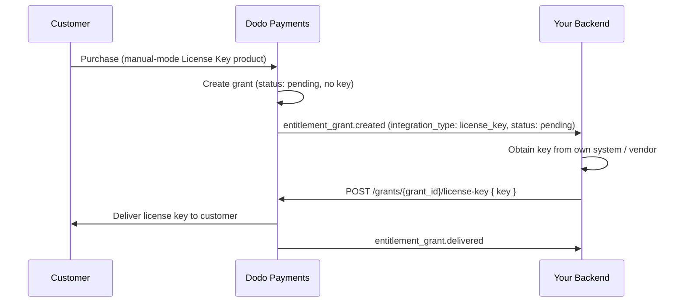

Ce guide explique comment créer un système de **traitement manuel des clés de licence** de bout en bout. Au lieu que Dodo Payments génère automatiquement une clé lors du paiement, chaque achat crée un droit `pending` et attend que *vous* fournissiez la valeur de la clé depuis votre propre système, un fournisseur tiers ou un ensemble limité de codes.

À la fin, vous aurez :

- Un produit avec un droit de clé de licence défini pour le traitement `manual`.
- Un écouteur de webhook qui détecte quand un client attend une clé.
- Un appel de traitement qui délivre la clé et notifie automatiquement le client.

<CardGroup cols={2}>
<Card title="License Keys overview" icon="key" href="/features/license-keys">
Le cycle de vie complet des clés de licence et le paramètre `fulfillment_mode`.
</Card>
<Card title="Fulfill License Key Grant API" icon="code" href="/api-reference/entitlements/fulfill-license-key">
Référence API pour l'endpoint que vous appelez pour délivrer une clé.
</Card>
</CardGroup>

## Fonctionnement



Le traitement manuel ne modifie que l'étape d'**émission**. L'activation, la validation, la désactivation, l'expiration et la révocation fonctionnent exactement comme une clé générée automatiquement une fois délivrée.

## Prérequis

Pour suivre ce guide, vous aurez besoin de :

- Un compte marchand Dodo Payments.
- Votre clé API (`DODO_PAYMENTS_API_KEY`) et la clé secrète de votre webhook depuis le tableau de bord. Consultez le [guide de génération de clé API](/api-reference/introduction#api-key-generation).
- Un endpoint backend pouvant recevoir des webhooks.

<Info>
Utilisez `https://test.dodopayments.com` et des identifiants de mode test pendant la création. Passez à `https://live.dodopayments.com` et des clés actives lorsque vous passez en production.
</Info>

## Étape 1 — Créer un droit de clé de licence en mode manuel

Un **droit** est une définition réutilisable de ce que vous livrez. Créez un droit de clé de licence et définissez son `fulfillment_mode` à `manual`.

<Tabs>
<Tab title="Dashboard">
<Steps>
<Step title="Open Entitlements">
Allez dans **Droits** sur votre tableau de bord et cliquez sur **+** pour créer un nouveau droit.
</Step>
<Step title="Choose License Key">
Sélectionnez **Clé de licence** comme intégration et donnez-lui un **Nom**. Le formulaire expose ces champs :

- **Mode de traitement** — `Automatic` par défaut. C'est le paramètre qui permet le traitement manuel ; vous le changez à l'étape suivante.
- **Durée de la licence** — combien de temps chaque clé délivrée reste valable, ou **Pas d'expiration**.
- **Limite d'activations** — nombre maximum d'activations par clé, ou **Illimité**.
- **Message d'activation** — message optionnel destiné au client qui s'affiche lors de l'activation de la clé.

<Frame>

</Frame>
</Step>
<Step title="Set Fulfillment Mode to Manual">
Ouvrez le menu déroulant **Mode de traitement** et changez-le de **Automatique** à **Manuel**. C'est le paramètre qui pilote tout ce guide — sans cela, les clés sont générées et envoyées automatiquement par email et aucun droit en attente n'est créé. Avec **Manuel** sélectionné, chaque achat crée un droit `pending` que vous devez traiter. Cliquez sur **Créer le droit** pour enregistrer.
</Step>
</Steps>
</Tab>

<Tab title="API">
Créez le droit avec `integration_config.fulfillment_mode` défini à `manual`.
<CodeGroup>

```typescript Node.js theme={null}
import DodoPayments from 'dodopayments';

const client = new DodoPayments({
  bearerToken: process.env.DODO_PAYMENTS_API_KEY,
  environment: 'test_mode', // defaults to 'live_mode'
});

const entitlement = await client.entitlements.create({
  name: 'Pro License (Manual)',
  integration_type: 'license_key',
  integration_config: {
    fulfillment_mode: 'manual',
    activations_limit: 5,
    duration_count: 1,
    duration_interval: 'Year',
  },
});

console.log(entitlement.id); // ent_...
```

```python Python theme={null}
import os
from dodopayments import DodoPayments

client = DodoPayments(
    bearer_token=os.environ.get("DODO_PAYMENTS_API_KEY"),
    environment="test_mode",  # defaults to "live_mode"
)

entitlement = client.entitlements.create(
    name="Pro License (Manual)",
    integration_type="license_key",
    integration_config={
        "fulfillment_mode": "manual",
        "activations_limit": 5,
        "duration_count": 1,
        "duration_interval": "Year",
    },
)

print(entitlement.id)
```

```bash cURL theme={null}
curl -X POST https://test.dodopayments.com/entitlements \
  -H "Authorization: Bearer $DODO_PAYMENTS_API_KEY" \
  -H "Content-Type: application/json" \
  -d '{
    "name": "Pro License (Manual)",
    "integration_type": "license_key",
    "integration_config": {
      "fulfillment_mode": "manual",
      "activations_limit": 5,
      "duration_count": 1,
      "duration_interval": "Year"
    }
  }'
```

</CodeGroup>
</Tab>
</Tabs>

<Note>
`fulfillment_mode` a pour valeur par défaut `auto`. L'omettre, ou laisser un droit existant inchangé, maintient le comportement automatique. Seuls les droits explicitement définis à `manual` créent des droits en attente.
</Note>

## Étape 2 — Attacher le droit à un produit

Ouvrez le produit que vous souhaitez vendre, développez **Paramètres avancés → Droits & Crédits**, et sélectionnez le **droit de clé de licence que vous avez défini en Manuel** à l'étape 1. Un seul produit peut délivrer cette clé de licence en plus d'autres droits sur le même achat.

<Frame caption="Selecting the License Key entitlement in the product entitlements panel.">

</Frame>

<Note>
Le mode de traitement est une propriété du **droit**, pas du produit. Parce que vous l'avez défini en **Manuel** à l'étape 1, chaque produit auquel ce droit est attaché crée des droits de clé de licence `pending` à l'achat — il n'y a rien d'autre à configurer ici.
</Note>

<Tip>
Si vous n'avez pas encore de produit, créez-en un d'abord (unique ou abonnement). Consultez le [Guide d'intégration des paiements uniques](/developer-resources/integration-guide) pour vendre le produit via le checkout.
</Tip>

## Étape 3 — Détecter les droits en attente

Lorsqu'un client achète le produit, Dodo Payments crée un droit au statut `pending` sans **clé attachée** et déclenche un webhook `entitlement_grant.created`. C'est votre signal qu'un client attend une clé.

### Écouter le webhook

Configurez un endpoint de webhook (Développeur → Webhooks dans le tableau de bord) et agissez sur les droits de clé de licence en attente. La mise en œuvre suit la spécification des [Webhooks standard](https://standardwebhooks.com/).

```typescript theme={null}
import { Webhook } from 'standardwebhooks';

const webhook = new Webhook(process.env.DODO_WEBHOOK_KEY!);

export async function POST(request: Request) {
  const rawBody = await request.text();
  const headers = {
    'webhook-id': request.headers.get('webhook-id') || '',
    'webhook-signature': request.headers.get('webhook-signature') || '',
    'webhook-timestamp': request.headers.get('webhook-timestamp') || '',
  };

  await webhook.verify(rawBody, headers);
  const event = JSON.parse(rawBody);

  // A customer bought a manual-mode license key and is waiting for it.
  if (
    event.type === 'entitlement_grant.created' &&
    event.data.integration_type === 'license_key' &&
    event.data.status === 'pending'
  ) {
    await queueLicenseKeyFulfillment({
      grantId: event.data.id,
      customerId: event.data.customer_id,
    });
  }

  return new Response('ok');
}
```

La charge utile du droit porte la valeur `integration_type: "license_key"`, vous pouvez donc reconnaître un droit de clé de licence sans une recherche supplémentaire. Consultez la [référence de webhook de droit](/developer-resources/webhooks/intents/entitlement-grant) pour la charge utile complète.

### Ou interroger l'API Liste des droits

Si vous préférez ne pas vous fier aux webhooks, listez les droits pour le droit et filtrez par `integration_type` et `status` :

Si vous préférez ne pas vous fier aux webhooks, listez les autorisations pour votre droit de Clé de Licence et filtrez par `status`. Chaque autorisation sur un droit de Clé de Licence est déjà une autorisation de clé de licence, donc aucun filtre `integration_type` n'est nécessaire :

```typescript Node.js theme={null}
const pending = await client.entitlements.grants.list('ent_license_key_id', {
  integration_type: 'license_key',
  status: 'pending',
});

for (const grant of pending.items) {
  console.log(`Grant ${grant.id} for customer ${grant.customer_id} needs a key`);
}
```

```typescript Node.js theme={null}
const pending = await client.entitlements.grants.list('ent_license_key_id', {
  status: 'Pending',
});

for (const grant of pending.items) {
  console.log(`Grant ${grant.id} for customer ${grant.customer_id} needs a key`);
}
```

```bash cURL theme={null}
curl -G https://test.dodopayments.com/entitlements/ent_license_key_id/grants \
  -H "Authorization: Bearer $DODO_PAYMENTS_API_KEY" \
  --data-urlencode "status=Pending"
```

## Étape 4 — Délivrer la clé

Obtenez la valeur de la clé depuis votre propre système, puis soumettez-la avec l'endpoint [Traitement du droit de clé de licence](/api-reference/entitlements/fulfill-license-key). Cela nécessite votre clé API secrète (Permission Éditeur) ; ce n'est **pas** l'un des endpoints de licence publique.

<CodeGroup>

```typescript Node.js theme={null}
async function fulfill(grantId: string, key: string) {
  const res = await fetch(
    `https://test.dodopayments.com/grants/${grantId}/license-key`,
    {
      method: 'POST',
      headers: {
        'Content-Type': 'application/json',
        Authorization: `Bearer ${process.env.DODO_PAYMENTS_API_KEY}`,
      },
      body: JSON.stringify({
        key,
        // Optional — fall back to the entitlement config when omitted
        activations_limit: 5,
        expires_at: '2027-05-01T00:00:00Z',
      }),
    },
  );

  if (!res.ok) {
    // See the status code table below for handling
    throw new Error(`Fulfillment failed: ${res.status}`);
  }

  return res.json(); // updated grant, now status: "delivered"
}
```

```bash cURL theme={null}
curl -X POST https://test.dodopayments.com/grants/grant_8VbC6JDZ/license-key \
  -H "Authorization: Bearer $DODO_PAYMENTS_API_KEY" \
  -H "Content-Type: application/json" \
  -d '{
    "key": "PRO-AAAA-BBBB-CCCC-DDDD",
    "activations_limit": 5,
    "expires_at": "2027-05-01T00:00:00Z"
  }'
```

</CodeGroup>

### Champs de demande

<ParamField body="key" type="string" required>
La chaîne de clé de licence à délivrer au client. Les espaces sont coupés ; une valeur vide ou composée uniquement d'espaces est rejetée.
</ParamField>

<ParamField body="activations_limit" type="integer">
Limite d'activation par clé. Retombe sur la configuration du droit lorsque omise.
</ParamField>

<ParamField body="expires_at" type="string">
Expiration par clé (ISO 8601). Retombe sur la durée de configuration du droit lorsque omise. Pour les droits délivrés par abonnement, la validité reste liée à l'abonnement indépendamment.
</ParamField>

En cas de succès, le droit passe à `delivered`, le client reçoit automatiquement la clé (le même email qu'il recevrait en traitement automatique), et `entitlement_grant.delivered` est déclenché.

Le client reçoit un email avec la clé de licence, le produit, la limite d'activation, l'expiration, et vos instructions d'activation:

<Frame caption="The license key email the customer receives once you fulfill the grant.">

</Frame>

<Check>
Vous n'avez pas besoin d'envoyer vous-même la clé par email — la livraison se fait automatiquement lorsque le droit est rempli.
</Check>

## Étape 5 — Gérer les erreurs et les réessais

L'endpoint valide le droit avant de délivrer quoi que ce soit. Gérez ces réponses :

| Statut | Signification | Que faire |
|---|---|---|
| `200` | Clé délivrée, le droit est désormais `delivered`. | Terminé. |
| `400` | Pas un droit de clé de licence, ou la clé est vide/espace. | Corrigez la demande ; ne réessayez pas telle quelle. |
| `404` | Aucun droit avec cet ID pour votre entreprise. | Vérifiez le `grant_id`. |
| `409` | Droit non en attente de traitement (déjà délivré ou ayant déjà une clé), **ou** la valeur de la clé existe déjà. | Si déjà délivré, traiter comme succès. Si une clé en double, fournir une clé différente. |
| `422` | Le corps de la demande n'a pas passé la validation (e.g. `activations_limit < 1`). | Corrigez le champ et réessayez. |

<Warning>
Le traitement est sans danger pour être réessayé sur des erreurs transitoires (timeouts, `5xx`). Chaque droit peut être rempli une seule fois, donc une réessai après un appel réussi mais non reconnu retourne `409` au lieu de délivrer une deuxième clé ou d'envoyer un email en double. Utilisez le `id` comme votre clé d'idempotence.
</Warning>

## Vérifier le flux

1. Achetez le produit en mode test (voir les [guides de check-out](/developer-resources/integration-guide)).
2. Confirmez que votre webhook a reçu `entitlement_grant.created` avec `status: "pending"` et `integration_type: "license_key"`, ou que le droit apparaît dans la réponse de Liste des droits avec ces filtres.
3. Appelez l'endpoint de traitement avec une clé de test.
4. Confirmez que la réponse montre `status: "delivered"` avec un `license_key` rempli, que le client reçoit l'email de la clé, et `entitlement_grant.delivered` est déclenché.

<Check>
Une fois délivrée, le client peut [activer et valider](/features/license-keys#activation-validation-deactivation) la clé avec les endpoints de licence publique exactement comme une clé générée automatiquement.
</Check>

## Référence API associée

<CardGroup cols={2}>
<Card title="Create Entitlement" icon="plus" href="/api-reference/entitlements/create-entitlement">
Créez le droit de clé de licence avec `fulfillment_mode: manual`.
</Card>
<Card title="List Grants" icon="users" href="/api-reference/entitlements/list-grants">
Filtrez par `integration_type` et `status` pour trouver les droits en attente.
</Card>
<Card title="Fulfill License Key Grant" icon="code" href="/api-reference/entitlements/fulfill-license-key">
Délivrez la valeur de la clé et passez le droit à livré.
</Card>
<Card title="Entitlement Grant Webhooks" icon="webhook" href="/developer-resources/webhooks/intents/entitlement-grant">
Les événements `entitlement_grant.*` qui signalent les droits en attente et délivrés.
</Card>
</CardGroup>

<CardGroup cols={2}>
<Card title="Create Entitlement" icon="plus" href="/api-reference/entitlements/create-entitlement">
Create the License Key entitlement with `fulfillment_mode: manual`.
</Card>
<Card title="List Grants" icon="users" href="/api-reference/entitlements/list-grants">
Filter by `integration_type` and `status` to find pending grants.
</Card>
<Card title="Fulfill License Key Grant" icon="code" href="/api-reference/entitlements/fulfill-license-key">
Deliver the key value and transition the grant to delivered.
</Card>
<Card title="Entitlement Grant Webhooks" icon="webhook" href="/developer-resources/webhooks/intents/entitlement-grant">
The `entitlement_grant.*` events that signal pending and delivered grants.
</Card>
</CardGroup>
