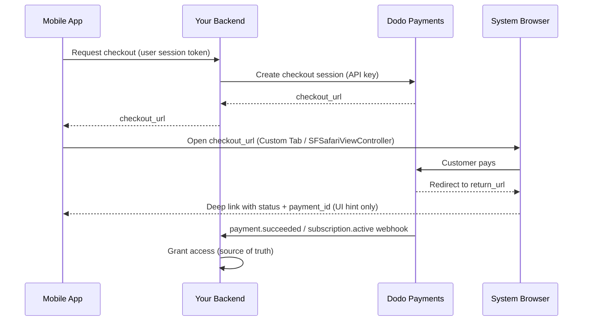

<CardGroup cols={4}>
<Card title="Quick Start" icon="rocket" href="#integration-workflow">
  Lancez votre intégration des paiements mobiles en 4 étapes simples
</Card>

<Card title="Platform Examples" icon="code" href="#choose-your-sdk">
  Exemples de code complets pour Android, iOS, React Native et Flutter
</Card>

<Card title="Checkout Customization" icon="sliders" href="#checkout-page-customization">
  Configurez les thèmes, le préremplissage et 14 paramètres spécifiques au mobile
</Card>

<Card title="Mobile Recipes" icon="flask" href="#mobile-optimized-recipes">
  Configurations de checkout à copier-coller pour 5 scénarios mobiles courants
</Card>
</CardGroup>

<Info>
Dodo Payments fournit un SDK de checkout officiel pour **Android, iOS, React Native,
et Flutter**. Chacun encapsule le modèle documenté ci-dessous (ouvrir l’URL du checkout,
capturer le retour et analyser le résultat) derrière un seul appel `start(...)`
 typé, avec une récupération intégrée des sessions abandonnées. Utilisez une WebView
manuelle uniquement si aucune de ces solutions ne convient à votre stack.
</Info>

## Prérequis

Avant d’intégrer Dodo Payments à votre application mobile, vérifiez que vous disposez des éléments suivants :

- **Compte Dodo Payments** : compte marchand actif avec accès à l’API
- **Identifiants API** : clé API et clé secrète de webhook depuis votre tableau de bord
- **Projet d’application mobile** : application Android, iOS, React Native ou Flutter
- **Serveur backend** : pour gérer de manière sécurisée la création des sessions de checkout

## Flux d’intégration

L’intégration mobile suit un processus sécurisé en 4 étapes : votre backend gère les appels API et votre application mobile gère l’expérience utilisateur.



<Info>
Le deep link `status` est uniquement un **indice d’interface** indiquant ce qu’il faut afficher à l’utilisateur. Accordez toujours l’accès à partir du **webhook** `payment.succeeded` / `subscription.active` sur votre backend — jamais à partir du seul résultat mobile.
</Info>

<Steps>
<Step title="Backend: Create Checkout Session">
<Card title="Checkout Session API Docs" icon="book" href="/developer-resources/checkout-session">
Découvrez comment créer une session de checkout sur votre backend avec Node.js, Python et d’autres langages. Consultez les exemples complets et les références des paramètres dans la documentation dédiée de l’<strong>API Checkout Sessions</strong>.
</Card>
<Note>
**Sécurité** : les sessions de checkout doivent être créées sur votre serveur backend, jamais dans l’application mobile. Cela protège vos clés API et garantit une validation correcte.
</Note>

</Step>

<Step title="Mobile: Get Checkout URL">

Votre application mobile appelle votre backend pour obtenir l’URL du checkout. Authentifiez
cette requête avec le propre jeton de session de l’utilisateur connecté.

<Tabs>
<Tab title="iOS (Swift)">

```swift
func getCheckoutURL(productId: String, customerEmail: String, customerName: String) async throws -> String {
    let url = URL(string: "https://your-backend.com/api/create-checkout-session")!
    var request = URLRequest(url: url)
    request.httpMethod = "POST"
    request.setValue("application/json", forHTTPHeaderField: "Content-Type")
    request.setValue("Bearer \(userSessionToken)", forHTTPHeaderField: "Authorization")
    
    let requestData: [String: Any] = [
        "productId": productId,
        "customerEmail": customerEmail,
        "customerName": customerName
    ]
    request.httpBody = try JSONSerialization.data(withJSONObject: requestData)
    
    let (data, _) = try await URLSession.shared.data(for: request)
    let response = try JSONDecoder().decode(CheckoutResponse.self, from: data)
    return response.checkout_url
}
```

</Tab>
<Tab title="Android (Kotlin)">

```kotlin
suspend fun getCheckoutURL(productId: String, customerEmail: String, customerName: String): String {
    val client = OkHttpClient()
    val requestBody = JSONObject().apply {
        put("productId", productId)
        put("customerEmail", customerEmail)
        put("customerName", customerName)
    }.toString().toRequestBody("application/json".toMediaType())
    
    val request = Request.Builder()
        .url("https://your-backend.com/api/create-checkout-session")
        .header("Authorization", "Bearer $userSessionToken")
        .post(requestBody)
        .build()
    
    val response = client.newCall(request).execute()
    val responseBody = response.body?.string()
    val jsonResponse = JSONObject(responseBody ?: "")
    return jsonResponse.getString("checkout_url")
}
```

</Tab>
<Tab title="React Native (JavaScript)">

```javascript
const getCheckoutURL = async (productId, customerEmail, customerName) => {
  try {
    const response = await fetch('https://your-backend.com/api/create-checkout-session', {
      method: 'POST',
      headers: {
        'Content-Type': 'application/json',
        'Authorization': `Bearer ${userSessionToken}`,
      },
      body: JSON.stringify({
        productId,
        customerEmail,
        customerName
      })
    });
    
    const data = await response.json();
    return data.checkout_url;
  } catch (error) {
    console.error('Failed to get checkout URL:', error);
    throw error;
  }
};
```

</Tab>
<Tab title="Flutter (Dart)">

```dart
import 'dart:convert';
import 'package:http/http.dart' as http;

Future<String> getCheckoutUrl({
  required String productId,
  required String customerEmail,
  required String customerName,
}) async {
  final response = await http.post(
    Uri.parse('https://your-backend.com/api/create-checkout-session'),
    headers: {
      'Content-Type': 'application/json',
      'Authorization': 'Bearer $userSessionToken',
    },
    body: jsonEncode({
      'productId': productId,
      'customerEmail': customerEmail,
      'customerName': customerName,
    }),
  );

  if (response.statusCode != 200) {
    throw Exception('Failed to get checkout URL: ${response.statusCode}');
  }
  return jsonDecode(response.body)['checkout_url'] as String;
}
```

</Tab>
</Tabs>
<Note>
**Sécurité** : les applications mobiles communiquent uniquement avec votre backend, jamais directement avec l’API Dodo Payments.
</Note>
</Step>

<Step title="Mobile: Open Checkout in Browser">
Ouvrez l’URL du checkout dans un navigateur intégré sécurisé pour traiter le paiement.
Vous pouvez aussi éviter entièrement la configuration manuelle grâce au SDK de checkout officiel pour votre
plateforme.

<Card title="Pick your mobile SDK" icon="box" href="#choose-your-sdk">
  Étapes d’installation et instructions de configuration pour Android, iOS, React Native et Flutter.
</Card>

</Step>

<Step title="Backend: Handle Payment Completion">
Traitez la finalisation du paiement via les webhooks et les URL de redirection afin de confirmer l’état du paiement.
</Step>
</Steps>

## Choisissez votre SDK

Chaque SDK mobile expose le même contrat : un appel `start(...)` ouvre le checkout hébergé de Dodo dans la surface de navigateur native de la plateforme et renvoie un `CheckoutResult` typé dont le `status` est `succeeded`, `failed`, `cancelled`, `pending` ou `expired`. Aucun ne contient de clé API ni n’appelle l’API Dodo Payments, et les quatre prennent en charge la récupération des sessions abandonnées.

<CardGroup cols={2}>
<Card title="Android" icon="android" href="/developer-resources/sdks/android">
  `com.dodopayments.api:checkout-android` ouvre un Chrome Custom Tab. Nécessite `minSdk` 23.
</Card>
<Card title="iOS" icon="apple" href="/developer-resources/sdks/ios">
  `dodopayments-mobile-sdk-ios` ouvre `SFSafariViewController`. Nécessite iOS 16 ou version ultérieure.
</Card>
<Card title="React Native" icon="react" href="/developer-resources/sdks/react-native">
  `@dodopayments/react-native-checkout`, un Turbo Module sur les deux cœurs natifs. Nécessite React Native 0.76 ou version ultérieure.
</Card>
<Card title="Flutter" icon="layer-group" href="/developer-resources/sdks/flutter">
  `dodopayments_checkout`, un canal Pigeon sur les deux cœurs natifs. Nécessite Flutter 3.44 ou version ultérieure.
</Card>
</CardGroup>

<Warning>
Le `status` renvoyé est un indice d’interface, pas une preuve de paiement. Confirmez chaque paiement depuis votre backend via le webhook `payment.succeeded` / `subscription.active`, ou en récupérant le paiement avec votre clé secrète.
</Warning>

### Enregistrement d’un schéma d’URL de callback

Les quatre SDK redonnent le contrôle à votre application via un schéma d’URL personnalisé que
vous choisissez, par exemple `myapp://checkout/return`. Enregistrez-le une fois par
plateforme :

<Tabs>
<Tab title="Android">

```kotlin android/app/build.gradle
android {
    defaultConfig {
        manifestPlaceholders["dodoCallbackScheme"] = "myapp"
    }
}
```

Le manifest du SDK déclare déjà l’activité de redirection ; il n’est donc pas nécessaire
d’ajouter du XML au manifest.
</Tab>
<Tab title="iOS">

```xml Info.plist
<key>CFBundleURLTypes</key>
<array>
  <dict>
    <key>CFBundleURLName</key>
    <string>myapp</string>
    <key>CFBundleURLSchemes</key>
    <array>
      <string>myapp</string>
    </array>
  </dict>
</array>
```

Sur iOS, vous devez également transmettre les URL entrantes au SDK, car
`SFSafariViewController` ne peut pas intercepter sa propre URL de retour. Consultez la page
[iOS](/developer-resources/sdks/ios) ou
[React Native](/developer-resources/sdks/react-native) pour connaître le gestionnaire exact.
</Tab>
<Tab title="Expo">
`@dodopayments/react-native-checkout` fournit un plugin de configuration qui enregistre le
schéma pour les deux plateformes à `prebuild`. Transmettez-lui une option `scheme` :

```json app.json
{
  "expo": {
    "scheme": "myapp",
    "plugins": [
      [
        "@dodopayments/react-native-checkout",
        { "scheme": "myappcheckout" }
      ]
    ]
  }
}
```

`scheme` doit correspondre à `returnUrl` et être différent de `expo.scheme`, qu’Expo enregistre déjà sur `MainActivity`. Consultez la page du [SDK React Native](/developer-resources/sdks/react-native) pour plus de détails.

Si `android/app/build.gradle` est géré manuellement sans bloc `defaultConfig { }` standard, définissez plutôt le placeholder manuellement (voir l’onglet Android).

Fonctionne uniquement avec les development builds, pas avec Expo Go. Exécutez
`npx expo prebuild --clean` après avoir modifié `app.json`.
</Tab>
</Tabs>

<Note>
Vous préférez le construire vous-même ? Ouvrez le `checkout_url` dans le navigateur système de la plateforme (Android Custom Tabs / iOS `SFSafariViewController`), interceptez la navigation vers votre `return_url`, puis lisez les paramètres de requête `status` et `payment_id`. Les SDK ci-dessus s’en chargent pour vous.
</Note>

<Warning>
**N’ouvrez pas le checkout dans une WebView intégrée (`WKWebView` / Android `WebView`).** Il s’agit du problème le plus courant des intégrations mobiles : une WebView intégrée **désactive Apple Pay et Google Pay**, et peut également empêcher le fonctionnement des défis 3-D Secure et du préremplissage des cartes enregistrées. Les clients voient donc moins d’options de paiement et davantage d’échecs. Utilisez toujours le SDK ou ouvrez le `checkout_url` dans le navigateur système (Custom Tabs / `SFSafariViewController`). Cette surface de navigateur native est précisément ce qui permet à Apple Pay et Google Pay de continuer à fonctionner.
</Warning>

## Personnalisation de l’apparence

Chaque SDK accepte un paramètre optionnel `customization` sur `start(...)` /
`CheckoutParams` qui contrôle l’apparence et le comportement de la surface de navigateur native : barre d’outils, boutons et présentation. Cela est indépendant du thème de la page de checkout, que vous configurez côté serveur via [`customization.theme_config`](/developer-resources/checkout-session) dans la session de checkout.

Les options sont regroupées par plateforme, car l’onglet personnalisé d’Android et le `SFSafariViewController` d’iOS exposent des contrôles natifs différents. Tous les champs sont facultatifs ; si vous omettez entièrement `customization`, l’apparence par défaut de chaque plateforme est utilisée.

<AccordionGroup>
<Accordion title="Android - Custom Tab">

<ParamField body="toolbarColor" type="Color">
Couleur d’arrière-plan de la barre d’outils.
</ParamField>

<ParamField body="navigationBarColor" type="Color">
Couleur de la barre de navigation.
</ParamField>

<ParamField body="navigationBarDividerColor" type="Color">
Couleur du séparateur au-dessus de la barre de navigation.
</ParamField>

<ParamField body="closeButtonStyle" type="'default' | 'back'">
`default` affiche l’icône système « X » ; `back` dessine plutôt une flèche de retour.
</ParamField>

<ParamField body="closeButtonPosition" type="'start' | 'end'">
Indique le côté de la barre d’outils où apparaît le bouton de fermeture.
</ParamField>

<ParamField body="shareButtonEnabled" type="boolean">
Affiche l’icône de partage de la barre d’outils.
</ParamField>

<ParamField body="showTitleEnabled" type="boolean">
Affiche le titre de la page sous l’URL dans la barre d’outils.
</ParamField>

<ParamField body="urlBarHidingEnabled" type="boolean">
Permet à la barre d’outils de se masquer automatiquement lors du défilement.
</ParamField>

<ParamField body="bookmarksButtonEnabled" type="boolean">
Affiche « Ajouter cette page aux favoris » dans le menu Plus.
</ParamField>

<ParamField body="downloadsButtonEnabled" type="boolean">
Affiche « Télécharger la page » dans le menu Plus.
</ParamField>

<ParamField body="colorScheme" type="'system' | 'light' | 'dark'">
Force une apparence claire ou sombre, indépendamment du réglage système de l’appareil.
</ParamField>

</Accordion>

<Accordion title="iOS - SFSafariViewController">

<ParamField body="dismissButtonStyle" type="'done' | 'close' | 'cancel'">
Libellé ou icône du bouton de fermeture.
</ParamField>

<ParamField body="presentationStyle" type="'pageSheet' | 'fullScreen'">
`pageSheet` se présente sous forme de carte avec un geste de balayage pour fermer ; `fullScreen` couvre tout l’écran.
</ParamField>

<ParamField body="barCollapsingEnabled" type="boolean">
Permet à la barre d’outils de se réduire lors du défilement. Visible uniquement lorsque `presentationStyle` vaut `fullScreen` ; `pageSheet` maintient les barres fixes quel que soit ce réglage.
</ParamField>

<ParamField body="colorScheme" type="'system' | 'light' | 'dark'">
Force une apparence claire ou sombre, indépendamment du réglage système de l’appareil.
</ParamField>

</Accordion>
</AccordionGroup>

<Tabs>
<Tab title="React Native">

```typescript
const result = await DodoCheckout.start({
  checkoutUrl,
  returnUrl: 'myapp://checkout/return',
  customization: {
    android: { toolbarColor: '#6366F1', closeButtonStyle: 'back' },
    ios: { presentationStyle: 'fullScreen', colorScheme: 'dark' },
  },
});
```

</Tab>
<Tab title="Flutter">

```dart
final result = await DodoCheckout.instance.start(
  CheckoutParams(
    checkoutUrl: Uri.parse(checkoutUrl),
    returnUrl: Uri.parse('myapp://checkout/return'),
    customization: BrowserCustomization(
      android: AndroidBrowserOptions(
        toolbarColor: Color(0xFF6366F1),
        closeButtonStyle: CloseButtonStyle.back,
      ),
      ios: IosBrowserOptions(
        presentationStyle: PresentationStyle.fullScreen,
        colorScheme: BrowserColorScheme.dark,
      ),
    ),
  ),
);
```

</Tab>
<Tab title="Android (Kotlin)">

```kotlin
val result = DodoCheckout.start(
    activity,
    CheckoutParams(
        checkoutUrl = checkoutUrl,
        returnUrl = "myapp://checkout/return",
        customization = BrowserCustomization(
            toolbarColor = Color.parseColor("#6366F1"),
            closeButtonStyle = BrowserCustomization.CloseButtonStyle.BACK,
        )
    )
) { event -> }
```

</Tab>
<Tab title="iOS (Swift)">

```swift
let result = try await DodoCheckout.start(
    checkoutUrl: checkoutUrl,
    returnUrl: URL(string: "myapp://checkout/return")!,
    customization: BrowserCustomization(
        presentationStyle: .fullScreen,
        colorScheme: .dark
    )
)
```

</Tab>
</Tabs>

## Personnalisation de la page de checkout

La section [Personnalisation de l’apparence](#appearance-customization) ci-dessus contrôle la surface de navigateur native : barre d’outils, boutons et palette de couleurs. La *page de checkout elle-même* — champs affichés, thème et moyens de paiement — est configurée côté serveur lors de la création de la session de checkout. Ces paramètres ont le plus d’impact sur la conversion mobile.

Les paramètres ci-dessous se trouvent à trois endroits différents de la requête de session de checkout ; la colonne **Emplacement** indique à quel objet chacun appartient. C’est l’erreur la plus courante : un paramètre placé dans le mauvais objet est ignoré silencieusement.

| Paramètre | Emplacement | Avantage mobile | Valeur par défaut | À définir quand… |
|-----------|---------------|---------------|---------|-----------|
| `show_order_details` | `customization` | Réduit le récapitulatif de commande afin que les moyens de paiement apparaissent en haut de l’écran | `true` | Définissez toujours `false` sur mobile : placer les moyens de paiement au-dessus de la ligne de flottaison réduit considérablement l’abandon |
| `minimal_address` | top-level | Demande uniquement un code postal ; masque les champs de rue, ville et région | `false` | Presque toujours sur mobile : chaque champ supplémentaire réduit les conversions |
| `theme` | `customization` | Contrôle l’apparence claire ou sombre de la page de checkout | Valeur par défaut de l’entreprise | Utilisez `"system"` pour respecter la préférence de l’OS de l’appareil |
| `theme_config` | `customization` | Palette complète de la marque : couleurs, polices, rayon des bordures et libellé du bouton de paiement | Aucune | Lorsque le checkout doit sembler intégré à votre application |
| `force_language` | `customization` | Remplace la détection de la langue du navigateur | Détection automatique | Définissez-le à partir de la langue de votre application plutôt que de dépendre du navigateur |
| `show_on_demand_tag` | `customization` | Affiche ou masque le libellé « à la demande » sur la page de checkout | `true` | Définissez `false` lorsque vous utilisez la facturation à la demande uniquement pour la tokenisation de cartes |
| `show_saved_payment_methods` | top-level | Affiche les cartes enregistrées d’un client récurrent pour un paiement en un clic | `false` | Activez-le pour les utilisateurs connectés ayant déjà payé |
| `allow_discount_code` | `feature_flags` | Affiche le champ de saisie du code promotionnel | `true` | Définissez `false` pour raccourcir le formulaire ; les utilisateurs qui quittent la page pour chercher un code reviennent rarement |
| `allow_currency_selection` | `feature_flags` | Permet au client de changer de devise de facturation | `true` | Définissez `false` lorsque vous verrouillez la devise avec `billing_currency` |
| `redirect_immediately` | `feature_flags` | Ignore la page de réussite et redirige directement vers `return_url` | `false` | Activez-le pour un transfert fluide vers votre application |
| `confirm` | top-level | Finalise le paiement sans étape de confirmation supplémentaire | `false` | Utilisez-le avec `payment_method_id` pour un checkout en un clic |
| `short_link` | top-level | Renvoie une URL de checkout plus courte | `false` | Utile lorsque l’URL doit tenir dans une notification push ou un SMS |
| `payment_method_id` | top-level | Préselectionne un moyen de paiement enregistré | - | Transmettez-le avec `confirm: true` pour un checkout en un clic |
| `allowed_payment_method_types` | top-level | Autorise uniquement les moyens de paiement affichés | Tous les moyens activés | Limitez-les aux moyens compatibles avec votre type de produit |

<Warning>
**Transmettez toujours `billing_currency` et `billing_address.country` ensemble.** Si l’un des deux est omis, la devise adaptative peut modifier silencieusement la devise de facturation en fonction de l’adresse IP du client. Un marchand a vu un abonnement américain passer en EUR lorsque son client a voyagé en Europe, car le pays de facturation n’avait pas été défini explicitement.
</Warning>

<Tip>
**Le plus grand levier de conversion sur mobile :** définissez `show_order_details: false` et `minimal_address: true`. Placer les moyens de paiement au-dessus de la ligne de flottaison et réduire le nombre de champs sont les deux changements les plus efficaces.
</Tip>

<Frame caption="show_order_details: false moves the contact and payment fields above the fold, instead of behind the order summary.">
  
</Frame>

Définissez `minimal_address: true` pour ne demander qu’un code postal au lieu des champs complets de rue, ville et région :

<Frame caption="minimal_address: true reduces the billing address to a single postcode field.">
  
</Frame>

Définissez `theme: "system"` afin que le checkout respecte la préférence claire ou sombre de l’appareil :

<Frame caption="With theme: system, the checkout follows the device's light or dark appearance automatically.">
  
</Frame>

<Info>
**La disponibilité des moyens de paiement varie selon le type de produit.** Apple Pay et Cash App sont pris en charge pour les abonnements récurrents non nuls. Pour les paiements ponctuels, tous les moyens activés sont disponibles.
</Info>

<Card title="Full checkout session parameter reference" icon="book" href="/developer-resources/checkout-session">
  Consultez tous les paramètres disponibles, leur type et leur valeur par défaut dans le guide Checkout Sessions.
</Card>

## Recettes optimisées pour le mobile

Chaque recette ci-dessous correspond au corps complet d’une requête de session de checkout. Copiez celle qui correspond à votre scénario, remplacez-la par l’identifiant de votre produit et transmettez-la à l’endpoint de création de session de votre backend.

<AccordionGroup>
<Accordion title="Minimal Mobile Checkout - fastest path to payment">

Utilisez cette configuration pour obtenir le formulaire le plus court possible : moyens de paiement en haut, seul un code postal requis pour l’adresse, aucun champ de réduction et un thème correspondant à l’appareil.

<Tabs>
<Tab title="Node.js SDK">

```javascript expandable
import DodoPayments from 'dodopayments';

const client = new DodoPayments({
  bearerToken: process.env.DODO_PAYMENTS_API_KEY,
  environment: 'test_mode',
});

const session = await client.checkoutSessions.create({
  product_cart: [{ product_id: 'pdt_your_product_id', quantity: 1 }],
  customer: { email: 'user@example.com', name: 'Jane Smith' },
  billing_address: { country: 'US' },
  return_url: 'myapp://checkout/success',
  cancel_url: 'myapp://checkout/cancelled',
  billing_currency: 'USD',
  minimal_address: true,
  customization: {
    show_order_details: false,
    theme: 'system',
  },
  feature_flags: {
    allow_discount_code: false,
    allow_currency_selection: false,
  },
});

console.log(session.checkout_url);
```

</Tab>
<Tab title="Python SDK">

```python expandable
import os
import dodopayments

client = dodopayments.DodoPayments(
    bearer_token=os.environ.get("DODO_PAYMENTS_API_KEY"),
    environment="test_mode",
)

session = client.checkout_sessions.create(
    product_cart=[{"product_id": "pdt_your_product_id", "quantity": 1}],
    customer={"email": "user@example.com", "name": "Jane Smith"},
    billing_address={"country": "US"},
    return_url="myapp://checkout/success",
    cancel_url="myapp://checkout/cancelled",
    billing_currency="USD",
    minimal_address=True,
    customization={
        "show_order_details": False,
        "theme": "system",
    },
    feature_flags={
        "allow_discount_code": False,
        "allow_currency_selection": False,
    },
)

print(session.checkout_url)
```

</Tab>
</Tabs>

<Note>
Consultez [Checkout Sessions](/developer-resources/checkout-session) pour connaître tous les paramètres disponibles et leurs valeurs par défaut.
</Note>
</Accordion>

<Accordion title="Branded Mobile Checkout - custom colors, fonts, and button label">

Utilisez cette configuration lorsque la page de checkout doit sembler intégrée à votre application. Définissez les couleurs de votre marque, une police personnalisée et un libellé de bouton de paiement localisé.

<Frame>
  
</Frame>

<Tabs>
<Tab title="Node.js SDK">

```javascript expandable
const session = await client.checkoutSessions.create({
  product_cart: [{ product_id: 'pdt_your_product_id', quantity: 1 }],
  customer: { email: 'user@example.com', name: 'Jane Smith' },
  billing_address: { country: 'US' },
  billing_currency: 'USD',
  return_url: 'myapp://checkout/success',
  minimal_address: true,
  customization: {
    show_order_details: false,
    theme: 'dark',
    theme_config: {
      dark: {
        button_primary: '#7C3AED',
        button_primary_hover: '#6D28D9',
        button_text_primary: '#FFFFFF',
        bg_primary: '#1A1A2E',
        bg_secondary: '#16213E',
        text_primary: '#E2E8F0',
      },
      pay_button_text: 'Complete Purchase',
      radius: '8px',
    },
  },
});
```

</Tab>
<Tab title="Python SDK">

```python expandable
session = client.checkout_sessions.create(
    product_cart=[{"product_id": "pdt_your_product_id", "quantity": 1}],
    customer={"email": "user@example.com", "name": "Jane Smith"},
    billing_address={"country": "US"},
    billing_currency="USD",
    return_url="myapp://checkout/success",
    minimal_address=True,
    customization={
        "show_order_details": False,
        "theme": "dark",
        "theme_config": {
            "dark": {
                "button_primary": "#7C3AED",
                "button_primary_hover": "#6D28D9",
                "button_text_primary": "#FFFFFF",
                "bg_primary": "#1A1A2E",
                "bg_secondary": "#16213E",
                "text_primary": "#E2E8F0",
            },
            "pay_button_text": "Complete Purchase",
            "radius": "8px",
        },
    },
)
```

</Tab>
</Tabs>

<Note>
`theme_config` accepte des objets `dark` et `light` distincts afin que la palette s’adapte à l’apparence actuelle de l’appareil. Consultez [Checkout Sessions](/developer-resources/checkout-session) pour la référence complète des couleurs.
</Note>
</Accordion>

<Accordion title="One-Click Returning Customer - saved card, instant confirmation">

Utilisez cette configuration pour les utilisateurs connectés ayant déjà payé. Combinez un identifiant client, leur moyen de paiement enregistré et `confirm: true` pour ignorer entièrement le formulaire de checkout.

<Tabs>
<Tab title="Node.js SDK">

```javascript expandable
const session = await client.checkoutSessions.create({
  product_cart: [{ product_id: 'pdt_your_product_id', quantity: 1 }],
  customer: { customer_id: 'cus_returning_customer_id' },
  billing_address: { country: 'US' },
  billing_currency: 'USD',
  return_url: 'myapp://checkout/success',
  payment_method_id: 'pm_saved_payment_method_id',
  confirm: true,
  show_saved_payment_methods: true,           // top-level parameter
  feature_flags: { redirect_immediately: true },
});
```

</Tab>
<Tab title="Python SDK">

```python expandable
session = client.checkout_sessions.create(
    product_cart=[{"product_id": "pdt_your_product_id", "quantity": 1}],
    customer={"customer_id": "cus_returning_customer_id"},
    billing_address={"country": "US"},
    billing_currency="USD",
    return_url="myapp://checkout/success",
    payment_method_id="pm_saved_payment_method_id",
    confirm=True,
    show_saved_payment_methods=True,           # top-level parameter
    feature_flags={"redirect_immediately": True},
)
```

</Tab>
</Tabs>

<Note>
Le `status` du retour par deep link est uniquement un indice d’interface. Confirmez l’accès en écoutant le webhook `payment.succeeded` sur votre backend.
</Note>
</Accordion>

<Accordion title="Subscription with Free Trial - trial before first charge">

Utilisez cette configuration pour les produits d’abonnement qui proposent une période d’essai gratuite avant le premier cycle de facturation.

<Tabs>
<Tab title="Node.js SDK">

```javascript expandable
const session = await client.checkoutSessions.create({
  product_cart: [{ product_id: 'pdt_your_subscription_product_id', quantity: 1 }],
  customer: { email: 'user@example.com', name: 'Jane Smith' },
  billing_address: { country: 'US' },
  billing_currency: 'USD',
  return_url: 'myapp://subscription/activated',
  cancel_url: 'myapp://subscription/cancelled',
  minimal_address: true,
  customization: {
    show_order_details: false,
    theme: 'system',
  },
  subscription_data: { trial_period_days: 14 },
});
```

</Tab>
<Tab title="Python SDK">

```python expandable
session = client.checkout_sessions.create(
    product_cart=[{"product_id": "pdt_your_subscription_product_id", "quantity": 1}],
    customer={"email": "user@example.com", "name": "Jane Smith"},
    billing_address={"country": "US"},
    billing_currency="USD",
    return_url="myapp://subscription/activated",
    cancel_url="myapp://subscription/cancelled",
    minimal_address=True,
    customization={"show_order_details": False, "theme": "system"},
    subscription_data={"trial_period_days": 14},
)
```

</Tab>
</Tabs>

<Note>
Accordez l’accès à la fonctionnalité lorsque votre backend reçoit le webhook `subscription.active` — et non lorsque le SDK mobile renvoie un résultat. Consultez le [Guide d’intégration des abonnements](/developer-resources/subscription-integration-guide) pour connaître le flux complet des webhooks.
</Note>
</Accordion>

<Accordion title="On-Demand Mandate - save a card for future variable charges">

Utilisez cette configuration pour tokeniser la carte d’un client en vue de paiements ultérieurs (rechargements de portefeuille, paiement à l’usage, BNPL) sans afficher de libellé « abonnement ». Le client autorise son moyen de paiement une seule fois ; vous facturez ensuite des montants variables à la demande.

<Info>
C’est le modèle utilisé par les applications qui facturent selon l’utilisation — par exemple une application d’astrologie qui facture chaque session à partir d’une carte préautorisée, plutôt que selon un calendrier fixe.
</Info>

<Tabs>
<Tab title="Node.js SDK">

```javascript expandable
// Step 1: Authorize the mandate (no charge yet)
const session = await client.checkoutSessions.create({
  product_cart: [{ product_id: 'pdt_your_subscription_product_id', quantity: 1 }],
  customer: { email: 'user@example.com', name: 'Jane Smith' },
  billing_address: { country: 'US' },
  billing_currency: 'USD',
  return_url: 'myapp://mandate/authorized',
  cancel_url: 'myapp://mandate/cancelled',
  minimal_address: true,
  customization: {
    show_order_details: false,
    show_on_demand_tag: false, // hides the "on-demand" / "subscription" label
    theme: 'system',
  },
  subscription_data: {
    on_demand: { mandate_only: true },
  },
});

// Step 2: Later, charge any amount using the subscription ID
// (received via the subscription.active webhook after mandate authorization)
// await client.subscriptions.charge(subscriptionId, {
//   product_price: 2000,         // $20.00 in cents
//   product_currency: 'USD',
//   product_description: 'Session credits',
// });
```

</Tab>
<Tab title="Python SDK">

```python expandable
# Step 1: Authorize the mandate (no charge yet)
session = client.checkout_sessions.create(
    product_cart=[{"product_id": "pdt_your_subscription_product_id", "quantity": 1}],
    customer={"email": "user@example.com", "name": "Jane Smith"},
    billing_address={"country": "US"},
    billing_currency="USD",
    return_url="myapp://mandate/authorized",
    cancel_url="myapp://mandate/cancelled",
    minimal_address=True,
    customization={
        "show_order_details": False,
        "show_on_demand_tag": False,  # hides the "on-demand" / "subscription" label
        "theme": "system",
    },
    subscription_data={"on_demand": {"mandate_only": True}},
)

# Step 2: Later, charge any amount using the subscription ID
# client.subscriptions.charge(subscription_id, {
#     "product_price": 2000,  # $20.00 in cents
#     "product_currency": "USD",
#     "product_description": "Session credits",
# })
```

</Tab>
</Tabs>

<Warning>
Les frais à la demande nécessitent un minimum de 1 USD (100 cents). Les montants inférieurs à 1 USD seront rejetés avec `"value out of range"`. Pour une autorisation d’un montant nul, utilisez `mandate_only: true` comme indiqué ci-dessus, puis facturez au moins 1 USD lors des appels suivants.
</Warning>

<Note>
Consultez [Abonnements à la demande](/developer-resources/ondemand-subscriptions) pour découvrir le flux complet des frais, les événements de webhook et les politiques de nouvelle tentative.
</Note>
</Accordion>
</AccordionGroup>

## Flux d’abonnement depuis un appareil mobile

Les abonnements sont créés via le même flux de session de checkout que les paiements ponctuels : le SDK mobile ouvre le checkout hébergé, le client s’abonne et votre application gère le retour par deep link. Le cycle de vie de l’abonnement est ensuite entièrement géré sur le backend.

### Abonnements récurrents classiques

Pour une facturation à intervalle fixe (mensuelle ou annuelle), créez une session de checkout avec un produit d’abonnement et un deep link `return_url`. Votre backend reçoit `subscription.active` lorsque l’abonnement est confirmé.

<Info>
**Apple Pay** et **Cash App** sont pris en charge pour les abonnements récurrents non nuls.
</Info>

Pour connaître le flux complet des webhooks côté backend, consultez le [Guide d’intégration des abonnements](/developer-resources/subscription-integration-guide).

---

### Abonnements à la demande

Les abonnements à la demande permettent d’autoriser le moyen de paiement d’un client une seule fois, puis de facturer des montants variables ultérieurement — idéal pour les rechargements de portefeuille, le paiement à l’usage et tout scénario où le montant n’est pas connu à l’avance. Consultez la recette **Mandat à la demande** ci-dessus pour voir le corps complet de la requête.

Points importants pour le mobile :

- Définissez `show_on_demand_tag: false` afin que la page de checkout n’affiche pas les termes « abonnement » ou « à la demande ». Pour les cas d’usage de tokenisation de cartes, les clients ne s’attendent pas à voir une terminologie liée aux abonnements.
- Une fois le mandat autorisé, votre backend reçoit `subscription.active`. Enregistrez `subscription_id` : vous l’utiliserez pour tous les frais ultérieurs.

<Warning>
Le montant minimum est de 1 USD (100 cents). Les frais à la demande inférieurs à 1 USD seront rejetés avec `"value out of range"`. Facturez au moins 1 USD ou utilisez `mandate_only: true` pour autoriser le paiement sans facturer et prélever le premier montant réel ultérieurement.
</Warning>

<Warning>
**Évitez les nouvelles tentatives rapprochées.** Si un paiement précédent est encore en cours de traitement, un nouveau paiement sur le même abonnement échoue avec `"Cannot create new charge as previous payment is not successful yet"`. Cela est particulièrement fréquent avec les moyens de paiement indiens (UPI, cartes de débit/crédit indiennes), pour lesquels les règles de mandat de la RBI peuvent maintenir une transaction en cours de traitement pendant 48 heures. Ajoutez une vérification de délai d’attente dans votre logique de paiement avant toute nouvelle tentative.
</Warning>

Consultez [Abonnements à la demande](/developer-resources/ondemand-subscriptions) pour connaître l’endpoint de paiement complet, les événements de webhook et les politiques de nouvelle tentative.

---

### Abonnement avec essai gratuit

Transmettez `subscription_data.trial_period_days` dans la session de checkout pour proposer un essai avant le premier cycle de facturation. Le client autorise son moyen de paiement lors de l’inscription à l’essai ; le premier prélèvement est effectué automatiquement à la fin de l’essai. Consultez la recette **Abonnement avec essai gratuit** ci-dessus pour voir le corps complet de la requête.

---

### Mises à niveau et rétrogradations

Les changements de forfait sont effectués via l’API sur votre backend, et non via une nouvelle session de checkout. Dodo Payments calcule automatiquement le prorata. Pour proposer une option en libre-service aux clients, intégrez ou liez le [Customer Portal](/features/customer-portal).

<CardGroup cols={2}>
<Card title="Subscription Integration Guide" icon="repeat" href="/developer-resources/subscription-integration-guide">
  Configuration complète du backend : flux des webhooks, attribution des accès et annulation
</Card>
<Card title="On-Demand Subscriptions" icon="bolt" href="/developer-resources/ondemand-subscriptions">
  Autorisation des mandats, frais variables et politiques de nouvelle tentative
</Card>
<Card title="Upgrade / Downgrade" icon="arrows-up-down" href="/developer-resources/subscription-upgrade-downgrade">
  Stratégies de proratisation, changements de forfait et ajustements du nombre de sièges
</Card>
<Card title="Customer Portal" icon="user" href="/features/customer-portal">
  Gestion des abonnements en libre-service pour vos clients
</Card>
</CardGroup>

## Réduire les abandons lors du checkout

Les checkouts mobiles enregistrent davantage d’abandons que les checkouts web : écrans plus petits, distractions plus nombreuses et formulaires plus longs y contribuent tous. Les améliorations les plus rapides viennent de la configuration de la session de checkout elle-même.

### Optimiser le formulaire

| Paramètre | Valeur recommandée | Effet |
|---------|------------------|--------|
| `show_order_details` | `false` | Réduit le récapitulatif de commande ; les moyens de paiement apparaissent en haut |
| `minimal_address` | `true` | Seul un code postal est requis ; les champs de rue, ville et région sont supprimés |
| `show_saved_payment_methods` | `true` | Paiement en un clic pour les clients récurrents |
| `allow_discount_code` | `false` | Supprime le champ du code promotionnel |
| `theme` | `"system"` | Respecte la préférence claire ou sombre de l’appareil |
| `force_language` | Langue de votre application | Empêche le checkout d’utiliser par défaut la langue du navigateur |

### Préremplir les données client

Chaque champ que le client n’a pas besoin de saisir est une raison de moins d’abandonner :

- **Nouveaux clients** — définissez `customer.email` et `customer.name` à partir de votre session d’authentification.
- **Clients récurrents** — définissez `customer.customer_id` pour préremplir automatiquement toutes les informations enregistrées.
- **Devise** — transmettez toujours `billing_currency` et `billing_address.country` ensemble.

### Outils de récupération

<CardGroup cols={2}>
<Card title="Abandoned Cart Recovery" icon="cart-shopping" href="/features/recovery/abandoned-cart-recovery">
  Séquences d’e-mails automatisées pour les checkouts incomplets
</Card>
<Card title="Payment Retries" icon="rotate" href="/features/recovery/payment-retries">
  Logique intelligente de nouvelle tentative pour les renouvellements d’abonnement échoués
</Card>
<Card title="Subscription Dunning" icon="envelope" href="/features/recovery/subscription-dunning">
  E-mails de réengagement pour les abonnements arrivés à expiration
</Card>
<Card title="Recovery Overview" icon="chart-line" href="/features/recovery/overview">
  Tous les outils de récupération et leur impact cumulé sur les revenus
</Card>
</CardGroup>

<Tip>
**Testez les e-mails d’abandon de panier avant de les activer.** Créez une session de checkout en mode live et saisissez des informations de carte invalides. Le paiement échoué déclenche le flux d’e-mail de récupération, ce qui vous permet de prévisualiser exactement ce que vos clients recevront.
</Tip>

## Bonnes pratiques

- **Sécurité** : n’intégrez jamais de clé API dans votre application. Créez les sessions de checkout sur votre backend et transmettez uniquement le `checkout_url` obtenu au client.
- **Autorité** : considérez `CheckoutResult.status` comme un indice d’interface. Accordez l’accès uniquement après confirmation du paiement par votre backend.
- **Expérience utilisateur** : affichez un état de chargement pendant que votre backend crée la session et traitez `cancelled` comme un résultat normal, et non comme une erreur.
- **Tests** : utilisez le mode test et des cartes de test, puis vérifiez le parcours de l’URL de retour sur un appareil réel et dans un simulateur.
- **Conversion** : définissez `show_order_details: false` et `minimal_address: true` pour obtenir les meilleurs taux de finalisation du checkout mobile. Placer les moyens de paiement au-dessus de la ligne de flottaison et réduire le nombre de champs sont les deux changements les plus efficaces.
- **Devise** : transmettez toujours explicitement `billing_currency` et `billing_address.country` ; si l’un des deux manque, la devise adaptative peut modifier la devise de facturation selon l’adresse IP du client.
- **Facturation à la demande** : définissez `show_on_demand_tag: false` lorsque vous utilisez des abonnements à la demande pour la tokenisation de cartes. Les clients qui utilisent un flux de rechargement de portefeuille ne s’attendent pas à voir le terme « abonnement ».
- **Récupération** : activez la récupération des paniers abandonnés dans votre tableau de bord Dodo Payments afin de réengager automatiquement les clients qui ne finalisent pas leur checkout.

## Résolution des problèmes

### Problèmes courants

- **Le callback n’arrive jamais** : le schéma dans `returnUrl` doit correspondre à celui que vous avez enregistré. Sur Android, il s’agit du placeholder de manifest `dodoCallbackScheme` ; sur iOS et React Native, il s’agit du type d’URL `Info.plist`.
- **Le checkout revient dans le navigateur au lieu de revenir dans votre application (iOS)** : vous n’avez pas transmis l’URL entrante. Appelez `DodoCheckout.handleOpenURL(url)` depuis `.onOpenURL`, `scene(_:openURLContexts:)` ou un écouteur React Native `Linking`.
- **`PLATFORM_ERROR` sur Android** : il s’agit le plus souvent d’une incompatibilité de schéma. Cela peut également se produire lorsque votre `MainActivity` définit `android:taskAffinity=""` (la valeur par défaut standard `flutter create`), ce qui peut faire perdre le checkout en cours à certaines versions OEM.
- **`ALREADY_IN_PROGRESS`** : un checkout est encore ouvert. Attendez sa fin ou fermez-le avant d’en démarrer un autre.
- **Échec de compilation avec un placeholder non résolu** : vous avez ajouté le SDK Android sans jamais définir `manifestPlaceholders["dodoCallbackScheme"]`.
- **Paiement réussi, mais accès non accordé** : c’est attendu si vous vous basez sur le résultat mobile. Accordez plutôt l’accès à partir du webhook `payment.succeeded` / `subscription.active`.
- **Apple Pay / Google Pay ne s’affichent pas sur mobile** : le checkout est chargé dans une WebView intégrée (`WKWebView` / Android `WebView`), qui masque les wallets et peut empêcher 3-D Secure de fonctionner. Ouvrez-le avec le SDK ou dans le navigateur système (Custom Tabs / `SFSafariViewController`).

## Ressources supplémentaires
- [Guide d’intégration des paiements](/developer-resources/integration-guide)
- [Documentation des webhooks](/developer-resources/webhooks/intents/webhook-events-guide)
- [Processus de test](/miscellaneous/testing-process)
- [FAQ techniques](/miscellaneous/faq)
- [Personnalisation de la session de checkout](/developer-resources/checkout-session)
- [Abonnements à la demande](/developer-resources/ondemand-subscriptions)
- [Mise à niveau/rétrogradation d’un abonnement](/developer-resources/subscription-upgrade-downgrade)
- [Récupération des paniers abandonnés](/features/recovery/abandoned-cart-recovery)
- [Customer Portal](/features/customer-portal)

<Check>
Pour toute question ou demande d’assistance, contactez <a href="mailto:support@dodopayments.com">support@dodopayments.com</a>.
</Check>