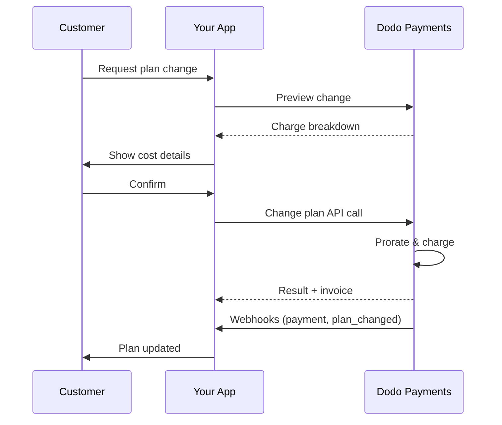
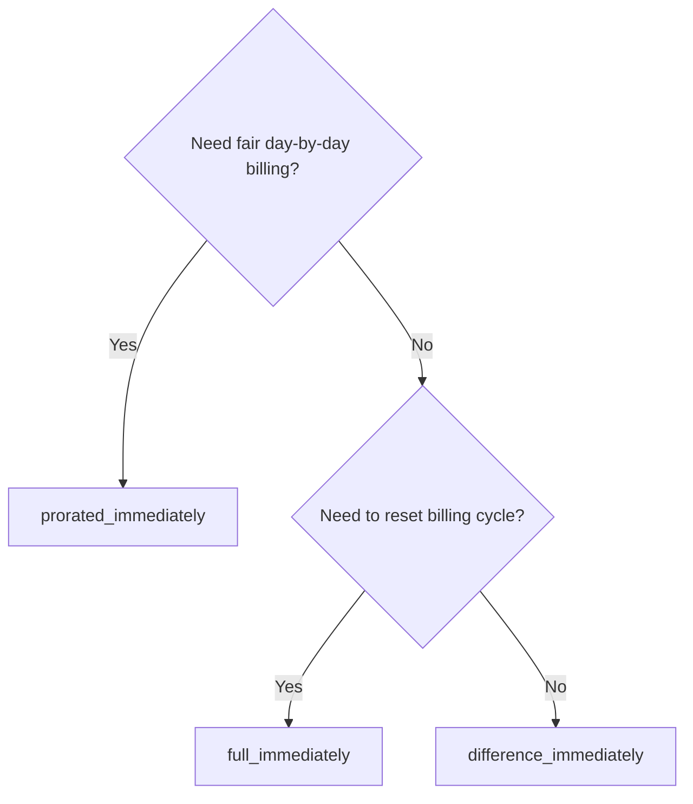
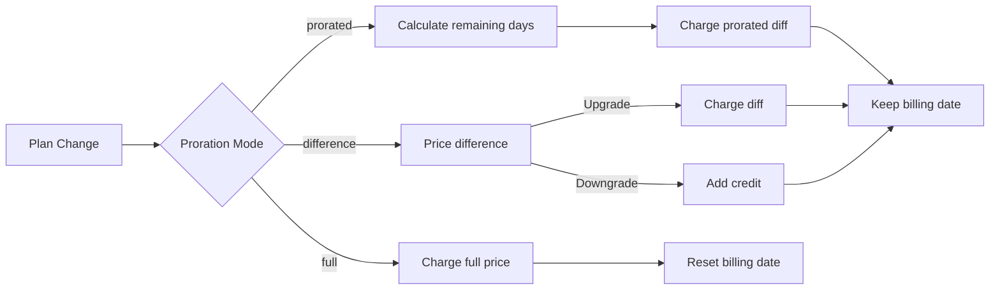

<CardGroup cols={3}>
<Card title="Changer l'API de Plan" icon="code" href="/api-reference/subscriptions/change-plan">
  Documentation API complète pour la mise à jour des abonnements.
</Card>
<Card title="Aperçu du Changement de Plan" icon="eye" href="/api-reference/subscriptions/preview-change-plan">
  Voir les montants des charges avant de changer de plan.
</Card>
<Card title="Guide d'Intégration" icon="book" href="/developer-resources/subscription-integration-guide">
  Configuration d'abonnement étape par étape.
</Card>
</CardGroup>

## Qu'est-ce qu'une mise à niveau ou une rétrogradation d'abonnement?

Changer de plan permet de déplacer un client entre les niveaux d'abonnement ou les quantités. Utilisez-le pour :
- Aligner les prix avec l'utilisation ou les fonctionnalités
- Passer d'un abonnement mensuel à annuel (ou vice versa)
- Ajuster la quantité pour les produits basés sur les sièges

<Info>
Les changements de plan peuvent entraîner une charge immédiate selon le mode de proration que vous choisissez.
</Info>

## Quand utiliser les changements de plan

- Mise à niveau lorsque le client a besoin de plus de fonctionnalités, d'utilisation ou de sièges
- Rétrogradation lorsque l'utilisation diminue
- Migrer des utilisateurs vers un nouveau produit ou prix sans annuler leur abonnement

## Flux de Changement de Plan



## Prérequis

Avant de mettre en œuvre des changements de plan d'abonnement, assurez-vous d'avoir :

- Un compte marchand Dodo Payments avec des produits d'abonnement actifs
- Des identifiants API (clé API et clé secrète de webhook) depuis le tableau de bord
- Un abonnement actif existant à modifier
- Un point de terminaison de webhook configuré pour gérer les événements d'abonnement

<Info>
Pour des instructions de configuration détaillées, consultez notre [Guide d'Intégration](/developer-resources/integration-guide#dashboard-setup).
</Info>

## Guide de Mise en Œuvre Étape par Étape

Suivez ce guide complet pour mettre en œuvre des changements de plan d'abonnement dans votre application :

<Steps>
<Step title="Comprendre les Exigences de Changement de Plan">
Avant de mettre en œuvre, déterminez :
- Quels produits d'abonnement peuvent être changés pour lesquels
- Quel mode de proratisation convient à votre modèle commercial
- Comment gérer les échecs de changement de plan de manière élégante
- Quels événements de webhook suivre pour la gestion des états

<Tip>
Testez les changements de plan de manière approfondie en mode test avant de les mettre en production.
</Tip>
</Step>

<Step title="Choisissez Votre Stratégie de Proratisation">
Sélectionnez l'approche de facturation qui correspond à vos besoins commerciaux :

<Tabs>
<Tab title="prorated_immediately">
Idéal pour : les applications SaaS souhaitant facturer équitablement pour le temps non utilisé
- Calcule le montant proratisé exact basé sur le temps de cycle restant
- Facture un montant proratisé basé sur le temps non utilisé restant dans le cycle
- Fournit une facturation transparente aux clients
</Tab>

<Tab title="difference_immediately">
Idéal pour : des scénarios de mise à niveau/rétrogradation clairs
- Mise à niveau : facturer la différence immédiate (par exemple, 30 $ → 80 $ = facturer 50 $)
- Rétrogradation : créditer la valeur restante pour les renouvellements futurs
- Simplifie la logique de facturation et la communication avec les clients
</Tab>

<Tab title="full_immediately">
Idéal pour : lorsque vous souhaitez réinitialiser le cycle de facturation
- Facture le montant total du nouveau plan immédiatement
- Ignore le temps restant de l'ancien plan
- Utile pour les transitions annuelles vers mensuelles
</Tab>
</Tabs>
</Step>

<Step title="Implémentez l'API Changer de Plan">
Utilisez l'API Changer de Plan pour modifier les détails de l'abonnement :

<ParamField path="subscription_id" type="string" required>
L'ID de l'abonnement actif à modifier.
</ParamField>

<ParamField path="product_id" type="string" required>
Le nouvel ID de produit pour changer l'abonnement.
</ParamField>

<ParamField path="quantity" type="integer" default="1">
Nombre d'unités pour le nouveau plan (pour les produits basés sur des sièges).
</ParamField>

<ParamField path="proration_billing_mode" type="string" required>
Comment gérer la facturation immédiate : `prorated_immediately`, `full_immediately`, ou `difference_immediately`.
</ParamField>

<ParamField path="addons" type="array">
Extensions facultatives pour le nouveau plan. Laisser ceci vide supprime toutes les extensions existantes.
</ParamField>

<ParamField path="on_payment_failure" type="string">
Contrôle le comportement lorsque le paiement du changement de plan échoue :
- `prevent_change` : Maintenir l'abonnement sur le plan actuel jusqu'à ce que le paiement réussisse
- `apply_change` (par défaut) : Appliquer le changement de plan immédiatement quel que soit le résultat du paiement.

S'il n'est pas spécifié, utilise le réglage par défaut au niveau de l'entreprise.
</ParamField>
</Step>

<Step title="Gérer les Événements Webhook">
Configurez la gestion des webhooks pour suivre les résultats des changements de plan :

- `subscription.active` : Changement de plan réussi, abonnement mis à jour
- `subscription.plan_changed` : Plan d'abonnement changé (mise à niveau/rétrogradation/mise à jour de l'addon)
- `subscription.on_hold` : Échec de la charge pour le changement de plan, abonnement suspendu
- `payment.succeeded` : Charge immédiate pour le changement de plan réussie
- `payment.failed` : Échec de la charge immédiate

<Warning>
Vérifiez toujours les signatures des webhooks et implémentez un traitement d'événements idempotent.
</Warning>
</Step>

<Step title="Mettre à Jour l'État de Votre Application">
En fonction des événements webhook, mettez à jour votre application :
- Accordez/révocquez les fonctionnalités en fonction du nouveau plan
- Mettez à jour le tableau de bord des clients avec les nouveaux détails du plan
- Envoyez des e-mails de confirmation concernant les changements de plan
- Enregistrez les changements de facturation à des fins d'audit
</Step>

<Step title="Tester et Surveiller">
Testez soigneusement votre mise en œuvre :
- Testez tous les modes de proration avec différents scénarios
- Vérifiez que le traitement des webhooks fonctionne correctement
- Surveillez les taux de réussite des changements de plan
- Configurez des alertes pour les échecs de changement de plan
</Step>

<Check>
Votre mise en œuvre de changement de plan d'abonnement est désormais prête pour une utilisation en production.
</Check>
</Step>
</Steps>

## Aperçu des Changements de Plan

Avant de vous engager dans un changement de plan, utilisez l'API d'Aperçu pour montrer aux clients exactement ce qu'ils seront facturés :

<Tabs>
<Tab title="Node.js SDK">

```javascript
const preview = await client.subscriptions.previewChangePlan('sub_123', {
  product_id: 'prod_pro',
  quantity: 1,
  proration_billing_mode: 'prorated_immediately'
});

// Show customer the charge before confirming
console.log('Immediate charge:', preview.immediate_charge.summary);
console.log('New plan details:', preview.new_plan);
```

</Tab>

<Tab title="Python SDK">

```python
preview = client.subscriptions.preview_change_plan(
    subscription_id="sub_123",
    product_id="prod_pro",
    quantity=1,
    proration_billing_mode="prorated_immediately"
)

# Show customer the charge before confirming
print("Immediate charge:", preview.immediate_charge.summary)
print("New plan details:", preview.new_plan)
```

</Tab>
</Tabs>

<Tip>
Utilisez l'API d'aperçu pour créer des dialogues de confirmation qui montrent aux clients le montant exact qu'ils seront facturés avant de confirmer un changement de plan.
</Tip>

## API de Changement de Plan

Utilisez l'API de Changement de Plan pour modifier le produit, la quantité et le comportement de proration pour un abonnement actif.

### Exemples de démarrage rapide

<Tabs>
  <Tab title="Node.js SDK">

    ```javascript
    import DodoPayments from 'dodopayments';

    const client = new DodoPayments({
      bearerToken: process.env.DODO_PAYMENTS_API_KEY,
      environment: 'test_mode', // defaults to 'live_mode'
    });

    async function changePlan() {
      const result = await client.subscriptions.changePlan('sub_123', {
        product_id: 'prod_new',
        quantity: 3,
        proration_billing_mode: 'prorated_immediately',
        on_payment_failure: 'prevent_change', // Optional: control behavior on payment failure
      });
      console.log(result.status, result.invoice_id, result.payment_id);
    }

    changePlan();
    ```

  </Tab>
  <Tab title="Python SDK">

    ```python
    import os
    from dodopayments import DodoPayments

    client = DodoPayments(
        bearer_token=os.environ.get("DODO_PAYMENTS_API_KEY"),
        environment="test_mode",  # defaults to "live_mode"
    )

    result = client.subscriptions.change_plan(
        subscription_id="sub_123",
        product_id="prod_new",
        quantity=3,
        proration_billing_mode="prorated_immediately",
        on_payment_failure="prevent_change",  # Optional: control behavior on payment failure
    )
    print(result.status, result.get("invoice_id"), result.get("payment_id"))
    ```

  </Tab>
  <Tab title="Go SDK">

    ```go
    package main

    import (
      "context"
      "fmt"
      "github.com/dodopayments/dodopayments-go"
      "github.com/dodopayments/dodopayments-go/option"
    )

    func main() {
      client := dodopayments.NewClient(option.WithBearerToken("YOUR_TOKEN"))
      res, err := client.Subscriptions.ChangePlan(context.TODO(), dodopayments.SubscriptionChangePlanParams{
        SubscriptionID: dodopayments.F("sub_123"),
        ProductID:             dodopayments.F("prod_new"),
        Quantity:              dodopayments.F(int64(3)),
        ProrationBillingMode:  dodopayments.F(dodopayments.SubscriptionChangePlanParamsProrationBillingModeProratedImmediately),
        OnPaymentFailure:      dodopayments.F(dodopayments.OnPaymentFailurePreventChange), // Optional
      })
      if err != nil { panic(err) }
      fmt.Println(res.Status, res.InvoiceID, res.PaymentID)
    }
    ```

  </Tab>
  <Tab title="HTTP">

    ```bash
    curl -X POST "$DODO_API_BASE/subscriptions/sub_123/change-plan" \
      -H "Authorization: Bearer $DODO_PAYMENTS_API_KEY" \
      -H "Content-Type: application/json" \
      -d '{
        "product_id": "prod_new",
        "quantity": 3,
        "proration_billing_mode": "prorated_immediately",
        "on_payment_failure": "prevent_change"
      }'
    ```

  </Tab>
</Tabs>

```json Success
{
  "status": "processing",
  "subscription_id": "sub_123",
  "invoice_id": "inv_789",
  "payment_id": "pay_456",
  "proration_billing_mode": "prorated_immediately"
}
```

<Note>
Des champs comme <code>invoice_id</code> et <code>payment_id</code> ne sont retournés que lorsqu'une charge immédiate et/ou une facture est créée lors du changement de plan. Comptez toujours sur les événements webhook (par exemple, <code>payment.succeeded</code>, <code>subscription.plan_changed</code>) pour confirmer les résultats.
</Note>

<Warning>
Si la charge immédiate échoue, l'abonnement peut passer à `subscription.on_hold` jusqu'à ce que le paiement réussisse.
</Warning>

## Gérer les Addons

Lors du changement de plans d'abonnement, vous pouvez également modifier les addons :

```javascript
// Add addons to the new plan
await client.subscriptions.changePlan('sub_123', {
  product_id: 'prod_new',
  quantity: 1,
  proration_billing_mode: 'difference_immediately',
  addons: [
    { addon_id: 'addon_123', quantity: 2 }
  ]
});

// Remove all existing addons
await client.subscriptions.changePlan('sub_123', {
  product_id: 'prod_new',
  quantity: 1,
  proration_billing_mode: 'difference_immediately',
  addons: [] // Empty array removes all existing addons
});
```

<Info>
Les addons sont inclus dans le calcul de proration et seront facturés selon le mode de proration sélectionné.
</Info>

## Modes de Proration

Choisissez comment facturer le client lors du changement de plan :

#### `prorated_immediately`
- Charges pour la différence partielle dans le cycle actuel
- S'il est en essai, charges immédiatement et passe au nouveau plan maintenant
- Rétrogradation : peut générer un crédit prorata appliqué aux renouvellements futurs

#### `full_immediately`
- Charges le montant total du nouveau plan immédiatement
- Ignore le temps restant du vieux plan

<Info>
Les crédits générés par les rétrogradations utilisant <code>difference_immediately</code> sont spécifiques à l'abonnement et distincts des <a href="/features/customer-credit">Crédits Client</a>. Ils s'appliquent automatiquement aux renouvellements futurs du même abonnement et ne sont pas transférables entre abonnements.
</Info>

#### `difference_immediately`
- Mise à niveau : facturer immédiatement la différence de prix entre l'ancien et le nouveau plan
- Rétrogradation : ajouter la valeur restante en tant que crédit interne à l'abonnement et l'appliquer automatiquement lors des renouvellements

| Fonctionnalité | `prorated_immediately` | `difference_immediately` | `full_immediately` |
|---------|----------------------|------------------------|-------------------|
| **Frais de mise à niveau** | Différence proratisée pour les jours restants | Différence de prix totale entre les plans | Prix total du nouveau plan |
| **Crédit de rétrogradation** | Crédit proratisé pour les jours restants | Différence de prix totale comme crédit | Pas de crédit |
| **Cycle de facturation** | Inchangé | Inchangé | Réinitialisé à aujourd'hui |
| **Comportement d'essai** | Met fin à l'essai, charges immédiatement | Met fin à l'essai, charges immédiatement | Met fin à l'essai, charges le montant total |
| **Meilleur pour** | Facturation équitable basée sur le temps | Mathématiques simples de mise à niveau/rétrogradation | Réinitialisation des cycles de facturation |
| **Complexité** | Moyenne (calcul du jour) | Faible (soustraction simple) | Faible (charge complète) |



### Scénarios d'Exemple

Utilisez ces chiffres canoniques de manière cohérente :
- Plan actuel : **Basique** à **30 $/mois**
- Cible de mise à niveau : **Pro** à **80 $/mois**
- Cible de rétrogradation (de Pro) : **Starter** à **20 $/mois**
- Cycle de facturation : **30 jours**, commencé le **1er janvier**
- Le changement de plan se produit le **16 janvier** (15 jours restants, 15 jours utilisés)

<AccordionGroup>
  <Accordion title="Mise à niveau : Basique (30 $) → Pro (80 $) avec prorated_immediately">

    ```
    Step 1: Calculate unused credit from current plan
      Unused days = 15 out of 30 days
      Credit = $30 × (15/30) = $15.00

    Step 2: Calculate prorated cost of new plan
      Remaining days = 15 out of 30 days
      New plan cost = $80 × (15/30) = $40.00

    Step 3: Calculate immediate charge
      Charge = New plan cost − Credit
      Charge = $40.00 − $15.00 = $25.00

    → Customer pays $25.00 now
    → Next renewal (Feb 1): $80.00/month
    ```

    ```javascript
    await client.subscriptions.changePlan('sub_123', {
      product_id: 'prod_pro',
      quantity: 1,
      proration_billing_mode: 'prorated_immediately'
    })
    ```

  </Accordion>

  <Accordion title="Rétrogradation : Pro (80 $) → Starter (20 $) avec prorated_immediately">

    ```
    Step 1: Calculate unused credit from current plan
      Unused days = 15 out of 30 days
      Credit = $80 × (15/30) = $40.00

    Step 2: Calculate prorated cost of new plan
      Remaining days = 15 out of 30 days
      New plan cost = $20 × (15/30) = $10.00

    Step 3: Calculate credit balance
      Credit = $40.00 − $10.00 = $30.00

    → No charge — $30.00 credit added to subscription
    → Credit auto-applies to future renewals
    → Next renewal (Feb 1): $20.00 − $30.00 credit = $0.00
    → Following renewal (Mar 1): $20.00 − $10.00 remaining credit = $10.00
    ```

    ```javascript
    await client.subscriptions.changePlan('sub_123', {
      product_id: 'prod_starter',
      quantity: 1,
      proration_billing_mode: 'prorated_immediately'
    })
    ```

  </Accordion>

  <Accordion title="Mise à niveau : Basique (30 $) → Pro (80 $) avec difference_immediately">

    ```
    Immediate charge = New plan price − Old plan price
                     = $80 − $30
                     = $50.00

    → Customer pays $50.00 now (regardless of cycle position)
    → Next renewal (Feb 1): $80.00/month
    ```

    ```javascript
    await client.subscriptions.changePlan('sub_123', {
      product_id: 'prod_pro',
      quantity: 1,
      proration_billing_mode: 'difference_immediately'
    })
    ```

  </Accordion>

  <Accordion title="Rétrogradation : Pro (80 $) → Starter (20 $) avec difference_immediately">

    ```
    Credit = Old plan price − New plan price
           = $80 − $20
           = $60.00

    → No charge — $60.00 credit added to subscription
    → Credit auto-applies to future renewals
    → Next renewal: $20.00 − $20.00 (from credit) = $0.00
    → Following renewal: $20.00 − $20.00 (from credit) = $0.00
    → Third renewal: $20.00 − $20.00 (from remaining credit) = $0.00
    ```

    ```javascript
    await client.subscriptions.changePlan('sub_123', {
      product_id: 'prod_starter',
      quantity: 1,
      proration_billing_mode: 'difference_immediately'
    })
    ```

  </Accordion>

  <Accordion title="Mise à niveau : Basique (30 $) → Pro (80 $) avec full_immediately">

    ```
    Immediate charge = Full new plan price = $80.00

    → Customer pays $80.00 now
    → No credit for unused time on old plan
    → Billing cycle resets to today (January 16)
    → Next renewal: February 16 at $80.00/month
    ```

    ```javascript
    await client.subscriptions.changePlan('sub_123', {
      product_id: 'prod_pro',
      quantity: 1,
      proration_billing_mode: 'full_immediately'
    })
    ```

  </Accordion>

  <Accordion title="Mise à niveau en milieu de cycle avec des addons utilisant prorated_immediately">

    ```
    Current: Basic plan ($30/month), no add-ons
    New: Pro plan ($80/month) + Extra Seats add-on ($10/seat × 3 seats = $30/month)
    Change on day 16 of 30 (15 days remaining)

    Step 1: Credit from current plan
      Credit = $30 × (15/30) = $15.00

    Step 2: Prorated cost of new plan + add-ons
      New plan = $80 × (15/30) = $40.00
      Add-ons = $30 × (15/30) = $15.00
      Total new = $55.00

    Step 3: Immediate charge
      Charge = $55.00 − $15.00 = $40.00

    → Customer pays $40.00 now
    → Next renewal: $80.00 + $30.00 = $110.00/month
    ```

    ```javascript
    await client.subscriptions.changePlan('sub_123', {
      product_id: 'prod_pro',
      quantity: 1,
      proration_billing_mode: 'prorated_immediately',
      addons: [
        { addon_id: 'addon_seats', quantity: 3 }
      ]
    })
    ```

  </Accordion>
</AccordionGroup>

### Comment chaque mode traite la facturation



<Tip>
Choisissez `prorated_immediately` pour une comptabilité équitable basée sur le temps ; choisissez `full_immediately` pour redémarrer la facturation ; utilisez `difference_immediately` pour des mises à niveau simples et un crédit automatique pour les rétrogradations.
</Tip>

## Gestion des Échecs de Paiement

Contrôlez ce qui se passe lorsque le paiement du changement de plan échoue à l'aide du paramètre `on_payment_failure`.

### Modes d'Échec de Paiement

<Tabs>
<Tab title="prevent_change (Recommandé pour les mises à niveau critiques)">
**Comportement** : Garder l'abonnement sur son plan actuel jusqu'à ce que le paiement réussisse.

- Le changement de plan est marqué comme "en attente"
- Le client conserve l'accès à son plan actuel
- L'abonnement passe à l'état `active` seulement après un paiement réussi
- Utile lorsque vous souhaitez garantir le paiement avant d'accorder des fonctionnalités mises à niveau

```javascript
await client.subscriptions.changePlan('sub_123', {
  product_id: 'prod_pro',
  quantity: 1,
  proration_billing_mode: 'prorated_immediately',
  on_payment_failure: 'prevent_change'
});
```

</Tab>

<Tab title="apply_change (Par défaut)">
**Comportement** : Appliquer immédiatement le changement de plan, quel que soit le résultat du paiement.

- Le changement de plan est appliqué même si le paiement échoue
- Le client obtient un accès immédiat au nouveau plan
- L'abonnement peut passer à l'état `on_hold` si le paiement échoue
- Bon pour des mises à niveau non critiques ou lorsque vous faites confiance au client

```javascript
await client.subscriptions.changePlan('sub_123', {
  product_id: 'prod_pro',
  quantity: 1,
  proration_billing_mode: 'prorated_immediately',
  on_payment_failure: 'apply_change' // This is the default
});
```

</Tab>
</Tabs>

<Info>
S'il n'est pas spécifié, le paramètre `on_payment_failure` utilise votre réglage par défaut au niveau de l'entreprise configuré dans le tableau de bord.
</Info>

### Quand utiliser chaque mode

| Scénario | Mode Recommandé | Raison |
|----------|------------------|--------|
| Mise à niveau vers des fonctionnalités premium | `prevent_change` | Garantir le paiement avant d'accorder l'accès |
| Augmentation de la quantité (plus de sièges) | `prevent_change` | Empêcher l'utilisation sans paiement |
| Rétrogradation des plans | `apply_change` | Le client réduit ses dépenses |
| Clients d'entreprise fiables | `apply_change` | Risque de non-paiement plus faible |
| Conversion de l'essai à un paiement | `prevent_change` | Moment critique de paiement |

## Gestion des webhooks

Suivez l'état de l'abonnement via des webhooks pour confirmer les changements de plan et les paiements.

### Types d'événements à gérer
- `subscription.active` : abonnement activé
- `subscription.plan_changed` : plan d'abonnement changé (mise à niveau/rétrogradation/changements d'addon)
- `subscription.on_hold` : échec de la charge, abonnement suspendu
- `subscription.renewed` : renouvellement réussi
- `payment.succeeded` : paiement pour changement de plan ou renouvellement réussi
- `payment.failed` : échec du paiement

<Info>
Nous recommandons de conduire la logique métier à partir des événements d'abonnement et d'utiliser les événements de paiement pour confirmation et réconciliation.
</Info>

### Vérifiez les signatures et gérez les intentions

<Tabs>
  <Tab title="Gestionnaire de Routes Next.js">

    ```javascript
    import { NextRequest, NextResponse } from 'next/server';
    
    export async function POST(req) {
      const webhookId = req.headers.get('webhook-id');
      const webhookSignature = req.headers.get('webhook-signature');
      const webhookTimestamp = req.headers.get('webhook-timestamp');
      const secret = process.env.DODO_WEBHOOK_SECRET;
    
      const payload = await req.text();
      // verifySignature is a placeholder – in production, use a Standard Webhooks library
      const { valid, event } = await verifySignature(
        payload,
        { id: webhookId, signature: webhookSignature, timestamp: webhookTimestamp },
        secret
      );
      if (!valid) return NextResponse.json({ error: 'Invalid signature' }, { status: 400 });
    
      switch (event.type) {
        case 'subscription.active':
          // mark subscription active in your DB
          break;
        case 'subscription.plan_changed':
          // refresh entitlements and reflect the new plan in your UI
          break;
        case 'subscription.on_hold':
          // notify user to update payment method
          break;
        case 'subscription.renewed':
          // extend access window
          break;
        case 'payment.succeeded':
          // reconcile payment for plan change
          break;
        case 'payment.failed':
          // log and alert
          break;
        default:
          // ignore unknown events
          break;
      }
    
      return NextResponse.json({ received: true });
    }
    ```

  </Tab>
  <Tab title="Express.js">

    ```javascript
    import express from 'express';
    
    const app = express();
    app.post('/webhooks/dodo', express.raw({ type: 'application/json' }), async (req, res) => {
      const webhookId = req.header('webhook-id');
      const webhookSignature = req.header('webhook-signature');
      const webhookTimestamp = req.header('webhook-timestamp');
      const secret = process.env.DODO_WEBHOOK_SECRET;
      const payload = req.body.toString('utf8');
    
      const { valid, event } = await verifySignature(
        payload,
        { id: webhookId, signature: webhookSignature, timestamp: webhookTimestamp },
        secret
      );
      if (!valid) return res.status(400).send('Invalid signature');
    
      // handle events like above
      res.json({ received: true });
    });
    
    app.listen(3000);
    ```

  </Tab>
</Tabs>

<Note>
Pour des schémas de payload détaillés, consultez les <a href="/developer-resources/webhooks/intents/subscription">Payloads de webhook d'abonnement</a> et les <a href="/developer-resources/webhooks/intents/payment">Payloads de webhook de paiement</a>.
</Note>

## Meilleures Pratiques

Suivez ces recommandations pour des changements de plan d'abonnement fiables :

### Stratégie de Changement de Plan
- **Testez à fond** : Testez toujours les changements de plan en mode test avant de passer en production
- **Choisissez la proration avec soin** : Sélectionnez le mode de proration qui correspond à votre modèle commercial
- **Gérez les échecs avec grâce** : Implémentez un traitement d'erreur approprié et une logique de réessai
- **Surveillez les taux de réussite** : Suivez les taux de succès/échec des changements de plan et investigatez les problèmes

### Mise en œuvre des Webhooks
- **Vérifiez les signatures** : Validez toujours les signatures des webhooks pour garantir leur authenticité
- **Implémentez l'idempotence** : Gérez les événements webhook en double avec grâce
- **Traitez de manière asynchrone** : Ne bloquez pas les réponses des webhooks avec des opérations lourdes
- **Enregistrez tout** : Conservez des journaux détaillés pour le débogage et à des fins d'audit

### Expérience Utilisateur
- **Communiquez clairement** : Informez les clients des changements de facturation et de timing
- **Fournissez des confirmations** : Envoyez des e-mails de confirmation pour les changements de plan réussis
- **Gérez les cas limites** : Prenez en compte les périodes d'essai, les prorations et les paiements échoués
- **Mettez à jour l'interface utilisateur immédiatement** : Réflétez les changements de plan dans l'interface de votre application

## Problèmes Courants et Solutions

Résolvez les problèmes typiques rencontrés lors des changements de plan d'abonnement :

<AccordionGroup>
<Accordion title="Charge créée mais abonnement non mis à jour">
**Symptômes** : L'appel API réussit mais l'abonnement reste sur l'ancien plan

**Causes courantes** :
- Traitement du webhook échoué ou retardé
- État de l'application non mis à jour après la réception des webhooks
- Problèmes de transaction de base de données lors de la mise à jour de l'état

**Solutions** :
- Mettez en œuvre une gestion robuste des webhooks avec une logique de réessai
- Utilisez des opérations idempotentes pour les mises à jour d'état
- Ajoutez une surveillance pour détecter et alerter les événements webhook manqués
- Vérifiez que le point de terminaison webhook est accessible et répond correctement
</Accordion>

<Accordion title="Crédits non appliqués après rétrogradation">
**Symptômes** : Le client rétrograde mais ne voit pas le solde de crédit

**Causes courantes** :
- Attentes du mode de proration : les rétrogradations créditent la différence de prix totale du plan avec `difference_immediately`, tandis que `prorated_immediately` crée un crédit prorata basé sur le temps restant dans le cycle
- Les crédits sont spécifiques à l'abonnement et ne se transfèrent pas entre abonnements
- Le solde de crédit n'est pas visible dans le tableau de bord client

**Solutions** :
- Utilisez `difference_immediately` pour les rétrogradations lorsque vous souhaitez des crédits automatiques
- Expliquez aux clients que les crédits s'appliquent aux renouvellements futurs du même abonnement
- Implémentez un portail client pour afficher les soldes de crédit
- Vérifiez l'aperçu de la prochaine facture pour voir les crédits appliqués
</Accordion>

<Accordion title="Échec de la vérification de la signature du webhook">
**Symptômes** : Événements webhook rejetés en raison d'une signature invalide

**Causes courantes** :
- Clé secrète du webhook incorrecte
- Corps de la requête brut modifié avant la vérification de la signature
- Mauvais algorithme de vérification de la signature

**Solutions** :
- Vérifiez que vous utilisez le bon `DODO_WEBHOOK_SECRET` depuis le tableau de bord
- Lisez le corps de requête brut avant tout middleware de parsing JSON
- Utilisez la bibliothèque standard de vérification des webhooks pour votre plateforme
- Testez la vérification de la signature du webhook dans l'environnement de développement
</Accordion>

<Accordion title="Le changement de plan échoue avec une erreur 422">
**Symptômes** : L'API renvoie une erreur 422 Entité traitable


**Causes courantes** :
- ID d'abonnement ou ID de produit invalide
- Abonnement non actif
- Paramètres requis manquants
- Produit non disponible pour les changements de plan

**Solutions** :
- Vérifiez que l'abonnement existe et est actif
- Vérifiez que l'ID de produit est valide et disponible
- Assurez-vous que tous les paramètres requis sont fournis
- Consultez la documentation API pour les exigences relatives aux paramètres
</Accordion>

<Accordion title="Le chargement immédiat échoue lors du changement de plan">
**Symptômes** : Le changement de plan est initié, mais la charge immédiate échoue


**Causes courantes** :
- Fonds insuffisants sur le mode de paiement du client
- Mode de paiement expiré ou invalide
- La banque a refusé la transaction
- La détection des fraudes a bloqué la charge

**Solutions** :
- Gérez les événements webhook `payment.failed` de manière appropriée
- Informez le client de mettre à jour son mode de paiement
- Mettez en œuvre une logique de réessai pour les échecs temporaires
- Envisagez de permettre des changements de plan avec des charges immédiates échouées
</Accordion>

<Accordion title="Abonnement en attente après le changement de plan">
**Symptômes** : La charge du changement de plan échoue et l'abonnement passe à l'état `on_hold`


**Que se passe-t-il** :
Lorsque la charge d'un changement de plan échoue, l'abonnement est automatiquement placé dans l'état `on_hold`. L'abonnement ne se renouvellera pas automatiquement tant que le mode de paiement n'aura pas été mis à jour.

**Solution** : Mettez à jour le mode de paiement pour réactiver l'abonnement

Pour réactiver un abonnement depuis l'état `on_hold` après un échec de changement de plan :

1. **Mettez à jour le mode de paiement** en utilisant l'API de Mise à jour du Mode de Paiement
2. **Création de charge automatique** : L'API crée automatiquement une charge pour les dus restants
3. **Génération de facture** : Une facture est générée pour la charge
4. **Traitement du paiement** : Le paiement est traité à l'aide du nouveau mode de paiement
5. **Réactivation** : Après un paiement réussi, l'abonnement est réactivé à l'état `active`

<CodeGroup>

```javascript Node.js
// Reactivate subscription from on_hold after failed plan change
async function reactivateAfterFailedPlanChange(subscriptionId) {
  // Update payment method - automatically creates charge for remaining dues
  const response = await client.subscriptions.updatePaymentMethod(subscriptionId, {
    type: 'new',
    return_url: 'https://example.com/return'
  });
  
  if (response.payment_id) {
    console.log('Charge created for remaining dues:', response.payment_id);
    console.log('Payment link:', response.payment_link);
    
    // Redirect customer to payment_link to complete payment
    // Monitor webhooks for:
    // 1. payment.succeeded - charge succeeded
    // 2. subscription.active - subscription reactivated
  }
  
  return response;
}

// Or use existing payment method if available
async function reactivateWithExistingPaymentMethod(subscriptionId, paymentMethodId) {
  const response = await client.subscriptions.updatePaymentMethod(subscriptionId, {
    type: 'existing',
    payment_method_id: paymentMethodId
  });
  
  // Monitor webhooks for payment.succeeded and subscription.active
  return response;
}
```

```python Python
# Reactivate subscription from on_hold after failed plan change
def reactivate_after_failed_plan_change(subscription_id):
    # Update payment method - automatically creates charge for remaining dues
    response = client.subscriptions.update_payment_method(
        subscription_id=subscription_id,
        type="new",
        return_url="https://example.com/return"
    )
    
    if response.payment_id:
        print("Charge created for remaining dues:", response.payment_id)
        print("Payment link:", response.payment_link)
        
        # Redirect customer to payment_link to complete payment
        # Monitor webhooks for:
        # 1. payment.succeeded - charge succeeded
        # 2. subscription.active - subscription reactivated
    
    return response

# Or use existing payment method if available
def reactivate_with_existing_payment_method(subscription_id, payment_method_id):
    response = client.subscriptions.update_payment_method(
        subscription_id=subscription_id,
        type="existing",
        payment_method_id=payment_method_id
    )
    
    # Monitor webhooks for payment.succeeded and subscription.active
    return response
```

</CodeGroup>

**Événements webhook à surveiller** :
- `subscription.on_hold` : Abonnement placé en attente (reçu lorsque la charge du changement de plan échoue)
- `payment.succeeded` : Paiement des dues restantes réussi (après la mise à jour du mode de paiement)
- `subscription.active` : Abonnement réactivé après un paiement réussi

**Meilleures pratiques** :
- Informez immédiatement les clients lorsque la charge du changement de plan échoue
- Donnez des instructions claires sur la façon de mettre à jour leur mode de paiement
- Surveillez les événements webhook pour suivre l'état de réactivation
- Envisagez de mettre en œuvre une logique de réessai automatique pour les échecs de paiement temporaires

<Card title="Référence API de Mise à Jour du Mode de Paiement" icon="code" href="/api-reference/subscriptions/update-payment-method">
Consultez la documentation API complète pour la mise à jour des modes de paiement et la réactivation des abonnements.
</Card>
</Accordion>
</AccordionGroup>

## Tester Votre Mise en Œuvre

Suivez ces étapes pour tester rigoureusement votre mise en œuvre de changement de plan d'abonnement :

<Steps>
<Step title="Configurer l'environnement de test">
- Utilisez des clés API de test et des produits de test
- Créez des abonnements de test avec différents types de plan
- Configurez un point de terminaison webhook de test
- Configurez la surveillance et le journalisation
</Step>

<Step title="Tester différents modes de proration">
- Testez `prorated_immediately` avec diverses positions de cycle de facturation
- Testez `difference_immediately` pour les mises à niveau et rétrogradations
- Testez `full_immediately` pour réinitialiser les cycles de facturation
- Vérifiez que les calculs de crédit sont corrects
</Step>

<Step title="Tester le traitement des webhooks">
- Vérifiez que tous les événements webhook pertinents sont reçus
- Testez la vérification des signatures des webhooks
- Gérez les événements webhook en double avec grâce
- Testez les scénarios de défaillance du traitement des webhooks
</Step>

<Step title="Tester les scénarios d'erreur">
- Testez avec des IDs d'abonnement invalides
- Testez avec des modes de paiement expirés
- Testez les pannes et les délais d'attente du réseau
- Testez avec des fonds insuffisants
</Step>

<Step title="Surveiller en production">
- Configurez des alertes pour les changements de plan échoués
- Surveillez les durées de traitement des webhooks
- Suivez les taux de réussite des changements de plan
- Consultez les tickets de support client pour des problèmes de changement de plan
</Step>
</Steps>

## Gestion des Erreurs

Gérez les erreurs API courantes avec grâce dans votre mise en œuvre :

### Codes d'État HTTP

<AccordionGroup>
<Accordion title="200 OK">
Demande de changement de plan traitée avec succès. L'abonnement est en cours de mise à jour et le traitement du paiement a commencé.
</Accordion>

<Accordion title="400 Bad Request">
Paramètres de demande invalides. Vérifiez que tous les champs requis sont fournis et correctement formatés.
</Accordion>

<Accordion title="401 Unauthorized">
Clé API invalide ou manquante. Vérifiez que votre `DODO_PAYMENTS_API_KEY` est correct et dispose des autorisations appropriées.
</Accordion>

<Accordion title="404 Not Found">
ID d'abonnement introuvable ou ne vous appartient pas.
</Accordion>

<Accordion title="422 Unprocessable Entity">
L'abonnement ne peut pas être changé (par exemple, déjà annulé, produit non disponible, etc.).
</Accordion>

<Accordion title="500 Internal Server Error">
Une erreur serveur s'est produite. Réessayez la demande après un bref délai.
</Accordion>
</AccordionGroup>

### Format de Réponse d'Erreur

```json
{
  "error": {
    "code": "subscription_not_found",
    "message": "The subscription with ID 'sub_123' was not found",
    "details": {
      "subscription_id": "sub_123"
    }
  }
}
```

## Étapes Suivantes

- Consultez l'<a href="/api-reference/subscriptions/change-plan">API de Changement de Plan</a>
- Explorez les <a href="/features/customer-credit">Crédits Client</a>
- Implémentez des alertes pour `subscription.on_hold`
- Consultez notre <a href="/developer-resources/webhooks">Guide d'Intégration des Webhooks</a>
