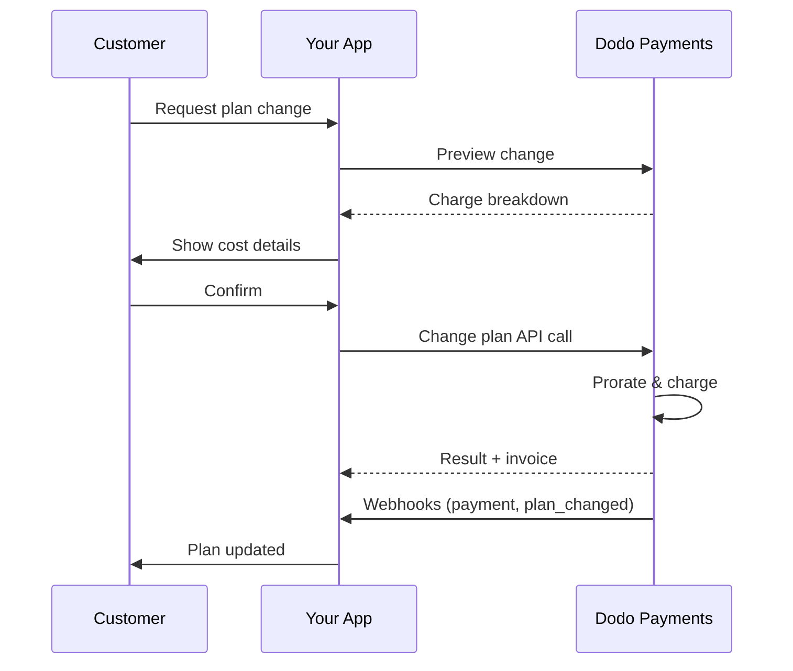
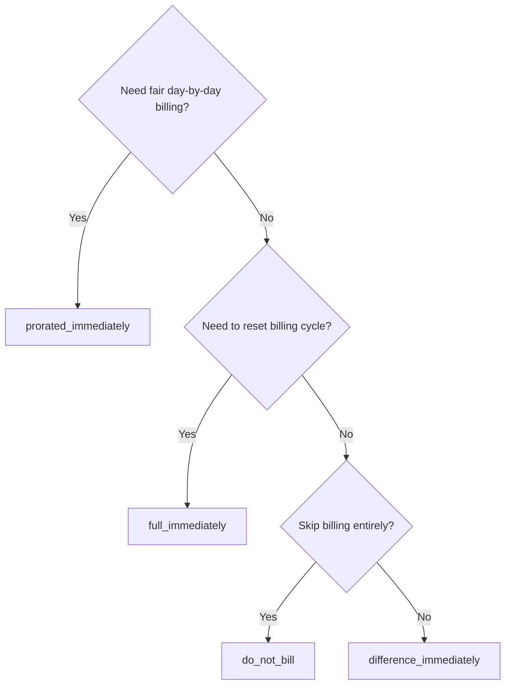
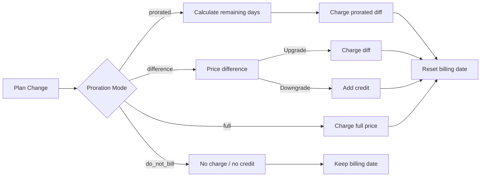

<CardGroup cols={3}>
<Card title="Change Plan API" icon="code" href="/api-reference/subscriptions/change-plan">
  Full API docs for updating subscriptions.
</Card>
<Card title="Plan Change Preview" icon="eye" href="/api-reference/subscriptions/preview-change-plan">
  See charge amounts before changing plans.
</Card>
<Card title="Integration Guide" icon="book" href="/developer-resources/subscription-integration-guide">
  Step-by-step subscription setup.
</Card>
</CardGroup>

## What is a subscription upgrade or downgrade?

Changing plans lets you move a customer between subscription tiers or quantities. Use it to:
- Align pricing with usage or features
- Move from monthly to annual (or vice versa)
- Adjust quantity for seat-based products

<Info>
Plan changes can trigger an immediate charge depending on the proration mode you choose.
</Info>

## When to use plan changes

- Upgrade when a customer needs more features, usage, or seats
- Downgrade when usage decreases
- Migrate users to a new product or price without cancelling their subscription

## Plan Change Flow



## Prerequisites

Before implementing subscription plan changes, ensure you have:

- A Dodo Payments merchant account with active subscription products
- API credentials (API key and webhook secret key) from the dashboard
- An existing active subscription to modify
- Webhook endpoint configured to handle subscription events

<Info>
For detailed setup instructions, see our [Integration Guide](/developer-resources/integration-guide#dashboard-setup).
</Info>

## Step-by-Step Implementation Guide

Follow this comprehensive guide to implement subscription plan changes in your application:

<Steps>
<Step title="Understand Plan Change Requirements">
Before implementing, determine:
- Which subscription products can be changed to which others
- What proration mode fits your business model
- How to handle failed plan changes gracefully
- Which webhook events to track for state management

<Tip>
Test plan changes thoroughly in test mode before implementing in production.
</Tip>
</Step>

<Step title="Choose Your Proration Strategy">
Select the billing approach that aligns with your business needs:

<Tabs>
<Tab title="prorated_immediately">
Best for: SaaS applications wanting to charge fairly for unused time
- Calculates exact prorated amount based on remaining cycle time
- Charges a prorated amount based on unused time remaining in the cycle
- Provides transparent billing to customers
</Tab>

<Tab title="difference_immediately">
Best for: Clear upgrade/downgrade scenarios
- Upgrade: Charge immediate difference (e.g., $30→$80 = charge $50)
- Downgrade: Credit remaining value for future renewals
- Simplifies billing logic and customer communication
</Tab>

<Tab title="full_immediately">
Best for: When you want to reset the billing cycle
- Charges full amount of new plan immediately
- Ignores remaining time from old plan
- Useful for annual to monthly transitions
</Tab>

<Tab title="do_not_bill">
Best for: Free migrations, courtesy switches, or absorbing cost differences
- No charges or credits calculated
- Customer moves to the new plan immediately without any billing adjustment
- Billing cycle remains unchanged
</Tab>
</Tabs>
</Step>

<Step title="Implement the Change Plan API">
Use the Change Plan API to modify subscription details:

<ParamField path="subscription_id" type="string" required>
The ID of the active subscription to modify.
</ParamField>

<ParamField path="product_id" type="string" required>
The new product ID to change the subscription to.
</ParamField>

<ParamField path="quantity" type="integer" required>
Number of units for the new plan (for seat-based products).
</ParamField>

<ParamField path="proration_billing_mode" type="string" required>
How to handle immediate billing: `prorated_immediately`, `full_immediately`, `difference_immediately`, or `do_not_bill`.
</ParamField>

<ParamField path="addons" type="array">
Optional addons for the new plan. Leaving this empty removes any existing addons.
</ParamField>

<ParamField path="on_payment_failure" type="string">
Controls behavior when the plan change payment fails:
- `prevent_change`: Keep subscription on current plan until payment succeeds
- `apply_change` (default): Apply plan change immediately regardless of payment outcome

If not specified, uses the business-level default setting.
</ParamField>

<ParamField path="collect_via_payment_link" type="boolean">
Collectez le montant du changement de plan avec un lien de paiement au lieu de débiter le moyen de paiement enregistré de l’abonnement. Le client paie sur une page de checkout hébergée.

Nécessite la capacité `allow_plan_change_via_payment_link` de l’entreprise (**Settings → Subscriptions → Collect Plan Change Payments by Payment Link**), `effective_at: immediately` et `on_payment_failure: prevent_change`. Consultez [Collecting Payment via a Checkout Link](#collecting-payment-via-a-checkout-link).

Ignoré par la route de preview.
</ParamField>

<ParamField path="discount_codes" type="array">
Codes de réduction **empilés** facultatifs à appliquer au nouveau plan (20 maximum, appliqués dans l’ordre du tableau). Le comportement dépend de ce que vous transmettez :

- **Non fourni / `null`** — les réductions existantes avec `preserve_on_plan_change=true` sont conservées si elles s’appliquent au nouveau produit.
- **`[]` (tableau vide)** — supprime toutes les réductions existantes de l’abonnement.
- **`["CODE_A", "CODE_B", ...]`** — remplace toutes les réductions existantes par cet ensemble empilé.
</ParamField>

<ParamField path="discount_code" type="string" deprecated>
**Obsolète** — préférez `discount_codes` pour les nouvelles intégrations. Ce champ fonctionne toujours pour assurer la rétrocompatibilité, mais ne peut pas être combiné avec `discount_codes` dans la même requête.
</ParamField>

<ParamField path="effective_at" type="string" default="immediately">
Quand appliquer le changement de plan :
- `immediately` (par défaut) : applique le changement de plan immédiatement
- `next_billing_date` : planifie le changement pour la prochaine date de facturation. Le client conserve son plan actuel jusqu’à la fin de la période de facturation.

Utilisez `next_billing_date` pour les downgrades afin que les clients conservent les avantages de leur plan actuel jusqu’à la fin de la période de facturation.
</ParamField>
</Step>

<Step title="Handle Webhook Events">
Configurez la gestion des webhooks pour suivre les résultats des changements de plan :

- `subscription.active` : changement de plan réussi, abonnement mis à jour
- `subscription.plan_changed` : plan d’abonnement modifié (upgrade/downgrade/mise à jour d’addon)
- `subscription.on_hold` : échec du débit du changement de plan, renouvellements arrêtés
- `payment.succeeded` : débit immédiat du changement de plan réussi
- `payment.failed` : échec du débit immédiat

<Warning>
Vérifiez toujours les signatures des webhooks et implémentez le traitement idempotent des événements.
</Warning>
</Step>

<Step title="Update Your Application State">
En fonction des événements webhook, mettez à jour votre application :
- Accordez ou révoquez les fonctionnalités selon le nouveau plan
- Mettez à jour le tableau de bord client avec les détails du nouveau plan
- Envoyez des e-mails de confirmation concernant les changements de plan
- Consignez les changements de facturation à des fins d’audit
</Step>

<Step title="Test and Monitor">
Testez soigneusement votre implémentation :
- Testez tous les modes de proratisation avec différents scénarios
- Vérifiez que la gestion des webhooks fonctionne correctement
- Surveillez les taux de réussite des changements de plan
- Configurez des alertes pour les changements de plan échoués

<Check>
Votre implémentation des changements de plan d’abonnement est maintenant prête pour la production.
</Check>
</Step>
</Steps>

## Prévisualiser les changements de plan

Avant de valider un changement de plan, utilisez l’API Preview pour montrer aux clients exactement le montant qui leur sera facturé :

<Tabs>
<Tab title="Node.js SDK">

```javascript
const preview = await client.subscriptions.previewChangePlan('sub_123', {
  product_id: 'pdt_pro',
  quantity: 1,
  proration_billing_mode: 'prorated_immediately'
});

// Show customer the charge before confirming
console.log('Immediate charge:', preview.immediate_charge.summary);
console.log('New plan details:', preview.new_plan);
```

</Tab>

<Tab title="Python SDK">

```python
preview = client.subscriptions.preview_change_plan(
    subscription_id="sub_123",
    product_id="pdt_pro",
    quantity=1,
    proration_billing_mode="prorated_immediately"
)

# Show customer the charge before confirming
print("Immediate charge:", preview.immediate_charge.summary)
print("New plan details:", preview.new_plan)
```

</Tab>
</Tabs>

<Tip>
Utilisez l’API Preview pour créer des boîtes de dialogue de confirmation qui affichent aux clients le montant exact qui leur sera facturé avant qu’ils ne confirment un changement de plan.
</Tip>

## API Change Plan

Utilisez l’API Change Plan pour modifier le produit, la quantité et le comportement de la proratisation d’un abonnement actif.

### Exemples de démarrage rapide

<Tabs>
  <Tab title="Node.js SDK">

    ```javascript
    import DodoPayments from 'dodopayments';

    const client = new DodoPayments({
      bearerToken: process.env.DODO_PAYMENTS_API_KEY,
      environment: 'test_mode', // defaults to 'live_mode'
    });

    async function changePlan() {
      // change-plan returns 200 with an empty body.
      await client.subscriptions.changePlan('sub_123', {
        product_id: 'pdt_new',
        quantity: 3,
        proration_billing_mode: 'prorated_immediately',
        on_payment_failure: 'prevent_change', // Optional: control behavior on payment failure
      });
      console.log('Plan change accepted; awaiting webhooks');
    }

    changePlan();
    ```

  </Tab>
  <Tab title="Python SDK">

    ```python
    import os
    from dodopayments import DodoPayments

    client = DodoPayments(
        bearer_token=os.environ.get("DODO_PAYMENTS_API_KEY"),
        environment="test_mode",  # defaults to "live_mode"
    )

    # change_plan returns 200 with an empty body.
    client.subscriptions.change_plan(
        subscription_id="sub_123",
        product_id="pdt_new",
        quantity=3,
        proration_billing_mode="prorated_immediately",
        on_payment_failure="prevent_change",  # Optional: control behavior on payment failure
    )
    print("Plan change accepted; awaiting webhooks")
    ```

  </Tab>
  <Tab title="Go SDK">

    ```go
    package main

    import (
      "context"
      "fmt"
      "github.com/dodopayments/dodopayments-go"
      "github.com/dodopayments/dodopayments-go/option"
    )

    func main() {
      client := dodopayments.NewClient(option.WithBearerToken("YOUR_TOKEN"))
      // ChangePlan returns no response body; a nil error means the change succeeded.
      err := client.Subscriptions.ChangePlan(context.TODO(), "sub_123", dodopayments.SubscriptionChangePlanParams{
        UpdateSubscriptionPlanReq: dodopayments.UpdateSubscriptionPlanReqParam{
          ProductID:            dodopayments.F("pdt_new"),
          Quantity:             dodopayments.F(int64(3)),
          ProrationBillingMode: dodopayments.F(dodopayments.UpdateSubscriptionPlanReqProrationBillingModeProratedImmediately),
          OnPaymentFailure:     dodopayments.F(dodopayments.UpdateSubscriptionPlanReqOnPaymentFailurePreventChange), // Optional
        },
      })
      if err != nil { panic(err) }
      fmt.Println("Plan change applied")
    }
    ```

  </Tab>
  <Tab title="HTTP">

    ```bash
    curl -X POST "$DODO_API_BASE/subscriptions/sub_123/change-plan" \
      -H "Authorization: Bearer $DODO_PAYMENTS_API_KEY" \
      -H "Content-Type: application/json" \
      -d '{
        "product_id": "pdt_new",
        "quantity": 3,
        "proration_billing_mode": "prorated_immediately",
        "on_payment_failure": "prevent_change"
      }'
    ```

  </Tab>
</Tabs>

Un changement de plan réussi renvoie immédiatement `200 OK` — avant que le moindre débit ne soit effectivement réglé. Le contenu du corps (`ChangePlanResponse`) dépend de la manière dont le changement a été collecté :

| Cas | `payment_id` / `payment_link` / `client_secret` / `expires_on` |
|------|------------------------------------------------------------|
| Changement planifié (`effective_at: next_billing_date`) | Tous les `null` — rien n’est encore facturé |
| `proration_billing_mode: do_not_bill` | Tous les `null` — aucun montant à facturer |
| Débit immédiat ordinaire (moyen de paiement enregistré) | Tous les `null` |
| `collect_via_payment_link: true` (lien émis) | Tous **renseignés** — identifiants de checkout pour le client |

<Note>
Dans tous les cas, cette réponse n’est pas un résultat de paiement : elle indique uniquement que la requête elle-même a été acceptée. Elle ne dit rien quant à la réussite effective d’un débit immédiat.

Pour un **débit immédiat ordinaire**, le résultat est déterminé hors session, juste après l’appel.

Pour une **requête `collect_via_payment_link`**, le résultat est déterminé ultérieurement et de manière asynchrone : la réponse vous remet uniquement un lien de checkout, l’abonnement reste sur son plan actuel et le résultat reste inconnu jusqu’à ce que le client effectue effectivement le paiement via ce lien.

Dans tous les cas, ne déduisez pas le résultat de cette réponse. Confirmez-le via un webhook (<code>payment.succeeded</code>, <code>payment.failed</code>, <code>subscription.plan_changed</code>) ou en relisant l’abonnement avec <code>GET /subscriptions/&#123;subscription_id&#125;</code> — consultez [What Happens While the Link Is Unpaid](#what-happens-while-the-link-is-unpaid) pour le cas du lien de paiement.
</Note>

<Warning>
Si le débit immédiat échoue, l’abonnement peut passer à l’état `subscription.on_hold` jusqu’à la réussite du paiement.
</Warning>

## Collecter un paiement via un lien de checkout

Par défaut, un changement de plan immédiat débite directement le moyen de paiement enregistré de l’abonnement. Définissez `collect_via_payment_link: true` pour rediriger le client vers une page de checkout hébergée — cette option est utile lorsqu’aucun moyen de paiement enregistré ne peut être débité hors session, ou lorsque vous souhaitez que le client confirme activement le nouveau prix.

<Info>
C’est également ce qui alimente l’option **Collect Plan Change Payments by Payment Link** dans **Settings → Subscriptions** : le flux de changement de plan du [Customer Portal](/features/customer-portal#collecting-plan-change-payments-by-payment-link) intégré passe par le checkout au lieu d’utiliser la carte enregistrée.
</Info>

### Conditions requises

`collect_via_payment_link: true` ne réussit que lorsque **toutes** les conditions suivantes sont remplies — sinon la requête échoue avec `422` :

- L’entreprise a activé la capacité `allow_plan_change_via_payment_link` (**Settings → Subscriptions → Collect Plan Change Payments by Payment Link**).
- `effective_at` est égal à `immediately` (la valeur par défaut). Un changement planifié (`next_billing_date`) n’a jamais besoin d’une page de checkout, car aucun montant n’est facturé avant son application.
- La valeur **effective** de `on_payment_failure` se résout en `prevent_change`. Vous n’avez pas besoin de l’envoyer explicitement : si la valeur par défaut au niveau de l’entreprise (voir **Business & Collection Defaults** ci-dessous) est déjà `prevent_change`, l’omission du champ suffit également. Une valeur explicite `apply_change`, ou une valeur par défaut résolue en `apply_change`, échoue avec `422`.

<Info>
`collect_via_payment_link` ne se limite pas aux upgrades : il s’applique à tout changement immédiat entraînant un débit, y compris les downgrades, tant que les conditions ci-dessus sont remplies.
</Info>

Si le changement aboutit à **zéro ou à un crédit** — `proration_billing_mode: do_not_bill`, ou un autre mode dont le solde net est nul pour ce cycle — il n’y a rien à placer sur une page de checkout. Aucun lien de paiement n’est émis, `payment_link` et les champs associés renvoient `null`, et le changement s’applique immédiatement, comme il le ferait sans `collect_via_payment_link`. Il ne s’agit pas d’une `422` ; cet indicateur ne prend effet que lorsqu’un montant positif doit être collecté. Si vous définissez `collect_via_payment_link` pour les changements de plan de manière générale plutôt que pour des upgrades clairement identifiés, appelez d’abord [Preview Plan Change](/api-reference/subscriptions/preview-change-plan) et ne demandez un lien que lorsque le montant prévisualisé mérite d’être collecté.

<Tabs>
<Tab title="Node.js SDK">

```javascript
const response = await client.subscriptions.changePlan('sub_123', {
  product_id: 'pdt_pro',
  quantity: 1,
  proration_billing_mode: 'prorated_immediately',
  effective_at: 'immediately',
  on_payment_failure: 'prevent_change',
  collect_via_payment_link: true,
});

// Hand response.payment_link to your frontend and send the customer there
console.log(response.payment_link);
```

</Tab>
<Tab title="Python SDK">

```python
response = client.subscriptions.change_plan(
    subscription_id="sub_123",
    product_id="pdt_pro",
    quantity=1,
    proration_billing_mode="prorated_immediately",
    effective_at="immediately",
    on_payment_failure="prevent_change",
    collect_via_payment_link=True,
)

# Hand response.payment_link to your frontend and send the customer there
print(response.payment_link)
```

</Tab>
<Tab title="HTTP">

```bash
curl -X POST "$DODO_API_BASE/subscriptions/sub_123/change-plan" \
  -H "Authorization: Bearer $DODO_PAYMENTS_API_KEY" \
  -H "Content-Type: application/json" \
  -d '{
    "product_id": "pdt_pro",
    "quantity": 1,
    "proration_billing_mode": "prorated_immediately",
    "effective_at": "immediately",
    "on_payment_failure": "prevent_change",
    "collect_via_payment_link": true
  }'
```

</Tab>
</Tabs>

Une requête réussie renvoie les identifiants de checkout :

```json
{
  "payment_id": "<payment_id>",
  "payment_link": "https://checkout.dodopayments.com/...",
  "client_secret": "<client_secret>",
  "expires_on": "<expires_on>"
}
```

### Ce qui se passe tant que le lien n’est pas payé

- L’abonnement reste sur son plan **actuel** — `product_id`, `recurring_pre_tax_amount` et `next_billing_date` restent tous inchangés jusqu’au paiement du lien.
- Toute nouvelle requête `change-plan` sur le même abonnement est rejetée avec `409 PendingPlanChangeExists` tant que le lien est en attente. Annulez un changement *planifié* avec `DELETE /subscriptions/{subscription_id}/change-plan/scheduled` si nécessaire, mais cet endpoint n’annule pas un changement par lien de paiement en attente : seul un paiement réussi ou l’expiration du lien le permet.
- Après un refus, le client peut réessayer avec une carte dans la **même** session de checkout ; un nouvel appel `change-plan` n’est pas la procédure de nouvelle tentative.
- Si le lien n’est jamais payé, il cesse de fonctionner après `expires_on` — l’abonnement redevient automatiquement disponible pour accepter une nouvelle requête de changement de plan peu après.
- Si un changement *planifié* (`next_billing_date`) existait déjà et que vous le remplacez par `cancel_scheduled_change_plan: true`, la planification d’origine reste en place tant que le lien n’est pas payé et n’est annulée qu’une fois le lien payé — dans la même transaction que celle qui applique le nouveau plan.

<Warning>
Une fois qu’un changement immédiat par lien de paiement est émis, toute nouvelle requête de changement de plan sur cet abonnement — y compris la preview sans effet secondaire — est bloquée jusqu’à la résolution du lien. N’émettez pas un lien que vous ne comptez pas faire payer immédiatement au client.
</Warning>

## Gérer les addons

Lors de la modification des plans d’abonnement, vous pouvez également modifier les addons :

```javascript
// Add addons to the new plan
await client.subscriptions.changePlan('sub_123', {
  product_id: 'pdt_new',
  quantity: 1,
  proration_billing_mode: 'difference_immediately',
  addons: [
    { addon_id: 'addon_123', quantity: 2 }
  ]
});

// Remove all existing addons
await client.subscriptions.changePlan('sub_123', {
  product_id: 'pdt_new',
  quantity: 1,
  proration_billing_mode: 'difference_immediately',
  addons: [] // Empty array removes all existing addons
});
```

<Info>
Les addons sont inclus dans le calcul de la proratisation et seront facturés selon le mode de proratisation sélectionné.
</Info>

## Appliquer des codes de réduction

Vous pouvez appliquer un ou plusieurs **codes de réduction empilés** lors de la modification des plans d’abonnement (20 maximum, appliqués dans l’ordre du tableau). Cette fonctionnalité est utile pour proposer des tarifs promotionnels lors d’upgrades ou de migrations.

<Tabs>
<Tab title="Node.js SDK">

```javascript
// Apply stacked discount codes during plan change
await client.subscriptions.changePlan('sub_123', {
  product_id: 'pdt_pro',
  quantity: 1,
  proration_billing_mode: 'prorated_immediately',
  discount_codes: ['UPGRADE20']
});
```

</Tab>
<Tab title="Python SDK">

```python
# Apply stacked discount codes during plan change
client.subscriptions.change_plan(
    subscription_id="sub_123",
    product_id="pdt_pro",
    quantity=1,
    proration_billing_mode="prorated_immediately",
    discount_codes=["UPGRADE20"]
)
```

</Tab>
<Tab title="HTTP">

```bash
curl -X POST "$DODO_API_BASE/subscriptions/sub_123/change-plan" \
  -H "Authorization: Bearer $DODO_PAYMENTS_API_KEY" \
  -H "Content-Type: application/json" \
  -d '{
    "product_id": "pdt_pro",
    "quantity": 1,
    "proration_billing_mode": "prorated_immediately",
    "discount_codes": ["UPGRADE20"]
  }'
```

</Tab>
</Tabs>

### Comportement des réductions lors d’un changement de plan

| Valeur de `discount_codes` | Comportement |
|------------------------|----------|
| Non fourni / `null` | Les réductions existantes avec `preserve_on_plan_change=true` sont automatiquement conservées si elles s’appliquent au nouveau produit. |
| `[]` (tableau vide) | **Toutes** les réductions existantes sont supprimées de l’abonnement. |
| `["CODE_A", "CODE_B", ...]` | Remplace toutes les réductions existantes par cet ensemble empilé, validé et appliqué dans l’ordre du tableau. |

<Info>
Le champ singulier `discount_code` de cet endpoint est **obsolète**, mais fonctionne toujours pour assurer la rétrocompatibilité — les intégrations existantes n’ont pas besoin d’être modifiées immédiatement. Il ne peut pas être combiné avec `discount_codes` dans la même requête. Migrez vers la forme tableau lorsque cela vous conviendra.
</Info>

<Tip>
Utilisez l’[API Preview Plan Change](/api-reference/subscriptions/preview-change-plan) avec `discount_codes` pour montrer aux clients exactement combien ils économiseront avant de confirmer le changement de plan.
</Tip>

## Modes de proratisation

Choisissez comment facturer le client lors d’un changement de plan :

#### `prorated_immediately`
- Facture la différence partielle pour le cycle actuel
- En période d’essai, facture immédiatement et bascule maintenant vers le nouveau plan
- Downgrade : peut générer un crédit proratisé appliqué aux futurs renouvellements

#### `full_immediately`
- Facture immédiatement le montant total du nouveau plan
- Ignore le temps restant de l’ancien plan

<Info>
Les crédits créés par les downgrades utilisant <code>difference_immediately</code> sont associés à l’abonnement et distincts des avantages de <a href="/features/credit-based-billing">Credit-Based Billing</a>. Ils s’appliquent automatiquement aux futurs renouvellements du même abonnement et ne sont pas transférables entre abonnements.
</Info>

#### `difference_immediately`
- Upgrade : facture immédiatement la différence de prix entre l’ancien et le nouveau plan
- Downgrade : ajoute la valeur restante sous forme de crédit interne à l’abonnement et l’applique automatiquement aux renouvellements

#### `do_not_bill`
- Aucun débit ni crédit n’est calculé
- Le client passe immédiatement au nouveau plan sans ajustement de facturation
- Le cycle de facturation reste inchangé
- Idéal pour les migrations commerciales, les passages à un plan gratuit ou l’absorption des différences de coût

| Fonctionnalité | `prorated_immediately` | `difference_immediately` | `full_immediately` | `do_not_bill` |
|---------|----------------------|------------------------|-------------------|--------------|
| **Débit pour un upgrade** | Différence proratisée pour les jours restants | Différence de prix totale entre les plans | Prix total du nouveau plan | Aucun débit |
| **Crédit pour un downgrade** | Crédit proratisé pour les jours restants | Différence de prix totale sous forme de crédit | Aucun crédit | Aucun crédit |
| **Cycle de facturation** | Réinitialisé à aujourd’hui | Réinitialisé à aujourd’hui | Réinitialisé à aujourd’hui | Inchangé |
| **Comportement pendant l’essai** | Met fin à l’essai et facture immédiatement | Met fin à l’essai et facture immédiatement | Met fin à l’essai et facture le montant total | Met fin à l’essai sans facturer |
| **Idéal pour** | Une facturation équitable fondée sur le temps | Un calcul simple des upgrades/downgrades | La réinitialisation des cycles de facturation | Les migrations gratuites ou les changements commerciaux |
| **Complexité** | Moyenne (calcul des jours) | Faible (soustraction simple) | Faible (débit total) | Aucune |



### Exemples de scénarios

Utilisez systématiquement ces valeurs de référence :
- Plan actuel : **Basic** à **30 $/mois**
- Cible de l’upgrade : **Pro** à **80 $/mois**
- Cible du downgrade (depuis Pro) : **Starter** à **20 $/mois**
- Cycle de facturation : **30 jours**, commencé le **1er janvier**
- Le changement de plan a lieu le **16 janvier** (15 jours restants, 15 jours écoulés)

<AccordionGroup>
  <Accordion title="Upgrade: Basic ($30) → Pro ($80) with prorated_immediately">

    ```
    Step 1: Calculate unused credit from current plan
      Unused days = 15 out of 30 days
      Credit = $30 × (15/30) = $15.00

    Step 2: Calculate prorated cost of new plan
      Remaining days = 15 out of 30 days
      New plan cost = $80 × (15/30) = $40.00

    Step 3: Calculate immediate charge
      Charge = New plan cost − Credit
      Charge = $40.00 − $15.00 = $25.00

    → Customer pays $25.00 now
    → Billing cycle resets to today (January 16)
    → Next renewal (Feb 15): $80.00/month
    ```

    ```javascript
    await client.subscriptions.changePlan('sub_123', {
      product_id: 'pdt_pro',
      quantity: 1,
      proration_billing_mode: 'prorated_immediately'
    })
    ```

  </Accordion>

  <Accordion title="Downgrade: Pro ($80) → Starter ($20) with prorated_immediately">

    ```
    Step 1: Calculate unused credit from current plan
      Unused days = 15 out of 30 days
      Credit = $80 × (15/30) = $40.00

    Step 2: Calculate prorated cost of new plan
      Remaining days = 15 out of 30 days
      New plan cost = $20 × (15/30) = $10.00

    Step 3: Calculate credit balance
      Credit = $40.00 − $10.00 = $30.00

    → No charge — $30.00 credit added to subscription
    → Billing cycle resets to today (January 16)
    → Credit auto-applies to future renewals
    → Next renewal (Feb 15): $20.00 − $20.00 (from credit) = $0.00 ($10.00 credit remaining)
    → Following renewal (Mar 15): $20.00 − $10.00 remaining credit = $10.00
    ```

    ```javascript
    await client.subscriptions.changePlan('sub_123', {
      product_id: 'pdt_starter',
      quantity: 1,
      proration_billing_mode: 'prorated_immediately'
    })
    ```

  </Accordion>

  <Accordion title="Upgrade: Basic ($30) → Pro ($80) with difference_immediately">

    ```
    Immediate charge = New plan price − Old plan price
                     = $80 − $30
                     = $50.00

    → Customer pays $50.00 now (regardless of cycle position)
    → Billing cycle resets to today (January 16)
    → Next renewal (Feb 15): $80.00/month
    ```

    ```javascript
    await client.subscriptions.changePlan('sub_123', {
      product_id: 'pdt_pro',
      quantity: 1,
      proration_billing_mode: 'difference_immediately'
    })
    ```

  </Accordion>

  <Accordion title="Downgrade: Pro ($80) → Starter ($20) with difference_immediately">

    ```
    Credit = Old plan price − New plan price
           = $80 − $20
           = $60.00

    → No charge — $60.00 credit added to subscription
    → Credit auto-applies to future renewals
    → Next renewal: $20.00 − $20.00 (from credit) = $0.00
    → Following renewal: $20.00 − $20.00 (from credit) = $0.00
    → Third renewal: $20.00 − $20.00 (from remaining credit) = $0.00
    ```

    ```javascript
    await client.subscriptions.changePlan('sub_123', {
      product_id: 'pdt_starter',
      quantity: 1,
      proration_billing_mode: 'difference_immediately'
    })
    ```

  </Accordion>

  <Accordion title="Upgrade: Basic ($30) → Pro ($80) with full_immediately">

    ```
    Immediate charge = Full new plan price = $80.00

    → Customer pays $80.00 now
    → No credit for unused time on old plan
    → Billing cycle resets to today (January 16)
    → Next renewal: February 16 at $80.00/month
    ```

    ```javascript
    await client.subscriptions.changePlan('sub_123', {
      product_id: 'pdt_pro',
      quantity: 1,
      proration_billing_mode: 'full_immediately'
    })
    ```

  </Accordion>

  <Accordion title="Mid-cycle upgrade with add-ons using prorated_immediately">

    ```
    Current: Basic plan ($30/month), no add-ons
    New: Pro plan ($80/month) + Extra Seats add-on ($10/seat × 3 seats = $30/month)
    Change on day 16 of 30 (15 days remaining)

    Step 1: Credit from current plan
      Credit = $30 × (15/30) = $15.00

    Step 2: Prorated cost of new plan + add-ons
      New plan = $80 × (15/30) = $40.00
      Add-ons = $30 × (15/30) = $15.00
      Total new = $55.00

    Step 3: Immediate charge
      Charge = $55.00 − $15.00 = $40.00

    → Customer pays $40.00 now
    → Next renewal: $80.00 + $30.00 = $110.00/month
    ```

    ```javascript
    await client.subscriptions.changePlan('sub_123', {
      product_id: 'pdt_pro',
      quantity: 1,
      proration_billing_mode: 'prorated_immediately',
      addons: [
        { addon_id: 'addon_seats', quantity: 3 }
      ]
    })
    ```

  </Accordion>
</AccordionGroup>

### Traitement de la facturation selon chaque mode



<Tip>
Choisissez `prorated_immediately` pour une comptabilisation équitable fondée sur le temps ; choisissez `full_immediately` pour redémarrer la facturation ; utilisez `difference_immediately` pour les upgrades simples et le crédit automatique lors des downgrades ; ou utilisez `do_not_bill` pour changer de plan sans aucun ajustement de facturation.
</Tip>

## Gérer les échecs de paiement

Contrôlez ce qui se passe lorsqu’un paiement de changement de plan échoue à l’aide du paramètre `on_payment_failure`.

### Modes d’échec de paiement

<Tabs>
<Tab title="prevent_change (Recommended for critical upgrades)">
**Comportement** : conservez l’abonnement sur son plan actuel jusqu’à la réussite du paiement.

- Le changement de plan est marqué comme « en attente »
- Le client conserve l’accès à son plan actuel
- L’abonnement ne passe à l’état `active` qu’après la réussite du paiement
- Utile lorsque vous souhaitez vous assurer du paiement avant d’accorder les fonctionnalités améliorées

```javascript
await client.subscriptions.changePlan('sub_123', {
  product_id: 'pdt_pro',
  quantity: 1,
  proration_billing_mode: 'prorated_immediately',
  on_payment_failure: 'prevent_change'
});
```

</Tab>

<Tab title="apply_change (Default)">
**Comportement** : appliquez le changement de plan immédiatement, quel que soit le résultat du paiement.

- Le changement de plan est appliqué même si le paiement échoue
- Le client obtient immédiatement l’accès au nouveau plan
- L’abonnement peut passer à l’état `on_hold` en cas d’échec du paiement
- Convient aux upgrades non critiques ou lorsque vous faites confiance au client

```javascript
await client.subscriptions.changePlan('sub_123', {
  product_id: 'pdt_pro',
  quantity: 1,
  proration_billing_mode: 'prorated_immediately',
  on_payment_failure: 'apply_change' // This is the default
});
```

</Tab>
</Tabs>

<Info>
S’il n’est pas spécifié, le paramètre `on_payment_failure` utilise la valeur par défaut au niveau de l’entreprise, configurée dans le tableau de bord.
</Info>

### Quand utiliser chaque mode

| Scénario | Mode recommandé | Motif |
|----------|------------------|--------|
| Passage à des fonctionnalités premium | `prevent_change` | Garantir le paiement avant d’accorder l’accès |
| Augmentation de la quantité (plus de sièges) | `prevent_change` | Éviter l’utilisation sans paiement |
| Downgrade de plan | `apply_change` | Le client réduit ses dépenses |
| Clients d’entreprise de confiance | `apply_change` | Risque moindre de non-paiement |
| Conversion d’un essai en abonnement payant | `prevent_change` | Moment de paiement critique |

## Valeurs par défaut de l’entreprise et de la collection

Au lieu de transmettre des paramètres de proratisation à chaque changement de plan, vous pouvez définir une fois le **comportement par défaut des upgrades et downgrades** au niveau de l’entreprise. Ces valeurs par défaut s’appliquent à tous les changements de plan du portail client et peuvent être **remplacées pour chaque collection de produits**.

Des valeurs par défaut distinctes sont disponibles pour les upgrades et les downgrades :

| Paramètre | Champ (upgrade / downgrade) | Valeur par défaut (upgrade) | Valeur par défaut (downgrade) |
|---------|-----------------------------|-------------------|---------------------|
| Quand le nouveau plan commence | `effective_at_on_upgrade` / `effective_at_on_downgrade` | `immediately` | `next_billing_date` |
| Comment le client est facturé | `proration_billing_mode_on_upgrade` / `proration_billing_mode_on_downgrade` | `difference_immediately` | `difference_immediately` |
| En cas d’échec du paiement du client | `on_payment_failure` | `apply_change` | `apply_change` |

Configurez les valeurs par défaut de l’entreprise sous **Settings → Subscriptions**, et les remplacements de collection dans chaque collection de produits. Chaque champ de collection est indépendant : laissez-le vide pour **hériter de la valeur par défaut de l’entreprise**, ou définissez une valeur pour la remplacer uniquement pour cette collection.

### Ordre de résolution

Pour un changement de plan donné, chaque paramètre est résolu dans l’ordre suivant :

```
per-request value (Change Plan API) → collection field (if set) → business field → system default
```

<Info>
Une valeur transmise explicitement à l’[API Change Plan](/api-reference/subscriptions/change-plan) est toujours prioritaire. Les valeurs par défaut de l’entreprise et de la collection ne prennent effet qu’en l’absence de valeur explicite — ce qui est le cas pour tous les changements de plan initiés depuis le portail client.
</Info>

<Tip>
Configuration courante : conservez `immediately` + `difference_immediately` pour les upgrades afin que les clients paient la différence et obtiennent l’accès immédiatement, et conservez `next_billing_date` pour les downgrades afin qu’ils gardent leur plan actuel jusqu’à la fin du cycle.
</Tip>

## Gérer les webhooks

Suivez l’état de l’abonnement via les webhooks pour confirmer les changements de plan et les paiements.

### Types d’événements à gérer
- `subscription.active` : abonnement activé
- `subscription.plan_changed` : plan d’abonnement modifié (upgrade/downgrade/modifications d’addons)
- `subscription.on_hold` : débit échoué, renouvellements arrêtés
- `subscription.renewed` : renouvellement réussi
- `payment.succeeded` : paiement du changement de plan ou du renouvellement réussi
- `payment.failed` : paiement échoué

<Info>
Nous recommandons de fonder la logique métier sur les événements d’abonnement et d’utiliser les événements de paiement pour la confirmation et le rapprochement.
</Info>

### Vérifier les signatures et gérer les intents

<Tabs>
  <Tab title="Next.js Route Handler">

    ```javascript
    import { NextRequest, NextResponse } from 'next/server';
    
    export async function POST(req) {
      const webhookId = req.headers.get('webhook-id');
      const webhookSignature = req.headers.get('webhook-signature');
      const webhookTimestamp = req.headers.get('webhook-timestamp');
      const secret = process.env.DODO_WEBHOOK_SECRET;
    
      const payload = await req.text();
      // verifySignature is a placeholder – in production, use a Standard Webhooks library
      const { valid, event } = await verifySignature(
        payload,
        { id: webhookId, signature: webhookSignature, timestamp: webhookTimestamp },
        secret
      );
      if (!valid) return NextResponse.json({ error: 'Invalid signature' }, { status: 400 });
    
      switch (event.type) {
        case 'subscription.active':
          // mark subscription active in your DB
          break;
        case 'subscription.plan_changed':
          // refresh entitlements and reflect the new plan in your UI
          break;
        case 'subscription.on_hold':
          // notify user to update payment method
          break;
        case 'subscription.renewed':
          // extend access window
          break;
        case 'payment.succeeded':
          // reconcile payment for plan change
          break;
        case 'payment.failed':
          // log and alert
          break;
        default:
          // ignore unknown events
          break;
      }
    
      return NextResponse.json({ received: true });
    }
    ```

  </Tab>
  <Tab title="Express.js">

    ```javascript
    import express from 'express';
    
    const app = express();
    app.post('/webhooks/dodo', express.raw({ type: 'application/json' }), async (req, res) => {
      const webhookId = req.header('webhook-id');
      const webhookSignature = req.header('webhook-signature');
      const webhookTimestamp = req.header('webhook-timestamp');
      const secret = process.env.DODO_WEBHOOK_SECRET;
      const payload = req.body.toString('utf8');
    
      const { valid, event } = await verifySignature(
        payload,
        { id: webhookId, signature: webhookSignature, timestamp: webhookTimestamp },
        secret
      );
      if (!valid) return res.status(400).send('Invalid signature');
    
      // handle events like above
      res.json({ received: true });
    });
    
    app.listen(3000);
    ```

  </Tab>
</Tabs>

<Note>
Pour les schémas détaillés des payloads, consultez les <a href="/developer-resources/webhooks/intents/subscription">payloads webhook d’abonnement</a> et les <a href="/developer-resources/webhooks/intents/payment">payloads webhook de paiement</a>.
</Note>

## Bonnes pratiques

Suivez ces recommandations pour garantir la fiabilité des changements de plan d’abonnement :

### Stratégie de changement de plan
- **Testez soigneusement** : testez toujours les changements de plan en mode test avant la production
- **Choisissez la proratisation avec attention** : sélectionnez le mode de proratisation adapté à votre modèle économique
- **Gérez les échecs avec élégance** : implémentez une gestion appropriée des erreurs et une logique de nouvelle tentative
- **Surveillez les taux de réussite** : suivez les taux de réussite et d’échec des changements de plan et examinez les problèmes

### Implémentation des webhooks
- **Vérifiez les signatures** : validez toujours les signatures des webhooks pour garantir leur authenticité
- **Implémentez l’idempotence** : gérez correctement les événements webhook en double
- **Traitez les événements de manière asynchrone** : ne bloquez pas les réponses webhook avec des opérations lourdes
- **Consignez tout** : conservez des journaux détaillés à des fins de débogage et d’audit

### Expérience utilisateur
- **Communiquez clairement** : informez les clients des changements de facturation et de leur calendrier
- **Fournissez des confirmations** : envoyez des confirmations par e-mail pour les changements de plan réussis
- **Gérez les cas particuliers** : tenez compte des périodes d’essai, des proratisations et des paiements échoués
- **Mettez l’interface à jour immédiatement** : reflétez les changements de plan dans l’interface de votre application

## Problèmes courants et solutions

Résolvez les problèmes typiques rencontrés lors des changements de plan d’abonnement :

<AccordionGroup>
<Accordion title="Charge created but subscription not updated">
**Symptômes** : l’appel API réussit, mais l’abonnement reste sur l’ancien plan

**Causes courantes** :
- Le traitement du webhook a échoué ou a été retardé
- L’état de l’application n’a pas été mis à jour après la réception des webhooks
- Problèmes de transaction de base de données lors de la mise à jour de l’état

**Solutions** :
- Implémentez une gestion robuste des webhooks avec une logique de nouvelle tentative
- Utilisez des opérations idempotentes pour les mises à jour d’état
- Ajoutez une surveillance pour détecter les événements webhook manqués et déclencher des alertes
- Vérifiez que l’endpoint webhook est accessible et répond correctement
</Accordion>

<Accordion title="Credits not applied after downgrade">
**Symptômes** : le client effectue un downgrade, mais ne voit pas son solde de crédits

**Causes courantes** :
- Attentes liées au mode de proratisation : les downgrades créditent la différence totale de prix entre les plans avec `difference_immediately`, tandis que `prorated_immediately` crée un crédit proratisé fondé sur le temps restant du cycle
- Les crédits sont spécifiques à l’abonnement et ne sont pas transférables entre abonnements
- Le solde de crédits n’est pas visible dans le tableau de bord client

**Solutions** :
- Utilisez `difference_immediately` pour les downgrades lorsque vous souhaitez des crédits automatiques
- Expliquez aux clients que les crédits s’appliquent aux futurs renouvellements du même abonnement
- Implémentez le portail client pour afficher les soldes de crédits
- Consultez la preview de la prochaine facture pour voir les crédits appliqués
</Accordion>

<Accordion title="Webhook signature verification fails">
**Symptômes** : les événements webhook sont rejetés en raison d’une signature non valide

**Causes courantes** :
- Clé secrète webhook incorrecte
- Corps brut de la requête modifié avant la vérification de la signature
- Algorithme de vérification de signature incorrect

**Solutions** :
- Vérifiez que vous utilisez le bon `DODO_WEBHOOK_SECRET` depuis le tableau de bord
- Lisez le corps brut de la requête avant tout middleware d’analyse JSON
- Utilisez la bibliothèque standard de vérification des webhooks pour votre plateforme
- Testez la vérification des signatures webhook dans l’environnement de développement
</Accordion>

<Accordion title="Plan change fails with 422 error">
**Symptômes** : l’API renvoie une erreur 422 Unprocessable Entity

**Causes courantes** :
- ID d’abonnement ou ID de produit invalide
- Abonnement dans un état inactif
- Paramètres requis manquants
- Produit non disponible pour les changements de plan

**Solutions** :
- Vérifiez que l’abonnement existe et est actif
- Vérifiez que l’ID du produit est valide et disponible
- Assurez-vous que tous les paramètres requis sont fournis
- Consultez la documentation de l’API pour connaître les exigences des paramètres
</Accordion>

<Accordion title="Immediate charge fails during plan change">
**Symptômes** : le changement de plan est initié, mais le débit immédiat échoue

**Causes courantes** :
- Fonds insuffisants sur le moyen de paiement du client
- Moyen de paiement expiré ou invalide
- Transaction refusée par la banque
- Débit bloqué par la détection des fraudes

**Solutions** :
- Gérez correctement les événements webhook `payment.failed`
- Demandez au client de mettre à jour son moyen de paiement
- Implémentez une logique de nouvelle tentative pour les échecs temporaires
- Envisagez d’autoriser les changements de plan malgré les échecs de débits immédiats
</Accordion>

<Accordion title="Subscription on hold after plan change">
**Symptômes** : le débit du changement de plan échoue et l’abonnement passe à l’état `on_hold`

**Ce qui se passe** :
Lorsqu’un débit de changement de plan échoue, l’abonnement est automatiquement placé à l’état `on_hold`. Il ne se renouvellera pas automatiquement tant que le moyen de paiement n’aura pas été mis à jour.

**Solution** : mettez à jour le moyen de paiement pour réactiver l’abonnement

Pour réactiver un abonnement à l’état `on_hold` après un changement de plan échoué :

1. **Mettez à jour le moyen de paiement** à l’aide de l’API Update Payment Method
2. **Création automatique du débit** : l’API crée automatiquement un débit pour les sommes restantes dues
3. **Génération de la facture** : une facture est générée pour le débit
4. **Traitement du paiement** : le paiement est traité avec le nouveau moyen de paiement
5. **Réactivation** : après la réussite du paiement, l’abonnement est réactivé à l’état `active`

<CodeGroup>

```javascript Node.js
// Reactivate subscription from on_hold after failed plan change
async function reactivateAfterFailedPlanChange(subscriptionId) {
  // Update payment method - automatically creates charge for remaining dues
  const response = await client.subscriptions.updatePaymentMethod(subscriptionId, {
    payment_method: { type: 'new', return_url: 'https://example.com/return' }
  });
  
  if (response.payment_id) {
    console.log('Charge created for remaining dues:', response.payment_id);
    console.log('Payment link:', response.payment_link);
    
    // Redirect customer to payment_link to complete payment
    // Monitor webhooks for:
    // 1. payment.succeeded - charge succeeded
    // 2. subscription.active - subscription reactivated
  }
  
  return response;
}

// Or use existing payment method if available
async function reactivateWithExistingPaymentMethod(subscriptionId, paymentMethodId) {
  const response = await client.subscriptions.updatePaymentMethod(subscriptionId, {
    payment_method: { type: 'existing', payment_method_id: paymentMethodId }
  });
  
  // Monitor webhooks for payment.succeeded and subscription.active
  return response;
}
```

```python Python
# Reactivate subscription from on_hold after failed plan change
def reactivate_after_failed_plan_change(subscription_id):
    # Update payment method - automatically creates charge for remaining dues
    response = client.subscriptions.update_payment_method(
        subscription_id=subscription_id,
        payment_method={"type": "new", "return_url": "https://example.com/return"},
    )
    
    if response.payment_id:
        print("Charge created for remaining dues:", response.payment_id)
        print("Payment link:", response.payment_link)
        
        # Redirect customer to payment_link to complete payment
        # Monitor webhooks for:
        # 1. payment.succeeded - charge succeeded
        # 2. subscription.active - subscription reactivated
    
    return response

# Or use existing payment method if available
def reactivate_with_existing_payment_method(subscription_id, payment_method_id):
    response = client.subscriptions.update_payment_method(
        subscription_id=subscription_id,
        payment_method={"type": "existing", "payment_method_id": payment_method_id},
    )
    
    # Monitor webhooks for payment.succeeded and subscription.active
    return response
```

</CodeGroup>

**Événements webhook à surveiller** :
- `subscription.on_hold` : abonnement mis en attente (reçu lorsque le débit du changement de plan échoue)
- `payment.succeeded` : paiement des sommes restantes dues réussi (après la mise à jour du moyen de paiement)
- `subscription.active` : abonnement réactivé après la réussite du paiement

**Bonnes pratiques** :
- Informez immédiatement les clients lorsqu’un débit de changement de plan échoue
- Fournissez des instructions claires pour mettre à jour leur moyen de paiement
- Surveillez les événements webhook pour suivre l’état de la réactivation
- Envisagez d’implémenter une logique de nouvelle tentative automatique pour les échecs de paiement temporaires

<Card title="Update Payment Method API Reference" icon="code" href="/api-reference/subscriptions/update-payment-method">
Consultez la documentation complète de l’API pour mettre à jour les moyens de paiement et réactiver les abonnements.
</Card>
</Accordion>
</AccordionGroup>

## Tester votre implémentation

Suivez ces étapes pour tester soigneusement votre implémentation des changements de plan d’abonnement :

<Steps>
<Step title="Set up test environment">
- Utilisez des clés API de test et des produits de test
- Créez des abonnements de test avec différents types de plans
- Configurez un endpoint webhook de test
- Configurez la surveillance et la journalisation
</Step>

<Step title="Test different proration modes">
- Testez `prorated_immediately` avec différentes positions dans le cycle de facturation
- Testez `difference_immediately` pour les upgrades et les downgrades
- Testez `full_immediately` pour réinitialiser les cycles de facturation
- Testez `do_not_bill` pour les changements de plan sans débit ni crédit
- Vérifiez que les calculs de crédits sont corrects
</Step>

<Step title="Test webhook handling">
- Vérifiez que tous les événements webhook pertinents sont reçus
- Testez la vérification des signatures webhook
- Gérez correctement les événements webhook en double
- Testez les scénarios d’échec du traitement des webhooks
</Step>

<Step title="Test error scenarios">
- Testez avec des ID d’abonnement invalides
- Testez avec des moyens de paiement expirés
- Testez les défaillances réseau et les expirations de délai
- Testez avec des fonds insuffisants
</Step>

<Step title="Monitor in production">
- Configurez des alertes pour les changements de plan échoués
- Surveillez les délais de traitement des webhooks
- Suivez les taux de réussite des changements de plan
- Examinez les tickets du support client relatifs aux problèmes de changement de plan
</Step>
</Steps>

## Gestion des erreurs

Gérez correctement les erreurs API courantes dans votre implémentation :

### Codes d’état HTTP

<AccordionGroup>
<Accordion title="200 OK">
La requête de changement de plan a été traitée avec succès. Le corps de la réponse est vide, sauf pour une requête `collect_via_payment_link` réussie, qui renvoie des identifiants de checkout — consultez [Collecting Payment via a Checkout Link](#collecting-payment-via-a-checkout-link). Si `on_payment_failure=prevent_change`, le changement de plan reste en attente jusqu’à la réussite du paiement.
</Accordion>

<Accordion title="400 Bad Request">
Paramètres de requête invalides. Vérifiez que tous les champs requis sont fournis et correctement formatés.
</Accordion>

<Accordion title="401 Unauthorized">
Clé API invalide ou manquante. Vérifiez que votre `DODO_PAYMENTS_API_KEY` est correcte et dispose des autorisations appropriées.
</Accordion>

<Accordion title="404 Not Found">
ID d’abonnement introuvable ou n’appartenant pas à votre compte.
</Accordion>

<Accordion title="409 Conflict">
Un changement de plan en attente existe déjà pour cet abonnement (`PendingPlanChangeExists`). Pour un changement *planifié*, annulez-le avec `DELETE /subscriptions/{subscription_id}/change-plan/scheduled` avant d’en soumettre un nouveau. Pour un changement *par lien de paiement* en attente, aucun endpoint d’annulation n’existe : l’abonnement accepte une nouvelle requête de changement de plan une fois que le client paie ou que le lien expire.
</Accordion>

<Accordion title="422 Unprocessable Entity">
L’abonnement est inactif ou à la demande, ou la requête n’est pas éligible pour `collect_via_payment_link` — l’entreprise n’a pas activé la capacité, `effective_at` n’est pas égal à `immediately`, ou `on_payment_failure` n’est pas égal à `prevent_change`. Consultez [Conditions requises](#requirements).
</Accordion>

<Accordion title="500 Internal Server Error">
Une erreur serveur s’est produite. Réessayez la requête après un court délai.
</Accordion>
</AccordionGroup>

### Format de réponse d’erreur

```json
{
  "error": {
    "code": "subscription_not_found",
    "message": "The subscription with ID 'sub_123' was not found",
    "details": {
      "subscription_id": "sub_123"
    }
  }
}
```

## Étapes suivantes

- Consultez l’<a href="/api-reference/subscriptions/change-plan">API Change Plan</a>
- Découvrez la <a href="/features/credit-based-billing">Credit-Based Billing</a>
- Implémentez des alertes pour `subscription.on_hold`
- Consultez notre <a href="/developer-resources/webhooks">guide d’intégration des webhooks</a>
