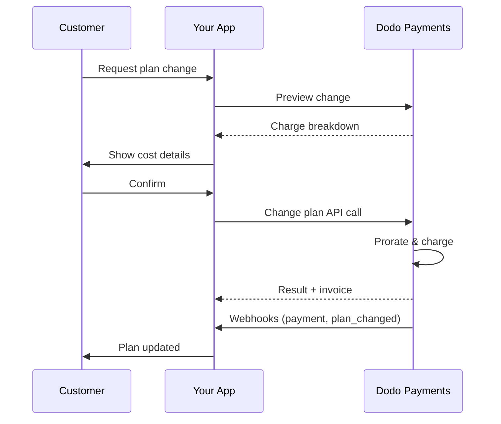
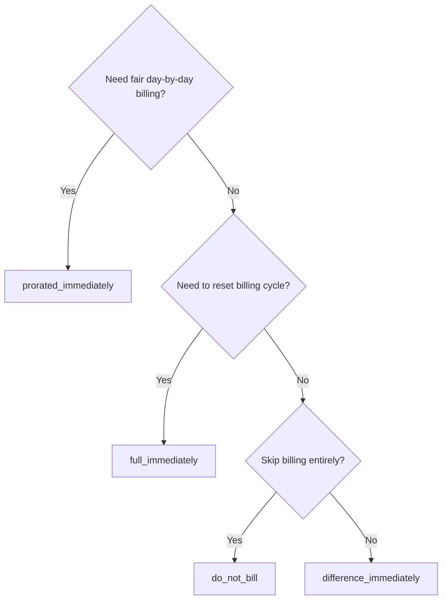
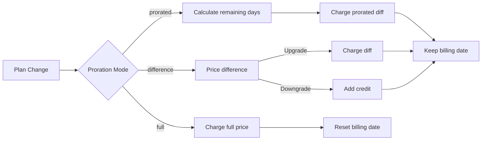

<CardGroup cols={3}>
<Card title="Change Plan API" icon="code" href="/api-reference/subscriptions/change-plan">
  Full API docs for updating subscriptions.
</Card>
<Card title="Plan Change Preview" icon="eye" href="/api-reference/subscriptions/preview-change-plan">
  See charge amounts before changing plans.
</Card>
<Card title="Integration Guide" icon="book" href="/developer-resources/subscription-integration-guide">
  Step-by-step subscription setup.
</Card>
</CardGroup>

## What is a subscription upgrade or downgrade?

Changing plans lets you move a customer between subscription tiers or quantities. Use it to:
- Align pricing with usage or features
- Move from monthly to annual (or vice versa)
- Adjust quantity for seat-based products

<Info>
Plan changes can trigger an immediate charge depending on the proration mode you choose.
</Info>

## When to use plan changes

- Upgrade when a customer needs more features, usage, or seats
- Downgrade when usage decreases
- Migrate users to a new product or price without cancelling their subscription

## Plan Change Flow



## Prerequisites

Before implementing subscription plan changes, ensure you have:

- A Dodo Payments merchant account with active subscription products
- API credentials (API key and webhook secret key) from the dashboard
- An existing active subscription to modify
- Webhook endpoint configured to handle subscription events

<Info>
For detailed setup instructions, see our [Integration Guide](/developer-resources/integration-guide#dashboard-setup).
</Info>

## Step-by-Step Implementation Guide

Follow this comprehensive guide to implement subscription plan changes in your application:

<Steps>
<Step title="Understand Plan Change Requirements">
Before implementing, determine:
- Which subscription products can be changed to which others
- What proration mode fits your business model
- How to handle failed plan changes gracefully
- Which webhook events to track for state management

<Tip>
Test plan changes thoroughly in test mode before implementing in production.
</Tip>
</Step>

<Step title="Choose Your Proration Strategy">
Select the billing approach that aligns with your business needs:

<Tabs>
<Tab title="prorated_immediately">
Best for: SaaS applications wanting to charge fairly for unused time
- Calculates exact prorated amount based on remaining cycle time
- Charges a prorated amount based on unused time remaining in the cycle
- Provides transparent billing to customers
</Tab>

<Tab title="difference_immediately">
Best for: Clear upgrade/downgrade scenarios
- Upgrade: Charge immediate difference (e.g., $30→$80 = charge $50)
- Downgrade: Credit remaining value for future renewals
- Simplifies billing logic and customer communication
</Tab>

<Tab title="full_immediately">
Idéal pour : Lorsque vous souhaitez réinitialiser le cycle de facturation
- Facture le montant total du nouveau plan immédiatement
- Ignore le temps restant de l'ancien plan
- Utile pour les transitions annuelles à mensuelles
</Tab>

{/* LOCKED_PATTERN_7fa7f81fc66b83c441dd56aff76d586c */}
Idéal pour : Migrations gratuites, changements de courtoisie ou absorption des différences de coût
- Aucun frais ou crédit calculé
- Le client passe immédiatement au nouveau plan sans ajustement de facturation
- Le cycle de facturation reste inchangé
</Tab>
</Tabs>
</Step>

<Step title="Implement the Change Plan API">
Utilisez l'API de Changement de Plan pour modifier les détails de l'abonnement :

<ParamField path="subscription_id" type="string" required>
L'ID de l'abonnement actif à modifier.
</ParamField>

<ParamField path="product_id" type="string" required>
Le nouvel ID de produit pour changer l'abonnement.
</ParamField>

<ParamField path="quantity" type="integer" default="1">
Nombre d'unités pour le nouveau plan (pour les produits basés sur les sièges).
</ParamField>

<ParamField path="proration_billing_mode" type="string" required>
Comment gérer la facturation immédiate : `prorated_immediately`, `full_immediately`, `difference_immediately` ou `do_not_bill`.
</ParamField>

<ParamField path="addons" type="array">
Add-ons optionnels pour le nouveau plan. Laisser vide pour supprimer les add-ons existants.
</ParamField>

<ParamField path="on_payment_failure" type="string">
Contrôle le comportement lorsque le paiement de changement de plan échoue :
- `prevent_change` : Conserver l'abonnement sur le plan actuel jusqu'à ce que le paiement réussisse
- `apply_change` (par défaut) : Appliquer le changement de plan immédiatement, indépendamment de l'issue du paiement

Si non spécifié, utilise le paramètre par défaut au niveau de l'entreprise.
</ParamField>

<ParamField path="discount_code" type="string">
Code de réduction optionnel à appliquer au nouveau plan. Si fourni, valide et applique la réduction au changement de plan. Si non fourni et que l'abonnement a une réduction existante avec `preserve_on_plan_change=true`, la réduction existante sera préservée (si applicable au nouveau produit).
</ParamField>
</Step>

<Step title="Handle Webhook Events">
Configurez le traitement des webhooks pour suivre les résultats des changements de plan :

- `subscription.active` : Changement de plan réussi, abonnement mis à jour
- `subscription.plan_changed` : Plan d'abonnement modifié (mise à niveau/dégradations/mise à jour des add-ons)
- `subscription.on_hold` : Échec de la charge de changement de plan, abonnement en pause
- `payment.succeeded` : Charge immédiate pour le changement de plan réussie
- `payment.failed` : Charge immédiate échouée

<Warning>
Toujours vérifier les signatures de webhook et implémenter le traitement idempotent des événements.
</Warning>
</Step>

<Step title="Update Your Application State">
En fonction des événements de webhook, mettez à jour votre application :
- Accorder/révoquer des fonctionnalités en fonction du nouveau plan
- Mettre à jour le tableau de bord client avec les détails du nouveau plan
- Envoyer des e-mails de confirmation concernant les changements de plan
- Enregistrer les changements de facturation à des fins d'audit
</Step>

<Step title="Test and Monitor">
Testez soigneusement votre implémentation :
- Testez tous les modes de proration avec différents scénarios
- Vérifiez que le traitement des webhooks fonctionne correctement
- Surveillez les taux de réussite des changements de plan
- Configurez des alertes pour les changements de plan échoués

<Check>
Votre implémentation de changement de plan d'abonnement est maintenant prête pour une utilisation en production.
</Check>
</Step>
</Steps>

## Aperçu des Changements de Plan

Avant de vous engager à un changement de plan, utilisez l'API de Prévisualisation pour montrer aux clients exactement ce qu'ils seront facturés :

<Tabs>
<Tab title="Node.js SDK">

```javascript
const preview = await client.subscriptions.previewChangePlan('sub_123', {
  product_id: 'prod_pro',
  quantity: 1,
  proration_billing_mode: 'prorated_immediately'
});

// Show customer the charge before confirming
console.log('Immediate charge:', preview.immediate_charge.summary);
console.log('New plan details:', preview.new_plan);
```

</Tab>

<Tab title="Python SDK">

```python
preview = client.subscriptions.preview_change_plan(
    subscription_id="sub_123",
    product_id="prod_pro",
    quantity=1,
    proration_billing_mode="prorated_immediately"
)

# Show customer the charge before confirming
print("Immediate charge:", preview.immediate_charge.summary)
print("New plan details:", preview.new_plan)
```

</Tab>
</Tabs>

<Tip>
Utilisez l'API de prévisualisation pour créer des dialogues de confirmation qui montrent aux clients le montant exact qu'ils seront facturés avant de confirmer un changement de plan.
</Tip>

## API de Changement de Plan

Utilisez l'API de Changement de Plan pour modifier le produit, la quantité et le comportement de proration pour un abonnement actif.

### Exemples de démarrage rapide

<Tabs>
  <Tab title="Node.js SDK">

    ```javascript
    import DodoPayments from 'dodopayments';

    const client = new DodoPayments({
      bearerToken: process.env.DODO_PAYMENTS_API_KEY,
      environment: 'test_mode', // defaults to 'live_mode'
    });

    async function changePlan() {
      const result = await client.subscriptions.changePlan('sub_123', {
        product_id: 'prod_new',
        quantity: 3,
        proration_billing_mode: 'prorated_immediately',
        on_payment_failure: 'prevent_change', // Optional: control behavior on payment failure
      });
      console.log(result.status, result.invoice_id, result.payment_id);
    }

    changePlan();
    ```

  </Tab>
  <Tab title="Python SDK">

    ```python
    import os
    from dodopayments import DodoPayments

    client = DodoPayments(
        bearer_token=os.environ.get("DODO_PAYMENTS_API_KEY"),
        environment="test_mode",  # defaults to "live_mode"
    )

    result = client.subscriptions.change_plan(
        subscription_id="sub_123",
        product_id="prod_new",
        quantity=3,
        proration_billing_mode="prorated_immediately",
        on_payment_failure="prevent_change",  # Optional: control behavior on payment failure
    )
    print(result.status, result.get("invoice_id"), result.get("payment_id"))
    ```

  </Tab>
  <Tab title="Go SDK">

    ```go
    package main

    import (
      "context"
      "fmt"
      "github.com/dodopayments/dodopayments-go"
      "github.com/dodopayments/dodopayments-go/option"
    )

    func main() {
      client := dodopayments.NewClient(option.WithBearerToken("YOUR_TOKEN"))
      res, err := client.Subscriptions.ChangePlan(context.TODO(), dodopayments.SubscriptionChangePlanParams{
        SubscriptionID: dodopayments.F("sub_123"),
        ProductID:             dodopayments.F("prod_new"),
        Quantity:              dodopayments.F(int64(3)),
        ProrationBillingMode:  dodopayments.F(dodopayments.SubscriptionChangePlanParamsProrationBillingModeProratedImmediately),
        OnPaymentFailure:      dodopayments.F(dodopayments.OnPaymentFailurePreventChange), // Optional
      })
      if err != nil { panic(err) }
      fmt.Println(res.Status, res.InvoiceID, res.PaymentID)
    }
    ```

  </Tab>
  <Tab title="HTTP">

    ```bash
    curl -X POST "$DODO_API_BASE/subscriptions/sub_123/change-plan" \
      -H "Authorization: Bearer $DODO_PAYMENTS_API_KEY" \
      -H "Content-Type: application/json" \
      -d '{
        "product_id": "prod_new",
        "quantity": 3,
        "proration_billing_mode": "prorated_immediately",
        "on_payment_failure": "prevent_change"
      }'
    ```

  </Tab>
</Tabs>

```json Success
{
  "status": "processing",
  "subscription_id": "sub_123",
  "invoice_id": "inv_789",
  "payment_id": "pay_456",
  "proration_billing_mode": "prorated_immediately"
}
```

<Note>
Les champs tels que <code>invoice_id</code> et <code>payment_id</code> ne sont renvoyés que lorsqu'une charge immédiate et/ou une facture est créée lors du changement de plan. Comptez toujours sur les événements de webhook (par exemple, <code>payment.succeeded</code>, <code>subscription.plan_changed</code>) pour confirmer les résultats.
</Note>

<Warning>
Si la charge immédiate échoue, l'abonnement peut passer à `subscription.on_hold` jusqu'à ce que le paiement réussisse.
</Warning>

## Gestion des Addons

Lorsque vous modifiez des plans d'abonnement, vous pouvez également modifier les addons :

```javascript
// Add addons to the new plan
await client.subscriptions.changePlan('sub_123', {
  product_id: 'prod_new',
  quantity: 1,
  proration_billing_mode: 'difference_immediately',
  addons: [
    { addon_id: 'addon_123', quantity: 2 }
  ]
});

// Remove all existing addons
await client.subscriptions.changePlan('sub_123', {
  product_id: 'prod_new',
  quantity: 1,
  proration_billing_mode: 'difference_immediately',
  addons: [] // Empty array removes all existing addons
});
```

<Info>
Les addons sont inclus dans le calcul de la proration et seront facturés selon le mode de proration choisi.
</Info>

## Application des Codes de Réduction

Vous pouvez appliquer un code de réduction lors du changement de plans d'abonnement. Cela est utile pour offrir un tarif promotionnel lors de mises à niveau ou de migrations.

<Tabs>
<Tab title="Node.js SDK">

```javascript
// Apply a discount code during plan change
await client.subscriptions.changePlan('sub_123', {
  product_id: 'prod_pro',
  quantity: 1,
  proration_billing_mode: 'prorated_immediately',
  discount_code: 'UPGRADE20'
});
```

</Tab>
<Tab title="Python SDK">

```python
# Apply a discount code during plan change
client.subscriptions.change_plan(
    subscription_id="sub_123",
    product_id="prod_pro",
    quantity=1,
    proration_billing_mode="prorated_immediately",
    discount_code="UPGRADE20"
)
```

</Tab>
<Tab title="HTTP">

```bash
curl -X POST "$DODO_API_BASE/subscriptions/sub_123/change-plan" \
  -H "Authorization: Bearer $DODO_PAYMENTS_API_KEY" \
  -H "Content-Type: application/json" \
  -d '{
    "product_id": "prod_pro",
    "quantity": 1,
    "proration_billing_mode": "prorated_immediately",
    "discount_code": "UPGRADE20"
  }'
```

</Tab>
</Tabs>

### Comportement de la Réduction lors du Changement de Plan

| Scénario | Comportement |
|----------|----------|
| `discount_code` fourni | Valide et applique la réduction au nouveau plan. |
| Aucun code fourni, réduction existante avec `preserve_on_plan_change=true` | La réduction existante est automatiquement préservée si applicable au nouveau produit. |
| Aucun code fourni, aucune réduction conservable | Aucune réduction appliquée au nouveau plan. |

<Tip>
Utilisez l'[API de Prévisualisation du Changement de Plan](/api-reference/subscriptions/preview-change-plan) avec un `discount_code` pour montrer aux clients exactement combien ils économiseront avant de confirmer le changement de plan.
</Tip>

## Modes de Proration

Choisissez comment facturer le client lors des changements de plan :

#### `prorated_immediately`
- Facture la différence partielle dans le cycle actuel
- Si en période d'essai, facture immédiatement et passe maintenant au nouveau plan
- Déclassement : peut générer un crédit au prorata appliqué aux renouvellements futurs

#### `full_immediately`
- Facture le montant total du nouveau plan immédiatement
- Ignore le temps restant de l'ancien plan

<Info>
Les crédits créés par les déclassements utilisant <code>difference_immediately</code> sont à l'échelle de l'abonnement et distincts des droits <a href="/features/credit-based-billing">de facturation basée sur les crédits</a>. Ils s'appliquent automatiquement aux renouvellements futurs du même abonnement et ne sont pas transférables entre abonnements.
</Info>

#### `difference_immediately`
- Mise à niveau : facture immédiatement la différence de prix entre l'ancien et le nouveau plan
- Déclassement : ajoute la valeur restante en tant que crédit interne à l'abonnement et s'applique automatiquement lors des renouvellements

#### `do_not_bill`
- Aucun frais ni crédit calculé
- Le client passe immédiatement au nouveau plan sans aucun ajustement de facturation
- Le cycle de facturation reste inchangé
- Idéal pour les migrations de courtoisie, les changements de plan gratuits ou l'absorption des différences de coût

| Fonctionnalité | `prorated_immediately` | `difference_immediately` | `full_immediately` | `do_not_bill` |
|---------|----------------------|------------------------|-------------------|--------------|
| **Frais de mise à niveau** | Différence au prorata pour les jours restants | Différence de prix totale entre les plans | Prix du nouveau plan dans sa totalité | Aucun frais |
| **Crédit de déclassement** | Crédit au prorata pour les jours restants | Différence de prix totale en tant que crédit | Aucun crédit | Aucun crédit |
| **Cycle de facturation** | Inchange | Inchange | Réinitialisé à aujourd'hui | Inchange |
| **Comportement d'essai** | Met fin à l'essai, facture immédiatement | Met fin à l'essai, facture immédiatement | Met fin à l'essai, facture le montant total | Met fin à l'essai, aucun frais |
| **Idéal pour** | Facturation juste basée sur le temps | Calcul simple de mise à niveau/déclassement | Réinitialisation des cycles de facturation | Migrations gratuites ou changements de courtoisie |
| **Complexité** | Moyenne (calcul du jour) | Faible (soustraction simple) | Faible (facturation totale) | Aucune |



### Scénarios d'exemple

Utilisez ces nombres canoniques de manière cohérente :
- Plan actuel : **Basic** à **30 $/mois**
- Cible de mise à niveau : **Pro** à **80 $/mois**
- Cible de déclassement (à partir de Pro) : **Starter** à **20 $/mois**
- Cycle de facturation : **30 jours**, commencé le **1er janvier**
- Changement de plan se produit le **16 janvier** (15 jours restants, 15 jours utilisés)

<AccordionGroup>
  <Accordion title="Upgrade: Basic ($30) → Pro ($80) with prorated_immediately">

    ```
    Step 1: Calculate unused credit from current plan
      Unused days = 15 out of 30 days
      Credit = $30 × (15/30) = $15.00

    Step 2: Calculate prorated cost of new plan
      Remaining days = 15 out of 30 days
      New plan cost = $80 × (15/30) = $40.00

    Step 3: Calculate immediate charge
      Charge = New plan cost − Credit
      Charge = $40.00 − $15.00 = $25.00

    → Customer pays $25.00 now
    → Next renewal (Feb 1): $80.00/month
    ```

    ```javascript
    await client.subscriptions.changePlan('sub_123', {
      product_id: 'prod_pro',
      quantity: 1,
      proration_billing_mode: 'prorated_immediately'
    })
    ```

  </Accordion>

  <Accordion title="Downgrade: Pro ($80) → Starter ($20) with prorated_immediately">

    ```
    Step 1: Calculate unused credit from current plan
      Unused days = 15 out of 30 days
      Credit = $80 × (15/30) = $40.00

    Step 2: Calculate prorated cost of new plan
      Remaining days = 15 out of 30 days
      New plan cost = $20 × (15/30) = $10.00

    Step 3: Calculate credit balance
      Credit = $40.00 − $10.00 = $30.00

    → No charge — $30.00 credit added to subscription
    → Credit auto-applies to future renewals
    → Next renewal (Feb 1): $20.00 − $30.00 credit = $0.00
    → Following renewal (Mar 1): $20.00 − $10.00 remaining credit = $10.00
    ```

    ```javascript
    await client.subscriptions.changePlan('sub_123', {
      product_id: 'prod_starter',
      quantity: 1,
      proration_billing_mode: 'prorated_immediately'
    })
    ```

  </Accordion>

  <Accordion title="Upgrade: Basic ($30) → Pro ($80) with difference_immediately">

    ```
    Immediate charge = New plan price − Old plan price
                     = $80 − $30
                     = $50.00

    → Customer pays $50.00 now (regardless of cycle position)
    → Next renewal (Feb 1): $80.00/month
    ```

    ```javascript
    await client.subscriptions.changePlan('sub_123', {
      product_id: 'prod_pro',
      quantity: 1,
      proration_billing_mode: 'difference_immediately'
    })
    ```

  </Accordion>

  <Accordion title="Downgrade: Pro ($80) → Starter ($20) with difference_immediately">

    ```
    Credit = Old plan price − New plan price
           = $80 − $20
           = $60.00

    → No charge — $60.00 credit added to subscription
    → Credit auto-applies to future renewals
    → Next renewal: $20.00 − $20.00 (from credit) = $0.00
    → Following renewal: $20.00 − $20.00 (from credit) = $0.00
    → Third renewal: $20.00 − $20.00 (from remaining credit) = $0.00
    ```

    ```javascript
    await client.subscriptions.changePlan('sub_123', {
      product_id: 'prod_starter',
      quantity: 1,
      proration_billing_mode: 'difference_immediately'
    })
    ```

  </Accordion>

  <Accordion title="Upgrade: Basic ($30) → Pro ($80) with full_immediately">

    ```
    Immediate charge = Full new plan price = $80.00

    → Customer pays $80.00 now
    → No credit for unused time on old plan
    → Billing cycle resets to today (January 16)
    → Next renewal: February 16 at $80.00/month
    ```

    ```javascript
    await client.subscriptions.changePlan('sub_123', {
      product_id: 'prod_pro',
      quantity: 1,
      proration_billing_mode: 'full_immediately'
    })
    ```

  </Accordion>

  <Accordion title="Mid-cycle upgrade with add-ons using prorated_immediately">

    ```
    Current: Basic plan ($30/month), no add-ons
    New: Pro plan ($80/month) + Extra Seats add-on ($10/seat × 3 seats = $30/month)
    Change on day 16 of 30 (15 days remaining)

    Step 1: Credit from current plan
      Credit = $30 × (15/30) = $15.00

    Step 2: Prorated cost of new plan + add-ons
      New plan = $80 × (15/30) = $40.00
      Add-ons = $30 × (15/30) = $15.00
      Total new = $55.00

    Step 3: Immediate charge
      Charge = $55.00 − $15.00 = $40.00

    → Customer pays $40.00 now
    → Next renewal: $80.00 + $30.00 = $110.00/month
    ```

    ```javascript
    await client.subscriptions.changePlan('sub_123', {
      product_id: 'prod_pro',
      quantity: 1,
      proration_billing_mode: 'prorated_immediately',
      addons: [
        { addon_id: 'addon_seats', quantity: 3 }
      ]
    })
    ```

  </Accordion>
</AccordionGroup>

### Comment chaque mode traite la facturation



<Tip>
Choisissez `prorated_immediately` pour une comptabilité juste du temps ; choisissez `full_immediately` pour redémarrer la facturation ; utilisez `difference_immediately` pour des mises à niveau simples et un crédit automatique lors des déclassements ; ou utilisez `do_not_bill` pour changer de plan sans aucun ajustement de facturation.
</Tip>

## Gestion des Échecs de Paiement

Contrôlez ce qui se passe lorsqu'un paiement de changement de plan échoue en utilisant le paramètre `on_payment_failure`.

### Modes d'Échec de Paiement

<Tabs>
<Tab title="prevent_change (Recommended for critical upgrades)">
**Comportement** : Conserver l'abonnement sur son plan actuel jusqu'à ce que le paiement réussisse.

- Le changement de plan est marqué comme "en attente"
- Le client conserve l'accès à son plan actuel
- L'abonnement passe à l'état `active` uniquement après un paiement réussi
- Utile lorsque vous souhaitez garantir le paiement avant d'accorder les fonctionnalités mises à jour

```javascript
await client.subscriptions.changePlan('sub_123', {
  product_id: 'prod_pro',
  quantity: 1,
  proration_billing_mode: 'prorated_immediately',
  on_payment_failure: 'prevent_change'
});
```

</Tab>

<Tab title="apply_change (Default)">
**Comportement** : Appliquer le changement de plan immédiatement, indépendamment de l'issue du paiement.

- Le changement de plan est appliqué même si le paiement échoue
- Le client obtient un accès immédiat au nouveau plan
- L'abonnement peut passer à `on_hold` si le paiement échoue
- Bon pour les mises à niveau non critiques ou lorsque vous faites confiance au client

```javascript
await client.subscriptions.changePlan('sub_123', {
  product_id: 'prod_pro',
  quantity: 1,
  proration_billing_mode: 'prorated_immediately',
  on_payment_failure: 'apply_change' // This is the default
});
```

</Tab>
</Tabs>

<Info>
Si non spécifié, le paramètre `on_payment_failure` utilise votre paramètre par défaut au niveau de l'entreprise configuré dans le tableau de bord.
</Info>

### Quand Utiliser Chaque Mode

| Scénario | Mode Recommandé | Raison |
|----------|------------------|--------|
| Mise à niveau vers des fonctionnalités premium | `prevent_change` | Assurer le paiement avant d'accorder l'accès |
| Augmentation de la quantité (plus de sièges) | `prevent_change` | Éviter l'utilisation sans paiement |
| Déclassement de plan | `apply_change` | Le client réduit ses dépenses |
| Clients d'entreprise de confiance | `apply_change` | Risque faible de non-paiement |
| Conversion d'essai à payant | `prevent_change` | Moment critique de paiement |

## Gestion des Webhooks

Suivez l'état de l'abonnement via les webhooks pour confirmer les changements de plan et les paiements.

### Types d'Événements à Gérer
- `subscription.active` : abonnement activé
- `subscription.plan_changed` : plan d'abonnement modifié (mise à niveau/déclassement/modifications des add-ons)
- `subscription.on_hold` : échec de la charge, abonnement en pause
- `subscription.renewed` : renouvellement réussi
- `payment.succeeded` : paiement pour changement de plan ou renouvellement réussi
- `payment.failed` : paiement échoué

<Info>
Nous recommandons de piloter la logique métier à partir des événements d'abonnement et d'utiliser les événements de paiement pour la confirmation et la réconciliation.
</Info>

### Vérifier les Signatures et Gérer les Intentions

<Tabs>
  <Tab title="Next.js Route Handler">

    ```javascript
    import { NextRequest, NextResponse } from 'next/server';
    
    export async function POST(req) {
      const webhookId = req.headers.get('webhook-id');
      const webhookSignature = req.headers.get('webhook-signature');
      const webhookTimestamp = req.headers.get('webhook-timestamp');
      const secret = process.env.DODO_WEBHOOK_SECRET;
    
      const payload = await req.text();
      // verifySignature is a placeholder – in production, use a Standard Webhooks library
      const { valid, event } = await verifySignature(
        payload,
        { id: webhookId, signature: webhookSignature, timestamp: webhookTimestamp },
        secret
      );
      if (!valid) return NextResponse.json({ error: 'Invalid signature' }, { status: 400 });
    
      switch (event.type) {
        case 'subscription.active':
          // mark subscription active in your DB
          break;
        case 'subscription.plan_changed':
          // refresh entitlements and reflect the new plan in your UI
          break;
        case 'subscription.on_hold':
          // notify user to update payment method
          break;
        case 'subscription.renewed':
          // extend access window
          break;
        case 'payment.succeeded':
          // reconcile payment for plan change
          break;
        case 'payment.failed':
          // log and alert
          break;
        default:
          // ignore unknown events
          break;
      }
    
      return NextResponse.json({ received: true });
    }
    ```

  </Tab>
  <Tab title="Express.js">

    ```javascript
    import express from 'express';
    
    const app = express();
    app.post('/webhooks/dodo', express.raw({ type: 'application/json' }), async (req, res) => {
      const webhookId = req.header('webhook-id');
      const webhookSignature = req.header('webhook-signature');
      const webhookTimestamp = req.header('webhook-timestamp');
      const secret = process.env.DODO_WEBHOOK_SECRET;
      const payload = req.body.toString('utf8');
    
      const { valid, event } = await verifySignature(
        payload,
        { id: webhookId, signature: webhookSignature, timestamp: webhookTimestamp },
        secret
      );
      if (!valid) return res.status(400).send('Invalid signature');
    
      // handle events like above
      res.json({ received: true });
    });
    
    app.listen(3000);
    ```

  </Tab>
</Tabs>

<Note>
Pour des schémas de charge utile détaillés, voir les <a href="/developer-resources/webhooks/intents/subscription">webhooks d'abonnement</a> et les <a href="/developer-resources/webhooks/intents/payment">webhooks de paiement</a>.
</Note>

## Bonnes Pratiques

Suivez ces recommandations pour des changements de plan d'abonnement fiables :

### Stratégie de Changement de Plan
- **Tester minutieusement** : Testez toujours les changements de plan en mode test avant la production
- **Choisir la proration avec soin** : Sélectionnez le mode de proration qui correspond à votre modèle d'affaires
- **Gérer les échecs correctement** : Implémentez une gestion d'erreur appropriée et une logique de réessai
- **Surveiller les taux de réussite** : Suivez les taux de réussite/échec des changements de plan et enquêtez sur les problèmes

### Implémentation de Webhooks
- **Vérifier les signatures** : Validez toujours les signatures de webhook pour garantir l'authenticité
- **Implémenter l'idempotence** : Gérez les événements de webhook dupliqués de manière élégante
- **Traiter de manière asynchrone** : Ne bloquez pas les réponses de webhook avec des opérations lourdes
- **Tout journaliser** : Tenez des journaux détaillés pour le débogage et les audits

### Expérience Utilisateur
- **Communiquer clairement** : Informez les clients des changements de facturation et des délais
- **Fournir des confirmations** : Envoyez des confirmations par e-mail pour les changements de plan réussis
- **Gérer les cas limites** : Considérez les périodes d'essai, les prorations et les paiements échoués
- **Mettre à jour l'interface utilisateur immédiatement** : Reflétez les changements de plan dans votre interface d'application

## Problèmes Courants et Solutions

Résolvez les problèmes typiques rencontrés lors des changements de plan d'abonnement :

<AccordionGroup>
<Accordion title="Charge created but subscription not updated">
**Symptômes** : L'appel API réussit mais l'abonnement reste sur l'ancien plan

**Causes courantes** :
- Le traitement des webhooks a échoué ou a été retardé
- L'état de l'application n'a pas été mis à jour après la réception des webhooks
- Problèmes de transaction de base de données lors de la mise à jour de l'état

**Solutions** :
- Implémentez un traitement des webhooks robuste avec une logique de réessai
- Utilisez des opérations idempotentes pour les mises à jour d'état
- Ajoutez une surveillance pour détecter et alerter sur les événements de webhook manqués
- Vérifiez que le point de terminaison du webhook est accessible et répond correctement
</Accordion>

<Accordion title="Credits not applied after downgrade">
**Symptômes** : Le client effectue un déclassement mais ne voit pas le solde de crédit

**Causes courantes** :
- Attentes relatives au mode de proration : les déclassements créditent la différence de prix totale du plan avec `difference_immediately`, tandis que `prorated_immediately` crée un crédit au prorata basé sur le temps restant du cycle
- Les crédits sont spécifiques à l'abonnement et ne se transfèrent pas entre abonnements
- Solde de crédit non visible dans le tableau de bord client

**Solutions** :
- Utilisez `difference_immediately` pour les déclassements lorsque vous souhaitez des crédits automatiques
- Expliquez aux clients que les crédits s'appliquent aux renouvellements futurs du même abonnement
- Implémentez un portail client pour afficher les soldes de crédit
- Vérifiez l'aperçu de la prochaine facture pour voir les crédits appliqués
</Accordion>

<Accordion title="Webhook signature verification fails">
**Symptômes** : Les événements de webhook sont rejetés en raison d'une signature invalide

**Causes courantes** :
- Clé secrète de webhook incorrecte
- Corps de requête brute modifié avant la vérification de la signature
- Mauvais algorithme de vérification de la signature

**Solutions** :
- Vérifiez que vous utilisez le bon `DODO_WEBHOOK_SECRET` à partir du tableau de bord
- Lisez le corps de la requête brute avant tout middleware de parsing JSON
- Utilisez la bibliothèque standard de vérification de webhook pour votre plate-forme
- Testez la vérification de la signature du webhook en environnement de développement
</Accordion>

<Accordion title="Plan change fails with 422 error">
**Symptômes** : L'API retourne une erreur 422 Unprocessable Entity

**Causes courantes** :
- ID d'abonnement ou ID de produit invalide
- Abonnement non en état actif
- Paramètres requis manquants
- Produit non disponible pour les changements de plan

**Solutions** :
- Vérifiez que l'abonnement existe et est actif
- Vérifiez que l'ID de produit est valide et disponible
- Assurez-vous que tous les paramètres requis sont fournis
- Consultez la documentation de l'API pour les exigences relatives aux paramètres
</Accordion>

<Accordion title="Immediate charge fails during plan change">
**Symptômes** : Changement de plan initié, mais charge immédiate échouée

**Causes courantes** :
- Fonds insuffisants sur le moyen de paiement du client
- Moyen de paiement expiré ou invalide
- La banque a refusé la transaction
- Détection de fraude a bloqué la charge

**Solutions** :
- Gérez correctement les événements de webhook `payment.failed`
- Informez le client de mettre à jour son moyen de paiement
- Implémentez une logique de réessai pour les échecs temporaires
- Envisagez de permettre des changements de plan avec des charges immédiates échouées
</Accordion>

<Accordion title="Subscription on hold after plan change">
**Symptômes** : La charge de changement de plan échoue et l'abonnement passe à l'état `on_hold`

**Ce qui se passe** :
Lorsqu'une charge de changement de plan échoue, l'abonnement est automatiquement placé en état `on_hold`. L'abonnement ne se renouvellera pas automatiquement jusqu'à ce que le moyen de paiement soit mis à jour.

**Solution** : Mettez à jour le moyen de paiement pour réactiver l'abonnement

Pour réactiver un abonnement depuis l'état `on_hold` après un échec de changement de plan :

1. **Mettez à jour le moyen de paiement** en utilisant l'API de mise à jour du moyen de paiement
2. **Création automatique de charge** : L'API crée automatiquement une charge pour les montants dus restants
3. **Génération de facture** : Une facture est générée pour la charge
4. **Traitement du paiement** : Le paiement est traité en utilisant le nouveau moyen de paiement
5. **Réactivation** : Après un paiement réussi, l'abonnement est réactivé à l'état `active`

<CodeGroup>

```javascript Node.js
// Reactivate subscription from on_hold after failed plan change
async function reactivateAfterFailedPlanChange(subscriptionId) {
  // Update payment method - automatically creates charge for remaining dues
  const response = await client.subscriptions.updatePaymentMethod(subscriptionId, {
    type: 'new',
    return_url: 'https://example.com/return'
  });
  
  if (response.payment_id) {
    console.log('Charge created for remaining dues:', response.payment_id);
    console.log('Payment link:', response.payment_link);
    
    // Redirect customer to payment_link to complete payment
    // Monitor webhooks for:
    // 1. payment.succeeded - charge succeeded
    // 2. subscription.active - subscription reactivated
  }
  
  return response;
}

// Or use existing payment method if available
async function reactivateWithExistingPaymentMethod(subscriptionId, paymentMethodId) {
  const response = await client.subscriptions.updatePaymentMethod(subscriptionId, {
    type: 'existing',
    payment_method_id: paymentMethodId
  });
  
  // Monitor webhooks for payment.succeeded and subscription.active
  return response;
}
```

```python Python
# Reactivate subscription from on_hold after failed plan change
def reactivate_after_failed_plan_change(subscription_id):
    # Update payment method - automatically creates charge for remaining dues
    response = client.subscriptions.update_payment_method(
        subscription_id=subscription_id,
        type="new",
        return_url="https://example.com/return"
    )
    
    if response.payment_id:
        print("Charge created for remaining dues:", response.payment_id)
        print("Payment link:", response.payment_link)
        
        # Redirect customer to payment_link to complete payment
        # Monitor webhooks for:
        # 1. payment.succeeded - charge succeeded
        # 2. subscription.active - subscription reactivated
    
    return response

# Or use existing payment method if available
def reactivate_with_existing_payment_method(subscription_id, payment_method_id):
    response = client.subscriptions.update_payment_method(
        subscription_id=subscription_id,
        type="existing",
        payment_method_id=payment_method_id
    )
    
    # Monitor webhooks for payment.succeeded and subscription.active
    return response
```

</CodeGroup>

**Événements de webhook à surveiller** :
- `subscription.on_hold` : Abonnement mis en attente (reçu lorsque la charge de changement de plan échoue)
- `payment.succeeded` : Paiement pour les montants dus restants réussi (après mise à jour du moyen de paiement)
- `subscription.active` : Abonnement réactivé après un paiement réussi

**Bonnes pratiques** :
- Informez immédiatement les clients lorsqu'une charge de changement de plan échoue
- Fournir des instructions claires sur la façon de mettre à jour leur moyen de paiement
- Surveillez les événements de webhook pour suivre le statut de réactivation
- Envisagez d'implémenter une logique de réessai automatique pour les échecs de paiement temporaires

<Card title="Update Payment Method API Reference" icon="code" href="/api-reference/subscriptions/update-payment-method">
Consultez la documentation complète de l'API pour la mise à jour des moyens de paiement et la réactivation des abonnements.
</Card>
</Accordion>
</AccordionGroup>

## Test de Votre Implémentation

Suivez ces étapes pour tester minutieusement votre implémentation de changement de plan d'abonnement :

<Steps>
<Step title="Set up test environment">
- Utilisez des clés d'API de test et des produits de test
- Créez des abonnements de test avec différents types de plans
- Configurez un point de terminaison de webhook de test
- Configurez la surveillance et la journalisation
</Step>

<Step title="Test different proration modes">
- Testez `prorated_immediately` avec diverses positions de cycle de facturation
- Testez `difference_immediately` pour les mises à niveau et les déclassements
- Testez `full_immediately` pour réinitialiser les cycles de facturation
- Testez `do_not_bill` pour les changements de plan sans échange de frais ou de crédit
- Vérifiez que les calculs de crédit sont corrects
</Step>

<Step title="Test webhook handling">
- Vérifiez que tous les événements de webhook pertinents sont reçus
- Testez la vérification des signatures des webhooks
- Gérez gracieusement les événements de webhooks dupliqués
- Testez les scénarios d'échec de traitement des webhooks
</Step>

<Step title="Test error scenarios">
- Testez avec des ID d'abonnement invalides
- Testez avec des moyens de paiement expirés
- Testez les échecs de réseau et les délais d'attente
- Testez avec des fonds insuffisants
</Step>

<Step title="Monitor in production">
- Configurez des alertes pour les changements de plan échoués
- Surveillez les temps de traitement des webhooks
- Suivez les taux de réussite des changements de plan
- Examinez les tickets de support client pour les problèmes de changement de plan
</Step>
</Steps>

## Gestion des Erreurs

Gérez les erreurs d'API communes de manière gracieuse dans votre implémentation :

### Codes de Statut HTTP

<AccordionGroup>
<Accordion title="200 OK">
Requête de changement de plan traitée avec succès. L'abonnement est en cours de mise à jour et le traitement du paiement a commencé.
</Accordion>

<Accordion title="400 Bad Request">
Paramètres de requête invalides. Vérifiez que tous les champs requis sont fournis et correctement formatés.
</Accordion>

<Accordion title="401 Unauthorized">
Clé d'API invalide ou manquante. Vérifiez que votre `DODO_PAYMENTS_API_KEY` est correcte et a les autorisations appropriées.
</Accordion>

<Accordion title="404 Not Found">
ID d'abonnement non trouvé ou n'appartient pas à votre compte.
</Accordion>

<Accordion title="422 Unprocessable Entity">
L'abonnement ne peut pas être modifié (par exemple, déjà annulé, produit non disponible, etc.).
</Accordion>

<Accordion title="500 Internal Server Error">
Une erreur de serveur s'est produite. Réessayez la demande après un court délai.
</Accordion>
</AccordionGroup>

### Format de Réponse d'Erreur

```json
{
  "error": {
    "code": "subscription_not_found",
    "message": "The subscription with ID 'sub_123' was not found",
    "details": {
      "subscription_id": "sub_123"
    }
  }
}
```

## Étapes Suivantes

- Consultez l'<a href="/api-reference/subscriptions/change-plan">API de Changement de Plan</a>
- Explorez la <a href="/features/credit-based-billing">Facturation Basée sur les Crédits</a>
- Implémentez des alertes pour `subscription.on_hold`
- Consultez notre <a href="/developer-resources/webhooks">Guide d'Intégration Webhook</a>
