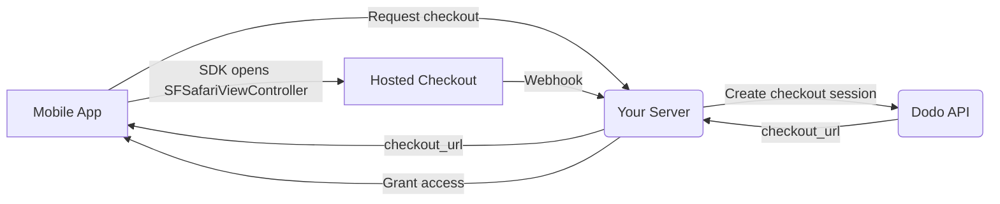

## Introduction

Dodo Payments permet aux développeurs de vendre des biens et services numériques dans des applications iOS, en gérant des aspects complexes tels que la conformité fiscale, la conversion de devises et les paiements. Ce guide complet détaille comment intégrer Dodo Payments dans votre application iOS, spécifiquement pour les outils SaaS, les abonnements de contenu et les utilitaires numériques.

## Aperçu

Dodo Payments agit en tant que **Marchand de Registre (MoR)**, gérant des aspects critiques de votre entreprise numérique :

<Tabs>
<Tab title="What We Handle">
- Collecte et reversement des taxes (VAT, GST et autres taxes régionales)
- Paiements mondiaux conformément aux politiques et aux méthodes de paiement locales
- Conversion de devises et échange de devises étrangères
- Contre-passations (chargebacks) et prévention des fraudes
- Facturation et reçus pour les clients finaux
- Conformité aux réglementations régionales
</Tab>

<Tab title="What You Get">
- Une API unifiée pour les plateformes web et mobiles
- Support des paiements intégrés (UPI, cartes, portefeuilles, BNPL)
- Prise en charge des paiements mondiaux (Payoneer, Wise, virements bancaires locaux)
- Tableau de bord d'analyse et de rapports
- Traitement sécurisé des paiements
</Tab>
</Tabs>

## Cas d'utilisation

<CardGroup cols={2}>
<Card title="Subscriptions" icon="repeat">
- Accès à du contenu ou à des fonctionnalités premium
- Facturation récurrente avec options flexibles, essais gratuits, prorata ou améliorations et rétrogradations
</Card>

<Card title="Courses and Learning" icon="graduation-cap">
- Accès au cours à la carte
- Packs de contenu groupé
- Licences à vie ou renouvelables
- Intégration du suivi de progression
</Card>

<Card title="Digital Downloads" icon="download">
- Achats ponctuels (PDF, musique, outils)
- Distribution d'actifs numériques
- Gestion des clés de licence
</Card>

<Card title="SaaS Tools" icon="screwdriver-wrench">
- Abonnements Software-as-a-Service
- Facturation à l'utilisation
- Offres pour équipes et entreprises
</Card>
</CardGroup>

## Flux d'intégration

Votre app ouvre le checkout hébergé de Dodo avec le
[iOS checkout SDK](/developer-resources/sdks/ios), qui le présente dans
`SFSafariViewController` et renvoie un résultat typé.

<Warning>
Utilisez le SDK plutôt que d'intégrer le checkout dans un `WebView`. Apple Pay est uniquement
disponible dans une véritable surface de navigateur, donc un `WebView` vous fait perdre silencieusement des conversions
wallet — et les flux de paiement dans un `WebView` sont une cause fréquente de rejets lors de l'examen de l'app par l'App
Store.
</Warning>

### Étapes d'intégration

<Steps>
<Step title="Mobile App to Your Server">
Votre app demande à votre propre backend une URL de checkout, authentifiée avec le
token de session de l'utilisateur connecté.
</Step>

<Step title="Your Server to Dodo API">
Votre backend crée une [checkout session](/developer-resources/checkout-session)
avec votre clé API et renvoie le `checkout_url` à l'app.

<Warning>
Créez les checkout sessions sur votre serveur, jamais dans l'app. Une clé API intégrée
dans le binaire d'une app peut être extraite du bundle.
</Warning>
</Step>

<Step title="Mobile App Opens Checkout">
Transmettez le `checkout_url` à `DodoCheckout.start(...)`. Le SDK le présente dans
`SFSafariViewController` et renvoie un résultat typé lorsque le client
termine ou ferme le checkout.
</Step>

<Step title="Dodo Payments to Your Server">
Dodo Payments appelle votre endpoint webhook lorsque le paiement est confirmé ou que l'abonnement est activé.
</Step>

<Step title="Your Server Grants Access">
Déverrouillez le contenu acheté à partir de ce webhook, et non du résultat reçu par l'app. Le résultat du SDK est un indice d'interface utilisateur, pas une preuve de paiement.
</Step>
</Steps>

<CardGroup cols={2}>
<Card title="iOS Checkout SDK" icon="apple" href="/developer-resources/sdks/ios">
  Étapes d'installation et contrat complet `start(...)` pour Swift.
</Card>
<Card title="Mobile Integration Guide" icon="mobile" href="/developer-resources/mobile-integration">
  Flux de bout en bout, ainsi que le même contrat pour Android, React Native et Flutter.
</Card>
</CardGroup>

## Disponibilité régionale

Dodo Payments permet des flux d'achat alternatifs dans les régions de l'App Store où Apple autorise explicitement les paiements externes, ou lorsqu'un organisme de réglementation ou une décision de justice l'impose.

### Régions prises en charge

<AccordionGroup>
<Accordion title="United States">
Pris en charge dans la mesure permise par les décisions de justice en vigueur et les directives mises à jour d'Apple.

- Disponible en vertu de dispositions spécifiques imposées par la justice
- Sous réserve du respect par Apple des exigences légales
- Doit suivre les directives d'implémentation d'Apple
</Accordion>

<Accordion title="European Union (EU) App Store">
Pris en charge via les Conditions alternatives de l'UE d'Apple et l'External Purchase Entitlement.

- Activé via les Conditions alternatives de l'UE d'Apple
- Nécessite l'approbation de l'External Purchase Entitlement
- Doit respecter les exigences du Digital Markets Act de l'UE
</Accordion>

<Accordion title="South Korea">
Pris en charge via le StoreKit External Purchase Entitlement pour les binaires réservés à la Corée.

- Disponible via le StoreKit External Purchase Entitlement
- Nécessite un binaire d'app spécifique à la Corée
- Doit respecter la législation coréenne sur les télécommunications
</Accordion>
</AccordionGroup>

<Warning>
Vérifiez et respectez toujours les droits spécifiques à chaque région d'Apple ainsi que les exigences d'App Store Connect avant d'activer Dodo Payments pour une quelconque vitrine. L'utilisation de flux de paiement alternatifs dans des régions non prises en charge peut entraîner le rejet ou la suppression de l'app.
</Warning>

<Note>
Pour certains modèles commerciaux — comme les services ou certaines catégories de contenu — Apple peut ne pas exiger l'utilisation de l'achat intégré (IAP). Dodo Payments prend également en charge ces modèles. Vérifiez toujours la classification de votre app et les dernières directives d'Apple afin de déterminer si l'IAP est obligatoire dans votre cas d'utilisation.
</Note>

### En savoir plus

Pour une analyse détaillée des politiques mondiales, des précédents juridiques et des approches stratégiques pour contourner les frais de l'App Store, consultez notre guide complet :

<Card title="Bypassing App Store & Play Store Fees: A Strategic and Legal Playbook" icon="shield-check" href="/features/bypassing-app-store-fees">
Découvrez où et comment vous pouvez mettre en œuvre légalement des flux de paiement alternatifs, avec des recommandations régionales à jour et des conseils de conformité.
</Card>