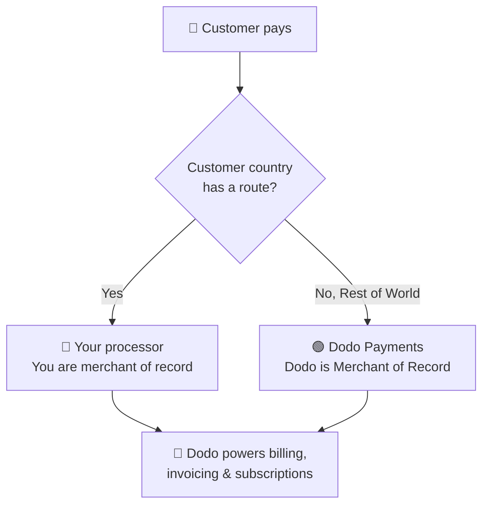

**Utiliser votre propre processeur (BYOP)** vous permet de connecter votre propre processeur de paiement — actuellement **Stripe** ou **Adyen**, avec la prise en charge d'autres processeurs prochainement — tout en continuant à utiliser Dodo Payments pour tout ce qui s'ajoute à la transaction : produits, abonnements, clés de licence et moteur d'entitlements, facturation, Customer Portal et analytics.

Vous décidez, pour chaque pays du client, si un paiement est traité par **votre processeur** (vous restez le merchant of record pour cette route) ou par **Dodo Payments** en tant que votre Merchant of Record tout-en-un. Les pays que vous n'acheminez pas explicitement sont automatiquement traités par défaut par Dodo.

<CardGroup cols={2}>
<Card title="Route by geography" icon="globe">
Envoyez les paiements de pays spécifiques vers votre propre processeur, et tout le reste vers Dodo.
</Card>

<Card title="Keep your processor accounts" icon="plug">
Continuez à utiliser vos comptes et relations Stripe ou Adyen existants.
</Card>

<Card title="Stay the merchant of record" icon="building">
Sur vos propres routes, vous restez le vendeur légal et contrôlez les taxes, les litiges et les versements.
</Card>

<Card title="One billing layer" icon="layer-group">
Dodo gère les produits, les abonnements, les factures et les analytics sur les deux routes.
</Card>
</CardGroup>

## BYOP vs. Dodo en tant que Merchant of Record

Lorsque vous activez BYOP, vous choisissez la manière dont chaque paiement est traité. Les deux modèles peuvent fonctionner côte à côte, selon le pays du client.

| Fonctionnalité | Dodo en tant que Merchant of Record | Utiliser votre propre processeur |
|---------|----------------------------|--------------------------|
| Vendeur légal officiel | Dodo Payments | Votre entreprise |
| Taxes (VAT, GST et taxe de vente) | Calculées, collectées et reversées pour vous | Vous vous enregistrez, collectez et déclarez |
| Chargebacks et fraude | Responsabilité et protection gérées par Dodo | Vous les gérez avec les outils de votre processeur |
| Conformité PCI | Gérée par Dodo | Vous la gérez |
| Moyens de paiement | Plus de 30 moyens internationaux et locaux, multi-devises | Cartes uniquement (crédit/débit) |
| Versements | Versements internationaux agrégés | Directement depuis votre processeur |
| Configuration | Simple, mise en ligne en quelques minutes | Modérée, ajout de clés et du routage |
| Idéal pour | Vendre à l'international avec une conformité gérée automatiquement | Processeur existant et contrôle régional |

<Tip>
Une configuration courante est **hybride** : acheminez vers votre propre processeur un pays où vous disposez déjà d'une entité et d'un processeur enregistrés (par exemple, votre marché national), et laissez Dodo gérer le reste du monde en tant que Merchant of Record.
</Tip>

## Processeurs pris en charge

Aujourd'hui, vous pouvez connecter **Stripe** ou **Adyen**. La prise en charge d'autres processeurs est prévue prochainement.

<CardGroup cols={2}>
<Card title="Stripe" icon="stripe" />
<Card title="Adyen" icon="/images/logos/adyen.svg" />
</CardGroup>

<Note>
Les paiements acheminés via votre propre processeur prennent actuellement en charge **les cartes de crédit et de débit uniquement**. Nous ajouterons bientôt d'autres moyens de paiement.
</Note>

<Warning>
**Stripe** et **Adyen** exigent tous deux que l'accès **raw card API** soit activé sur votre compte afin que Dodo puisse gérer la facturation par-dessus votre processeur. Chaque processeur l'active sur demande — vous devez contacter son support avant de le connecter. Consultez les guides [Stripe](/features/byop/stripe) et [Adyen](/features/byop/adyen) pour plus d'informations.
</Warning>

<Info>
Les connexions sont configurées **par environnement**. Le processeur que vous connectez en **test mode** (Sandbox) est distinct de celui du **live mode** (Production) ; configurez les deux si vous souhaitez tester avant la mise en production. L'assistant de configuration suit le bouton global test/live de votre dashboard.
</Info>

## Configurer BYOP

Ouvrez **Settings → BYOP** dans le dashboard et sélectionnez **Configure** sur la carte *Bring Your Own Processor* pour lancer l'assistant de configuration.

<Frame>

</Frame>

<Steps>
<Step title="Choose a payment processor">
Sélectionnez le processeur que vous souhaitez connecter, **Stripe** ou **Adyen**, puis continuez.

<Frame>

</Frame>
</Step>

<Step title="Connect your account">
Donnez à la connexion un **Provider Name** (utile lorsque vous disposez de plusieurs comptes chez le même processeur, par exemple *Stripe US* et *Stripe UK*), puis saisissez la **Secret Key** de votre processeur (pour Stripe, votre clé `sk_...`).

Pour **Adyen**, saisissez également l'identifiant de votre **Merchant Account**.

<Frame>

</Frame>

L'enregistrement crée la connexion et génère un **Webhook Endpoint** qui lui est propre. Ajoutez cette URL comme destination webhook dans le dashboard de votre processeur, puis recopiez le **Webhook Signing Secret** dans Dodo pour terminer :

- **Stripe** : collez le secret de signature de l'endpoint webhook que vous avez ajouté.
- **Adyen** : collez la **HMAC key** depuis *Customer Area → Webhooks*.

<Note>
Votre clé secrète est stockée de manière sécurisée et ne peut plus être consultée ou modifiée après l'enregistrement. Vous configurez uniquement l'URL webhook générée par Dodo dans votre processeur ; vous n'interagissez jamais directement avec l'infrastructure sous-jacente.
</Note>

<Tip>
Utilisez **Verify connection** après l'enregistrement pour effectuer un appel de test vers votre processeur et confirmer que les clés et le secret webhook sont valides avant la mise en production.
</Tip>
</Step>

<Step title="Configure payment routing">
Ajoutez des **routing rules** qui associent les pays des clients à un processeur. Chaque pays peut être acheminé vers un seul processeur.

- **Votre processeur** traite les paiements des pays que vous lui attribuez.
- **Dodo Payments** traite le **Rest of the World** (tous les pays que vous n'acheminez pas explicitement) en tant que Merchant of Record.

<Frame>

</Frame>

Utilisez **Add Route** pour attribuer un ou plusieurs pays à un processeur.

<Frame>

</Frame>

<Info>
**Consignes de routage**
- "Rest of World" couvre tous les pays qui ne figurent pas ci-dessus.
- Les routes Dodo Payments MoR gèrent automatiquement la conformité et les taxes.
- Les routes de votre propre processeur nécessitent une configuration fiscale distincte, le cas échéant.
</Info>
</Step>

<Step title="Configure invoice information">
Pour les paiements acheminés via votre propre processeur, **vous** êtes le vendeur indiqué sur la facture. Saisissez les informations de l'entreprise qui doivent apparaître sur ces factures :

- **Registered Business Name** (obligatoire)
- **Tax ID** (EIN, SSN, etc. ; facultatif, avec validation du format disponible pour les EIN américains)
- **Statement Descriptor** (obligatoire) : ce que les clients voient sur leur relevé bancaire (5 à 22 caractères)
- **Registered Business Address** (obligatoire) : commencez à saisir du texte pour rechercher et renseigner automatiquement votre adresse
- Liens vers la **Privacy Policy** et les **Terms of Service** (obligatoires)

Un **Invoice Header Preview** en temps réel montre comment les informations apparaîtront. Ces informations s'appliquent **uniquement** aux factures des routes que vous gérez via votre propre processeur ; les paiements acheminés par Dodo continuent d'utiliser les informations de Dodo en tant que Merchant of Record.

<Frame>

</Frame>
</Step>

<Step title="Review and finish">
Vérifiez la connexion à votre processeur, les règles de routage et les informations de facture. Confirmez que les informations de routage et de facturation sont correctes, puis sélectionnez **Finish setup**.

<Frame>

</Frame>
</Step>
</Steps>

Une fois la configuration terminée, la carte BYOP affiche **Edit Configuration**, et vous pouvez revenir à MoR uniquement à tout moment avec **Edit routing rules**.

<Frame>

</Frame>

## Fonctionnement du routage

Le routage est déterminé par le **pays du client** au moment du paiement. La même logique s'applique aux paiements ponctuels, aux checkout sessions et aux inscriptions à un abonnement. Les renouvellements réutilisent le processeur sur lequel l'abonnement a été créé (voir [Subscriptions](#subscriptions)).

Sur une route gérée par **votre processeur** :

- Le paiement est traité sur le compte de votre processeur, dans la devise de facturation.
- Aucune taxe n'est calculée ni collectée par Dodo ; vous restez responsable des taxes pour cette route.
- Les factures utilisent les **informations de l'entreprise et le statement descriptor** que vous avez configurés, sans référence à Merchant of Record.
- Les versements sont réglés **directement auprès de vous** par votre processeur ; rien ne transite par le wallet de Dodo.

Sur une route gérée par **Dodo** (Rest of World), Dodo agit exactement comme votre Merchant of Record tout-en-un et gère les taxes, la conformité, les litiges, la fraude et les versements agrégés.

## Abonnements

Les abonnements restent sur le processeur avec lequel ils ont été créés. Lors du renouvellement, Dodo débite le même processeur de paiement que celui utilisé pour acheter l'abonnement, en réutilisant le mandat de paiement qui y est enregistré. Les règles de routage ne sont pas réévaluées à chaque renouvellement.

## Identifier le processeur ayant traité un paiement

Une fois BYOP configuré, les tableaux **Payments** et **Disputes** affichent une icône de processeur (Stripe, Adyen ou Dodo) à côté de chaque ligne, et les pages de détails du paiement et du litige incluent un champ **Payment Processor**, afin que vous puissiez toujours savoir quelle route a traité une transaction donnée.

## Remboursements, litiges et versements

<Tabs>
<Tab title="Refunds">
Vous initiez les remboursements depuis le dashboard de Dodo comme d'habitude. Pour les paiements acheminés via votre propre processeur, le remboursement est exécuté sur ce processeur ; pour les paiements acheminés par Dodo, Dodo traite le remboursement.
</Tab>

<Tab title="Disputes">
Le dashboard de Dodo affiche uniquement les litiges pour les paiements **traités par Dodo**.

> Seuls les litiges traités par Dodo sont affichés ici. Les litiges sur votre propre processeur (par exemple Stripe) sont gérés dans le dashboard de ce processeur.

Le téléversement de preuves, l'acceptation et les actions de contestation sont disponibles uniquement pour les litiges traités par Dodo. Les litiges sur votre processeur sont gérés avec les propres outils de celui-ci.
</Tab>

<Tab title="Payouts">
Pour les routes utilisant votre propre processeur, celui-ci vous paie **directement** ; ces versements n'apparaissent pas dans Dodo.

> Seuls les versements de Dodo sont visibles ici. Les versements sur votre propre processeur ont lieu dans celui-ci.

Les versements de Dodo (volume MoR du Rest of World) suivent la [structure des versements](/features/payouts/payout-structure) standard.
</Tab>
</Tabs>

## Analytics

Les analytics de revenus, de taxes et d'abonnements incluent **les deux** routes afin de vous donner une vue complète de votre facturation. Les widgets de litiges et de versements affichent uniquement l'activité **traitée par Dodo**, avec une bannière indiquant que l'activité sur votre propre processeur se trouve dans le dashboard de celui-ci.

## Frais de facturation

Dodo applique de petits **frais de facturation BYOP** sur les paiements acheminés via votre propre processeur, car Dodo continue de gérer vos produits, abonnements, facturation et analytics pour ces transactions. Ils apparaissent sous forme de ligne `byop_fee` dans votre registre de solde. Le taux par défaut est de **0,5 %** ; le taux exact est confirmé lors de l'activation de BYOP pour votre compte. [Contactez-nous](mailto:founders@dodopayments.com) pour plus d'informations.

## Foire aux questions

<AccordionGroup>
<Accordion title="Which processors can I connect?">
Stripe et Adyen sont pris en charge aujourd'hui, et d'autres processeurs le seront prochainement. Tous deux exigent que l'accès **raw card API** soit activé sur votre compte ; vous devez le demander au support du processeur. Consultez les guides [Stripe](/features/byop/stripe) et [Adyen](/features/byop/adyen) pour plus d'informations.
</Accordion>

<Accordion title="Can I route only some countries to my processor?">
Oui. Attribuez des pays spécifiques à votre processeur et laissez le reste en **Rest of the World**, que Dodo gère comme Merchant of Record. Chaque pays est acheminé vers un seul processeur.
</Accordion>

<Accordion title="Who is the merchant of record on BYOP routes?">
Oui. Pour les routes gérées par votre propre processeur, vous restez le vendeur légal et êtes responsable des taxes, des chargebacks, de la conformité PCI et des versements liés à ces transactions.
</Accordion>

<Accordion title="Does Dodo calculate tax on my processor's routes?">
Non. Les taxes ne sont ni calculées ni collectées pour les routes gérées via votre propre processeur ; vous gérez les taxes de ces transactions. Dodo continue de gérer les taxes pour les paiements acheminés par Dodo (MoR).
</Accordion>

<Accordion title="What happens to active subscriptions if I disable a processor?">
Les renouvellements sur ce processeur échoueront et apparaîtront comme des paiements échoués dans le dashboard. Réactivez le processeur pour rétablir les renouvellements.
</Accordion>
</AccordionGroup>

## Commencer

<Card title="What is Merchant of Record?" icon="building-columns" href="/features/mor-introduction">
Découvrez le fonctionnement du modèle MoR tout-en-un de Dodo.
</Card>
