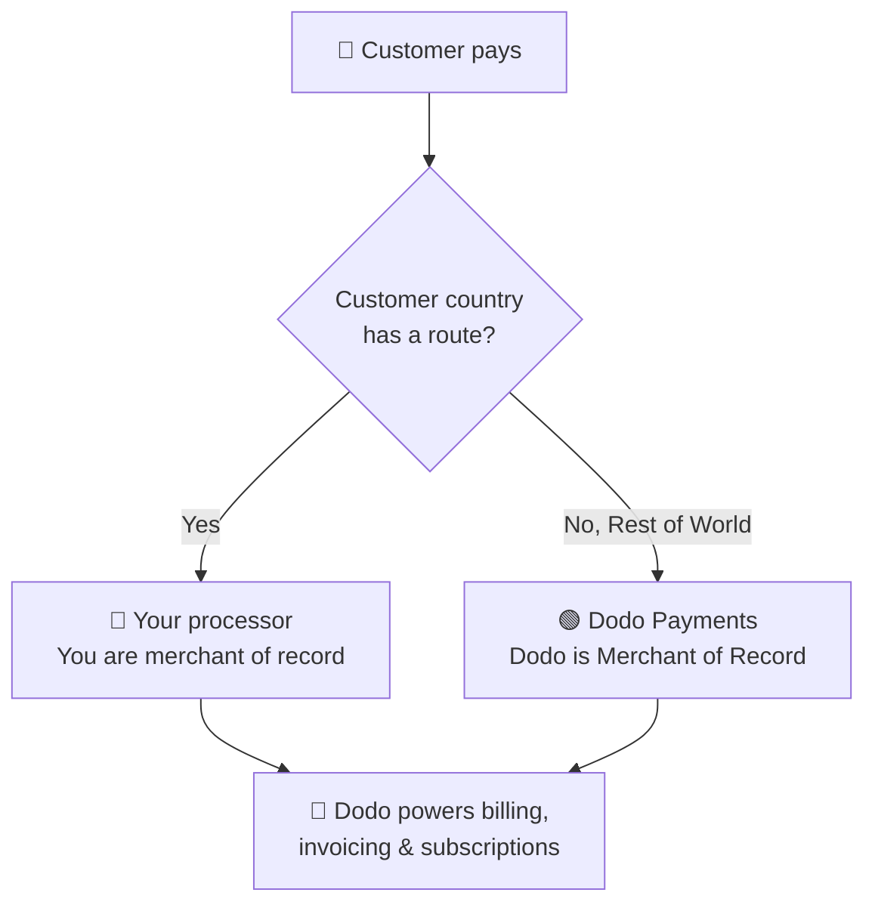

**Apportez Votre Propre Processeur (BYOP)** vous permet de connecter votre propre processeur de paiement — actuellement **Stripe** ou **Adyen**, avec prise en charge de plus de processeurs prochainement — tout en continuant à utiliser Dodo Payments pour tout ce qui est au-dessus de la transaction : produits, abonnements, clés de licence et moteur d'habilitation, facturation, portail client et analyses.

Vous décidez, par pays client, si un paiement est traité par **votre processeur** (vous restez le marchand d'enregistrement pour ce circuit) ou par **Dodo Payments** en tant que marchand d'enregistrement à service complet. Les pays que vous ne routez pas explicitement sont automatiquement redirigés vers Dodo.

Send payments from specific countries to your own processor, and everything else to Dodo.

Continue using your existing Stripe or Adyen accounts and relationships.

On your own routes, you remain the legal seller and control tax, disputes, and payouts.

Dodo powers products, subscriptions, invoices, and analytics across both routes.

## BYOP vs. Dodo comme Marchand d'Enregistrement

Lorsque vous activez BYOP, vous choisissez comment chaque paiement est géré. Les deux modèles peuvent fonctionner côte à côte, dirigés par pays client.

| Fonction | Dodo comme Marchand d'Enregistrement | Apportez Votre Propre Processeur |
|---------|----------------------------|--------------------------|
| Vendeur légal d'enregistrement | Dodo Payments | Votre entreprise |
| Impôts (TVA, GST et taxe de vente) | Calculé, collecté et remis pour vous | Vous enregistrez, collectez et déposez |
| Oppositions et fraude | Responsabilité et protection gérées par Dodo | Vous gérez avec les outils de votre processeur |
| Conformité PCI | Gérée par Dodo | Vous gérez |
| Modes de paiement | 30+ mondiaux et locaux, multi-devises | Cartes uniquement (crédit/débit) |
| Payouts | Paiements globaux agrégés | Directement de votre processeur |
| Configuration | Simple, opérationnel en quelques minutes | Modéré, ajouter des clés et du routage |
| Idéal pour | Vendre mondialement, conformité automatique | Processeur existant et contrôle régional |

A common setup is **hybride**: route a country where you already have a registered entity and processor (for example, your home market) to your own processor, and let Dodo handle the rest of the world as Marchand d'Enregistrement.

## Processeurs pris en charge

Aujourd'hui, vous pouvez connecter **Stripe** ou **Adyen**. Le support pour plus de processeurs est en chemin.

Payments routed through your own processor currently support **credit and debit cards only**. We're adding more payment methods soon.

Both **Stripe** and **Adyen** require **raw card API access** enabled on your account so that Dodo can power billing on top of your processor. Each processor grants this on request — you arrange it by contacting the processor's support before you connect. See the [Stripe](/features/byop/stripe) and [Adyen](/features/byop/adyen) guides for details.

Connections are configured **per environment**. The processor you connect in **test mode** (Sandbox) is separate from the one in **live mode** (Production); set up both if you want to test before going live. The setup wizard follows your dashboard's global test/live toggle.

## Définir le BYOP

Ouvrez **Paramètres → BYOP** dans le tableau de bord et sélectionnez **Configurer** sur la carte *Apportez Votre Propre Processeur* pour lancer l'assistant de configuration.

Select the processor you want to connect, **Stripe** or **Adyen**, and continue.

Give the connection a **Nom du Fournisseur** (utile lorsque vous avez plusieurs comptes du même processeur, par exemple *Stripe US* et *Stripe UK*), puis entrez la **Clé Secrète** de votre processeur (pour Stripe, votre clé `sk_...`).

Pour **Adyen**, entrez également votre identifiant **Compte Marchand**.

L'enregistrement crée la connexion et génère un **Point de terminaison Webhook** unique. Ajoutez cette URL comme destination webhook dans le tableau de bord de votre processeur, puis collez le **Secret de Signature Webhook** dans Dodo pour terminer :

- **Stripe** : collez le secret de signature du point de terminaison de webhook que vous avez ajouté.
- **Adyen** : collez la **clé HMAC** depuis *Espace Client → Webhooks*.

Votre clé secrète est stockée en toute sécurité et ne peut être vue ou modifiée après l'enregistrement. Vous ne configurez que l'URL de webhook générée par Dodo dans votre processeur ; vous n'interagissez jamais directement avec l'infrastructure sous-jacente.

Use **Vérifier la connexion** après l'enregistrement pour lancer un appel de test envers votre processeur et confirmer que les clés et le secret de webhook sont valides avant de passer en direct.

Ajoutez des **règles de routage** qui associent les pays des clients à un processeur. Chaque pays peut être routé vers un seul processeur.

- **Votre processeur** gère les paiements des pays que vous lui assignez.
- **Dodo Payments** gère **Reste du Monde** (tous les pays que vous ne routez pas explicitement) en tant que Marchand d'Enregistrement.

Utilisez **Ajouter un Itinéraire** pour assigner un ou plusieurs pays à un processeur.

**Directives de routage**
- "Reste du Monde" couvre tous les pays non listés ci-dessus.
- Les routes MoR de Dodo Payments gèrent automatiquement la conformité et la fiscalité.
- Les routes de votre propre processeur nécessitent une configuration fiscale séparée si nécessaire.

Pour les paiements routés par votre propre processeur, **vous** êtes le vendeur sur la facture. Entrez les détails commerciaux qui doivent apparaître sur ces factures :

- **Nom Commercial Enregistré** (obligatoire)
- **Identifiant Fiscal** (EIN, SSN, etc.; facultatif, avec validation de format disponible pour les EIN aux États-Unis)
- **Descripteur de Relevé** (obligatoire) : ce que les clients voient sur leur relevé bancaire (5 à 22 caractères)
- **Adresse Commerciale Enregistrée** (obligatoire) : commencez à taper pour rechercher et remplir automatiquement votre adresse
- Liens vers **Politique de Confidentialité** et **Conditions d'Utilisation** (obligatoires)

Un **Aperçu de l'En-tête de Facture** en direct montre comment les détails apparaîtront. Ces détails s'appliquent **uniquement** aux factures pour les routes que vous gérez via votre propre processeur; les paiements routés par Dodo continuent d'utiliser les détails du Marchand d'Enregistrement de Dodo.

Review your processor connection, routing rules, and invoice details. Confirm that the routing and billing details are correct, then select **Terminer la configuration**.

Une fois configurée, la carte BYOP affiche **Modifier la Configuration**, et vous pouvez revenir à uniquement MoR à tout moment avec **Modifier les règles de routage**.

## Comment fonctionne le routage

Le routage est déterminé par le **pays du client** au moment du paiement. La même logique s'applique aux paiements uniques, aux sessions de caisse, et aux inscriptions d'abonnement. Les renouvellements réutilisent le processeur sur lequel l'abonnement a été créé (voir [Abonnements](#subscriptions)).

Sur un itinéraire géré par **votre processeur** :

- Le paiement est traité sur le compte de **votre** processeur dans la devise de facturation.
- **Aucune taxe n'est calculée ou collectée** par Dodo; vous restez responsable de la fiscalité sur cet itinéraire.
- Les factures utilisent les **détails commerciaux et le descripteur de relevé** que vous avez configurés, sans références au Marchand d'Enregistrement.
- Les paiements sont réglés **directement vers vous** de votre processeur; rien ne transite par le portefeuille de Dodo.

Sur un itinéraire géré par **Dodo** (Reste du Monde), Dodo se comporte exactement comme votre Marchand d'Enregistrement à service complet, gérant la fiscalité, la conformité, les litiges, la fraude, et les paiements agrégés.

## Abonnements

Les abonnements restent sur le processeur sur lequel ils ont été créés. Lors du renouvellement, Dodo utilise le même processeur de paiement que celui utilisé pour acheter l'abonnement, réutilisant le mandat de paiement stocké contre celui-ci. Les règles de routage ne sont pas réévaluées à chaque renouvellement.

## Voir quel processeur a traité un paiement

Une fois que le BYOP est configuré, les tables **Paiements** et **Litiges** affichent une icône de processeur (Stripe, Adyen, ou Dodo) à côté de chaque ligne, et les pages de détail des paiements et litiges incluent un champ **Processeur de Paiement**, afin que vous puissiez toujours savoir quel itinéraire a géré une transaction donnée.

## Remboursements, litiges et paiements

Vous initiez les remboursements à partir du tableau de bord Dodo comme d'habitude. Pour les paiements routés via votre propre processeur, le remboursement est exécuté sur ce processeur ; pour les paiements routés par Dodo, Dodo traite le remboursement.

Le tableau de bord Dodo affiche les litiges pour les paiements **traités par Dodo** uniquement.

> Seuls les litiges traités par Dodo sont affichés ici. Les litiges sur votre propre processeur (par exemple, Stripe) sont gérés dans le tableau de bord de ce processeur.

Les actions de téléchargement de preuves, d'acceptation et de contestation ne sont disponibles que pour les litiges traités par Dodo. Les litiges sur votre processeur sont gérés avec les outils propres à votre processeur.

Pour les itinéraires sur votre propre processeur, votre processeur vous paie **directement** ; ces paiements n'apparaissent pas dans Dodo.

> Seuls les paiements Dodo sont visibles ici. Les paiements sur votre propre processeur se produisent dans ce processeur.

Les paiements Dodo (pour le volume MoR du Reste du Monde) suivent la [structure des paiements](/features/payouts/payout-structure) standard.

## Analytique

Les analyses de revenus, de taxes et d'abonnements incluent **les deux** itinéraires pour que vous ayez une vue d'ensemble de votre facturation. Les widgets de litiges et de paiements montrent uniquement l'activité **traitée par Dodo**, avec une bannière indiquant que l'activité sur votre propre processeur se trouve dans le tableau de bord de ce processeur.

## Frais de facturation

Dodo applique un petit **frais de facturation BYOP** sur les paiements routés par votre propre processeur, car Dodo continue de gérer vos produits, abonnements, facturation, et analyses sur ces transactions. Il apparaît comme une ligne `byop_fee` dans votre grand livre de solde. Le taux par défaut est de **0,5%** ; le taux exact est confirmé lors de l'activation de BYOP sur votre compte. [Contactez-nous](mailto:founders@dodopayments.com) pour plus de détails.

## Questions fréquemment posées

Stripe et Adyen sont pris en charge aujourd'hui, avec une assistance pour plus de processeurs à venir. Les deux nécessitent **un accès à l'API des cartes brutes** activé sur votre compte, que vous organisez en contactant le support du processeur. Voir les guides [Stripe](/features/byop/stripe) et [Adyen](/features/byop/adyen) pour plus de détails.

Oui. Affectez des pays spécifiques à votre processeur et laissez le reste comme **Reste du Monde**, que Dodo gère en tant que Marchand d'Enregistrement. Chaque pays est routé vers un seul processeur.

Vous l'êtes. Sur les itinéraires gérés par votre propre processeur, vous restez le vendeur légal et êtes responsable de la fiscalité, des oppositions, de la conformité PCI, et des paiements sur ces transactions.

Non. La taxe n'est pas calculée ni collectée sur les itinéraires gérés par votre propre processeur ; vous gérez la taxe pour ces transactions. Dodo continue de gérer la taxe sur les paiements routés par Dodo (MoR).

Les renouvellements sur ce processeur échoueront et apparaîtront comme des paiements échoués dans le tableau de bord. Réactivez le processeur pour restaurer les renouvellements.

## Commencez

Comprenez comment fonctionne le modèle MoR à service complet de Dodo.
