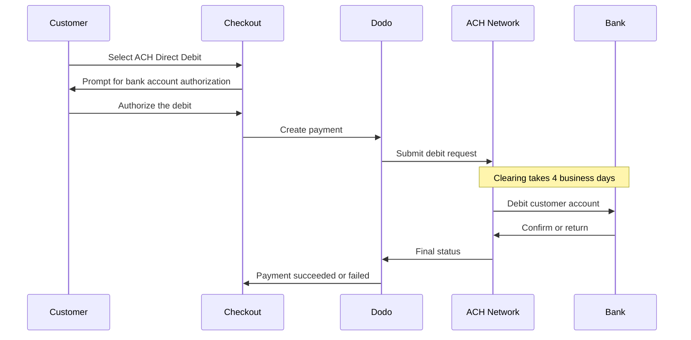

Le prélèvement ACH permet aux clients aux États-Unis de payer directement depuis leur compte bancaire au lieu d'utiliser une carte. Il fonctionne sur le réseau Automated Clearing House et est proposé lors des checkouts en USD pour les paiements ponctuels.

## Pourquoi proposer le prélèvement ACH ?

<CardGroup cols={3}>
<Card title="Lower Processing Cost" icon="piggy-bank">
Les débits bancaires coûtent généralement moins cher à traiter que les paiements par carte, en particulier pour les commandes de montant élevé.
</Card>

<Card title="No Card Required" icon="building-columns">
Touchez les clients américains qui préfèrent payer depuis un compte bancaire ou qui ne souhaitent pas utiliser de carte pour les achats importants.
</Card>

<Card title="Higher Value Orders" icon="chart-line">
L'avantage en termes de coût par rapport aux cartes augmente avec la valeur de la commande, ce qui rend l'ACH particulièrement adapté aux achats ponctuels importants.
</Card>
</CardGroup>

## Présentation

| Détail | Valeur |
| :----- | :---- |
| **Devise de facturation** | USD |
| **Pays pris en charge** | États-Unis |
| **Abonnements** | Non |
| **Montant minimal** | $0.50 |
| **Règlement** | 4 jours ouvrés |

<Warning>
Le prélèvement ACH n'est pas instantané. Un paiement prend **4 jours ouvrés** pour être confirmé. Ne considérez donc pas l'autorisation comme un règlement : n'exécutez la commande qu'une fois le paiement passé à l'état succeeded.
</Warning>

## Fonctionnement



## Expérience client

1. Le client sélectionne le prélèvement ACH lors du checkout
2. Le client autorise le débit sur son compte bancaire américain
3. Le paiement est soumis au réseau ACH et passe à l'état processing
4. La compensation s'effectue au cours des jours ouvrés suivants
5. Le paiement passe à l'état succeeded ou échoue si la banque le retourne

<Info>
La compensation étant asynchrone, utilisez les [webhooks](/developer-resources/webhooks) pour connaître le résultat final plutôt que la redirection du checkout. Une redirection réussie signifie uniquement que le client a autorisé le débit.

Le paiement émet `payment.processing` une fois le débit soumis, puis `payment.succeeded` ou `payment.failed` lorsque la compensation est terminée. Seul `payment.succeeded` permet d'exécuter la commande en toute sécurité.
</Info>

## Disponibilité

Le prélèvement ACH apparaît lors du checkout lorsque toutes les conditions suivantes sont réunies :

- La **devise de facturation** est `USD`
- Le **pays de facturation** est `US`
- La transaction est un **paiement ponctuel**

<Note>
Le prélèvement ACH n'est pas disponible pour les abonnements. Son délai de compensation de plusieurs jours ne convient pas aux cycles de facturation récurrents. Pour les paiements récurrents, utilisez des cartes ou une autre méthode compatible avec les abonnements — consultez la [présentation des méthodes de paiement](/features/payment-methods).
</Note>

## Configuration

```javascript
const session = await client.checkoutSessions.create({
  product_cart: [{ product_id: 'pdt_123', quantity: 1 }],
  allowed_payment_method_types: ['ach', 'credit', 'debit'],
  billing_currency: 'USD',
  billing_address: {
    country: 'US',
    zipcode: '94102'
  },
  return_url: 'https://example.com/success'
});
```

<Note>
Le prélèvement ACH nécessite une **devise de facturation USD** et une **adresse de facturation aux États-Unis**. Si vous indiquez vos prix dans une autre devise, activez [Adaptive Currency](/features/adaptive-currency) afin que les clients américains soient facturés en USD et que l'ACH soit disponible.
</Note>

## Type de méthode API

| Type | Méthode | Pays |
| :--- | :----- | :------ |
| `ach` | Prélèvement ACH | États-Unis |

## Remboursements et litiges

Les remboursements et les litiges liés aux paiements ACH utilisent les mêmes APIs et les mêmes flux du dashboard que toutes les autres méthodes de paiement : aucune gestion spécifique à l'ACH n'est nécessaire.

<Warning>
Les paiements ACH pouvant être retournés par la banque du client après avoir semblé aboutir, évitez d'émettre des remboursements tant que le paiement d'origine n'est pas passé à l'état succeeded.
</Warning>

## Tests

<Steps>
<Step title="Enable test mode">
Utilisez vos clés API de test Dodo Payments.
</Step>

<Step title="Set currency and billing address">
Définissez la devise de facturation sur `USD` et le pays de l'adresse de facturation sur `US`.
</Step>

<Step title="Include `ach` in allowed methods">
Transmettez `ach` dans `allowed_payment_method_types`, ou omettez entièrement le champ pour afficher toutes les méthodes éligibles.
</Step>

<Step title="Enter the test bank details">
Saisissez l'une des paires de numéros d'acheminement et de compte de test ci-dessous, puis vérifiez que votre gestionnaire de webhook reçoit le statut final du paiement.
</Step>
</Steps>

### Comptes bancaires de test

Les clients saisissent directement leur numéro de compte et leur numéro d'acheminement lors du checkout. En mode test, utilisez le numéro d'acheminement `110000000` avec l'un des numéros de compte ci-dessous pour forcer un résultat spécifique.

| Numéro de compte | Numéro d'acheminement | Comportement |
| :------------- | :------------- | :------- |
| `000123456789` | `110000000` | Le paiement réussit. |
| `000222222227` | `110000000` | Le paiement échoue pour insuffisance de fonds. |
| `000111111113` | `110000000` | Le paiement échoue car le compte est clôturé. |
| `000111111116` | `110000000` | Le paiement échoue car aucun compte n'est trouvé. |
| `000333333335` | `110000000` | Le paiement échoue car les débits ne sont pas autorisés sur le compte. |
| `000444444440` | `110000000` | Le paiement échoue en raison d'une devise invalide. |
| `000555555559` | `110000000` | Le paiement réussit, puis déclenche un litige. |
| `000000000009` | `110000000` | Le paiement reste indéfiniment à l'état processing, ce qui est utile pour tester une interface utilisateur d'état pending. |

<Note>
La plupart des paiements de test atteignent un statut final bien plus rapidement que le délai de compensation en production. Vous n'avez donc pas besoin d'attendre plusieurs jours pour vérifier votre intégration. L'exception est `000000000009`, qui est conçu pour rester à l'état processing.
</Note>

## Bonnes pratiques

<AccordionGroup>
<Accordion title="Don't fulfill on authorization">
L'autorisation ACH n'est pas un paiement. Attendez que le paiement passe à l'état succeeded avant d'accorder l'accès ou d'expédier la commande : le débit peut encore être retourné par la banque du client.
</Accordion>

<Accordion title="Set customer expectations at checkout">
Informez les clients que les paiements bancaires ne sont pas compensés instantanément. Cela réduit les tickets d'assistance demandant pourquoi une commande est toujours en attente.
</Accordion>

<Accordion title="Provide card fallbacks">
Incluez toujours `credit` et `debit` avec `ach` afin que les clients ayant besoin d'un accès instantané à votre produit puissent choisir une méthode plus rapide.
</Accordion>

<Accordion title="Use ACH for high-value one-time purchases">
L'avantage en termes de coût de l'ACH augmente avec la valeur de la commande. Il est donc particulièrement utile pour les achats ponctuels importants plutôt que pour les petits achats.
</Accordion>
</AccordionGroup>

## Résolution des problèmes

<AccordionGroup>
<Accordion title="ACH not appearing at checkout">
**Vérifiez :**
1. La devise de facturation est-elle définie sur `USD` ?
2. Le pays de facturation du client est-il `US` ?
3. `ach` est-il inclus dans `allowed_payment_method_types` ?
4. S'agit-il d'un paiement ponctuel ? L'ACH n'est pas proposé pour les abonnements.

**Solution :** Supprimez temporairement `allowed_payment_method_types` pour afficher toutes les méthodes éligibles, puis vérifiez la devise et le pays de l'adresse de facturation dans votre requête API.
</Accordion>

<Accordion title="ACH not appearing on a subscription checkout">
**Cause :** Le prélèvement ACH est proposé uniquement pour les paiements ponctuels.

**Solution :** Utilisez des cartes ou une autre méthode compatible avec les abonnements pour la facturation récurrente.
</Accordion>

<Accordion title="Payment stuck in processing">
**Cause :** Ce comportement est attendu. Les paiements ACH restent à l'état processing pendant toute la durée de la compensation, bien plus longtemps que les paiements par carte.

**Solution :** Attendez le webhook final. Ne relancez pas le paiement : une nouvelle tentative pourrait débiter le client deux fois.
</Accordion>

<Accordion title="Payment failed after initially succeeding at checkout">
**Cause :** La banque du client a retourné le débit, le plus souvent pour insuffisance de fonds ou clôture du compte.

**Solution :** Considérez le paiement comme échoué et demandez au client de réessayer avec une autre méthode de paiement. Conditionnez toujours l'exécution de la commande à l'état succeeded pour éviter ce problème.
</Accordion>
</AccordionGroup>

## Pages associées

<CardGroup cols={2}>
<Card title="Payment Methods Overview" icon="credit-card" href="/features/payment-methods">
Consultez toutes les méthodes de paiement prises en charge.
</Card>

<Card title="Adaptive Currency" icon="globe" href="/features/adaptive-currency">
Prise en charge des devises et conversion automatique.
</Card>

<Card title="Checkout Guide" icon="book" href="/developer-resources/checkout-session">
Guide complet de mise en œuvre du checkout.
</Card>

<Card title="Webhooks" icon="webhook" href="/developer-resources/webhooks">
Gérez les confirmations de paiement différées de manière asynchrone.
</Card>
</CardGroup>
