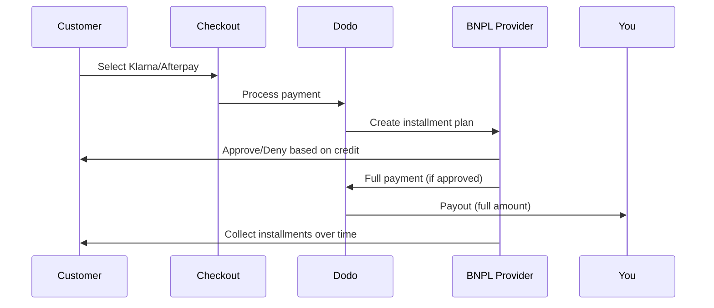

Buy Now Pay Later (BNPL) lets customers split purchases into interest-free installments, increasing average order value by 20-50% and conversion rates by 10-30% for eligible transactions.

## Why Offer BNPL?

<CardGroup cols={3}>
<Card title="Higher AOV" icon="chart-line">
Customers spend more when they can spread payments over time. Average order value increases 20-50%.
</Card>

<Card title="Better Conversion" icon="percent">
Removing payment friction at checkout. Conversion rates improve 10-30% for high-ticket items.
</Card>

<Card title="Zero Risk" icon="shield-check">
BNPL providers handle credit risk and collections. You receive full payment upfront.
</Card>
</CardGroup>

## Supported Providers

### Klarna

| Fonctionnalité | Détails |
| :------ | :------ |
| **Disponibilité** | États-Unis + 19 pays européens |
| **Devises** | USD, EUR, GBP, DKK, NOK, SEK, CZK, RON, PLN, CHF |
| **Minimum** | 50,01 $ (ou équivalent) |
| **Abonnements** | Oui |

**Supported Countries:** Austria, Belgium, Czech Republic, Denmark, Finland, France, Germany, Greece, Ireland, Italy, Netherlands, Norway, Poland, Portugal, Romania, Spain, Sweden, Switzerland, United Kingdom, United States

**Payment Options:**
- **Pay in 4** — Split into 4 interest-free payments
- **Pay in 30 days** — Full payment due in 30 days
- **Financing** — Longer-term installment plans

### Afterpay (Clearpay)

| Feature | Details |
| :------ | :------ |
| **Availability** | US, UK |
| **Currencies** | USD, GBP |
| **Minimum** | $50.01 (or equivalent) |
| **Subscriptions** | No |

**Payment Options:**
- **Pay in 4** — 4 interest-free payments every 2 weeks

<Note>
In the UK, Afterpay operates as "Clearpay" but uses the same API type (`afterpay_clearpay`).
</Note>

### Billie

| Feature | Details |
| :------ | :------ |
| **Availability** | Global |
| **Currencies** | GBP |
| **Minimum** | None |
| **Subscriptions** | No |

**About Billie:**
Billie is a B2B Buy Now Pay Later solution that enables businesses to offer flexible payment terms to their customers. It's designed for business-to-business transactions where buyers need invoice-based payment options.

**Payment Options:**
- **Invoice Payment** — Pay within agreed payment terms
- **Flexible Terms** — Business-friendly payment schedules

## Configuration

### Types de méthodes API

| Type | Fournisseur |
| :--- | :------- |
| `klarna` | Klarna |
| `afterpay_clearpay` | Afterpay / Clearpay |
| `billie` | Billie (B2B) |

### Exemple

```javascript
const session = await client.checkoutSessions.create({
  product_cart: [{ product_id: 'pdt_123', quantity: 1 }],
  allowed_payment_method_types: [
    'klarna',
    'afterpay_clearpay',
    'credit',
    'debit'
  ],
  customer: {
    email: 'customer@example.com',
    name: 'Jane Smith'
  },
  billing_address: {
    country: 'US',
    zipcode: '10001'
  },
  return_url: 'https://example.com/success'
});
```

<Warning>
Incluez toujours `credit` et `debit` comme solutions de repli. Tous les clients ne sont pas éligibles au BNPL, et les transactions inférieures au minimum du fournisseur ne seront pas admissibles.
</Warning>

## Limites des montants des transactions

Chaque fournisseur de BNPL possède son propre montant minimum (et parfois maximum) de transaction :

| Fournisseur | Minimum | Maximum |
| :------- | :------ | :------ |
| Klarna | $50.01 | — |
| Afterpay | $50.01 | — |

Les transactions en dehors de ces seuils :
- Les options BNPL n'apparaîtront pas lors du checkout
- Aucune erreur n'est générée — les options ne s'affichent tout simplement pas
- Les paiements par carte restent disponibles

C'est le comportement attendu. N'incluez pas une méthode BNPL dans `allowed_payment_method_types` si le prix de votre produit a peu de chances de se situer dans la plage prise en charge par ce fournisseur.

## Fonctionnement des paiements échelonnés



**Points clés :**
- Vous recevez le **paiement intégral immédiatement** du fournisseur de BNPL
- Le fournisseur de BNPL prend en charge le **risque de crédit et le recouvrement**
- Le client paie directement le fournisseur en **4 versements** (généralement)
- **Aucun chargeback** lié à l'échec d'un versement — ce risque est pris en charge par le fournisseur

## Tests

### Données de test Klarna

Utilisez ces informations en mode test :

| Champ | Approuvé | Refusé |
| :---- | :------- | :----- |
| **Date de naissance** | 07-10-1970 | 07-10-1970 |
| **Prénom** | Test | Test |
| **Nom** | Person-us | Person-us |
| **E-mail** | customer@email.us | customer+denied@email.us |
| **Rue** | Amsterdam Ave | Amsterdam Ave |
| **Numéro** | 509 | 509 |
| **Ville** | New York | New York |
| **État** | New York | New York |
| **Code postal** | 10024-3941 | 10024-3941 |
| **Téléphone** | +13106683312 | +13106354386 |

<Note>
La transaction doit être d'au moins $50 pour que Klarna apparaisse comme option.
</Note>

### Tests Afterpay

<Steps>
<Step title="Select Afterpay">
Choisissez Afterpay lors du checkout, puis cliquez sur Payer.
</Step>

<Step title="Successful payment">
Utilisez n'importe quelle adresse e-mail et adresse de livraison valides.
</Step>

<Step title="Failed authentication">
Pour tester un échec : fermez la fenêtre modale Afterpay sur la page de redirection. Le statut du paiement passe à `requires_payment_method`.
</Step>
</Steps>

## Bonnes pratiques

<AccordionGroup>
<Accordion title="Target high-ticket items">
Le BNPL est particulièrement adapté aux produits compris entre $100 et $1000. La proposition de valeur du « paiement échelonné » est particulièrement convaincante dans cette fourchette.
</Accordion>

<Accordion title="Show installment amounts">
« 4 paiements de $25 » est plus convaincant que « $100 avec Klarna ». Affichez le montant de chaque paiement lorsque cela est possible.
</Accordion>

<Accordion title="Don't force BNPL for low-value products">
En dessous de $50, le BNPL n'apparaîtra de toute façon pas. En dessous de $100, la plupart des clients préfèrent les cartes. Concentrez la promotion du BNPL sur les articles plus chers.
</Accordion>

<Accordion title="Collect billing address">
Les fournisseurs de BNPL exigent des informations de facturation pour effectuer les vérifications de crédit. Assurez-vous que votre checkout recueille tous les détails de l'adresse.
</Accordion>

<Accordion title="Set clear expectations">
Les clients doivent comprendre qu'ils concluent un accord de crédit avec Klarna/Afterpay, et non avec vous.
</Accordion>
</AccordionGroup>

## Limitations

### Pas d'abonnements
Les méthodes de paiement BNPL **ne prennent pas en charge les paiements récurrents**. Pour les produits par abonnement, utilisez des cartes ou d'autres méthodes compatibles avec les paiements récurrents.

### Approbation basée sur le crédit
Les fournisseurs de BNPL effectuent des vérifications de crédit instantanées. Tous les clients ne seront pas approuvés. Les taux d'approbation varient selon :
- L'historique de crédit du client auprès du fournisseur
- Le montant de la transaction
- La localisation du client

### Correspondance entre devise et pays

Chaque devise est limitée à la région correspondante :

| Devise | Pays pris en charge |
| :------- | :------------------ |
| **USD** | États-Unis uniquement |
| **EUR** | Tous les pays européens pris en charge (Autriche, Belgique, République tchèque, Danemark, Finlande, France, Allemagne, Grèce, Irlande, Italie, Pays-Bas, Norvège, Pologne, Portugal, Roumanie, Espagne, Suède, Suisse) |
| **GBP** | Royaume-Uni et tous les pays européens pris en charge |

Les autres devises prises en charge par Klarna (DKK, NOK, SEK, CZK, RON, PLN, CHF) fonctionnent dans leurs pays respectifs.

<Info>
Par exemple, une transaction en USD n'affichera les options BNPL qu'aux clients situés aux États-Unis. Une transaction en EUR affichera les options BNPL dans tous les pays européens pris en charge. Une transaction en GBP affichera les options BNPL aux clients situés au Royaume-Uni et dans tous les pays européens pris en charge.
</Info>

| Fournisseur | Devises prises en charge |
| :------- | :------------------- |
| Klarna | USD, EUR, GBP, DKK, NOK, SEK, CZK, RON, PLN, CHF |
| Afterpay | USD (US), GBP (UK) |

## Dépannage

<AccordionGroup>
<Accordion title="BNPL not appearing at checkout">
**Vérifiez :**
1. Le montant de la transaction se situe-t-il dans la plage prise en charge par le fournisseur ? (Klarna/Afterpay : min. $50.01)
2. La localisation du client se trouve-t-elle dans un pays pris en charge ?
3. La devise est-elle prise en charge par le fournisseur de BNPL ?
4. La méthode BNPL est-elle incluse dans `allowed_payment_method_types` ?

**Solution :** Le plus souvent, la transaction est inférieure au minimum ou supérieure au maximum. Vérifiez que le montant se situe dans la plage prise en charge par le fournisseur.
</Accordion>

<Accordion title="Customer denied by BNPL provider">
**Causes :**
- Historique de crédit insuffisant auprès du fournisseur
- Trop de plans de paiement échelonné actifs
- Échec de la vérification d'identité

**Solution :** Cette situation est attendue pour certains clients. Assurez-vous que des solutions de repli par carte sont disponibles. N'exposez pas les raisons précises du refus.
</Accordion>

<Accordion title="Payment stuck in pending">
**Cause :** Le client n'a pas terminé le processus d'authentification auprès du fournisseur de BNPL.

**Solution :** Le paiement expirera puis échouera. Le client peut réessayer ou utiliser une autre méthode.
</Accordion>
</AccordionGroup>

## Pages associées

<CardGroup cols={2}>
<Card title="Payment Methods Overview" icon="credit-card" href="/features/payment-methods">
Consultez toutes les méthodes de paiement prises en charge.
</Card>

<Card title="Checkout Guide" icon="book" href="/developer-resources/checkout-session">
Guide complet de mise en œuvre du checkout.
</Card>

<Card title="Testing Process" icon="flask" href="/miscellaneous/testing-process">
Toutes les données de test pour les méthodes de paiement.
</Card>

<Card title="Adaptive Currency" icon="globe" href="/features/adaptive-currency">
Prise en charge et conversion des devises.
</Card>
</CardGroup>