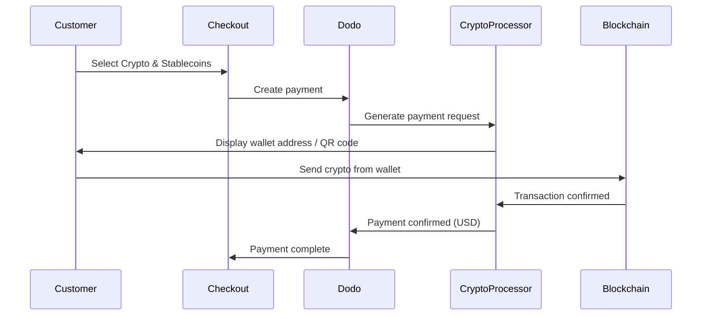

Les paiements Crypto & Stablecoins permettent aux clients de payer en utilisant des cryptomonnaies et des stablecoins de n'importe où dans le monde (à l'exclusion de l'Inde). Les transactions sont facturées en USD, vous recevez donc de la monnaie fiduciaire pendant que les clients paient avec leur portefeuille crypto préféré.

## Pourquoi proposer les Crypto & Stablecoins ?

<CardGroup cols={3}>
<Card title="Global Reach" icon="globe">
Acceptez des paiements de n'importe quel pays — aucune infrastructure bancaire requise du côté du client.
</Card>

<Card title="No Chargebacks" icon="shield-check">
Les transactions crypto sont irréversibles, éliminant complètement la fraude par rétrofacturation.
</Card>

<Card title="USD Settlement" icon="dollar-sign">
Vous recevez des USD — pas besoin de gérer la volatilité des cryptomonnaies ou des portefeuilles.
</Card>
</CardGroup>

## Vue d'ensemble

| Détail | Valeur |
| :----- | :---- |
| **Devise de facturation** | USD |
| **Pays pris en charge** | Mondial (sauf IN) |
| **Abonnements** | Non |
| **Montant minimum** | $0.50 |
| **Règlement** | USD |

## Comment ça fonctionne



## Expérience client

1. Le client sélectionne Crypto & Stablecoins à la caisse
2. Une adresse de portefeuille et un code QR sont affichés avec le montant en crypto
3. Le client envoie le montant exact depuis son portefeuille crypto
4. La transaction est confirmée sur la blockchain
5. Le client est redirigé vers la page de réussite

<Info>
Les paiements crypto sont facturés en USD. Le montant en crypto affiché lors du paiement reflète le taux de change en temps réel au moment du paiement.
</Info>

## Devises & Réseaux pris en charge

| Devise | Réseaux |
| :------- | :------- |
| **USDC** | Ethereum, Solana, Polygon, Base |
| **USDP** | Ethereum, Solana |
| **USDG** | Ethereum |

## Configuration

```javascript
const session = await client.checkoutSessions.create({
  product_cart: [{ product_id: 'prod_123', quantity: 1 }],
  allowed_payment_method_types: ['crypto', 'credit', 'debit'],
  return_url: 'https://example.com/success'
});
```

## Type de méthode API

| Type | Méthode | Pays |
| :--- | :----- | :------ |
| `crypto` | Crypto & Stablecoins | Mondial (sauf IN) |

## Test

<Steps>
<Step title="Enable test mode">
Utilisez vos clés API de test Dodo Payments.
</Step>

<Step title="Create a test checkout">
Créez une session de paiement avec `crypto` dans les méthodes de paiement autorisées.
</Step>

<Step title="Complete the test flow">
Suivez le flux de paiement crypto simulé dans l'environnement de test.
</Step>
</Steps>

## Bonnes pratiques

<AccordionGroup>
<Accordion title="Always include card fallbacks">
Tous les clients n'ont pas de portefeuilles crypto. Incluez toujours `credit` et `debit` comme méthodes de paiement de secours.
</Accordion>

<Accordion title="Set clear expectations on confirmation time">
Les confirmations sur la blockchain peuvent prendre des minutes selon le réseau. Assurez-vous que votre caisse communique cela aux clients.
</Accordion>

<Accordion title="Handle underpayments and overpayments">
Les paiements crypto peuvent parfois différer légèrement du montant exact en raison des frais de réseau. Surveillez les webhooks pour les mises à jour du statut de paiement.
</Accordion>
</AccordionGroup>

## Dépannage

<AccordionGroup>
<Accordion title="Crypto not appearing at checkout">
**Vérification :**
1. `crypto` inclus dans `allowed_payment_method_types` ?
2. Le montant de la transaction atteint-il le minimum (0,50 $) ?

**Solution :** Vérifiez que le type de méthode de paiement est correctement passé dans votre requête API.
</Accordion>

<Accordion title="Payment not confirming">
**Cause :** Les temps de confirmation de la blockchain varient. Certains réseaux prennent plus de temps que d'autres.

**Solution :** Attendez la confirmation du webhook. Ne considérez pas le paiement comme échoué avant la fin de la fenêtre de confirmation.
</Accordion>

<Accordion title="Amount mismatch">
**Cause :** Les taux de change des cryptos fluctuent entre le moment où le paiement est initié et celui où il est envoyé.

**Solution :** Surveillez les webhooks pour le montant final confirmé. Les petites différences sont gérées automatiquement.
</Accordion>
</AccordionGroup>

## Pages connexes

<CardGroup cols={2}>
<Card title="Payment Methods Overview" icon="credit-card" href="/features/payment-methods">
Voir tous les moyens de paiement pris en charge.
</Card>

<Card title="Checkout Guide" icon="book" href="/developer-resources/checkout-session">
Guide complet de mise en œuvre de la caisse.
</Card>

<Card title="Webhooks" icon="webhook" href="/developer-resources/webhooks">
Gérer les confirmations de paiement de manière asynchrone.
</Card>

<Card title="Testing Process" icon="flask" href="/miscellaneous/testing-process">
Guide de test complet pour tous les moyens de paiement.
</Card>
</CardGroup>
