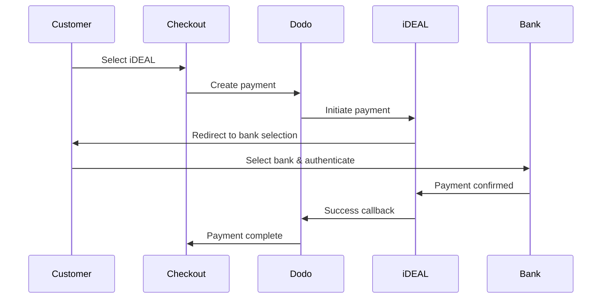
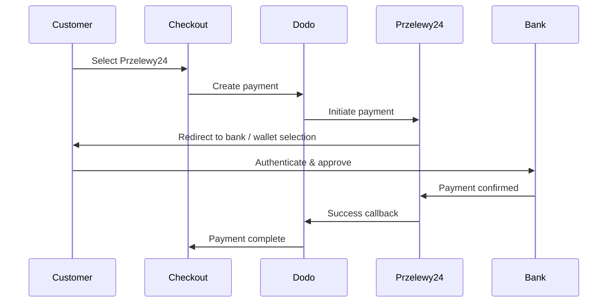
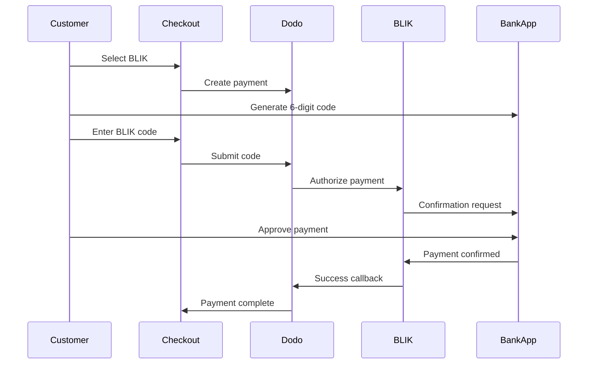

Les clients européens préfèrent fortement les méthodes de paiement locales qui s'intègrent à leurs systèmes bancaires. Offrir ces méthodes peut augmenter les taux de conversion de 20 à 40 % sur les marchés cibles.

## Pourquoi des méthodes de paiement locales européennes ?

<CardGroup cols={3}>
<Card title="Higher Conversion" icon="chart-line">
iDEAL capte ~60 % des paiements en ligne néerlandais. Ne pas le proposer signifie perdre des clients.
</Card>

<Card title="Lower Fraud" icon="shield-check">
Les paiements authentifiés par la banque présentent des taux de fraude quasi nuls et aucun rétrofacturation.
</Card>

<Card title="Real-Time Settlement" icon="bolt">
La plupart des méthodes européennes fournissent une confirmation de paiement instantanée.
</Card>
</CardGroup>

## Méthodes prises en charge

| Méthode | Pays | Part de marché | Devise | Abonnements |
| :----- | :------ | :----------- | :------- | :-----------: |
| **iDEAL** | Pays-Bas | ~60 % | EUR | Non |
| **Bancontact** | Belgique | ~50 % | EUR | Non |
| **EPS** | Autriche | ~30 % | EUR | Non |
| **Multibanco** | Portugal | ~40 % | EUR | Non |
| **Przelewy24 (P24)** | Pologne | ~30 % | PLN | Non |
| **BLIK** | Pologne | ~60 % | PLN | Non |
| **SEPA Direct Debit** | Zone euro | Largement utilisée | EUR | Non |
| **Satispay** | Europe (Italie) | En croissance | EUR | Oui |

## iDEAL (Pays-Bas)

iDEAL est la méthode de paiement en ligne dominante aux Pays-Bas, se connectant directement à toutes les banques néerlandaises majeures.

### Comment ça fonctionne



### Banques prises en charge

Toutes les grandes banques néerlandaises sont prises en charge :
- ABN AMRO
- ASN Bank
- Bunq
- ING
- Knab
- Rabobank
- RegioBank
- Revolut
- SNS
- Triodos Bank
- Van Lanschot

### Configuration

```javascript
const session = await client.checkoutSessions.create({
  product_cart: [{ product_id: 'prod_123', quantity: 1 }],
  allowed_payment_method_types: ['ideal', 'credit', 'debit'],
  billing_currency: 'EUR',
  billing_address: {
    country: 'NL',
    zipcode: '1012JS'
  },
  return_url: 'https://example.com/success'
});
```

## Bancontact (Belgique)

Bancontact est le système de paiement national de la Belgique, utilisé par pratiquement toutes les banques belges pour les paiements en ligne.

### Caractéristiques
- Fonctionne avec des cartes de débit belges existantes
- Support pour applications mobiles (Payconiq par Bancontact)
- Confirmation de paiement instantanée
- Pas d'enregistrement supplémentaire nécessaire pour les clients

### Configuration

```javascript
const session = await client.checkoutSessions.create({
  product_cart: [{ product_id: 'prod_123', quantity: 1 }],
  allowed_payment_method_types: ['bancontact_card', 'credit', 'debit'],
  billing_currency: 'EUR',
  billing_address: {
    country: 'BE',
    zipcode: '1000'
  },
  return_url: 'https://example.com/success'
});
```

## EPS (Autriche)

EPS (Electronic Payment Standard) permet des transferts bancaires directs en ligne pour les clients autrichiens.

### Caractéristiques
- Intégration directe avec les banques autrichiennes
- Confirmation de paiement en temps réel
- Haute confiance parmi les consommateurs autrichiens
- Pas de rétrofacturations

### Banques prises en charge

Principales banques autrichiennes, y compris :
- Erste Bank
- Bank Austria
- Raiffeisen
- BAWAG
- Volksbank

### Configuration

```javascript
const session = await client.checkoutSessions.create({
  product_cart: [{ product_id: 'prod_123', quantity: 1 }],
  allowed_payment_method_types: ['eps', 'credit', 'debit'],
  billing_currency: 'EUR',
  billing_address: {
    country: 'AT',
    zipcode: '1010'
  },
  return_url: 'https://example.com/success'
});
```

## Multibanco (Portugal)

Multibanco est le réseau interbancaire du Portugal, offrant à la fois des paiements en ligne et des paiements via DAB.

### Options de paiement

1. **Banque en ligne** — Transfert bancaire direct via la banque en ligne
2. **Paiement DAB** — Le client reçoit une référence à payer dans n'importe quel DAB Multibanco
3. **Banque mobile** — Paiement via des applications bancaires mobiles

### Comment fonctionne le paiement DAB

Pour les paiements DAB, les clients reçoivent une référence de paiement :

```
Entity: 12345
Reference: 123 456 789
Amount: €50.00
Expiry: 24 hours
```

Le client peut payer dans n'importe quel DAB portugais ou via la banque en ligne en utilisant cette référence.

### Configuration

```javascript
const session = await client.checkoutSessions.create({
  product_cart: [{ product_id: 'prod_123', quantity: 1 }],
  allowed_payment_method_types: ['multibanco', 'credit', 'debit'],
  billing_currency: 'EUR',
  billing_address: {
    country: 'PT',
    zipcode: '1000-001'
  },
  return_url: 'https://example.com/success'
});
```

<Note>
Les paiements Multibanco aux distributeurs automatiques peuvent présenter un délai entre la validation et le paiement effectif. Surveillez les webhooks pour confirmer le paiement.
</Note>

## Przelewy24 (Pologne)

Przelewy24 (P24) est la première méthode de paiement en ligne en Pologne, agrégeant les virements bancaires et les portefeuilles locaux de toutes les grandes banques polonaises. Contrairement aux autres méthodes européennes, Przelewy24 règle en **PLN** (Złoty polonais), et non en EUR.

### Comment ça fonctionne



### Disponibilité

- **Devise de facturation :** PLN uniquement
- **Type de transaction :** Paiements uniques uniquement (non disponible pour les abonnements)
- **Couverture :** Toutes les grandes banques polonaises plus les portefeuilles locaux populaires

### Configuration

```javascript
const session = await client.checkoutSessions.create({
  product_cart: [{ product_id: 'prod_123', quantity: 1 }],
  allowed_payment_method_types: ['przelewy24', 'credit', 'debit'],
  billing_currency: 'PLN',
  billing_address: {
    country: 'PL',
    zipcode: '00-001'
  },
  return_url: 'https://example.com/success'
});
```

<Note>
Przelewy24 nécessite une devise de facturation en **PLN**. Si vous proposez vos prix en EUR, activez [Adaptive Currency](/features/adaptive-currency) afin que les clients polonais soient facturés en PLN et que Przelewy24 devienne disponible.
</Note>

## BLIK (Pologne)

BLIK est la méthode de paiement mobile la plus populaire en Pologne, permettant aux clients de payer en utilisant un code à 6 chiffres généré dans leur application bancaire. Comme Przelewy24, BLIK se règle en **PLN** (Złoty polonais), pas en EUR.

### Fonctionnement



### Disponibilité

- **Devise de facturation :** uniquement PLN
- **Type de transaction :** Paiements uniques uniquement (non disponible pour les abonnements)
- **Couverture :** Toutes les grandes banques polonaises prenant en charge BLIK

### Configuration

```javascript
const session = await client.checkoutSessions.create({
  product_cart: [{ product_id: 'prod_123', quantity: 1 }],
  allowed_payment_method_types: ['blik', 'credit', 'debit'],
  billing_currency: 'PLN',
  billing_address: {
    country: 'PL',
    zipcode: '00-001'
  },
  return_url: 'https://example.com/success'
});
```

<Note>
BLIK nécessite une devise de facturation en **PLN**. Si vous facturez vos prix en EUR, activez [Devise Adaptive](/features/adaptive-currency) pour que les clients polonais soient facturés en PLN et que BLIK devienne disponible.
</Note>

## SEPA Direct Debit (zone euro)

SEPA Direct Debit permet aux clients de la zone euro de payer directement depuis leur compte bancaire au lieu d'utiliser une carte. Il est proposé lors des checkouts en EUR pour les paiements ponctuels.

### Fonctionnement

Le client autorise le prélèvement lors du checkout et le paiement est prélevé sur son compte bancaire. Contrairement à la plupart des méthodes européennes présentées sur cette page, la confirmation n'est pas immédiate.

<Warning>
SEPA Direct Debit n'est pas instantané. Un paiement prend **6 jours ouvrés** pour être confirmé. Ne considérez donc pas l'autorisation comme un règlement : n'effectuez la livraison qu'une fois que le paiement est passé à l'état succeeded.
</Warning>

### Disponibilité

- **Devise de facturation :** EUR
- **Type de transaction :** Paiements ponctuels uniquement (non disponible pour les abonnements)

### Configuration

```javascript
const session = await client.checkoutSessions.create({
  product_cart: [{ product_id: 'prod_123', quantity: 1 }],
  allowed_payment_method_types: ['sepa', 'credit', 'debit'],
  billing_currency: 'EUR',
  billing_address: {
    country: 'DE',
    zipcode: '10115'
  },
  return_url: 'https://example.com/success'
});
```

## Satispay (Europe)

Satispay est un réseau européen de paiement mobile populaire, particulièrement en Italie. Il permet aux clients de payer directement depuis leur application Satispay sans partager leurs informations de carte ou de compte bancaire. Satispay règle les paiements en **EUR**.

### Fonctionnalités

- Paiements via une application, indépendants des réseaux de cartes
- Forte adoption en Italie et croissance dans d'autres marchés européens
- Prend en charge les paiements ponctuels et les abonnements

### Disponibilité

- **Devise de facturation :** EUR
- **Type de transaction :** Paiements ponctuels et abonnements

### Configuration

```javascript
const session = await client.checkoutSessions.create({
  product_cart: [{ product_id: 'prod_123', quantity: 1 }],
  allowed_payment_method_types: ['satispay', 'credit', 'debit'],
  billing_currency: 'EUR',
  billing_address: {
    country: 'IT',
    zipcode: '00100'
  },
  return_url: 'https://example.com/success'
});
```

## Types de méthodes API

| Type | Méthode | Pays |
| :--- | :----- | :------ |
| `ideal` | iDEAL | Pays-Bas |
| `bancontact_card` | Bancontact | Belgique |
| `eps` | EPS | Autriche |
| `multibanco` | Multibanco | Portugal |
| `przelewy24` | Przelewy24 (P24) | Pologne |
| `blik` | BLIK | Pologne |
| `sepa` | SEPA Direct Debit | Zone euro |
| `satispay` | Satispay | Europe (Italie) |

## Checkout européen multi-pays

Pour les entreprises qui servent plusieurs pays européens, incluez toutes les méthodes régionales :

```javascript
const session = await client.checkoutSessions.create({
  product_cart: [{ product_id: 'prod_123', quantity: 1 }],
  allowed_payment_method_types: [
    'ideal',           // Netherlands
    'bancontact_card', // Belgium
    'eps',             // Austria
    'multibanco',      // Portugal
    'przelewy24',      // Poland (requires PLN billing currency)
    'blik',            // Poland (requires PLN billing currency)
    'sepa',            // Eurozone (one-time payments only)
    'satispay',        // Europe / Italy
    'credit',          // Fallback
    'debit'            // Fallback
  ],
  billing_currency: 'EUR',
  return_url: 'https://example.com/success'
});
```

Dodo affiche automatiquement uniquement les méthodes pertinentes en fonction de la localisation du client. Un client néerlandais verra iDEAL ; un client belge verra Bancontact.

## Tests

Les méthodes de paiement européennes peuvent être testées en mode sandbox. Le flux de test simule le processus d'authentification bancaire.

<Steps>
<Step title="Enable test mode">
Utilisez vos clés API de test Dodo Payments.
</Step>

<Step title="Set appropriate billing address">
Définissez le pays de l'adresse de facturation pour qu'il corresponde à la méthode de paiement :
- `NL` pour iDEAL
- `BE` pour Bancontact
- `AT` pour EPS
- `PT` pour Multibanco
- `PL` pour Przelewy24 et BLIK (avec la devise de facturation PLN)
- `IT` pour Satispay
</Step>

<Step title="Complete the test flow">
Suivez le flux d'authentification bancaire simulé dans l'environnement de test.
</Step>
</Steps>

## Bonnes pratiques

<AccordionGroup>
<Accordion title="Always include regional methods for target markets">
Si vous vendez à des clients néerlandais, incluez iDEAL. Ne pas le proposer revient à ne pas accepter Visa aux États-Unis : vous perdrez une part importante de vos ventes.
</Accordion>

<Accordion title="Match currency to region">
La plupart des méthodes de paiement européennes exigent l'EUR : assurez-vous que votre tarification prend en charge les transactions en euros. La seule exception est Przelewy24, proposé uniquement avec une facturation en **PLN** (złoty polonais).
</Accordion>

<Accordion title="Handle redirects gracefully">
Toutes les méthodes européennes impliquent des redirections vers des sites bancaires. Assurez-vous que la gestion de votre URL de retour est robuste et qu'elle tient compte des utilisateurs qui abandonnent le processus en cours.
</Accordion>

<Accordion title="Provide card fallbacks">
Tous les clients européens n'ont pas accès à ces méthodes régionales (touristes, expatriés, etc.). Incluez toujours `credit` et `debit` comme solutions de secours.
</Accordion>

<Accordion title="Consider Multibanco timing">
Les paiements Multibanco aux distributeurs automatiques peuvent prendre plusieurs heures. Ne bloquez pas la livraison en attendant un paiement immédiat : utilisez des webhooks pour la confirmation asynchrone.
</Accordion>
</AccordionGroup>

## Résolution des problèmes

<AccordionGroup>
<Accordion title="European method not appearing">
**Vérifiez :**
1. Le pays de facturation du client correspond-il au pays de la méthode ?
2. La devise est-elle définie sur EUR ?
3. La méthode est-elle incluse dans `allowed_payment_method_types` ?

**Solution :** Les méthodes européennes sont strictement régionales. Un client dont le pays de facturation est `DE` (Allemagne) ne verra pas iDEAL, qui est réservé aux Pays-Bas.
</Accordion>

<Accordion title="Bank authentication failed">
**Causes :**
- Le client a annulé pendant l'authentification bancaire
- Le système d'authentification de la banque est temporairement indisponible
- Le client a saisi des identifiants incorrects

**Solution :** Le client doit réessayer. Si le problème persiste, suggérez-lui d'essayer une autre méthode de paiement.
</Accordion>

<Accordion title="Redirect not completing">
**Causes :**
- Le client a fermé son navigateur pendant la redirection bancaire
- Des problèmes réseau sont survenus pendant l'authentification
- L'URL de retour est mal configurée

**Solution :** Vérifiez que l'URL de retour est correcte et accessible. Assurez-vous qu'elle gère les états de réussite et d'échec.
</Accordion>

<Accordion title="Multibanco payment pending">
**Cause :** Le client a reçu une référence de paiement, mais n'a pas encore payé.

**Solution :** Ce comportement est attendu pour les paiements aux distributeurs automatiques. Attendez la confirmation du webhook. La référence expire généralement sous 24 à 72 heures.
</Accordion>
</AccordionGroup>

## Conformité à la PSD2

Toutes les méthodes de paiement européennes sont conformes aux réglementations PSD2 (Payment Services Directive 2) :

- **Strong Customer Authentication (SCA)** — Intégrée au flux d'authentification bancaire
- **Secure Communication** — Toutes les données sont transmises via des canaux sécurisés
- **Consumer Protection** — Conformité complète aux droits des consommateurs de l'UE

## Pages associées

<CardGroup cols={2}>
<Card title="Payment Methods Overview" icon="credit-card" href="/features/payment-methods">
Consultez toutes les méthodes de paiement prises en charge.
</Card>

<Card title="Adaptive Currency" icon="globe" href="/features/adaptive-currency">
Prise en charge des devises et conversion automatique.
</Card>

<Card title="Checkout Guide" icon="book" href="/developer-resources/checkout-session">
Guide complet de mise en œuvre du checkout.
</Card>

<Card title="Webhooks" icon="webhook" href="/developer-resources/webhooks">
Gérez les confirmations de paiement de manière asynchrone.
</Card>
</CardGroup>