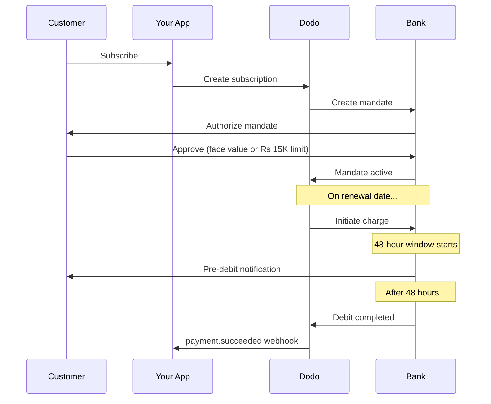

L’Inde dispose d’une infrastructure de paiement unique, dominée par UPI (plus de 60 % des transactions numériques) et les cartes émises en Inde (Visa, Mastercard, Rupay, etc.). Dodo Payments prend en charge toutes ces méthodes dans le respect total des exigences de la RBI pour les mandats d’abonnement.

## Pourquoi les méthodes de paiement en Inde sont importantes

<CardGroup cols={3}>
<Card title="UPI Dominance" icon="mobile">
UPI traite plus de 10 milliards de transactions par mois. De nombreux clients indiens ne disposent pas de cartes internationales.
</Card>

<Card title="Low Transaction Costs" icon="indian-rupee-sign">
UPI entraîne des frais de transaction quasi nuls. Cette méthode est idéale pour les transactions à volume élevé et à faible valeur.
</Card>

<Card title="Subscription Support" icon="repeat">
Contrairement à la plupart des méthodes de paiement alternatives, UPI et toutes les cartes émises en Inde (Visa, Mastercard, Rupay, etc.) prennent en charge les paiements récurrents via des mandats de la RBI.
</Card>
</CardGroup>

## Méthodes prises en charge

| Méthode | Type | Abonnements | Montant min. |
| :----- | :--- | :-----------: | :--------- |
| **UPI Collect** | Code QR / VPA | Oui* | ₹1 |
| **Rupay Credit** | Carte | Oui* | ₹1 |
| **Rupay Debit** | Carte | Oui* | ₹1 |

*Les abonnements nécessitent des mandats conformes aux exigences de la RBI et soumis à des règles de traitement particulières. Le délai de traitement de 48 heures s’applique à toutes les cartes émises en Inde et à UPI.

## Configuration

### Types de méthodes API

| Type | Description |
| :--- | :---------- |
| `upi_collect` | UPI via code QR ou saisie d’un VPA |
| `credit` | Cartes de crédit, y compris Rupay |
| `debit` | Cartes de débit, y compris Rupay |

### Exemple : checkout destiné à l’Inde

```javascript
const session = await client.checkoutSessions.create({
  product_cart: [{ product_id: 'prod_123', quantity: 1 }],
  allowed_payment_method_types: [
    'upi_collect',
    'credit',
    'debit'
  ],
  billing_currency: 'INR',
  customer: {
    email: 'customer@example.in',
    name: 'Priya Sharma',
    phone_number: '+919876543210'
  },
  billing_address: {
    country: 'IN',
    zipcode: '560001'
  },
  return_url: 'https://example.com/success'
});
```

### Conditions requises pour UPI

Pour que UPI apparaisse lors du checkout :
1. Le **pays de facturation** doit être l’Inde (`IN`)
2. La **devise** doit être INR
3. Pour les marchands non indiens : **Adaptive Currency** doit être activé

<Warning>
Si vous êtes un marchand non indien et que Adaptive Currency n’est pas activé, UPI ne sera pas disponible pour vos clients.
</Warning>

## Abonnements avec des mandats de la RBI

Les abonnements utilisant des méthodes de paiement indiennes sont régis par les réglementations de la RBI (Reserve Bank of India), qui imposent des exigences particulières.

### Fonctionnement des mandats de la RBI



### Types de mandats

| Montant de l’abonnement | Type de mandat | Limite |
| :------------------ | :----------- | :---- |
| **Inférieur au seuil du mandat** | Mandat à la demande | Seuil du mandat (₹15 000 par défaut) |
| **Égal ou supérieur au seuil du mandat** | Mandat à montant fixe | Montant exact de l’abonnement |

Le montant enregistré auprès de la banque du client est `max(mandate_floor, billing_amount)`. Le seuil constitue donc effectivement le **plafond d’autorisation** visible par le client lorsque la facturation est inférieure à ce seuil.

**Important pour les changements de forfait :** si une mise à niveau entraîne des frais supérieurs à la limite du mandat existant, le débit échouera et le client devra s’authentifier à nouveau.

### Seuil de mandat configurable

Le seuil de mandat pour les e-mandats en INR peut être configuré via le champ `mandate_min_amount_inr_paise` (en **paise INR** — 1 INR = 100 paise). Vous pouvez remplacer la valeur par défaut du système, ₹15 000, à trois niveaux :

| Niveau | Où le définir | Portée |
|-------|--------------|-------|
| **Par requête** | `mandate_min_amount_inr_paise` sur une session de checkout, un paiement ou un abonnement | Une transaction |
| **Marchand** | Paramètres de l’entreprise | Tous vos abonnements en INR |
| **Système** | — | Valeur par défaut de ₹15 000 |

Ordre de priorité : remplacement par requête → paramètre du marchand → valeur par défaut du système.

```typescript
// Per-checkout override
const session = await client.checkoutSessions.create({
  product_cart: [{ product_id: 'prod_inr_monthly', quantity: 1 }],
  mandate_min_amount_inr_paise: 2_000_000, // ₹20,000 ceiling
  return_url: 'https://yoursite.com/return'
});

// Per-subscription override
const subscription = await client.subscriptions.create({
  product_id: 'prod_inr_monthly',
  customer: { email: 'customer@example.in' },
  billing: { country: 'IN', /* ... */ },
  mandate_min_amount_inr_paise: 2_000_000
});
```

| Champ | Type | Validation | S’applique à |
|-------|------|------------|------------|
| `mandate_min_amount_inr_paise` | `integer` (paise INR) | `>= 1` | Abonnements en INR par carte indienne sur des connecteurs autres qu’Airwallex |

<Info>
La définition d’un seuil plus élevé vous permet de prendre en charge ultérieurement des débits ponctuels plus importants (par exemple, les mises à niveau de forfait ou les dépassements facturés à l’usage) sans obliger les clients à s’authentifier à nouveau. Un seuil plus faible rapproche l’autorisation du client du montant réellement facturé, mais limite la marge disponible pour de futurs débits variables.
</Info>

<Warning>
Ce paramètre affecte uniquement les e-mandats enregistrés pour les cartes émises en Inde (Visa, Mastercard, RuPay) associés à des abonnements en INR. Les abonnements UPI suivent leur propre flux AutoPay et ne sont pas concernés.
</Warning>

### Le délai de traitement de 48 heures

Il s’agit de la différence la plus importante par rapport aux paiements internationaux par carte :

<Steps>
<Step title="Charge Initiated (Day 0)">
À la date de renouvellement prévue, Dodo initie le débit auprès de la banque.
</Step>

<Step title="Pre-Debit Notification">
Le client reçoit une notification de sa banque concernant le débit à venir.
</Step>

<Step title="48-Hour Window">
Le client peut annuler le mandat pendant cette période via son application bancaire.
</Step>

<Step title="Debit Completed (~48-51 hours)">
Après 48 heures (plus 3 heures supplémentaires au maximum pour le traitement bancaire), les fonds sont débités.
</Step>

<Step title="Webhook Sent">
Le webhook `payment.succeeded` est envoyé après le débit effectif, et non lors de son initialisation.
</Step>
</Steps>

<Warning>
**N’accordez pas les avantages au moment de l’initialisation du débit.** Attendez le webhook `payment.succeeded`, qui arrive environ 48 à 51 heures après la date de débit prévue.
</Warning>

### Gestion de la fenêtre de 48 heures

```javascript
// DON'T do this:
async function handleSubscriptionRenewal(subscription) {
  // ❌ Bad: Granting access immediately when charge is initiated
  grantPremiumAccess(subscription.customer_id);
}

// DO this:
async function handlePaymentWebhook(event) {
  if (event.type === 'payment.succeeded') {
    // ✅ Good: Only grant access after payment is confirmed
    grantPremiumAccess(event.data.customer_id);
  }
  
  if (event.type === 'payment.failed') {
    // Handle failed payment (mandate cancelled, insufficient funds)
    revokePremiumAccess(event.data.customer_id);
  }
}
```

### Événements webhook pour les abonnements indiens

| Événement | Quand | Action |
| :---- | :--- | :----- |
| `subscription.active` | Mandat autorisé | Enregistrer le début de l’abonnement |
| `payment.succeeded` | Environ 48 h après la date de débit | Accorder/maintenir l’accès |
| `payment.failed` | Débit échoué | Informer le client, suspendre l’accès |
| `subscription.on_hold` | Paiement échoué | Demander la mise à jour de la méthode de paiement |
| `subscription.active` | Réactivé après le paiement | Restaurer l’accès |

## Tests

### Identifiants de test UPI

| Statut | Identifiant UPI |
| :----- | :----- |
| Réussite | `success@upi` |
| Échec | `failure@upi` |

### Numéros de test des cartes indiennes

| Marque | Scénario | Numéro de carte | Expiration | CVV |
| :---- | :------- | :---------- | :----- | :-- |
| Visa | Réussite | `4576238912771450` | 06/32 | 123 |
| Visa | Refusée | `4706131211212123` | 06/32 | 123 |
| Mastercard | Réussite | `5409162669381034` | 06/32 | 123 |
| Mastercard | Refusée | `5105105105105100` | 06/32 | 123 |

## Bonnes pratiques

<AccordionGroup>
<Accordion title="Plan for the 48-hour delay">
Concevez votre application pour gérer l’écart entre l’initialisation du débit et le paiement effectif. Envisagez les éléments suivants :
- Des périodes de grâce pour l’accès à l’abonnement
- Une communication claire aux clients concernant le délai de traitement
- Une gestion de l’accès pilotée par les webhooks, et non par les dates
</Accordion>

<Accordion title="Handle mandate cancellations">
Les clients peuvent annuler leurs mandats à tout moment via l’application de leur banque. Surveillez les webhooks `subscription.on_hold` et invitez les clients à se réabonner ou à mettre à jour leurs méthodes de paiement.
</Accordion>

<Accordion title="Set appropriate mandate amounts">
Pour une tarification variable (par exemple, basée sur l’usage), vérifiez si un mandat à la demande de 15 000 Rs est suffisant. Si les débits peuvent dépasser ce montant, les clients devront s’authentifier à nouveau.
</Accordion>

<Accordion title="Offer UPI prominently">
Pour les clients indiens, UPI devrait être l’option de paiement principale. De nombreux utilisateurs la préfèrent aux cartes en raison de sa familiarité et de sa simplicité.
</Accordion>
</AccordionGroup>

## Dépannage

<AccordionGroup>
<Accordion title="UPI not appearing at checkout">
**Vérifiez :**
1. Le pays de facturation est-il défini sur `IN` ?
2. La devise est-elle définie sur `INR` ?
3. Pour un marchand non indien : Adaptive Currency est-il activé ?
4. `upi_collect` est-il inclus dans `allowed_payment_method_types` ?

**Solution :** vérifiez que l’adresse de facturation contient `country: "IN"` et `billing_currency: "INR"`.
</Accordion>

<Accordion title="Subscription charge failed after upgrade">
**Cause :** le montant du nouveau débit dépasse la limite du mandat existant (seuil de 15 000 Rs).

**Solution :** le client doit mettre à jour sa méthode de paiement afin d’établir un nouveau mandat avec la limite appropriée.
</Accordion>

<Accordion title="Subscription on hold but customer claims they didn't cancel">
**Cause :** le client a peut-être annulé le mandat pendant la fenêtre de 48 heures, ou sa banque a refusé le débit.

**Solution :** le client doit à nouveau autoriser le mandat ou mettre à jour sa méthode de paiement.
</Accordion>

<Accordion title="Payment deduction delayed beyond 48 hours">
**Cause :** les délais de l’API bancaire peuvent prolonger le traitement de 2 à 3 heures supplémentaires.

**Solution :** ce comportement est attendu. Concevez votre système pour gérer des délais variables pouvant atteindre environ 51 heures au total.
</Accordion>

<Accordion title="Mandate cancelled but subscription still active">
**Cause :** cas particulier des réglementations de la RBI : l’annulation d’un mandat pendant la fenêtre de traitement n’annule pas immédiatement l’abonnement.

**Solution :** le prochain débit échouera et l’abonnement passera à `on_hold`. Surveillez les webhooks pour détecter `payment.failed`.
</Accordion>
</AccordionGroup>

## Pages associées

<CardGroup cols={2}>
<Card title="Payment Methods Overview" icon="credit-card" href="/features/payment-methods">
Consultez toutes les méthodes de paiement prises en charge.
</Card>

<Card title="Subscriptions" icon="repeat" href="/features/subscription">
Consultez la documentation complète sur les abonnements, y compris les mandats de la RBI.
</Card>

<Card title="Webhooks" icon="webhook" href="/developer-resources/webhooks">
Découvrez la gestion des webhooks pour les événements de paiement.
</Card>

<Card title="Testing Process" icon="flask" href="/miscellaneous/testing-process">
Consultez toutes les données de test, y compris les identifiants UPI et les cartes indiennes.
</Card>
</CardGroup>