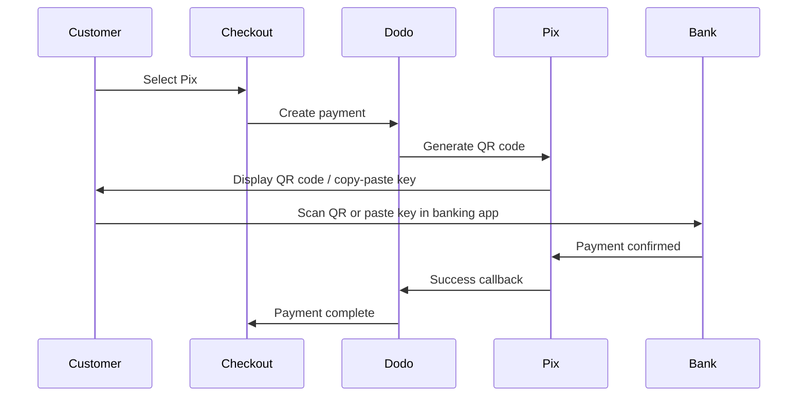

Pix est le système de paiement instantané du Brésil créé par la Banque Centrale du Brésil (Banco Central do Brasil). Il permet des transferts en temps réel 24h/24 et 7j/7, y compris les week-ends et jours fériés, et est devenu la méthode de paiement la plus populaire au Brésil.

## Pourquoi proposer Pix ?

<CardGroup cols={3}>
<Card title="Dominant in Brazil" icon="chart-line">
Pix est la méthode de paiement la plus utilisée au Brésil, dépassant les cartes de crédit et le boleto.
</Card>

<Card title="Instant Settlement" icon="bolt">
Les paiements sont confirmés en quelques secondes, 24/7/365 — pas besoin d'attendre les fenêtres de traitement bancaire.
</Card>

<Card title="Low Friction" icon="mobile">
Les clients paient via un code QR ou une clé à copier-coller — pas besoin de numéros de carte ou de coordonnées bancaires.
</Card>
</CardGroup>

## Vue d'ensemble

| Détail | Valeur |
| :----- | :---- |
| **Devise de facturation** | BRL |
| **Pays pris en charge** | Brésil |
| **Abonnements** | Non |
| **Montant minimum** | $0.50 |
| **Règlement** | Instantané |

## Comment ça fonctionne



## Expérience client

1. Le client sélectionne Pix lors du paiement
2. Un code QR et une clé à copier-coller s'affichent
3. Le client ouvre son application bancaire et scanne le code QR ou colle la clé
4. Le paiement est confirmé instantanément
5. Le client est redirigé vers la page de succès

<Info>
Les codes QR Pix expirent généralement après une période déterminée. Si le client ne termine pas le paiement à temps, il doit recommencer le processus de paiement.
</Info>

## Configuration

```javascript
const session = await client.checkoutSessions.create({
  product_cart: [{ product_id: 'prod_123', quantity: 1 }],
  allowed_payment_method_types: ['pix', 'credit', 'debit'],
  billing_currency: 'BRL',
  return_url: 'https://example.com/success'
});
```

## Type de méthode API

| Type | Méthode | Pays |
| :--- | :----- | :------ |
| `pix` | Pix | Brésil |

## Test

<Steps>
<Step title="Enable test mode">
Utilisez vos clés API de test Dodo Payments.
</Step>

<Step title="Set billing currency to BRL">
Assurez-vous que la devise de facturation est définie sur `BRL` dans votre demande de paiement.
</Step>

<Step title="Enter test CPF and scan the QR code">
Lorsqu'un CPF Pix est demandé, entrez `1234567890`. Un code QR de test sera généré — scannez-le avec votre caméra de téléphone normale (aucune application Pix requise). Vous serez redirigé vers une page de test Stripe où vous pourrez simuler la transaction comme un succès ou un échec.
</Step>
</Steps>

## Bonnes pratiques

<AccordionGroup>
<Accordion title="Set billing currency to BRL">
Pix ne fonctionne qu'avec le BRL. Assurez-vous que vos prix prennent en charge les transactions en réals brésiliens pour le marché brésilien.
</Accordion>

<Accordion title="Provide card fallbacks">
Tous les clients brésiliens ne préfèrent pas nécessairement Pix. Incluez toujours `credit` et `debit` comme options de secours.
</Accordion>

<Accordion title="Handle QR code expiration">
Les codes QR Pix expirent après une période déterminée. Assurez-vous que votre processus de paiement gère l'expiration de manière fluide et permet aux clients de régénérer le code.
</Accordion>
</AccordionGroup>

## Dépannage

<AccordionGroup>
<Accordion title="Pix not appearing at checkout">
**Vérifiez :**
1. La devise de facturation est-elle définie sur `BRL` ?
2. `pix` est-il inclus dans `allowed_payment_method_types` ?
3. Le pays de facturation du client est-il le Brésil ?

**Solution :** Pix est uniquement disponible pour les transactions en BRL. Vérifiez la devise et l'adresse de facturation dans votre requête API.
</Accordion>

<Accordion title="QR code expired">
**Cause :** Le client n'a pas complété le paiement dans le délai d'expiration.

**Solution :** Le client doit redémarrer le processus de paiement pour générer un nouveau code QR.
</Accordion>

<Accordion title="Payment pending">
**Cause :** Les paiements Pix sont confirmés instantanément dans la plupart des cas, mais des retards occasionnels côté banque peuvent survenir.

**Solution :** Surveillez les webhooks pour la confirmation de paiement. Si le paiement n'est pas confirmé dans quelques minutes, traitez-le comme échoué.
</Accordion>
</AccordionGroup>

## Pages connexes

<CardGroup cols={2}>
<Card title="Payment Methods Overview" icon="credit-card" href="/features/payment-methods">
Voir toutes les méthodes de paiement prises en charge.
</Card>

<Card title="Adaptive Currency" icon="globe" href="/features/adaptive-currency">
Prise en charge des devises et conversion automatique.
</Card>

<Card title="Checkout Guide" icon="book" href="/developer-resources/checkout-session">
Guide complet d'implémentation du processus de paiement.
</Card>

<Card title="Webhooks" icon="webhook" href="/developer-resources/webhooks">
Gérer les confirmations de paiement de manière asynchrone.
</Card>
</CardGroup>
