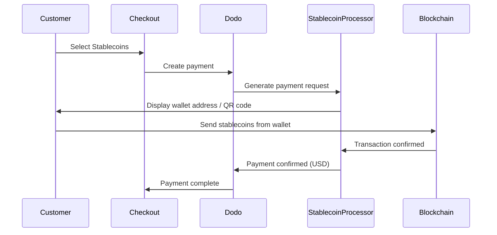

Les paiements en stablecoins permettent aux clients de payer avec des stablecoins depuis n'importe où dans le monde (sauf en Inde). Les transactions sont facturées en USD, vous recevez donc la monnaie fiduciaire tandis que les clients paient avec leur portefeuille de stablecoins préféré.

## Pourquoi offrir les Stablecoins ?

<CardGroup cols={3}>
<Card title="Global Reach" icon="globe">
Acceptez les paiements de n'importe quel pays — aucune infrastructure bancaire requise du côté du client.
</Card>

<Card title="No Chargebacks" icon="shield-check">
Les transactions en stablecoins sont irréversibles, éliminant ainsi complètement la fraude par rétrofacturation.
</Card>

<Card title="USD Settlement" icon="dollar-sign">
Vous recevez des USD — pas besoin de gérer la volatilité ou les portefeuilles.
</Card>
</CardGroup>

## Aperçu

| Détail | Valeur |
| :----- | :---- |
| **Devise de facturation** | USD |
| **Pays pris en charge** | Global (sauf IN) |
| **Abonnements** | Non |
| **Montant minimum** | $0.50 |
| **Règlement** | USD |

## Comment ça fonctionne



## Expérience client

1. Le client sélectionne Stablecoins à la caisse
2. Une adresse de portefeuille et un code QR s'affichent avec le montant en stablecoins
3. Le client envoie le montant exact depuis son portefeuille de stablecoins
4. La transaction est confirmée sur la blockchain
5. Le client est redirigé vers la page de succès

<Info>
Les paiements en stablecoins sont facturés en USD. Le montant en stablecoins affiché à la caisse reflète le taux de change en temps réel au moment du paiement.
</Info>

## Devises et réseaux pris en charge

| Devise | Réseaux |
| :------- | :------- |
| **USDC** | Ethereum, Solana, Polygon, Base |
| **USDP** | Ethereum, Solana |
| **USDG** | Ethereum |

## Configuration

```javascript
const session = await client.checkoutSessions.create({
  product_cart: [{ product_id: 'prod_123', quantity: 1 }],
  allowed_payment_method_types: ['crypto', 'credit', 'debit'],
  return_url: 'https://example.com/success'
});
```

## Type de méthode API

| Type | Méthode | Pays |
| :--- | :----- | :------ |
| `crypto` | Stablecoins | Global (sauf IN) |

## Tests

<Steps>
<Step title="Enable test mode">
Utilisez vos clés API de test de Dodo Payments.
</Step>

<Step title="Create a test checkout">
Créez une session de paiement avec `crypto` dans les méthodes de paiement autorisées.
</Step>

<Step title="Complete the test flow">
Suivez le flux de paiement stablecoin simulé dans l'environnement de test.
</Step>
</Steps>

## Meilleures pratiques

<AccordionGroup>
<Accordion title="Always include card fallbacks">
Tous les clients ne possèdent pas de portefeuilles de stablecoins. Incluez toujours `credit` et `debit` comme méthodes de paiement de secours.
</Accordion>

<Accordion title="Set clear expectations on confirmation time">
Les confirmations sur la blockchain peuvent prendre des minutes selon le réseau. Assurez-vous que votre caisse communique cela aux clients.
</Accordion>

<Accordion title="Handle underpayments and overpayments">
Les paiements en stablecoins peuvent parfois différer légèrement du montant exact en raison des frais de réseau. Surveillez les webhooks pour les mises à jour du statut du paiement.
</Accordion>
</AccordionGroup>

## Dépannage

<AccordionGroup>
<Accordion title="Stablecoins not appearing at checkout">
**Vérifiez :**
1. `crypto` est-elle incluse dans `allowed_payment_method_types` ?
2. Le montant de la transaction atteint-il le minimum ($0.50) ?

**Solution :** Vérifiez que le type de méthode de paiement est correctement transmis dans votre demande API.
</Accordion>

<Accordion title="Payment not confirming">
**Cause :** Les temps de confirmation sur la blockchain varient. Certains réseaux prennent plus de temps que d'autres.

**Solution :** Attendez la confirmation du webhook. Ne considérez pas le paiement comme échoué tant que la fenêtre de confirmation n'est pas passée.
</Accordion>

<Accordion title="Amount mismatch">
**Cause :** Les frais de réseau peuvent entraîner une différence entre le montant reçu et le montant demandé.

**Solution :** Surveillez les webhooks pour le montant final confirmé. Les petites divergences sont traitées automatiquement.
</Accordion>
</AccordionGroup>

## Pages connexes

<CardGroup cols={2}>
<Card title="Payment Methods Overview" icon="credit-card" href="/features/payment-methods">
Voir tous les moyens de paiement pris en charge.
</Card>

<Card title="Checkout Guide" icon="book" href="/developer-resources/checkout-session">
Guide complet de mise en œuvre du paiement.
</Card>

<Card title="Webhooks" icon="webhook" href="/developer-resources/webhooks">
Gérez les confirmations de paiement de manière asynchrone.
</Card>

<Card title="Testing Process" icon="flask" href="/miscellaneous/testing-process">
Guide complet de test pour tous les moyens de paiement.
</Card>
</CardGroup>
