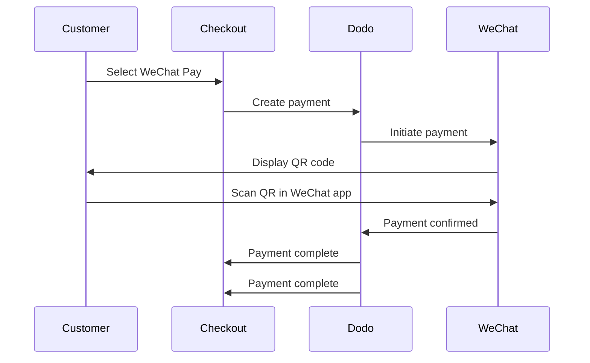

WeChat Pay est l'une des deux principales plateformes de paiement mobile en Chine, utilisée par plus d'un milliard de personnes. Elle permet des paiements via des codes QR dans l'application WeChat, ce qui la rend essentielle pour les entreprises ciblant les consommateurs chinois.

## Pourquoi proposer WeChat Pay ?

<CardGroup cols={3}>
<Card title="1B+ Users" icon="users">
WeChat Pay est utilisé par plus d'un milliard de personnes, ce qui en fait l'une des plus grandes plateformes de paiement au monde.
</Card>

<Card title="Mobile-First" icon="mobile">
Les paiements sont effectués entièrement dans l'application WeChat — rapide, familier et sans friction pour les clients chinois.
</Card>

<Card title="Dual Currency" icon="money-bill-transfer">
Acceptez les paiements en USD et CNY, offrant ainsi une flexibilité pour les transactions transfrontalières et nationales.
</Card>
</CardGroup>

## Aperçu

| Détail | Valeur |
| :----- | :---- |
| **Devise de facturation** | USD, CNY |
| **Abonnements** | Non |
| **Montant minimum** | $0.50 / ¥1.00 |
| **Règlement** | USD |

## Comment ça fonctionne



## Expérience client

1. Le client sélectionne WeChat Pay lors du paiement
2. Un code QR s'affiche sur la page de paiement
3. Le client ouvre WeChat sur son téléphone et scanne le code QR
4. Le client confirme le paiement dans l'application WeChat
5. Le paiement est confirmé instantanément et le client est redirigé vers la page de réussite

<Info>
Les clients paient en USD ou CNY, et vous recevez le règlement en USD.
</Info>

## Configuration

```javascript
const session = await client.checkoutSessions.create({
  product_cart: [{ product_id: 'prod_123', quantity: 1 }],
  allowed_payment_method_types: ['wechat_pay', 'credit', 'debit'],
  return_url: 'https://example.com/success'
});
```

## Type de méthode API

| Type | Méthode | Devises |
| :--- | :----- | :--------- |
| `wechat_pay` | WeChat Pay | USD, CNY |

## Test

<Steps>
<Step title="Enable test mode">
Utilisez vos clés API de test Dodo Payments.
</Step>

<Step title="Create a test checkout">
Créez une session de paiement avec `wechat_pay` dans les méthodes de paiement autorisées.
</Step>

<Step title="Scan the QR code">
Un code QR de test sera généré — scannez-le avec votre appareil photo habituel (aucune application WeChat nécessaire). Vous serez redirigé vers une page de test où vous pourrez simuler la transaction comme un succès ou un échec.
</Step>
</Steps>

## Bonnes pratiques

<AccordionGroup>
<Accordion title="Target Chinese customers">
WeChat Pay est principalement utilisé par les consommateurs chinois. Incluez-le lorsque votre clientèle comprend des acheteurs chinois ou que vous ciblez le marché chinois.
</Accordion>

<Accordion title="Always include card fallbacks">
Tous les clients n'ont pas WeChat. Incluez toujours `credit` et `debit` comme méthodes de paiement alternatives.
</Accordion>

<Accordion title="Optimize for mobile">
De nombreux utilisateurs de WeChat Pay naviguent sur mobile. Assurez-vous que votre page de paiement est réactive — le scan du code QR fonctionne mieux lorsque le paiement est affiché sur un ordinateur de bureau ou une tablette tandis que le client le scanne avec son téléphone.
</Accordion>

<Accordion title="Consider both currencies">
WeChat Pay prend en charge l'USD et le CNY. Choisissez la devise de facturation qui convient le mieux à votre marché cible — USD pour les transactions transfrontalières, CNY pour les transactions domestiques chinoises.
</Accordion>
</AccordionGroup>

## Dépannage

<AccordionGroup>
<Accordion title="WeChat Pay not appearing at checkout">
**Vérification :**
1. `wechat_pay` inclus dans `allowed_payment_method_types` ?
2. Devise de facturation définie sur USD ou CNY ?
3. Le montant de la transaction atteint-il le minimum ?

**Solution :** Vérifiez que le type de méthode de paiement et la devise sont correctement passés dans votre requête API.
</Accordion>

<Accordion title="QR code not scanning">
**Cause :** Le code QR peut avoir expiré ou la version de WeChat du client est obsolète.

**Solution :** Actualisez la page de paiement pour générer un nouveau code QR. Assurez-vous que le client utilise une version actuelle de WeChat.
</Accordion>

<Accordion title="Payment not confirming">
**Cause :** WeChat Pay confirme généralement immédiatement, mais des délais réseau peuvent survenir.

**Solution :** Surveillez les webhooks pour la confirmation de paiement. Si le paiement n'est pas confirmé en quelques minutes, le client pourrait devoir réessayer.
</Accordion>
</AccordionGroup>

## Pages connexes

<CardGroup cols={2}>
<Card title="Payment Methods Overview" icon="credit-card" href="/features/payment-methods">
Voir toutes les méthodes de paiement prises en charge.
</Card>

<Card title="Checkout Guide" icon="book" href="/developer-resources/checkout-session">
Guide de mise en œuvre complet du paiement.
</Card>

<Card title="Webhooks" icon="webhook" href="/developer-resources/webhooks">
Gérer les confirmations de paiement de manière asynchrone.
</Card>

<Card title="Testing Process" icon="flask" href="/miscellaneous/testing-process">
Guide complet de test pour toutes les méthodes de paiement.
</Card>
</CardGroup>
